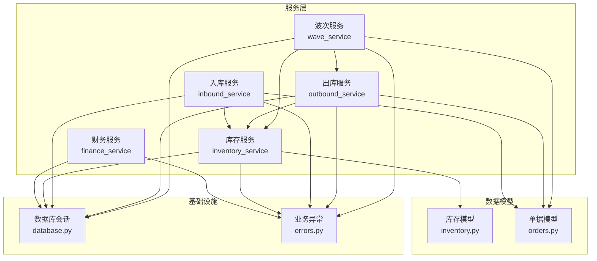
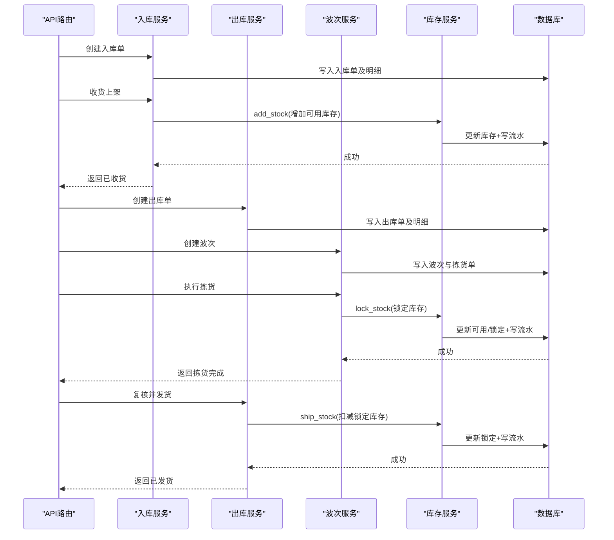
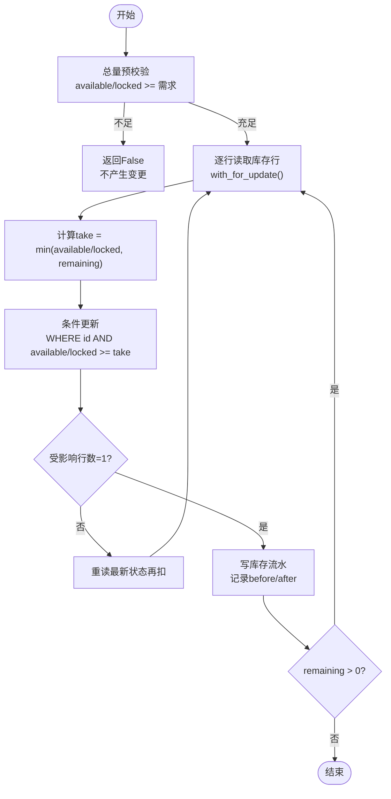
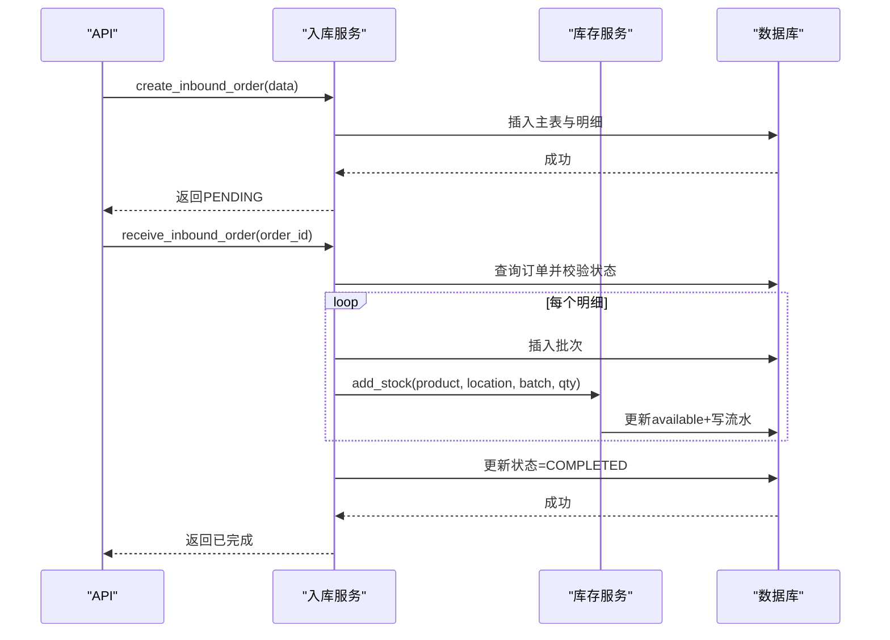
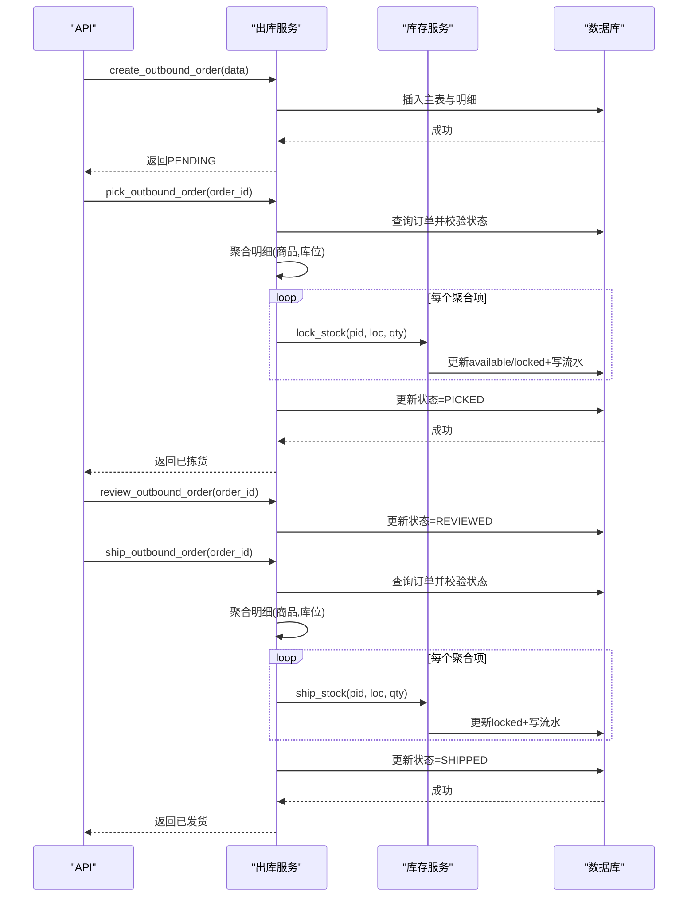
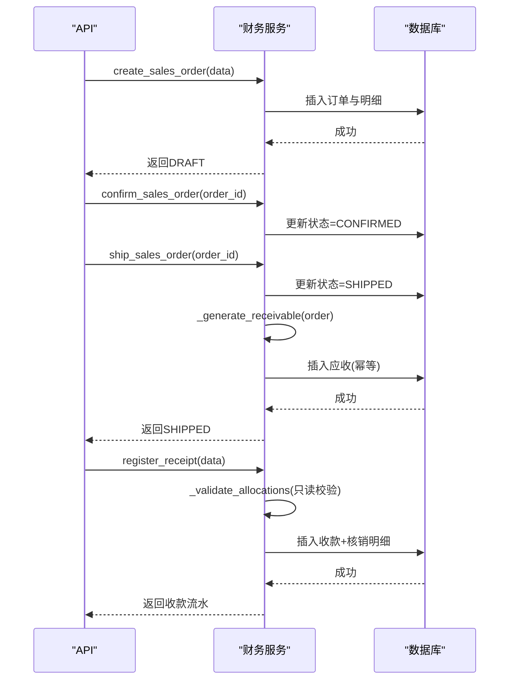
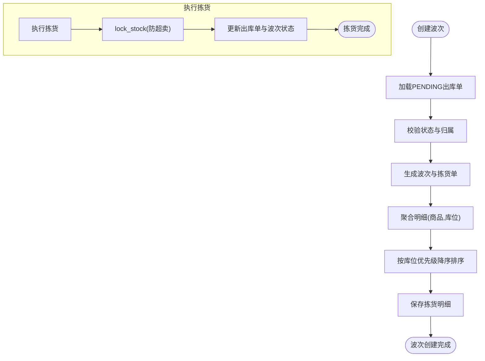
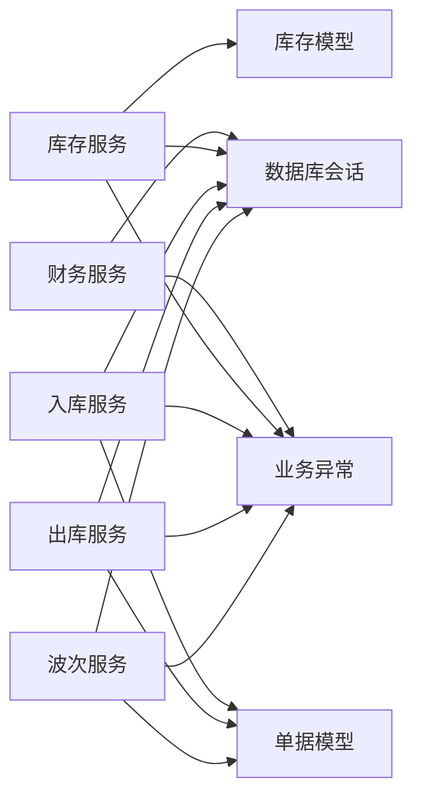

# 业务服务层

<cite>
**本文引用的文件**
- [inventory_service.py](file://backend-python/app/services/inventory_service.py)
- [inbound_service.py](file://backend-python/app/services/inbound_service.py)
- [outbound_service.py](file://backend-python/app/services/outbound_service.py)
- [finance_service.py](file://backend-python/app/services/finance_service.py)
- [wave_service.py](file://backend-python/app/services/wave_service.py)
- [inventory.py](file://backend-python/app/models/inventory.py)
- [orders.py](file://backend-python/app/models/orders.py)
- [errors.py](file://backend-python/app/common/errors.py)
- [database.py](file://backend-python/app/database.py)
</cite>

## 目录
1. [简介](#简介)
2. [项目结构](#项目结构)
3. [核心组件](#核心组件)
4. [架构总览](#架构总览)
5. [详细组件分析](#详细组件分析)
6. [依赖关系分析](#依赖关系分析)
7. [性能与并发特性](#性能与并发特性)
8. [故障排查指南](#故障排查指南)
9. [结论](#结论)
10. [附录：配置、参数与返回值](#附录：配置参数与返回值)

## 简介
本章节面向WMS系统的业务服务层，聚焦库存、入库、出库、财务与波次拣货五大服务。文档重点说明：
- 统一入口设计：所有库存变动必须通过库存服务的统一接口，强制写流水，保证全量可追溯。
- 并发控制与防超卖：采用“总量预校验 + 条件更新 + 行锁”的组合策略，避免并发下陈旧读覆盖导致的超卖。
- 状态机与事务：入库、出库、波次、财务均基于明确的状态机推进；关键流程在数据库事务中执行，失败回滚不留半成品。
- 聚合算法与优先级：波次拣货按(商品,库位)聚合并按库位优先级降序生成拣货路径，提升拣货效率。
- 与其他组件的关系：服务层通过模型访问数据库，通过路由暴露API，通过错误模块统一异常处理。

## 项目结构
后端采用分层架构：
- API路由层（routers）：接收HTTP请求，调用服务层。
- 服务层（services）：封装业务逻辑、状态机、事务边界、并发控制。
- 数据模型（models）：定义表结构与关系。
- 通用工具（common）：订单号生成、业务异常等。
- 数据库（database）：连接与会话管理。

图表来源
- [inventory_service.py:1-10](file://backend-python/app/services/inventory_service.py#L1-L10)
- [inbound_service.py:1-15](file://backend-python/app/services/inbound_service.py#L1-L15)
- [outbound_service.py:1-20](file://backend-python/app/services/outbound_service.py#L1-L20)
- [finance_service.py:1-43](file://backend-python/app/services/finance_service.py#L1-L43)
- [wave_service.py:1-28](file://backend-python/app/services/wave_service.py#L1-L28)
- [inventory.py:1-98](file://backend-python/app/models/inventory.py#L1-L98)
- [orders.py:1-138](file://backend-python/app/models/orders.py#L1-L138)
- [database.py:1-38](file://backend-python/app/database.py#L1-L38)
- [errors.py:1-9](file://backend-python/app/common/errors.py#L1-L9)

章节来源
- [inventory_service.py:1-10](file://backend-python/app/services/inventory_service.py#L1-L10)
- [inbound_service.py:1-15](file://backend-python/app/services/inbound_service.py#L1-L15)
- [outbound_service.py:1-20](file://backend-python/app/services/outbound_service.py#L1-L20)
- [finance_service.py:1-43](file://backend-python/app/services/finance_service.py#L1-L43)
- [wave_service.py:1-28](file://backend-python/app/services/wave_service.py#L1-L28)
- [inventory.py:1-98](file://backend-python/app/models/inventory.py#L1-L98)
- [orders.py:1-138](file://backend-python/app/models/orders.py#L1-L138)
- [database.py:1-38](file://backend-python/app/database.py#L1-L38)
- [errors.py:1-9](file://backend-python/app/common/errors.py#L1-L9)

## 核心组件
- 库存服务：提供统一的库存加减、锁定、发货能力，强制写流水，支持跨批次扣减与并发安全。
- 入库服务：创建待收货单，收货上架时生成批次并增加可用库存，写入库流水。
- 出库服务：创建待拣货单，拣货锁定库存，复核后发货扣减锁定库存，写出库流水。
- 财务服务：销售订单确认与发货生成应收，收款登记与核销，账龄统计与经营驾驶舱。
- 波次服务：聚合多张待拣货出库单生成波次与拣货单，按库位优先级排序，驱动出库单与波次状态推进。

章节来源
- [inventory_service.py:1-10](file://backend-python/app/services/inventory_service.py#L1-L10)
- [inbound_service.py:1-15](file://backend-python/app/services/inbound_service.py#L1-L15)
- [outbound_service.py:1-20](file://backend-python/app/services/outbound_service.py#L1-L20)
- [finance_service.py:1-43](file://backend-python/app/services/finance_service.py#L1-L43)
- [wave_service.py:1-28](file://backend-python/app/services/wave_service.py#L1-L28)

## 架构总览
库存服务是核心枢纽，所有库存变动都经过它，确保一致性与可追溯性。入库、出库、波次服务在其之上构建业务流程；财务服务独立于库存，但通过订单号关联，形成业财一体闭环。

图表来源
- [inbound_service.py:92-129](file://backend-python/app/services/inbound_service.py#L92-L129)
- [outbound_service.py:102-176](file://backend-python/app/services/outbound_service.py#L102-L176)
- [wave_service.py:62-197](file://backend-python/app/services/wave_service.py#L62-L197)
- [inventory_service.py:75-251](file://backend-python/app/services/inventory_service.py#L75-L251)

## 详细组件分析

### 库存服务（统一入口、并发控制与防超卖）
- 统一入口：所有库存变动通过add_stock、deduct_stock、lock_stock、ship_stock四个方法，强制写InventoryFlow流水。
- 跨批次扣减：deduct_stock按库存行ID升序逐行扣减，优先消耗早期批次，提高周转率。
- 防超卖双保险：
  - 总量预校验：先SUM可用或锁定库存，不足直接返回False，无副作用。
  - 条件更新：使用UPDATE WHERE available/locked >= take，防止并发下陈旧读覆盖他人提交。
  - 行锁：with_for_update()在生产库(PostgreSQL)加行锁；SQLite忽略，但条件更新仍有效。
- 事务要求：调用方需处于事务中，中间写入随上层回滚撤销。

图表来源
- [inventory_service.py:91-144](file://backend-python/app/services/inventory_service.py#L91-L144)
- [inventory_service.py:147-202](file://backend-python/app/services/inventory_service.py#L147-L202)
- [inventory_service.py:205-251](file://backend-python/app/services/inventory_service.py#L205-L251)

章节来源
- [inventory_service.py:1-10](file://backend-python/app/services/inventory_service.py#L1-L10)
- [inventory_service.py:75-251](file://backend-python/app/services/inventory_service.py#L75-L251)
- [inventory.py:33-98](file://backend-python/app/models/inventory.py#L33-L98)

### 入库服务（状态机与事务）
- 状态机：PENDING → COMPLETED。
- 创建入库单：校验商品与库位存在，生成唯一单号，写入主从表，事务提交。
- 收货上架：为每个明细生成批次（批次号=单号-明细id），调用add_stock增加可用库存，写入库流水，状态置COMPLETED。
- 事务与回滚：整个收货流程在一个事务内，任一步失败全部回滚。

图表来源
- [inbound_service.py:38-82](file://backend-python/app/services/inbound_service.py#L38-L82)
- [inbound_service.py:92-129](file://backend-python/app/services/inbound_service.py#L92-L129)
- [inventory_service.py:75-88](file://backend-python/app/services/inventory_service.py#L75-L88)

章节来源
- [inbound_service.py:1-150](file://backend-python/app/services/inbound_service.py#L1-L150)
- [orders.py:17-48](file://backend-python/app/models/orders.py#L17-L48)
- [inventory.py:18-31](file://backend-python/app/models/inventory.py#L18-L31)

### 出库服务（状态机、聚合与防超卖）
- 状态机：PENDING → PICKED → REVIEWED → SHIPPED。
- 创建出库单：校验商品与库位，生成唯一单号，写入主从表。
- 拣货：聚合同一(商品,库位)的明细，调用lock_stock锁定库存，失败整体回滚。
- 复核：仅状态推进，不做库存操作。
- 发货：再次聚合明细，调用ship_stock扣减锁定库存，失败整体回滚。

图表来源
- [outbound_service.py:42-86](file://backend-python/app/services/outbound_service.py#L42-L86)
- [outbound_service.py:102-176](file://backend-python/app/services/outbound_service.py#L102-L176)
- [inventory_service.py:147-251](file://backend-python/app/services/inventory_service.py#L147-L251)

章节来源
- [outbound_service.py:1-196](file://backend-python/app/services/outbound_service.py#L1-L196)
- [orders.py:50-81](file://backend-python/app/models/orders.py#L50-L81)

### 财务服务（业财一体、幂等与账龄）
- 销售订单：草稿→确认→发货→完成；发货在同一事务内生成应收（幂等）。
- 应收生成：预查是否存在，若不存在则插入FinanceEntry，设置发生日与到期日（发货日+账期）。
- 收款与核销：登记收款，支持部分核销；核销前只读校验，通过后写入核销明细并更新目标与收款状态。
- 账龄与驾驶舱：以到期日为基准分段统计未结余额，提供Top客户与趋势图。

图表来源
- [finance_service.py:118-162](file://backend-python/app/services/finance_service.py#L118-L162)
- [finance_service.py:246-268](file://backend-python/app/services/finance_service.py#L246-L268)
- [finance_service.py:295-336](file://backend-python/app/services/finance_service.py#L295-L336)
- [finance_service.py:411-439](file://backend-python/app/services/finance_service.py#L411-L439)

章节来源
- [finance_service.py:1-607](file://backend-python/app/services/finance_service.py#L1-L607)
- [orders.py:1-300](file://backend-python/app/models/orders.py#L1-L300)

### 波次拣货服务（聚合算法与优先级排序）
- 创建波次：选择多张PENDING出库单，逐单生成拣货单；明细按(商品,库位)聚合，并按库位优先级降序排序，模拟最优拣货路径。
- 执行拣货：对每个拣货单明细调用lock_stock锁定库存，失败整体回滚；同步推进出库单状态与波次状态。
- 波次状态机：CREATED → PICKING（首单开始拣货）→ COMPLETED（全部拣货完成）。

图表来源
- [wave_service.py:62-131](file://backend-python/app/services/wave_service.py#L62-L131)
- [wave_service.py:153-197](file://backend-python/app/services/wave_service.py#L153-L197)
- [outbound_service.py:102-133](file://backend-python/app/services/outbound_service.py#L102-L133)
- [inventory_service.py:147-202](file://backend-python/app/services/inventory_service.py#L147-L202)

章节来源
- [wave_service.py:1-238](file://backend-python/app/services/wave_service.py#L1-L238)
- [orders.py:83-138](file://backend-python/app/models/orders.py#L83-L138)

## 依赖关系分析
- 服务间耦合：
  - 入库/出库/波次服务依赖库存服务进行库存操作。
  - 波次服务依赖出库服务进行状态推进。
  - 财务服务独立，但通过订单号与出库/销售订单关联。
- 数据模型依赖：
  - 库存服务依赖Batch、Inventory、InventoryFlow。
  - 入库/出库/波次服务依赖InboundOrder、OutboundOrder、Wave、PickingOrder及其明细。
- 基础设施依赖：
  - 所有服务通过database.py获取SessionLocal。
  - 统一通过errors.py抛出BusinessError。

图表来源
- [inventory_service.py:1-10](file://backend-python/app/services/inventory_service.py#L1-L10)
- [inbound_service.py:1-15](file://backend-python/app/services/inbound_service.py#L1-L15)
- [outbound_service.py:1-20](file://backend-python/app/services/outbound_service.py#L1-L20)
- [wave_service.py:1-28](file://backend-python/app/services/wave_service.py#L1-L28)
- [finance_service.py:1-43](file://backend-python/app/services/finance_service.py#L1-L43)
- [inventory.py:1-98](file://backend-python/app/models/inventory.py#L1-L98)
- [orders.py:1-138](file://backend-python/app/models/orders.py#L1-L138)
- [database.py:1-38](file://backend-python/app/database.py#L1-L38)
- [errors.py:1-9](file://backend-python/app/common/errors.py#L1-L9)

章节来源
- [inventory_service.py:1-10](file://backend-python/app/services/inventory_service.py#L1-L10)
- [inbound_service.py:1-15](file://backend-python/app/services/inbound_service.py#L1-L15)
- [outbound_service.py:1-20](file://backend-python/app/services/outbound_service.py#L1-L20)
- [wave_service.py:1-28](file://backend-python/app/services/wave_service.py#L1-L28)
- [finance_service.py:1-43](file://backend-python/app/services/finance_service.py#L1-L43)
- [inventory.py:1-98](file://backend-python/app/models/inventory.py#L1-L98)
- [orders.py:1-138](file://backend-python/app/models/orders.py#L1-L138)
- [database.py:1-38](file://backend-python/app/database.py#L1-L38)
- [errors.py:1-9](file://backend-python/app/common/errors.py#L1-L9)

## 性能与并发特性
- 索引优化：库存表对location_code、product_id建索引；流水表对order_no、product_id、created_at建索引，提升查询性能。
- 批量聚合：出库与波次对同一(商品,库位)的明细进行聚合，减少重复库存操作。
- 并发安全：
  - 条件更新：WHERE available/locked >= take，防止并发覆盖。
  - 行锁：with_for_update()在PostgreSQL生效，SQLite忽略但条件更新仍有效。
  - 总量预校验：快速失败，减少无效更新。
- N+1问题：使用joinedload一次性加载关联对象，避免响应拼接时的多次查询。

章节来源
- [inventory.py:33-98](file://backend-python/app/models/inventory.py#L33-L98)
- [outbound_service.py:107-128](file://backend-python/app/services/outbound_service.py#L107-L128)
- [wave_service.py:107-121](file://backend-python/app/services/wave_service.py#L107-L121)
- [inventory_service.py:101-144](file://backend-python/app/services/inventory_service.py#L101-L144)
- [inventory_service.py:156-202](file://backend-python/app/services/inventory_service.py#L156-L202)

## 故障排查指南
- 库存不足：
  - 现象：lock_stock或ship_stock返回False，或抛出BusinessError提示库存不足。
  - 排查：检查总量预校验是否通过，逐行条件更新是否被并发修改。
  - 解决：确保上游未重复提交；检查是否有其他并发操作占用库存。
- 单号冲突：
  - 现象：创建订单或流水时抛出IntegrityError，重试多次后仍失败。
  - 排查：检查唯一约束是否被破坏；确认生成单号的逻辑。
  - 解决：重试机制已内置；若持续失败，检查数据库唯一索引与并发竞争。
- 状态不允许：
  - 现象：当前状态与期望状态不一致，抛出BusinessError。
  - 排查：检查状态机流转是否正确；确认前端或上游调用顺序。
  - 解决：修正调用顺序；必要时重置状态或补偿。
- 事务回滚：
  - 现象：关键步骤失败导致整单回滚，无半成品。
  - 排查：查看异常堆栈与日志；确认是否在事务中执行。
  - 解决：修复业务逻辑错误；确保调用方正确管理事务边界。

章节来源
- [outbound_service.py:120-128](file://backend-python/app/services/outbound_service.py#L120-L128)
- [outbound_service.py:163-171](file://backend-python/app/services/outbound_service.py#L163-L171)
- [wave_service.py:170-179](file://backend-python/app/services/wave_service.py#L170-L179)
- [finance_service.py:323-329](file://backend-python/app/services/finance_service.py#L323-L329)
- [errors.py:1-9](file://backend-python/app/common/errors.py#L1-L9)

## 结论
本业务服务层以库存服务为核心，通过统一入口、并发控制与事务保障，实现了高可靠性的库存管理。入库、出库、波次与财务服务围绕状态机与聚合算法，构建了完整的仓储与业财一体化流程。建议在生产环境使用PostgreSQL以获得行锁支持，并结合监控与日志完善可观测性。

## 附录：配置、参数与返回值
- 数据库配置：
  - 环境变量DATABASE_URL：切换MySQL/PostgreSQL；默认SQLite用于开发。
  - SessionLocal：autocommit=False，由调用方管理事务。
- 库存服务参数与返回值：
  - add_stock：product_id, location_code, batch_id, quantity, flow_type, order_type, order_no, remark → 返回Inventory。
  - deduct_stock：product_id, location_code, quantity, flow_type, order_type, order_no, remark → 返回bool。
  - lock_stock：product_id, location_code, quantity, order_type, order_no, remark → 返回bool。
  - ship_stock：product_id, location_code, quantity, order_type, order_no, remark → 返回bool。
  - query_inventory：view, keyword, warehouse_id, batch_no, page, page_size → 返回{list, total, page, pageSize}。
  - query_flows：order_no, product_id, location_code, flow_type, page, page_size → 返回{list, total, page, pageSize}。
  - query_batches：keyword, page, page_size → 返回{list, total, page, pageSize}。
- 入库服务参数与返回值：
  - create_inbound_order：data(items[], supplier_name, remark) → 返回InboundOrder。
  - receive_inbound_order：order_id → 返回InboundOrder。
  - list_inbound_orders：status, page, page_size → 返回{list, total, page, pageSize}。
- 出库服务参数与返回值：
  - create_outbound_order：data(items[], customer_name, remark) → 返回OutboundOrder。
  - pick_outbound_order：order_id → 返回OutboundOrder。
  - review_outbound_order：order_id → 返回OutboundOrder。
  - ship_outbound_order：order_id → 返回OutboundOrder。
  - list_outbound_orders：status, page, page_size → 返回{list, total, page, pageSize}。
- 财务服务参数与返回值：
  - create_sales_order：data(customer_id, items[], credit_days, remark) → 返回SalesOrder。
  - confirm_sales_order：order_id → 返回SalesOrder。
  - ship_sales_order：order_id, outbound_order_no? → 返回SalesOrder。
  - register_receipt：data(amount, partner_*, allocations?) → 返回FinanceEntry。
  - allocate_receipt：receipt_entry_id, allocations → 返回FinanceEntry。
  - receivable_aging：无参 → 返回列表。
  - executive_summary：无参 → 返回字典。
  - trends：days → 返回列表。
- 波次服务参数与返回值：
  - create_wave：outbound_order_ids[], remark? → 返回Wave。
  - pick_picking_order：picking_order_id → 返回PickingOrder。
  - list_waves：status, page, page_size → 返回{list, total, page, pageSize}。
  - list_picking_orders：wave_id?, status, page, page_size → 返回{list, total, page, pageSize}。

章节来源
- [database.py:1-38](file://backend-python/app/database.py#L1-L38)
- [inventory_service.py:75-437](file://backend-python/app/services/inventory_service.py#L75-L437)
- [inbound_service.py:38-150](file://backend-python/app/services/inbound_service.py#L38-L150)
- [outbound_service.py:42-196](file://backend-python/app/services/outbound_service.py#L42-L196)
- [finance_service.py:118-607](file://backend-python/app/services/finance_service.py#L118-L607)
- [wave_service.py:62-238](file://backend-python/app/services/wave_service.py#L62-L238)