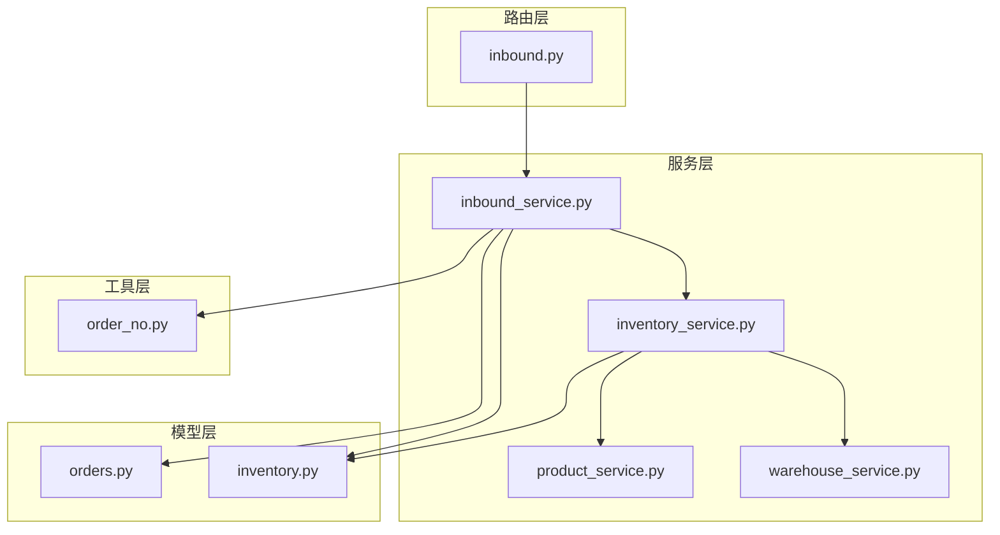
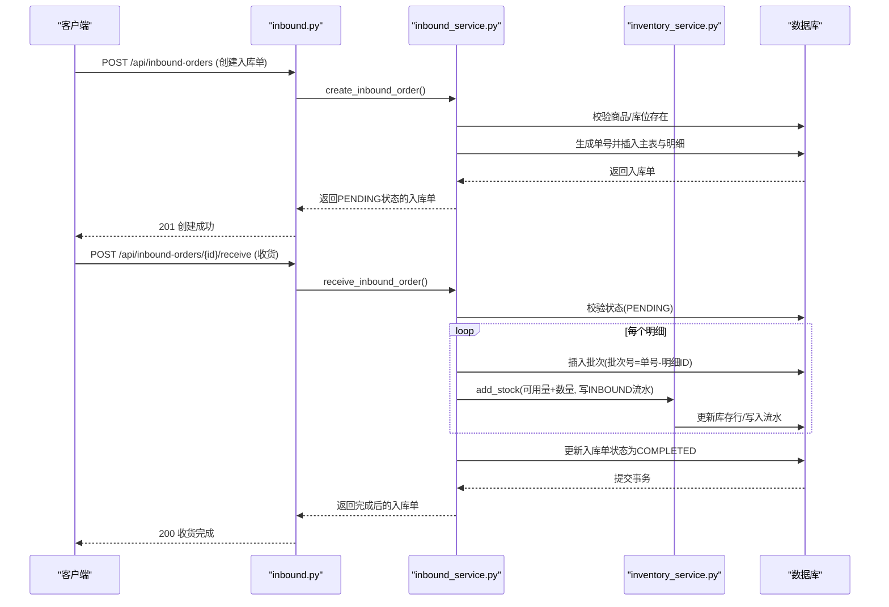
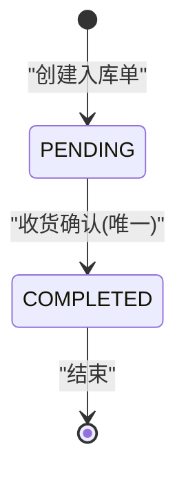
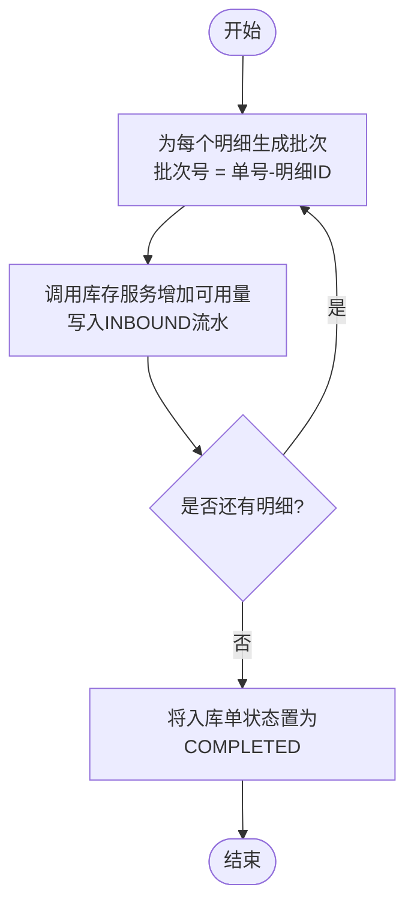
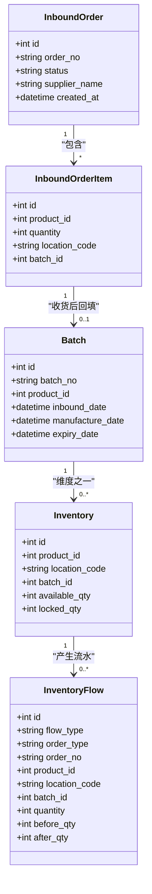
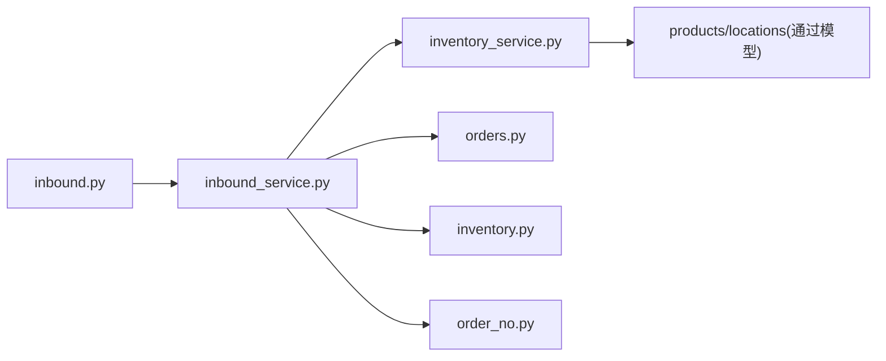

# 入库服务

<cite>
**本文引用的文件**
- [backend-python/app/routers/inbound.py](file://backend-python/app/routers/inbound.py)
- [backend-python/app/services/inbound_service.py](file://backend-python/app/services/inbound_service.py)
- [backend-python/app/models/orders.py](file://backend-python/app/models/orders.py)
- [backend-python/app/models/inventory.py](file://backend-python/app/models/inventory.py)
- [backend-python/app/services/inventory_service.py](file://backend-python/app/services/inventory_service.py)
- [backend-python/app/schemas/orders.py](file://backend-python/app/schemas/orders.py)
- [backend-python/app/common/order_no.py](file://backend-python/app/common/order_no.py)
- [backend-python/tests/test_inbound_service.py](file://backend-python/tests/test_inbound_service.py)
- [backend-python/app/services/warehouse_service.py](file://backend-python/app/services/warehouse_service.py)
- [backend-python/app/services/product_service.py](file://backend-python/app/services/product_service.py)
</cite>

## 目录
1. [简介](#简介)
2. [项目结构](#项目结构)
3. [核心组件](#核心组件)
4. [架构总览](#架构总览)
5. [详细组件分析](#详细组件分析)
6. [依赖关系分析](#依赖关系分析)
7. [性能考虑](#性能考虑)
8. [故障排查指南](#故障排查指南)
9. [结论](#结论)
10. [附录：API调用示例与最佳实践](#附录api调用示例与最佳实践)

## 简介
本文件面向WMS系统的“入库服务”，系统化说明从创建入库单、收货确认、批次生成到库存增加的完整处理逻辑，覆盖状态机转换规则、批次管理（含有效期与FIFO策略）、库存增加实现（可用量更新、流水记录、关联单据），以及与库存服务、商品服务、仓库服务的集成关系。文档同时给出异常处理与回滚机制说明，以及性能优化建议与最佳实践。

## 项目结构
入库功能由路由层、服务层、模型层与共享工具组成：
- 路由层：定义入库单创建、收货、查询等HTTP接口
- 服务层：封装入库业务逻辑（状态机、批次生成、库存增加）
- 模型层：定义入库单、明细、批次、库存行、库存流水等数据模型
- 工具层：订单号生成、业务异常等通用能力
- 测试：覆盖关键流程的单元测试

图表来源
- [backend-python/app/routers/inbound.py:1-45](file://backend-python/app/routers/inbound.py#L1-L45)
- [backend-python/app/services/inbound_service.py:1-150](file://backend-python/app/services/inbound_service.py#L1-L150)
- [backend-python/app/services/inventory_service.py:1-437](file://backend-python/app/services/inventory_service.py#L1-L437)
- [backend-python/app/models/orders.py:1-300](file://backend-python/app/models/orders.py#L1-L300)
- [backend-python/app/models/inventory.py:1-98](file://backend-python/app/models/inventory.py#L1-L98)
- [backend-python/app/common/order_no.py:1-38](file://backend-python/app/common/order_no.py#L1-L38)

章节来源
- [backend-python/app/routers/inbound.py:1-45](file://backend-python/app/routers/inbound.py#L1-L45)
- [backend-python/app/services/inbound_service.py:1-150](file://backend-python/app/services/inbound_service.py#L1-L150)

## 核心组件
- 入库单模型与明细：定义主表与明细表，支持收货后回填批次
- 批次模型：支持入库日期、生产日期、有效期字段，用于追溯与效期管理
- 库存行模型：按(商品,库位,批次)维度维护可用量与锁定量，并建立常用索引
- 库存流水模型：记录每次库存变动的前后数量、类型、关联单据等，全量可追溯
- 入库服务：实现状态机、批次生成、库存增加与流水写入
- 库存服务：提供统一的库存增减、锁定、发货、查询与流水写入入口
- 订单号生成器：按日递增的单号生成策略，支持并发冲突重试
- 仓库/商品服务：为入库校验与查询提供基础数据支撑

章节来源
- [backend-python/app/models/orders.py:17-48](file://backend-python/app/models/orders.py#L17-L48)
- [backend-python/app/models/inventory.py:18-98](file://backend-python/app/models/inventory.py#L18-L98)
- [backend-python/app/services/inbound_service.py:1-150](file://backend-python/app/services/inbound_service.py#L1-L150)
- [backend-python/app/services/inventory_service.py:1-437](file://backend-python/app/services/inventory_service.py#L1-L437)
- [backend-python/app/common/order_no.py:1-38](file://backend-python/app/common/order_no.py#L1-L38)

## 架构总览
入库流程采用“路由→服务→模型/库存服务”的分层架构，确保业务逻辑集中、数据一致性通过事务保障。

图表来源
- [backend-python/app/routers/inbound.py:13-26](file://backend-python/app/routers/inbound.py#L13-L26)
- [backend-python/app/services/inbound_service.py:38-129](file://backend-python/app/services/inbound_service.py#L38-L129)
- [backend-python/app/services/inventory_service.py:75-88](file://backend-python/app/services/inventory_service.py#L75-L88)

## 详细组件分析

### 入库单状态机与流转规则
- 状态定义：PENDING（待收货）→ COMPLETED（已收货上架）
- 流转条件：
  - 创建入库单：状态为PENDING，不改变库存、不生成批次
  - 收货确认：仅允许PENDING状态执行；成功后状态置为COMPLETED，生成批次、累加库存、写流水
  - 重复收货：若状态非PENDING或已完成，拒绝并抛出业务异常
- 并发安全：在事务内执行，任何步骤失败整体回滚

图表来源
- [backend-python/app/services/inbound_service.py:13-15](file://backend-python/app/services/inbound_service.py#L13-L15)
- [backend-python/app/services/inbound_service.py:92-129](file://backend-python/app/services/inbound_service.py#L92-L129)

章节来源
- [backend-python/app/services/inbound_service.py:38-129](file://backend-python/app/services/inbound_service.py#L38-L129)
- [backend-python/tests/test_inbound_service.py:26-96](file://backend-python/tests/test_inbound_service.py#L26-L96)

### 批次管理（批次号、有效期、FIFO）
- 批次号生成规则：
  - 每行明细生成一个批次，批次号为“单号-明细ID”，便于追溯
  - 批次信息包含入库日期、可选的生产日期与有效期
- 有效期管理：
  - 批次模型支持manufacture_date与expiry_date字段，可用于后续效期检查与预警
- FIFO先进先出策略：
  - 出库扣减时按批次顺序优先扣早期批次（库存服务中按id升序选择批次），天然实现FIFO
  - 该策略适用于多批次库存的出库场景，保证旧批次优先消耗

图表来源
- [backend-python/app/services/inbound_service.py:104-129](file://backend-python/app/services/inbound_service.py#L104-L129)
- [backend-python/app/models/inventory.py:18-31](file://backend-python/app/models/inventory.py#L18-L31)
- [backend-python/app/services/inventory_service.py:91-144](file://backend-python/app/services/inventory_service.py#L91-L144)

章节来源
- [backend-python/app/models/inventory.py:18-31](file://backend-python/app/models/inventory.py#L18-L31)
- [backend-python/app/services/inventory_service.py:91-144](file://backend-python/app/services/inventory_service.py#L91-L144)

### 库存增加实现（可用量、流水、关联单据）
- 可用量更新：
  - 通过库存服务的add_stock方法，按(商品,库位,批次)维度增加available_qty
  - 若库存行不存在则自动创建，默认可用量为0
- 流水记录：
  - 每次库存变动必须写入InventoryFlow，记录flow_type、order_type、order_no、before/after数量等
  - 入库类型为INBOUND，订单类型为INBOUND，便于审计与对账
- 关联单据处理：
  - 入库单主表与明细表记录供应商、状态、备注等信息
  - 收货完成后，明细回填batch_id，形成“入库单→批次→库存行”的完整链路

图表来源
- [backend-python/app/models/orders.py:17-48](file://backend-python/app/models/orders.py#L17-L48)
- [backend-python/app/models/inventory.py:18-98](file://backend-python/app/models/inventory.py#L18-L98)
- [backend-python/app/services/inbound_service.py:104-129](file://backend-python/app/services/inbound_service.py#L104-L129)
- [backend-python/app/services/inventory_service.py:75-88](file://backend-python/app/services/inventory_service.py#L75-L88)

章节来源
- [backend-python/app/models/orders.py:17-48](file://backend-python/app/models/orders.py#L17-L48)
- [backend-python/app/models/inventory.py:18-98](file://backend-python/app/models/inventory.py#L18-L98)
- [backend-python/app/services/inbound_service.py:104-129](file://backend-python/app/services/inbound_service.py#L104-L129)
- [backend-python/app/services/inventory_service.py:75-88](file://backend-python/app/services/inventory_service.py#L75-L88)

### 与库存服务、商品服务、仓库服务的集成
- 库存服务集成：
  - 入库服务调用inventory_service.add_stock进行可用量增加与流水写入
  - 库存服务提供跨批次扣减、锁定、发货等统一入口，保证并发安全与一致性
- 商品服务集成：
  - 入库创建前校验商品是否存在（通过直接查询Product模型）
  - 商品服务提供商品CRUD与查询能力，供其他模块复用
- 仓库服务集成：
  - 入库创建前校验目标库位是否存在（通过直接查询Location模型）
  - 仓库服务提供仓库、库区、库位的CRUD与查询能力，支持优先级排序

章节来源
- [backend-python/app/services/inbound_service.py:40-54](file://backend-python/app/services/inbound_service.py#L40-L54)
- [backend-python/app/services/inventory_service.py:75-88](file://backend-python/app/services/inventory_service.py#L75-L88)
- [backend-python/app/services/product_service.py:9-39](file://backend-python/app/services/product_service.py#L9-L39)
- [backend-python/app/services/warehouse_service.py:63-78](file://backend-python/app/services/warehouse_service.py#L63-L78)

### 异常处理与回滚机制
- 业务异常：
  - BusinessError携带HTTP状态码，由全局异常处理器统一转换为响应
  - 常见错误：商品不存在、库位不存在、重复收货、单号冲突等
- 事务与回滚：
  - 入库创建与收货均在数据库事务中执行，任一步骤失败整体回滚
  - 单号生成使用重试机制捕获IntegrityError，避免并发冲突导致失败
- 并发安全：
  - 库存扣减/锁定使用条件UPDATE与with_for_update，防止超卖与脏写
  - SQLite下忽略行锁，但条件UPDATE仍能保证幂等性

章节来源
- [backend-python/app/common/errors.py:4-9](file://backend-python/app/common/errors.py#L4-L9)
- [backend-python/app/services/inbound_service.py:56-82](file://backend-python/app/services/inbound_service.py#L56-L82)
- [backend-python/app/services/inventory_service.py:91-144](file://backend-python/app/services/inventory_service.py#L91-L144)

## 依赖关系分析
入库服务依赖以下组件：
- 路由层：暴露HTTP接口
- 服务层：业务逻辑封装
- 模型层：数据持久化
- 工具层：订单号生成、业务异常
- 外部服务：库存、商品、仓库服务

图表来源
- [backend-python/app/routers/inbound.py:1-45](file://backend-python/app/routers/inbound.py#L1-L45)
- [backend-python/app/services/inbound_service.py:1-150](file://backend-python/app/services/inbound_service.py#L1-L150)
- [backend-python/app/services/inventory_service.py:1-437](file://backend-python/app/services/inventory_service.py#L1-L437)

章节来源
- [backend-python/app/routers/inbound.py:1-45](file://backend-python/app/routers/inbound.py#L1-L45)
- [backend-python/app/services/inbound_service.py:1-150](file://backend-python/app/services/inbound_service.py#L1-L150)

## 性能考虑
- N+1查询优化：
  - 列表查询使用joinedload一次性加载明细及其关联的商品/批次，避免逐行查库
- 索引设计：
  - 库存表对location_code、product_id建索引，提升查询效率
  - 流水表对order_no、product_id、created_at建索引，便于审计查询
- 并发控制：
  - 库存操作使用条件UPDATE与with_for_update，防止并发超卖
- 批量操作：
  - 入库收货时对每个明细生成批次并增加库存，建议在大批量场景下考虑分批提交以减少事务长度

章节来源
- [backend-python/app/services/inbound_service.py:132-149](file://backend-python/app/services/inbound_service.py#L132-L149)
- [backend-python/app/models/inventory.py:40-48](file://backend-python/app/models/inventory.py#L40-L48)
- [backend-python/app/services/inventory_service.py:101-144](file://backend-python/app/services/inventory_service.py#L101-L144)

## 故障排查指南
- 常见问题：
  - 商品不存在：检查产品服务或数据库中的商品数据
  - 库位不存在：检查仓库服务或数据库中的库位数据
  - 重复收货：检查入库单状态是否为PENDING
  - 单号冲突：检查订单号生成逻辑与数据库唯一约束
- 日志与追踪：
  - 通过库存流水表查询对应单号的流水记录，定位问题环节
  - 使用批次号追踪具体批次的入库与出库情况

章节来源
- [backend-python/app/services/inbound_service.py:40-82](file://backend-python/app/services/inbound_service.py#L40-L82)
- [backend-python/app/services/inventory_service.py:348-401](file://backend-python/app/services/inventory_service.py#L348-L401)

## 结论
入库服务通过清晰的状态机、严格的批次管理与统一的库存服务，实现了从入库单创建到收货完成的完整闭环。系统具备完善的异常处理与回滚机制，确保数据一致性与并发安全。通过合理的索引设计与查询优化，系统在性能上满足高并发场景需求。

## 附录：API调用示例与最佳实践

### API端点
- 创建入库单：POST /api/inbound-orders
- 收货确认：POST /api/inbound-orders/{order_id}/receive
- 查询入库单列表：GET /api/inbound-orders
- 查询入库单详情：GET /api/inbound-orders/{order_id}

章节来源
- [backend-python/app/routers/inbound.py:13-44](file://backend-python/app/routers/inbound.py#L13-L44)

### 请求/响应示例路径
- 创建入库单请求体：参考InboundOrderCreate与InboundItemRequest
- 收货确认响应：返回完成后的入库单信息，包含批次与明细

章节来源
- [backend-python/app/schemas/orders.py:11-39](file://backend-python/app/schemas/orders.py#L11-L39)

### 最佳实践
- 入库单创建后应及时安排收货，避免长时间处于PENDING状态
- 收货前确保商品与库位数据准确，减少业务异常
- 利用批次号进行溯源，结合有效期管理进行效期预警
- 在高并发场景下，关注库存服务的条件UPDATE与事务隔离级别

章节来源
- [backend-python/app/services/inbound_service.py:38-129](file://backend-python/app/services/inbound_service.py#L38-L129)
- [backend-python/app/services/inventory_service.py:91-144](file://backend-python/app/services/inventory_service.py#L91-L144)