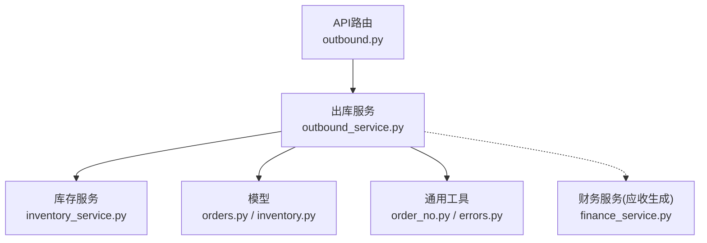
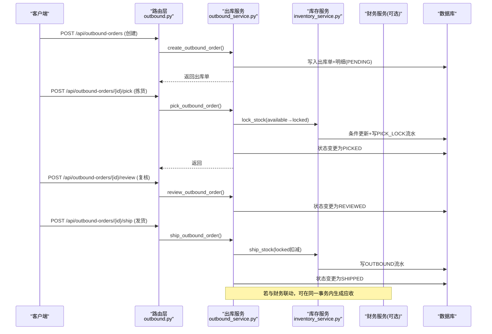
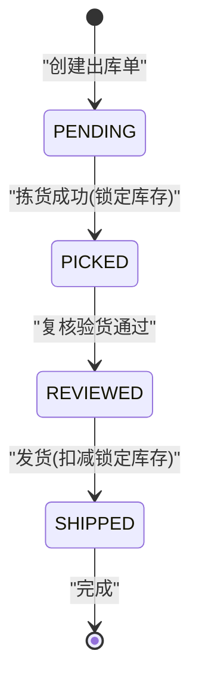
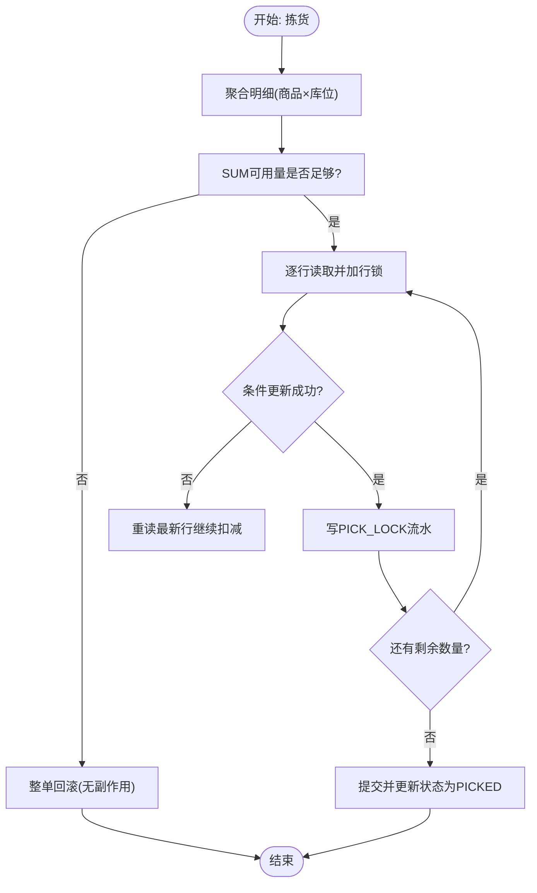
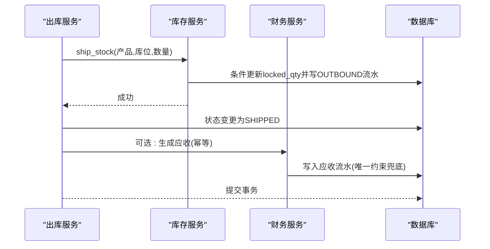
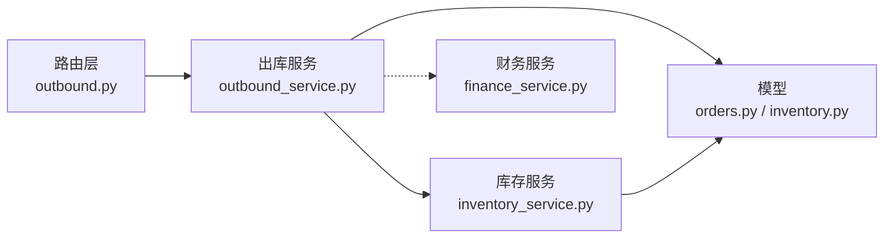

# 出库服务

<cite>
**本文引用的文件**
- [backend-python/app/routers/outbound.py](file://backend-python/app/routers/outbound.py)
- [backend-python/app/services/outbound_service.py](file://backend-python/app/services/outbound_service.py)
- [backend-python/app/services/inventory_service.py](file://backend-python/app/services/inventory_service.py)
- [backend-python/app/models/orders.py](file://backend-python/app/models/orders.py)
- [backend-python/app/models/inventory.py](file://backend-python/app/models/inventory.py)
- [backend-python/app/schemas/orders.py](file://backend-python/app/schemas/orders.py)
- [backend-python/app/common/errors.py](file://backend-python/app/common/errors.py)
- [backend-python/app/common/order_no.py](file://backend-python/app/common/order_no.py)
- [backend-python/app/services/finance_service.py](file://backend-python/app/services/finance_service.py)
- [backend-python/app/models/finance.py](file://backend-python/app/models/finance.py)
- [backend-python/tests/test_outbound_service.py](file://backend-python/tests/test_outbound_service.py)
</cite>

## 目录
1. [简介](#简介)
2. [项目结构](#项目结构)
3. [核心组件](#核心组件)
4. [架构总览](#架构总览)
5. [详细组件分析](#详细组件分析)
6. [依赖关系分析](#依赖关系分析)
7. [性能考虑](#性能考虑)
8. [故障排查指南](#故障排查指南)
9. [结论](#结论)
10. [附录：API与调用示例](#附录api与调用示例)

## 简介
本文件面向WMS系统的“出库服务”，围绕出库单全生命周期，系统化说明出库流程的完整处理逻辑：出库单创建、拣货锁定、复核验货、发货确认；并给出状态机转换规则、拣货锁定机制（可用量减少、锁定量增加、并发安全控制）、发货确认实现（锁定量扣减、库存流水记录、应收生成）及与库存服务、销售订单服务、财务服务的集成关系。文档同时覆盖异常处理与回滚机制、数据一致性保障、性能优化建议与最佳实践，并提供来自实际代码库的调用路径与测试用例参考。

## 项目结构
出库相关能力由路由层、服务层、模型层与共享工具共同构成：
- 路由层：定义出库单相关的HTTP接口，承载状态机流转入口（创建、拣货、复核、发货、查询）。
- 服务层：封装出库业务逻辑（状态校验、聚合明细、调用库存服务进行锁定/扣减），以及库存服务（原子扣减、防超卖、流水落盘）。
- 模型层：出库单、出库明细、库存行、库存流水等实体定义。
- 共享工具：单据号生成、业务异常封装。
- 测试：覆盖状态机、并发防超卖、回滚一致性等关键场景。

图表来源
- [backend-python/app/routers/outbound.py:13-42](file://backend-python/app/routers/outbound.py#L13-L42)
- [backend-python/app/services/outbound_service.py:42-176](file://backend-python/app/services/outbound_service.py#L42-L176)
- [backend-python/app/services/inventory_service.py:147-251](file://backend-python/app/services/inventory_service.py#L147-L251)
- [backend-python/app/models/orders.py:50-80](file://backend-python/app/models/orders.py#L50-L80)
- [backend-python/app/models/inventory.py:33-98](file://backend-python/app/models/inventory.py#L33-L98)

章节来源
- [backend-python/app/routers/outbound.py:1-61](file://backend-python/app/routers/outbound.py#L1-L61)
- [backend-python/app/services/outbound_service.py:1-196](file://backend-python/app/services/outbound_service.py#L1-L196)

## 核心组件
- 出库单路由：提供创建、拣货、复核、发货、列表与详情查询接口，统一返回结构化响应。
- 出库服务：实现状态机校验、明细聚合、调用库存服务完成锁定/扣减，维护出库单状态。
- 库存服务：提供统一的库存变动入口，保证所有变更写流水；支持跨批次扣减、条件更新与并发安全。
- 模型：出库单/明细、库存行（可用量/锁定量分离）、库存流水（全量可追溯）。
- 通用工具：按日递增的单号生成器、业务异常类型。
- 财务服务：在销售订单发货时生成应收（幂等），为出库与财务联动提供基础。

章节来源
- [backend-python/app/routers/outbound.py:13-42](file://backend-python/app/routers/outbound.py#L13-L42)
- [backend-python/app/services/outbound_service.py:42-176](file://backend-python/app/services/outbound_service.py#L42-L176)
- [backend-python/app/services/inventory_service.py:147-251](file://backend-python/app/services/inventory_service.py#L147-L251)
- [backend-python/app/models/orders.py:50-80](file://backend-python/app/models/orders.py#L50-L80)
- [backend-python/app/models/inventory.py:33-98](file://backend-python/app/models/inventory.py#L33-L98)
- [backend-python/app/common/order_no.py:11-37](file://backend-python/app/common/order_no.py#L11-L37)
- [backend-python/app/common/errors.py:4-9](file://backend-python/app/common/errors.py#L4-L9)
- [backend-python/app/services/finance_service.py:246-268](file://backend-python/app/services/finance_service.py#L246-L268)

## 架构总览
出库流程采用分层架构：API路由接收请求，委托出库服务执行；出库服务通过库存服务完成库存锁定与扣减，并写入库存流水；必要时与财务服务联动生成应收。

图表来源
- [backend-python/app/routers/outbound.py:13-42](file://backend-python/app/routers/outbound.py#L13-L42)
- [backend-python/app/services/outbound_service.py:102-176](file://backend-python/app/services/outbound_service.py#L102-L176)
- [backend-python/app/services/inventory_service.py:147-251](file://backend-python/app/services/inventory_service.py#L147-L251)
- [backend-python/app/services/finance_service.py:246-268](file://backend-python/app/services/finance_service.py#L246-L268)

## 详细组件分析

### 出库单状态机与流转规则
- 状态集合：PENDING（待拣货）→ PICKED（已拣货，库存锁定）→ REVIEWED（已复核）→ SHIPPED（已发货）。
- 流转条件：
  - 创建：新建出库单，初始状态为PENDING，不改变库存。
  - 拣货：仅允许从PENDING进入PICKED；需成功锁定库存（可用量减少、锁定量增加）。
  - 复核：仅允许从PICKED进入REVIEWED；用于二次核对拣货数量与实物一致。
  - 发货：仅允许从REVIEWED进入SHIPPED；扣减锁定库存，写OUTBOUND流水。
- 状态校验：通过强制检查当前状态与期望状态，防止非法跳转。

图表来源
- [backend-python/app/services/outbound_service.py:16-19](file://backend-python/app/services/outbound_service.py#L16-L19)
- [backend-python/app/services/outbound_service.py:96-100](file://backend-python/app/services/outbound_service.py#L96-L100)
- [backend-python/app/services/outbound_service.py:102-176](file://backend-python/app/services/outbound_service.py#L102-L176)

章节来源
- [backend-python/app/services/outbound_service.py:16-19](file://backend-python/app/services/outbound_service.py#L16-L19)
- [backend-python/app/services/outbound_service.py:96-100](file://backend-python/app/services/outbound_service.py#L96-L100)
- [backend-python/app/services/outbound_service.py:102-176](file://backend-python/app/services/outbound_service.py#L102-L176)

### 出库单创建
- 输入校验：校验商品与库位存在性，缺失则抛出业务异常。
- 单号生成：使用按日递增的单号生成器，冲突时重试。
- 持久化：写入出库单主表与明细，状态设为PENDING；失败时回滚。
- 关键点：创建阶段不改变库存，避免过早占用。

章节来源
- [backend-python/app/services/outbound_service.py:42-86](file://backend-python/app/services/outbound_service.py#L42-L86)
- [backend-python/app/common/order_no.py:11-37](file://backend-python/app/common/order_no.py#L11-L37)
- [backend-python/app/common/errors.py:4-9](file://backend-python/app/common/errors.py#L4-L9)

### 拣货锁定机制
- 目标：将可用库存转为锁定库存，防止超卖。
- 聚合策略：对同一商品+库位的明细进行合并，减少重复操作。
- 原子性与并发安全：
  - 先SUM校验总量不足直接返回False，无副作用。
  - 逐行条件更新（available >= take才生效），失败重读再扣。
  - 使用with_for_update在支持行锁的数据库上进一步保护。
- 结果：可用量减少、锁定量增加，并写PICK_LOCK流水。
- 失败处理：任一明细锁定失败，整体回滚，不留半成品。

图表来源
- [backend-python/app/services/outbound_service.py:102-133](file://backend-python/app/services/outbound_service.py#L102-L133)
- [backend-python/app/services/inventory_service.py:147-202](file://backend-python/app/services/inventory_service.py#L147-L202)

章节来源
- [backend-python/app/services/outbound_service.py:102-133](file://backend-python/app/services/outbound_service.py#L102-L133)
- [backend-python/app/services/inventory_service.py:147-202](file://backend-python/app/services/inventory_service.py#L147-L202)

### 复核验货
- 目的：二次核对拣货数量与实物一致，作为发货前置环节。
- 行为：仅允许从PICKED进入REVIEWED；成功后状态变为REVIEWED。
- 注意：未复核不可直接发货，确保质量与准确性。

章节来源
- [backend-python/app/services/outbound_service.py:136-143](file://backend-python/app/services/outbound_service.py#L136-L143)

### 发货确认
- 目标：扣减锁定库存，写OUTBOUND流水，状态变更为SHIPPED。
- 聚合与原子性：同拣货锁定，逐行条件更新，失败重读，并发安全。
- 财务联动：可与财务服务在同一事务中生成应收（幂等），确保业财一致。
- 结果：锁定量归零，库存流水包含OUTBOUND记录。

图表来源
- [backend-python/app/services/outbound_service.py:146-176](file://backend-python/app/services/outbound_service.py#L146-L176)
- [backend-python/app/services/inventory_service.py:205-251](file://backend-python/app/services/inventory_service.py#L205-L251)
- [backend-python/app/services/finance_service.py:246-268](file://backend-python/app/services/finance_service.py#L246-L268)

章节来源
- [backend-python/app/services/outbound_service.py:146-176](file://backend-python/app/services/outbound_service.py#L146-L176)
- [backend-python/app/services/inventory_service.py:205-251](file://backend-python/app/services/inventory_service.py#L205-L251)
- [backend-python/app/services/finance_service.py:246-268](file://backend-python/app/services/finance_service.py#L246-L268)

### 与库存服务、销售订单服务、财务服务的集成
- 库存服务：所有库存变动必须通过统一入口，写流水，保证可追溯；支持跨批次扣减与并发安全。
- 销售订单服务：负责销售订单生命周期管理；在发货时生成应收（幂等），与出库发货形成业财闭环。
- 财务服务：应收生成基于销售订单发货动作，具备幂等三层保护（预查、唯一约束、IntegrityError兜底）。

章节来源
- [backend-python/app/services/inventory_service.py:1-10](file://backend-python/app/services/inventory_service.py#L1-L10)
- [backend-python/app/services/finance_service.py:1-8](file://backend-python/app/services/finance_service.py#L1-L8)
- [backend-python/app/services/finance_service.py:246-268](file://backend-python/app/services/finance_service.py#L246-L268)

## 依赖关系分析
- 路由层依赖出库服务，出库服务依赖库存服务与模型层。
- 库存服务依赖模型层（库存行、流水、批次等），并通过SQLAlchemy进行原子更新与流水写入。
- 财务服务独立于出库服务，但可通过销售订单发货动作与出库流程形成联动。

图表来源
- [backend-python/app/routers/outbound.py:13-42](file://backend-python/app/routers/outbound.py#L13-L42)
- [backend-python/app/services/outbound_service.py:102-176](file://backend-python/app/services/outbound_service.py#L102-L176)
- [backend-python/app/services/inventory_service.py:147-251](file://backend-python/app/services/inventory_service.py#L147-L251)
- [backend-python/app/models/orders.py:50-80](file://backend-python/app/models/orders.py#L50-L80)
- [backend-python/app/models/inventory.py:33-98](file://backend-python/app/models/inventory.py#L33-L98)
- [backend-python/app/services/finance_service.py:246-268](file://backend-python/app/services/finance_service.py#L246-L268)

章节来源
- [backend-python/app/routers/outbound.py:13-42](file://backend-python/app/routers/outbound.py#L13-L42)
- [backend-python/app/services/outbound_service.py:102-176](file://backend-python/app/services/outbound_service.py#L102-L176)
- [backend-python/app/services/inventory_service.py:147-251](file://backend-python/app/services/inventory_service.py#L147-L251)
- [backend-python/app/models/orders.py:50-80](file://backend-python/app/models/orders.py#L50-L80)
- [backend-python/app/models/inventory.py:33-98](file://backend-python/app/models/inventory.py#L33-L98)
- [backend-python/app/services/finance_service.py:246-268](file://backend-python/app/services/finance_service.py#L246-L268)

## 性能考虑
- 聚合明细：对同一商品+库位的明细进行合并，减少重复的库存操作与流水写入。
- 批量加载：列表查询使用joinedload一次性加载关联数据，避免N+1问题。
- 索引设计：库存行与流水表针对常用过滤列建立索引，提升查询效率。
- 并发安全：条件更新+失败重读，结合数据库行锁（PostgreSQL）或SQLite写锁，防止并发超卖。
- 单号生成：按日递增，冲突时重试，避免高并发下单号碰撞导致的额外开销。

[本节为通用性能指导，不直接分析具体文件]

## 故障排查指南
- 业务异常：使用BusinessError携带HTTP状态码，便于统一处理与前端提示。
- 库存不足：拣货或发货时若库存不足，抛出业务异常并回滚，确保无半成品。
- 并发冲突：单号生成或应收生成可能触发唯一约束冲突，捕获后重试或提示。
- 状态错误：非预期状态操作会抛出业务异常，检查当前状态与期望状态。
- 流水对账：通过库存流水查询核对PICK_LOCK与OUTBOUND记录，验证前后数量一致性。

章节来源
- [backend-python/app/common/errors.py:4-9](file://backend-python/app/common/errors.py#L4-L9)
- [backend-python/app/services/outbound_service.py:96-100](file://backend-python/app/services/outbound_service.py#L96-L100)
- [backend-python/app/services/outbound_service.py:120-128](file://backend-python/app/services/outbound_service.py#L120-L128)
- [backend-python/app/services/outbound_service.py:163-171](file://backend-python/app/services/outbound_service.py#L163-L171)
- [backend-python/app/services/inventory_service.py:156-202](file://backend-python/app/services/inventory_service.py#L156-L202)
- [backend-python/app/services/inventory_service.py:208-251](file://backend-python/app/services/inventory_service.py#L208-L251)
- [backend-python/app/services/finance_service.py:295-330](file://backend-python/app/services/finance_service.py#L295-L330)

## 结论
本出库服务以清晰的状态机为核心，结合聚合与原子更新机制，实现了可靠的拣货锁定与发货确认流程。通过库存流水全量可追溯、并发安全控制与异常回滚机制，确保了数据一致性与系统稳定性。与财务服务的联动进一步打通了业财一体化闭环。建议在上线前完善监控告警、压测与回归测试，持续优化性能与可靠性。

[本节为总结性内容，不直接分析具体文件]

## 附录：API与调用示例
- 创建出库单：POST /api/outbound-orders，入参包含客户名、商品明细（商品ID、数量、库位编码）、备注；返回出库单信息。
- 拣货：POST /api/outbound-orders/{order_id}/pick，将状态从PENDING转为PICKED，并锁定库存。
- 复核：POST /api/outbound-orders/{order_id}/review，将状态从PICKED转为REVIEWED。
- 发货：POST /api/outbound-orders/{order_id}/ship，将状态从REVIEWED转为SHIPPED，扣减锁定库存并写OUTBOUND流水。
- 查询：GET /api/outbound-orders（支持分页与状态过滤）、GET /api/outbound-orders/{order_id}（获取详情）。

调用方式参考：
- 路由层接口定义与参数绑定见路由文件。
- 服务层方法调用与返回值构造见服务文件。
- 测试用例展示了完整的创建、拣货、复核、发货流程与并发场景。

章节来源
- [backend-python/app/routers/outbound.py:13-61](file://backend-python/app/routers/outbound.py#L13-L61)
- [backend-python/app/services/outbound_service.py:42-196](file://backend-python/app/services/outbound_service.py#L42-L196)
- [backend-python/tests/test_outbound_service.py:42-216](file://backend-python/tests/test_outbound_service.py#L42-L216)