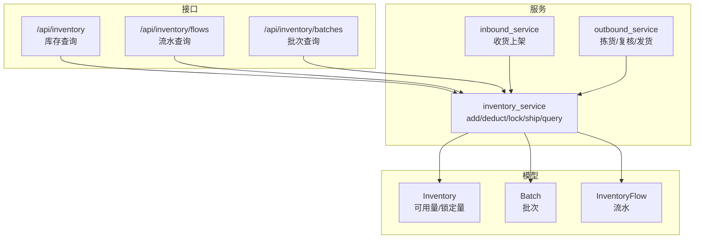
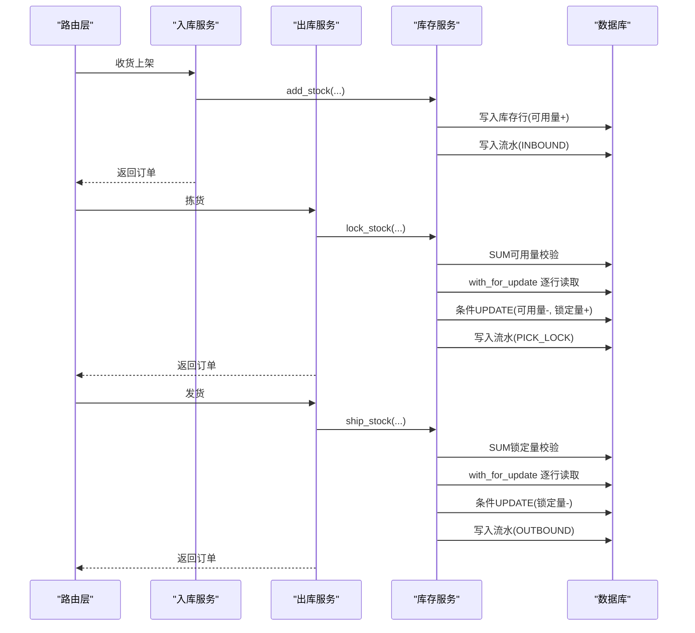
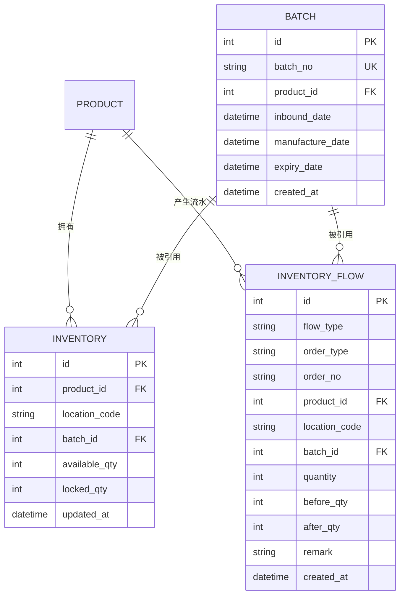
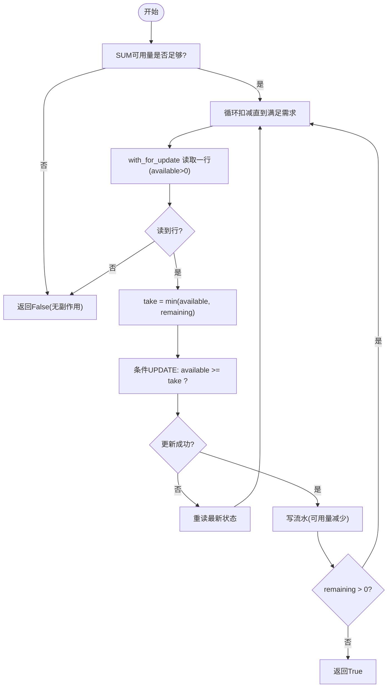
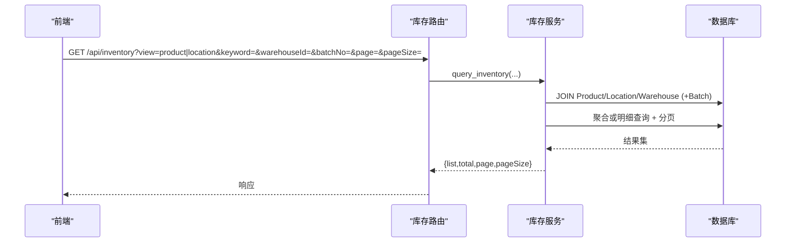
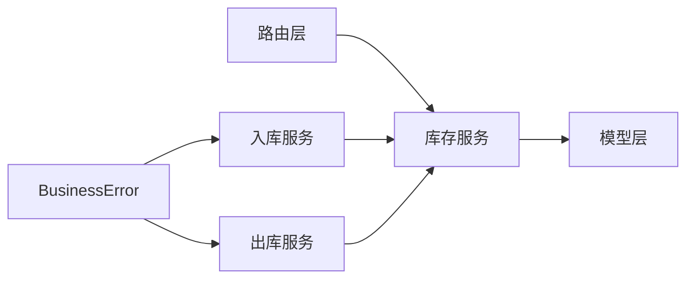
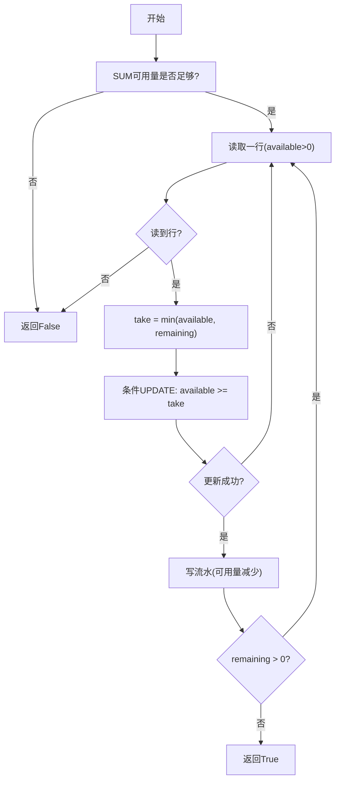
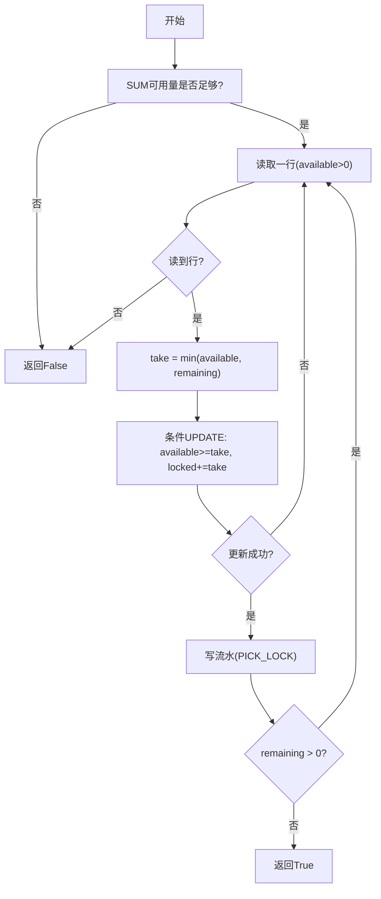
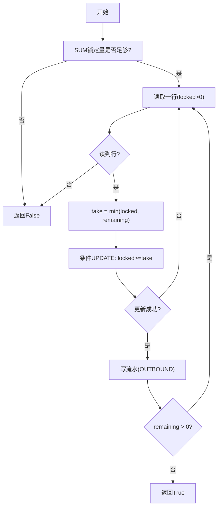

# 库存服务

<cite>
**本文引用的文件**
- [inventory_service.py](file://backend-python/app/services/inventory_service.py)
- [inventory.py](file://backend-python/app/models/inventory.py)
- [inventory.py](file://backend-python/app/routers/inventory.py)
- [inventory.py](file://backend-python/app/schemas/inventory.py)
- [inbound_service.py](file://backend-python/app/services/inbound_service.py)
- [outbound_service.py](file://backend-python/app/services/outbound_service.py)
- [errors.py](file://backend-python/app/common/errors.py)
- [test_inventory_service.py](file://backend-python/tests/test_inventory_service.py)
</cite>

## 目录
1. [简介](#简介)
2. [项目结构](#项目结构)
3. [核心组件](#核心组件)
4. [架构总览](#架构总览)
5. [详细组件分析](#详细组件分析)
6. [依赖关系分析](#依赖关系分析)
7. [性能考量](#性能考量)
8. [故障排查指南](#故障排查指南)
9. [结论](#结论)
10. [附录](#附录)

## 简介
本文件面向WMS系统的库存服务，系统化阐述其设计原则与实现细节：统一入口、可用量与锁定量分离、跨批次扣减（FIFO）、并发安全控制（条件UPDATE + with_for_update + 事务回滚），以及库存查询与流水记录机制。文档同时覆盖与入库、出库服务的集成方式，并提供基于测试用例的常见使用场景与错误处理示例。

## 项目结构
库存相关代码主要分布在以下位置：
- 领域模型：库存行、批次、库存流水
- 服务层：库存核心操作（增加、扣减、锁定、发货）与查询（库存视图、流水、批次）
- 路由层：库存查询/流水/批次API
- 业务集成：入库服务调用库存增加；出库服务调用锁定与发货
- 测试：覆盖核心流程与边界条件

图表来源
- [inventory_service.py:1-437](file://backend-python/app/services/inventory_service.py#L1-L437)
- [inventory.py:1-98](file://backend-python/app/models/inventory.py#L1-L98)
- [inventory.py:1-62](file://backend-python/app/routers/inventory.py#L1-L62)
- [inbound_service.py:1-150](file://backend-python/app/services/inbound_service.py#L1-L150)
- [outbound_service.py:1-196](file://backend-python/app/services/outbound_service.py#L1-L196)

章节来源
- [inventory_service.py:1-437](file://backend-python/app/services/inventory_service.py#L1-L437)
- [inventory.py:1-98](file://backend-python/app/models/inventory.py#L1-L98)
- [inventory.py:1-62](file://backend-python/app/routers/inventory.py#L1-L62)
- [inbound_service.py:1-150](file://backend-python/app/services/inbound_service.py#L1-L150)
- [outbound_service.py:1-196](file://backend-python/app/services/outbound_service.py#L1-L196)

## 核心组件
- 库存行（Inventory）：以“商品+库位+批次”为维度，维护可用量与锁定量，支持按批次管理。
- 批次（Batch）：一次入库生成批次，支持有效期等扩展字段。
- 库存流水（InventoryFlow）：所有库存变动必须写流水，包含类型、单号、数量、变动前后值等，确保全量可追溯。
- 库存服务（inventory_service）：提供统一入口方法 add_stock、deduct_stock、lock_stock、ship_stock，以及查询能力 query_inventory、query_flows、query_batches。
- 入库服务（inbound_service）：收货上架时创建批次并调用 add_stock。
- 出库服务（outbound_service）：拣货阶段调用 lock_stock，发货阶段调用 ship_stock。

章节来源
- [inventory.py:1-98](file://backend-python/app/models/inventory.py#L1-L98)
- [inventory_service.py:1-437](file://backend-python/app/services/inventory_service.py#L1-L437)
- [inbound_service.py:1-150](file://backend-python/app/services/inbound_service.py#L1-L150)
- [outbound_service.py:1-196](file://backend-python/app/services/outbound_service.py#L1-L196)

## 架构总览
库存服务作为所有库存变动的唯一入口，保证：
- 统一入口：所有增减锁发均通过 inventory_service 暴露的方法完成。
- 可用量与锁定量分离：可用量用于销售/调拨等直接扣减；锁定量用于拣货暂存，发货时再扣减。
- 跨批次扣减：扣减按批次顺序（先早后晚）进行，符合FIFO策略。
- 并发安全：SUM总量预检 + 条件UPDATE（available >= take / locked >= take）+ with_for_update 行锁 + 失败重试重读，防止超卖。
- 事务一致性：调用方负责开启事务，任一环节失败整体回滚，不留半成品。

图表来源
- [inbound_service.py:92-129](file://backend-python/app/services/inbound_service.py#L92-L129)
- [outbound_service.py:102-176](file://backend-python/app/services/outbound_service.py#L102-L176)
- [inventory_service.py:75-251](file://backend-python/app/services/inventory_service.py#L75-L251)

## 详细组件分析

### 数据模型与约束
- Inventory：唯一键 (product_id, location_code, batch_id)，索引优化常用过滤列。
- Batch：批次号唯一，关联商品，支持入库日期、生产/有效期。
- InventoryFlow：记录每次库存变动，含 flow_type、order_type、order_no、quantity、before_qty、after_qty 等，便于审计与追溯。

图表来源
- [inventory.py:18-98](file://backend-python/app/models/inventory.py#L18-L98)

章节来源
- [inventory.py:18-98](file://backend-python/app/models/inventory.py#L18-L98)

### 统一入口与核心方法

#### add_stock（增加可用量）
- 作用：在指定商品+库位+批次维度增加可用量，并写INBOUND流水。
- 行为：若库存行不存在则创建；累加可用量；记录 before/after 数量。
- 适用场景：入库收货、移库入、盘盈。

章节来源
- [inventory_service.py:75-88](file://backend-python/app/services/inventory_service.py#L75-L88)

#### deduct_stock（跨批次扣减可用量）
- 作用：从 (product, location) 的库存中扣减可用量，支持跨批次且按入库先后顺序（FIFO）。
- 并发安全：
  - 先 SUM 可用量，不足直接返回 False，无副作用。
  - 逐行读取时使用 with_for_update（PostgreSQL下生效）获取行级锁。
  - 使用条件 UPDATE（available >= take）确保并发下不会覆盖他人已提交变更。
  - 若 rowcount=0，说明该行已被并发修改，重新读取最新状态继续扣减。
- 结果：成功返回 True；库存不足返回 False；每行扣减写流水。

图表来源
- [inventory_service.py:91-144](file://backend-python/app/services/inventory_service.py#L91-L144)

章节来源
- [inventory_service.py:91-144](file://backend-python/app/services/inventory_service.py#L91-L144)

#### lock_stock（拣货锁定）
- 作用：将可用量转为锁定量（available -= q, locked += q），用于拣货暂存。
- 并发安全：同 deduct_stock，SUM预检 + with_for_update + 条件UPDATE + 失败重试。
- 结果：成功返回 True；不足返回 False；每行写 PICK_LOCK 流水。

章节来源
- [inventory_service.py:147-202](file://backend-python/app/services/inventory_service.py#L147-L202)

#### ship_stock（发货扣减锁定量）
- 作用：扣减已锁定库存（locked -= q），并写 OUTBOUND 流水。
- 并发安全：SUM锁定量预检 + with_for_update + 条件UPDATE + 失败重试。
- 结果：成功返回 True；不足返回 False。

章节来源
- [inventory_service.py:205-251](file://backend-python/app/services/inventory_service.py#L205-L251)

### 库存查询功能
- 按产品视图（view=product）：按“商品+仓库”汇总可用/锁定，聚合统计 totalQty。
- 按库位视图（view=location）：按“商品+库位+批次”明细展示，支持关键字搜索、仓库过滤、批次过滤。
- 分页：支持 page/pageSize，返回 total/list。
- 流水查询：支持按单号、商品、库位、流水类型过滤，joinedload 避免N+1。
- 批次列表：支持关键字模糊匹配，joinedload 加载商品信息。

图表来源
- [inventory.py:12-31](file://backend-python/app/routers/inventory.py#L12-L31)
- [inventory_service.py:256-345](file://backend-python/app/services/inventory_service.py#L256-L345)

章节来源
- [inventory_service.py:256-345](file://backend-python/app/services/inventory_service.py#L256-L345)
- [inventory.py:12-62](file://backend-python/app/routers/inventory.py#L12-L62)

### 库存流水记录机制
- 所有库存变动必须写流水，包含：
  - flow_type：INBOUND、OUTBOUND、PICK_LOCK、MOVE_OUT、MOVE_IN、ADJUST_IN、ADJUST_OUT、RETURN_IN 等。
  - order_type/order_no：关联单据类型与单号，便于溯源。
  - quantity/before_qty/after_qty：记录变动量及变动前后对应维度的数量。
- 查询支持多条件过滤与分页，便于审计与问题定位。

章节来源
- [inventory_service.py:57-73](file://backend-python/app/services/inventory_service.py#L57-L73)
- [inventory_service.py:348-401](file://backend-python/app/services/inventory_service.py#L348-L401)
- [inventory.py:63-98](file://backend-python/app/models/inventory.py#L63-L98)

### 与其他组件的集成

#### 入库服务集成
- 收货上架：创建批次（批次号=单号-明细id），调用 add_stock 增加可用量，并写 INBOUND 流水。
- 事务：整个流程在一个事务内，任一步失败全部回滚。

章节来源
- [inbound_service.py:92-129](file://backend-python/app/services/inbound_service.py#L92-L129)

#### 出库服务集成
- 拣货：聚合同一(商品,库位)的明细，调用 lock_stock 将可用量转为锁定量，写 PICK_LOCK 流水。
- 复核：仅状态流转，不改变库存。
- 发货：聚合同一(商品,库位)的明细，调用 ship_stock 扣减锁定量，写 OUTBOUND 流水。
- 异常处理：任一环节库存不足抛出 BusinessError，外层捕获并回滚事务。

章节来源
- [outbound_service.py:102-176](file://backend-python/app/services/outbound_service.py#L102-L176)
- [errors.py:1-9](file://backend-python/app/common/errors.py#L1-L9)

### 并发安全与防超卖机制
- 总量预检：SUM(available/locked) 不足直接返回 False，避免无效更新。
- 行级锁：with_for_update 在PostgreSQL下对读取的行加锁，防止并发覆盖。
- 条件UPDATE：WHERE available >= take / locked >= take，确保即使陈旧读也不会导致超卖。
- 失败重试：rowcount=0 表示并发修改，重新读取最新状态继续扣减。
- 事务回滚：调用方负责事务边界，任何中间失败都会整体回滚，不留半成品。

章节来源
- [inventory_service.py:91-251](file://backend-python/app/services/inventory_service.py#L91-L251)

## 依赖关系分析
- 路由层依赖服务层：/api/inventory、/api/inventory/flows、/api/inventory/batches 分别调用 inventory_service。
- 服务层依赖模型层：Inventory、Batch、InventoryFlow 提供持久化能力。
- 业务服务依赖库存服务：inbound_service 调用 add_stock；outbound_service 调用 lock_stock 与 ship_stock。
- 异常处理：BusinessError 携带HTTP状态码，由全局异常处理器统一转换。

图表来源
- [inventory.py:1-62](file://backend-python/app/routers/inventory.py#L1-62)
- [inventory_service.py:1-437](file://backend-python/app/services/inventory_service.py#L1-L437)
- [inbound_service.py:1-150](file://backend-python/app/services/inbound_service.py#L1-L150)
- [outbound_service.py:1-196](file://backend-python/app/services/outbound_service.py#L1-L196)
- [errors.py:1-9](file://backend-python/app/common/errors.py#L1-L9)

章节来源
- [inventory.py:1-62](file://backend-python/app/routers/inventory.py#L1-L62)
- [inventory_service.py:1-437](file://backend-python/app/services/inventory_service.py#L1-L437)
- [inbound_service.py:1-150](file://backend-python/app/services/inbound_service.py#L1-L150)
- [outbound_service.py:1-196](file://backend-python/app/services/outbound_service.py#L1-L196)
- [errors.py:1-9](file://backend-python/app/common/errors.py#L1-L9)

## 性能考量
- 聚合查询优化：
  - 产品视图使用 GROUP BY 与 func.sum 聚合，减少应用层计算。
  - 库位视图使用 outerjoin Batch，避免强制内连接导致的遗漏。
- N+1 查询规避：
  - 流水与批次查询使用 joinedload 一次性加载关联对象。
- 索引优化：
  - 库存表对 location_code、product_id 建索引，加速过滤。
  - 流水表对 order_no、product_id、created_at 建索引，提升查询效率。
- 并发与锁：
  - with_for_update 在高并发场景下减少竞争冲突。
  - 条件UPDATE 避免重复更新，降低锁等待。
- 分页与限制：
  - 所有列表接口支持 page/pageSize，避免大结果集传输。

[本节为通用性能建议，不直接分析具体文件]

## 故障排查指南
- 库存不足：
  - 现象：lock_stock/ship_stock/deduct_stock 返回 False。
  - 排查：检查 SUM 预检逻辑与条件UPDATE；确认是否有并发扣减；查看流水记录定位最近变动。
  - 参考：测试用例验证不足场景无副作用。
- 重复入库：
  - 现象：同(商品,库位,批次)多次入库应累加在同一行。
  - 排查：确认 _get_or_create_inventory 逻辑；检查流水条数与可用量变化。
- 跨批次扣减顺序：
  - 现象：早期批次先被扣完。
  - 排查：确认按 id 升序读取；检查流水记录的批次信息。
- 事务回滚：
  - 现象：部分步骤失败导致整体回滚。
  - 排查：确认调用方事务边界；检查 BusinessError 抛出点；查看日志与流水完整性。

章节来源
- [test_inventory_service.py:31-171](file://backend-python/tests/test_inventory_service.py#L31-L171)
- [errors.py:1-9](file://backend-python/app/common/errors.py#L1-L9)

## 结论
库存服务通过统一入口、可用量与锁定量分离、跨批次FIFO扣减、条件UPDATE与行锁结合、以及完整流水记录，实现了高并发下的库存一致性与可追溯性。与入库、出库服务的紧密集成确保了端到端的业务流程闭环。建议在部署时启用PostgreSQL以获得最佳行锁效果，并结合索引与分页优化查询性能。

[本节为总结性内容，不直接分析具体文件]

## 附录

### 常见使用场景与示例路径
- 入库收货：调用 inbound_service.receive_inbound_order，内部调用 add_stock。
- 拣货锁定：调用 outbound_service.pick_outbound_order，内部调用 lock_stock。
- 发货出库：调用 outbound_service.ship_outbound_order，内部调用 ship_stock。
- 库存查询：调用 /api/inventory，支持 product/location 视图与过滤。
- 流水审计：调用 /api/inventory/flows，按单号/商品/库位/类型过滤。

章节来源
- [inbound_service.py:92-129](file://backend-python/app/services/inbound_service.py#L92-L129)
- [outbound_service.py:102-176](file://backend-python/app/services/outbound_service.py#L102-L176)
- [inventory.py:12-62](file://backend-python/app/routers/inventory.py#L12-L62)

### 关键流程图示

#### 扣减可用量（deduct_stock）流程

图表来源
- [inventory_service.py:91-144](file://backend-python/app/services/inventory_service.py#L91-L144)

#### 拣货锁定（lock_stock）流程

图表来源
- [inventory_service.py:147-202](file://backend-python/app/services/inventory_service.py#L147-L202)

#### 发货出库（ship_stock）流程

图表来源
- [inventory_service.py:205-251](file://backend-python/app/services/inventory_service.py#L205-L251)