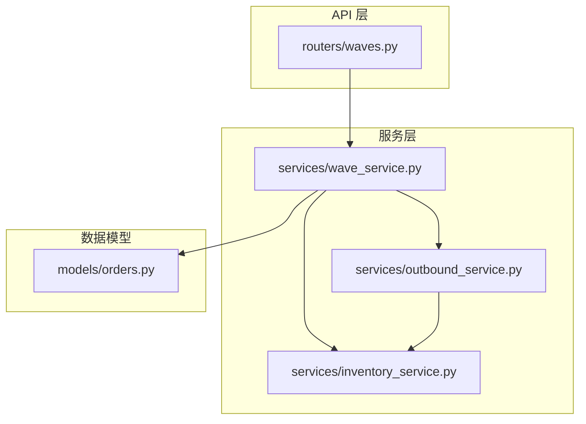
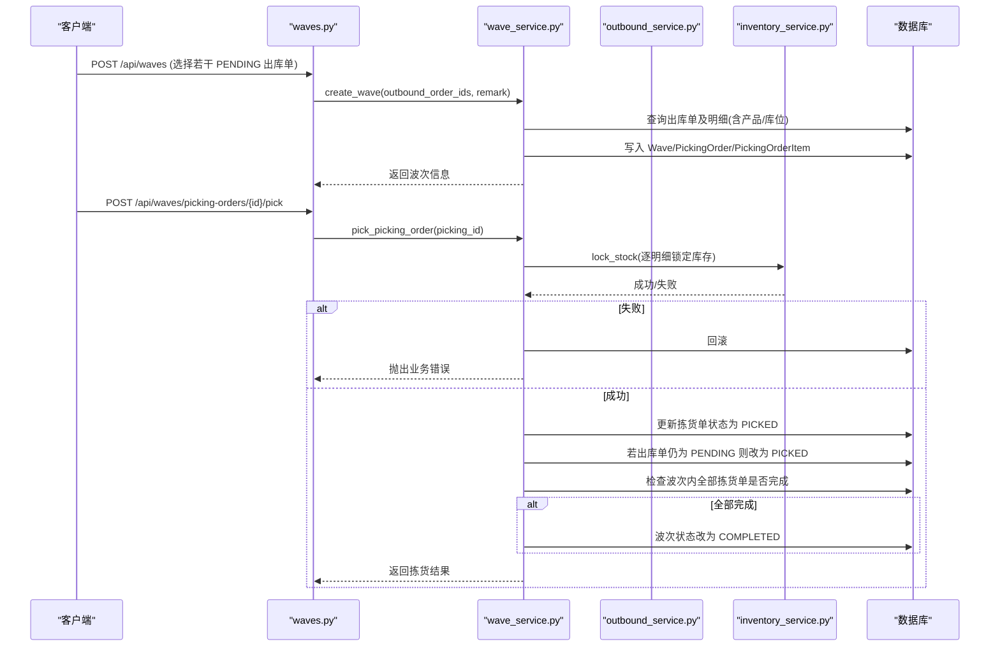
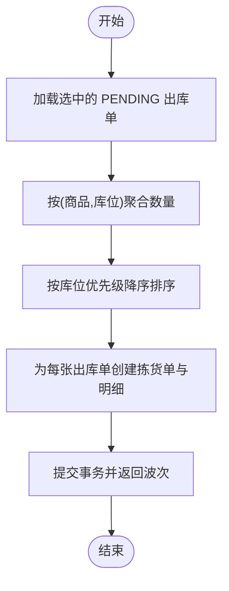
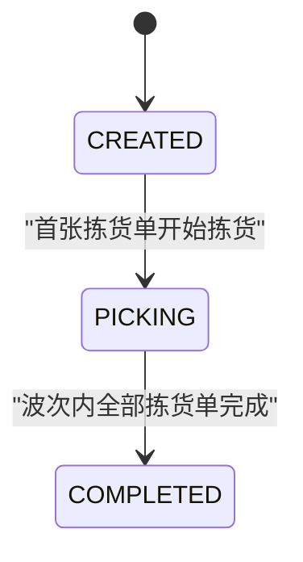
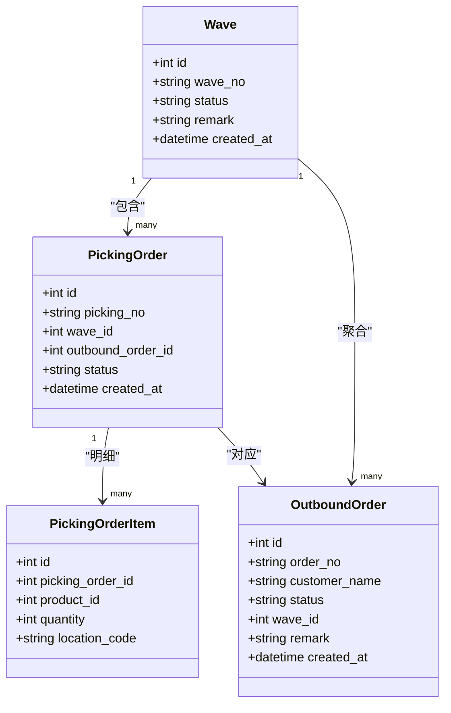
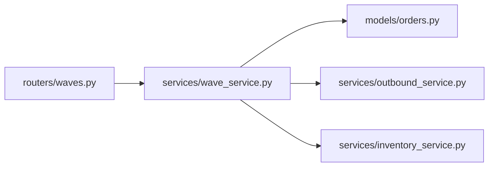

# 波次服务

<cite>
**本文引用的文件**
- [waves.py](file://backend-python/app/routers/waves.py)
- [wave_service.py](file://backend-python/app/services/wave_service.py)
- [orders.py](file://backend-python/app/models/orders.py)
- [orders.py（Schema）](file://backend-python/app/schemas/orders.py)
- [outbound_service.py](file://backend-python/app/services/outbound_service.py)
- [inventory_service.py](file://backend-python/app/services/inventory_service.py)
- [test_wave_service.py](file://backend-python/tests/test_wave_service.py)
</cite>

## 目录
1. [简介](#简介)
2. [项目结构](#项目结构)
3. [核心组件](#核心组件)
4. [架构总览](#架构总览)
5. [详细组件分析](#详细组件分析)
6. [依赖关系分析](#依赖关系分析)
7. [性能与优化](#性能与优化)
8. [故障排查指南](#故障排查指南)
9. [结论](#结论)
10. [附录：API 调用示例](#附录api-调用示例)

## 简介
本文件面向 WMS 系统的“波次拣货”能力，系统化说明波次的核心概念、设计原理与实现细节。内容涵盖：
- 波次聚合算法、优先级排序策略与拣货路径优化
- 波次创建规则（订单筛选条件、大小限制与合并策略）
- 波次状态管理（待拣货→拣货中→完成）及转换逻辑
- 波次与出库单的关联关系（批量拣货、分批发货）
- 与出库服务、库存服务的集成方式
- 异常处理与回滚机制
- 性能调优建议与可观测性要点

## 项目结构
后端采用 FastAPI 路由 + Service 分层 + SQLAlchemy ORM 模型的结构。波次相关代码主要分布在以下位置：
- API 层：/api/waves 路由定义
- 服务层：波次业务编排、状态推进、与出库/库存服务协作
- 数据模型：波次、拣货单、出库单及其明细的实体定义
- 测试：覆盖波次创建、聚合排序、拣货执行、状态推进与回滚等关键场景

图表来源
- [waves.py:1-55](file://backend-python/app/routers/waves.py#L1-L55)
- [wave_service.py:1-238](file://backend-python/app/services/wave_service.py#L1-L238)
- [outbound_service.py:1-196](file://backend-python/app/services/outbound_service.py#L1-L196)
- [inventory_service.py:1-200](file://backend-python/app/services/inventory_service.py#L1-L200)
- [orders.py:50-138](file://backend-python/app/models/orders.py#L50-L138)

章节来源
- [waves.py:1-55](file://backend-python/app/routers/waves.py#L1-L55)
- [wave_service.py:1-238](file://backend-python/app/services/wave_service.py#L1-L238)
- [orders.py:50-138](file://backend-python/app/models/orders.py#L50-L138)

## 核心组件
- 波次（Wave）：聚合多张待拣货出库单，生成对应拣货单；状态机 CREATED → PICKING → COMPLETED
- 拣货单（PickingOrder）：一张出库单对应一张拣货单；明细按（商品, 库位）聚合，并按库位优先级降序排列
- 出库单（OutboundOrder）：PENDING → PICKED → REVIEWED → SHIPPED；被纳入波次后由拣货动作驱动至 PICKED
- 库存服务（InventoryService）：提供 lock_stock、ship_stock 等原子操作，保证并发安全与可追溯流水

章节来源
- [orders.py:50-138](file://backend-python/app/models/orders.py#L50-L138)
- [wave_service.py:62-197](file://backend-python/app/services/wave_service.py#L62-L197)
- [outbound_service.py:102-176](file://backend-python/app/services/outbound_service.py#L102-L176)
- [inventory_service.py:147-200](file://backend-python/app/services/inventory_service.py#L147-L200)

## 架构总览
波次服务作为“编排者”，协调出库服务与库存服务完成“创建波次—执行拣货—推进状态”的完整流程。

图表来源
- [waves.py:13-48](file://backend-python/app/routers/waves.py#L13-L48)
- [wave_service.py:62-197](file://backend-python/app/services/wave_service.py#L62-L197)
- [inventory_service.py:147-200](file://backend-python/app/services/inventory_service.py#L147-L200)

## 详细组件分析

### 波次聚合与路径优化
- 聚合规则：同一出库单内的拣货明细按（商品, 库位）维度聚合数量，减少重复行
- 优先级排序：依据 Location.priority 从高到低排序，模拟最优拣货路径，降低拣货行走距离
- 生成策略：每个出库单生成一张拣货单，波次内包含多张拣货单

图表来源
- [wave_service.py:62-131](file://backend-python/app/services/wave_service.py#L62-L131)

章节来源
- [wave_service.py:62-131](file://backend-python/app/services/wave_service.py#L62-L131)

### 波次创建规则
- 订单筛选条件：仅允许状态为 PENDING 且未归属任何波次的出库单加入
- 波次大小限制：当前实现无硬编码上限，可通过前端或上游策略控制入参数量
- 合并策略：以“出库单”为单位进行聚合，不跨单合并；同单内按（商品, 库位）聚合

章节来源
- [wave_service.py:62-82](file://backend-python/app/services/wave_service.py#L62-L82)
- [orders.py:50-67](file://backend-python/app/models/orders.py#L50-L67)

### 波次状态管理与转换
- 波次状态机：CREATED → PICKING → COMPLETED
- 转换触发点：
  - 首张拣货单执行拣货：波次从 CREATED 进入 PICKING
  - 波次内所有拣货单均完成：波次进入 COMPLETED
- 拣货单状态机：CREATED → PICKED（库存已锁定）

图表来源
- [wave_service.py:187-197](file://backend-python/app/services/wave_service.py#L187-L197)

章节来源
- [wave_service.py:187-197](file://backend-python/app/services/wave_service.py#L187-L197)

### 波次与出库单的关联关系
- 一对多：一个波次包含多个出库单；每个出库单在波次内生成一张拣货单
- 状态联动：拣货执行时，若出库单仍为 PENDING，则同步推进到 PICKED
- 分批发货：波次负责“拣货锁定”，后续复核与发货由出库服务独立推进（PICKED → REVIEWED → SHIPPED），支持分批发货

章节来源
- [orders.py:50-138](file://backend-python/app/models/orders.py#L50-L138)
- [wave_service.py:181-197](file://backend-python/app/services/wave_service.py#L181-L197)
- [outbound_service.py:102-176](file://backend-python/app/services/outbound_service.py#L102-L176)

### 与出库服务、库存服务的集成
- 与出库服务：
  - 读取出库单状态与明细
  - 拣货完成后将出库单从 PENDING 推进到 PICKED
- 与库存服务：
  - 通过 lock_stock 对每个拣货明细进行可用库存锁定（available 减、locked 加）
  - 使用条件更新与重试机制避免并发超卖
  - 记录 PICK_LOCK 类型流水，便于审计与回溯

章节来源
- [wave_service.py:153-197](file://backend-python/app/services/wave_service.py#L153-L197)
- [outbound_service.py:102-176](file://backend-python/app/services/outbound_service.py#L102-L176)
- [inventory_service.py:147-200](file://backend-python/app/services/inventory_service.py#L147-L200)

### 类关系图（代码级）

图表来源
- [orders.py:50-138](file://backend-python/app/models/orders.py#L50-L138)

## 依赖关系分析
- 路由层依赖服务层：/api/waves 路由调用 wave_service
- 服务层依赖模型与外部服务：
  - wave_service 依赖 models（Wave/PickingOrder/OutboundOrder）
  - wave_service 依赖 outbound_service（读取出库单状态）
  - wave_service 依赖 inventory_service（锁定库存）
- 数据访问通过 SQLAlchemy Session 与 joinedload 优化 N+1 查询

图表来源
- [waves.py:1-55](file://backend-python/app/routers/waves.py#L1-L55)
- [wave_service.py:1-238](file://backend-python/app/services/wave_service.py#L1-L238)

章节来源
- [waves.py:1-55](file://backend-python/app/routers/waves.py#L1-L55)
- [wave_service.py:1-238](file://backend-python/app/services/wave_service.py#L1-L238)

## 性能与优化
- 查询优化：使用 joinedload 一次性加载波次、拣货单、明细与产品，避免 N+1 查询
- 聚合与排序：按（商品, 库位）聚合减少明细行数；按库位优先级排序提升拣货效率
- 并发安全：lock_stock 使用 SUM 预检 + 条件 UPDATE + 重试，防止并发超卖
- 事务边界：创建波次与执行拣货均在事务内提交，失败时整体回滚，保证一致性
- 可扩展点：
  - 波次大小限制：可在路由或服务层增加入参校验与阈值控制
  - 合并策略：可按客户、仓库、配送区域等维度扩展聚合规则
  - 路径优化：可引入更复杂的启发式算法（如最近邻、TSP 近似）进一步优化拣货路径

章节来源
- [wave_service.py:200-237](file://backend-python/app/services/wave_service.py#L200-L237)
- [inventory_service.py:147-200](file://backend-python/app/services/inventory_service.py#L147-L200)

## 故障排查指南
- 常见错误与定位：
  - 出库单不在波次或状态不符：检查 OutboundOrder.status 与 wave_id
  - 库存不足：查看 InventoryFlow 中 PICK_LOCK 记录，确认 available/locked 变化
  - 单号冲突：重试或检查唯一索引冲突
- 回滚机制：
  - 任一明细库存不足导致整单回滚，不留半成品
  - 异常抛出 BusinessError，上层捕获并返回统一错误码
- 验证方法：
  - 参考单元测试用例，复现问题并验证修复效果

章节来源
- [wave_service.py:153-197](file://backend-python/app/services/wave_service.py#L153-L197)
- [test_wave_service.py:76-135](file://backend-python/tests/test_wave_service.py#L76-L135)

## 结论
波次服务通过“聚合—排序—锁定—推进”的闭环，实现了高效的批量拣货与状态协同。其设计兼顾了拣货路径优化、并发安全与可追溯性，并与出库、库存服务形成清晰职责边界。建议在后续迭代中补充波次大小限制、更灵活的聚合策略与更丰富的路径优化算法，以提升吞吐与作业效率。

## 附录：API 调用示例
以下为关键操作的调用方式与预期行为（基于路由与服务实现）：

- 创建波次
  - 端点：POST /api/waves
  - 请求体：包含 outbound_order_ids（至少一个）、remark（可选）
  - 行为：校验出库单状态为 PENDING 且未归属波次；生成波次与拣货单；返回波次信息
  - 参考：[waves.py:13-17](file://backend-python/app/routers/waves.py#L13-L17)、[wave_service.py:62-131](file://backend-python/app/services/wave_service.py#L62-L131)

- 列出波次
  - 端点：GET /api/waves
  - 参数：status（可选）、page、pageSize
  - 行为：分页返回波次列表，包含拣货单与明细
  - 参考：[waves.py:20-28](file://backend-python/app/routers/waves.py#L20-L28)、[wave_service.py:200-216](file://backend-python/app/services/wave_service.py#L200-L216)

- 列出拣货单
  - 端点：GET /api/waves/picking-orders
  - 参数：waveId（可选）、status（可选）、page、pageSize
  - 行为：分页返回拣货单列表，支持按波次与状态过滤
  - 参考：[waves.py:31-41](file://backend-python/app/routers/waves.py#L31-L41)、[wave_service.py:219-237](file://backend-python/app/services/wave_service.py#L219-L237)

- 执行拣货
  - 端点：POST /api/waves/picking-orders/{picking_id}/pick
  - 行为：锁定库存；若成功则拣货单状态变为 PICKED，出库单由 PENDING 推进到 PICKED；波次首单拣货进入 PICKING，全部完成进入 COMPLETED
  - 参考：[waves.py:44-48](file://backend-python/app/routers/waves.py#L44-L48)、[wave_service.py:153-197](file://backend-python/app/services/wave_service.py#L153-L197)

- 获取波次详情
  - 端点：GET /api/waves/{wave_id}
  - 行为：返回波次信息及关联拣货单
  - 参考：[waves.py:51-54](file://backend-python/app/routers/waves.py#L51-L54)、[wave_service.py:134-138](file://backend-python/app/services/wave_service.py#L134-L138)

章节来源
- [waves.py:13-54](file://backend-python/app/routers/waves.py#L13-L54)
- [wave_service.py:62-197](file://backend-python/app/services/wave_service.py#L62-L197)