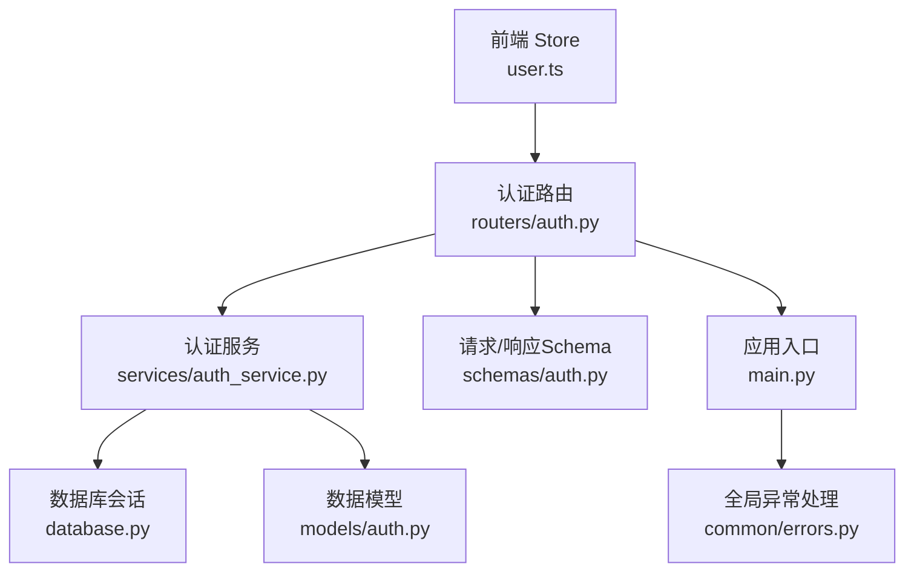
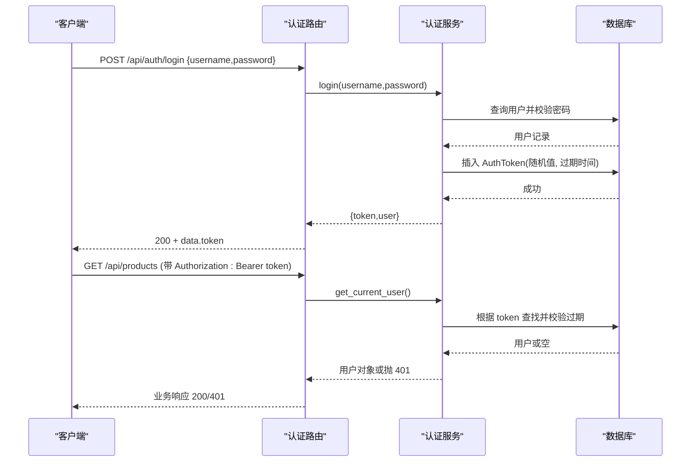
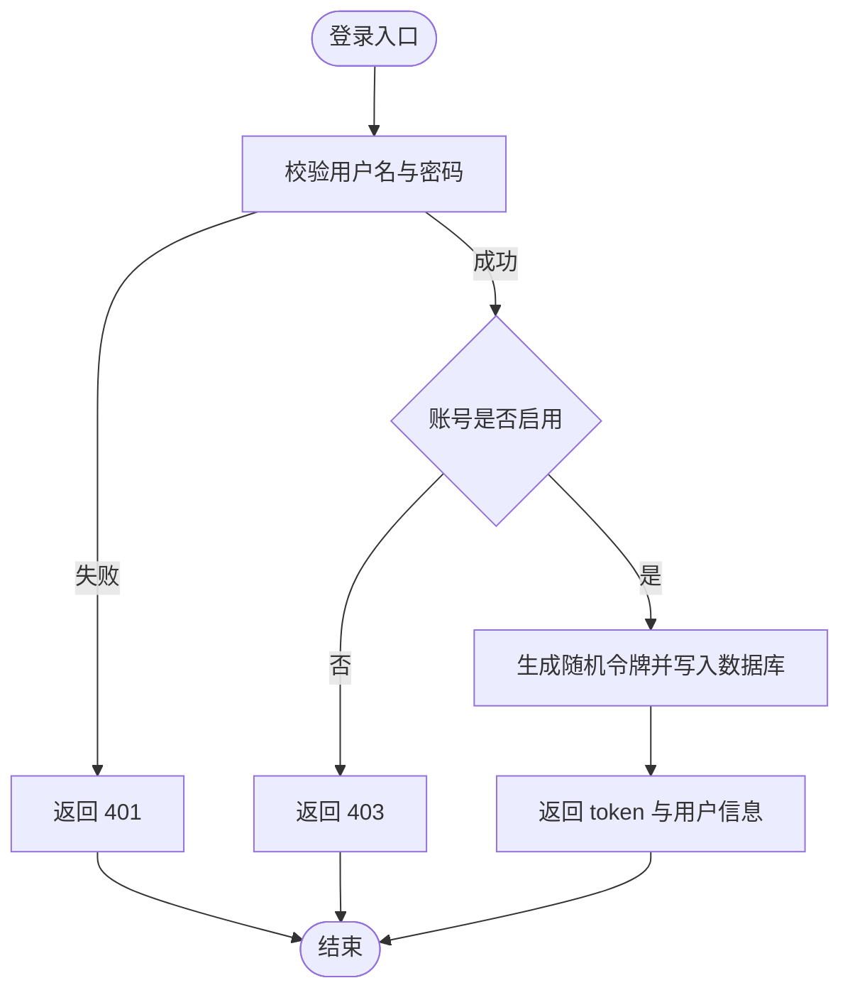
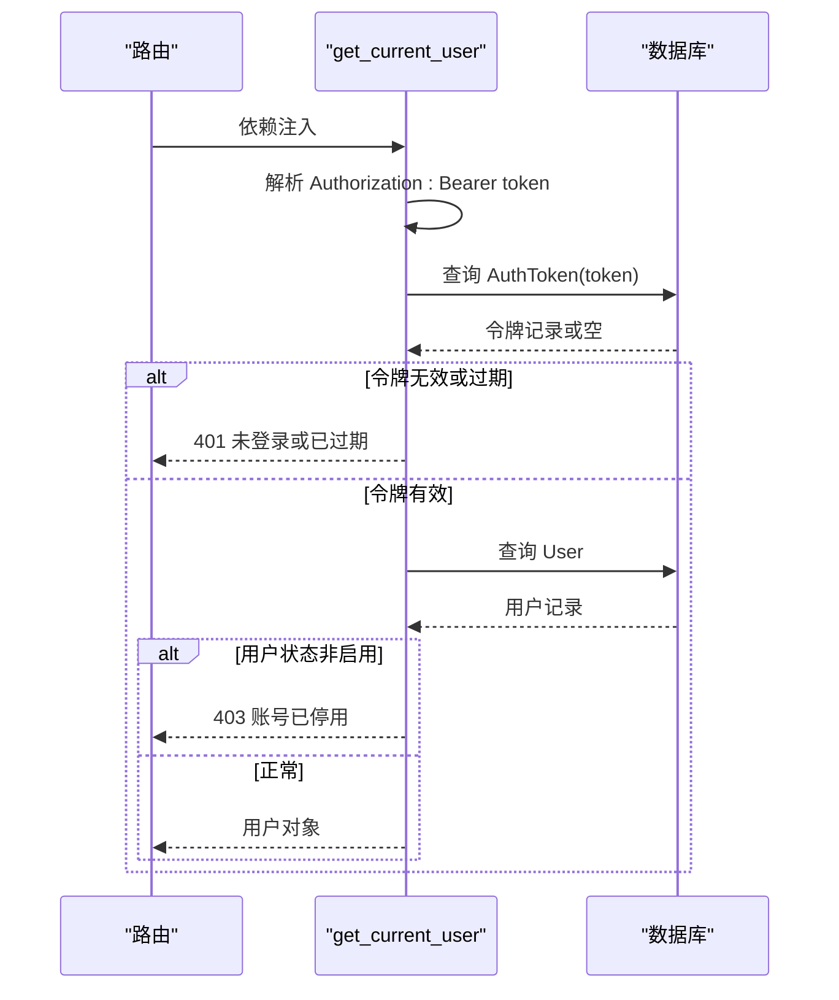
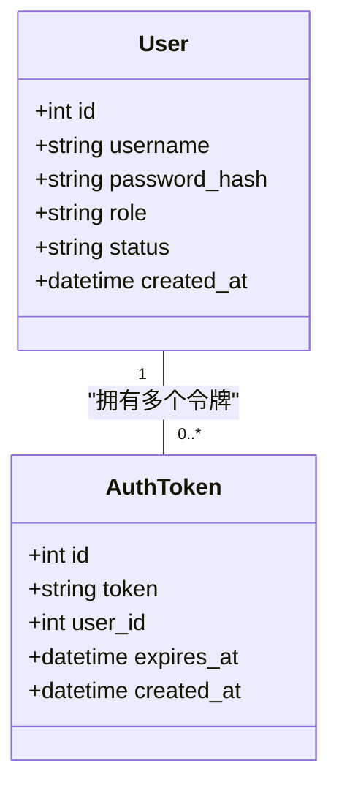
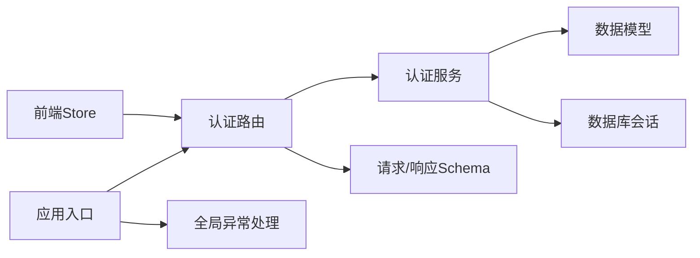

# 认证服务

<cite>
**本文引用的文件**
- [backend-python/app/routers/auth.py](file://backend-python/app/routers/auth.py)
- [backend-python/app/services/auth_service.py](file://backend-python/app/services/auth_service.py)
- [backend-python/app/models/auth.py](file://backend-python/app/models/auth.py)
- [backend-python/app/schemas/auth.py](file://backend-python/app/schemas/auth.py)
- [backend-python/app/main.py](file://backend-python/app/main.py)
- [backend-python/app/database.py](file://backend-python/app/database.py)
- [backend-python/app/common/errors.py](file://backend-python/app/common/errors.py)
- [backend-python/tests/test_api_auth.py](file://backend-python/tests/test_api_auth.py)
- [backend-python/tests/test_auth_service.py](file://backend-python/tests/test_auth_service.py)
- [frontend-vue/src/stores/user.ts](file://frontend-vue/src/stores/user.ts)
</cite>

## 目录
1. [简介](#简介)
2. [项目结构](#项目结构)
3. [核心组件](#核心组件)
4. [架构总览](#架构总览)
5. [详细组件分析](#详细组件分析)
6. [依赖关系分析](#依赖关系分析)
7. [性能考虑](#性能考虑)
8. [故障排查指南](#故障排查指南)
9. [结论](#结论)
10. [附录](#附录)

## 简介
本文件为 WMS 系统后端认证服务的权威文档，聚焦用户认证与授权的核心机制：登录校验、令牌签发与验证、权限控制、用户信息管理（CRUD）、安全策略与最佳实践。系统采用“随机令牌入库”的会话式鉴权方案，结合 PBKDF2-SHA256 密码哈希存储，提供可撤销、可过期的短期令牌，并通过 FastAPI 依赖注入实现统一的鉴权与角色访问控制。

## 项目结构
认证相关代码按职责分层组织：
- API 路由层：暴露登录、登出、当前用户、用户管理等接口
- 服务层：封装登录/登出、令牌校验、用户 CRUD、密码哈希等核心逻辑
- 数据模型层：定义用户与令牌表结构及关联关系
- Schema 层：定义请求/响应数据结构与校验规则
- 应用入口：注册路由、全局异常处理、CORS 配置
- 数据库层：连接配置与会话管理
- 前端 Store：持久化令牌与用户信息，调用认证 API

图表来源
- [backend-python/app/routers/auth.py:1-68](file://backend-python/app/routers/auth.py#L1-L68)
- [backend-python/app/services/auth_service.py:1-176](file://backend-python/app/services/auth_service.py#L1-L176)
- [backend-python/app/models/auth.py:1-40](file://backend-python/app/models/auth.py#L1-L40)
- [backend-python/app/schemas/auth.py:1-38](file://backend-python/app/schemas/auth.py#L1-L38)
- [backend-python/app/main.py:1-85](file://backend-python/app/main.py#L1-L85)
- [backend-python/app/database.py:1-38](file://backend-python/app/database.py#L1-L38)
- [backend-python/app/common/errors.py:1-9](file://backend-python/app/common/errors.py#L1-L9)
- [frontend-vue/src/stores/user.ts:1-49](file://frontend-vue/src/stores/user.ts#L1-L49)

章节来源
- [backend-python/app/routers/auth.py:1-68](file://backend-python/app/routers/auth.py#L1-L68)
- [backend-python/app/main.py:1-85](file://backend-python/app/main.py#L1-L85)

## 核心组件
- 认证路由：提供登录、登出、获取当前用户、用户管理（仅管理员）等端点
- 认证服务：实现密码哈希、登录签发令牌、令牌校验、登出失效、用户 CRUD、角色权限检查
- 数据模型：User（用户）、AuthToken（令牌）
- Schema：LoginRequest、UserCreate、UserUpdate、UserResponse、LoginResponse
- 应用入口：注册路由、全局异常处理器、健康探针
- 数据库：SQLite 默认，支持通过环境变量切换 MySQL/PostgreSQL
- 前端 Store：本地持久化 token 与用户信息，调用登录/登出/当前用户接口

章节来源
- [backend-python/app/services/auth_service.py:1-176](file://backend-python/app/services/auth_service.py#L1-L176)
- [backend-python/app/models/auth.py:1-40](file://backend-python/app/models/auth.py#L1-L40)
- [backend-python/app/schemas/auth.py:1-38](file://backend-python/app/schemas/auth.py#L1-L38)
- [backend-python/app/database.py:1-38](file://backend-python/app/database.py#L1-L38)
- [frontend-vue/src/stores/user.ts:1-49](file://frontend-vue/src/stores/user.ts#L1-L49)

## 架构总览
认证流程基于“随机令牌入库”的会话模式：
- 登录成功生成随机令牌并写入数据库，附带过期时间
- 后续请求携带 Authorization: Bearer <token>，服务端校验令牌存在且未过期，同时检查用户状态
- 登出删除对应令牌，使令牌立即失效
- 管理员专属接口通过 require_admin 依赖进行角色校验

图表来源
- [backend-python/app/routers/auth.py:14-33](file://backend-python/app/routers/auth.py#L14-L33)
- [backend-python/app/services/auth_service.py:116-168](file://backend-python/app/services/auth_service.py#L116-L168)
- [backend-python/app/models/auth.py:19-40](file://backend-python/app/models/auth.py#L19-L40)

## 详细组件分析

### 登录与令牌签发
- 登录流程：
  - 路由接收 LoginRequest，调用服务层 login
  - 服务层校验用户名与密码（PBKDF2-SHA256），检查账号状态
  - 生成随机令牌并写入数据库，设置 7 天有效期
  - 返回 token 与用户基本信息
- 登出流程：
  - 路由解析 Authorization 头中的 token
  - 服务层删除对应 AuthToken，使令牌立即失效

图表来源
- [backend-python/app/services/auth_service.py:116-129](file://backend-python/app/services/auth_service.py#L116-L129)
- [backend-python/app/routers/auth.py:15-18](file://backend-python/app/routers/auth.py#L15-L18)

章节来源
- [backend-python/app/routers/auth.py:14-26](file://backend-python/app/routers/auth.py#L14-L26)
- [backend-python/app/services/auth_service.py:116-134](file://backend-python/app/services/auth_service.py#L116-L134)

### 令牌验证与鉴权依赖
- 鉴权依赖 get_current_user：
  - 解析 Authorization 头，提取 Bearer token
  - 根据 token 查询 AuthToken，若不存在或已过期则删除并返回空
  - 校验用户状态，非启用状态返回 403
  - 返回当前用户对象供下游使用
- 管理员依赖 require_admin：
  - 在 get_current_user 基础上校验角色是否为 admin
  - 非管理员返回 403

图表来源
- [backend-python/app/services/auth_service.py:152-175](file://backend-python/app/services/auth_service.py#L152-L175)

章节来源
- [backend-python/app/services/auth_service.py:152-175](file://backend-python/app/services/auth_service.py#L152-L175)

### 用户管理与权限控制
- 用户管理接口（仅管理员）：
  - 列表、创建、更新、删除用户
  - 更新时保护最后一个启用管理员不被降级或停用
  - 删除时保护最后一个启用管理员不被删除
- 权限隔离：
  - operator 可访问业务接口，但无法访问用户管理接口
  - 管理员可访问所有接口

图表来源
- [backend-python/app/models/auth.py:19-40](file://backend-python/app/models/auth.py#L19-L40)

章节来源
- [backend-python/app/routers/auth.py:35-67](file://backend-python/app/routers/auth.py#L35-L67)
- [backend-python/app/services/auth_service.py:56-112](file://backend-python/app/services/auth_service.py#L56-L112)

### 密码加密与安全策略
- 密码哈希：
  - 使用 PBKDF2-SHA256，迭代次数 100k，随机盐，不落明文
  - 提供 hash_password 与 verify_password 方法
- 安全策略：
  - 令牌随机值入库，支持撤销与过期
  - 登录有效期 7 天
  - 账号状态控制（启用/停用）
  - 管理员保护：防止误删或停用最后一个启用管理员

章节来源
- [backend-python/app/services/auth_service.py:25-42](file://backend-python/app/services/auth_service.py#L25-L42)
- [backend-python/app/services/auth_service.py:75-112](file://backend-python/app/services/auth_service.py#L75-L112)

### 前端集成与令牌管理
- 前端 Store：
  - 登录成功后将 token 与用户信息持久化到 localStorage
  - 提供登录、获取当前用户、登出等方法
  - 登出时清理本地状态，并尝试调用后端登出接口
- 请求拦截：
  - 在请求头中自动附加 Authorization: Bearer token
  - 未登录或令牌无效时跳转登录页或提示重新登录

章节来源
- [frontend-vue/src/stores/user.ts:1-49](file://frontend-vue/src/stores/user.ts#L1-L49)

## 依赖关系分析
- 路由层依赖服务层与 Schema
- 服务层依赖数据模型与数据库会话
- 应用入口统一注册路由与异常处理
- 前端 Store 依赖认证 API 与本地存储

图表来源
- [backend-python/app/routers/auth.py:1-68](file://backend-python/app/routers/auth.py#L1-L68)
- [backend-python/app/services/auth_service.py:1-176](file://backend-python/app/services/auth_service.py#L1-L176)
- [backend-python/app/models/auth.py:1-40](file://backend-python/app/models/auth.py#L1-L40)
- [backend-python/app/schemas/auth.py:1-38](file://backend-python/app/schemas/auth.py#L1-L38)
- [backend-python/app/main.py:1-85](file://backend-python/app/main.py#L1-L85)
- [backend-python/app/database.py:1-38](file://backend-python/app/database.py#L1-L38)
- [frontend-vue/src/stores/user.ts:1-49](file://frontend-vue/src/stores/user.ts#L1-L49)

章节来源
- [backend-python/app/main.py:53-69](file://backend-python/app/main.py#L53-L69)

## 性能考虑
- 密码哈希：PBKDF2-SHA256 迭代次数较高，登录时会有 CPU 开销，建议在高并发场景下评估硬件资源
- 令牌校验：每次请求需查询数据库，建议在热点路径引入缓存（如 Redis）以减轻数据库压力
- 数据库连接：使用 SQLAlchemy 会话池，避免频繁连接创建
- 前端优化：本地持久化 token，减少重复登录；登出时异步调用后端接口，不阻塞 UI

[本节为通用性能建议，不直接分析具体文件]

## 故障排查指南
- 401 未登录或令牌无效：
  - 检查 Authorization 头是否正确携带 Bearer token
  - 确认令牌未过期且存在于数据库
  - 参考测试用例验证令牌校验逻辑
- 403 账号已停用或无权限：
  - 检查用户状态是否为 ACTIVE
  - 确认当前用户角色是否为 admin（访问用户管理接口）
- 409 冲突：
  - 创建用户时用户名重复
  - 尝试删除或停用最后一个启用管理员
- 全局异常处理：
  - BusinessError 会被统一转换为 JSON 响应，便于前端处理

章节来源
- [backend-python/tests/test_api_auth.py:22-63](file://backend-python/tests/test_api_auth.py#L22-L63)
- [backend-python/tests/test_auth_service.py:22-140](file://backend-python/tests/test_auth_service.py#L22-L140)
- [backend-python/app/common/errors.py:1-9](file://backend-python/app/common/errors.py#L1-L9)

## 结论
本认证服务采用“随机令牌入库”的会话式鉴权方案，结合 PBKDF2-SHA256 密码哈希与严格的角色权限控制，提供了安全的用户认证与授权机制。通过 FastAPI 依赖注入实现统一的鉴权逻辑，配合前端 Store 的本地持久化，实现了完整的登录态管理。系统在安全性、可维护性与扩展性方面具备良好设计，适合在生产环境中部署与演进。

[本节为总结性内容，不直接分析具体文件]

## 附录
- API 端点概览：
  - POST /api/auth/login：登录，返回 token 与用户信息
  - POST /api/auth/logout：登出，使令牌失效
  - GET /api/auth/me：获取当前用户信息
  - GET /api/users：列出用户（仅管理员）
  - POST /api/users：创建用户（仅管理员）
  - PUT /api/users/{user_id}：更新用户（仅管理员）
  - DELETE /api/users/{user_id}：删除用户（仅管理员）
- 安全最佳实践：
  - 使用强密码策略与高迭代次数的哈希算法
  - 令牌短期有效并支持撤销
  - 严格的角色权限控制与最小权限原则
  - 生产环境启用 HTTPS 与 CORS 白名单
- 扩展性设计：
  - 支持多数据库后端（SQLite/MySQL/PostgreSQL）
  - 可通过缓存层优化令牌校验性能
  - 可扩展更多角色与权限粒度

[本节为补充信息，不直接分析具体文件]