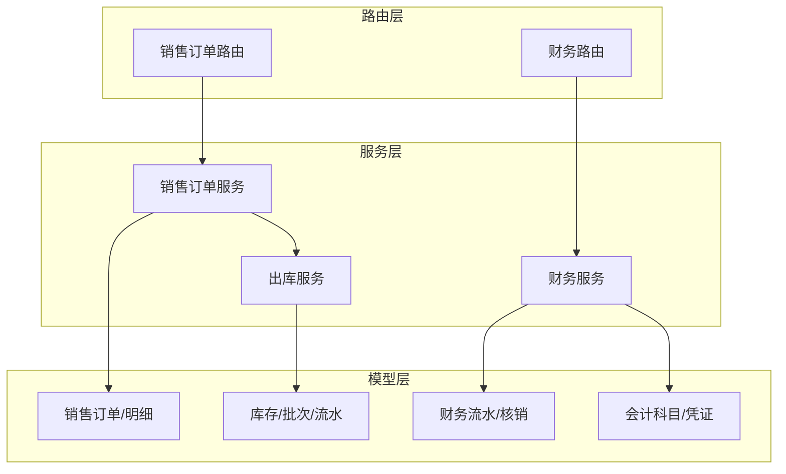
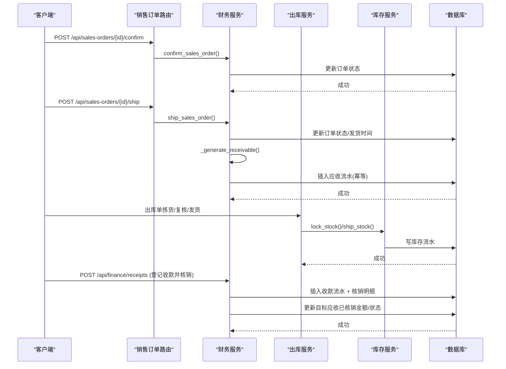
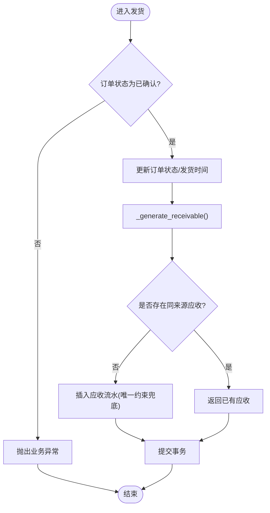
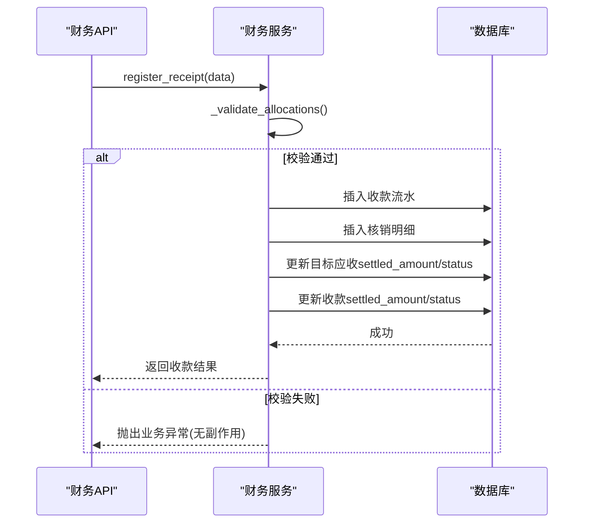
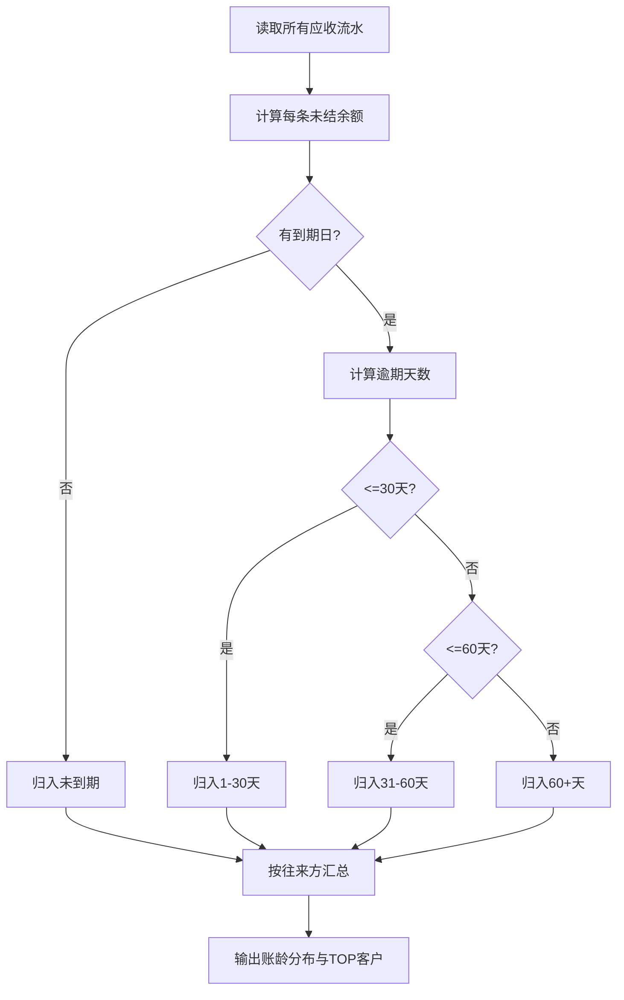
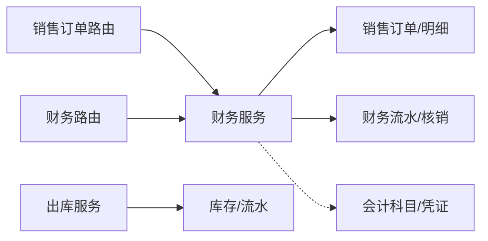
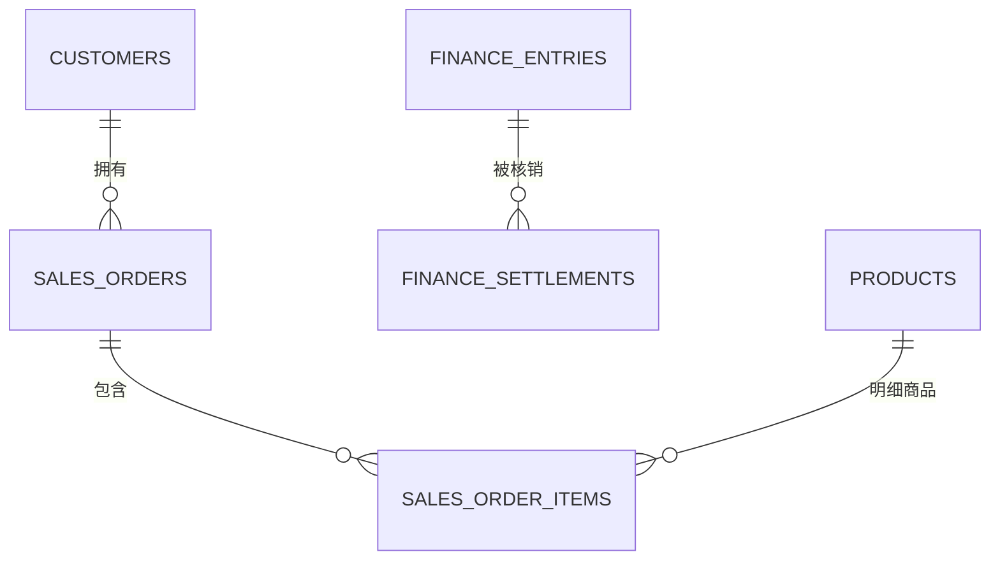

# 财务服务

<cite>
**本文引用的文件**
- [finance.py](file://backend-python/app/models/finance.py)
- [finance_service.py](file://backend-python/app/services/finance_service.py)
- [finance.py](file://backend-python/app/routers/finance.py)
- [finance.py](file://backend-python/app/schemas/finance.py)
- [sales_orders.py](file://backend-python/app/routers/sales_orders.py)
- [outbound_service.py](file://backend-python/app/services/outbound_service.py)
- [inventory.py](file://backend-python/app/models/inventory.py)
- [orders.py](file://backend-python/app/models/orders.py)
- [accounting.py](file://backend-python/app/models/accounting.py)
- [errors.py](file://backend-python/app/common/errors.py)
- [test_finance_service.py](file://backend-python/tests/test_finance_service.py)
</cite>

## 目录
1. [简介](#简介)
2. [项目结构](#项目结构)
3. [核心组件](#核心组件)
4. [架构总览](#架构总览)
5. [详细组件分析](#详细组件分析)
6. [依赖关系分析](#依赖关系分析)
7. [性能考虑](#性能考虑)
8. [故障排查指南](#故障排查指南)
9. [结论](#结论)
10. [附录](#附录)

## 简介
本文件面向WMS系统的“业财一体”财务能力，围绕销售订单到应收、收款登记与核销的完整闭环进行系统化说明。重点包括：
- 应收生成机制：在发货时自动创建应收记录，金额计算与账期管理（到期日=发货日期+账期）。
- 收款核销：支持手工核销与后续追加核销，具备部分核销、预收余额复用、超额拦截等规则。
- 财务流水：统一模型记录应收/应付/收款/付款，状态由已核销金额推导，确保可追溯与审计。
- 账龄分析与经营驾驶舱：以到期日为基准的账龄分段、按往来方汇总、趋势统计。
- 集成关系：与销售订单服务、库存服务的协作方式与数据一致性保障。
- 事务与幂等：三层幂等保护、异常回滚策略、并发安全。

## 项目结构
后端采用分层设计：路由层暴露REST接口，服务层封装业务逻辑，模型层定义数据表结构，Schema层用于请求/响应校验。财务相关的关键文件如下：
- 模型：销售订单、财务流水、核销明细、会计科目与凭证等。
- 服务：销售订单生命周期、应收生成、收款登记与核销、账龄与驾驶舱聚合。
- 路由：销售订单与财务API。
- Schema：订单、收款、核销等数据结构定义。

图表来源
- [sales_orders.py:1-81](file://backend-python/app/routers/sales_orders.py#L1-L81)
- [finance.py:1-60](file://backend-python/app/routers/finance.py#L1-L60)
- [finance_service.py:1-607](file://backend-python/app/services/finance_service.py#L1-L607)
- [finance.py:1-117](file://backend-python/app/models/finance.py#L1-L117)
- [inventory.py:1-98](file://backend-python/app/models/inventory.py#L1-L98)
- [accounting.py:1-159](file://backend-python/app/models/accounting.py#L1-L159)

章节来源
- [sales_orders.py:1-81](file://backend-python/app/routers/sales_orders.py#L1-L81)
- [finance.py:1-60](file://backend-python/app/routers/finance.py#L1-L60)
- [finance_service.py:1-607](file://backend-python/app/services/finance_service.py#L1-L607)
- [finance.py:1-117](file://backend-python/app/models/finance.py#L1-L117)
- [inventory.py:1-98](file://backend-python/app/models/inventory.py#L1-L98)
- [accounting.py:1-159](file://backend-python/app/models/accounting.py#L1-L159)

## 核心组件
- 销售订单与明细：维护订单主从关系、金额汇总、账期字段。
- 财务流水：统一记录应收/应付/收款/付款，包含发生日、到期日、已核销金额、状态推导。
- 核销明细：记录一笔收款/付款对某张应收/应付的部分或全部核销。
- 会计内核：科目树、期间控制、记账凭证与分录，为未来凭证引擎提供基础。
- 出库与库存：拣货锁定、复核、发货扣减，保证库存变动全量可追溯。

章节来源
- [finance.py:24-117](file://backend-python/app/models/finance.py#L24-L117)
- [accounting.py:63-159](file://backend-python/app/models/accounting.py#L63-L159)
- [orders.py:50-176](file://backend-python/app/models/orders.py#L50-L176)
- [inventory.py:33-98](file://backend-python/app/models/inventory.py#L33-L98)

## 架构总览
下图展示从销售订单确认到发货生成应收，再到收款登记与核销的端到端流程，以及与库存服务的交互。

图表来源
- [sales_orders.py:52-66](file://backend-python/app/routers/sales_orders.py#L52-L66)
- [finance_service.py:235-336](file://backend-python/app/services/finance_service.py#L235-L336)
- [outbound_service.py:102-176](file://backend-python/app/services/outbound_service.py#L102-L176)
- [inventory.py:63-98](file://backend-python/app/models/inventory.py#L63-L98)

## 详细组件分析

### 销售订单到应收的生成机制
- 触发时机：订单状态从“已确认”变为“已发货”时生成应收。
- 金额计算：应收金额等于订单总金额（由明细数量×单价汇总）。
- 账期管理：到期日=发货日期+账期（天），若未设置账期则默认当天到期。
- 幂等保护：
  - 服务层预查同一来源单据+类型是否已有应收。
  - 数据库唯一约束(source_order_no, entry_type)。
  - 并发冲突时抛出业务异常，调用方回滚并重试。
- 事务一致性：发货与应收生成在同一事务中；若应收生成失败，整单发货回滚，避免“已发货无应收”的不一致态。

图表来源
- [finance_service.py:246-336](file://backend-python/app/services/finance_service.py#L246-L336)
- [finance.py:71-102](file://backend-python/app/models/finance.py#L71-L102)

章节来源
- [finance_service.py:235-336](file://backend-python/app/services/finance_service.py#L235-L336)
- [finance.py:24-102](file://backend-python/app/models/finance.py#L24-L102)
- [sales_orders.py:52-66](file://backend-python/app/routers/sales_orders.py#L52-L66)

### 收款登记与核销处理
- 收款登记：
  - 支持到账金额大于核销金额，差额作为预收余额保留，可后续继续核销。
  - 可选一次性核销多张应收，需满足每张应收的未结余额限制。
- 追加核销：
  - 针对已有收款流水的未核销余额，继续分配到其他应收。
- 校验与状态：
  - 先只读校验（目标存在、类型正确、金额为正、不超单张未结、合计不超可核销余额），通过后写入。
  - 目标应收状态由已核销金额推导：OPEN/PARTIAL/SETTLED。
  - 收款流水状态同样基于amount与settled_amount推导。
- 事务与回滚：
  - 校验失败不写库；写入失败整体回滚，确保无副作用。

图表来源
- [finance_service.py:341-439](file://backend-python/app/services/finance_service.py#L341-L439)
- [finance.py:71-117](file://backend-python/app/models/finance.py#L71-L117)
- [finance.py:39-52](file://backend-python/app/routers/finance.py#L39-L52)

章节来源
- [finance_service.py:341-439](file://backend-python/app/services/finance_service.py#L341-L439)
- [finance.py:71-117](file://backend-python/app/models/finance.py#L71-L117)
- [finance.py:39-52](file://backend-python/app/routers/finance.py#L39-L52)

### 账龄分析与财务报表
- 账龄分段：以到期日为基准，分为未到期、逾期1-30天、31-60天、60+天。
- 按往来方汇总：统计应收总额、已核销总额、未结余额及各账龄段分布。
- 经营驾驶舱：
  - 应收总额、已回款、未回款、逾期金额。
  - 订单数与订单金额（排除作废订单）。
  - 近N天订单金额与回款金额趋势。
- 数据来源：直接查询财务流水与订单表，实时计算，不落额外中间表。

图表来源
- [finance_service.py:444-552](file://backend-python/app/services/finance_service.py#L444-L552)

章节来源
- [finance_service.py:444-552](file://backend-python/app/services/finance_service.py#L444-L552)

### 与销售订单服务、库存服务的集成
- 销售订单服务：
  - 草稿→确认→发货→完成/作废的状态机。
  - 发货时触发应收生成，确保业务与财务同步。
- 库存服务：
  - 出库单拣货锁定可用库存，防止超卖。
  - 复核后发货扣减锁定库存，写库存流水，保证可追溯。
- 一致性保障：
  - 出库与财务各自独立事务，但通过业务事件（如发货）驱动财务变更。
  - 库存流水与财务流水共同构成“业财一体”的可审计轨迹。

章节来源
- [sales_orders.py:13-81](file://backend-python/app/routers/sales_orders.py#L13-L81)
- [outbound_service.py:102-176](file://backend-python/app/services/outbound_service.py#L102-L176)
- [inventory.py:63-98](file://backend-python/app/models/inventory.py#L63-L98)

### 财务数据一致性与事务处理
- 幂等三层：
  - 服务层预查。
  - 数据库唯一约束。
  - 异常兜底（IntegrityError/BusinessError）。
- 事务边界：
  - 发货与应收生成在同一事务；失败回滚。
  - 收款登记与核销写入在同一事务；校验失败不写库。
- 删除保护：
  - 已核销的应收禁止删除，防止破坏历史核销链。

章节来源
- [finance_service.py:295-336](file://backend-python/app/services/finance_service.py#L295-L336)
- [finance_service.py:341-439](file://backend-python/app/services/finance_service.py#L341-L439)
- [finance_service.py:593-607](file://backend-python/app/services/finance_service.py#L593-L607)
- [errors.py:4-9](file://backend-python/app/common/errors.py#L4-L9)

## 依赖关系分析
- 路由依赖服务：销售订单路由调用财务服务中的订单操作；财务路由调用财务服务中的应收、收款、账龄等能力。
- 服务依赖模型：财务服务读写销售订单、财务流水、核销明细；出库服务读写出库单、库存及库存流水。
- 会计内核：当前未直接参与销售到应收流程，但为未来凭证引擎提供科目、期间、凭证与分录的基础。

图表来源
- [sales_orders.py:1-81](file://backend-python/app/routers/sales_orders.py#L1-L81)
- [finance.py:1-60](file://backend-python/app/routers/finance.py#L1-L60)
- [finance_service.py:1-607](file://backend-python/app/services/finance_service.py#L1-L607)
- [outbound_service.py:1-196](file://backend-python/app/services/outbound_service.py#L1-L196)
- [finance.py:1-117](file://backend-python/app/models/finance.py#L1-L117)
- [inventory.py:1-98](file://backend-python/app/models/inventory.py#L1-L98)
- [accounting.py:1-159](file://backend-python/app/models/accounting.py#L1-L159)

章节来源
- [sales_orders.py:1-81](file://backend-python/app/routers/sales_orders.py#L1-L81)
- [finance.py:1-60](file://backend-python/app/routers/finance.py#L1-L60)
- [finance_service.py:1-607](file://backend-python/app/services/finance_service.py#L1-L607)
- [outbound_service.py:1-196](file://backend-python/app/services/outbound_service.py#L1-L196)
- [finance.py:1-117](file://backend-python/app/models/finance.py#L1-L117)
- [inventory.py:1-98](file://backend-python/app/models/inventory.py#L1-L98)
- [accounting.py:1-159](file://backend-python/app/models/accounting.py#L1-L159)

## 性能考虑
- 查询优化：
  - 使用joinedload加载关联明细，避免N+1查询。
  - 对常用过滤列建索引（如订单状态、往来方名称、类型、到期日等）。
- 金额精度：
  - 统一round(...,2)避免浮点误差累积。
- 并发安全：
  - 唯一约束与重试机制应对并发冲突。
- 批量与分页：
  - 列表接口支持分页，减少单次响应体积。
- 建议：
  - 对高频查询增加覆盖索引（如entry_type、partner_name、due_date）。
  - 对账龄与驾驶舱聚合可考虑定时物化视图或缓存层（Redis）以提升报表性能。

[本节为通用指导，无需特定文件引用]

## 故障排查指南
- 常见错误：
  - 重复发货：抛出业务异常，不会新增第二条应收。
  - 超额核销：校验失败，整单回滚，不产生收款或核销记录。
  - 删除已核销应收：禁止删除，提示存在核销记录。
- 定位方法：
  - 查看财务流水与核销明细，确认目标应收是否存在且类型正确。
  - 检查订单状态机是否符合预期（未确认不可发货、已发货不可作废）。
  - 核对账期与到期日是否正确计算。
- 参考测试用例：
  - 发货生成应收、幂等性、部分核销与结清、预收余额复用、账龄分段、驾驶舱口径一致性。

章节来源
- [finance_service.py:246-336](file://backend-python/app/services/finance_service.py#L246-L336)
- [finance_service.py:341-439](file://backend-python/app/services/finance_service.py#L341-L439)
- [finance_service.py:593-607](file://backend-python/app/services/finance_service.py#L593-L607)
- [test_finance_service.py:93-249](file://backend-python/tests/test_finance_service.py#L93-L249)

## 结论
本财务服务实现了销售订单到应收、收款登记与核销的完整闭环，具备严格的幂等与事务一致性保障。通过统一的财务流水模型与核销明细，确保了所有财务变动的可追溯与审计。结合账龄分析与经营驾驶舱，提供了实时的财务洞察。未来可通过凭证引擎将业务事件转化为标准会计凭证，进一步完善业财一体化能力。

[本节为总结，无需特定文件引用]

## 附录

### API概览
- 销售订单：
  - 创建/更新/确认/发货/完成/作废。
- 财务：
  - 应收台账查询（含逾期标记与未结余额）。
  - 账龄分布查询。
  - 收款登记与核销（支持部分核销与预收余额复用）。
  - 删除应收（受核销记录保护）。

章节来源
- [sales_orders.py:13-81](file://backend-python/app/routers/sales_orders.py#L13-L81)
- [finance.py:13-59](file://backend-python/app/routers/finance.py#L13-L59)

### 关键数据模型关系

图表来源
- [finance.py:24-117](file://backend-python/app/models/finance.py#L24-L117)
- [orders.py:50-176](file://backend-python/app/models/orders.py#L50-L176)