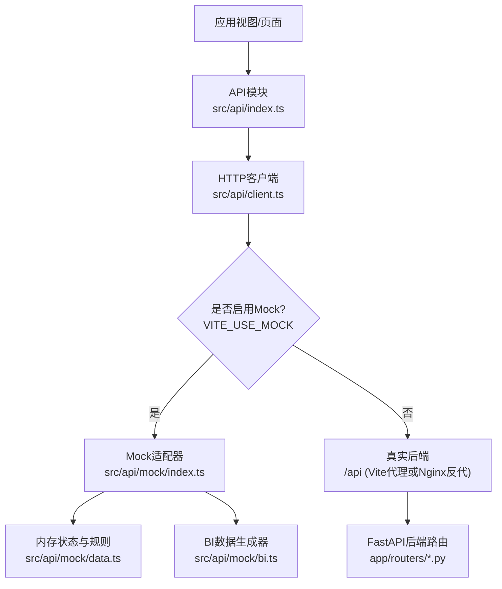
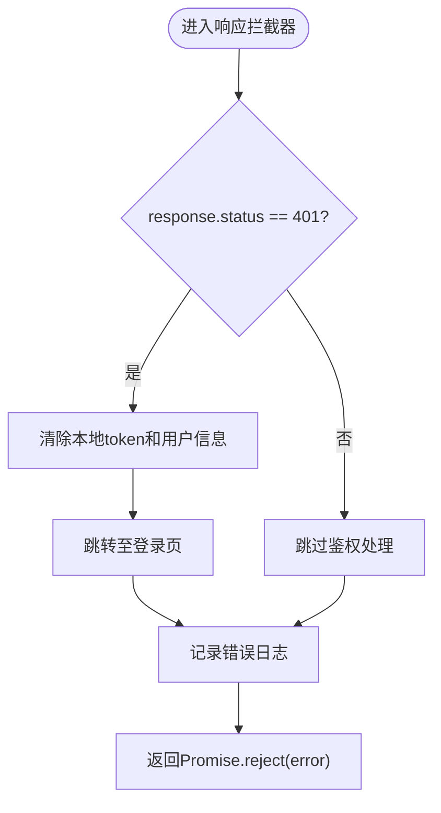
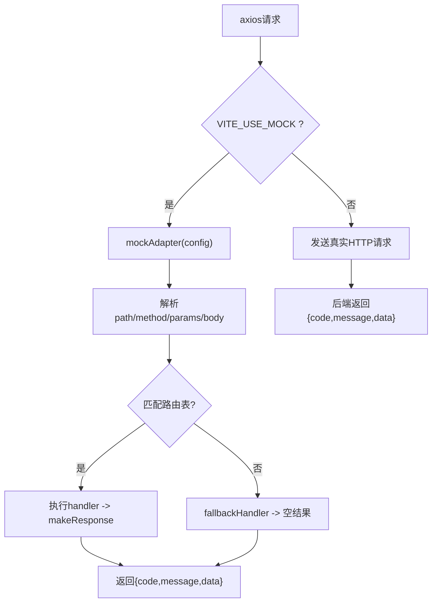
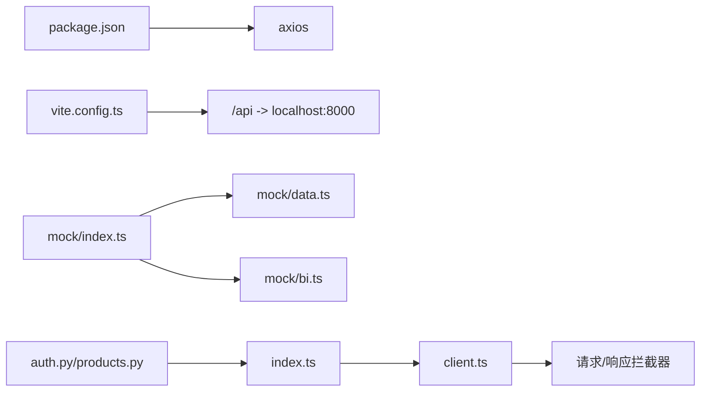

# API客户端设计

<cite>
**本文引用的文件**
- [client.ts](file://frontend-vue/src/api/client.ts)
- [index.ts](file://frontend-vue/src/api/index.ts)
- [mock/index.ts](file://frontend-vue/src/api/mock/index.ts)
- [mock/data.ts](file://frontend-vue/src/api/mock/data.ts)
- [mock/bi.ts](file://frontend-vue/src/api/mock/bi.ts)
- [vite.config.ts](file://frontend-vue/vite.config.ts)
- [package.json](file://frontend-vue/package.json)
- [auth.py](file://backend-python/app/routers/auth.py)
- [products.py](file://backend-python/app/routers/products.py)
</cite>

## 目录
1. [简介](#简介)
2. [项目结构](#项目结构)
3. [核心组件](#核心组件)
4. [架构总览](#架构总览)
5. [详细组件分析](#详细组件分析)
6. [依赖关系分析](#依赖关系分析)
7. [性能与可观测性](#性能与可观测性)
8. [故障排查指南](#故障排查指南)
9. [结论](#结论)
10. [附录：接口类型与版本策略](#附录接口类型与版本策略)

## 简介
本文件面向WMS系统的前端API客户端，系统性说明以下主题：
- HTTP请求封装与拦截器实现（鉴权、统一响应提取、错误处理）
- Mock模式与真实后端的切换机制
- 错误处理与重试策略现状与建议
- 请求参数验证与响应数据转换
- API接口类型定义与自动代码生成建议
- 缓存策略与离线数据处理方案
- 请求监控与性能分析工具集成
- API版本管理与向后兼容策略

## 项目结构
前端Vue工程通过axios创建统一的HTTP客户端实例，并在构建期根据环境变量决定是否启用纯前端Mock适配器。业务API按领域拆分导出类型与函数；Mock层提供与后端一致的响应结构与路由匹配，保证在无后端时仍可演示完整流程。



图表来源
- [client.ts:4-16](file://frontend-vue/src/api/client.ts#L4-L16)
- [mock/index.ts:381-410](file://frontend-vue/src/api/mock/index.ts#L381-L410)
- [vite.config.ts:19-26](file://frontend-vue/vite.config.ts#L19-L26)
- [auth.py:15-32](file://backend-python/app/routers/auth.py#L15-L32)
- [products.py:13-27](file://backend-python/app/routers/products.py#L13-L27)

章节来源
- [client.ts:4-16](file://frontend-vue/src/api/client.ts#L4-L16)
- [vite.config.ts:19-26](file://frontend-vue/vite.config.ts#L19-L26)

## 核心组件
- HTTP客户端与拦截器
  - 基于axios创建实例，设置baseURL、超时与默认头
  - 请求拦截器：自动附加Authorization头（从localStorage读取token）
  - 响应拦截器：统一返回data字段；401时清理登录态并跳转登录页
- Mock适配器
  - 在构建期通过环境变量注入adapter，将网络请求拦截到本地实现
  - 路由表匹配方法+正则路径，调用对应处理器构造与后端一致的结构{code, message, data}
  - 兜底策略：未覆盖的列表接口返回空分页，数组接口返回空数组，避免旧页面崩溃
- API模块
  - 集中定义领域类型与API函数，统一使用客户端发起请求
  - 分页结构PageData<T>，所有列表接口返回该结构
  - 登录接口特殊超时配置以适配Serverless冷启动

章节来源
- [client.ts:18-42](file://frontend-vue/src/api/client.ts#L18-L42)
- [index.ts:3-8](file://frontend-vue/src/api/index.ts#L3-L8)
- [index.ts:459-470](file://frontend-vue/src/api/index.ts#L459-L470)
- [mock/index.ts:17-39](file://frontend-vue/src/api/mock/index.ts#L17-L39)
- [mock/index.ts:356-377](file://frontend-vue/src/api/mock/index.ts#L356-L377)

## 架构总览
下图展示了请求从页面到后端（或Mock）的完整链路，包括鉴权、拦截、路由匹配与响应处理。

```mermaid
sequenceDiagram
participant V as "视图"
participant API as "API模块"
participant AX as "axios实例"
participant M as "Mock适配器"
participant S as "后端路由"
V->>API : 调用业务函数(如getProducts)
API->>AX : axios.get('/products', {params})
AX->>AX : 请求拦截器(附加Authorization)
alt 启用Mock
AX->>M : adapter(config)
M->>M : 解析method/path/params/body
M->>M : 匹配路由表并执行handler
M-->>AX : makeResponse({code,message,data})
else 真实后端
AX->>S : /api/products?...
S-->>AX : {code,message,data}
end
AX->>AX : 响应拦截器(取data; 401处理)
AX-->>API : Promise.resolve(data)
API-->>V : 返回结构化数据
```

图表来源
- [client.ts:18-42](file://frontend-vue/src/api/client.ts#L18-L42)
- [mock/index.ts:381-410](file://frontend-vue/src/api/mock/index.ts#L381-L410)
- [auth.py:15-32](file://backend-python/app/routers/auth.py#L15-L32)
- [products.py:13-27](file://backend-python/app/routers/products.py#L13-L27)

## 详细组件分析

### HTTP客户端与拦截器
- 基础配置
  - baseURL优先使用环境变量VITE_API_BASE，否则走相对路径/api（开发由Vite代理，生产由Nginx反代）
  - 默认超时10s；登录接口单独设置为60s以应对冷启动
- 请求拦截器
  - 从localStorage读取psifin_token并注入Authorization: Bearer <token>
- 响应拦截器
  - 成功响应直接返回res.data
  - 失败响应中若status为401，则清除本地登录态并跳转到登录页；同时打印错误信息并拒绝Promise



图表来源
- [client.ts:27-42](file://frontend-vue/src/api/client.ts#L27-L42)

章节来源
- [client.ts:4-16](file://frontend-vue/src/api/client.ts#L4-L16)
- [client.ts:18-42](file://frontend-vue/src/api/client.ts#L18-L42)
- [index.ts:459-470](file://frontend-vue/src/api/index.ts#L459-L470)

### Mock模式与真实后端切换
- 切换机制
  - 当构建环境变量VITE_USE_MOCK为true时，将axios实例的adapter替换为mockAdapter
  - 未命中任何路由时，采用兜底策略返回空分页或空数组，确保页面不崩溃
- 路由匹配
  - 每个路由包含HTTP方法与正则表达式，匹配成功后调用对应处理器
  - 处理器内部维护内存状态（customers、products、orders、entries等），模拟业务流转
- BI数据生成
  - 独立于axios适配器，提供确定性随机数种子，保证相同筛选条件输出稳定数据



图表来源
- [client.ts:12-16](file://frontend-vue/src/api/client.ts#L12-L16)
- [mock/index.ts:77-354](file://frontend-vue/src/api/mock/index.ts#L77-L354)
- [mock/index.ts:356-377](file://frontend-vue/src/api/mock/index.ts#L356-L377)
- [mock/index.ts:381-410](file://frontend-vue/src/api/mock/index.ts#L381-L410)

章节来源
- [client.ts:12-16](file://frontend-vue/src/api/client.ts#L12-L16)
- [mock/index.ts:381-410](file://frontend-vue/src/api/mock/index.ts#L381-L410)
- [mock/data.ts:94-164](file://frontend-vue/src/api/mock/data.ts#L94-L164)
- [mock/bi.ts:78-124](file://frontend-vue/src/api/mock/bi.ts#L78-L124)

### 错误处理与重试策略
- 当前实现
  - 401统一处理：清理登录态并跳转登录页
  - 其他错误：打印错误消息并拒绝Promise，由调用方决定如何处理
- 建议的重试策略
  - 针对幂等GET请求可实现指数退避重试（例如最多3次，间隔递增）
  - 对网络异常进行捕获并重试；对业务错误（code非200）不重试
  - 可通过封装通用请求函数或在响应拦截器中增加重试逻辑实现

章节来源
- [client.ts:27-42](file://frontend-vue/src/api/client.ts#L27-L42)

### 请求参数验证与响应数据转换
- 请求参数
  - 列表接口普遍支持分页参数page、pageSize以及业务过滤参数
  - 部分接口支持可选参数（如warehouseId、zoneId、keyword等）
- 响应数据
  - 统一结构{code, message, data}，响应拦截器已抽取data
  - 列表接口返回PageData<T>，包含list、total、page、pageSize
- 建议
  - 可在请求前对必填参数进行校验（如id、关键字长度）
  - 对金额、数量等数值字段进行范围校验

章节来源
- [index.ts:3-8](file://frontend-vue/src/api/index.ts#L3-L8)
- [index.ts:40-52](file://frontend-vue/src/api/index.ts#L40-L52)
- [index.ts:77-89](file://frontend-vue/src/api/index.ts#L77-L89)
- [index.ts:199-220](file://frontend-vue/src/api/index.ts#L199-L220)

### API接口类型定义与自动代码生成
- 当前类型
  - 所有实体与载荷类型均在API模块中集中定义（如Product、Customer、InboundOrder等）
  - 分页结构PageData<T>用于统一列表响应
- 自动代码生成建议
  - 基于后端OpenAPI/Swagger规范，自动生成TypeScript类型与客户端函数
  - 保持前后端契约一致性，减少手工维护成本
  - 可结合Vite插件在构建阶段生成，或作为CI步骤生成并提交

章节来源
- [index.ts:12-26](file://frontend-vue/src/api/index.ts#L12-L26)
- [index.ts:57-75](file://frontend-vue/src/api/index.ts#L57-L75)
- [index.ts:239-259](file://frontend-vue/src/api/index.ts#L239-L259)

### 缓存策略与离线数据处理
- 当前实现
  - 未发现全局缓存层；每次请求均通过网络或Mock获取最新数据
- 建议方案
  - 读多写少场景（如商品、仓库、库区、库位）可使用内存缓存或浏览器Storage缓存
  - 结合SWR/React Query/VueUse等数据获取库实现缓存、失效与后台更新
  - 离线场景：使用Service Worker缓存关键资源与接口响应，队列化待提交操作，网络恢复后同步

[本节为概念性内容，不直接分析具体文件]

### 请求监控与性能分析工具集成
- 当前实现
  - 响应拦截器中打印错误信息，便于调试
- 建议集成
  - 在请求拦截器中记录开始时间、URL、方法、参数
  - 在响应拦截器中计算耗时、记录成功/失败统计
  - 上报至监控系统（如Sentry、Prometheus）或前端埋点平台
  - 对慢请求进行告警与采样

章节来源
- [client.ts:27-42](file://frontend-vue/src/api/client.ts#L27-L42)

### API版本管理与向后兼容策略
- 当前实践
  - 后端路由未显式版本化（如/api/v1），但通过统一响应结构{code,message,data}降低破坏性变更影响
- 建议策略
  - 引入URL版本前缀（/api/v1）或Accept-Version头管理版本
  - 废弃字段保留一段时间并提供迁移提示
  - 新增可选字段优先，避免破坏现有客户端

章节来源
- [auth.py:15-32](file://backend-python/app/routers/auth.py#L15-L32)
- [products.py:13-27](file://backend-python/app/routers/products.py#L13-L27)

## 依赖关系分析
- 前端依赖
  - axios用于HTTP通信
  - vite.config.ts配置开发代理与构建选项
  - package.json声明依赖与脚本
- 后端依赖
  - FastAPI路由定义接口契约
  - 服务层实现业务逻辑（不在本文件范围内）



图表来源
- [package.json:15-22](file://frontend-vue/package.json#L15-L22)
- [vite.config.ts:19-26](file://frontend-vue/vite.config.ts#L19-L26)
- [client.ts:18-42](file://frontend-vue/src/api/client.ts#L18-L42)
- [mock/index.ts:381-410](file://frontend-vue/src/api/mock/index.ts#L381-L410)
- [auth.py:15-32](file://backend-python/app/routers/auth.py#L15-L32)
- [products.py:13-27](file://backend-python/app/routers/products.py#L13-L27)

章节来源
- [package.json:15-22](file://frontend-vue/package.json#L15-L22)
- [vite.config.ts:19-26](file://frontend-vue/vite.config.ts#L19-L26)

## 性能与可观测性
- 性能优化建议
  - 对频繁查询的列表接口实施分页与防抖
  - 对静态或低频变化数据实施缓存
  - 合并重复请求（请求去重）
- 可观测性建议
  - 在拦截器中记录请求耗时、状态码、错误堆栈
  - 对关键业务接口添加指标上报（成功率、P95/P99耗时）
  - 结合浏览器Performance API分析首屏与交互延迟

[本节为通用指导，不直接分析具体文件]

## 故障排查指南
- 常见问题
  - 401未登录：检查localStorage中的token是否存在且有效；确认请求拦截器是否正确附加Authorization头
  - Mock未生效：确认构建环境变量VITE_USE_MOCK是否为true；检查axios实例是否被正确替换adapter
  - 接口无数据：检查Mock路由是否覆盖目标路径；查看兜底策略是否返回空结果
- 定位步骤
  - 打开浏览器控制台查看API Error日志
  - 在响应拦截器中打印请求与响应详情
  - 使用Network面板检查实际请求URL与方法

章节来源
- [client.ts:27-42](file://frontend-vue/src/api/client.ts#L27-L42)
- [mock/index.ts:356-377](file://frontend-vue/src/api/mock/index.ts#L356-L377)

## 结论
本API客户端通过axios封装与拦截器实现了统一的鉴权、错误处理与响应转换；借助Mock适配器在无后端环境下提供完整演示能力。建议在现有基础上补充重试策略、缓存机制、监控上报与自动化类型生成，以提升健壮性与可维护性。

[本节为总结性内容，不直接分析具体文件]

## 附录：接口类型与版本策略
- 类型定义位置
  - 所有领域类型与API函数集中在API模块中，便于复用与维护
- 版本策略
  - 建议引入URL版本前缀或Accept-Version头管理API版本
  - 保持响应结构稳定，新增字段优先采用可选方式
  - 废弃字段保留过渡期并提供迁移指引

章节来源
- [index.ts:3-8](file://frontend-vue/src/api/index.ts#L3-L8)
- [auth.py:15-32](file://backend-python/app/routers/auth.py#L15-L32)
- [products.py:13-27](file://backend-python/app/routers/products.py#L13-L27)