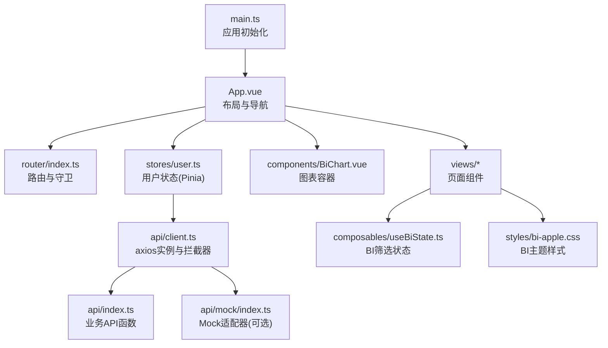
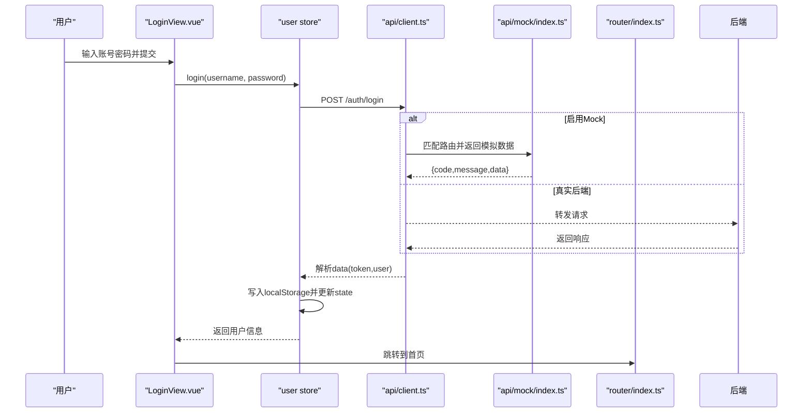
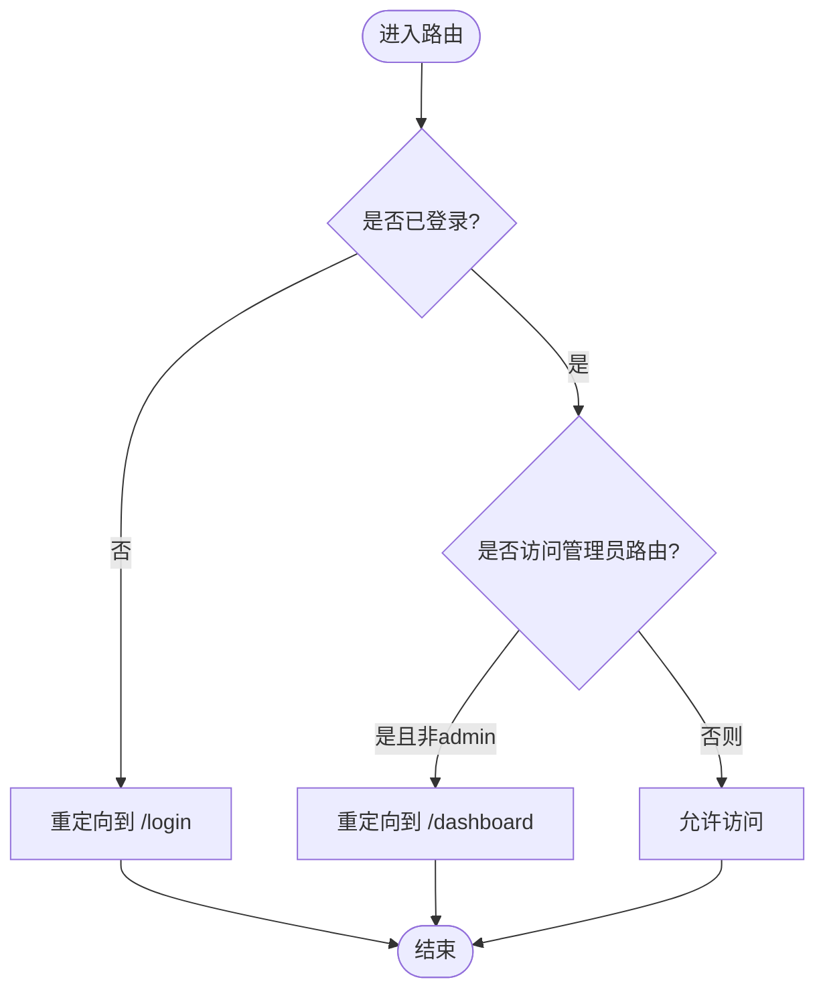
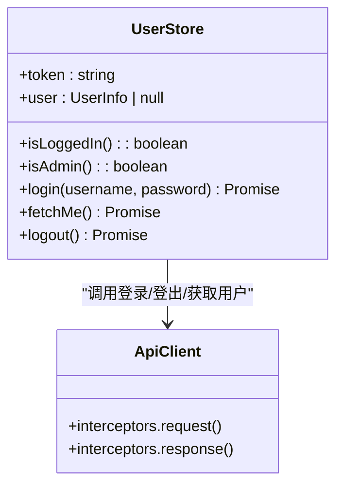
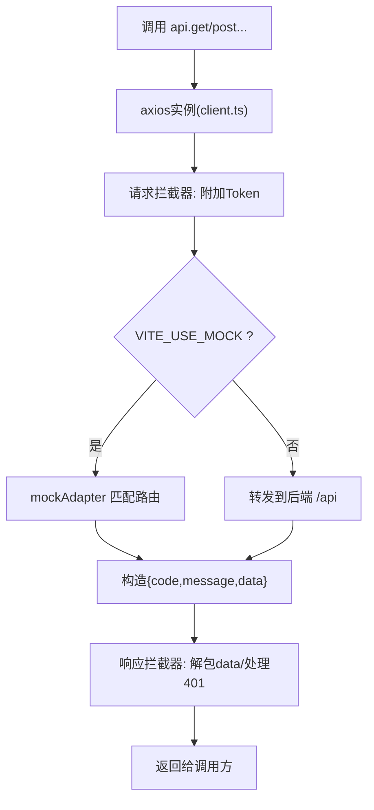
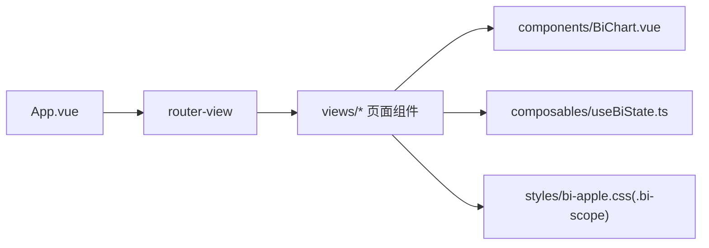
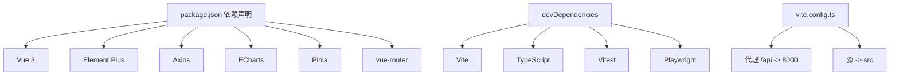

# 前端应用架构

<cite>
**本文引用的文件**
- [frontend-vue/package.json](file://frontend-vue/package.json)
- [frontend-vue/src/main.ts](file://frontend-vue/src/main.ts)
- [frontend-vue/src/App.vue](file://frontend-vue/src/App.vue)
- [frontend-vue/src/router/index.ts](file://frontend-vue/src/router/index.ts)
- [frontend-vue/vite.config.ts](file://frontend-vue/vite.config.ts)
- [frontend-vue/src/stores/user.ts](file://frontend-vue/src/stores/user.ts)
- [frontend-vue/src/api/client.ts](file://frontend-vue/src/api/client.ts)
- [frontend-vue/src/api/index.ts](file://frontend-vue/src/api/index.ts)
- [frontend-vue/src/api/mock/index.ts](file://frontend-vue/src/api/mock/index.ts)
- [frontend-vue/src/views/LoginView.vue](file://frontend-vue/src/views/LoginView.vue)
- [frontend-vue/src/components/BiChart.vue](file://frontend-vue/src/components/BiChart.vue)
- [frontend-vue/src/composables/useBiState.ts](file://frontend-vue/src/composables/useBiState.ts)
- [frontend-vue/src/styles/bi-apple.css](file://frontend-vue/src/styles/bi-apple.css)
</cite>

## 目录
1. [简介](#简介)
2. [项目结构](#项目结构)
3. [核心组件](#核心组件)
4. [架构总览](#架构总览)
5. [详细组件分析](#详细组件分析)
6. [依赖关系分析](#依赖关系分析)
7. [性能与可访问性](#性能与可访问性)
8. [样式定制与主题](#样式定制与主题)
9. [故障排查指南](#故障排查指南)
10. [结论](#结论)

## 简介
本仓库的前端采用 Vue 3 + TypeScript + Element Plus 技术栈，基于 Vite 构建，使用 Pinia 进行状态管理，vue-router 管理路由，ECharts 用于图表可视化。系统提供完整的 WMS（仓储管理系统）与业财一体中后台能力，包含销售订单、库存、入库/出库、盘点、财务应收等模块，并内置纯前端 Mock 模式，便于离线演示与快速开发。

## 项目结构
- 入口与初始化：main.ts 创建 Vue 应用，注册 Pinia、Router、Element Plus 及全局图标；App.vue 提供侧边栏+主内容布局与登录态控制。
- 路由：router/index.ts 定义扁平化路由与元信息，配置全局前置守卫实现登录校验与管理员权限控制。
- 状态管理：stores/user.ts 通过 Pinia 管理用户登录态、角色与本地持久化。
- API 客户端：api/client.ts 封装 axios，统一拦截器处理鉴权与错误；api/index.ts 按业务域导出类型与接口函数；api/mock/index.ts 提供浏览器内 Mock 适配器。
- 视图与组件：views/ 下为页面级组件；components/ 提供通用图表容器 BiChart.vue；composables/ 提供组合式逻辑 useBiState.ts；styles/ 提供 BI 工作台的 Apple 风格主题样式。
- 构建与代理：vite.config.ts 配置别名、开发服务器代理 /api 到后端，支持环境变量注入 base 路径与 mock 开关。

**图示来源**
- [frontend-vue/src/main.ts:1-19](file://frontend-vue/src/main.ts#L1-L19)
- [frontend-vue/src/App.vue:1-150](file://frontend-vue/src/App.vue#L1-L150)
- [frontend-vue/src/router/index.ts:1-48](file://frontend-vue/src/router/index.ts#L1-L48)
- [frontend-vue/src/stores/user.ts:1-49](file://frontend-vue/src/stores/user.ts#L1-L49)
- [frontend-vue/src/api/client.ts:1-45](file://frontend-vue/src/api/client.ts#L1-L45)
- [frontend-vue/src/api/index.ts:1-719](file://frontend-vue/src/api/index.ts#L1-L719)
- [frontend-vue/src/api/mock/index.ts:1-411](file://frontend-vue/src/api/mock/index.ts#L1-L411)
- [frontend-vue/src/components/BiChart.vue:1-59](file://frontend-vue/src/components/BiChart.vue#L1-L59)
- [frontend-vue/src/composables/useBiState.ts:1-60](file://frontend-vue/src/composables/useBiState.ts#L1-L60)
- [frontend-vue/src/styles/bi-apple.css:1-249](file://frontend-vue/src/styles/bi-apple.css#L1-L249)

**章节来源**
- [frontend-vue/src/main.ts:1-19](file://frontend-vue/src/main.ts#L1-L19)
- [frontend-vue/src/App.vue:1-150](file://frontend-vue/src/App.vue#L1-L150)
- [frontend-vue/src/router/index.ts:1-48](file://frontend-vue/src/router/index.ts#L1-L48)
- [frontend-vue/vite.config.ts:1-34](file://frontend-vue/vite.config.ts#L1-L34)

## 核心组件
- 应用壳 App.vue：提供侧边栏菜单、顶部栏、路由视图渲染；根据当前路由决定是否显示登录页全屏布局；集成用户状态展示与退出登录。
- 登录页 LoginView.vue：表单校验、服务预热提示、登录流程与错误分类（超时/离线/认证失败），支持“记住我”与演示环境标识。
- 图表容器 BiChart.vue：统一 ECharts 生命周期管理（init/setOption/resize/dispose）、事件透传、导出图片与实例暴露。
- 用户状态 store：Pinia 管理 token 与用户信息，提供登录、获取当前用户、登出动作，并在 localStorage 持久化。
- API 客户端：axios 实例封装，请求头自动附加 Authorization，响应拦截统一提取 data，401 时清理登录态并跳转登录页；支持 Mock 适配器切换。
- 路由与守卫：扁平路由，meta.title 用于页面标题；beforeEach 实现登录校验与管理员路由保护。

**章节来源**
- [frontend-vue/src/App.vue:1-150](file://frontend-vue/src/App.vue#L1-L150)
- [frontend-vue/src/views/LoginView.vue:1-188](file://frontend-vue/src/views/LoginView.vue#L1-L188)
- [frontend-vue/src/components/BiChart.vue:1-59](file://frontend-vue/src/components/BiChart.vue#L1-L59)
- [frontend-vue/src/stores/user.ts:1-49](file://frontend-vue/src/stores/user.ts#L1-L49)
- [frontend-vue/src/api/client.ts:1-45](file://frontend-vue/src/api/client.ts#L1-L45)
- [frontend-vue/src/router/index.ts:1-48](file://frontend-vue/src/router/index.ts#L1-L48)

## 架构总览
前端以 Vue 3 应用为中心，通过 Router 驱动页面渲染，Pinia 管理跨组件共享状态，API 层统一封装网络请求与错误处理，Mock 适配器可在无后端环境下运行完整业务流程。

**图示来源**
- [frontend-vue/src/views/LoginView.vue:150-188](file://frontend-vue/src/views/LoginView.vue#L150-L188)
- [frontend-vue/src/stores/user.ts:22-35](file://frontend-vue/src/stores/user.ts#L22-L35)
- [frontend-vue/src/api/client.ts:18-42](file://frontend-vue/src/api/client.ts#L18-L42)
- [frontend-vue/src/api/mock/index.ts:77-90](file://frontend-vue/src/api/mock/index.ts#L77-L90)
- [frontend-vue/src/router/index.ts:31-45](file://frontend-vue/src/router/index.ts#L31-L45)

## 详细组件分析

### 路由与权限控制
- 路由表：扁平化设计，每个业务模块对应一个 path，meta.title 用于页面标题，admin 标记用于管理员路由保护。
- 全局守卫：未登录访问非登录页重定向至登录；已登录访问登录页重定向至首页；/users 仅 admin 可访问。
- 部署适配：history 使用 Hash 模式，base 可通过环境变量注入，便于子路径部署。

**图示来源**
- [frontend-vue/src/router/index.ts:1-48](file://frontend-vue/src/router/index.ts#L1-L48)

**章节来源**
- [frontend-vue/src/router/index.ts:1-48](file://frontend-vue/src/router/index.ts#L1-L48)

### 状态管理（Pinia）
- user store：维护 token 与用户对象，提供 isLoggedIn、isAdmin 计算属性；actions 包括登录、获取当前用户、登出；本地存储键名固定，便于守卫读取。
- 与路由守卫协作：守卫从 localStorage 读取 token 与用户信息，store 负责刷新用户信息。

**图示来源**
- [frontend-vue/src/stores/user.ts:1-49](file://frontend-vue/src/stores/user.ts#L1-L49)
- [frontend-vue/src/api/client.ts:1-45](file://frontend-vue/src/api/client.ts#L1-L45)

**章节来源**
- [frontend-vue/src/stores/user.ts:1-49](file://frontend-vue/src/stores/user.ts#L1-L49)

### API 客户端与 Mock 切换
- client.ts：创建 axios 实例，设置 baseURL、timeout、默认头；请求拦截器自动附加 Authorization；响应拦截器统一解包 data，401 时清理本地状态并跳转登录；当环境变量 VITE_USE_MOCK='true' 时替换 adapter 为 mockAdapter。
- index.ts：按业务域导出类型与函数，覆盖商品、客户、看板、仓库库位、库存、出入库、退货、波次、移库、调整、盘点、销售订单、财务应收、经营驾驶舱等接口。
- mock/index.ts：实现 AxiosAdapter，将 /api 前缀剥离后匹配正则路由，返回与后端一致的结构；对未覆盖的 GET 列表接口返回空分页或空数组，保证旧页面不崩溃。

**图示来源**
- [frontend-vue/src/api/client.ts:1-45](file://frontend-vue/src/api/client.ts#L1-L45)
- [frontend-vue/src/api/mock/index.ts:381-411](file://frontend-vue/src/api/mock/index.ts#L381-L411)
- [frontend-vue/src/api/index.ts:1-719](file://frontend-vue/src/api/index.ts#L1-L719)

**章节来源**
- [frontend-vue/src/api/client.ts:1-45](file://frontend-vue/src/api/client.ts#L1-L45)
- [frontend-vue/src/api/index.ts:1-719](file://frontend-vue/src/api/index.ts#L1-L719)
- [frontend-vue/src/api/mock/index.ts:1-411](file://frontend-vue/src/api/mock/index.ts#L1-L411)

### 页面组件组织与复用模式
- 页面组件：views/ 下每个业务模块一个 View 组件，通过 router-view 渲染；App.vue 提供统一的侧边栏与头部布局，登录页独立全屏。
- 通用组件：components/BiChart.vue 封装 ECharts 生命周期与事件，供 BI 工作台各面板复用；composables/useBiState.ts 提供 BI 筛选状态单例，供多个面板共享。
- 样式隔离：BI 主题样式以 .bi-scope 命名空间限定，避免污染全局与 Element 样式。

**图示来源**
- [frontend-vue/src/App.vue:38-150](file://frontend-vue/src/App.vue#L38-L150)
- [frontend-vue/src/components/BiChart.vue:1-59](file://frontend-vue/src/components/BiChart.vue#L1-L59)
- [frontend-vue/src/composables/useBiState.ts:1-60](file://frontend-vue/src/composables/useBiState.ts#L1-L60)
- [frontend-vue/src/styles/bi-apple.css:1-249](file://frontend-vue/src/styles/bi-apple.css#L1-L249)

**章节来源**
- [frontend-vue/src/App.vue:1-150](file://frontend-vue/src/App.vue#L1-L150)
- [frontend-vue/src/components/BiChart.vue:1-59](file://frontend-vue/src/components/BiChart.vue#L1-L59)
- [frontend-vue/src/composables/useBiState.ts:1-60](file://frontend-vue/src/composables/useBiState.ts#L1-L60)
- [frontend-vue/src/styles/bi-apple.css:1-249](file://frontend-vue/src/styles/bi-apple.css#L1-L249)

## 依赖关系分析
- 运行时依赖：Vue 3、Element Plus、Axios、ECharts、Pinia、vue-router。
- 开发依赖：Vite、TypeScript、vitest、Playwright、vue-tsc。
- 构建与代理：Vite 插件 vue，别名 @ 指向 src；开发服务器代理 /api 到 http://localhost:8000；base 路径由环境变量注入。

**图示来源**
- [frontend-vue/package.json:1-34](file://frontend-vue/package.json#L1-L34)
- [frontend-vue/vite.config.ts:1-34](file://frontend-vue/vite.config.ts#L1-L34)

**章节来源**
- [frontend-vue/package.json:1-34](file://frontend-vue/package.json#L1-L34)
- [frontend-vue/vite.config.ts:1-34](file://frontend-vue/vite.config.ts#L1-L34)

## 性能与可访问性
- 性能优化
  - 懒加载：路由组件使用动态 import，减少首屏体积。
  - 图表优化：BiChart.vue 使用 shallowRef 缓存实例，ResizeObserver 监听尺寸变化，onBeforeUnmount 释放资源，避免内存泄漏。
  - 网络优化：axios 设置 timeout，统一拦截器减少重复逻辑；登录接口针对 Serverless 冷启动延长超时。
  - 构建优化：Vite 别名简化导入；环境变量控制 base 路径与 mock 开关，便于不同环境构建。
- 可访问性（a11y）
  - 语义化标签与 aria 属性：登录页品牌图标使用 aria-hidden，进度区域使用 role="status" 与 aria-live="polite"，提升屏幕阅读器体验。
  - 键盘交互：表单支持 Enter 提交，按钮具备可聚焦与可操作状态。
  - 颜色对比与焦点：登录页与 BI 主题使用高对比度配色，确保可读性。

[本节为通用指导，不直接分析具体文件]

## 样式定制与主题
- 全局布局：App.vue 定义深色侧边栏、白色主内容区、滚动条美化与响应式高度布局。
- BI 主题：bi-apple.css 以 .bi-scope 命名空间限定，提供变量化的色彩、圆角、阴影、毛玻璃效果，以及卡片、KPI、统计、预警、排行榜、任务进度、仪表盘、模态框等组件样式。
- 主题扩展：通过 CSS 变量集中管理颜色与尺寸，便于在 .bi-scope 根节点上覆盖变量实现主题切换。

**章节来源**
- [frontend-vue/src/App.vue:152-242](file://frontend-vue/src/App.vue#L152-L242)
- [frontend-vue/src/styles/bi-apple.css:1-249](file://frontend-vue/src/styles/bi-apple.css#L1-L249)

## 故障排查指南
- 登录失败
  - 401/403/400：登录页会区分认证错误与服务异常，提示文案来自后端 detail 或默认消息；若为超时或离线，会给出重试入口。
  - 401 响应拦截：client.ts 在响应拦截器中清理本地 token 与用户信息，并跳转登录页。
- 服务冷启动
  - 登录页在服务未知状态下会显示“正在唤醒服务”，并提供进度与说明；首次访问 Serverless 环境可能需等待较长时间。
- Mock 模式
  - 当 VITE_USE_MOCK='true' 时，所有 /api 请求由 mockAdapter 处理；未覆盖的列表接口返回空分页，保障页面不崩溃。
- 路由守卫
  - 未登录访问受保护路由将被重定向到登录页；管理员路由仅 admin 可访问，否则重定向到首页。

**章节来源**
- [frontend-vue/src/views/LoginView.vue:135-188](file://frontend-vue/src/views/LoginView.vue#L135-L188)
- [frontend-vue/src/api/client.ts:27-42](file://frontend-vue/src/api/client.ts#L27-L42)
- [frontend-vue/src/api/mock/index.ts:356-411](file://frontend-vue/src/api/mock/index.ts#L356-L411)
- [frontend-vue/src/router/index.ts:31-45](file://frontend-vue/src/router/index.ts#L31-L45)

## 结论
该前端应用以清晰的模块化结构与统一的 API 客户端为基础，结合 Pinia 状态管理与 vue-router 权限控制，实现了 WMS 与业财一体的完整功能闭环。Mock 模式提供了离线演示能力，配合 ECharts 与 Apple 风格主题，提升了数据分析与用户体验。通过环境变量与构建配置，系统具备良好的跨环境部署能力与可扩展性。建议在生产环境中持续优化首屏加载、图表渲染与网络请求策略，并完善 a11y 测试与主题切换机制。