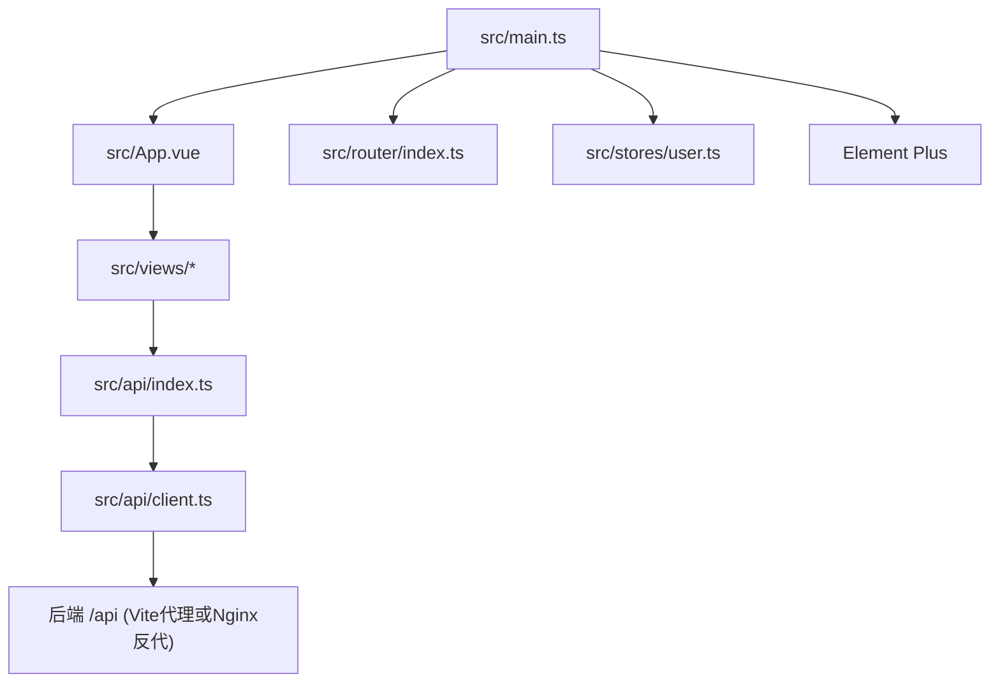
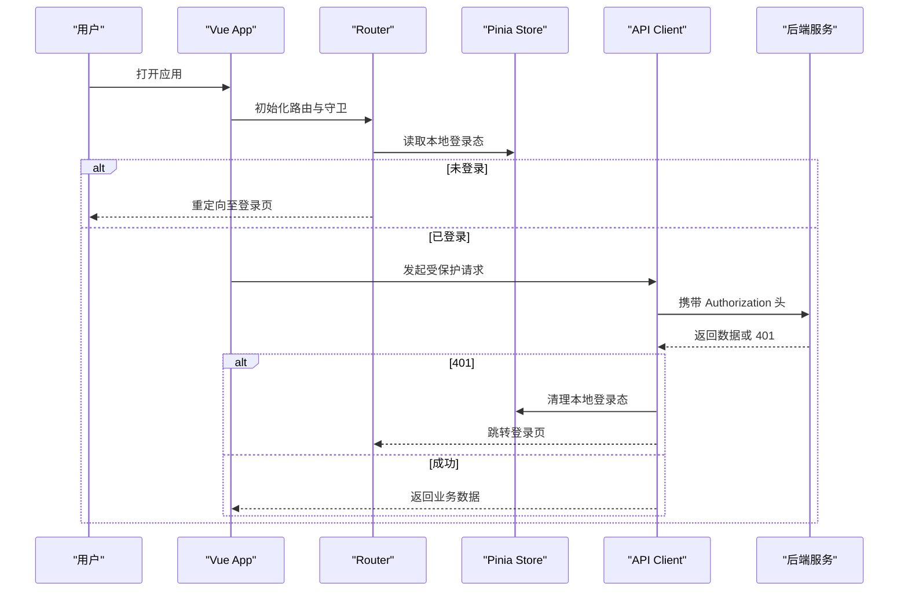
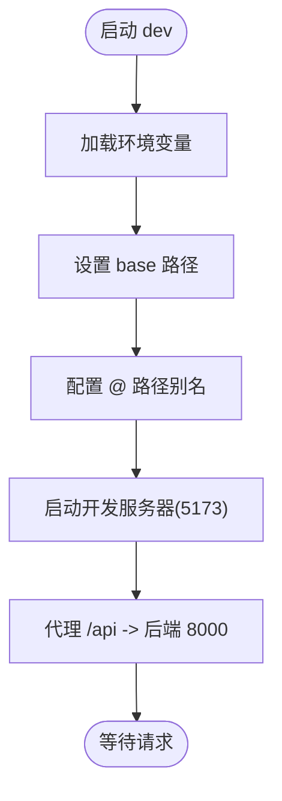
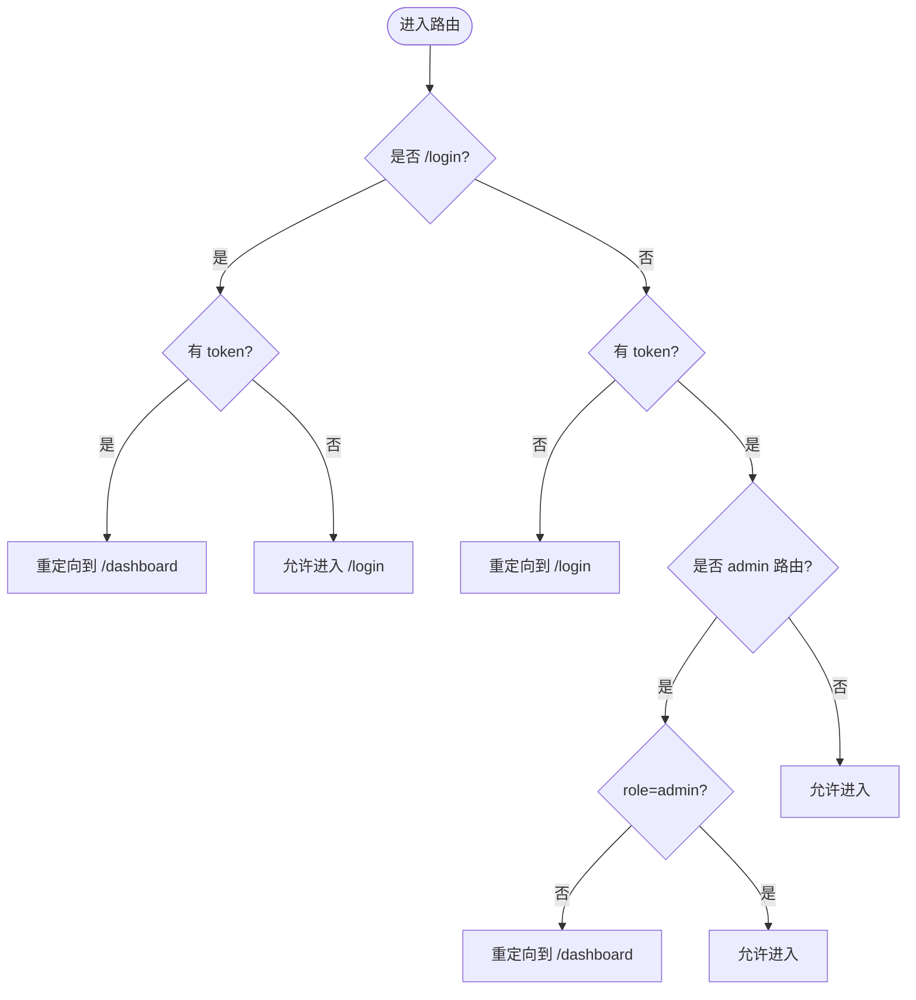
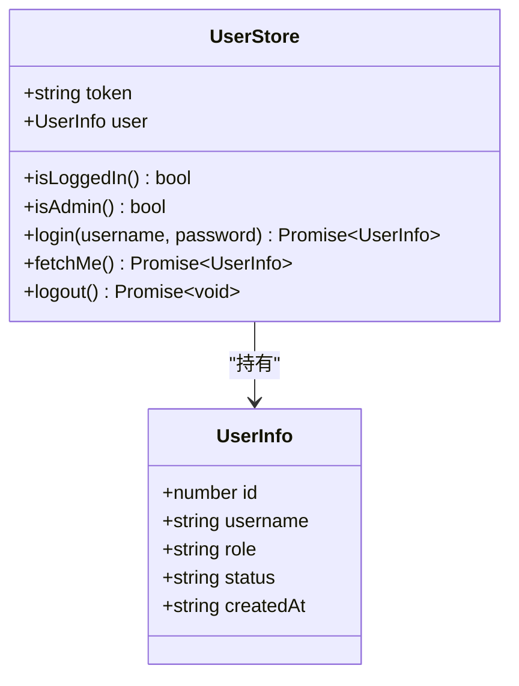
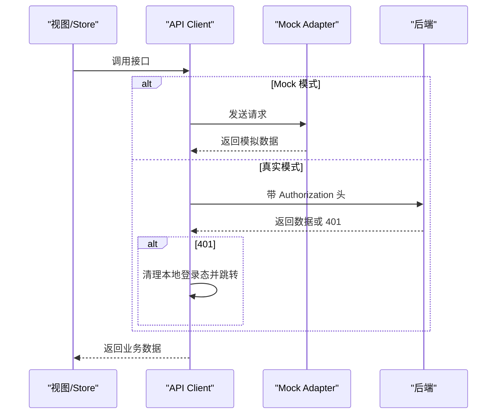

# 前端技术栈

<cite>
**本文引用的文件**
- [frontend-vue/package.json](file://frontend-vue/package.json)
- [frontend-vue/vite.config.ts](file://frontend-vue/vite.config.ts)
- [frontend-vue/tsconfig.json](file://frontend-vue/tsconfig.json)
- [frontend-vue/src/main.ts](file://frontend-vue/src/main.ts)
- [frontend-vue/src/App.vue](file://frontend-vue/src/App.vue)
- [frontend-vue/src/router/index.ts](file://frontend-vue/src/router/index.ts)
- [frontend-vue/src/stores/user.ts](file://frontend-vue/src/stores/user.ts)
- [frontend-vue/src/api/client.ts](file://frontend-vue/src/api/client.ts)
- [frontend-vue/src/api/index.ts](file://frontend-vue/src/api/index.ts)
- [frontend-vue/playwright.config.ts](file://frontend-vue/playwright.config.ts)
</cite>

## 目录
1. [简介](#简介)
2. [项目结构](#项目结构)
3. [核心组件](#核心组件)
4. [架构总览](#架构总览)
5. [详细组件分析](#详细组件分析)
6. [依赖与版本管理](#依赖与版本管理)
7. [性能优化建议](#性能优化建议)
8. [构建产物分析](#构建产物分析)
9. [故障排查指南](#故障排查指南)
10. [结论](#结论)

## 简介
本技术栈文档面向 WMS 系统的前端工程，围绕 Vue 3 + TypeScript + Element Plus + Vite + Pinia 的组合，说明选型原因、版本兼容性、构建配置、状态管理模式、依赖与版本策略、开发环境搭建、TypeScript 最佳实践以及性能优化与构建产物分析方法。文档内容均基于仓库中前端工程实际代码与配置进行归纳与解读。

## 项目结构
前端工程位于 frontend-vue 目录，采用模块化组织：
- src/api：HTTP 客户端封装与接口类型定义
- src/components：通用 UI 组件（如图表、弹窗、汇总卡片）
- src/composables：组合式逻辑复用（如 BI 状态）
- src/router：路由与导航守卫
- src/stores：Pinia 状态管理（用户态）
- src/views：页面视图（含 BI 子模块）
- src/styles：全局样式
- vite.config.ts：Vite 构建与开发服务器配置
- tsconfig.json：TypeScript 编译选项
- package.json：脚本与依赖声明
- playwright.config.ts：E2E 测试配置

**图示来源**
- [frontend-vue/src/main.ts:1-19](file://frontend-vue/src/main.ts#L1-L19)
- [frontend-vue/src/App.vue:1-150](file://frontend-vue/src/App.vue#L1-L150)
- [frontend-vue/src/router/index.ts:1-48](file://frontend-vue/src/router/index.ts#L1-L48)
- [frontend-vue/src/stores/user.ts:1-49](file://frontend-vue/src/stores/user.ts#L1-L49)
- [frontend-vue/src/api/index.ts:1-719](file://frontend-vue/src/api/index.ts#L1-L719)
- [frontend-vue/src/api/client.ts:1-45](file://frontend-vue/src/api/client.ts#L1-L45)

**章节来源**
- [frontend-vue/package.json:1-34](file://frontend-vue/package.json#L1-L34)
- [frontend-vue/vite.config.ts:1-34](file://frontend-vue/vite.config.ts#L1-L34)
- [frontend-vue/tsconfig.json:1-29](file://frontend-vue/tsconfig.json#L1-L29)

## 核心组件
- 应用入口与插件装配：在入口文件中创建 Vue 应用实例，注册 Pinia、Router、Element Plus 及图标库，并挂载到 DOM。
- 布局与导航：App.vue 提供侧边栏菜单、头部信息区与主内容区，结合路由元信息进行标题渲染与权限控制。
- 路由与鉴权：使用 Hash 模式路由，集中配置页面路由与 meta；通过 beforeEach 实现登录态校验与管理员访问限制。
- 状态管理：Pinia store 管理 token 与用户信息，提供登录、获取当前用户、登出等动作，并与本地存储同步。
- HTTP 客户端：Axios 实例统一 baseURL、超时、请求/响应拦截器；支持 Mock 适配器切换；自动注入 Authorization 头并在 401 时清理登录态跳转登录页。
- API 层：按业务域导出接口函数与类型定义，便于视图调用与类型推断。

**章节来源**
- [frontend-vue/src/main.ts:1-19](file://frontend-vue/src/main.ts#L1-L19)
- [frontend-vue/src/App.vue:1-150](file://frontend-vue/src/App.vue#L1-L150)
- [frontend-vue/src/router/index.ts:1-48](file://frontend-vue/src/router/index.ts#L1-L48)
- [frontend-vue/src/stores/user.ts:1-49](file://frontend-vue/src/stores/user.ts#L1-L49)
- [frontend-vue/src/api/client.ts:1-45](file://frontend-vue/src/api/client.ts#L1-L45)
- [frontend-vue/src/api/index.ts:1-719](file://frontend-vue/src/api/index.ts#L1-L719)

## 架构总览
前端以 Vue 3 为框架，通过 Router 驱动页面，Pinia 管理跨组件状态，Element Plus 提供 UI 组件与图标，Vite 负责开发与构建。HTTP 请求由 Axios 封装，统一处理认证、错误与 Mock。

**图示来源**
- [frontend-vue/src/router/index.ts:31-45](file://frontend-vue/src/router/index.ts#L31-L45)
- [frontend-vue/src/stores/user.ts:21-47](file://frontend-vue/src/stores/user.ts#L21-L47)
- [frontend-vue/src/api/client.ts:18-42](file://frontend-vue/src/api/client.ts#L18-L42)

## 详细组件分析

### 构建工具与开发服务器（Vite）
- 环境变量注入：通过 loadEnv 读取 .env.[mode] 与系统环境变量，支持 base、API 地址、Mock 开关等。
- 路径别名：@ 指向 src，简化导入路径。
- 开发服务器：端口 5173，配置 /api 代理至后端 FastAPI 默认端口，启用 changeOrigin。
- 测试隔离：vitest 排除 e2e 与 node_modules，仅运行单元测试。

**图示来源**
- [frontend-vue/vite.config.ts:1-34](file://frontend-vue/vite.config.ts#L1-L34)

**章节来源**
- [frontend-vue/vite.config.ts:1-34](file://frontend-vue/vite.config.ts#L1-L34)

### 路由与鉴权
- 路由模式：Hash 历史模式，适合静态托管场景。
- 路由表：集中声明各页面路由与 meta（如 title、admin）。
- 全局守卫：除登录页外要求登录；管理员页面需 admin 角色；未登录重定向至登录页。

**图示来源**
- [frontend-vue/src/router/index.ts:1-48](file://frontend-vue/src/router/index.ts#L1-L48)

**章节来源**
- [frontend-vue/src/router/index.ts:1-48](file://frontend-vue/src/router/index.ts#L1-L48)

### 状态管理（Pinia）
- 选择理由：轻量、类型友好、与 Vue 3 深度集成，易于拆分模块与组合式用法。
- 使用模式：defineStore 定义 user store，state 持久化到 localStorage，getters 暴露登录态与角色判断，actions 封装登录、拉取当前用户、登出等异步流程。
- 与路由联动：路由守卫读取本地 token 做前置鉴权；store 登出后清空本地存储。

**图示来源**
- [frontend-vue/src/stores/user.ts:1-49](file://frontend-vue/src/stores/user.ts#L1-L49)
- [frontend-vue/src/api/index.ts:449-488](file://frontend-vue/src/api/index.ts#L449-L488)

**章节来源**
- [frontend-vue/src/stores/user.ts:1-49](file://frontend-vue/src/stores/user.ts#L1-L49)

### HTTP 客户端与接口层
- 客户端封装：Axios 实例统一 baseURL、超时、Content-Type；请求拦截器自动附加 Authorization；响应拦截器提取 data 并处理 401 跳转。
- Mock 模式：通过环境变量开启纯前端演示模式，替换 adapter 为 mockAdapter，不发起真实网络请求。
- 接口定义：按业务域导出类型与函数，便于视图调用与类型推导。

**图示来源**
- [frontend-vue/src/api/client.ts:1-45](file://frontend-vue/src/api/client.ts#L1-L45)
- [frontend-vue/src/api/index.ts:449-488](file://frontend-vue/src/api/index.ts#L449-L488)

**章节来源**
- [frontend-vue/src/api/client.ts:1-45](file://frontend-vue/src/api/client.ts#L1-L45)
- [frontend-vue/src/api/index.ts:1-719](file://frontend-vue/src/api/index.ts#L1-L719)

### 界面与交互（Element Plus）
- 全局注册：入口文件批量注册 Element Plus 图标组件，模板中可直接使用。
- 主题与布局：App.vue 使用 el-container/el-aside/el-header/el-main 构建后台布局，深色侧边栏与浅色主内容区分清晰。
- 消息反馈：通过 ElMessage 提供操作反馈。

**章节来源**
- [frontend-vue/src/main.ts:1-19](file://frontend-vue/src/main.ts#L1-L19)
- [frontend-vue/src/App.vue:1-242](file://frontend-vue/src/App.vue#L1-L242)

## 依赖与版本管理
- 运行时依赖：Vue 3、Vue Router 4、Element Plus 2、Pinia 2、Axios、ECharts。
- 开发依赖：Vite、@vitejs/plugin-vue、TypeScript、vue-tsc、Vitest、Playwright。
- 脚本命令：dev、build、build:pages、preview、test、test:watch、test:e2e。
- 版本策略：package.json 使用较宽松范围（^），便于小版本升级；锁定文件 package-lock.json 保证可重复安装。
- 环境变量：通过 VITE_ 前缀注入构建期常量（如 base、API 地址、Mock 开关）。

**章节来源**
- [frontend-vue/package.json:1-34](file://frontend-vue/package.json#L1-L34)
- [frontend-vue/vite.config.ts:6-16](file://frontend-vue/vite.config.ts#L6-L16)

## 性能优化建议
- 路由懒加载：路由表中已使用动态 import，减少首屏包体积。
- 按需引入：Element Plus 可通过按需引入进一步减小体积（当前全局引入，可按需优化）。
- 资源压缩：生产构建建议使用 gzip/brotli 压缩（可在部署层或构建插件中启用）。
- 缓存策略：利用浏览器缓存与 CDN 缓存静态资源；合理设置 base 路径与版本号。
- 网络优化：合理设置 axios 超时与重试策略；对大列表分页加载；避免一次性加载过多图表数据。
- 构建优化：使用 Vite 的预构建与分包策略；必要时拆分 vendor 与业务包。

[本节为通用指导，不直接分析具体文件]

## 构建产物分析
- 构建命令：build 会先执行 vue-tsc 类型检查，再执行 vite build。
- 多模式构建：build:pages 使用 pages 模式，适用于 GitHub Pages 等子路径部署。
- 预览：preview 用于本地预览构建产物。
- 分析建议：可接入 vite-bundle-analyzer 或 rollup-plugin-visualizer 查看包体积与依赖关系（当前仓库未包含该插件，可按需添加）。

**章节来源**
- [frontend-vue/package.json:6-13](file://frontend-vue/package.json#L6-L13)
- [frontend-vue/vite.config.ts:6-16](file://frontend-vue/vite.config.ts#L6-L16)

## 故障排查指南
- 登录失败与 401：
  - 现象：登录后仍被重定向到登录页。
  - 排查：检查 axios 响应拦截器是否正确处理 401；确认本地 token 是否被正确写入与读取；核对后端返回结构与字段。
- 服务冷启动超时：
  - 现象：首次访问登录缓慢或超时。
  - 排查：登录页已内置预热与健康检查；确认后端健康接口可达；适当调整超时时间。
- 代理问题：
  - 现象：开发环境无法访问后端。
  - 排查：确认 vite.config.ts 中 /api 代理目标与端口；检查防火墙与 CORS 设置。
- Mock 模式：
  - 现象：构建后无网络请求。
  - 排查：确认环境变量 VITE_USE_MOCK 是否为 true；检查 mockAdapter 是否生效。

**章节来源**
- [frontend-vue/src/api/client.ts:18-42](file://frontend-vue/src/api/client.ts#L18-L42)
- [frontend-vue/src/api/index.ts:459-476](file://frontend-vue/src/api/index.ts#L459-L476)
- [frontend-vue/vite.config.ts:19-27](file://frontend-vue/vite.config.ts#L19-L27)

## 结论
本项目采用 Vue 3 + TypeScript + Element Plus + Vite + Pinia 的现代前端技术栈，具备清晰的模块化结构、完善的类型系统与高效的开发体验。通过统一的 HTTP 客户端与路由守卫，实现了安全的鉴权流程与良好的用户体验。建议在后续迭代中继续推进按需引入、构建分析与性能监控，进一步提升首屏性能与可维护性。