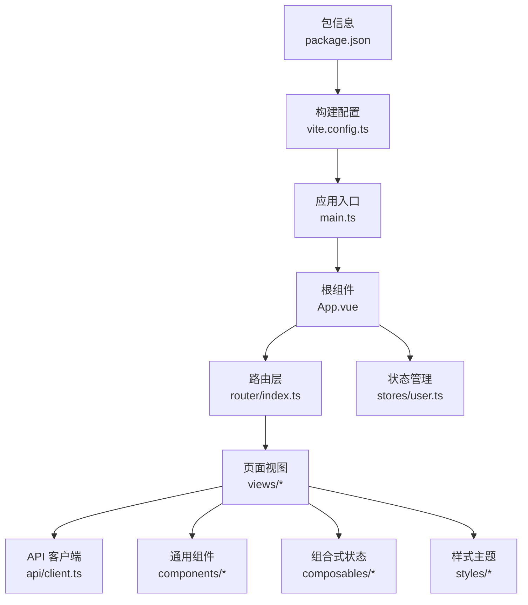
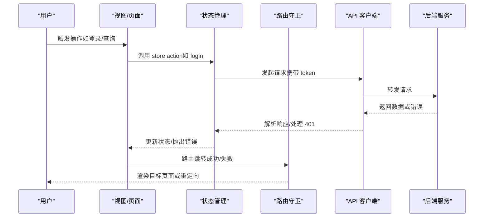
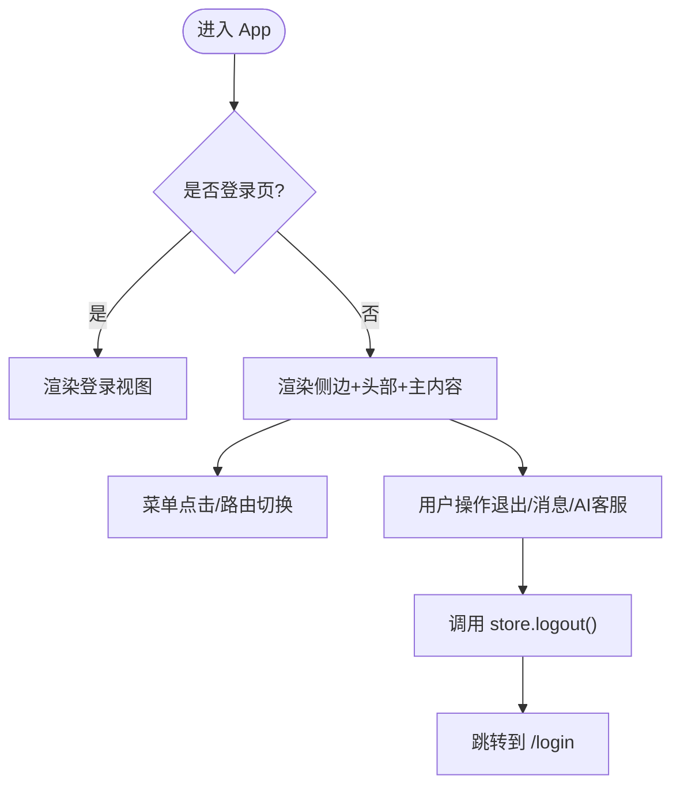
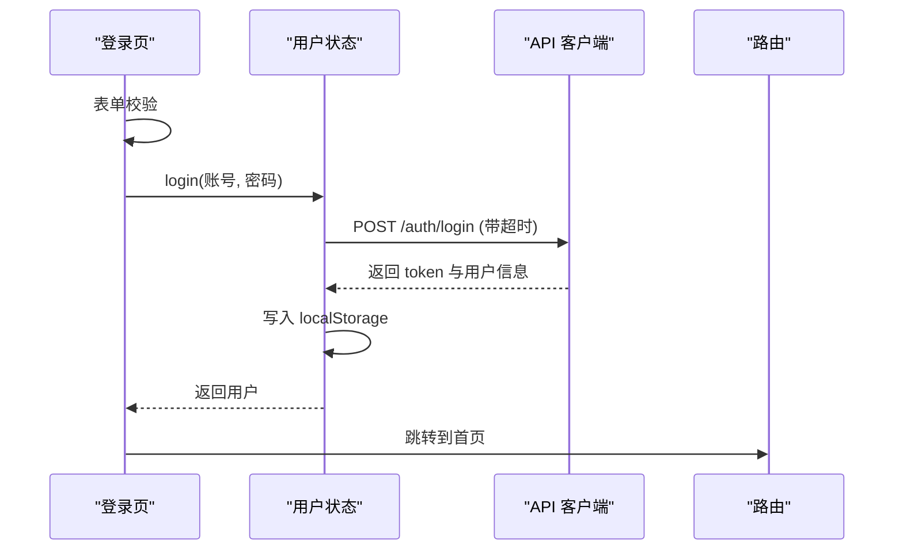
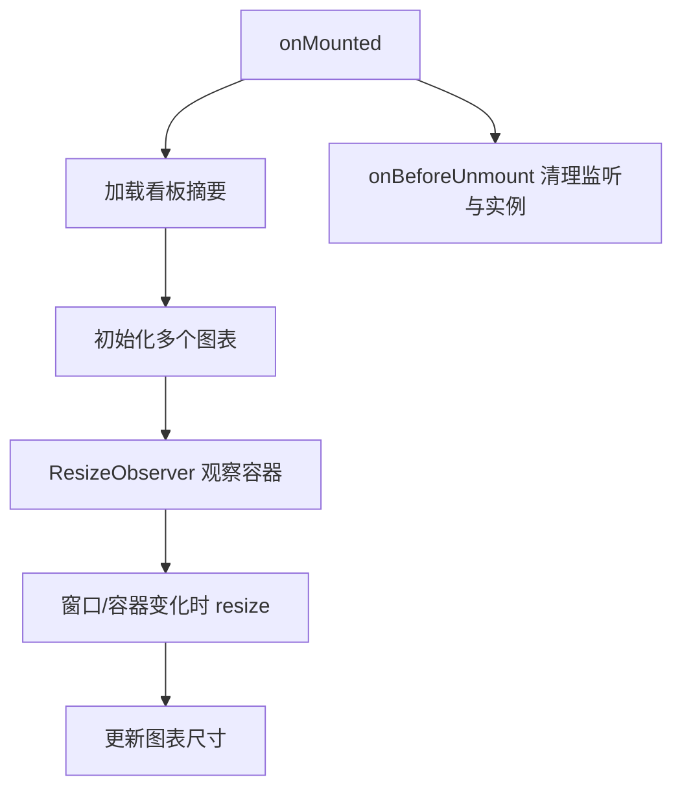
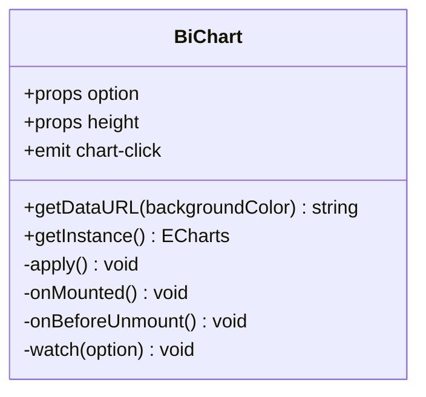
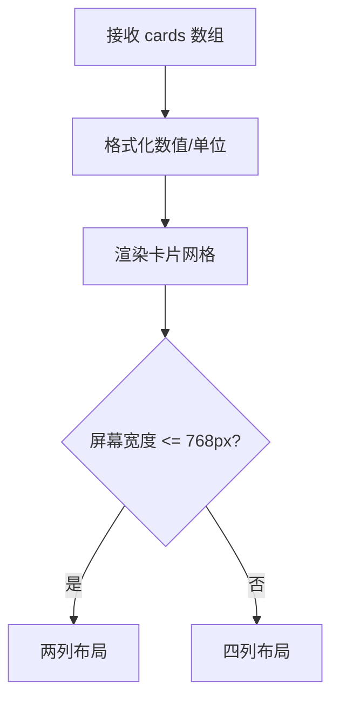
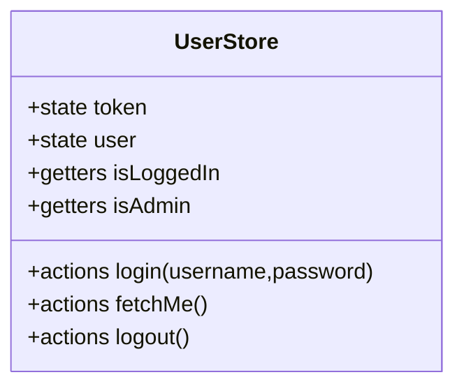
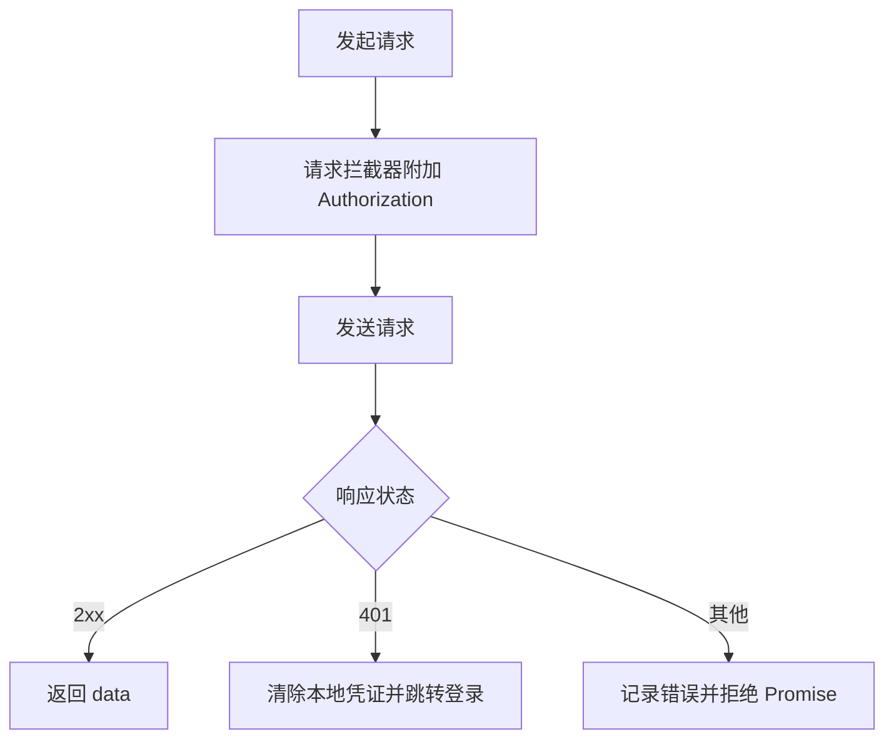
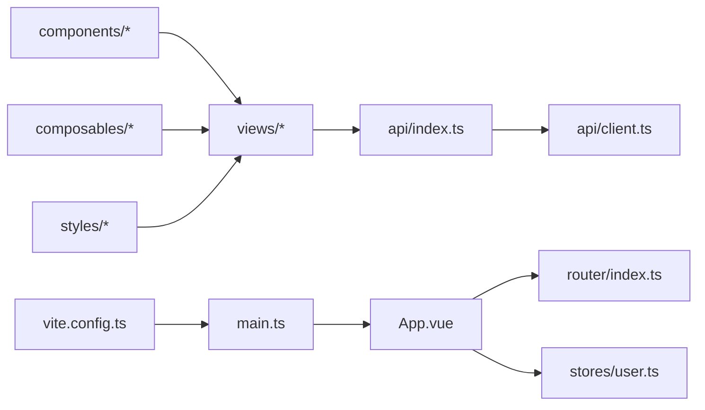

# 组件架构设计

<cite>
**本文引用的文件**
- [frontend-vue/src/App.vue](file://frontend-vue/src/App.vue)
- [frontend-vue/src/main.ts](file://frontend-vue/src/main.ts)
- [frontend-vue/package.json](file://frontend-vue/package.json)
- [frontend-vue/vite.config.ts](file://frontend-vue/vite.config.ts)
- [frontend-vue/src/router/index.ts](file://frontend-vue/src/router/index.ts)
- [frontend-vue/src/stores/user.ts](file://frontend-vue/src/stores/user.ts)
- [frontend-vue/src/components/BiChart.vue](file://frontend-vue/src/components/BiChart.vue)
- [frontend-vue/src/components/SummaryCards.vue](file://frontend-vue/src/components/SummaryCards.vue)
- [frontend-vue/src/views/DashboardView.vue](file://frontend-vue/src/views/DashboardView.vue)
- [frontend-vue/src/views/LoginView.vue](file://frontend-vue/src/views/LoginView.vue)
- [frontend-vue/src/api/client.ts](file://frontend-vue/src/api/client.ts)
- [frontend-vue/src/api/index.ts](file://frontend-vue/src/api/index.ts)
- [frontend-vue/src/styles/bi-apple.css](file://frontend-vue/src/styles/bi-apple.css)
- [frontend-vue/src/composables/useBiState.ts](file://frontend-vue/src/composables/useBiState.ts)
- [README.md](file://README.md)
</cite>

## 目录
1. [简介](#简介)
2. [项目结构](#项目结构)
3. [核心组件](#核心组件)
4. [架构总览](#架构总览)
5. [详细组件分析](#详细组件分析)
6. [依赖关系分析](#依赖关系分析)
7. [性能考量](#性能考量)
8. [故障排查指南](#故障排查指南)
9. [结论](#结论)
10. [附录](#附录)

## 简介
本文件面向 WMS（进销存·业财一体）前端系统，聚焦组件分层设计与职责划分、通用组件库与复用策略、组件通信与事件机制、响应式布局与移动端适配、测试策略与单元测试编写、样式组织与 CSS 模块化、性能优化与虚拟滚动实践，以及可访问性（A11y）与国际化支持。文档基于仓库中的 Vue 3 + Element Plus + ECharts 前端实现进行系统化梳理，帮助读者快速理解并扩展该系统的组件架构。

## 项目结构
前端采用典型的前后端分离 SPA 架构：
- 应用入口与全局插件注册：main.ts
- 路由与鉴权守卫：router/index.ts
- 状态管理（用户态）：stores/user.ts
- API 客户端与统一拦截器：api/client.ts；接口定义聚合：api/index.ts
- 页面视图：views/*（含登录、看板、BI 工作台等）
- 通用组件：components/*（图表容器、汇总卡片等）
- 组合式状态：composables/*（BI 工作台筛选与面板状态）
- 样式体系：styles/*（局部主题隔离）
- 构建与开发配置：vite.config.ts、package.json

图示来源
- [frontend-vue/src/main.ts:1-19](file://frontend-vue/src/main.ts#L1-L19)
- [frontend-vue/src/App.vue:1-150](file://frontend-vue/src/App.vue#L1-L150)
- [frontend-vue/src/router/index.ts:1-48](file://frontend-vue/src/router/index.ts#L1-L48)
- [frontend-vue/src/api/client.ts:1-45](file://frontend-vue/src/api/client.ts#L1-L45)
- [frontend-vue/vite.config.ts:1-34](file://frontend-vue/vite.config.ts#L1-L34)
- [frontend-vue/package.json:1-34](file://frontend-vue/package.json#L1-L34)

章节来源
- [frontend-vue/src/main.ts:1-19](file://frontend-vue/src/main.ts#L1-L19)
- [frontend-vue/src/App.vue:1-150](file://frontend-vue/src/App.vue#L1-L150)
- [frontend-vue/src/router/index.ts:1-48](file://frontend-vue/src/router/index.ts#L1-L48)
- [frontend-vue/vite.config.ts:1-34](file://frontend-vue/vite.config.ts#L1-L34)
- [frontend-vue/package.json:1-34](file://frontend-vue/package.json#L1-L34)

## 核心组件
- 应用外壳与布局：App.vue 提供侧边栏导航、头部用户信息与主内容区，负责路由渲染与基础交互（登录/退出）。
- 登录页：LoginView.vue 实现表单校验、服务预热、冷启动提示、错误区分与重试。
- 数据看板：DashboardView.vue 聚合统计卡片、多类 ECharts 图表与快捷操作入口。
- 通用图表容器：BiChart.vue 封装 ECharts 初始化、选项更新、自适应 resize、实例导出与销毁。
- 通用汇总卡片：SummaryCards.vue 提供多维度 KPI 卡展示与渐变风格。
- 用户状态：stores/user.ts 管理 token、用户信息、登录/登出与本地持久化。
- API 客户端：api/client.ts 统一 axios 实例、Mock 模式切换、请求/响应拦截与 401 处理。
- 接口契约：api/index.ts 集中业务接口类型与调用方法。
- BI 工作台状态：composables/useBiState.ts 维护时间范围、仓库多选与当前面板。
- 样式主题：styles/bi-apple.css 以作用域前缀限定样式，避免污染全局。

章节来源
- [frontend-vue/src/App.vue:1-150](file://frontend-vue/src/App.vue#L1-L150)
- [frontend-vue/src/views/LoginView.vue:1-188](file://frontend-vue/src/views/LoginView.vue#L1-L188)
- [frontend-vue/src/views/DashboardView.vue:1-175](file://frontend-vue/src/views/DashboardView.vue#L1-L175)
- [frontend-vue/src/components/BiChart.vue:1-59](file://frontend-vue/src/components/BiChart.vue#L1-L59)
- [frontend-vue/src/components/SummaryCards.vue:1-135](file://frontend-vue/src/components/SummaryCards.vue#L1-L135)
- [frontend-vue/src/stores/user.ts:1-49](file://frontend-vue/src/stores/user.ts#L1-L49)
- [frontend-vue/src/api/client.ts:1-45](file://frontend-vue/src/api/client.ts#L1-L45)
- [frontend-vue/src/api/index.ts:1-719](file://frontend-vue/src/api/index.ts#L1-L719)
- [frontend-vue/src/composables/useBiState.ts:1-60](file://frontend-vue/src/composables/useBiState.ts#L1-L60)
- [frontend-vue/src/styles/bi-apple.css:1-249](file://frontend-vue/src/styles/bi-apple.css#L1-L249)

## 架构总览
前端采用“视图-组件-状态-API”的分层组织：
- 视图层（views）：承载页面级逻辑与数据装配，调用 API 与组合式状态。
- 组件层（components）：提供可复用的 UI 能力（图表容器、KPI 卡等），通过 props/emits 与父组件通信。
- 状态层（stores/composables）：集中管理跨组件共享状态（用户态、BI 筛选态）。
- 数据层（api）：统一 HTTP 客户端、拦截器与接口契约，屏蔽 Mock/真实环境差异。
- 路由与鉴权：router 守卫控制访问权限，结合 stores 完成登录态判断。

图示来源
- [frontend-vue/src/stores/user.ts:21-48](file://frontend-vue/src/stores/user.ts#L21-L48)
- [frontend-vue/src/api/client.ts:18-42](file://frontend-vue/src/api/client.ts#L18-L42)
- [frontend-vue/src/router/index.ts:31-45](file://frontend-vue/src/router/index.ts#L31-L45)

## 详细组件分析

### 应用外壳与布局（App.vue）
- 职责：侧边菜单分组、顶部用户信息、主内容区路由渲染、登录/退出流程。
- 关键点：
  - 使用 computed 计算激活菜单与登录页判断，避免不必要的重渲染。
  - 通过 ElMessage 提供轻量反馈，保持界面简洁。
  - 布局采用固定视口高度与独立滚动区域，提升长列表体验。

图示来源
- [frontend-vue/src/App.vue:20-35](file://frontend-vue/src/App.vue#L20-L35)
- [frontend-vue/src/App.vue:38-150](file://frontend-vue/src/App.vue#L38-L150)

章节来源
- [frontend-vue/src/App.vue:1-242](file://frontend-vue/src/App.vue#L1-L242)

### 登录流程（LoginView.vue）
- 职责：表单校验、服务预热、冷启动提示、错误分类与重试。
- 关键点：
  - 在挂载时静默预热后端，将冷启动消耗在用户输入阶段。
  - 根据等待时长动态切换提示文案，改善用户体验。
  - 区分超时/离线与认证失败，提供针对性重试入口。

图示来源
- [frontend-vue/src/views/LoginView.vue:150-185](file://frontend-vue/src/views/LoginView.vue#L150-L185)
- [frontend-vue/src/stores/user.ts:21-29](file://frontend-vue/src/stores/user.ts#L21-L29)
- [frontend-vue/src/api/index.ts:459-470](file://frontend-vue/src/api/index.ts#L459-L470)

章节来源
- [frontend-vue/src/views/LoginView.vue:1-188](file://frontend-vue/src/views/LoginView.vue#L1-L188)
- [frontend-vue/src/stores/user.ts:1-49](file://frontend-vue/src/stores/user.ts#L1-L49)
- [frontend-vue/src/api/index.ts:459-470](file://frontend-vue/src/api/index.ts#L459-L470)

### 数据看板（DashboardView.vue）
- 职责：聚合统计卡片、趋势图、分类占比、仓库库存分布、热销排行、单据状态饼图、热力图。
- 关键点：
  - 使用 ResizeObserver 监听图表容器尺寸变化，自动 resize。
  - 接口失败回退到 Mock 数据，保证演示可用性。
  - 图表实例在卸载时统一 dispose，避免内存泄漏。

图示来源
- [frontend-vue/src/views/DashboardView.vue:154-174](file://frontend-vue/src/views/DashboardView.vue#L154-L174)
- [frontend-vue/src/views/DashboardView.vue:683-708](file://frontend-vue/src/views/DashboardView.vue#L683-L708)

章节来源
- [frontend-vue/src/views/DashboardView.vue:1-175](file://frontend-vue/src/views/DashboardView.vue#L1-L175)

### 通用图表容器（BiChart.vue）
- 职责：统一 ECharts 生命周期管理（init/setOption/resize/dispose）、对外暴露导出图片与实例获取。
- 关键点：
  - 使用 shallowRef 存储实例，减少响应式开销。
  - 通过 watch(option, { deep: true }) 同步配置变更。
  - 在 onBeforeUnmount 中释放资源，防止内存泄漏。

图示来源
- [frontend-vue/src/components/BiChart.vue:1-59](file://frontend-vue/src/components/BiChart.vue#L1-L59)

章节来源
- [frontend-vue/src/components/BiChart.vue:1-59](file://frontend-vue/src/components/BiChart.vue#L1-L59)

### 通用汇总卡片（SummaryCards.vue）
- 职责：多维度 KPI 卡展示，支持图标、数值格式化、单位与渐变色板。
- 关键点：
  - 通过 props.cards 传入结构化数据，便于跨页面复用。
  - 使用 CSS Grid 实现响应式列数，适配移动端。

图示来源
- [frontend-vue/src/components/SummaryCards.vue:1-135](file://frontend-vue/src/components/SummaryCards.vue#L1-L135)

章节来源
- [frontend-vue/src/components/SummaryCards.vue:1-135](file://frontend-vue/src/components/SummaryCards.vue#L1-L135)

### 用户状态管理（stores/user.ts）
- 职责：token 与用户信息管理、登录/登出、本地持久化。
- 关键点：
  - getters 提供 isLoggedIn、isAdmin 便捷判断。
  - logout 兼容接口失败场景，确保本地状态清理。

图示来源
- [frontend-vue/src/stores/user.ts:1-49](file://frontend-vue/src/stores/user.ts#L1-L49)

章节来源
- [frontend-vue/src/stores/user.ts:1-49](file://frontend-vue/src/stores/user.ts#L1-L49)

### API 客户端与拦截器（api/client.ts）
- 职责：axios 实例配置、Mock 模式切换、请求头注入 token、401 统一处理。
- 关键点：
  - 通过环境变量切换 baseURL 与 adapter。
  - 响应拦截器在 401 时清除本地凭证并重定向登录。

图示来源
- [frontend-vue/src/api/client.ts:1-45](file://frontend-vue/src/api/client.ts#L1-L45)

章节来源
- [frontend-vue/src/api/client.ts:1-45](file://frontend-vue/src/api/client.ts#L1-L45)

### 接口契约（api/index.ts）
- 职责：集中定义各模块的接口类型与调用方法，统一分页结构与业务实体。
- 关键点：
  - 登录接口设置较长超时，适配 Serverless 冷启动场景。
  - 提供 warmUpService 用于登录页预热。

章节来源
- [frontend-vue/src/api/index.ts:1-719](file://frontend-vue/src/api/index.ts#L1-L719)

### 组合式状态（composables/useBiState.ts）
- 职责：BI 工作台全局筛选与面板状态管理，供顶栏与各面板共享。
- 关键点：
  - 提供 setPreset、setCustomRange、toggleWarehouse、setPanel 等方法。
  - 暴露只读 state 与数据快照 dataState，避免切面板影响数据种子。

章节来源
- [frontend-vue/src/composables/useBiState.ts:1-60](file://frontend-vue/src/composables/useBiState.ts#L1-L60)

### 样式主题（styles/bi-apple.css）
- 职责：为 BI 工作台提供 Apple 风格主题，所有规则以 .bi-scope 前缀限定，避免污染全局。
- 关键点：
  - 使用 CSS 变量定义颜色、圆角、阴影等设计令牌。
  - 提供卡片、KPI、预警、待办、排行榜、进度条等样式。

章节来源
- [frontend-vue/src/styles/bi-apple.css:1-249](file://frontend-vue/src/styles/bi-apple.css#L1-L249)

## 依赖关系分析
- 应用入口 main.ts 注册 Pinia、Element Plus 图标与路由，挂载 App 组件。
- App.vue 依赖 router 与 stores，驱动页面与用户态。
- 视图依赖 api/index.ts 提供的接口方法与 client.ts 的统一客户端。
- 组件通过 props/emits 与父组件解耦，降低耦合度。
- 构建配置 vite.config.ts 提供代理、别名与测试排除规则。

图示来源
- [frontend-vue/src/main.ts:1-19](file://frontend-vue/src/main.ts#L1-L19)
- [frontend-vue/src/App.vue:1-150](file://frontend-vue/src/App.vue#L1-L150)
- [frontend-vue/src/router/index.ts:1-48](file://frontend-vue/src/router/index.ts#L1-L48)
- [frontend-vue/src/api/index.ts:1-719](file://frontend-vue/src/api/index.ts#L1-L719)
- [frontend-vue/src/api/client.ts:1-45](file://frontend-vue/src/api/client.ts#L1-L45)
- [frontend-vue/vite.config.ts:1-34](file://frontend-vue/vite.config.ts#L1-L34)

章节来源
- [frontend-vue/src/main.ts:1-19](file://frontend-vue/src/main.ts#L1-L19)
- [frontend-vue/src/App.vue:1-150](file://frontend-vue/src/App.vue#L1-L150)
- [frontend-vue/src/router/index.ts:1-48](file://frontend-vue/src/router/index.ts#L1-L48)
- [frontend-vue/src/api/index.ts:1-719](file://frontend-vue/src/api/index.ts#L1-L719)
- [frontend-vue/src/api/client.ts:1-45](file://frontend-vue/src/api/client.ts#L1-L45)
- [frontend-vue/vite.config.ts:1-34](file://frontend-vue/vite.config.ts#L1-L34)

## 性能考量
- 图表性能：
  - 使用 BiChart.vue 统一生命周期管理，避免重复 init/dispose。
  - DashboardView.vue 使用 ResizeObserver 精准监听容器变化，减少无谓 resize。
- 列表与大数据：
  - 服务端分页已在接口层体现（PageData），建议在表格组件中启用虚拟滚动（如 vue-virtual-scroller）以降低 DOM 节点数量。
  - 对复杂行渲染可采用 memoization（computed）与懒加载。
- 网络与缓存：
  - 合理设置 axios 超时与重试策略，避免阻塞。
  - 对静态资源与接口响应考虑浏览器缓存与 CDN。
- 构建与打包：
  - 按需引入 Element Plus 组件与图标，减小包体积。
  - 使用 Vite 的 code splitting 与预构建优化。

[本节为通用指导，不直接分析具体文件]

## 故障排查指南
- 登录失败与 401：
  - 检查 api/client.ts 的响应拦截器是否正确清除本地凭证并重定向。
  - 确认路由守卫是否阻止未登录访问受保护页面。
- 图表异常：
  - 检查 BiChart.vue 的实例是否在卸载时正确 dispose。
  - 确认容器尺寸变化是否触发 resize。
- 接口超时与服务冷启动：
  - 登录接口已设置较长超时；若仍失败，检查 warmUpService 与后端健康检查。
- 样式冲突：
  - 使用 styles/bi-apple.css 的作用域前缀避免污染全局；必要时进一步拆分模块样式。

章节来源
- [frontend-vue/src/api/client.ts:18-42](file://frontend-vue/src/api/client.ts#L18-L42)
- [frontend-vue/src/router/index.ts:31-45](file://frontend-vue/src/router/index.ts#L31-L45)
- [frontend-vue/src/components/BiChart.vue:27-49](file://frontend-vue/src/components/BiChart.vue#L27-L49)
- [frontend-vue/src/views/LoginView.vue:135-185](file://frontend-vue/src/views/LoginView.vue#L135-L185)

## 结论
本 WMS 前端组件架构以清晰的层次划分与高内聚低耦合的组件设计为基础，结合统一的 API 客户端与状态管理，实现了良好的可维护性与可扩展性。通过通用组件库（图表容器、汇总卡片）与组合式状态（BI 筛选态），提升了复用效率。响应式布局与移动端适配保障了多端体验。测试策略覆盖单元与 E2E，样式模块化与主题隔离避免了全局污染。未来可在虚拟滚动、按需加载与更细粒度的性能监控方面持续优化。

[本节为总结，不直接分析具体文件]

## 附录

### 组件分层设计与职责划分原则
- 视图层（views）：负责页面编排、数据装配与用户交互，不直接操作 DOM。
- 组件层（components）：提供可复用的 UI 能力，通过 props/emits 与父组件通信。
- 状态层（stores/composables）：集中管理跨组件共享状态，提供 getter/action。
- 数据层（api）：统一 HTTP 客户端与接口契约，屏蔽环境差异。
- 路由与鉴权：router 守卫控制访问权限，结合 stores 完成登录态判断。

章节来源
- [frontend-vue/src/App.vue:1-150](file://frontend-vue/src/App.vue#L1-L150)
- [frontend-vue/src/router/index.ts:1-48](file://frontend-vue/src/router/index.ts#L1-L48)
- [frontend-vue/src/stores/user.ts:1-49](file://frontend-vue/src/stores/user.ts#L1-L49)
- [frontend-vue/src/api/client.ts:1-45](file://frontend-vue/src/api/client.ts#L1-L45)

### 通用组件库设计与复用策略
- 图表容器：BiChart.vue 封装 ECharts 生命周期，对外暴露导出与实例获取能力。
- 汇总卡片：SummaryCards.vue 通过 props 传入结构化数据，支持多列布局与移动端适配。
- 复用策略：
  - 以 props/emits 定义稳定接口，避免内部实现细节泄露。
  - 通过组合式函数（composables）抽离状态与逻辑，提升复用性。
  - 样式以模块为单位，避免全局污染。

章节来源
- [frontend-vue/src/components/BiChart.vue:1-59](file://frontend-vue/src/components/BiChart.vue#L1-L59)
- [frontend-vue/src/components/SummaryCards.vue:1-135](file://frontend-vue/src/components/SummaryCards.vue#L1-L135)
- [frontend-vue/src/composables/useBiState.ts:1-60](file://frontend-vue/src/composables/useBiState.ts#L1-L60)

### 组件间通信模式与事件处理机制
- Props/Emits：父子组件通过 props 传递数据，通过 emits 上报事件。
- 组合式状态：useBiState.ts 提供全局筛选与面板状态，供多组件共享。
- 状态管理：stores/user.ts 管理用户态，跨组件共享登录态与角色。
- 事件总线：本项目未使用事件总线，建议通过状态管理或组合式函数替代。

章节来源
- [frontend-vue/src/components/BiChart.vue:15-17](file://frontend-vue/src/components/BiChart.vue#L15-L17)
- [frontend-vue/src/composables/useBiState.ts:22-58](file://frontend-vue/src/composables/useBiState.ts#L22-L58)
- [frontend-vue/src/stores/user.ts:12-48](file://frontend-vue/src/stores/user.ts#L12-L48)

### 响应式布局与移动端适配方案
- 布局：App.vue 使用固定视口高度与独立滚动区域，提升长列表体验。
- 栅格：SummaryCards.vue 使用 CSS Grid，在移动端切换为两列布局。
- 图表：BiChart.vue 与 DashboardView.vue 使用 ResizeObserver 自适应容器尺寸。
- 主题：styles/bi-apple.css 以作用域前缀限定样式，避免全局污染。

章节来源
- [frontend-vue/src/App.vue:152-242](file://frontend-vue/src/App.vue#L152-L242)
- [frontend-vue/src/components/SummaryCards.vue:53-135](file://frontend-vue/src/components/SummaryCards.vue#L53-L135)
- [frontend-vue/src/components/BiChart.vue:27-41](file://frontend-vue/src/components/BiChart.vue#L27-L41)
- [frontend-vue/src/views/DashboardView.vue:154-174](file://frontend-vue/src/views/DashboardView.vue#L154-L174)
- [frontend-vue/src/styles/bi-apple.css:1-249](file://frontend-vue/src/styles/bi-apple.css#L1-L249)

### 组件测试策略与单元测试编写指南
- 工具链：vitest 用于单元测试，Playwright 用于 E2E。
- 策略：
  - 对纯函数与工具方法进行单测（如 utils/inventory.test.ts）。
  - 对组件进行渲染与交互测试，模拟 props/emits 与异步行为。
  - 对 API 客户端进行拦截器与错误处理测试。
- 参考：README 中提及前端 31 用例与 CI 流程。

章节来源
- [frontend-vue/package.json:6-13](file://frontend-vue/package.json#L6-L13)
- [frontend-vue/vite.config.ts:28-31](file://frontend-vue/vite.config.ts#L28-L31)
- [README.md:5-8](file://README.md#L5-L8)

### 样式组织与 CSS 模块化最佳实践
- 作用域隔离：styles/bi-apple.css 以 .bi-scope 前缀限定样式，避免污染全局。
- 设计令牌：使用 CSS 变量统一管理颜色、圆角、阴影等。
- 模块化：按功能拆分样式文件，避免单一巨型样式表。
- 命名规范：采用 BEM 或语义化命名，提升可维护性。

章节来源
- [frontend-vue/src/styles/bi-apple.css:1-249](file://frontend-vue/src/styles/bi-apple.css#L1-L249)

### 组件性能优化与虚拟滚动实现
- 图表优化：BiChart.vue 统一生命周期管理，DashboardView.vue 使用 ResizeObserver 精准 resize。
- 列表优化：建议使用虚拟滚动（如 vue-virtual-scroller）配合服务端分页，降低 DOM 节点数量。
- 网络优化：合理设置超时与重试，避免阻塞；对静态资源使用缓存与 CDN。
- 构建优化：按需引入组件与图标，减少包体积。

[本节为通用指导，不直接分析具体文件]

### 可访问性（A11y）合规与国际化支持
- A11y：
  - 登录页使用 aria-hidden、role="status"、aria-live 提升无障碍体验。
  - 按钮与链接具备明确的语义与可聚焦状态。
- 国际化：
  - 登录页预留语言切换入口（当前为占位），后续可接入 i18n 库（如 vue-i18n）。
  - 文本抽取至语言包，避免硬编码。

章节来源
- [frontend-vue/src/views/LoginView.vue:221-240](file://frontend-vue/src/views/LoginView.vue#L221-L240)
- [frontend-vue/src/views/LoginView.vue:420-445](file://frontend-vue/src/views/LoginView.vue#L420-L445)