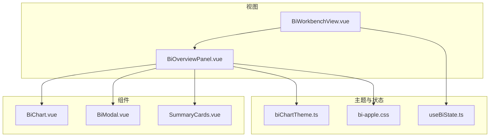
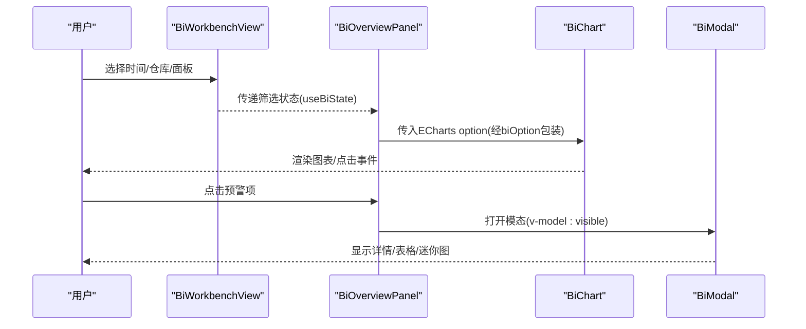
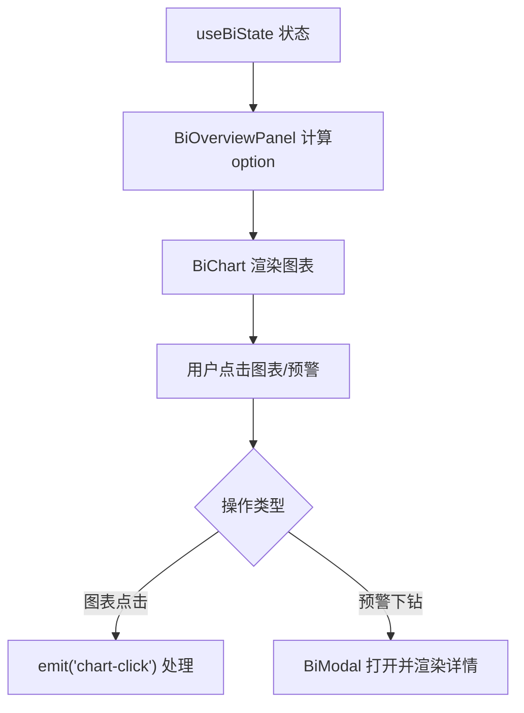
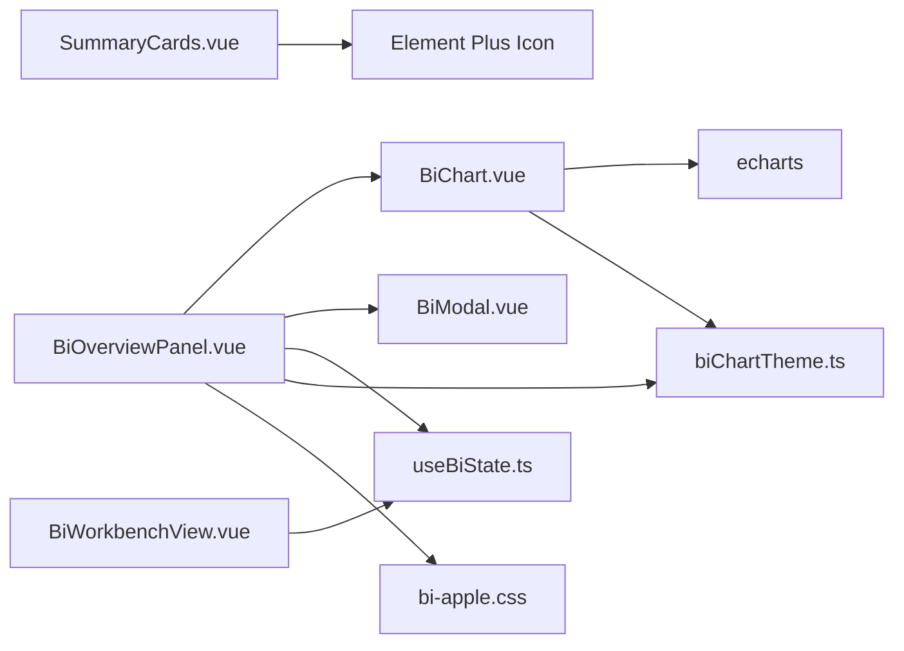

# 通用组件库

<cite>
**本文引用的文件**
- [SummaryCards.vue](file://frontend-vue/src/components/SummaryCards.vue)
- [BiChart.vue](file://frontend-vue/src/components/BiChart.vue)
- [BiModal.vue](file://frontend-vue/src/components/BiModal.vue)
- [biChartTheme.ts](file://frontend-vue/src/views/bi/biChartTheme.ts)
- [useBiState.ts](file://frontend-vue/src/composables/useBiState.ts)
- [BiOverviewPanel.vue](file://frontend-vue/src/views/bi/BiOverviewPanel.vue)
- [BiWorkbenchView.vue](file://frontend-vue/src/views/bi/BiWorkbenchView.vue)
- [bi-apple.css](file://frontend-vue/src/styles/bi-apple.css)
</cite>

## 目录
1. [简介](#简介)
2. [项目结构](#项目结构)
3. [核心组件](#核心组件)
4. [架构总览](#架构总览)
5. [组件详细分析](#组件详细分析)
6. [依赖关系分析](#依赖关系分析)
7. [性能考量](#性能考量)
8. [故障排查指南](#故障排查指南)
9. [结论](#结论)
10. [附录：使用示例与最佳实践](#附录使用示例与最佳实践)

## 简介
本组件库面向WMS系统的BI数据看板场景，提供三类通用UI能力：
- SummaryCards：多维度汇总KPI卡，支持渐变配色、图标集成与响应式布局。
- BiChart：统一ECharts容器封装，收敛初始化、配置更新、自适应与销毁逻辑，并暴露导出图片与实例访问能力。
- BiModal：通用下钻弹窗，支持动态内容渲染、多种关闭方式与样式定制。

这些组件在BI工作台（BiWorkbenchView）中组合使用，配合主题与状态管理（useBiState），形成一致、可复用、易扩展的可视化体验。

## 项目结构
前端Vue工程将通用组件集中在 components 目录，视图层通过 composables 共享全局筛选与面板状态，图表主题与工具函数集中于 views/bi 下的主题文件，样式以 scoped CSS 与局部主题类 .bi-scope 隔离，避免污染主站样式。

图示来源
- [BiWorkbenchView.vue:1-104](file://frontend-vue/src/views/bi/BiWorkbenchView.vue#L1-L104)
- [BiOverviewPanel.vue:1-172](file://frontend-vue/src/views/bi/BiOverviewPanel.vue#L1-L172)
- [SummaryCards.vue:1-135](file://frontend-vue/src/components/SummaryCards.vue#L1-L135)
- [BiChart.vue:1-59](file://frontend-vue/src/components/BiChart.vue#L1-L59)
- [BiModal.vue:1-37](file://frontend-vue/src/components/BiModal.vue#L1-L37)
- [biChartTheme.ts:1-79](file://frontend-vue/src/views/bi/biChartTheme.ts#L1-L79)
- [useBiState.ts:1-60](file://frontend-vue/src/composables/useBiState.ts#L1-L60)
- [bi-apple.css:1-249](file://frontend-vue/src/styles/bi-apple.css#L1-L249)

章节来源
- [BiWorkbenchView.vue:1-104](file://frontend-vue/src/views/bi/BiWorkbenchView.vue#L1-L104)
- [bi-apple.css:1-249](file://frontend-vue/src/styles/bi-apple.css#L1-L249)

## 核心组件
- SummaryCards：接收卡片数组，按渐变背景与阴影渲染，内置数字格式化与单位展示，支持图标插槽与响应式网格。
- BiChart：基于 ECharts 的统一容器，自动监听 option 变化、窗口尺寸变化，暴露 getDataURL 与 getInstance。
- BiModal：Teleport 到 body 的模态框，支持 v-model:visible 与 close 事件，ESC/遮罩/关闭按钮三种关闭方式。

章节来源
- [SummaryCards.vue:1-135](file://frontend-vue/src/components/SummaryCards.vue#L1-L135)
- [BiChart.vue:1-59](file://frontend-vue/src/components/BiChart.vue#L1-L59)
- [BiModal.vue:1-37](file://frontend-vue/src/components/BiModal.vue#L1-L37)

## 架构总览
BI工作台作为外壳，聚合时间范围与仓库筛选状态（useBiState），动态切换面板；各面板内部通过 BiChart 渲染图表，通过 BiModal 进行详情下钻，通过 SummaryCards 或自定义统计卡呈现关键指标。主题由 biChartTheme 统一注入，样式由 bi-apple.css 限定作用域。

图示来源
- [BiWorkbenchView.vue:1-104](file://frontend-vue/src/views/bi/BiWorkbenchView.vue#L1-L104)
- [BiOverviewPanel.vue:1-172](file://frontend-vue/src/views/bi/BiOverviewPanel.vue#L1-L172)
- [BiChart.vue:1-59](file://frontend-vue/src/components/BiChart.vue#L1-L59)
- [BiModal.vue:1-37](file://frontend-vue/src/components/BiModal.vue#L1-L37)
- [biChartTheme.ts:1-79](file://frontend-vue/src/views/bi/biChartTheme.ts#L1-L79)

## 组件详细分析

### SummaryCards 多维度汇总卡
设计理念
- 以“卡片即指标”的方式，将标签、数值、单位、图标与视觉权重（渐变+阴影）绑定，便于跨页面复用。
- 通过预设渐变色板保证视觉一致性，同时允许外部传入任意图标组件，增强扩展性。
- 采用CSS Grid实现响应式布局，在小屏设备自动降级为两列。

配置选项
- cards: 数组，每项包含 label、value、unit、icon、gradient（background/shadow）。
- 内部提供 formatNumber 对数值进行本地化格式化。

交互与样式
- hover 微动效提升反馈。
- 右下角装饰圆不遮挡内容，图标区域半透明毛玻璃效果。
- 响应式断点：移动端网格变为两列。

使用要点
- 通过传入不同 gradient 区分业务维度（如入库、出库、库存等）。
- 图标建议使用轻量级矢量图标组件，保持视觉一致。

章节来源
- [SummaryCards.vue:1-135](file://frontend-vue/src/components/SummaryCards.vue#L1-L135)

### BiChart 图表容器封装策略
封装目标
- 统一生命周期：init、setOption、resize、dispose 集中管理，减少样板代码。
- 数据绑定：deep watch option，自动更新图表。
- 事件透传：click 事件以 chart-click 形式向上抛出。
- 对外能力：getDataURL（导出PNG）、getInstance（获取底层实例）。

集成ECharts
- 使用 echarts.init 创建实例，ResizeObserver 监听容器尺寸变化触发 resize。
- 通过 biOption 注入统一主题（字体、颜色、tooltip、grid 等），确保风格一致。

数据绑定机制
- 父组件计算 option（computed），BiChart 监听其变化并调用 setOption。
- 图表点击事件通过 emit('chart-click') 向上传递，便于上层处理下钻或联动。

主题定制
- 主题色板 BI_PALETTE、坐标轴样式 axisCategory/axisValue、导出工具 exportPanelCharts 等均在 biChartTheme 中集中管理。

章节来源
- [BiChart.vue:1-59](file://frontend-vue/src/components/BiChart.vue#L1-L59)
- [biChartTheme.ts:1-79](file://frontend-vue/src/views/bi/biChartTheme.ts#L1-L79)

### BiModal 模态框组件
功能特性
- Teleport to body，避免层级与滚动问题。
- 支持 v-model:visible 双向绑定与 @close 事件，兼容两种关闭模式。
- 三种关闭方式：点击遮罩、右上角关闭按钮、按下 ESC。
- 根节点带 .bi-scope 类名，复用局部主题样式。

事件处理
- 关闭时同时触发 close 与 update:visible(false)，确保父组件状态同步。
- 键盘事件在 mounted 时注册，beforeUnmount 时移除，避免内存泄漏。

样式定制
- 通过 slot 插入任意内容，支持表格、图表、迷你图等复杂内容。
- 样式受 .bi-scope.bi-modal-root 控制，具备毛玻璃遮罩与入场动画。

章节来源
- [BiModal.vue:1-37](file://frontend-vue/src/components/BiModal.vue#L1-L37)
- [bi-apple.css:240-249](file://frontend-vue/src/styles/bi-apple.css#L240-L249)

### 视图层集成与数据流
- BiWorkbenchView 维护全局筛选（时间、仓库）与当前面板，通过 useBiState 暴露 state 与操作方法。
- BiOverviewPanel 根据 state 派生数据，构造 ECharts option 并通过 BiChart 渲染；点击预警项打开 BiModal 进行下钻。
- 主题通过 biChartTheme 的 biOption 统一注入，保证 tooltip、网格、字体、配色一致。

图示来源
- [useBiState.ts:1-60](file://frontend-vue/src/composables/useBiState.ts#L1-L60)
- [BiOverviewPanel.vue:1-172](file://frontend-vue/src/views/bi/BiOverviewPanel.vue#L1-L172)
- [BiChart.vue:1-59](file://frontend-vue/src/components/BiChart.vue#L1-L59)
- [BiModal.vue:1-37](file://frontend-vue/src/components/BiModal.vue#L1-L37)

## 依赖关系分析
- BiChart 依赖 ECharts 与主题工具（biChartTheme），并在视图中被多次复用。
- BiModal 无外部依赖，仅依赖 Vue 的 Teleport 与事件系统。
- SummaryCards 依赖 Element Plus 的图标组件（el-icon），用于统一图标渲染。
- 视图层依赖 useBiState 管理全局状态，依赖 biChartTheme 生成统一 option。
- 样式通过 .bi-scope 限定作用域，避免与主站样式冲突。

图示来源
- [BiChart.vue:1-59](file://frontend-vue/src/components/BiChart.vue#L1-L59)
- [biChartTheme.ts:1-79](file://frontend-vue/src/views/bi/biChartTheme.ts#L1-L79)
- [SummaryCards.vue:1-135](file://frontend-vue/src/components/SummaryCards.vue#L1-L135)
- [BiOverviewPanel.vue:1-172](file://frontend-vue/src/views/bi/BiOverviewPanel.vue#L1-L172)
- [BiWorkbenchView.vue:1-104](file://frontend-vue/src/views/bi/BiWorkbenchView.vue#L1-L104)
- [bi-apple.css:1-249](file://frontend-vue/src/styles/bi-apple.css#L1-L249)

章节来源
- [BiChart.vue:1-59](file://frontend-vue/src/components/BiChart.vue#L1-L59)
- [biChartTheme.ts:1-79](file://frontend-vue/src/views/bi/biChartTheme.ts#L1-L79)
- [SummaryCards.vue:1-135](file://frontend-vue/src/components/SummaryCards.vue#L1-L135)
- [BiOverviewPanel.vue:1-172](file://frontend-vue/src/views/bi/BiOverviewPanel.vue#L1-L172)
- [BiWorkbenchView.vue:1-104](file://frontend-vue/src/views/bi/BiWorkbenchView.vue#L1-L104)
- [bi-apple.css:1-249](file://frontend-vue/src/styles/bi-apple.css#L1-L249)

## 性能考量
- BiChart 使用 shallowRef 存储实例，减少不必要的深度监听开销；watch option 使用 deep 监听，确保复杂对象变更也能生效。
- ResizeObserver 仅在挂载后观察容器，卸载时断开，避免内存泄漏。
- 主题与坐标轴样式集中管理，减少重复配置与重绘成本。
- 列表与图表数据建议通过 computed 派生，结合分页/虚拟滚动（若数据量大）进一步优化。
- 导出图片时使用 pixelRatio: 2 提升清晰度，但需注意大图导出时的内存占用。

[本节为通用性能建议，不直接分析具体文件]

## 故障排查指南
- 图表不显示或尺寸异常
  - 检查容器是否有高度；BiChart 默认高度可通过 props.height 设置。
  - 确认 option 已正确传入且非空；watch 会深监听 option 变化。
- 图表点击事件未触发
  - 确认父组件监听 chart-click 事件；事件参数包含 name、dataIndex、seriesName、value。
- 模态框无法关闭或样式错乱
  - 确认 v-model:visible 与 @close 至少一种方式正确处理；检查 .bi-scope 是否包裹在根节点。
  - ESC 关闭依赖 window keydown 事件，确保组件已挂载且未提前销毁。
- 主题不一致
  - 所有图表 option 应通过 biOption 包装，确保 color、textStyle、tooltip、grid 一致。
- 样式污染
  - 避免在 .bi-scope 外定义全局样式；如需覆盖，优先使用 scoped 或更具体的选择器。

章节来源
- [BiChart.vue:1-59](file://frontend-vue/src/components/BiChart.vue#L1-L59)
- [BiModal.vue:1-37](file://frontend-vue/src/components/BiModal.vue#L1-L37)
- [biChartTheme.ts:1-79](file://frontend-vue/src/views/bi/biChartTheme.ts#L1-L79)
- [bi-apple.css:1-249](file://frontend-vue/src/styles/bi-apple.css#L1-L249)

## 结论
本组件库围绕“可复用、可定制、可测试”的原则，提供了BI看板所需的三大基础能力：指标卡、图表容器与模态框。通过统一的主题与状态管理，实现了跨面板的一致体验与高效开发。建议在后续迭代中继续完善单元测试与E2E用例，进一步提升稳定性与可维护性。

[本节为总结性内容，不直接分析具体文件]

## 附录：使用示例与最佳实践

### SummaryCards 使用示例
- 在视图中准备卡片数组，每项包含 label、value、unit、icon、gradient。
- 将数组作为 props 传入 SummaryCards，即可渲染出带渐变背景的汇总卡。
- 推荐为不同业务维度选择不同 gradient，保持视觉语义一致。

章节来源
- [SummaryCards.vue:1-135](file://frontend-vue/src/components/SummaryCards.vue#L1-L135)

### BiChart 使用示例
- 在视图中通过 computed 生成 ECharts option，并使用 biOption 包装。
- 将 option 传入 BiChart，必要时设置 height。
- 监听 chart-click 事件处理点击行为；需要导出图片时通过 ref 调用 getDataURL。

章节来源
- [BiOverviewPanel.vue:1-172](file://frontend-vue/src/views/bi/BiOverviewPanel.vue#L1-L172)
- [BiChart.vue:1-59](file://frontend-vue/src/components/BiChart.vue#L1-L59)
- [biChartTheme.ts:1-79](file://frontend-vue/src/views/bi/biChartTheme.ts#L1-L79)

### BiModal 使用示例
- 使用 v-model:visible 控制显隐，或在模板中监听 @close 事件。
- 在 slot 中插入任意内容（表格、图表、文本等）。
- 标题通过 title prop 传入，关闭方式包括遮罩、X按钮、ESC。

章节来源
- [BiOverviewPanel.vue:1-172](file://frontend-vue/src/views/bi/BiOverviewPanel.vue#L1-L172)
- [BiModal.vue:1-37](file://frontend-vue/src/components/BiModal.vue#L1-L37)

### 最佳实践
- 统一主题：所有图表 option 必须通过 biOption 包装，确保风格一致。
- 状态管理：使用 useBiState 管理全局筛选与面板切换，避免分散状态。
- 样式隔离：所有样式以 .bi-scope 限定，避免污染主站。
- 可访问性：为关闭按钮添加 aria-label，键盘操作友好。
- 性能优化：大数据量时考虑分页、虚拟滚动与按需加载；导出图片时注意像素比与内存占用。

[本节为通用最佳实践，不直接分析具体文件]