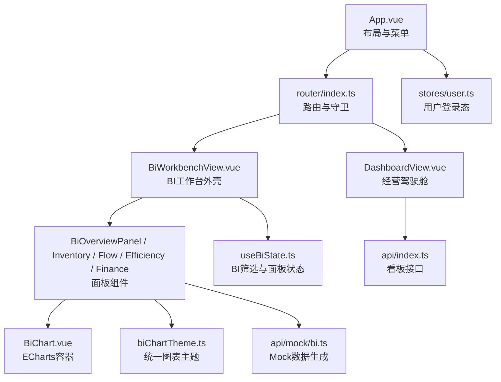
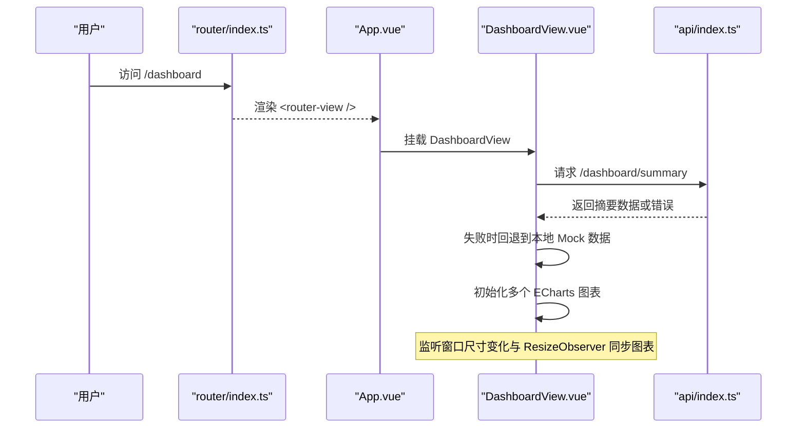
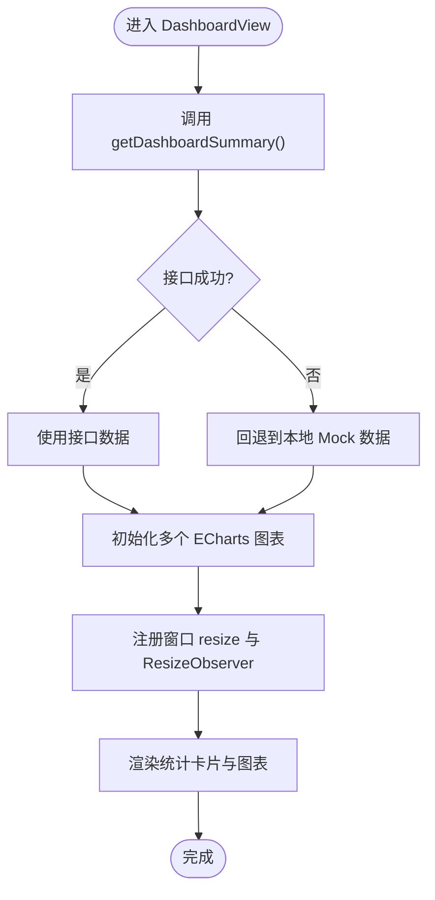
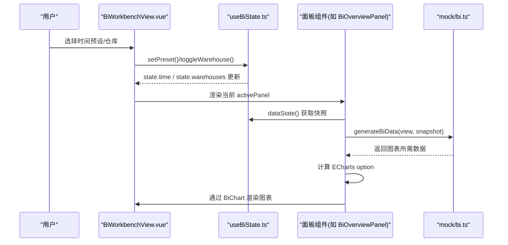
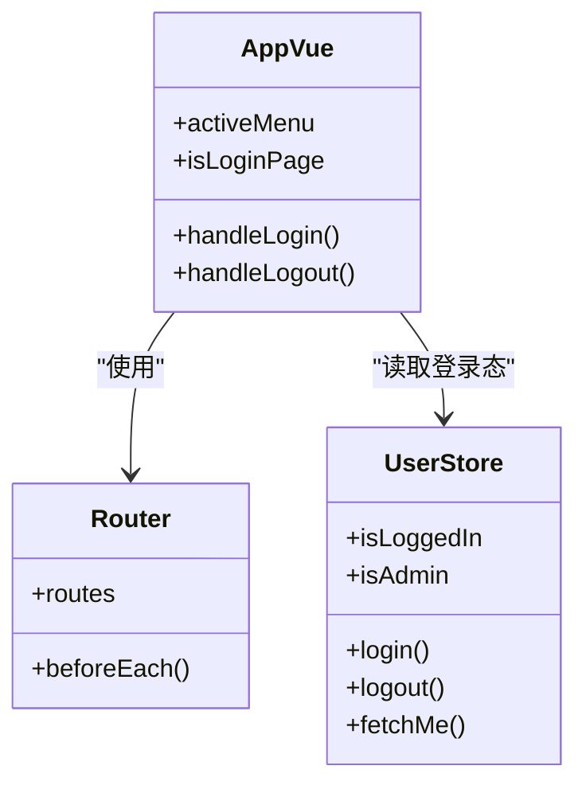
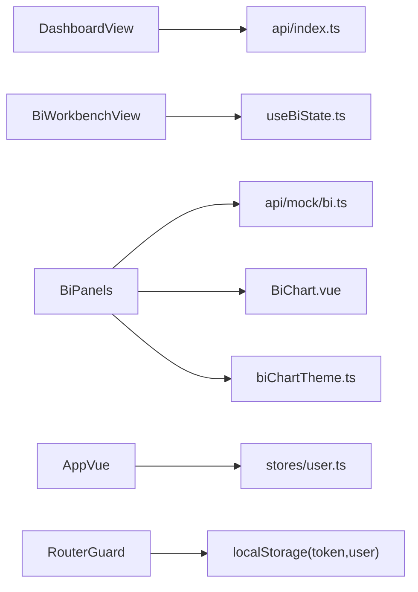

# 页面组件架构

<cite>
**本文引用的文件**
- [App.vue](file://frontend-vue/src/App.vue)
- [main.ts](file://frontend-vue/src/main.ts)
- [router/index.ts](file://frontend-vue/src/router/index.ts)
- [DashboardView.vue](file://frontend-vue/src/views/DashboardView.vue)
- [BiWorkbenchView.vue](file://frontend-vue/src/views/bi/BiWorkbenchView.vue)
- [useBiState.ts](file://frontend-vue/src/composables/useBiState.ts)
- [user.ts](file://frontend-vue/src/stores/user.ts)
- [BiChart.vue](file://frontend-vue/src/components/BiChart.vue)
- [biChartTheme.ts](file://frontend-vue/src/views/bi/biChartTheme.ts)
- [api/index.ts](file://frontend-vue/src/api/index.ts)
- [mock/bi.ts](file://frontend-vue/src/api/mock/bi.ts)
</cite>

## 目录
1. [简介](#简介)
2. [项目结构](#项目结构)
3. [核心组件](#核心组件)
4. [架构总览](#架构总览)
5. [详细组件分析](#详细组件分析)
6. [依赖关系分析](#依赖关系分析)
7. [性能考虑](#性能考虑)
8. [故障排查指南](#故障排查指南)
9. [结论](#结论)

## 简介
本文件面向WMS系统前端（Vue 3 + Element Plus）的页面组件架构，聚焦以下目标：
- 说明页面组件的分层设计与职责划分原则
- 文档化 DashboardView 经营驾驶舱的数据流与状态管理
- 解释 BiWorkbenchView BI工作台的模块化设计与图表组合模式
- 描述 App.vue 应用根组件的路由配置与全局状态初始化
- 总结页面间导航模式与权限控制实现
- 提供页面性能优化策略与懒加载方案

## 项目结构
前端采用“视图-可复用组件-状态/工具”的分层组织方式：
- 视图层：views 下的各业务页面（如 DashboardView、BiWorkbenchView 等）
- 组件层：components 下的通用可视化容器（如 BiChart）
- 状态层：stores（Pinia）与 composables（模块级单例状态）
- 路由层：router/index.ts 集中定义路由与守卫
- API 层：api/index.ts 统一接口封装；api/mock/bi.ts 提供可复现的 Mock 数据生成器
- 主题与样式：views/bi/biChartTheme.ts 统一 ECharts 风格

图示来源
- [App.vue:1-150](file://frontend-vue/src/App.vue#L1-L150)
- [router/index.ts:1-48](file://frontend-vue/src/router/index.ts#L1-L48)
- [DashboardView.vue:1-175](file://frontend-vue/src/views/DashboardView.vue#L1-L175)
- [BiWorkbenchView.vue:1-104](file://frontend-vue/src/views/bi/BiWorkbenchView.vue#L1-L104)
- [useBiState.ts:1-60](file://frontend-vue/src/composables/useBiState.ts#L1-L60)
- [user.ts:1-49](file://frontend-vue/src/stores/user.ts#L1-L49)
- [BiChart.vue:1-59](file://frontend-vue/src/components/BiChart.vue#L1-L59)
- [biChartTheme.ts:1-79](file://frontend-vue/src/views/bi/biChartTheme.ts#L1-L79)
- [api/index.ts:92-107](file://frontend-vue/src/api/index.ts#L92-L107)
- [mock/bi.ts:1-200](file://frontend-vue/src/api/mock/bi.ts#L1-L200)

章节来源
- [App.vue:1-150](file://frontend-vue/src/App.vue#L1-L150)
- [router/index.ts:1-48](file://frontend-vue/src/router/index.ts#L1-L48)

## 核心组件
- App.vue：应用根布局、侧边栏菜单、顶部信息区、登录态展示与退出、路由入口 router-view。
- DashboardView.vue：经营驾驶舱，聚合统计卡片、多类 ECharts 图表、快捷操作跳转。
- BiWorkbenchView.vue：BI工作台外壳，时间/仓库筛选、Dock 面板切换、导出图表。
- useBiState.ts：BI工作台模块级单例状态（时间范围、仓库多选、当前面板）。
- user.ts：Pinia 用户状态（token、用户信息、登录/登出、获取当前用户）。
- BiChart.vue：统一的 ECharts 容器，封装 init/setOption/resize/dispose 与导出能力。
- biChartTheme.ts：统一 Apple 风格的 ECharts 主题与导出工具。
- api/index.ts：所有后端接口封装（含看板摘要、经营财务等）。
- mock/bi.ts：BI 工作台 Mock 数据生成器（确定性种子、按筛选派生数据）。

章节来源
- [App.vue:1-150](file://frontend-vue/src/App.vue#L1-L150)
- [DashboardView.vue:1-175](file://frontend-vue/src/views/DashboardView.vue#L1-L175)
- [BiWorkbenchView.vue:1-104](file://frontend-vue/src/views/bi/BiWorkbenchView.vue#L1-L104)
- [useBiState.ts:1-60](file://frontend-vue/src/composables/useBiState.ts#L1-L60)
- [user.ts:1-49](file://frontend-vue/src/stores/user.ts#L1-L49)
- [BiChart.vue:1-59](file://frontend-vue/src/components/BiChart.vue#L1-L59)
- [biChartTheme.ts:1-79](file://frontend-vue/src/views/bi/biChartTheme.ts#L1-L79)
- [api/index.ts:92-107](file://frontend-vue/src/api/index.ts#L92-L107)
- [mock/bi.ts:1-200](file://frontend-vue/src/api/mock/bi.ts#L1-L200)

## 架构总览
整体采用“根布局 + 路由视图 + 业务页面 + 通用图表容器 + 状态/主题”的分层架构：
- 根布局 App.vue 负责全局 UI 框架与用户态展示
- 路由集中管理页面与权限守卫
- 业务页面专注数据获取与展示逻辑
- 图表通过 BiChart 统一生命周期管理，避免重复样板代码
- BI 工作台通过 useBiState 共享筛选与面板状态，面板组件消费该状态并渲染对应图表

图示来源
- [router/index.ts:1-48](file://frontend-vue/src/router/index.ts#L1-L48)
- [App.vue:1-150](file://frontend-vue/src/App.vue#L1-L150)
- [DashboardView.vue:1-175](file://frontend-vue/src/views/DashboardView.vue#L1-L175)
- [api/index.ts:92-107](file://frontend-vue/src/api/index.ts#L92-L107)

## 详细组件分析

### DashboardView 经营驾驶舱
- 职责
  - 聚合关键指标卡（入库/出库/库存总量/低库存商品/在售商品/客户数等）
  - 展示近7天出入库趋势、库存分类占比、仓库库存分布、Top销量、单据状态、仓库热力图
  - 提供快捷操作入口跳转到具体业务页
  - 处理接口失败时的降级策略（使用本地 Mock）
- 数据流
  - 组件内 ref 保存 summary 与 loading
  - onMounted 调用 getDashboardSummary，成功则更新 summary，失败则回退到 mockSummary
  - nextTick 后初始化多个 ECharts 实例，并通过 window resize 与 ResizeObserver 自适应
  - 图表在 onBeforeUnmount 中统一 dispose，避免内存泄漏
- 状态管理
  - 局部状态（ref）+ computed（如作业效率）
  - 无跨页面共享状态，适合独立看板场景
- 性能要点
  - 延迟初始化图表（nextTick + setTimeout），确保容器尺寸就绪
  - 使用 ResizeObserver 精准监听图表容器变化
  - 统一 dispose 释放资源

图示来源
- [DashboardView.vue:136-175](file://frontend-vue/src/views/DashboardView.vue#L136-L175)
- [DashboardView.vue:288-709](file://frontend-vue/src/views/DashboardView.vue#L288-L709)
- [api/index.ts:92-107](file://frontend-vue/src/api/index.ts#L92-L107)

章节来源
- [DashboardView.vue:1-175](file://frontend-vue/src/views/DashboardView.vue#L1-L175)
- [DashboardView.vue:288-709](file://frontend-vue/src/views/DashboardView.vue#L288-L709)
- [api/index.ts:92-107](file://frontend-vue/src/api/index.ts#L92-L107)

### BiWorkbenchView BI工作台
- 职责
  - 提供时间范围预设（今天/近7天/近30天/自定义）与仓库多选筛选
  - Dock 面板切换（数据总览/库存分析/出入库分析/作业效率/经营财务）
  - 导出当前面板图表为 PNG
  - 通过 KeepAlive 缓存面板组件，提升切换体验
- 模块化设计
  - 外壳 BiWorkbenchView 仅负责筛选与面板切换
  - 各面板（BiOverviewPanel 等）消费 useBiState 的状态，计算自身图表 option
  - 图表统一通过 BiChart 容器渲染，主题由 biChartTheme 统一
- 数据流
  - 使用 useBiState 暴露 state（只读）与 setPreset/setCustomRange/setPanel/toggleWarehouse
  - 面板通过 dataState() 获取稳定快照，用于 generateBiData 生成可复现实验数据
  - 经营财务面板走真实接口（见 api/index.ts 经营驾驶舱相关方法），其他面板使用 Mock
- 交互流程

图示来源
- [BiWorkbenchView.vue:1-104](file://frontend-vue/src/views/bi/BiWorkbenchView.vue#L1-L104)
- [useBiState.ts:1-60](file://frontend-vue/src/composables/useBiState.ts#L1-L60)
- [mock/bi.ts:106-128](file://frontend-vue/src/api/mock/bi.ts#L106-L128)
- [BiOverviewPanel.vue:1-172](file://frontend-vue/src/views/bi/BiOverviewPanel.vue#L1-L172)

章节来源
- [BiWorkbenchView.vue:1-104](file://frontend-vue/src/views/bi/BiWorkbenchView.vue#L1-L104)
- [useBiState.ts:1-60](file://frontend-vue/src/composables/useBiState.ts#L1-L60)
- [mock/bi.ts:106-128](file://frontend-vue/src/api/mock/bi.ts#L106-L128)
- [BiOverviewPanel.vue:1-172](file://frontend-vue/src/views/bi/BiOverviewPanel.vue#L1-L172)

### App.vue 应用根组件
- 职责
  - 非登录页渲染侧边栏菜单与主内容区，登录页全屏展示
  - 根据路由高亮当前菜单项
  - 显示用户角色与名称，支持退出登录
  - 通过 router-view 注入页面视图
- 路由与权限
  - 路由配置集中在 router/index.ts，包含登录、看板、BI工作台与各业务页
  - 全局 beforeEach 守卫：未登录重定向至 /login；/users 仅管理员可访问
- 全局初始化
  - main.ts 中创建 Vue 应用，注册 Pinia、Element Plus 图标、Router
  - 用户状态持久化于 localStorage（token、用户信息）

图示来源
- [App.vue:1-150](file://frontend-vue/src/App.vue#L1-L150)
- [router/index.ts:1-48](file://frontend-vue/src/router/index.ts#L1-L48)
- [user.ts:1-49](file://frontend-vue/src/stores/user.ts#L1-L49)
- [main.ts:1-19](file://frontend-vue/src/main.ts#L1-L19)

章节来源
- [App.vue:1-150](file://frontend-vue/src/App.vue#L1-L150)
- [router/index.ts:1-48](file://frontend-vue/src/router/index.ts#L1-L48)
- [user.ts:1-49](file://frontend-vue/src/stores/user.ts#L1-L49)
- [main.ts:1-19](file://frontend-vue/src/main.ts#L1-L19)

## 依赖关系分析
- 视图依赖
  - DashboardView 依赖 api/index.ts 的 getDashboardSummary
  - BiWorkbenchView 及其子面板依赖 useBiState 与 mock/bi.ts
  - 所有图表通过 BiChart 与 biChartTheme 统一渲染
- 状态依赖
  - App.vue 依赖 stores/user.ts 的用户状态
  - 路由守卫依赖 localStorage 中的 token 与用户信息
- 外部依赖
  - Element Plus（UI 组件）
  - ECharts（图表）
  - Vue Router（路由与懒加载）
  - Pinia（状态管理）

图示来源
- [DashboardView.vue:1-175](file://frontend-vue/src/views/DashboardView.vue#L1-L175)
- [api/index.ts:92-107](file://frontend-vue/src/api/index.ts#L92-L107)
- [BiWorkbenchView.vue:1-104](file://frontend-vue/src/views/bi/BiWorkbenchView.vue#L1-L104)
- [useBiState.ts:1-60](file://frontend-vue/src/composables/useBiState.ts#L1-L60)
- [mock/bi.ts:1-200](file://frontend-vue/src/api/mock/bi.ts#L1-L200)
- [BiChart.vue:1-59](file://frontend-vue/src/components/BiChart.vue#L1-L59)
- [biChartTheme.ts:1-79](file://frontend-vue/src/views/bi/biChartTheme.ts#L1-L79)
- [user.ts:1-49](file://frontend-vue/src/stores/user.ts#L1-L49)

章节来源
- [router/index.ts:1-48](file://frontend-vue/src/router/index.ts#L1-L48)
- [user.ts:1-49](file://frontend-vue/src/stores/user.ts#L1-L49)

## 性能考虑
- 懒加载
  - 路由使用动态 import，减少首屏体积（如 LoginView、DashboardView、BiWorkbenchView 等）
- 图表性能
  - BiChart 统一生命周期管理，避免重复 init/dispose
  - 使用 ResizeObserver 精确监听容器尺寸变化，减少不必要的 resize
  - 图表动画时长与网格简化，降低渲染开销
- 数据加载
  - DashboardView 接口失败时快速降级到 Mock，保障可用性
  - BI 工作台通过确定性种子生成数据，保证相同筛选条件数据稳定，便于演示与调试
- 状态与缓存
  - BI 面板使用 KeepAlive 缓存，避免重复初始化
  - 用户态持久化于 localStorage，减少重复登录成本

[本节为通用性能建议，不直接分析具体文件]

## 故障排查指南
- 登录与权限
  - 若无法访问受保护页面，检查 localStorage 中 token 与用户角色是否正确
  - /users 仅管理员可访问，非管理员将被重定向至 /dashboard
- 图表异常
  - 若图表尺寸不正确，确认容器已渲染且 nextTick 后初始化
  - 若出现内存泄漏，检查是否在组件卸载时正确 dispose
- 数据不一致
  - BI 工作台不同筛选条件下的数据差异由 seed 决定，确认时间范围与仓库选择是否生效
  - 接口失败时，DashboardView 会回退到 Mock，检查控制台警告信息

章节来源
- [router/index.ts:31-45](file://frontend-vue/src/router/index.ts#L31-L45)
- [DashboardView.vue:136-175](file://frontend-vue/src/views/DashboardView.vue#L136-L175)
- [BiChart.vue:27-49](file://frontend-vue/src/components/BiChart.vue#L27-L49)
- [mock/bi.ts:106-128](file://frontend-vue/src/api/mock/bi.ts#L106-L128)

## 结论
本 WMS 前端页面组件架构以清晰的分层与职责划分为基础：
- App.vue 作为根布局与全局入口，结合路由守卫实现导航与权限控制
- DashboardView 聚焦经营驾驶舱的数据聚合与可视化，具备健壮的错误降级机制
- BiWorkbenchView 通过模块化面板与统一状态管理，实现灵活的图表组合与筛选联动
- 图表通过 BiChart 与主题统一管理，提升一致性与可维护性
- 性能方面采用懒加载、ResizeObserver、KeepAlive 等手段优化用户体验

[本节为总结性内容，不直接分析具体文件]