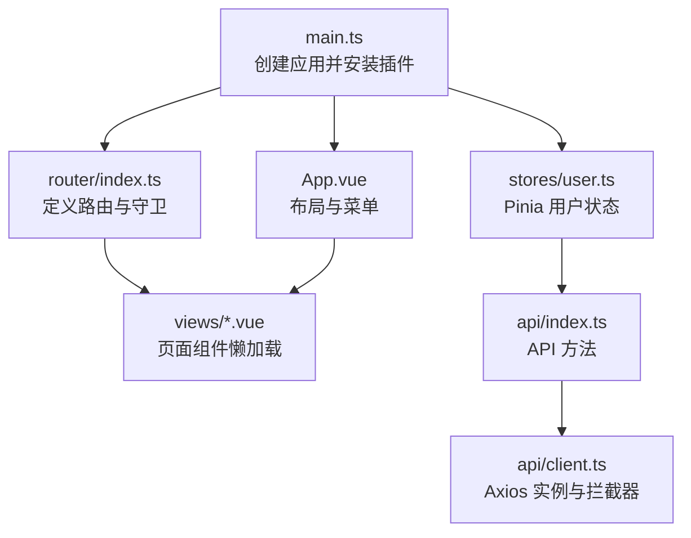
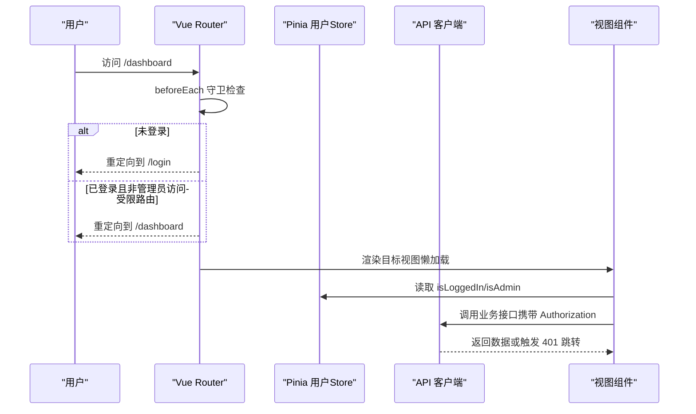
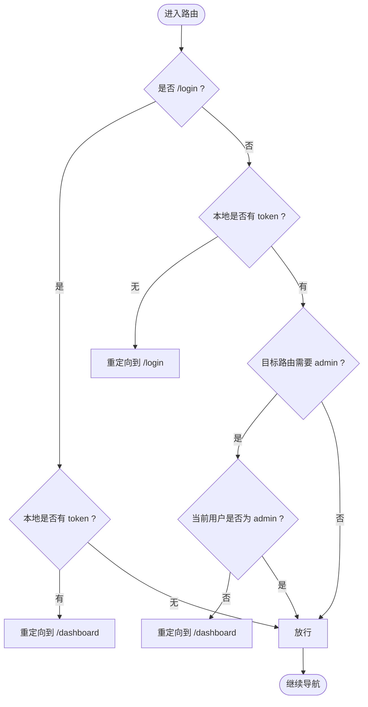
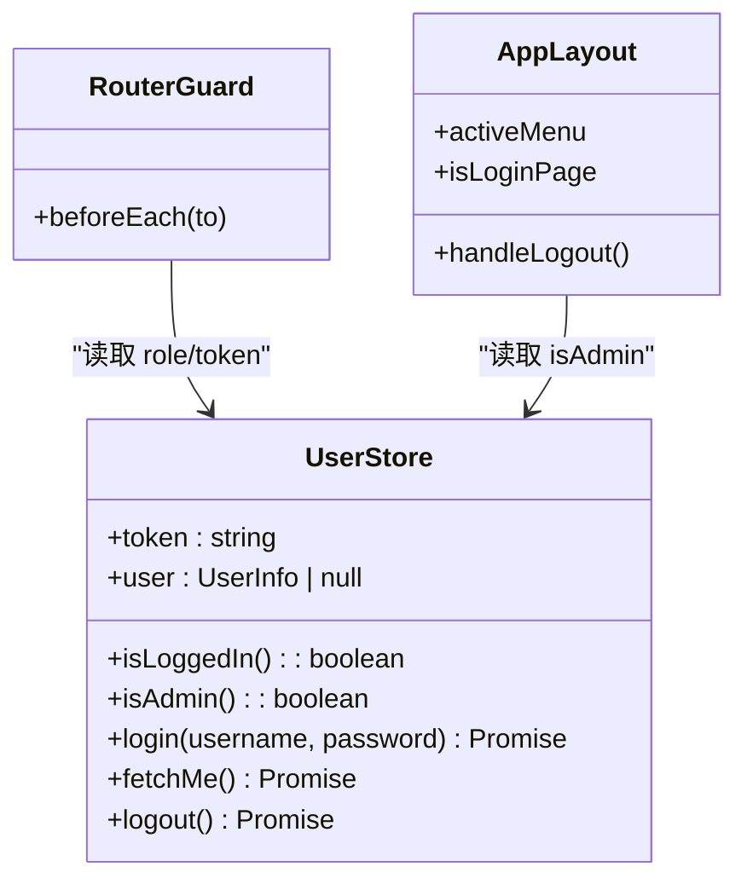
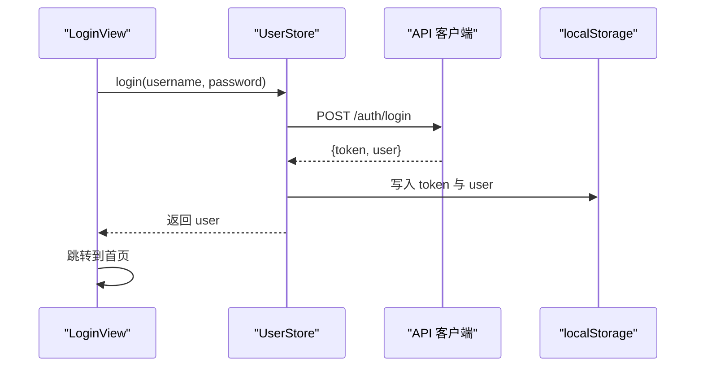
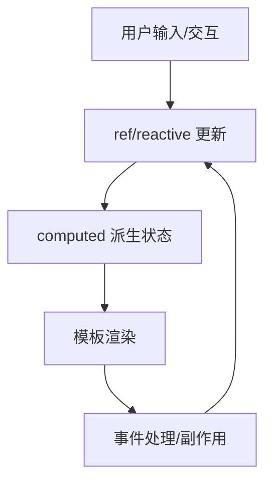
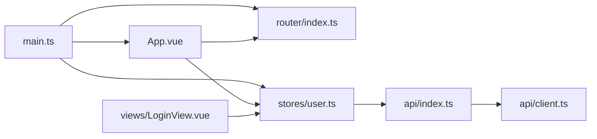

# 路由和状态管理

<cite>
**本文引用的文件**
- [frontend-vue/src/router/index.ts](file://frontend-vue/src/router/index.ts)
- [frontend-vue/src/stores/user.ts](file://frontend-vue/src/stores/user.ts)
- [frontend-vue/src/api/client.ts](file://frontend-vue/src/api/client.ts)
- [frontend-vue/src/api/index.ts](file://frontend-vue/src/api/index.ts)
- [frontend-vue/src/main.ts](file://frontend-vue/src/main.ts)
- [frontend-vue/src/App.vue](file://frontend-vue/src/App.vue)
- [frontend-vue/src/views/LoginView.vue](file://frontend-vue/src/views/LoginView.vue)
- [frontend-vue/src/composables/useBiState.ts](file://frontend-vue/src/composables/useBiState.ts)
</cite>

## 目录
1. [简介](#简介)
2. [项目结构](#项目结构)
3. [核心组件](#核心组件)
4. [架构总览](#架构总览)
5. [详细组件分析](#详细组件分析)
6. [依赖关系分析](#依赖关系分析)
7. [性能与优化](#性能与优化)
8. [故障排查指南](#故障排查指南)
9. [结论](#结论)
10. [附录](#附录)

## 简介
本文件聚焦 WMS 前端（Vue 3 + Vue Router + Pinia）的路由与状态管理方案，覆盖以下主题：
- Vue Router 配置、全局守卫与权限控制
- 动态路由加载机制（基于 meta 的访问控制）
- Pinia store 的组织结构与状态管理模式
- 响应式数据绑定与计算属性的使用
- 组合式 API（Composition API）最佳实践
- 状态持久化与缓存策略
- 路由懒加载与代码分割优化

## 项目结构
前端采用模块化组织：
- 路由定义与守卫集中在 router/index.ts
- 用户相关状态与认证逻辑在 stores/user.ts
- HTTP 客户端封装与拦截器在 api/client.ts
- 业务 API 方法在 api/index.ts
- 应用入口 main.ts 注册 Pinia、Router、UI 库
- 布局与菜单在 App.vue，登录页在 views/LoginView.vue
- BI 工作台模块级状态在 composables/useBiState.ts

图表来源
- [frontend-vue/src/main.ts:1-19](file://frontend-vue/src/main.ts#L1-L19)
- [frontend-vue/src/router/index.ts:1-48](file://frontend-vue/src/router/index.ts#L1-L48)
- [frontend-vue/src/stores/user.ts:1-49](file://frontend-vue/src/stores/user.ts#L1-L49)
- [frontend-vue/src/api/client.ts:1-45](file://frontend-vue/src/api/client.ts#L1-L45)
- [frontend-vue/src/api/index.ts:449-488](file://frontend-vue/src/api/index.ts#L449-L488)
- [frontend-vue/src/App.vue:1-150](file://frontend-vue/src/App.vue#L1-L150)

章节来源
- [frontend-vue/src/main.ts:1-19](file://frontend-vue/src/main.ts#L1-L19)
- [frontend-vue/src/router/index.ts:1-48](file://frontend-vue/src/router/index.ts#L1-L48)

## 核心组件
- 路由层：集中式路由表、Hash 模式历史、全局前置守卫、元信息控制
- 状态层：Pinia 用户 store，负责 token 与用户信息的持久化、登录/登出、当前用户获取
- 网络层：Axios 实例统一处理请求头注入、401 自动跳转、错误提示
- 视图层：App.vue 布局与菜单、LoginView.vue 登录流程与冷启动预热

章节来源
- [frontend-vue/src/router/index.ts:1-48](file://frontend-vue/src/router/index.ts#L1-L48)
- [frontend-vue/src/stores/user.ts:1-49](file://frontend-vue/src/stores/user.ts#L1-L49)
- [frontend-vue/src/api/client.ts:1-45](file://frontend-vue/src/api/client.ts#L1-L45)
- [frontend-vue/src/App.vue:1-150](file://frontend-vue/src/App.vue#L1-L150)
- [frontend-vue/src/views/LoginView.vue:1-188](file://frontend-vue/src/views/LoginView.vue#L1-L188)

## 架构总览
下图展示了从浏览器访问到页面渲染、鉴权校验、状态同步的整体流程。

图表来源
- [frontend-vue/src/router/index.ts:31-45](file://frontend-vue/src/router/index.ts#L31-L45)
- [frontend-vue/src/stores/user.ts:12-48](file://frontend-vue/src/stores/user.ts#L12-L48)
- [frontend-vue/src/api/client.ts:18-42](file://frontend-vue/src/api/client.ts#L18-L42)
- [frontend-vue/src/App.vue:20-35](file://frontend-vue/src/App.vue#L20-L35)

## 详细组件分析

### 路由配置与守卫
- 路由模式：Hash 模式，便于静态部署
- 路由表：扁平化路由，每个页面独立组件，通过 import() 实现按需加载
- 元信息：meta.title 用于页面标题；meta.admin 标记仅管理员可访问
- 全局守卫：beforeEach 统一处理登录态校验与管理员限制

图表来源
- [frontend-vue/src/router/index.ts:31-45](file://frontend-vue/src/router/index.ts#L31-L45)

章节来源
- [frontend-vue/src/router/index.ts:1-48](file://frontend-vue/src/router/index.ts#L1-L48)

### 用户权限控制与动态路由加载
- 权限模型：基于角色的访问控制（RBAC），角色包括 admin 与 operator
- 路由级权限：通过 meta.admin 标记受保护路由，守卫中校验 user.role
- 界面级权限：App.vue 侧边栏根据 userStore.isAdmin 决定是否显示“用户管理”
- 动态加载：所有页面组件均使用 import() 语法，配合路由表实现代码分割

图表来源
- [frontend-vue/src/stores/user.ts:7-48](file://frontend-vue/src/stores/user.ts#L7-L48)
- [frontend-vue/src/router/index.ts:31-45](file://frontend-vue/src/router/index.ts#L31-L45)
- [frontend-vue/src/App.vue:121-126](file://frontend-vue/src/App.vue#L121-L126)

章节来源
- [frontend-vue/src/stores/user.ts:1-49](file://frontend-vue/src/stores/user.ts#L1-L49)
- [frontend-vue/src/App.vue:121-126](file://frontend-vue/src/App.vue#L121-L126)

### Pinia Store 组织结构与状态管理
- 单一职责：user store 专注认证与用户信息
- 状态持久化：token 与 user 对象读写 localStorage，保证刷新后保持登录态
- 派生状态：getters 提供 isLoggedIn、isAdmin 等布尔判断
- 异步操作：login、fetchMe、logout 封装 API 调用与本地清理
- 错误容忍：logout 时即使后端失败也不阻塞本地清理

图表来源
- [frontend-vue/src/views/LoginView.vue:150-185](file://frontend-vue/src/views/LoginView.vue#L150-L185)
- [frontend-vue/src/stores/user.ts:21-29](file://frontend-vue/src/stores/user.ts#L21-L29)
- [frontend-vue/src/api/index.ts:459-476](file://frontend-vue/src/api/index.ts#L459-L476)

章节来源
- [frontend-vue/src/stores/user.ts:1-49](file://frontend-vue/src/stores/user.ts#L1-L49)
- [frontend-vue/src/views/LoginView.vue:1-188](file://frontend-vue/src/views/LoginView.vue#L1-L188)

### 响应式数据绑定与计算属性
- 登录页：使用 ref/reactive 管理表单与加载状态；computed 派生进度阶段、文案与可见性
- 布局页：computed 决定高亮菜单、登录页判断、用户名与角色标签
- 组合式函数：useBiState 暴露只读 state 与操作方法，供多面板共享筛选状态

图表来源
- [frontend-vue/src/views/LoginView.vue:19-127](file://frontend-vue/src/views/LoginView.vue#L19-L127)
- [frontend-vue/src/App.vue:20-35](file://frontend-vue/src/App.vue#L20-L35)
- [frontend-vue/src/composables/useBiState.ts:22-58](file://frontend-vue/src/composables/useBiState.ts#L22-L58)

章节来源
- [frontend-vue/src/views/LoginView.vue:1-188](file://frontend-vue/src/views/LoginView.vue#L1-L188)
- [frontend-vue/src/App.vue:1-150](file://frontend-vue/src/App.vue#L1-L150)
- [frontend-vue/src/composables/useBiState.ts:1-60](file://frontend-vue/src/composables/useBiState.ts#L1-L60)

### 组合式 API（Composition API）最佳实践
- 状态与逻辑内聚：将表单、计时器、服务预热等逻辑封装在组件 setup 中
- 可复用状态：BI 模块通过 useBiState 暴露模块级单例，避免重复维护
- 只读状态：对外暴露 readonly(state)，防止外部直接修改内部状态
- 副作用管理：onMounted/onBeforeUnmount 管理生命周期与定时器清理

章节来源
- [frontend-vue/src/views/LoginView.vue:1-188](file://frontend-vue/src/views/LoginView.vue#L1-L188)
- [frontend-vue/src/composables/useBiState.ts:1-60](file://frontend-vue/src/composables/useBiState.ts#L1-L60)

### 状态持久化与缓存策略
- 登录态持久化：localStorage 存储 token 与 user，应用启动时从本地恢复
- 请求头注入：axios 请求拦截器自动附加 Authorization 头
- 401 处理：响应拦截器清除本地状态并强制跳转登录页
- 记住我：登录页支持记住用户名，提升用户体验

章节来源
- [frontend-vue/src/stores/user.ts:4-16](file://frontend-vue/src/stores/user.ts#L4-L16)
- [frontend-vue/src/api/client.ts:18-42](file://frontend-vue/src/api/client.ts#L18-L42)
- [frontend-vue/src/views/LoginView.vue:64-72](file://frontend-vue/src/views/LoginView.vue#L64-L72)

### 路由懒加载与代码分割优化
- 所有页面组件通过 import() 动态导入，仅在访问对应路由时加载
- 减少首屏体积，提升初始加载速度
- 结合 Hash 模式与静态部署，无需服务端配置即可工作

章节来源
- [frontend-vue/src/router/index.ts:5-28](file://frontend-vue/src/router/index.ts#L5-L28)

## 依赖关系分析
- main.ts 初始化应用并安装 Pinia、Router、Element Plus
- App.vue 作为根布局，包含侧边栏与主内容区，依赖 user store 控制菜单与头部
- LoginView.vue 依赖 user store 执行登录，依赖 api/warmUpService 预热后端
- router/index.ts 依赖 localStorage 中的 token/user 进行鉴权
- api/client.ts 提供统一的 axios 实例，集中处理认证与错误

图表来源
- [frontend-vue/src/main.ts:1-19](file://frontend-vue/src/main.ts#L1-L19)
- [frontend-vue/src/App.vue:1-150](file://frontend-vue/src/App.vue#L1-L150)
- [frontend-vue/src/views/LoginView.vue:1-188](file://frontend-vue/src/views/LoginView.vue#L1-L188)
- [frontend-vue/src/router/index.ts:1-48](file://frontend-vue/src/router/index.ts#L1-L48)
- [frontend-vue/src/stores/user.ts:1-49](file://frontend-vue/src/stores/user.ts#L1-L49)
- [frontend-vue/src/api/index.ts:449-488](file://frontend-vue/src/api/index.ts#L449-L488)
- [frontend-vue/src/api/client.ts:1-45](file://frontend-vue/src/api/client.ts#L1-L45)

章节来源
- [frontend-vue/src/main.ts:1-19](file://frontend-vue/src/main.ts#L1-L19)
- [frontend-vue/src/App.vue:1-150](file://frontend-vue/src/App.vue#L1-L150)
- [frontend-vue/src/router/index.ts:1-48](file://frontend-vue/src/router/index.ts#L1-L48)
- [frontend-vue/src/stores/user.ts:1-49](file://frontend-vue/src/stores/user.ts#L1-L49)
- [frontend-vue/src/api/client.ts:1-45](file://frontend-vue/src/api/client.ts#L1-L45)

## 性能与优化
- 路由懒加载：所有页面组件按需加载，降低首屏体积
- 代码分割：基于 import() 的动态导入，配合构建工具生成独立 chunk
- 状态最小化：store 仅保存必要字段，getter 提供派生状态，避免冗余计算
- 请求优化：统一拦截器减少重复逻辑，401 自动处理减少无效请求
- 冷启动体验：登录页后台预热后端服务，缩短首次交互等待感知

[本节为通用指导，不直接分析具体文件]

## 故障排查指南
- 401 未授权：检查 axios 响应拦截器是否正确清除本地状态并跳转登录
- 路由守卫死循环：确认 beforeAll 中对 /login 的判断与重定向逻辑
- 状态不同步：确保登录后同时更新 localStorage 与 store 状态
- 菜单权限异常：核对 meta.admin 与 user.role 的匹配逻辑
- 登录失败反馈：区分超时、离线与账号错误，提供重试入口

章节来源
- [frontend-vue/src/api/client.ts:27-42](file://frontend-vue/src/api/client.ts#L27-L42)
- [frontend-vue/src/router/index.ts:31-45](file://frontend-vue/src/router/index.ts#L31-L45)
- [frontend-vue/src/stores/user.ts:21-48](file://frontend-vue/src/stores/user.ts#L21-L48)
- [frontend-vue/src/views/LoginView.vue:135-185](file://frontend-vue/src/views/LoginView.vue#L135-L185)

## 结论
本项目通过 Vue Router 的全局守卫与元信息实现了简洁有效的权限控制；Pinia store 以单一职责原则管理认证状态，并结合 localStorage 实现持久化；Axios 拦截器统一处理认证与错误；页面组件全面采用 Composition API，结合 computed/ref/reactive 实现清晰的响应式数据流；路由懒加载与代码分割优化了首屏性能。整体方案清晰、可扩展性强，适合企业级中后台系统。

[本节为总结性内容，不直接分析具体文件]

## 附录
- 环境变量与构建选项：可通过 VITE_API_BASE 切换后端地址；VITE_USE_MOCK=true 启用纯前端演示模式
- 部署建议：生产环境建议使用 nginx 反代 /api，开发环境使用 Vite 代理
- 扩展建议：如需更细粒度权限，可在路由 meta 中增加 action 字段，并在守卫中校验

[本节为补充说明，不直接分析具体文件]