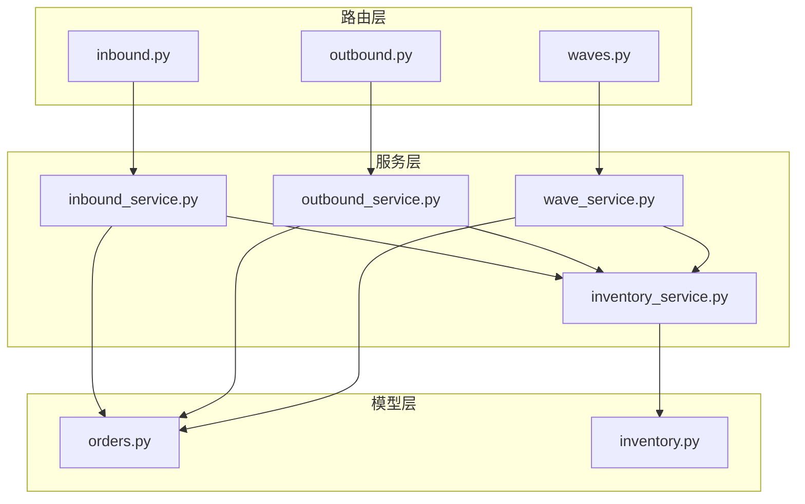
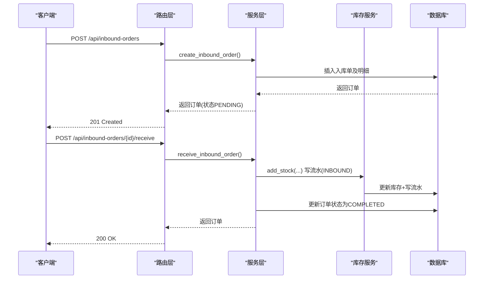
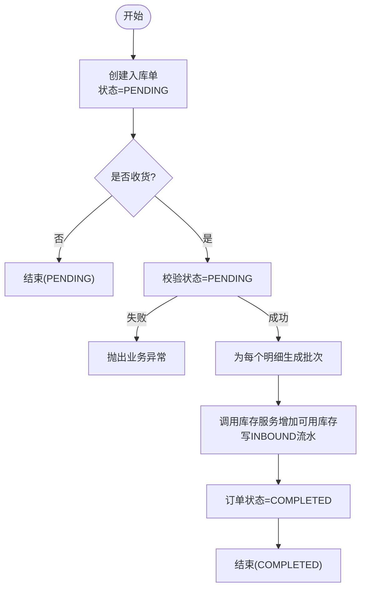
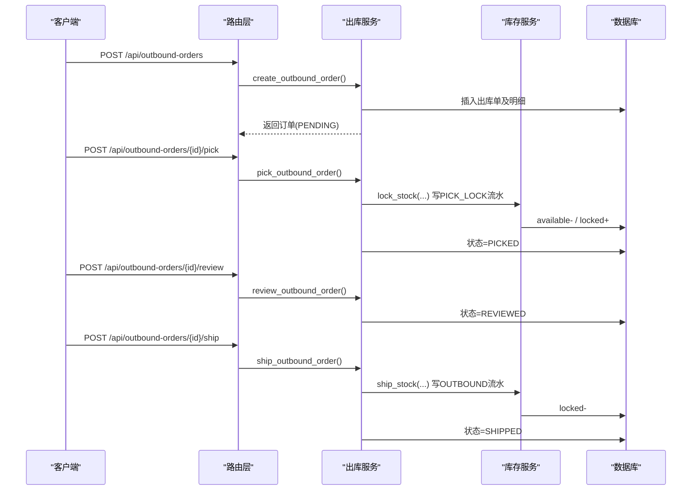
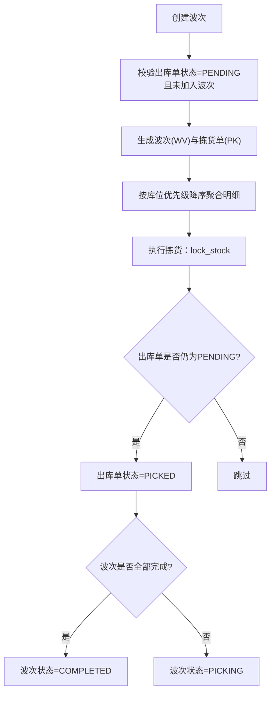
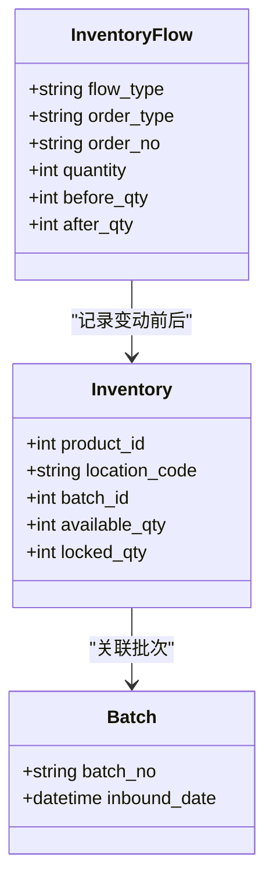
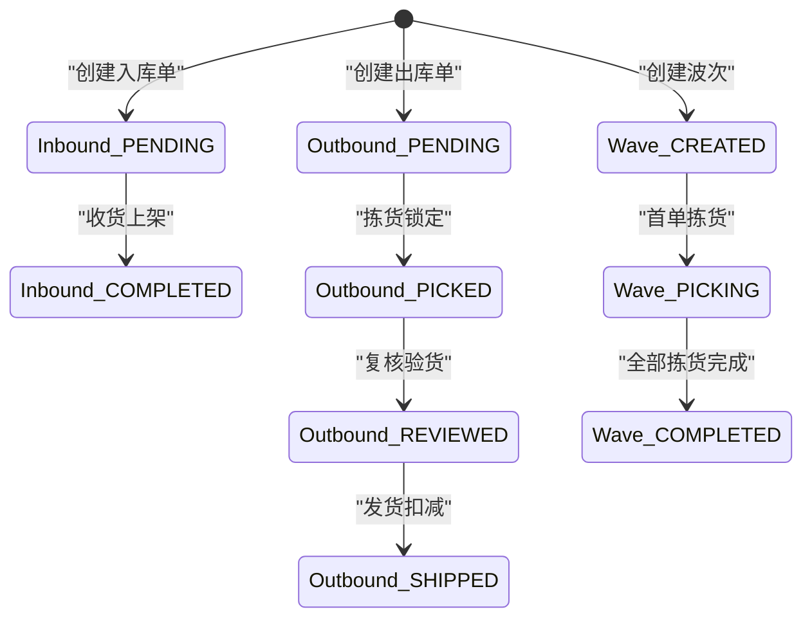
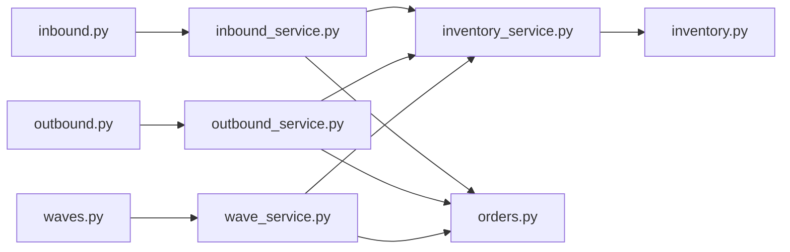

# 入库出库API

<cite>
**本文引用的文件**
- [inbound.py](file://backend-python/app/routers/inbound.py)
- [outbound.py](file://backend-python/app/routers/outbound.py)
- [waves.py](file://backend-python/app/routers/waves.py)
- [inbound_service.py](file://backend-python/app/services/inbound_service.py)
- [outbound_service.py](file://backend-python/app/services/outbound_service.py)
- [wave_service.py](file://backend-python/app/services/wave_service.py)
- [inventory_service.py](file://backend-python/app/services/inventory_service.py)
- [orders.py](file://backend-python/app/models/orders.py)
- [inventory.py](file://backend-python/app/models/inventory.py)
- [orders_schemas.py](file://backend-python/app/schemas/orders.py)
- [errors.py](file://backend-python/app/common/errors.py)
- [test_inbound_service.py](file://backend-python/tests/test_inbound_service.py)
- [test_outbound_service.py](file://backend-python/tests/test_outbound_service.py)
</cite>

## 目录
1. [简介](#简介)
2. [项目结构](#项目结构)
3. [核心组件](#核心组件)
4. [架构总览](#架构总览)
5. [详细组件分析](#详细组件分析)
6. [依赖关系分析](#依赖关系分析)
7. [性能与并发特性](#性能与并发特性)
8. [故障排查指南](#故障排查指南)
9. [结论](#结论)
10. [附录：API清单与示例](#附录api清单与示例)

## 简介
本文件面向WMS系统的入库与出库API，覆盖以下目标：
- 入库单创建、收货上架的状态流转接口（PENDING → COMPLETED）
- 出库单创建、拣货、复核、发货的状态流转接口（PENDING → PICKED → REVIEWED → SHIPPED）
- 波次拣货聚合多张出库单，生成拣货单并驱动库存锁定与状态推进
- 批次分配、库存扣减的原子性保证与全量可追溯
- 业务流程示例、状态机转换与异常处理机制

## 项目结构
后端采用FastAPI路由层 + Service服务层 + ORM模型层的分层设计。入库/出库/波次分别由独立路由与服务实现；库存变动统一通过库存服务完成，确保所有变更写流水、可审计、可追溯。

**图表来源**
- [inbound.py:1-45](file://backend-python/app/routers/inbound.py#L1-L45)
- [outbound.py:1-61](file://backend-python/app/routers/outbound.py#L1-L61)
- [waves.py:1-55](file://backend-python/app/routers/waves.py#L1-L55)
- [inbound_service.py:1-150](file://backend-python/app/services/inbound_service.py#L1-L150)
- [outbound_service.py:1-196](file://backend-python/app/services/outbound_service.py#L1-L196)
- [wave_service.py:1-238](file://backend-python/app/services/wave_service.py#L1-L238)
- [inventory_service.py:1-437](file://backend-python/app/services/inventory_service.py#L1-L437)
- [orders.py:1-300](file://backend-python/app/models/orders.py#L1-L300)
- [inventory.py:1-98](file://backend-python/app/models/inventory.py#L1-L98)

**章节来源**
- [inbound.py:1-45](file://backend-python/app/routers/inbound.py#L1-L45)
- [outbound.py:1-61](file://backend-python/app/routers/outbound.py#L1-L61)
- [waves.py:1-55](file://backend-python/app/routers/waves.py#L1-L55)

## 核心组件
- 入库服务：负责入库单创建与收货上架，收货时生成批次、累加可用库存并写流水。
- 出库服务：负责出库单创建、拣货锁定、复核、发货扣减，全程事务内回滚保障一致性。
- 波次服务：聚合多张待拣货出库单，生成拣货单并按库位优先级排序，执行拣货时驱动库存锁定与单据状态推进。
- 库存服务：提供统一的库存加减锁能力，强制写流水，支持跨批次扣减与并发安全。
- 数据模型：订单域（入库/出库/退货/移库/调整/盘点/波次/拣货）与库存域（批次/库存行/流水）。

**章节来源**
- [inbound_service.py:1-150](file://backend-python/app/services/inbound_service.py#L1-L150)
- [outbound_service.py:1-196](file://backend-python/app/services/outbound_service.py#L1-L196)
- [wave_service.py:1-238](file://backend-python/app/services/wave_service.py#L1-L238)
- [inventory_service.py:1-437](file://backend-python/app/services/inventory_service.py#L1-L437)
- [orders.py:1-300](file://backend-python/app/models/orders.py#L1-L300)
- [inventory.py:1-98](file://backend-python/app/models/inventory.py#L1-L98)

## 架构总览
系统以“路由→服务→模型”的分层组织业务逻辑，库存变动集中到库存服务，所有变更写入库存流水表，形成完整可追溯链。

**图表来源**
- [inbound.py:13-26](file://backend-python/app/routers/inbound.py#L13-L26)
- [inbound_service.py:38-129](file://backend-python/app/services/inbound_service.py#L38-L129)
- [inventory_service.py:75-88](file://backend-python/app/services/inventory_service.py#L75-L88)

## 详细组件分析

### 入库流程（收货→上架）
- 创建入库单：校验商品与库位存在，生成唯一单号，保存主从表，状态为PENDING，不改变库存。
- 收货上架：校验当前状态为PENDING，逐明细生成批次（批次号=单号-明细id），调用库存服务增加可用库存并写INBOUND流水，最后将订单状态置为COMPLETED。

**图表来源**
- [inbound_service.py:38-82](file://backend-python/app/services/inbound_service.py#L38-L82)
- [inbound_service.py:92-129](file://backend-python/app/services/inbound_service.py#L92-L129)
- [inventory_service.py:75-88](file://backend-python/app/services/inventory_service.py#L75-L88)

**章节来源**
- [inbound.py:13-26](file://backend-python/app/routers/inbound.py#L13-L26)
- [inbound_service.py:38-129](file://backend-python/app/services/inbound_service.py#L38-L129)
- [orders.py:17-48](file://backend-python/app/models/orders.py#L17-L48)
- [orders_schemas.py:11-39](file://backend-python/app/schemas/orders.py#L11-L39)

### 出库流程（拣货→复核→发货）
- 创建出库单：校验商品与库位存在，生成唯一单号，保存主从表，状态为PENDING，不改变库存。
- 拣货：校验状态为PENDING，聚合明细按(商品,库位)合并，调用库存服务lock_stock将available转为locked，防超卖；任一不足整单回滚。
- 复核：校验状态为PICKED，仅做数量核对，状态推进至REVIEWED。
- 发货：校验状态为REVIEWED，聚合明细调用库存服务ship_stock扣减locked，写OUTBOUND流水，状态推进至SHIPPED。

**图表来源**
- [outbound.py:13-42](file://backend-python/app/routers/outbound.py#L13-L42)
- [outbound_service.py:42-176](file://backend-python/app/services/outbound_service.py#L42-L176)
- [inventory_service.py:147-251](file://backend-python/app/services/inventory_service.py#L147-L251)

**章节来源**
- [outbound.py:13-42](file://backend-python/app/routers/outbound.py#L13-L42)
- [outbound_service.py:42-176](file://backend-python/app/services/outbound_service.py#L42-L176)
- [orders.py:50-81](file://backend-python/app/models/orders.py#L50-L81)
- [orders_schemas.py:43-69](file://backend-python/app/schemas/orders.py#L43-L69)

### 波次拣货（聚合多张出库单）
- 创建波次：选择若干PENDING状态的出库单，为每张出库单生成一张拣货单，明细按(商品,库位)聚合并按库位优先级降序排序，模拟最优拣货路径。
- 执行拣货：对拣货单逐项调用库存服务lock_stock锁定库存，成功后将对应出库单状态推进至PICKED；波次首单拣货进入PICKING，全部完成后进入COMPLETED。

**图表来源**
- [waves.py:13-48](file://backend-python/app/routers/waves.py#L13-L48)
- [wave_service.py:62-197](file://backend-python/app/services/wave_service.py#L62-L197)
- [orders.py:83-138](file://backend-python/app/models/orders.py#L83-L138)

**章节来源**
- [waves.py:13-48](file://backend-python/app/routers/waves.py#L13-L48)
- [wave_service.py:62-197](file://backend-python/app/services/wave_service.py#L62-L197)
- [orders.py:83-138](file://backend-python/app/models/orders.py#L83-L138)

### 批次分配与库存扣减
- 批次分配：入库收货时为每个明细生成批次（批次号=单号-明细id），用于有效期管理与追溯。
- 库存扣减：出库发货时按(商品,库位)维度扣减已锁定库存，支持跨批次扣减（先扣早期批次），并发下使用条件UPDATE与重读重试避免超卖。

**图表来源**
- [inventory.py:18-98](file://backend-python/app/models/inventory.py#L18-L98)
- [inventory_service.py:91-251](file://backend-python/app/services/inventory_service.py#L91-L251)

**章节来源**
- [inbound_service.py:104-124](file://backend-python/app/services/inbound_service.py#L104-L124)
- [inventory_service.py:91-251](file://backend-python/app/services/inventory_service.py#L91-L251)
- [inventory.py:18-98](file://backend-python/app/models/inventory.py#L18-L98)

### 状态机定义与约束
- 入库单：PENDING → COMPLETED（收货后生效）
- 出库单：PENDING → PICKED → REVIEWED → SHIPPED
- 波次：CREATED → PICKING → COMPLETED
- 拣货单：CREATED → PICKED

**图表来源**
- [orders.py:17-138](file://backend-python/app/models/orders.py#L17-L138)
- [inbound_service.py:13-15](file://backend-python/app/services/inbound_service.py#L13-L15)
- [outbound_service.py:16-19](file://backend-python/app/services/outbound_service.py#L16-L19)
- [wave_service.py:22-27](file://backend-python/app/services/wave_service.py#L22-L27)

**章节来源**
- [orders.py:17-138](file://backend-python/app/models/orders.py#L17-L138)
- [inbound_service.py:13-15](file://backend-python/app/services/inbound_service.py#L13-L15)
- [outbound_service.py:16-19](file://backend-python/app/services/outbound_service.py#L16-L19)
- [wave_service.py:22-27](file://backend-python/app/services/wave_service.py#L22-L27)

## 依赖关系分析
- 路由层依赖服务层进行业务编排，服务层依赖库存服务进行库存操作，所有库存操作均写流水。
- 模型层定义了订单域与库存域的实体关系，支撑状态机与追溯。
- 错误处理通过BusinessError携带HTTP状态码，由全局异常处理器统一响应。

**图表来源**
- [inbound.py:1-45](file://backend-python/app/routers/inbound.py#L1-L45)
- [outbound.py:1-61](file://backend-python/app/routers/outbound.py#L1-L61)
- [waves.py:1-55](file://backend-python/app/routers/waves.py#L1-L55)
- [inbound_service.py:1-150](file://backend-python/app/services/inbound_service.py#L1-L150)
- [outbound_service.py:1-196](file://backend-python/app/services/outbound_service.py#L1-L196)
- [wave_service.py:1-238](file://backend-python/app/services/wave_service.py#L1-L238)
- [inventory_service.py:1-437](file://backend-python/app/services/inventory_service.py#L1-L437)
- [orders.py:1-300](file://backend-python/app/models/orders.py#L1-L300)
- [inventory.py:1-98](file://backend-python/app/models/inventory.py#L1-L98)

**章节来源**
- [orders.py:1-300](file://backend-python/app/models/orders.py#L1-L300)
- [inventory.py:1-98](file://backend-python/app/models/inventory.py#L1-L98)
- [errors.py:1-9](file://backend-python/app/common/errors.py#L1-L9)

## 性能与并发特性
- 库存操作采用“总量预检 + 逐行条件UPDATE + 失败重读”的双保险策略，防止并发超卖；在PostgreSQL下配合FOR UPDATE行锁，SQLite下亦能避免陈旧读覆盖。
- 列表查询使用joinedload一次性加载关联数据，避免N+1问题。
- 批量聚合同一(商品,库位)的明细，减少重复库存操作次数。
- 库存流水记录before/after数量，便于对账与审计。

[本节为通用性能讨论，无需特定文件引用]

## 故障排查指南
- 常见业务异常：
  - 商品或库位不存在：创建订单时报错，状态码404，无副作用。
  - 重复收货：已完成的入库单再次收货报错，状态码400。
  - 库存不足：拣货或发货时报错，状态码409，整单回滚不留半成品。
  - 状态不允许：如未拣货直接发货、未复核直接发货等，抛出业务异常。
- 定位方法：
  - 查看库存流水表，按order_no过滤，确认各阶段流水是否完整。
  - 检查订单状态机是否符合预期，结合测试用例验证边界情况。

**章节来源**
- [errors.py:1-9](file://backend-python/app/common/errors.py#L1-L9)
- [test_inbound_service.py:26-96](file://backend-python/tests/test_inbound_service.py#L26-L96)
- [test_outbound_service.py:42-200](file://backend-python/tests/test_outbound_service.py#L42-L200)

## 结论
本WMS系统的入库出库API通过清晰的状态机设计与集中的库存服务，实现了：
- 入库收货生成批次、累加库存并写流水
- 出库拣货锁定、复核、发货扣减的完整闭环
- 波次拣货聚合多单、优化拣货路径与状态推进
- 并发安全的库存扣减与全量可追溯的流水记录
这些特性共同保障了库存变动的原子性与业务流程的可追溯性。

[本节为总结性内容，无需特定文件引用]

## 附录：API清单与示例

### 入库单API
- 创建入库单
  - 方法：POST
  - 路径：/api/inbound-orders
  - 请求体：包含供应商名称、明细列表（商品ID、数量、目标库位）、备注
  - 响应：返回订单信息（含状态PENDING）
- 收货上架
  - 方法：POST
  - 路径：/api/inbound-orders/{order_id}/receive
  - 响应：返回订单信息（状态COMPLETED，批次与库存已更新）
- 查询入库单
  - 方法：GET
  - 路径：/api/inbound-orders
  - 参数：status、page、pageSize
  - 响应：分页列表

**章节来源**
- [inbound.py:13-44](file://backend-python/app/routers/inbound.py#L13-L44)
- [orders_schemas.py:11-39](file://backend-python/app/schemas/orders.py#L11-L39)

### 出库单API
- 创建出库单
  - 方法：POST
  - 路径：/api/outbound-orders
  - 请求体：包含客户名称、明细列表（商品ID、数量、目标库位）、备注
  - 响应：返回订单信息（状态PENDING）
- 拣货
  - 方法：POST
  - 路径：/api/outbound-orders/{order_id}/pick
  - 响应：返回订单信息（状态PICKED，库存已锁定）
- 复核
  - 方法：POST
  - 路径：/api/outbound-orders/{order_id}/review
  - 响应：返回订单信息（状态REVIEWED）
- 发货
  - 方法：POST
  - 路径：/api/outbound-orders/{order_id}/ship
  - 响应：返回订单信息（状态SHIPPED，库存已扣减）
- 查询出库单
  - 方法：GET
  - 路径：/api/outbound-orders
  - 参数：status、page、pageSize
  - 响应：分页列表

**章节来源**
- [outbound.py:13-60](file://backend-python/app/routers/outbound.py#L13-L60)
- [orders_schemas.py:43-69](file://backend-python/app/schemas/orders.py#L43-L69)

### 波次拣货API
- 创建波次
  - 方法：POST
  - 路径：/api/waves
  - 请求体：包含待聚合的PENDING出库单ID列表、备注
  - 响应：返回波次信息（含拣货单列表）
- 查询波次
  - 方法：GET
  - 路径：/api/waves
  - 参数：status、page、pageSize
  - 响应：分页列表
- 查询拣货单
  - 方法：GET
  - 路径：/api/waves/picking-orders
  - 参数：waveId、status、page、pageSize
  - 响应：分页列表
- 执行拣货
  - 方法：POST
  - 路径：/api/waves/picking-orders/{picking_id}/pick
  - 响应：返回拣货单信息（状态PICKED，出库单同步PICKED）

**章节来源**
- [waves.py:13-54](file://backend-python/app/routers/waves.py#L13-L54)
- [orders_schemas.py:112-115](file://backend-python/app/schemas/orders.py#L112-L115)

### 业务流程示例
- 入库流程示例：
  - 创建入库单（PENDING）→ 收货上架（COMPLETED，生成批次、累加库存、写INBOUND流水）
- 出库流程示例：
  - 创建出库单（PENDING）→ 拣货（PICKED，available→locked，写PICK_LOCK流水）→ 复核（REVIEWED）→ 发货（SHIPPED，locked扣减，写OUTBOUND流水）
- 波次拣货示例：
  - 选择多张PENDING出库单创建波次 → 生成拣货单 → 执行拣货锁定库存 → 出库单状态推进至PICKED → 波次全部完成后状态COMPLETED

**章节来源**
- [test_inbound_service.py:26-96](file://backend-python/tests/test_inbound_service.py#L26-L96)
- [test_outbound_service.py:42-200](file://backend-python/tests/test_outbound_service.py#L42-L200)
- [wave_service.py:62-197](file://backend-python/app/services/wave_service.py#L62-L197)