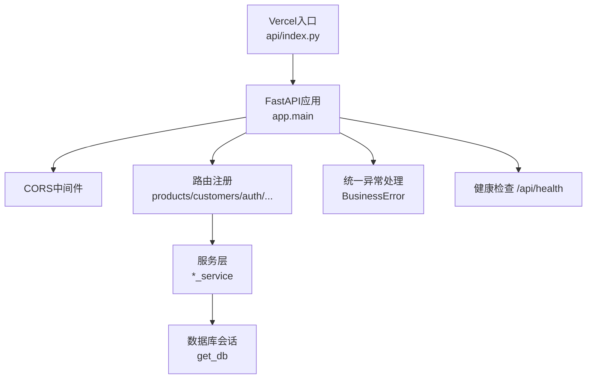
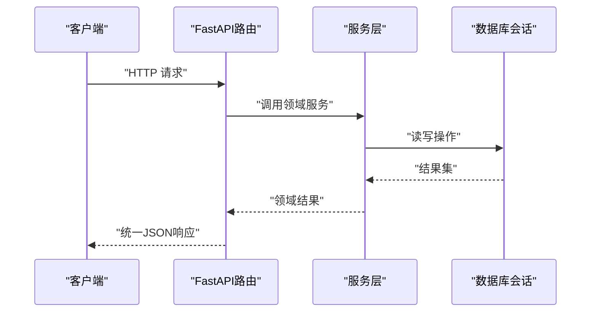
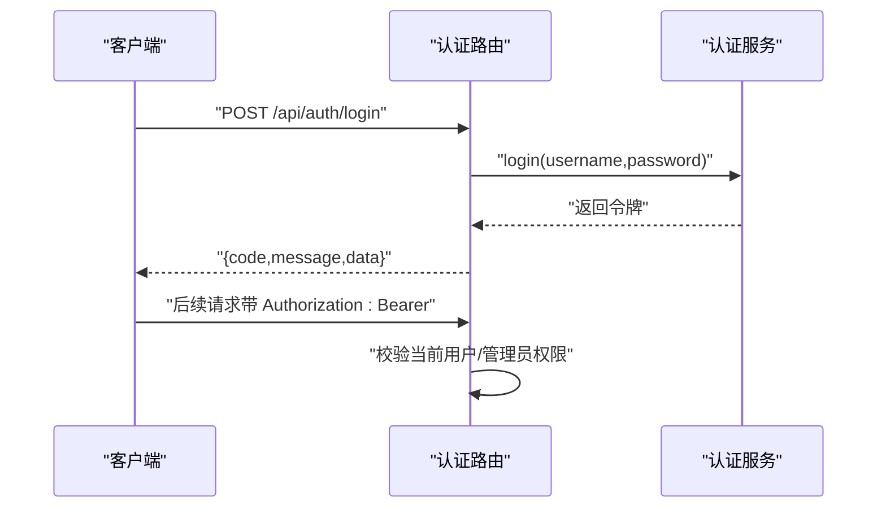
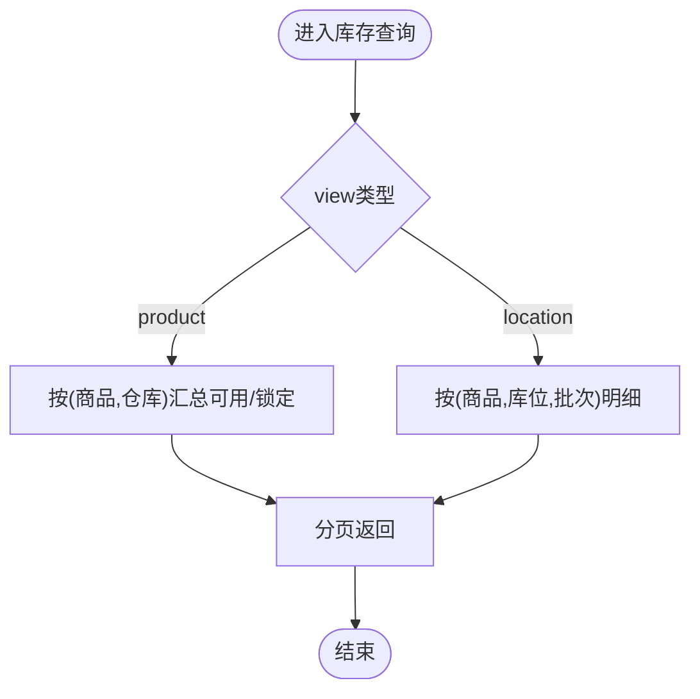
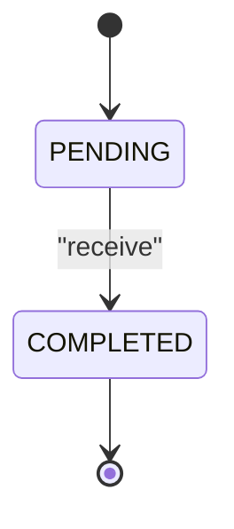
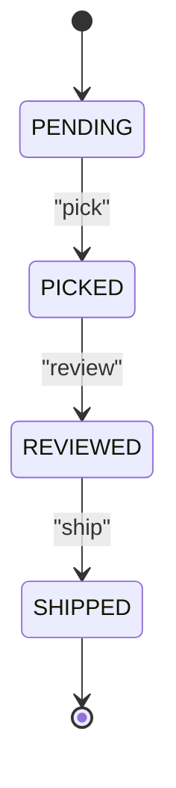
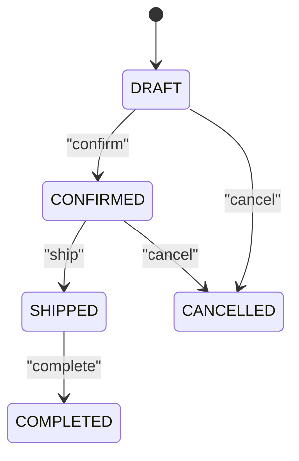
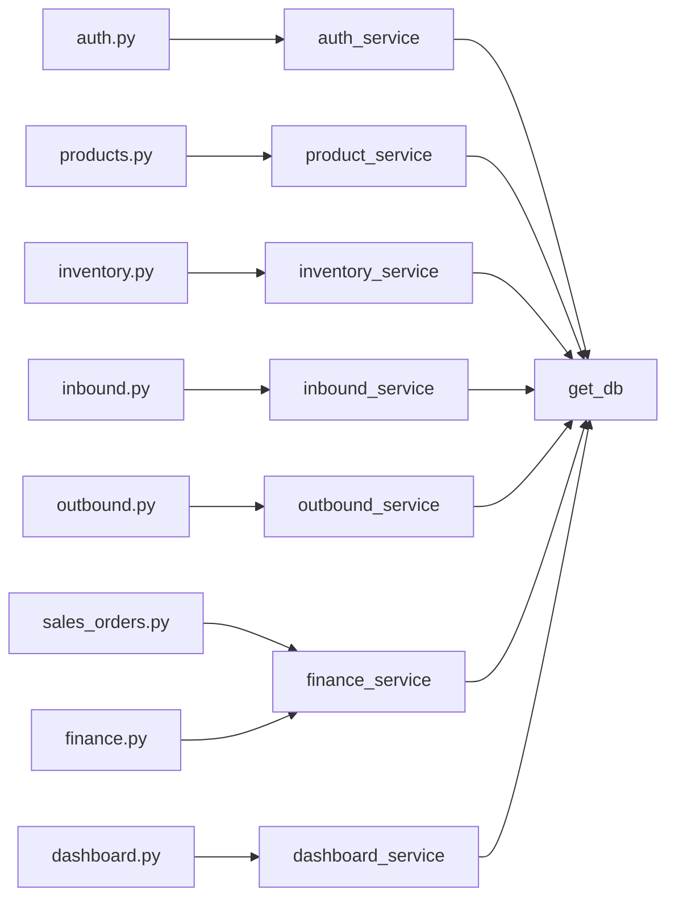

# 后端API文档

<cite>
**本文引用的文件**
- [backend-python/app/main.py](file://backend-python/app/main.py)
- [backend-python/api/index.py](file://backend-python/api/index.py)
- [backend-python/app/routers/auth.py](file://backend-python/app/routers/auth.py)
- [backend-python/app/routers/products.py](file://backend-python/app/routers/products.py)
- [backend-python/app/routers/customers.py](file://backend-python/app/routers/customers.py)
- [backend-python/app/routers/warehouses.py](file://backend-python/app/routers/warehouses.py)
- [backend-python/app/routers/inventory.py](file://backend-python/app/routers/inventory.py)
- [backend-python/app/routers/inbound.py](file://backend-python/app/routers/inbound.py)
- [backend-python/app/routers/outbound.py](file://backend-python/app/routers/outbound.py)
- [backend-python/app/routers/transfers.py](file://backend-python/app/routers/transfers.py)
- [backend-python/app/routers/returns.py](file://backend-python/app/routers/returns.py)
- [backend-python/app/routers/waves.py](file://backend-python/app/routers/waves.py)
- [backend-python/app/routers/sales_orders.py](file://backend-python/app/routers/sales_orders.py)
- [backend-python/app/routers/finance.py](file://backend-python/app/routers/finance.py)
- [backend-python/app/routers/dashboard.py](file://backend-python/app/routers/dashboard.py)
</cite>

## 目录
1. [简介](#简介)
2. [项目结构](#项目结构)
3. [核心组件](#核心组件)
4. [架构总览](#架构总览)
5. [详细接口说明](#详细接口说明)
6. [依赖关系分析](#依赖关系分析)
7. [性能与并发](#性能与并发)
8. [错误处理与调试](#错误处理与调试)
9. [安全与速率限制](#安全与速率限制)
10. [版本与兼容性](#版本与兼容性)
11. [结论](#结论)

## 简介
本文件为WMS系统（进销存+业财一体化）的后端RESTful API完整文档。覆盖认证、商品管理、客户管理、仓库库区库位、库存查询与流水、入库出库、退货、移库调整、波次拣货、销售订单、财务应收与收款核销、数据看板等模块。文档包含HTTP方法、URL模式、请求/响应约定、认证方式、常见用例、错误处理策略、幂等性与并发安全说明，以及调试与监控建议。

## 项目结构
后端基于FastAPI构建，采用路由分层组织：
- 应用入口与生命周期：启动时建表并初始化示例数据；提供健康检查与健康探针。
- 路由层：按业务域划分多个router（认证、商品、客户、仓库、库存、入库、出库、退货、移库调整、波次、销售订单、财务、看板）。
- 服务层：封装领域逻辑（如库存扣减、锁定、状态机流转、财务记账）。
- 数据模型与Schema：定义ORM模型与请求/响应数据结构。
- Serverless适配：通过Mangum将FastAPI应用包装为Vercel函数入口。

**图表来源**
- [backend-python/app/main.py:16-85](file://backend-python/app/main.py#L16-L85)
- [backend-python/api/index.py:1-19](file://backend-python/api/index.py#L1-L19)

**章节来源**
- [backend-python/app/main.py:16-85](file://backend-python/app/main.py#L16-L85)
- [backend-python/api/index.py:1-19](file://backend-python/api/index.py#L1-L19)

## 核心组件
- 认证与会话：登录、登出、当前用户、用户管理（管理员权限）。
- 基础主数据：商品、客户、仓库/库区/库位。
- 库存能力：库存查询（按商品或库位）、批次、全量流水。
- 出入库作业：入库收货、出库拣货/复核/发货、退货处理、移库与调整。
- 波次拣货：智能波次生成与拣货执行。
- 业财一体：销售订单（草稿→确认→发货→完成/作废），应收台账、账龄、收款登记与核销。
- 数据看板：首页汇总统计。

**章节来源**
- [backend-python/app/routers/auth.py:14-68](file://backend-python/app/routers/auth.py#L14-L68)
- [backend-python/app/routers/products.py:10-47](file://backend-python/app/routers/products.py#L10-L47)
- [backend-python/app/routers/customers.py:10-47](file://backend-python/app/routers/customers.py#L10-L47)
- [backend-python/app/routers/warehouses.py:10-56](file://backend-python/app/routers/warehouses.py#L10-L56)
- [backend-python/app/routers/inventory.py:1-62](file://backend-python/app/routers/inventory.py#L1-L62)
- [backend-python/app/routers/inbound.py:1-45](file://backend-python/app/routers/inbound.py#L1-L45)
- [backend-python/app/routers/outbound.py:1-61](file://backend-python/app/routers/outbound.py#L1-L61)
- [backend-python/app/routers/transfers.py:1-47](file://backend-python/app/routers/transfers.py#L1-L47)
- [backend-python/app/routers/returns.py:1-48](file://backend-python/app/routers/returns.py#L1-L48)
- [backend-python/app/routers/waves.py:1-55](file://backend-python/app/routers/waves.py#L1-L55)
- [backend-python/app/routers/sales_orders.py:1-81](file://backend-python/app/routers/sales_orders.py#L1-L81)
- [backend-python/app/routers/finance.py:1-60](file://backend-python/app/routers/finance.py#L1-L60)
- [backend-python/app/routers/dashboard.py:1-15](file://backend-python/app/routers/dashboard.py#L1-L15)

## 架构总览
整体调用链：客户端 → FastAPI路由 → 服务层 → 数据库会话 → 返回统一JSON格式。统一异常处理器将业务异常转换为标准响应体。

**图表来源**
- [backend-python/app/main.py:35-51](file://backend-python/app/main.py#L35-L51)
- [backend-python/app/routers/auth.py:14-33](file://backend-python/app/routers/auth.py#L14-L33)

## 详细接口说明

### 通用约定
- 基础路径：所有接口以 `/api` 为前缀（部分路由使用prefix组合）。
- 统一响应体：
  - 成功：`{code: 数字, message: 字符串, data: 任意}`
  - 失败：`{detail: 字符串, message: 字符串, data: null}`（由业务异常处理器输出）
- 分页参数：`page`（默认1）、`pageSize`（别名page_size，默认20，范围1-100）。
- 认证：除登录/登出/健康检查外，多数接口需要携带 `Authorization: Bearer <token>`。
- 版本：应用版本在健康检查中返回，便于客户端兼容判断。

**章节来源**
- [backend-python/app/main.py:35-85](file://backend-python/app/main.py#L35-L85)
- [backend-python/app/routers/auth.py:14-33](file://backend-python/app/routers/auth.py#L14-L33)

### 认证模块
- POST `/api/auth/login`：登录，返回令牌。
- POST `/api/auth/logout`：退出登录，使当前token失效。
- GET `/api/auth/me`：获取当前用户信息。
- GET `/api/users`：用户列表（仅admin）。
- POST `/api/users`：创建用户（仅admin）。
- PUT `/api/users/{user_id}`：更新用户（仅admin）。
- DELETE `/api/users/{user_id}`：删除用户（仅admin）。

认证流程时序：

**图表来源**
- [backend-python/app/routers/auth.py:14-33](file://backend-python/app/routers/auth.py#L14-L33)

**章节来源**
- [backend-python/app/routers/auth.py:14-68](file://backend-python/app/routers/auth.py#L14-L68)

### 商品管理
- GET `/api/products`：商品列表（支持keyword、分页）。
- GET `/api/products/{product_id}`：商品详情。
- POST `/api/products`：创建商品。
- PUT `/api/products/{product_id}`：更新商品。
- DELETE `/api/products/{product_id}`：删除商品（有库存则拒绝）。

**章节来源**
- [backend-python/app/routers/products.py:10-47](file://backend-python/app/routers/products.py#L10-L47)

### 客户管理
- GET `/api/customers`：客户列表（支持keyword、分页）。
- GET `/api/customers/{customer_id}`：客户详情。
- POST `/api/customers`：创建客户。
- PUT `/api/customers/{customer_id}`：更新客户。
- DELETE `/api/customers/{customer_id}`：软删除客户。

**章节来源**
- [backend-python/app/routers/customers.py:10-47](file://backend-python/app/routers/customers.py#L10-L47)

### 仓库/库区/库位
- 仓库：GET `/api/warehouses`、POST `/api/warehouses`
- 库区：GET `/api/zones`（可过滤warehouseId）、POST `/api/zones`
- 库位：GET `/api/locations`（可过滤warehouseId/zoneId）、POST `/api/locations`

**章节来源**
- [backend-python/app/routers/warehouses.py:10-56](file://backend-python/app/routers/warehouses.py#L10-L56)

### 库存查询与流水
- GET `/api/inventory`：库存查询
  - 参数：view=product|location、keyword、warehouseId、batchNo、page、pageSize
- GET `/api/inventory/flows`：库存流水（可按orderNo、productId、locationCode、flowType筛选）
- GET `/api/inventory/batches`：批次列表（支持keyword、分页）

库存查询流程图：

**图表来源**
- [backend-python/app/routers/inventory.py:12-31](file://backend-python/app/routers/inventory.py#L12-L31)

**章节来源**
- [backend-python/app/routers/inventory.py:1-62](file://backend-python/app/routers/inventory.py#L1-L62)

### 入库单
- POST `/api/inbound-orders`：创建入库单（PENDING，不改变库存）
- POST `/api/inbound-orders/{order_id}/receive`：收货上架（PENDING→COMPLETED，累加库存、生成批次、写流水）
- GET `/api/inbound-orders`：入库单列表（支持status、分页）
- GET `/api/inbound-orders/{order_id}`：入库单详情

入库状态机：

**图表来源**
- [backend-python/app/routers/inbound.py:13-27](file://backend-python/app/routers/inbound.py#L13-L27)

**章节来源**
- [backend-python/app/routers/inbound.py:1-45](file://backend-python/app/routers/inbound.py#L1-L45)

### 出库单
- POST `/api/outbound-orders`：创建出库单（PENDING，不改变库存）
- POST `/api/outbound-orders/{order_id}/pick`：拣货（PENDING→PICKED，锁定库存防超卖）
- POST `/api/outbound-orders/{order_id}/review`：复核验货（PICKED→REVIEWED）
- POST `/api/outbound-orders/{order_id}/ship`：发货（REVIEWED→SHIPPED，扣减锁定库存）
- GET `/api/outbound-orders`：出库单列表（支持status、分页）
- GET `/api/outbound-orders/{order_id}`：出库单详情

出库状态机：

**图表来源**
- [backend-python/app/routers/outbound.py:13-42](file://backend-python/app/routers/outbound.py#L13-L42)

**章节来源**
- [backend-python/app/routers/outbound.py:1-61](file://backend-python/app/routers/outbound.py#L1-L61)

### 退货管理
- POST `/api/returns`：创建退货单
- POST `/api/returns/{order_id}/receive`：收货登记（正品/换标累加库存，报废只登记）
- POST `/api/returns/{order_id}/finish`：处理完成
- GET `/api/returns`：退货单列表（支持status、分页）
- GET `/api/returns/{order_id}`：退货单详情

**章节来源**
- [backend-python/app/routers/returns.py:1-48](file://backend-python/app/routers/returns.py#L1-L48)

### 移库与库存调整
- 移库：POST `/api/transfers`、GET `/api/transfers`
- 调整：POST `/api/adjustments`、GET `/api/adjustments`

**章节来源**
- [backend-python/app/routers/transfers.py:1-47](file://backend-python/app/routers/transfers.py#L1-L47)

### 波次拣货
- POST `/api/waves`：创建波次（传入出库单ID集合）
- GET `/api/waves`：波次列表（支持status、分页）
- GET `/api/waves/picking-orders`：拣货任务列表（支持waveId、status、分页）
- POST `/api/waves/picking-orders/{picking_id}/pick`：执行拣货（锁定库存，出库单进入PICKED）
- GET `/api/waves/{wave_id}`：波次详情

**章节来源**
- [backend-python/app/routers/waves.py:1-55](file://backend-python/app/routers/waves.py#L1-L55)

### 销售订单
- POST `/api/sales-orders`：创建销售订单（草稿，金额由明细汇总）
- GET `/api/sales-orders`：列表（支持status、customerId、keyword、分页）
- GET `/api/sales-orders/{order_id}`：详情
- PUT `/api/sales-orders/{order_id}`：编辑订单（仅草稿，改账期/备注/明细并重算金额）
- POST `/api/sales-orders/{order_id}/confirm`：确认订单
- POST `/api/sales-orders/{order_id}/ship`：发货（已确认→已发货，自动生成应收，幂等）
- POST `/api/sales-orders/{order_id}/complete`：完成订单
- POST `/api/sales-orders/{order_id}/cancel`：作废订单

销售订单状态机：

**图表来源**
- [backend-python/app/routers/sales_orders.py:13-81](file://backend-python/app/routers/sales_orders.py#L13-L81)

**章节来源**
- [backend-python/app/routers/sales_orders.py:1-81](file://backend-python/app/routers/sales_orders.py#L1-L81)

### 财务（应收与收款）
- GET `/api/finance/receivables`：应收/应付台账（支持partnerName、status、onlyOutstanding、onlyOverdue、分页）
- GET `/api/finance/aging`：账龄分布（以到期日为基准）
- POST `/api/finance/receipts`：登记收款并可核销（到账金额可大于核销金额，差额为预收余额）
- POST `/api/finance/receipts/{receipt_id}/allocate`：继续核销到其他应收
- DELETE `/api/finance/receivables/{entry_id}`：删除应收流水（已有核销记录时禁止）

**章节来源**
- [backend-python/app/routers/finance.py:1-60](file://backend-python/app/routers/finance.py#L1-L60)

### 数据看板
- GET `/api/dashboard/summary`：首页统计汇总

**章节来源**
- [backend-python/app/routers/dashboard.py:1-15](file://backend-python/app/routers/dashboard.py#L1-L15)

## 依赖关系分析
- 路由与服务解耦：每个router仅负责参数解析与响应组装，核心逻辑下沉至对应service。
- 数据库访问：通过统一的get_db注入Session，保证事务边界在服务层控制。
- 认证依赖：多数路由通过Depends(get_current_user)强制鉴权；管理员操作额外require_admin。
- 异常处理：BusinessError被全局捕获并转为统一JSON格式。

**图表来源**
- [backend-python/app/routers/auth.py:1-11](file://backend-python/app/routers/auth.py#L1-L11)
- [backend-python/app/routers/products.py:1-10](file://backend-python/app/routers/products.py#L1-L10)
- [backend-python/app/routers/inventory.py:1-10](file://backend-python/app/routers/inventory.py#L1-L10)
- [backend-python/app/routers/inbound.py:1-10](file://backend-python/app/routers/inbound.py#L1-L10)
- [backend-python/app/routers/outbound.py:1-10](file://backend-python/app/routers/outbound.py#L1-L10)
- [backend-python/app/routers/sales_orders.py:1-10](file://backend-python/app/routers/sales_orders.py#L1-L10)
- [backend-python/app/routers/finance.py:1-10](file://backend-python/app/routers/finance.py#L1-L10)
- [backend-python/app/routers/dashboard.py:1-9](file://backend-python/app/routers/dashboard.py#L1-L9)

**章节来源**
- [backend-python/app/main.py:53-69](file://backend-python/app/main.py#L53-L69)

## 性能与并发
- 库存锁定与扣减：出库拣货阶段锁定库存，避免超卖；发货阶段扣减锁定库存。建议在高峰时段对高并发拣货接口进行限流与重试控制。
- 分页查询：所有列表接口均支持分页，建议前端合理设置pageSize（最大100），避免大页查询。
- 缓存建议：库存查询与看板汇总可考虑引入缓存层（如Redis）以降低热点查询压力。
- 数据库索引：确保常用查询字段（如order_no、product_id、location_code、flow_type、status）具备合适索引以提升检索性能。
- 批处理：大批量入库/出库建议分批提交，减少单次事务大小。

[本节为通用指导，无需特定文件引用]

## 错误处理与调试
- 统一错误格式：业务异常抛出BusinessError后，全局处理器返回`{detail,message,data:null}`。
- 健康检查：GET `/api/health`用于存活探针与冷启动预热，返回应用版本。
- 调试工具：
  - OpenAPI文档：访问 `/docs` 查看自动生成的接口文档与在线测试。
  - 日志：在服务层添加关键步骤日志，结合外部日志收集平台定位问题。
  - 压测：对高频接口（如库存查询、出库拣货）进行压测，观察数据库连接池与慢查询。

**章节来源**
- [backend-python/app/main.py:35-85](file://backend-python/app/main.py#L35-L85)

## 安全与速率限制
- 认证：除登录/登出/健康检查外，其他接口需携带`Authorization: Bearer <token>`。管理员接口需具备管理员角色。
- CORS：允许跨域，生产环境建议收紧allow_origins与allow_headers。
- 速率限制：当前未内置限流，建议在网关层（如Nginx/API Gateway）配置IP/用户维度限流，防止滥用。
- 输入校验：利用Pydantic Schema进行请求体验证，避免非法输入导致异常。

**章节来源**
- [backend-python/app/main.py:44-51](file://backend-python/app/main.py#L44-L51)
- [backend-python/app/routers/auth.py:14-68](file://backend-python/app/routers/auth.py#L14-L68)

## 版本与兼容性
- 版本标识：健康检查返回应用版本，便于客户端做兼容判断。
- 向后兼容：新增字段建议保持可选；废弃字段保留一段时间并提供迁移提示。
- 变更策略：重大变更通过版本号升级（如/v1、/v2），旧版本保留过渡期。

**章节来源**
- [backend-python/app/main.py:27-32](file://backend-python/app/main.py#L27-L32)
- [backend-python/app/main.py:77-85](file://backend-python/app/main.py#L77-L85)

## 结论
本API文档覆盖了WMS系统的核心业务流程与接口规范，明确了认证、数据模型、状态机、错误处理与安全策略。建议在生产环境中结合网关限流、缓存与监控体系，保障高并发下的稳定性与可观测性。对于复杂场景（如波次拣货、财务核销），应严格遵循状态机与事务边界，确保数据一致性与幂等性。