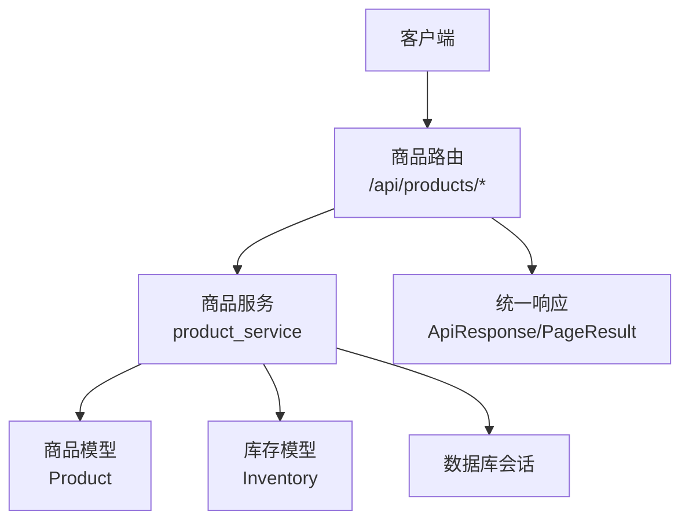
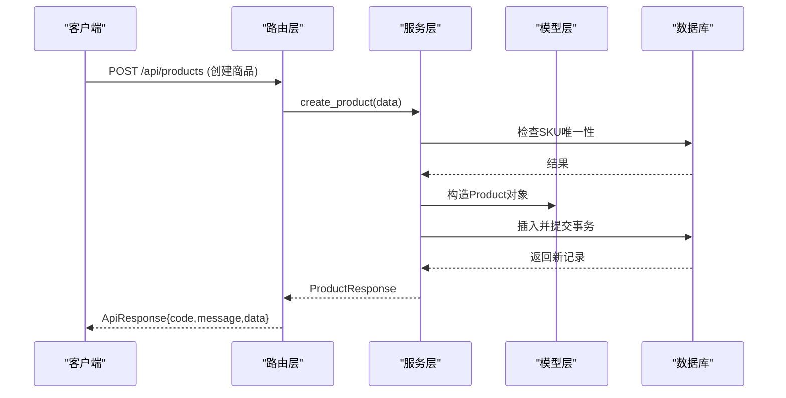
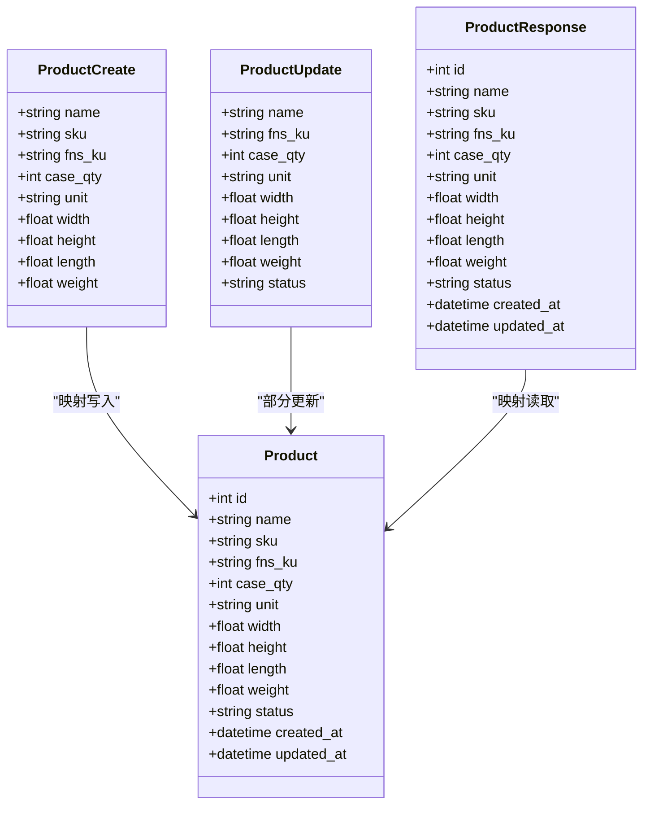
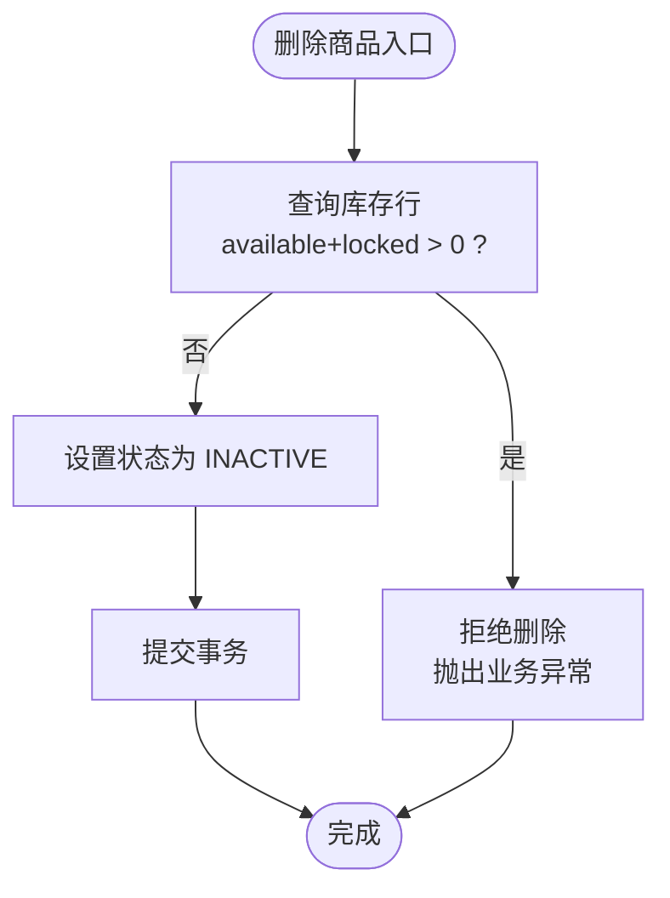
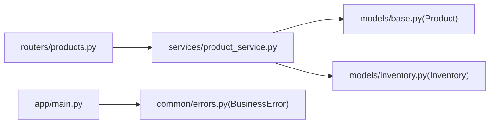

# 商品管理API

<cite>
**本文引用的文件**
- [backend-python/app/routers/products.py](file://backend-python/app/routers/products.py)
- [backend-python/app/services/product_service.py](file://backend-python/app/services/product_service.py)
- [backend-python/app/models/base.py](file://backend-python/app/models/base.py)
- [backend-python/app/schemas/base.py](file://backend-python/app/schemas/base.py)
- [backend-python/app/models/inventory.py](file://backend-python/app/models/inventory.py)
- [backend-python/app/common/errors.py](file://backend-python/app/common/errors.py)
- [backend-python/app/main.py](file://backend-python/app/main.py)
</cite>

## 目录
1. [简介](#简介)
2. [项目结构](#项目结构)
3. [核心组件](#核心组件)
4. [架构总览](#架构总览)
5. [详细组件分析](#详细组件分析)
6. [依赖关系分析](#依赖关系分析)
7. [性能考虑](#性能考虑)
8. [故障排查指南](#故障排查指南)
9. [结论](#结论)
10. [附录：接口契约与示例](#附录接口契约与示例)

## 简介
本文件为WMS系统“商品管理”模块的API文档，覆盖商品的CRUD操作（创建、查询、更新、删除），并说明商品字段定义、验证规则与业务约束。重点阐述商品与库存的关联关系及数据一致性保证策略，提供请求/响应格式约定与错误处理机制。

## 项目结构
后端采用FastAPI分层架构：路由层负责HTTP接口定义，服务层封装业务逻辑，模型层定义数据库表结构，Schema层定义输入输出校验。商品相关代码主要分布在以下位置：
- 路由：backend-python/app/routers/products.py
- 服务：backend-python/app/services/product_service.py
- 模型：backend-python/app/models/base.py（Product）、backend-python/app/models/inventory.py（Inventory）
- Schema：backend-python/app/schemas/base.py（ProductCreate/Update/Response）
- 异常与全局处理：backend-python/app/common/errors.py、backend-python/app/main.py

图表来源
- [backend-python/app/routers/products.py:1-47](file://backend-python/app/routers/products.py#L1-L47)
- [backend-python/app/services/product_service.py:1-69](file://backend-python/app/services/product_service.py#L1-L69)
- [backend-python/app/models/base.py:14-36](file://backend-python/app/models/base.py#L14-L36)
- [backend-python/app/models/inventory.py:33-61](file://backend-python/app/models/inventory.py#L33-L61)

章节来源
- [backend-python/app/routers/products.py:1-47](file://backend-python/app/routers/products.py#L1-L47)
- [backend-python/app/services/product_service.py:1-69](file://backend-python/app/services/product_service.py#L1-L69)
- [backend-python/app/models/base.py:14-36](file://backend-python/app/models/base.py#L14-L36)
- [backend-python/app/models/inventory.py:33-61](file://backend-python/app/models/inventory.py#L33-L61)

## 核心组件
- 路由层：暴露 /api/products 下的列表、详情、创建、更新、删除接口，统一返回 ApiResponse 包装体。
- 服务层：实现商品查询、创建、更新、删除的业务逻辑，包含SKU唯一性校验、软删除与库存联动校验。
- 模型层：Product 表定义商品主数据；Inventory 表定义库存行（可用量+锁定量）。
- Schema层：ProductCreate/ProductUpdate/ProductResponse 定义字段与校验规则，统一camelCase序列化。
- 异常处理：BusinessError 由全局异常处理器转换为JSON响应。

章节来源
- [backend-python/app/routers/products.py:1-47](file://backend-python/app/routers/products.py#L1-L47)
- [backend-python/app/services/product_service.py:1-69](file://backend-python/app/services/product_service.py#L1-L69)
- [backend-python/app/schemas/base.py:39-77](file://backend-python/app/schemas/base.py#L39-L77)
- [backend-python/app/common/errors.py:1-9](file://backend-python/app/common/errors.py#L1-L9)
- [backend-python/app/main.py:35-41](file://backend-python/app/main.py#L35-L41)

## 架构总览
商品管理的调用链路如下：
- 客户端发起HTTP请求到 /api/products/*
- FastAPI路由解析参数并调用对应服务方法
- 服务层进行业务校验（如SKU唯一性、库存存在性）
- 通过SQLAlchemy ORM访问数据库，读写Product/Inventory
- 返回统一ApiResponse结构

图表来源
- [backend-python/app/routers/products.py:30-33](file://backend-python/app/routers/products.py#L30-L33)
- [backend-python/app/services/product_service.py:32-39](file://backend-python/app/services/product_service.py#L32-L39)
- [backend-python/app/models/base.py:14-36](file://backend-python/app/models/base.py#L14-L36)

## 详细组件分析

### 商品数据模型与Schema
- 商品模型（Product）
  - 关键字段：id、name、sku（唯一索引）、fns_ku（可选）、case_qty（箱规）、unit（单位）、width/height/length/weight（尺寸重量）、status（ACTIVE/INACTIVE）、created_at/updated_at
- 商品Schema
  - ProductCreate：必填 name、sku；可选 fns_ku、case_qty≥1、unit≤20字符；尺寸重量≥0
  - ProductUpdate：可部分更新 name、fns_ku、case_qty≥1、unit≤20字符；尺寸重量≥0；status
  - ProductResponse：完整字段返回，含时间戳

图表来源
- [backend-python/app/models/base.py:14-36](file://backend-python/app/models/base.py#L14-L36)
- [backend-python/app/schemas/base.py:39-77](file://backend-python/app/schemas/base.py#L39-L77)

章节来源
- [backend-python/app/models/base.py:14-36](file://backend-python/app/models/base.py#L14-L36)
- [backend-python/app/schemas/base.py:39-77](file://backend-python/app/schemas/base.py#L39-L77)

### 商品API接口清单
- 列表查询
  - GET /api/products?keyword=&page=1&pageSize=20
  - 支持按商品名或SKU模糊搜索，分页返回 PageResult
- 获取详情
  - GET /api/products/{product_id}
- 创建商品
  - POST /api/products
  - 请求体：ProductCreate
  - 校验：SKU唯一性
- 更新商品
  - PUT /api/products/{product_id}
  - 请求体：ProductUpdate（仅更新传入字段）
- 删除商品
  - DELETE /api/products/{product_id}
  - 业务约束：若该商品仍有库存（available+locked > 0），拒绝删除；否则将状态置为 INACTIVE（软删除）

章节来源
- [backend-python/app/routers/products.py:13-46](file://backend-python/app/routers/products.py#L13-L46)
- [backend-python/app/services/product_service.py:9-69](file://backend-python/app/services/product_service.py#L9-L69)

### 商品与库存关联及一致性
- 关联关系
  - Inventory.product_id 外键指向 Product.id
  - 库存行维度：product_id + location_code + batch_id（唯一约束）
- 删除保护
  - 删除前检查是否存在任意库存行满足 available_qty + locked_qty > 0，若有则抛出业务异常，阻止删除
- 软删除策略
  - 无库存时，不物理删除商品，而是将 status 设置为 INACTIVE，保留历史流水可追溯
- 库存可见性
  - 库存视图与流水均基于 product_id 关联，便于追踪商品出入库与调整

图表来源
- [backend-python/app/services/product_service.py:52-69](file://backend-python/app/services/product_service.py#L52-L69)
- [backend-python/app/models/inventory.py:33-61](file://backend-python/app/models/inventory.py#L33-L61)

章节来源
- [backend-python/app/services/product_service.py:52-69](file://backend-python/app/services/product_service.py#L52-L69)
- [backend-python/app/models/inventory.py:33-61](file://backend-python/app/models/inventory.py#L33-L61)

### 请求/响应格式与错误处理
- 统一响应体
  - ApiResponse：code、message、data
  - 列表接口返回 PageResult：list、total、page、pageSize
- 错误处理
  - 业务异常 BusinessError：携带 message 与 HTTP status，由全局异常处理器转为JSON响应
  - 常见错误：
    - SKU已存在：创建时重复SKU
    - 商品不存在：查询时ID无效
    - 有库存无法删除：删除时存在可用或锁定库存

章节来源
- [backend-python/app/schemas/base.py:24-34](file://backend-python/app/schemas/base.py#L24-L34)
- [backend-python/app/common/errors.py:1-9](file://backend-python/app/common/errors.py#L1-L9)
- [backend-python/app/main.py:35-41](file://backend-python/app/main.py#L35-L41)
- [backend-python/app/services/product_service.py:25-39](file://backend-python/app/services/product_service.py#L25-L39)
- [backend-python/app/services/product_service.py:52-69](file://backend-python/app/services/product_service.py#L52-L69)

## 依赖关系分析
- 路由依赖服务：products router 依赖 product_service
- 服务依赖模型：product_service 使用 Product、Inventory
- 全局异常：main.py 注册 BusinessError 处理器
- CORS中间件：允许跨域访问

图表来源
- [backend-python/app/routers/products.py:1-47](file://backend-python/app/routers/products.py#L1-L47)
- [backend-python/app/services/product_service.py:1-69](file://backend-python/app/services/product_service.py#L1-L69)
- [backend-python/app/models/base.py:14-36](file://backend-python/app/models/base.py#L14-L36)
- [backend-python/app/models/inventory.py:33-61](file://backend-python/app/models/inventory.py#L33-L61)
- [backend-python/app/main.py:35-41](file://backend-python/app/main.py#L35-L41)

章节来源
- [backend-python/app/routers/products.py:1-47](file://backend-python/app/routers/products.py#L1-L47)
- [backend-python/app/services/product_service.py:1-69](file://backend-python/app/services/product_service.py#L1-L69)
- [backend-python/app/main.py:35-41](file://backend-python/app/main.py#L35-L41)

## 性能考虑
- 列表查询优化
  - 使用 like 模糊匹配 name/sku，建议前端合理控制 keyword 长度
  - 分页查询通过 offset/limit 控制页大小，默认20条，最大100条
- 索引设计
  - Product.sku 建立唯一索引，提升唯一性校验效率
  - Inventory.product_id、location_code 建立索引，加速库存查询
- 软删除
  - 避免物理删除导致的历史数据丢失，减少级联清理开销

[本节为通用指导，无需特定文件引用]

## 故障排查指南
- 常见问题
  - 创建失败：检查SKU是否重复（BusinessError提示）
  - 查询失败：确认product_id是否存在（BusinessError 404）
  - 删除失败：确认商品是否有库存（available+locked > 0）
- 定位步骤
  - 查看请求参数是否符合Schema校验（字段类型、范围）
  - 检查数据库是否存在对应记录
  - 查看全局异常处理器返回的 detail/message

章节来源
- [backend-python/app/services/product_service.py:25-39](file://backend-python/app/services/product_service.py#L25-L39)
- [backend-python/app/services/product_service.py:52-69](file://backend-python/app/services/product_service.py#L52-L69)
- [backend-python/app/common/errors.py:1-9](file://backend-python/app/common/errors.py#L1-L9)
- [backend-python/app/main.py:35-41](file://backend-python/app/main.py#L35-L41)

## 结论
商品管理API提供了完整的CRUD能力，并通过Schema严格校验字段与业务约束。删除操作与库存强一致，确保不会误删仍有库存的商品。采用软删除策略保留历史可追溯性。整体架构清晰、职责分离，便于扩展与维护。

[本节为总结性内容，无需特定文件引用]

## 附录：接口契约与示例

### 接口概览
- 列表查询
  - 路径：GET /api/products
  - 查询参数：keyword（可选）、page（默认1）、pageSize（默认20，最大100）
  - 响应：ApiResponse[PageResult[ProductResponse]]
- 获取详情
  - 路径：GET /api/products/{product_id}
  - 响应：ApiResponse[ProductResponse]
- 创建商品
  - 路径：POST /api/products
  - 请求体：ProductCreate
  - 响应：ApiResponse[ProductResponse]
- 更新商品
  - 路径：PUT /api/products/{product_id}
  - 请求体：ProductUpdate
  - 响应：ApiResponse[ProductResponse]
- 删除商品
  - 路径：DELETE /api/products/{product_id}
  - 响应：ApiResponse（data为None）

章节来源
- [backend-python/app/routers/products.py:13-46](file://backend-python/app/routers/products.py#L13-L46)

### 字段定义与校验规则
- ProductCreate
  - name：必填，长度1-200
  - sku：必填，长度1-50
  - fns_ku：可选，长度≤50
  - case_qty：默认1，≥1
  - unit：默认“个”，长度≤20
  - width/height/length/weight：默认0，≥0
- ProductUpdate
  - 同ProductCreate但均为可选（除name仍为必填）
  - status：可选，用于启用/停用
- ProductResponse
  - 包含所有商品字段及时间戳

章节来源
- [backend-python/app/schemas/base.py:39-77](file://backend-python/app/schemas/base.py#L39-L77)

### 错误处理机制
- 业务异常
  - BusinessError(message, status)：由全局异常处理器转换为JSON
  - 典型场景：SKU重复、商品不存在、有库存无法删除
- 统一响应
  - ApiResponse：code、message、data
  - 列表：PageResult：list、total、page、pageSize

章节来源
- [backend-python/app/common/errors.py:1-9](file://backend-python/app/common/errors.py#L1-L9)
- [backend-python/app/main.py:35-41](file://backend-python/app/main.py#L35-L41)
- [backend-python/app/schemas/base.py:24-34](file://backend-python/app/schemas/base.py#L24-L34)

### 商品与库存关联要点
- 外键约束：Inventory.product_id → Product.id
- 唯一约束：Inventory(product_id, location_code, batch_id)
- 删除保护：当 available_qty + locked_qty > 0 时禁止删除
- 软删除：无库存时将 status 设为 INACTIVE

章节来源
- [backend-python/app/models/inventory.py:33-61](file://backend-python/app/models/inventory.py#L33-L61)
- [backend-python/app/services/product_service.py:52-69](file://backend-python/app/services/product_service.py#L52-L69)