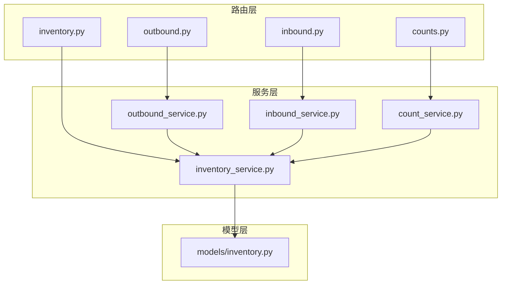
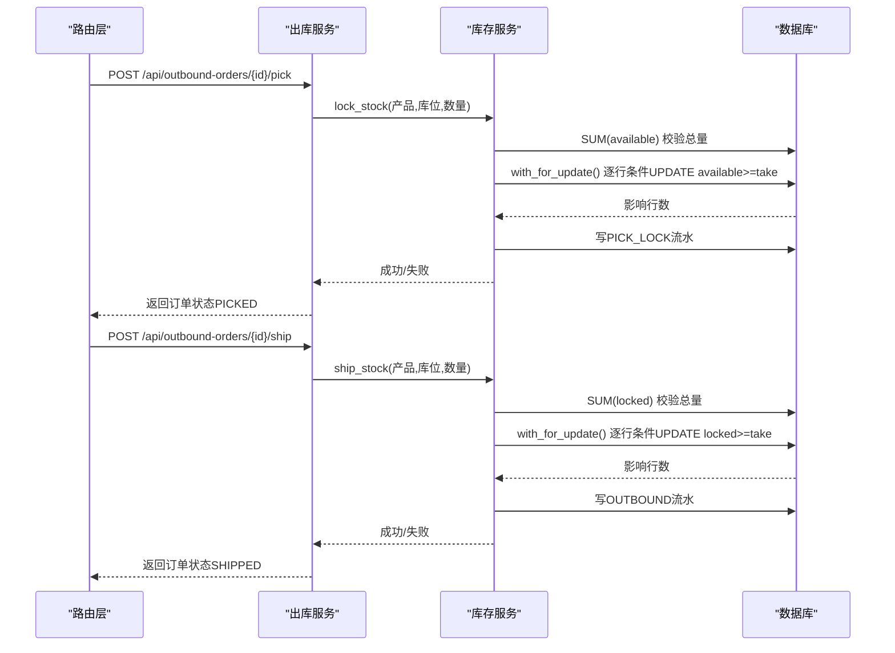
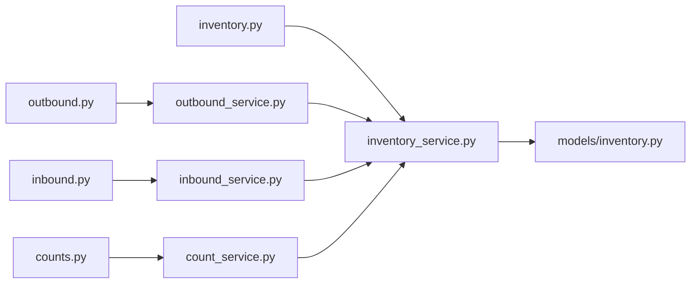

# 库存管理API

<cite>
**本文引用的文件**
- [backend-python/app/routers/inventory.py](file://backend-python/app/routers/inventory.py)
- [backend-python/app/services/inventory_service.py](file://backend-python/app/services/inventory_service.py)
- [backend-python/app/models/inventory.py](file://backend-python/app/models/inventory.py)
- [backend-python/app/schemas/inventory.py](file://backend-python/app/schemas/inventory.py)
- [backend-python/app/routers/counts.py](file://backend-python/app/routers/counts.py)
- [backend-python/app/services/count_service.py](file://backend-python/app/services/count_service.py)
- [backend-python/app/routers/outbound.py](file://backend-python/app/routers/outbound.py)
- [backend-python/app/services/outbound_service.py](file://backend-python/app/services/outbound_service.py)
- [backend-python/app/routers/inbound.py](file://backend-python/app/routers/inbound.py)
- [backend-python/app/services/inbound_service.py](file://backend-python/app/services/inbound_service.py)
- [backend-python/app/common/errors.py](file://backend-python/app/common/errors.py)
</cite>

## 目录
1. [简介](#简介)
2. [项目结构](#项目结构)
3. [核心组件](#核心组件)
4. [架构总览](#架构总览)
5. [详细组件分析](#详细组件分析)
6. [依赖关系分析](#依赖关系分析)
7. [性能与并发安全](#性能与并发安全)
8. [故障排查指南](#故障排查指南)
9. [结论](#结论)
10. [附录：接口清单与示例](#附录接口清单与示例)

## 简介
本文件面向WMS系统的库存管理API，覆盖库存查询、库存变动（入库、出库、移库、调整）、批次管理、库存流水追踪、盘点闭环等核心能力。重点说明可用量与锁定量的概念与计算逻辑、FIFO扣减策略、防超卖机制、库存锁定的实现原理与事务处理，以及性能优化建议。

## 项目结构
后端采用FastAPI路由层 + Service服务层 + SQLAlchemy模型层的分层设计：
- 路由层：定义REST接口，参数校验与分页，调用服务层
- 服务层：业务编排、状态机、事务边界、并发控制、写流水
- 模型层：库存行、批次、库存流水等数据表映射

图表来源
- [backend-python/app/routers/inventory.py:1-62](file://backend-python/app/routers/inventory.py#L1-L62)
- [backend-python/app/services/inventory_service.py:1-437](file://backend-python/app/services/inventory_service.py#L1-L437)
- [backend-python/app/models/inventory.py:1-98](file://backend-python/app/models/inventory.py#L1-L98)
- [backend-python/app/routers/outbound.py:1-61](file://backend-python/app/routers/outbound.py#L1-L61)
- [backend-python/app/services/outbound_service.py:1-196](file://backend-python/app/services/outbound_service.py#L1-L196)
- [backend-python/app/routers/inbound.py:1-45](file://backend-python/app/routers/inbound.py#L1-L45)
- [backend-python/app/services/inbound_service.py:1-150](file://backend-python/app/services/inbound_service.py#L1-L150)
- [backend-python/app/routers/counts.py:1-52](file://backend-python/app/routers/counts.py#L1-L52)
- [backend-python/app/services/count_service.py:1-298](file://backend-python/app/services/count_service.py#L1-L298)

章节来源
- [backend-python/app/routers/inventory.py:1-62](file://backend-python/app/routers/inventory.py#L1-L62)
- [backend-python/app/services/inventory_service.py:1-437](file://backend-python/app/services/inventory_service.py#L1-L437)
- [backend-python/app/models/inventory.py:1-98](file://backend-python/app/models/inventory.py#L1-L98)

## 核心组件
- 库存行（Inventory）：以(product_id, location_code, batch_id)为维度，维护available_qty与locked_qty两个字段，支持按库位与批次明细管理。
- 批次（Batch）：一次收货生成批次，支持有效期字段，便于追溯与先进先出策略。
- 库存流水（InventoryFlow）：所有库存变动必须写流水，记录flow_type、order_no、before/after数量，全量可追溯。
- 库存服务（inventory_service）：统一入口，提供add_stock、deduct_stock、lock_stock、ship_stock、query_inventory/query_flows/query_batches等能力。
- 出入库服务：outbound_service与inbound_service分别管理出库与入库单状态机，并在关键节点调用库存服务完成库存变更。
- 盘点服务：count_service负责盘点单创建、实盘录入、差异自动调整并写流水。

章节来源
- [backend-python/app/models/inventory.py:18-98](file://backend-python/app/models/inventory.py#L18-L98)
- [backend-python/app/services/inventory_service.py:1-437](file://backend-python/app/services/inventory_service.py#L1-L437)
- [backend-python/app/services/outbound_service.py:1-196](file://backend-python/app/services/outbound_service.py#L1-L196)
- [backend-python/app/services/inbound_service.py:1-150](file://backend-python/app/services/inbound_service.py#L1-L150)
- [backend-python/app/services/count_service.py:1-298](file://backend-python/app/services/count_service.py#L1-L298)

## 架构总览
库存变动的核心流程遵循“统一入口 + 强制写流水 + 原子更新”的设计原则：
- 入库：创建入库单后，收货上架时生成批次并增加可用量，写INBOUND流水
- 出库：拣货阶段将可用量转为锁定量（防超卖），复核后发货阶段扣减锁定量，写OUTBOUND流水
- 调整/移库/盘点：通过统一服务写入对应flow_type，保证全链路可追溯

图表来源
- [backend-python/app/routers/outbound.py:21-42](file://backend-python/app/routers/outbound.py#L21-L42)
- [backend-python/app/services/outbound_service.py:102-176](file://backend-python/app/services/outbound_service.py#L102-L176)
- [backend-python/app/services/inventory_service.py:147-251](file://backend-python/app/services/inventory_service.py#L147-L251)

## 详细组件分析

### 库存查询与流水、批次管理
- 库存查询
  - GET /api/inventory
  - 支持view=product或location两种视图；可按商品关键词、仓库、批次号过滤；分页返回
  - product视图汇总(商品,仓库)的可用/锁定合计；location视图返回(商品,库位,批次)明细
- 库存流水
  - GET /api/inventory/flows
  - 支持按订单号、商品、库位、流水类型过滤；分页返回
- 批次列表
  - GET /api/inventory/batches
  - 支持按关键字模糊搜索批次号或商品名/SKU；分页返回

章节来源
- [backend-python/app/routers/inventory.py:12-61](file://backend-python/app/routers/inventory.py#L12-L61)
- [backend-python/app/services/inventory_service.py:256-437](file://backend-python/app/services/inventory_service.py#L256-L437)
- [backend-python/app/schemas/inventory.py:7-60](file://backend-python/app/schemas/inventory.py#L7-L60)

### 入库流程（生成批次、增加可用量）
- 创建入库单：POST /api/inbound-orders（不改变库存）
- 收货上架：POST /api/inbound-orders/{id}/receive
  - 为每个明细生成批次（批次号含单号与明细ID），累加对应库位的可用量，写INBOUND流水
  - 整个流程在事务内，任一失败整体回滚

章节来源
- [backend-python/app/routers/inbound.py:13-26](file://backend-python/app/routers/inbound.py#L13-L26)
- [backend-python/app/services/inbound_service.py:38-129](file://backend-python/app/services/inbound_service.py#L38-L129)
- [backend-python/app/services/inventory_service.py:75-88](file://backend-python/app/services/inventory_service.py#L75-L88)

### 出库流程（拣货锁定、发货扣减）
- 创建出库单：POST /api/outbound-orders（不改变库存）
- 拣货锁定：POST /api/outbound-orders/{id}/pick
  - 将可用量转为锁定量（跨批次逐行，先扣早期批次），写PICK_LOCK流水
  - 防超卖双保险：先SUM校验总量不足直接失败；逐行条件UPDATE避免并发覆盖
- 复核验货：POST /api/outbound-orders/{id}/review（仅状态流转）
- 发货扣减：POST /api/outbound-orders/{id}/ship
  - 扣减锁定量，写OUTBOUND流水；若锁定不足则失败并回滚

章节来源
- [backend-python/app/routers/outbound.py:13-42](file://backend-python/app/routers/outbound.py#L13-L42)
- [backend-python/app/services/outbound_service.py:42-176](file://backend-python/app/services/outbound_service.py#L42-L176)
- [backend-python/app/services/inventory_service.py:147-251](file://backend-python/app/services/inventory_service.py#L147-L251)

### 盘点流程（账实相符闭环）
- 创建盘点单：POST /api/counts（按范围快照账面库存，生成明细）
- 录入实盘：POST /api/counts/{id}/submit（可多次提交覆盖）
- 完成盘点：POST /api/counts/{id}/complete
  - 校验全部明细已录入；差异行自动生成调整单并写ADJUST_IN/ADJUST_OUT流水
  - 盘盈：无批次库存行增加可用量；盘亏：跨批次先扣早期批次（FIFO）
  - 若盘亏库存不足则整单回滚，保持盘点单状态不变

章节来源
- [backend-python/app/routers/counts.py:13-51](file://backend-python/app/routers/counts.py#L13-L51)
- [backend-python/app/services/count_service.py:82-298](file://backend-python/app/services/count_service.py#L82-L298)
- [backend-python/app/services/inventory_service.py:75-144](file://backend-python/app/services/inventory_service.py#L75-L144)

### 可用量与锁定量的概念与计算
- 可用量（available_qty）：当前可被新订单占用的库存
- 锁定量（locked_qty）：已被拣货占用但尚未发货的库存
- 总量关系：total = available + locked
- 计算方式：
  - product视图：按(商品,仓库)聚合sum(available)、sum(locked)
  - location视图：按(商品,库位,批次)明细展示available与locked

章节来源
- [backend-python/app/services/inventory_service.py:256-345](file://backend-python/app/services/inventory_service.py#L256-L345)
- [backend-python/app/models/inventory.py:33-61](file://backend-python/app/models/inventory.py#L33-L61)

### FIFO策略与跨批次扣减
- 扣减顺序：按库存行id升序（即较早批次优先），实现FIFO
- 实现要点：
  - 查询时order_by(id.asc())选择最早批次
  - 使用with_for_update()在PostgreSQL下加行锁；SQLite忽略但仍通过条件UPDATE保障一致性
  - 条件UPDATE：where id=row.id and available >= take，确保并发下不会覆盖他人已提交的扣减
  - 循环扣减直到满足需求数量，每行扣减写一条流水

章节来源
- [backend-python/app/services/inventory_service.py:91-144](file://backend-python/app/services/inventory_service.py#L91-L144)
- [backend-python/app/services/inventory_service.py:147-202](file://backend-python/app/services/inventory_service.py#L147-L202)
- [backend-python/app/services/inventory_service.py:205-251](file://backend-python/app/services/inventory_service.py#L205-L251)

### 防超卖机制与库存锁定原理
- 总量预检：在扣减前对SUM(available)或SUM(locked)进行总量校验，不足直接返回失败，避免无效操作
- 逐行原子更新：使用条件UPDATE（available >= take / locked >= take）配合with_for_update()，防止并发覆盖
- 重试重读：当rowcount为0表示该行已被并发修改，继续重读最新状态再扣，直至满足数量或失败
- 事务边界：调用方需处于上层事务中，中间写入随上层回滚撤销，保证一致性

章节来源
- [backend-python/app/services/inventory_service.py:91-251](file://backend-python/app/services/inventory_service.py#L91-L251)
- [backend-python/app/services/outbound_service.py:102-176](file://backend-python/app/services/outbound_service.py#L102-L176)

### 库存流水追踪
- 所有库存变动均写InventoryFlow，包含flow_type、order_type、order_no、before/after数量、remark等
- 支持按订单号、商品、库位、流水类型过滤查询，便于审计与问题定位

章节来源
- [backend-python/app/models/inventory.py:63-98](file://backend-python/app/models/inventory.py#L63-L98)
- [backend-python/app/services/inventory_service.py:348-401](file://backend-python/app/services/inventory_service.py#L348-L401)

### 库存预警（概念性说明）
- 前端存在“库存预警”面板用于展示低库存与临期商品提示
- 当前后端未提供独立的库存预警API；可在现有库存查询基础上扩展阈值判断与告警接口

[本节为概念性说明，不直接分析具体代码文件]

## 依赖关系分析
- 路由层依赖服务层：inventory.py -> inventory_service.py；outbound.py -> outbound_service.py；inbound.py -> inbound_service.py；counts.py -> count_service.py
- 服务层依赖模型层：inventory_service.py -> models/inventory.py；其他服务通过inventory_service间接依赖模型
- 服务间耦合：outbound_service与inbound_service通过inventory_service统一库存变更；count_service在完成盘点时调用inventory_service进行盘盈/盘亏调整

图表来源
- [backend-python/app/routers/inventory.py:1-62](file://backend-python/app/routers/inventory.py#L1-L62)
- [backend-python/app/services/inventory_service.py:1-437](file://backend-python/app/services/inventory_service.py#L1-L437)
- [backend-python/app/models/inventory.py:1-98](file://backend-python/app/models/inventory.py#L1-L98)
- [backend-python/app/routers/outbound.py:1-61](file://backend-python/app/routers/outbound.py#L1-L61)
- [backend-python/app/services/outbound_service.py:1-196](file://backend-python/app/services/outbound_service.py#L1-L196)
- [backend-python/app/routers/inbound.py:1-45](file://backend-python/app/routers/inbound.py#L1-L45)
- [backend-python/app/services/inbound_service.py:1-150](file://backend-python/app/services/inbound_service.py#L1-L150)
- [backend-python/app/routers/counts.py:1-52](file://backend-python/app/routers/counts.py#L1-L52)
- [backend-python/app/services/count_service.py:1-298](file://backend-python/app/services/count_service.py#L1-L298)

章节来源
- [backend-python/app/routers/inventory.py:1-62](file://backend-python/app/routers/inventory.py#L1-L62)
- [backend-python/app/services/inventory_service.py:1-437](file://backend-python/app/services/inventory_service.py#L1-L437)
- [backend-python/app/models/inventory.py:1-98](file://backend-python/app/models/inventory.py#L1-L98)

## 性能与并发安全
- 索引优化：库存表对location_code、product_id建索引；流水表对order_no、product_id、created_at建索引，提升查询与过滤性能
- N+1查询规避：查询流水与订单列表时使用joinedload一次性加载关联对象，减少多次查库
- 并发安全：
  - with_for_update()在PostgreSQL下加行锁；SQLite忽略但仍通过条件UPDATE保障一致性
  - 条件UPDATE + rowcount检查 + 重读重试，避免并发覆盖导致的数据不一致
- 事务边界：所有库存变动在事务中执行，失败整体回滚，保证最终一致性
- 批量聚合：出库拣货与发货前对同一(商品,库位)合并数量，减少重复操作

章节来源
- [backend-python/app/models/inventory.py:40-48](file://backend-python/app/models/inventory.py#L40-L48)
- [backend-python/app/services/inventory_service.py:358-401](file://backend-python/app/services/inventory_service.py#L358-L401)
- [backend-python/app/services/outbound_service.py:107-128](file://backend-python/app/services/outbound_service.py#L107-L128)
- [backend-python/app/services/inventory_service.py:115-144](file://backend-python/app/services/inventory_service.py#L115-L144)

## 故障排查指南
- 常见错误：BusinessError携带HTTP状态码，由全局异常处理器统一转换为响应
- 库存不足：
  - 拣货失败：可用量不足，检查SUM(available)与逐行条件UPDATE结果
  - 发货失败：锁定量不足，检查SUM(locked)与逐行条件UPDATE结果
- 并发冲突：
  - rowcount为0表示该行已被并发修改，服务会重读最新状态重试；如仍失败，检查是否存在高并发热点库位
- 盘点失败：
  - 未完成录入：完成盘点前需全部明细录入实盘数量
  - 盘亏不足：盘亏扣减失败会整单回滚，检查对应库位可用量是否足够

章节来源
- [backend-python/app/common/errors.py:4-9](file://backend-python/app/common/errors.py#L4-L9)
- [backend-python/app/services/outbound_service.py:113-128](file://backend-python/app/services/outbound_service.py#L113-L128)
- [backend-python/app/services/count_service.py:217-279](file://backend-python/app/services/count_service.py#L217-L279)

## 结论
本库存管理API通过统一的服务入口、强制写流水、FIFO跨批次扣减、条件UPDATE与行锁结合的方式，实现了高并发下的防超卖与数据一致性。入库、出库、盘点等流程均在事务边界内执行，确保任意环节失败整体回滚。建议在后续迭代中补充库存预警API，并结合阈值与定时任务实现低库存与临期商品的主动告警。

## 附录：接口清单与示例

### 库存查询
- GET /api/inventory
- 参数：view(product|location), keyword, warehouseId, batchNo, page, pageSize
- 返回：list(total, page, pageSize)，包含productId、productName、sku、availableQty、lockedQty、totalQty、warehouseId、warehouseName、updatedAt，location视图额外包含locationCode、batchNo

章节来源
- [backend-python/app/routers/inventory.py:12-31](file://backend-python/app/routers/inventory.py#L12-L31)
- [backend-python/app/services/inventory_service.py:256-345](file://backend-python/app/services/inventory_service.py#L256-L345)
- [backend-python/app/schemas/inventory.py:16-43](file://backend-python/app/schemas/inventory.py#L16-L43)

### 库存流水
- GET /api/inventory/flows
- 参数：orderNo, productId, locationCode, flowType, page, pageSize
- 返回：list(total, page, pageSize)，包含flowType、orderType、orderNo、productId、productName、sku、locationCode、batchNo、quantity、beforeQty、afterQty、remark、createdAt

章节来源
- [backend-python/app/routers/inventory.py:34-49](file://backend-python/app/routers/inventory.py#L34-L49)
- [backend-python/app/services/inventory_service.py:348-401](file://backend-python/app/services/inventory_service.py#L348-L401)
- [backend-python/app/schemas/inventory.py:45-60](file://backend-python/app/schemas/inventory.py#L45-L60)

### 批次管理
- GET /api/inventory/batches
- 参数：keyword, page, pageSize
- 返回：list(total, page, pageSize)，包含id、batchNo、productId、productName、sku、inboundDate、manufactureDate、expiryDate

章节来源
- [backend-python/app/routers/inventory.py:52-61](file://backend-python/app/routers/inventory.py#L52-L61)
- [backend-python/app/services/inventory_service.py:404-437](file://backend-python/app/services/inventory_service.py#L404-L437)

### 入库管理
- POST /api/inbound-orders：创建入库单（PENDING）
- POST /api/inbound-orders/{id}/receive：收货上架（PENDING → COMPLETED），生成批次并增加可用量，写INBOUND流水

章节来源
- [backend-python/app/routers/inbound.py:13-26](file://backend-python/app/routers/inbound.py#L13-L26)
- [backend-python/app/services/inbound_service.py:38-129](file://backend-python/app/services/inbound_service.py#L38-L129)

### 出库管理
- POST /api/outbound-orders：创建出库单（PENDING）
- POST /api/outbound-orders/{id}/pick：拣货锁定（PENDING → PICKED），可用量转锁定量，写PICK_LOCK流水
- POST /api/outbound-orders/{id}/review：复核验货（PICKED → REVIEWED）
- POST /api/outbound-orders/{id}/ship：发货扣减（REVIEWED → SHIPPED），扣减锁定量，写OUTBOUND流水

章节来源
- [backend-python/app/routers/outbound.py:13-42](file://backend-python/app/routers/outbound.py#L13-L42)
- [backend-python/app/services/outbound_service.py:42-176](file://backend-python/app/services/outbound_service.py#L42-L176)

### 盘点管理
- POST /api/counts：创建盘点单（快照账面库存）
- GET /api/counts：盘点单列表
- GET /api/counts/{id}：盘点单详情
- POST /api/counts/{id}/submit：录入实盘数量（可多次覆盖）
- POST /api/counts/{id}/complete：完成盘点（差异自动调整并写流水）

章节来源
- [backend-python/app/routers/counts.py:13-51](file://backend-python/app/routers/counts.py#L13-L51)
- [backend-python/app/services/count_service.py:82-298](file://backend-python/app/services/count_service.py#L82-L298)