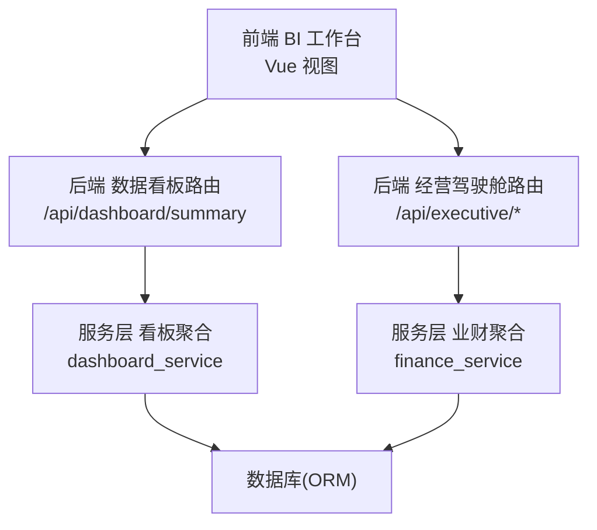
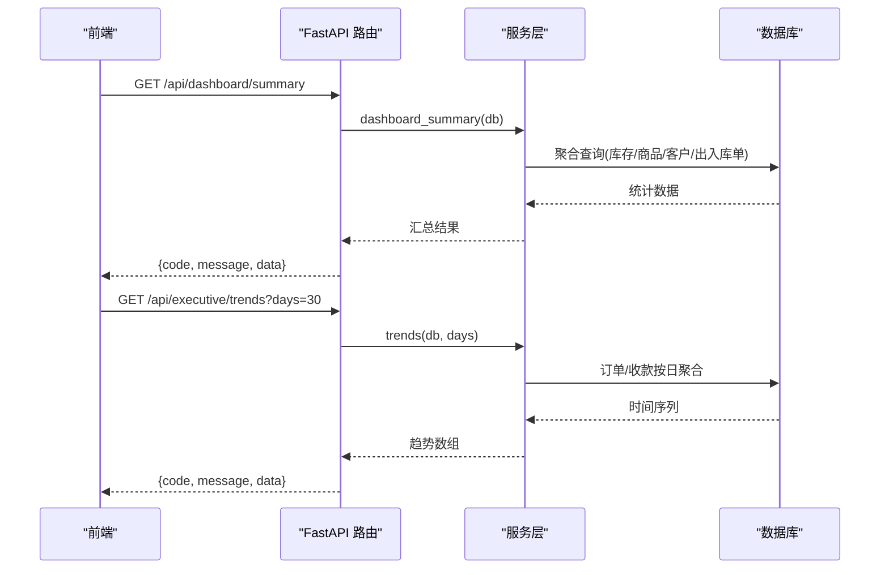
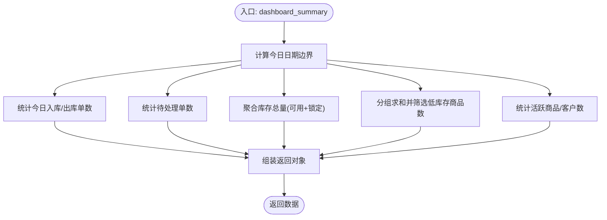
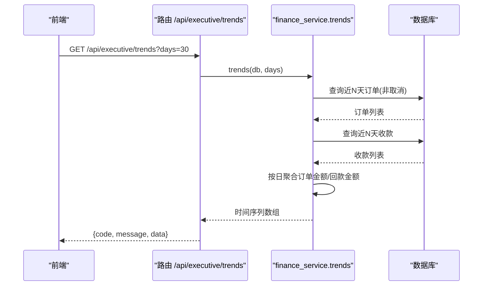
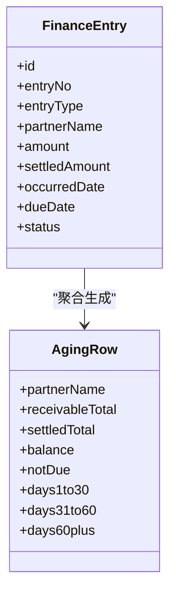
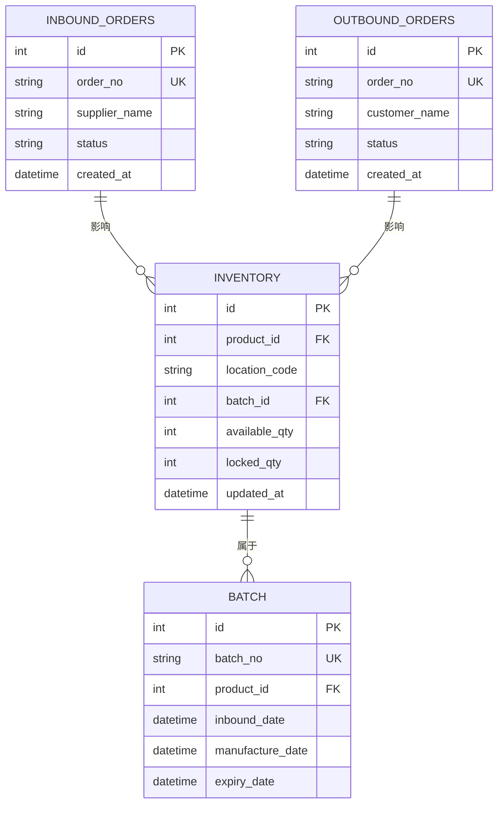
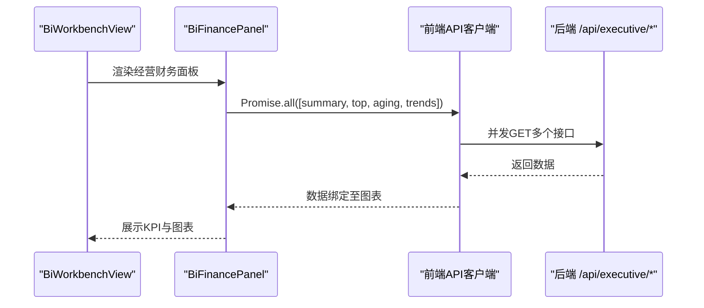
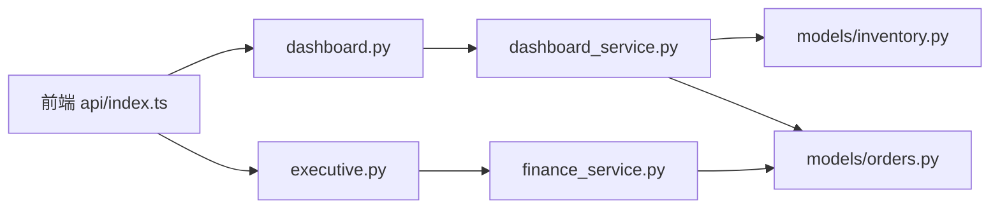

# 数据看板API

<cite>
**本文引用的文件**
- [backend-python/app/routers/dashboard.py](file://backend-python/app/routers/dashboard.py)
- [backend-python/app/services/dashboard_service.py](file://backend-python/app/services/dashboard_service.py)
- [backend-python/app/routers/executive.py](file://backend-python/app/routers/executive.py)
- [backend-python/app/services/finance_service.py](file://backend-python/app/services/finance_service.py)
- [backend-python/app/models/inventory.py](file://backend-python/app/models/inventory.py)
- [backend-python/app/models/orders.py](file://backend-python/app/models/orders.py)
- [frontend-vue/src/api/index.ts](file://frontend-vue/src/api/index.ts)
- [frontend-vue/src/views/bi/BiWorkbenchView.vue](file://frontend-vue/src/views/bi/BiWorkbenchView.vue)
- [frontend-vue/src/views/bi/BiFinancePanel.vue](file://frontend-vue/src/views/bi/BiFinancePanel.vue)
</cite>

## 目录
1. [简介](#简介)
2. [项目结构](#项目结构)
3. [核心组件](#核心组件)
4. [架构总览](#架构总览)
5. [详细组件分析](#详细组件分析)
6. [依赖关系分析](#依赖关系分析)
7. [性能与大数据处理](#性能与大数据处理)
8. [故障排查指南](#故障排查指南)
9. [结论](#结论)
10. [附录：接口清单与查询示例](#附录接口清单与查询示例)

## 简介
本文件为WMS系统“数据看板API”的权威文档，覆盖经营驾驶舱、BI工作台等数据分析接口的数据聚合与统计能力。重点说明库存周转、销售趋势、财务指标等关键业务指标的计算逻辑、数据聚合算法与性能优化策略；提供完整的数据查询示例、缓存策略与大数据量处理方案；并强调实时数据更新机制、查询性能优化与可视化支持。

## 项目结构
后端采用FastAPI路由层 + 服务层 + ORM模型的分层架构：
- 路由层：暴露REST API（如 /api/dashboard/summary、/api/executive/*）
- 服务层：实现业务聚合与计算（如 dashboard_summary、executive_summary、trends、aging_distribution）
- 模型层：定义库存、订单、财务流水等实体及索引

前端通过统一的API客户端调用后端接口，并在BI工作台中以图表形式呈现。

**图示来源**
- [backend-python/app/routers/dashboard.py:1-15](file://backend-python/app/routers/dashboard.py#L1-L15)
- [backend-python/app/routers/executive.py:1-44](file://backend-python/app/routers/executive.py#L1-L44)
- [backend-python/app/services/dashboard_service.py:1-50](file://backend-python/app/services/dashboard_service.py#L1-L50)
- [backend-python/app/services/finance_service.py:509-588](file://backend-python/app/services/finance_service.py#L509-L588)

**章节来源**
- [backend-python/app/routers/dashboard.py:1-15](file://backend-python/app/routers/dashboard.py#L1-L15)
- [backend-python/app/routers/executive.py:1-44](file://backend-python/app/routers/executive.py#L1-L44)
- [backend-python/app/services/dashboard_service.py:1-50](file://backend-python/app/services/dashboard_service.py#L1-L50)
- [backend-python/app/services/finance_service.py:509-588](file://backend-python/app/services/finance_service.py#L509-L588)

## 核心组件
- 数据看板首页汇总：返回今日出入库单数、待处理单数、库存总量、低库存商品数、活跃商品/客户数等。
- 经营驾驶舱：应收总额、已回款、未回款、逾期金额、订单数与订单金额、应收TOP客户、账龄分布、订单/回款趋势。
- 财务台账与账龄：应收/应付台账分页查询、按往来方汇总余额与账龄分段。
- 库存与订单模型：库存行（可用量/锁定量）、批次、库存流水；入库/出库/退货/移库/调整等单据状态机。

**章节来源**
- [backend-python/app/services/dashboard_service.py:18-49](file://backend-python/app/services/dashboard_service.py#L18-L49)
- [backend-python/app/services/finance_service.py:511-588](file://backend-python/app/services/finance_service.py#L511-L588)
- [backend-python/app/models/inventory.py:18-98](file://backend-python/app/models/inventory.py#L18-L98)
- [backend-python/app/models/orders.py:17-200](file://backend-python/app/models/orders.py#L17-L200)

## 架构总览
数据看板API的请求链路如下：
- 前端发起GET请求到后端路由
- 路由校验鉴权后调用对应服务方法
- 服务层使用SQLAlchemy进行聚合查询与计算
- 结果封装为标准响应格式返回前端

**图示来源**
- [backend-python/app/routers/dashboard.py:12-14](file://backend-python/app/routers/dashboard.py#L12-L14)
- [backend-python/app/services/dashboard_service.py:18-49](file://backend-python/app/services/dashboard_service.py#L18-L49)
- [backend-python/app/routers/executive.py:36-43](file://backend-python/app/routers/executive.py#L36-L43)
- [backend-python/app/services/finance_service.py:555-588](file://backend-python/app/services/finance_service.py#L555-L588)

## 详细组件分析

### 数据看板首页汇总（Dashboard Summary）
- 功能：统计今日入库/出库单数、待处理单数、库存总量、低库存商品数、活跃商品/客户数。
- 计算逻辑：
  - 今日单数：基于 created_at >= 今日零点 计数
  - 待处理单数：基于 status IN (PENDING/PICKED) 计数
  - 库存总量：对 Inventory.available_qty + locked_qty 求和
  - 低库存商品：分组求和后 having sum < 10 的商品数
  - 活跃商品/客户：status == ACTIVE 计数
- 复杂度：主要为聚合与分组，依赖数据库索引与SQL优化。
- 性能建议：
  - 对 created_at、status、product_id、location_code 建索引
  - 将常用聚合结果写入物化视图或定时汇总表，降低实时压力

**图示来源**
- [backend-python/app/services/dashboard_service.py:18-49](file://backend-python/app/services/dashboard_service.py#L18-L49)

**章节来源**
- [backend-python/app/services/dashboard_service.py:18-49](file://backend-python/app/services/dashboard_service.py#L18-L49)

### 经营驾驶舱（Executive Summary & Trends）
- 功能：应收总额、已回款、未回款、逾期金额、订单数与订单金额、应收TOP客户、账龄分布、订单/回款趋势。
- 计算逻辑：
  - 应收相关：遍历 FinanceEntry(entry_type=RECEIVABLE)，累计 amount/settled_amount/outstanding，并按到期日判断逾期
  - 订单统计：排除取消订单，统计数量与总金额
  - 趋势：按 created_at/occurred_date 聚合最近N天的订单金额与回款金额
- 复杂度：O(N) 遍历聚合；趋势生成需构造连续日期序列。
- 性能建议：
  - 对 due_date、occurred_date、created_at、entry_type 建索引
  - 大表可考虑分区表或物化视图；趋势可按天预聚合

**图示来源**
- [backend-python/app/routers/executive.py:36-43](file://backend-python/app/routers/executive.py#L36-L43)
- [backend-python/app/services/finance_service.py:555-588](file://backend-python/app/services/finance_service.py#L555-L588)

**章节来源**
- [backend-python/app/services/finance_service.py:511-588](file://backend-python/app/services/finance_service.py#L511-L588)

### 财务台账与账龄（Receivables & Aging）
- 功能：应收/应付台账分页查询、按往来方汇总余额与账龄分段（未到期、逾期1-30、31-60、60+）。
- 计算逻辑：
  - 台账：过滤 entry_type IN (RECEIVABLE, PAYABLE)，支持伙伴名称、状态、仅未结、仅逾期等条件
  - 账龄：以到期日为基准，计算 outstanding 并落入各区间
- 复杂度：台账全表扫描+过滤；账龄按往来方分组聚合。
- 性能建议：
  - 对 partner_name、status、due_date 建索引
  - 高频账龄可缓存或定时刷新

**图示来源**
- [backend-python/app/services/finance_service.py:444-506](file://backend-python/app/services/finance_service.py#L444-L506)

**章节来源**
- [backend-python/app/services/finance_service.py:444-506](file://backend-python/app/services/finance_service.py#L444-L506)

### 库存与订单模型（Inventory & Orders）
- 库存行：按 product_id、location_code、batch_id 维度管理 available_qty 与 locked_qty，并提供索引优化查询。
- 单据状态机：入库单(PENDING→COMPLETED)、出库单(PENDING→PICKED→SHIPPED)、退货单(PENDING→RECEIVED→DONE)、移库/调整直接完成。
- 重要性：看板中的库存总量、低库存预警、出入库趋势均依赖这些模型与状态。

**图示来源**
- [backend-python/app/models/inventory.py:18-98](file://backend-python/app/models/inventory.py#L18-L98)
- [backend-python/app/models/orders.py:17-200](file://backend-python/app/models/orders.py#L17-L200)

**章节来源**
- [backend-python/app/models/inventory.py:18-98](file://backend-python/app/models/inventory.py#L18-L98)
- [backend-python/app/models/orders.py:17-200](file://backend-python/app/models/orders.py#L17-L200)

### 前端BI工作台集成
- 工作台外壳：提供时间范围、仓库筛选与面板切换；导出图表功能。
- 经营财务面板：并行调用多个驾驶舱接口，失败时降级为空态，不影响其他Mock面板。
- 数据总览面板：使用本地Mock数据展示出入库趋势、单据状态分布、仓库库存分布与预警下钻。

**图示来源**
- [frontend-vue/src/views/bi/BiWorkbenchView.vue:1-104](file://frontend-vue/src/views/bi/BiWorkbenchView.vue#L1-L104)
- [frontend-vue/src/views/bi/BiFinancePanel.vue:73-87](file://frontend-vue/src/views/bi/BiFinancePanel.vue#L73-L87)
- [frontend-vue/src/api/index.ts:708-718](file://frontend-vue/src/api/index.ts#L708-L718)

**章节来源**
- [frontend-vue/src/views/bi/BiWorkbenchView.vue:1-104](file://frontend-vue/src/views/bi/BiWorkbenchView.vue#L1-L104)
- [frontend-vue/src/views/bi/BiFinancePanel.vue:1-145](file://frontend-vue/src/views/bi/BiFinancePanel.vue#L1-L145)
- [frontend-vue/src/api/index.ts:92-106](file://frontend-vue/src/api/index.ts#L92-L106)
- [frontend-vue/src/api/index.ts:708-718](file://frontend-vue/src/api/index.ts#L708-L718)

## 依赖关系分析
- 路由与服务解耦：路由仅负责参数校验与调用服务，服务专注业务聚合。
- 服务与模型耦合：服务通过ORM访问模型，依赖模型字段与索引设计。
- 前端与后端契约：前端API类型定义与后端返回结构一致，便于类型安全与联调。

**图示来源**
- [backend-python/app/routers/dashboard.py:1-15](file://backend-python/app/routers/dashboard.py#L1-L15)
- [backend-python/app/routers/executive.py:1-44](file://backend-python/app/routers/executive.py#L1-L44)
- [backend-python/app/services/dashboard_service.py:1-50](file://backend-python/app/services/dashboard_service.py#L1-L50)
- [backend-python/app/services/finance_service.py:509-588](file://backend-python/app/services/finance_service.py#L509-L588)
- [backend-python/app/models/inventory.py:18-98](file://backend-python/app/models/inventory.py#L18-L98)
- [backend-python/app/models/orders.py:17-200](file://backend-python/app/models/orders.py#L17-L200)
- [frontend-vue/src/api/index.ts:92-106](file://frontend-vue/src/api/index.ts#L92-L106)
- [frontend-vue/src/api/index.ts:708-718](file://frontend-vue/src/api/index.ts#L708-L718)

**章节来源**
- [backend-python/app/routers/dashboard.py:1-15](file://backend-python/app/routers/dashboard.py#L1-L15)
- [backend-python/app/routers/executive.py:1-44](file://backend-python/app/routers/executive.py#L1-L44)
- [backend-python/app/services/dashboard_service.py:1-50](file://backend-python/app/services/dashboard_service.py#L1-L50)
- [backend-python/app/services/finance_service.py:509-588](file://backend-python/app/services/finance_service.py#L509-L588)
- [backend-python/app/models/inventory.py:18-98](file://backend-python/app/models/inventory.py#L18-L98)
- [backend-python/app/models/orders.py:17-200](file://backend-python/app/models/orders.py#L17-L200)
- [frontend-vue/src/api/index.ts:92-106](file://frontend-vue/src/api/index.ts#L92-L106)
- [frontend-vue/src/api/index.ts:708-718](file://frontend-vue/src/api/index.ts#L708-L718)

## 性能与大数据处理
- 查询优化
  - 索引：对 created_at、status、due_date、occurred_date、product_id、location_code、partner_name 建立索引，减少全表扫描。
  - 聚合：尽量在数据库层完成 SUM/COUNT/GROUP BY，避免在应用层做大规模聚合。
  - 分页：台账与列表类接口使用 page/pageSize 分页，限制单次返回量。
- 缓存策略
  - 短期缓存：对热点指标（如 dashboard summary、executive summary）设置短TTL缓存（秒级），减轻数据库压力。
  - 预聚合：对趋势数据（按天）建立预聚合表，定时任务刷新，查询直接读取。
  - 前端缓存：对不频繁变化的数据（如仓库列表、产品类别）进行本地缓存。
- 大数据量处理
  - 分区表：对大表（如 inventory_flows、sales_orders）按时间分区，提升查询效率。
  - 异步任务：复杂报表（如ABC分析、账龄明细）通过后台任务生成，前端轮询获取结果。
  - 读写分离：读多写少场景可采用只读副本承载看板查询。
- 实时数据更新
  - 事件驱动：当发生入库/出库/发货/收款等业务动作时，触发指标重算或缓存失效。
  - 增量更新：趋势与账龄采用增量聚合，避免全量重算。
  - 前端刷新：支持手动刷新与定时轮询，保证看板数据时效性。

[本节为通用性能指导，不直接分析具体文件]

## 故障排查指南
- 常见问题
  - 接口超时：登录与首屏请求可能受冷启动影响，适当增加超时时间。
  - 数据不一致：检查事务边界与幂等性（如应收生成、核销操作）。
  - 性能瓶颈：关注慢查询日志，确认索引是否命中。
- 定位步骤
  - 查看路由参数与分页是否正确
  - 检查服务层聚合逻辑与过滤条件
  - 验证数据库索引与执行计划
  - 前端错误降级与重试策略是否生效
- 恢复措施
  - 清理无效缓存
  - 重建索引或优化SQL
  - 调整分页大小或限制时间范围

**章节来源**
- [frontend-vue/src/api/index.ts:459-470](file://frontend-vue/src/api/index.ts#L459-L470)
- [backend-python/app/services/finance_service.py:293-336](file://backend-python/app/services/finance_service.py#L293-L336)
- [backend-python/app/services/finance_service.py:341-439](file://backend-python/app/services/finance_service.py#L341-L439)

## 结论
数据看板API通过清晰的分层架构与严谨的聚合逻辑，提供了经营驾驶舱与BI工作台所需的关键指标。借助合理的索引、缓存与预聚合策略，可在大数据量场景下保持良好性能。未来可进一步引入事件驱动的增量更新与更细粒度的缓存失效机制，以提升实时性与可扩展性。

[本节为总结性内容，不直接分析具体文件]

## 附录：接口清单与查询示例

### 数据看板
- 接口：GET /api/dashboard/summary
- 返回字段：今日入库/出库单数、待处理单数、库存总量、低库存商品数、活跃商品/客户数
- 查询示例：
  - 前端调用：getDashboardSummary()
  - 参考路径：[frontend-vue/src/api/index.ts:92-106](file://frontend-vue/src/api/index.ts#L92-L106)

**章节来源**
- [backend-python/app/routers/dashboard.py:12-14](file://backend-python/app/routers/dashboard.py#L12-L14)
- [backend-python/app/services/dashboard_service.py:18-49](file://backend-python/app/services/dashboard_service.py#L18-L49)
- [frontend-vue/src/api/index.ts:92-106](file://frontend-vue/src/api/index.ts#L92-L106)

### 经营驾驶舱
- 接口：
  - GET /api/executive/summary
  - GET /api/executive/receivable-top?limit=5
  - GET /api/executive/aging-distribution
  - GET /api/executive/trends?days=30
- 返回字段：应收总额、已回款、未回款、逾期金额、订单数与金额、TOP客户、账龄分布、趋势序列
- 查询示例：
  - 前端调用：getExecutiveSummary()、getReceivableTop()、getAgingDistribution()、getExecutiveTrends()
  - 参考路径：[frontend-vue/src/api/index.ts:708-718](file://frontend-vue/src/api/index.ts#L708-L718)

**章节来源**
- [backend-python/app/routers/executive.py:12-43](file://backend-python/app/routers/executive.py#L12-L43)
- [backend-python/app/services/finance_service.py:511-588](file://backend-python/app/services/finance_service.py#L511-L588)
- [frontend-vue/src/api/index.ts:708-718](file://frontend-vue/src/api/index.ts#L708-L718)

### 财务台账与账龄
- 接口：
  - GET /api/finance/receivables?partnerName=&status=&onlyOutstanding=&onlyOverdue=&page=&pageSize=
  - GET /api/finance/aging
- 返回字段：台账列表（含逾期标记与未结余额）、按往来方的余额与账龄分段
- 查询示例：
  - 前端调用：getReceivables()、getAging()
  - 参考路径：[frontend-vue/src/api/index.ts:652-662](file://frontend-vue/src/api/index.ts#L652-L662)

**章节来源**
- [backend-python/app/routers/finance.py:13-36](file://backend-python/app/routers/finance.py#L13-L36)
- [backend-python/app/services/finance_service.py:444-506](file://backend-python/app/services/finance_service.py#L444-L506)
- [frontend-vue/src/api/index.ts:652-662](file://frontend-vue/src/api/index.ts#L652-L662)

### 可视化支持
- 前端面板：BiWorkbenchView 提供时间范围与仓库筛选、面板切换与图表导出
- 经营财务面板：BiFinancePanel 并行加载多个驾驶舱接口，失败时降级为空态
- 图表主题：统一样式与格式化，支持金额单位转换与百分比显示

**章节来源**
- [frontend-vue/src/views/bi/BiWorkbenchView.vue:1-104](file://frontend-vue/src/views/bi/BiWorkbenchView.vue#L1-L104)
- [frontend-vue/src/views/bi/BiFinancePanel.vue:1-145](file://frontend-vue/src/views/bi/BiFinancePanel.vue#L1-L145)