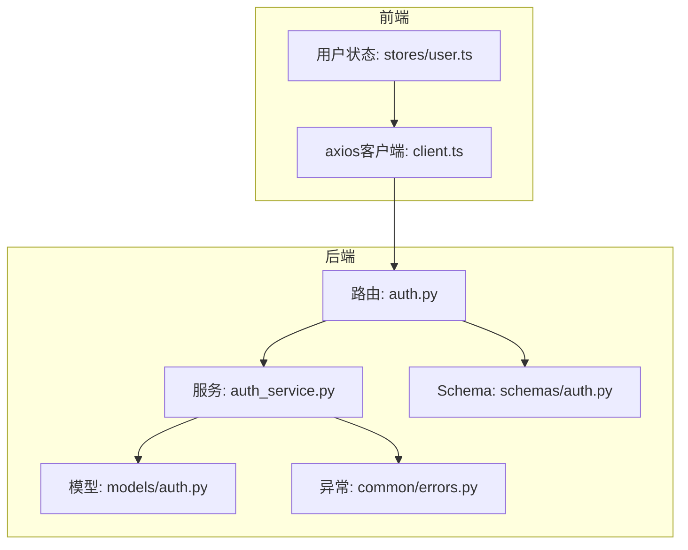
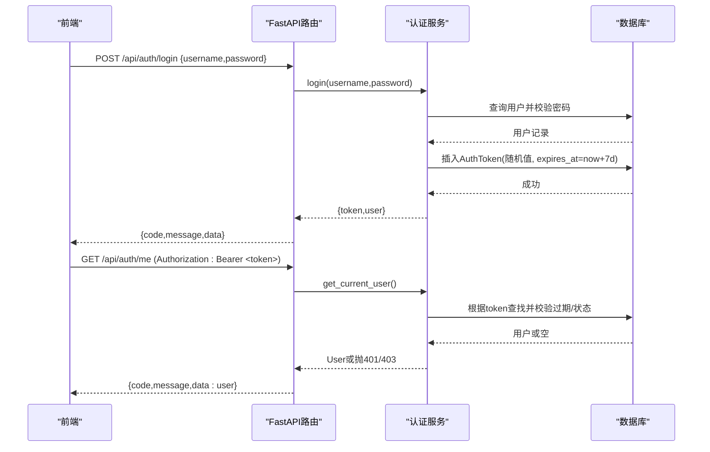
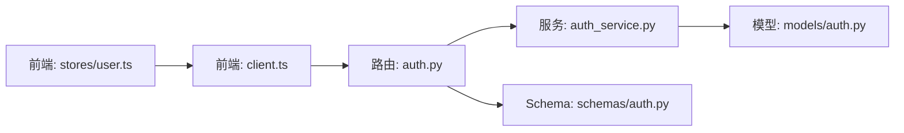

# 认证API

<cite>
**本文引用的文件**
- [backend-python/app/routers/auth.py](file://backend-python/app/routers/auth.py)
- [backend-python/app/services/auth_service.py](file://backend-python/app/services/auth_service.py)
- [backend-python/app/schemas/auth.py](file://backend-python/app/schemas/auth.py)
- [backend-python/app/models/auth.py](file://backend-python/app/models/auth.py)
- [backend-python/app/common/errors.py](file://backend-python/app/common/errors.py)
- [backend-python/tests/test_api_auth.py](file://backend-python/tests/test_api_auth.py)
- [frontend-vue/src/api/client.ts](file://frontend-vue/src/api/client.ts)
- [frontend-vue/src/stores/user.ts](file://frontend-vue/src/stores/user.ts)
</cite>

## 目录
1. [简介](#简介)
2. [项目结构](#项目结构)
3. [核心组件](#核心组件)
4. [架构总览](#架构总览)
5. [详细接口说明](#详细接口说明)
6. [依赖关系分析](#依赖关系分析)
7. [性能与安全特性](#性能与安全特性)
8. [故障排查指南](#故障排查指南)
9. [结论](#结论)
10. [附录：客户端集成与示例](#附录客户端集成与示例)

## 简介
本章节为WMS系统“认证API”的权威文档，覆盖用户登录、登出、获取当前用户信息以及用户管理（管理员）等RESTful接口。重点说明：
- HTTP方法与URL模式
- 请求/响应Schema
- Bearer Token认证机制与权限控制
- 会话管理与令牌生命周期
- 错误码与异常处理
- 前端集成要点与完整请求示例

## 项目结构
认证相关代码主要分布在后端FastAPI路由、服务层、数据模型与Schema定义中；前端通过Axios拦截器自动附加Authorization头并处理401跳转。

图表来源
- [backend-python/app/routers/auth.py:1-68](file://backend-python/app/routers/auth.py#L1-L68)
- [backend-python/app/services/auth_service.py:1-176](file://backend-python/app/services/auth_service.py#L1-L176)
- [backend-python/app/models/auth.py:1-40](file://backend-python/app/models/auth.py#L1-L40)
- [backend-python/app/schemas/auth.py:1-38](file://backend-python/app/schemas/auth.py#L1-L38)
- [backend-python/app/common/errors.py:1-9](file://backend-python/app/common/errors.py#L1-L9)
- [frontend-vue/src/api/client.ts:1-45](file://frontend-vue/src/api/client.ts#L1-L45)
- [frontend-vue/src/stores/user.ts:1-49](file://frontend-vue/src/stores/user.ts#L1-L49)

章节来源
- [backend-python/app/routers/auth.py:1-68](file://backend-python/app/routers/auth.py#L1-L68)
- [backend-python/app/services/auth_service.py:1-176](file://backend-python/app/services/auth_service.py#L1-L176)
- [backend-python/app/models/auth.py:1-40](file://backend-python/app/models/auth.py#L1-L40)
- [backend-python/app/schemas/auth.py:1-38](file://backend-python/app/schemas/auth.py#L1-L38)
- [frontend-vue/src/api/client.ts:1-45](file://frontend-vue/src/api/client.ts#L1-L45)
- [frontend-vue/src/stores/user.ts:1-49](file://frontend-vue/src/stores/user.ts#L1-L49)

## 核心组件
- 路由层：定义认证与用户管理的HTTP端点，统一返回code/message/data格式。
- 服务层：实现密码哈希校验、Token签发与验证、用户CRUD、管理员权限校验。
- 模型层：User与AuthToken实体，支持软禁用与令牌过期清理。
- Schema层：前后端一致的camelCase契约，包含登录请求/响应、用户创建/更新/响应。
- 异常层：BusinessError携带HTTP状态码，由全局异常处理器统一转为JSON响应。
- 前端：Axios拦截器自动注入Authorization头，401时清除本地态并跳转登录页；Pinia store管理token与用户信息。

章节来源
- [backend-python/app/routers/auth.py:1-68](file://backend-python/app/routers/auth.py#L1-L68)
- [backend-python/app/services/auth_service.py:1-176](file://backend-python/app/services/auth_service.py#L1-L176)
- [backend-python/app/models/auth.py:1-40](file://backend-python/app/models/auth.py#L1-L40)
- [backend-python/app/schemas/auth.py:1-38](file://backend-python/app/schemas/auth.py#L1-L38)
- [backend-python/app/common/errors.py:1-9](file://backend-python/app/common/errors.py#L1-L9)
- [frontend-vue/src/api/client.ts:1-45](file://frontend-vue/src/api/client.ts#L1-L45)
- [frontend-vue/src/stores/user.ts:1-49](file://frontend-vue/src/stores/user.ts#L1-L49)

## 架构总览
认证流程采用“随机Token + 数据库白名单”的模式：
- 登录成功生成随机Token并持久化，设置过期时间（7天）。
- 后续请求需在Authorization头携带Bearer Token。
- 服务端解析Token，查询数据库校验有效性、是否过期、用户状态是否为启用。
- 管理员接口额外通过require_admin依赖进行角色校验。

图表来源
- [backend-python/app/routers/auth.py:14-33](file://backend-python/app/routers/auth.py#L14-L33)
- [backend-python/app/services/auth_service.py:116-168](file://backend-python/app/services/auth_service.py#L116-L168)
- [backend-python/app/models/auth.py:19-40](file://backend-python/app/models/auth.py#L19-L40)

## 详细接口说明

### 通用约定
- 基础路径：/api
- 认证方式：Bearer Token（Authorization: Bearer <token>）
- 统一响应体：{ code: number, message: string, data: any }
- 日期字段：createdAt（驼峰命名）

章节来源
- [backend-python/app/routers/auth.py:1-68](file://backend-python/app/routers/auth.py#L1-L68)
- [backend-python/app/schemas/base.py:24-34](file://backend-python/app/schemas/base.py#L24-L34)

### 登录
- 方法：POST
- URL：/api/auth/login
- 鉴权：无需
- 请求体：
  - username: string
  - password: string
- 响应体：
  - code: 200
  - message: "登录成功"
  - data:
    - token: string（随机值，有效期7天）
    - user: { id, username, role, status, createdAt }
- 错误：
  - 401：用户名或密码错误
  - 403：账号已停用

章节来源
- [backend-python/app/routers/auth.py:15-18](file://backend-python/app/routers/auth.py#L15-L18)
- [backend-python/app/services/auth_service.py:116-129](file://backend-python/app/services/auth_service.py#L116-L129)
- [backend-python/app/schemas/auth.py:30-38](file://backend-python/app/schemas/auth.py#L30-L38)

### 登出
- 方法：POST
- URL：/api/auth/logout
- 鉴权：需要（从Authorization头提取Token）
- 行为：删除对应Token，使该令牌失效
- 响应体：
  - code: 200
  - message: "退出成功"
  - data: null
- 注意：若未提供有效Token，仍会返回成功（幂等）

章节来源
- [backend-python/app/routers/auth.py:21-26](file://backend-python/app/routers/auth.py#L21-L26)
- [backend-python/app/services/auth_service.py:132-134](file://backend-python/app/services/auth_service.py#L132-L134)

### 获取当前用户
- 方法：GET
- URL：/api/auth/me
- 鉴权：需要（Bearer Token）
- 响应体：
  - code: 200
  - message: "success"
  - data: { id, username, role, status, createdAt }
- 错误：
  - 401：未登录或登录已过期
  - 403：账号已停用

章节来源
- [backend-python/app/routers/auth.py:29-33](file://backend-python/app/routers/auth.py#L29-L33)
- [backend-python/app/services/auth_service.py:152-168](file://backend-python/app/services/auth_service.py#L152-L168)

### 用户管理（仅管理员）
- 列表用户
  - 方法：GET
  - URL：/api/users?page=1&pageSize=20
  - 鉴权：需要（Bearer Token）+ require_admin
  - 响应体：
    - code: 200
    - message: "success"
    - data: { list: [...], total: number, page: number, pageSize: number }
- 创建用户
  - 方法：POST
  - URL：/api/users
  - 鉴权：需要（Bearer Token）+ require_admin
  - 请求体：
    - username: string（2-64字符）
    - password: string（6-64字符）
    - role: "admin" | "operator"（默认operator）
  - 响应体：
    - code: 201
    - message: "用户创建成功"
    - data: { id, username, role, status, createdAt }
  - 错误：
    - 409：用户名已存在
- 更新用户
  - 方法：PUT
  - URL：/api/users/{user_id}
  - 鉴权：需要（Bearer Token）+ require_admin
  - 请求体（可选字段）：
    - password: string（6-64字符）
    - role: "admin" | "operator"
    - status: "ACTIVE" | "INACTIVE"
  - 响应体：
    - code: 200
    - message: "用户更新成功"
    - data: { id, username, role, status, createdAt }
  - 错误：
    - 404：用户不存在
    - 409：不能停用或降级最后一个启用管理员
- 删除用户
  - 方法：DELETE
  - URL：/api/users/{user_id}
  - 鉴权：需要（Bearer Token）+ require_admin
  - 响应体：
    - code: 200
    - message: "用户删除成功"
    - data: null
  - 错误：
    - 404：用户不存在
    - 409：不能删除最后一个启用管理员

章节来源
- [backend-python/app/routers/auth.py:36-67](file://backend-python/app/routers/auth.py#L36-L67)
- [backend-python/app/services/auth_service.py:56-112](file://backend-python/app/services/auth_service.py#L56-L112)
- [backend-python/app/schemas/auth.py:10-28](file://backend-python/app/schemas/auth.py#L10-L28)

### 权限与角色
- 角色：
  - admin：可访问所有接口，包括用户管理
  - operator：可访问业务接口，不可访问用户管理
- 权限校验：
  - 普通接口：get_current_user依赖校验登录态与用户状态
  - 管理员接口：require_admin依赖进一步校验role == "admin"

章节来源
- [backend-python/app/services/auth_service.py:171-176](file://backend-python/app/services/auth_service.py#L171-L176)
- [backend-python/app/models/auth.py:13-16](file://backend-python/app/models/auth.py#L13-L16)

## 依赖关系分析
- 路由依赖服务：auth.py调用auth_service完成登录、登出、用户CRUD与鉴权逻辑。
- 服务依赖模型：auth_service使用User与AuthToken进行数据存取与校验。
- 前端依赖路由：client.ts在请求前自动附加Authorization头，stores/user.ts负责登录态持久化与刷新。

图表来源
- [backend-python/app/routers/auth.py:1-68](file://backend-python/app/routers/auth.py#L1-L68)
- [backend-python/app/services/auth_service.py:1-176](file://backend-python/app/services/auth_service.py#L1-L176)
- [backend-python/app/models/auth.py:1-40](file://backend-python/app/models/auth.py#L1-L40)
- [backend-python/app/schemas/auth.py:1-38](file://backend-python/app/schemas/auth.py#L1-L38)
- [frontend-vue/src/api/client.ts:1-45](file://frontend-vue/src/api/client.ts#L1-L45)
- [frontend-vue/src/stores/user.ts:1-49](file://frontend-vue/src/stores/user.ts#L1-L49)

章节来源
- [backend-python/app/routers/auth.py:1-68](file://backend-python/app/routers/auth.py#L1-L68)
- [backend-python/app/services/auth_service.py:1-176](file://backend-python/app/services/auth_service.py#L1-L176)
- [backend-python/app/models/auth.py:1-40](file://backend-python/app/models/auth.py#L1-L40)
- [backend-python/app/schemas/auth.py:1-38](file://backend-python/app/schemas/auth.py#L1-L38)
- [frontend-vue/src/api/client.ts:1-45](file://frontend-vue/src/api/client.ts#L1-L45)
- [frontend-vue/src/stores/user.ts:1-49](file://frontend-vue/src/stores/user.ts#L1-L49)

## 性能与安全特性
- 密码安全：PBKDF2-SHA256，100k轮迭代，随机盐存储，避免明文与彩虹表攻击。
- 令牌安全：随机Token入库，支持撤销与过期清理；每次请求校验过期时间与用户状态。
- 权限控制：基于角色的细粒度访问控制，管理员接口强制校验。
- 会话策略：无状态客户端+有状态服务端白名单，便于水平扩展与令牌撤销。
- 前端防护：401自动清理本地态并跳转登录页，防止无效令牌继续请求。

章节来源
- [backend-python/app/services/auth_service.py:25-42](file://backend-python/app/services/auth_service.py#L25-L42)
- [backend-python/app/services/auth_service.py:116-168](file://backend-python/app/services/auth_service.py#L116-L168)
- [backend-python/app/models/auth.py:19-40](file://backend-python/app/models/auth.py#L19-L40)
- [frontend-vue/src/api/client.ts:18-42](file://frontend-vue/src/api/client.ts#L18-L42)

## 故障排查指南
- 401 未登录或登录已过期
  - 检查Authorization头是否正确携带Bearer Token
  - 确认Token未被登出或删除
  - 确认Token未过期（默认7天）
- 403 账号已停用或无权限
  - 检查用户status是否为ACTIVE
  - 检查角色是否为admin（管理员接口）
- 404 用户不存在
  - 检查用户ID是否存在
- 409 冲突
  - 用户名重复
  - 操作最后一个管理员被限制（降级/停用/删除）
- 前端401处理
  - 自动清除本地token与用户信息并跳转登录页

章节来源
- [backend-python/app/services/auth_service.py:152-176](file://backend-python/app/services/auth_service.py#L152-L176)
- [backend-python/app/common/errors.py:4-9](file://backend-python/app/common/errors.py#L4-L9)
- [frontend-vue/src/api/client.ts:27-42](file://frontend-vue/src/api/client.ts#L27-L42)

## 结论
本认证体系以“随机Token + 数据库白名单”为核心，结合PBKDF2密码哈希与RBAC权限控制，提供了安全的登录、登出、当前用户查询与用户管理能力。前端通过拦截器与状态管理实现了无缝的认证体验与错误处理。建议在生产环境结合HTTPS、限流与审计日志进一步提升安全性与可观测性。

## 附录：客户端集成与示例

### 前端集成要点
- 自动附加Authorization头：Axios请求拦截器读取localStorage中的psifin_token并注入Authorization头。
- 401处理：响应拦截器在401时清除本地token与用户信息，并跳转到登录页。
- 登录态管理：Pinia store在登录成功后保存token与用户信息到localStorage，并提供logout方法。

章节来源
- [frontend-vue/src/api/client.ts:18-42](file://frontend-vue/src/api/client.ts#L18-L42)
- [frontend-vue/src/stores/user.ts:21-46](file://frontend-vue/src/stores/user.ts#L21-L46)

### 请求示例（描述性）
- 登录
  - 方法：POST
  - URL：/api/auth/login
  - 请求体：{ username: "your_username", password: "your_password" }
  - 响应：{ code: 200, message: "登录成功", data: { token: "...", user: {...} } }
- 获取当前用户
  - 方法：GET
  - URL：/api/auth/me
  - 头部：Authorization: Bearer <token>
  - 响应：{ code: 200, message: "success", data: { id, username, role, status, createdAt } }
- 登出
  - 方法：POST
  - URL：/api/auth/logout
  - 头部：Authorization: Bearer <token>
  - 响应：{ code: 200, message: "退出成功", data: null }
- 创建用户（管理员）
  - 方法：POST
  - URL：/api/users
  - 头部：Authorization: Bearer <admin_token>
  - 请求体：{ username: "new_user", password: "new_pass", role: "operator" }
  - 响应：{ code: 201, message: "用户创建成功", data: { id, username, role, status, createdAt } }

章节来源
- [backend-python/app/routers/auth.py:15-67](file://backend-python/app/routers/auth.py#L15-L67)
- [backend-python/app/schemas/auth.py:10-38](file://backend-python/app/schemas/auth.py#L10-L38)

### 错误码速查
- 200：成功
- 201：创建成功
- 401：未登录或登录已过期
- 403：账号已停用或无权限
- 404：资源不存在
- 409：冲突（用户名重复、最后管理员保护）

章节来源
- [backend-python/app/services/auth_service.py:56-112](file://backend-python/app/services/auth_service.py#L56-L112)
- [backend-python/app/services/auth_service.py:116-176](file://backend-python/app/services/auth_service.py#L116-L176)
- [backend-python/tests/test_api_auth.py:22-62](file://backend-python/tests/test_api_auth.py#L22-L62)