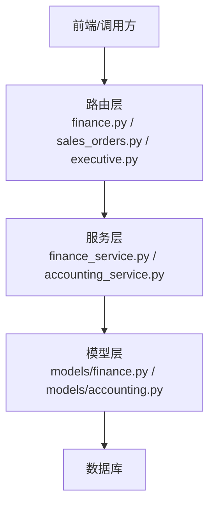
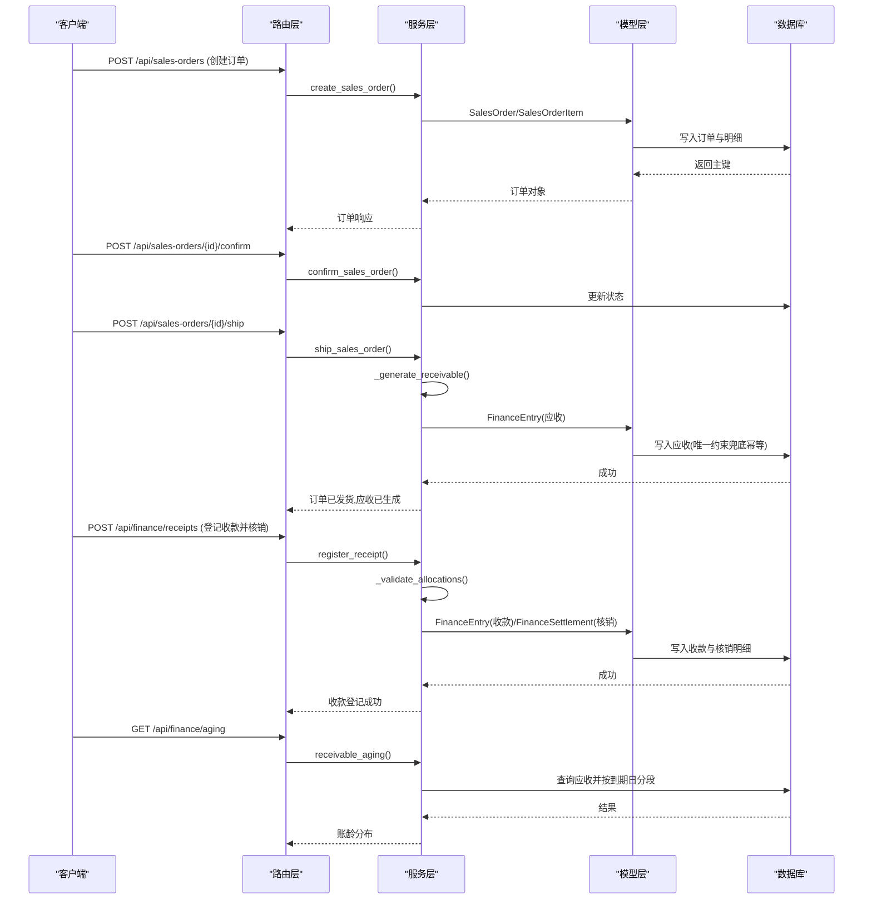
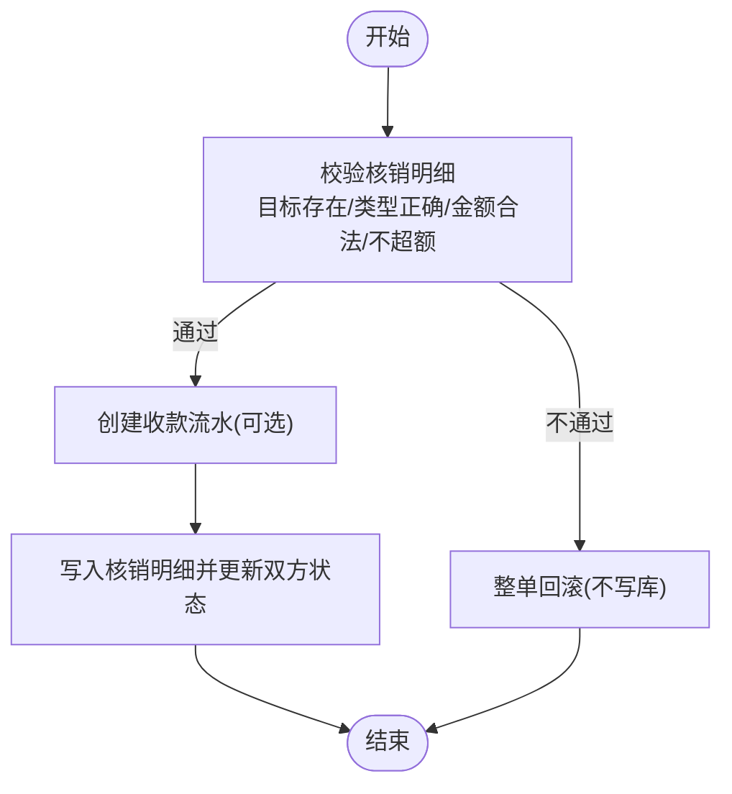
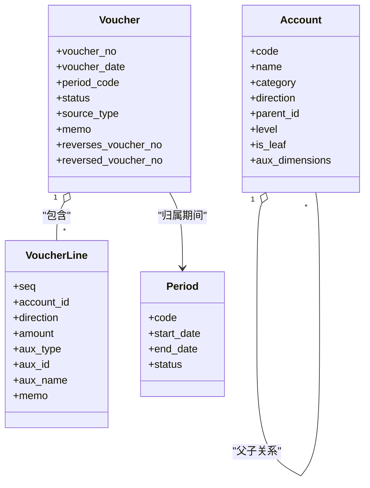
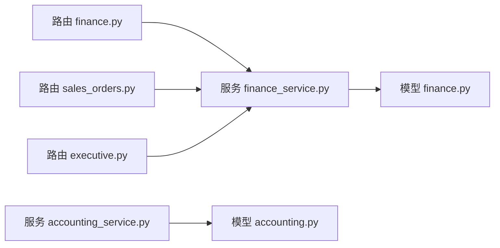

# 财务管理API

<cite>
**本文引用的文件**
- [backend-python/app/routers/finance.py](file://backend-python/app/routers/finance.py)
- [backend-python/app/routers/sales_orders.py](file://backend-python/app/routers/sales_orders.py)
- [backend-python/app/routers/executive.py](file://backend-python/app/routers/executive.py)
- [backend-python/app/services/finance_service.py](file://backend-python/app/services/finance_service.py)
- [backend-python/app/services/accounting_service.py](file://backend-python/app/services/accounting_service.py)
- [backend-python/app/schemas/finance.py](file://backend-python/app/schemas/finance.py)
- [backend-python/app/models/finance.py](file://backend-python/app/models/finance.py)
- [backend-python/app/models/accounting.py](file://backend-python/app/models/accounting.py)
- [backend-python/tests/test_finance_service.py](file://backend-python/tests/test_finance_service.py)
- [backend-python/tests/test_accounting_core.py](file://backend-python/tests/test_accounting_core.py)
</cite>

## 目录
1. [简介](#简介)
2. [项目结构](#项目结构)
3. [核心组件](#核心组件)
4. [架构总览](#架构总览)
5. [详细组件分析](#详细组件分析)
6. [依赖关系分析](#依赖关系分析)
7. [性能与一致性](#性能与一致性)
8. [故障排查指南](#故障排查指南)
9. [结论](#结论)
10. [附录：接口清单与示例流程](#附录接口清单与示例流程)

## 简介
本文件为WMS系统“财务管理API”的权威技术文档，覆盖应收应付管理、收款核销、账龄分析、经营驾驶舱指标以及会计内核（科目表、凭证生命周期、期间管理）等能力。重点说明业财一体的数据流转：从销售订单到财务应收的自动生成机制；财务流水记录、核销规则、财务报表生成；并给出完整的财务处理流程示例、会计分录生成方式与数据一致性保障策略。同时强调财务数据的准确性要求、审计追踪与合规性考虑。

## 项目结构
后端采用FastAPI路由层 + 服务层 + 模型层的分层设计：
- 路由层：暴露REST API，负责参数校验与响应封装
- 服务层：实现业务规则（订单状态机、应收生成、核销、账龄、驾驶舱指标、会计内核）
- 模型层：定义数据库表结构与关系（销售订单、财务流水、核销明细、会计科目、凭证、期间）

图表来源
- [backend-python/app/routers/finance.py:1-60](file://backend-python/app/routers/finance.py#L1-L60)
- [backend-python/app/routers/sales_orders.py:1-81](file://backend-python/app/routers/sales_orders.py#L1-L81)
- [backend-python/app/routers/executive.py:1-44](file://backend-python/app/routers/executive.py#L1-L44)
- [backend-python/app/services/finance_service.py:1-607](file://backend-python/app/services/finance_service.py#L1-L607)
- [backend-python/app/services/accounting_service.py:1-327](file://backend-python/app/services/accounting_service.py#L1-L327)
- [backend-python/app/models/finance.py:1-117](file://backend-python/app/models/finance.py#L1-L117)
- [backend-python/app/models/accounting.py:1-159](file://backend-python/app/models/accounting.py#L1-L159)

章节来源
- [backend-python/app/routers/finance.py:1-60](file://backend-python/app/routers/finance.py#L1-L60)
- [backend-python/app/routers/sales_orders.py:1-81](file://backend-python/app/routers/sales_orders.py#L1-L81)
- [backend-python/app/routers/executive.py:1-44](file://backend-python/app/routers/executive.py#L1-L44)

## 核心组件
- 销售订单与发货：支持草稿→确认→发货→完成/作废的状态机；发货时在同一事务内生成应收，保证“已发货必有应收”。
- 财务流水与核销：统一FinanceEntry承载应收/应付/收款/付款；支持部分核销、预收余额复用；FinanceSettlement记录核销明细。
- 账龄分析：以到期日为基准实时分段（未到期/逾期1-30/31-60/60+），不落库计算。
- 经营驾驶舱：汇总应收总额、已回款、未回款、逾期金额、订单数与订单金额，并提供TOP客户与趋势。
- 会计内核：科目树（COA）、凭证生命周期（草稿→过账→冲销）、期间管理（开放/关闭），确保借贷平衡与可审计。

章节来源
- [backend-python/app/services/finance_service.py:118-336](file://backend-python/app/services/finance_service.py#L118-L336)
- [backend-python/app/services/finance_service.py:341-439](file://backend-python/app/services/finance_service.py#L341-L439)
- [backend-python/app/services/finance_service.py:444-588](file://backend-python/app/services/finance_service.py#L444-L588)
- [backend-python/app/services/accounting_service.py:168-297](file://backend-python/app/services/accounting_service.py#L168-L297)

## 架构总览
下图展示从销售订单到财务应收、再到收款核销与报表的端到端流程。

图表来源
- [backend-python/app/routers/sales_orders.py:52-66](file://backend-python/app/routers/sales_orders.py#L52-L66)
- [backend-python/app/services/finance_service.py:246-336](file://backend-python/app/services/finance_service.py#L246-L336)
- [backend-python/app/routers/finance.py:39-52](file://backend-python/app/routers/finance.py#L39-L52)
- [backend-python/app/services/finance_service.py:411-439](file://backend-python/app/services/finance_service.py#L411-L439)
- [backend-python/app/routers/finance.py:32-36](file://backend-python/app/routers/finance.py#L32-L36)
- [backend-python/app/services/finance_service.py:479-506](file://backend-python/app/services/finance_service.py#L479-L506)

## 详细组件分析

### 销售订单与发货（业财触发点）
- 创建订单：校验客户与商品，计算总金额，生成唯一单号，落库订单与明细。
- 确认订单：仅允许草稿→已确认。
- 发货：已确认→已发货，并在同一事务内生成应收；若应收生成失败则整体回滚，避免“已发货无应收”中间态。
- 完成/作废：按状态机限制操作。

关键规则
- 应收在发货时生成，到期日=发货日期+账期。
- 幂等：通过(source_order_no, entry_type)唯一约束与IntegrityError兜底，防止并发重复生成。

章节来源
- [backend-python/app/routers/sales_orders.py:13-81](file://backend-python/app/routers/sales_orders.py#L13-L81)
- [backend-python/app/services/finance_service.py:118-290](file://backend-python/app/services/finance_service.py#L118-L290)
- [backend-python/app/services/finance_service.py:295-336](file://backend-python/app/services/finance_service.py#L295-L336)
- [backend-python/app/models/finance.py:26-67](file://backend-python/app/models/finance.py#L26-L67)

### 财务流水与核销（应收应付管理）
- 统一模型：FinanceEntry承载应收/应付/收款/付款，amount为发生额，settled_amount为已核销额，差额为未结余额（预收）。
- 核销规则：
  - 先校验后写入：目标存在、类型正确、金额为正、不超单张未结、合计不超可核销余额。
  - 支持部分核销与多次核销；收款可大于核销金额，差额保留为预收余额，后续可继续核销到其他应收。
  - 核销成功后更新收款与目标应收的状态（OPEN/PARTIAL/SETTLED）。
- 删除保护：已有核销记录的应收禁止删除。

图表来源
- [backend-python/app/services/finance_service.py:341-439](file://backend-python/app/services/finance_service.py#L341-L439)
- [backend-python/app/models/finance.py:71-117](file://backend-python/app/models/finance.py#L71-L117)

章节来源
- [backend-python/app/routers/finance.py:13-59](file://backend-python/app/routers/finance.py#L13-L59)
- [backend-python/app/services/finance_service.py:341-439](file://backend-python/app/services/finance_service.py#L341-L439)
- [backend-python/app/schemas/finance.py:61-97](file://backend-python/app/schemas/finance.py#L61-L97)

### 账龄分析与经营驾驶舱
- 账龄分析：以到期日为基准实时分段（未到期/逾期1-30/31-60/60+），不落库计算，按往来方汇总。
- 驾驶舱指标：
  - 应收总额、已回款、未回款、逾期金额
  - 订单数与订单金额
  - TOP客户欠款排行
  - 账龄分布
  - 近N日订单金额与回款金额趋势

章节来源
- [backend-python/app/services/finance_service.py:444-588](file://backend-python/app/services/finance_service.py#L444-L588)
- [backend-python/app/routers/executive.py:12-44](file://backend-python/app/routers/executive.py#L12-L44)
- [backend-python/app/schemas/finance.py:99-125](file://backend-python/app/schemas/finance.py#L99-L125)

### 会计内核（科目表、凭证、期间）
- 科目表（COA）：树状结构，仅明细科目可挂分录；新增子科目自动将父科目置为非明细；类别与方向需一致。
- 凭证生命周期：
  - 草稿→过账：过账时强制借贷平衡、至少两条分录、期间开放。
  - 过账后不可改删；更正使用红字冲销，双向关联原凭证。
- 期间管理：自然月期间，支持结账与反结账（倒序约束）。

图表来源
- [backend-python/app/models/accounting.py:63-159](file://backend-python/app/models/accounting.py#L63-L159)

章节来源
- [backend-python/app/services/accounting_service.py:30-94](file://backend-python/app/services/accounting_service.py#L30-L94)
- [backend-python/app/services/accounting_service.py:168-297](file://backend-python/app/services/accounting_service.py#L168-L297)
- [backend-python/app/models/accounting.py:63-159](file://backend-python/app/models/accounting.py#L63-L159)

## 依赖关系分析
- 路由层依赖服务层：finance.py、sales_orders.py、executive.py分别调用finance_service与accounting_service。
- 服务层依赖模型层：finance_service读写SalesOrder、FinanceEntry、FinanceSettlement；accounting_service读写Account、Voucher、VoucherLine、Period。
- 数据一致性：
  - 发货生成应收在同一事务中执行，失败则整体回滚。
  - 核销前只读校验，通过后一次性写入，避免脏数据。
  - 唯一约束与IntegrityError兜底保证幂等。

图表来源
- [backend-python/app/routers/finance.py:1-60](file://backend-python/app/routers/finance.py#L1-L60)
- [backend-python/app/routers/sales_orders.py:1-81](file://backend-python/app/routers/sales_orders.py#L1-L81)
- [backend-python/app/routers/executive.py:1-44](file://backend-python/app/routers/executive.py#L1-L44)
- [backend-python/app/services/finance_service.py:1-607](file://backend-python/app/services/finance_service.py#L1-L607)
- [backend-python/app/services/accounting_service.py:1-327](file://backend-python/app/services/accounting_service.py#L1-L327)
- [backend-python/app/models/finance.py:1-117](file://backend-python/app/models/finance.py#L1-L117)
- [backend-python/app/models/accounting.py:1-159](file://backend-python/app/models/accounting.py#L1-L159)

章节来源
- [backend-python/app/services/finance_service.py:246-336](file://backend-python/app/services/finance_service.py#L246-L336)
- [backend-python/app/services/finance_service.py:341-439](file://backend-python/app/services/finance_service.py#L341-L439)

## 性能与一致性
- 幂等与并发安全：
  - 应收生成通过(source_order_no, entry_type)唯一约束与异常兜底，避免并发重复。
  - 单号生成带重试机制，冲突时回滚并重试。
- 事务边界：
  - 发货→生成应收在同一事务，失败整体回滚。
  - 核销先校验再写入，避免部分落库。
- 金额精度：
  - 所有金额在服务层统一round(...,2)，减少浮点误差。
- 索引优化：
  - 对常用查询字段建立索引（如partner_name、entry_type、due_date等），提升列表与聚合性能。
- 账龄计算：
  - 实时计算不落库，避免额外存储开销与同步问题。

章节来源
- [backend-python/app/services/finance_service.py:45-60](file://backend-python/app/services/finance_service.py#L45-L60)
- [backend-python/app/services/finance_service.py:295-336](file://backend-python/app/services/finance_service.py#L295-L336)
- [backend-python/app/services/finance_service.py:341-439](file://backend-python/app/services/finance_service.py#L341-L439)
- [backend-python/app/models/finance.py:71-117](file://backend-python/app/models/finance.py#L71-L117)

## 故障排查指南
- 常见错误与定位：
  - 重复发货：抛出业务错误，不会新增应收。
  - 超额核销：校验失败整单回滚，不产生任何落库数据。
  - 非明细科目记账：拒绝保存，提示选择下级明细。
  - 过账后修改：拒绝修改或删除，需走红字冲销。
  - 期间关闭：拒绝写入凭证，需先反结账（倒序）。
- 调试建议：
  - 检查订单状态机是否满足前置条件。
  - 核对核销明细的目标应收是否存在且未结余额足够。
  - 查看凭证借贷是否平衡、分录数量是否≥2。
  - 确认期间是否开放。

章节来源
- [backend-python/app/services/finance_service.py:246-290](file://backend-python/app/services/finance_service.py#L246-L290)
- [backend-python/app/services/finance_service.py:341-439](file://backend-python/app/services/finance_service.py#L341-L439)
- [backend-python/app/services/accounting_service.py:168-297](file://backend-python/app/services/accounting_service.py#L168-L297)
- [backend-python/tests/test_finance_service.py:77-125](file://backend-python/tests/test_finance_service.py#L77-L125)
- [backend-python/tests/test_accounting_core.py:118-180](file://backend-python/tests/test_accounting_core.py#L118-L180)

## 结论
本财务管理API实现了从销售订单到财务应收的自动化生成、灵活的收款核销、实时的账龄分析与经营驾驶舱指标，并通过会计内核提供科目、凭证与期间的完整治理能力。系统在并发、幂等、事务、金额精度等方面具备完善的一致性保障，满足财务准确性、审计追踪与合规性要求。

## 附录：接口清单与示例流程

### 接口清单
- 销售订单
  - POST /api/sales-orders：创建销售订单（草稿）
  - GET /api/sales-orders：分页查询订单
  - GET /api/sales-orders/{order_id}：获取订单详情
  - PUT /api/sales-orders/{order_id}：编辑订单（仅草稿）
  - POST /api/sales-orders/{order_id}/confirm：确认订单
  - POST /api/sales-orders/{order_id}/ship：发货（自动生成应收）
  - POST /api/sales-orders/{order_id}/complete：完成订单
  - POST /api/sales-orders/{order_id}/cancel：作废订单
- 财务
  - GET /api/finance/receivables：应收/应付台账（支持逾期/未结筛选）
  - GET /api/finance/aging：账龄分布（按往来方）
  - POST /api/finance/receipts：登记收款并核销（可部分核销）
  - POST /api/finance/receipts/{receipt_id}/allocate：继续核销收款余额
  - DELETE /api/finance/receivables/{entry_id}：删除应收（有核销记录禁止）
- 经营驾驶舱
  - GET /api/executive/summary：应收/回款/逾期/订单指标
  - GET /api/executive/receivable-top：TOP客户欠款
  - GET /api/executive/aging-distribution：账龄分布汇总
  - GET /api/executive/trends：订单与回款趋势

章节来源
- [backend-python/app/routers/sales_orders.py:13-81](file://backend-python/app/routers/sales_orders.py#L13-L81)
- [backend-python/app/routers/finance.py:13-59](file://backend-python/app/routers/finance.py#L13-L59)
- [backend-python/app/routers/executive.py:12-44](file://backend-python/app/routers/executive.py#L12-L44)

### 完整流程示例（从订单到回款）
1. 创建销售订单（草稿），设置账期与明细。
2. 确认订单。
3. 发货：系统在同一事务内生成应收，到期日=发货日+账期。
4. 登记收款并核销：可部分核销，剩余作为预收余额。
5. 继续核销：将预收余额核销到其他应收。
6. 查询账龄与驾驶舱：验证指标一致性。

章节来源
- [backend-python/tests/test_finance_service.py:260-306](file://backend-python/tests/test_finance_service.py#L260-L306)

### 会计分录生成与审计追踪
- 会计分录由会计内核服务生成，遵循：
  - 仅明细科目可挂分录
  - 过账时借贷平衡校验
  - 过账后不可改删，更正使用红字冲销
  - 期间关闭后禁止写入
- 审计追踪：
  - 凭证状态机与双向冲销关联
  - 辅助核算维度（客户/供应商/仓库）留痕
  - 期间开放/关闭时间戳

章节来源
- [backend-python/app/services/accounting_service.py:168-297](file://backend-python/app/services/accounting_service.py#L168-L297)
- [backend-python/app/models/accounting.py:63-159](file://backend-python/app/models/accounting.py#L63-L159)
- [backend-python/tests/test_accounting_core.py:183-207](file://backend-python/tests/test_accounting_core.py#L183-L207)