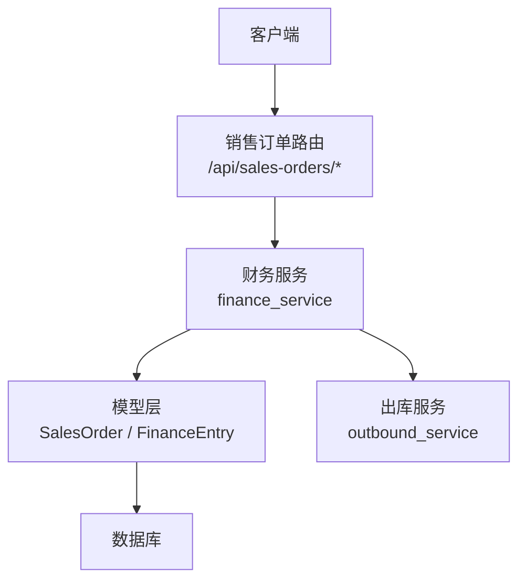
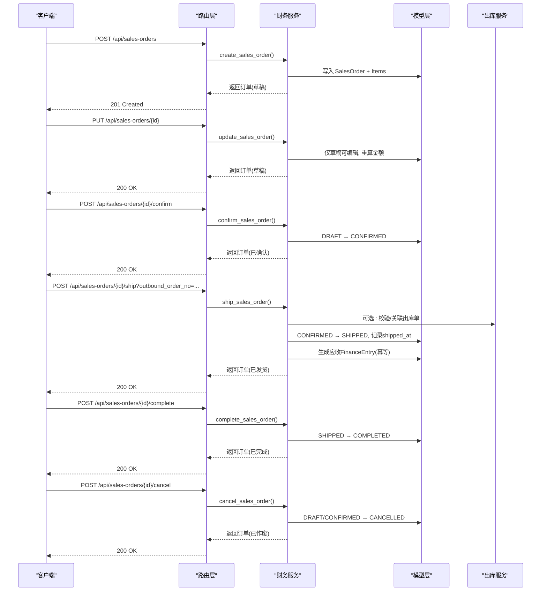
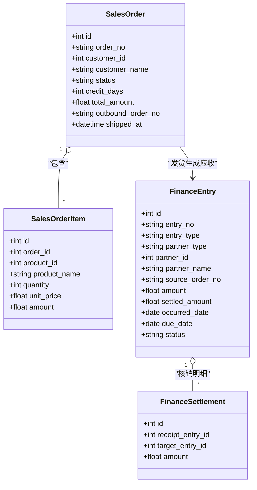

# 销售订单API

<cite>
**本文引用的文件**
- [sales_orders.py](file://backend-python/app/routers/sales_orders.py)
- [finance_service.py](file://backend-python/app/services/finance_service.py)
- [orders.py](file://backend-python/app/models/orders.py)
- [finance.py](file://backend-python/app/models/finance.py)
- [accounting.py](file://backend-python/app/models/accounting.py)
- [finance.py (schemas)](file://backend-python/app/schemas/finance.py)
- [base.py (schemas)](file://backend-python/app/schemas/base.py)
- [outbound_service.py](file://backend-python/app/services/outbound_service.py)
- [errors.py](file://backend-python/app/common/errors.py)
</cite>

## 目录
1. [简介](#简介)
2. [项目结构](#项目结构)
3. [核心组件](#核心组件)
4. [架构总览](#架构总览)
5. [详细组件分析](#详细组件分析)
6. [依赖关系分析](#依赖关系分析)
7. [性能考虑](#性能考虑)
8. [故障排查指南](#故障排查指南)
9. [结论](#结论)
10. [附录：接口清单与数据模型](#附录接口清单与数据模型)

## 简介
本文件为WMS系统的“销售订单”模块API文档，覆盖销售订单的创建、修改、确认、发货（自动生成应收）、完成、作废等全生命周期管理；说明订单状态流转、订单行项目管理、订单与出库单的关联关系；并提供查询、统计报表、历史趋势等辅助能力。重点阐述订单与财务应收的自动关联机制及数据完整性保障策略。

## 项目结构
销售订单相关代码主要分布在以下位置：
- API路由层：定义HTTP端点，接收请求并调用服务层
- 服务层：实现业务规则、状态机、金额计算、应收生成与核销
- 模型层：定义数据库表结构与关系
- Schema层：定义请求/响应数据结构与校验规则
- 出库服务：提供库存锁定与扣减能力，供订单发货时联动

图表来源
- [sales_orders.py:13-80](file://backend-python/app/routers/sales_orders.py#L13-L80)
- [finance_service.py:118-290](file://backend-python/app/services/finance_service.py#L118-L290)
- [finance.py:26-117](file://backend-python/app/models/finance.py#L26-L117)
- [outbound_service.py:42-196](file://backend-python/app/services/outbound_service.py#L42-L196)

章节来源
- [sales_orders.py:1-81](file://backend-python/app/routers/sales_orders.py#L1-L81)
- [finance_service.py:1-607](file://backend-python/app/services/finance_service.py#L1-L607)
- [finance.py:26-117](file://backend-python/app/models/finance.py#L26-L117)
- [outbound_service.py:1-196](file://backend-python/app/services/outbound_service.py#L1-L196)

## 核心组件
- 路由层：暴露销售订单CRUD与状态变更端点，统一返回code/message/data格式
- 服务层：封装订单状态机、金额重算、应收生成、收款登记与核销、账龄与驾驶舱聚合
- 模型层：销售订单、订单明细、财务流水、核销明细、会计凭证等
- Schema层：订单创建/更新/发货请求体、响应体、核销分配等
- 出库服务：提供库存锁定、复核、发货扣减能力，支持订单与出库单关联

章节来源
- [sales_orders.py:13-80](file://backend-python/app/routers/sales_orders.py#L13-L80)
- [finance_service.py:118-290](file://backend-python/app/services/finance_service.py#L118-L290)
- [finance.py:26-117](file://backend-python/app/models/finance.py#L26-L117)
- [finance.py (schemas):11-57](file://backend-python/app/schemas/finance.py#L11-L57)
- [outbound_service.py:42-196](file://backend-python/app/services/outbound_service.py#L42-L196)

## 架构总览
销售订单从草稿到完成的完整流程如下：

图表来源
- [sales_orders.py:13-80](file://backend-python/app/routers/sales_orders.py#L13-L80)
- [finance_service.py:118-290](file://backend-python/app/services/finance_service.py#L118-L290)
- [finance.py:26-117](file://backend-python/app/models/finance.py#L26-L117)
- [outbound_service.py:42-196](file://backend-python/app/services/outbound_service.py#L42-L196)

## 详细组件分析

### 销售订单路由层
- 创建订单：POST /api/sales-orders，入参包含客户、账期、明细（商品ID、数量、单价），服务端汇总计算总金额，返回201
- 列表查询：GET /api/sales-orders，支持按状态、客户、关键字分页
- 获取详情：GET /api/sales-orders/{order_id}
- 编辑订单：PUT /api/sales-orders/{order_id}，仅草稿可编辑，明细整体替换并重算金额
- 确认订单：POST /api/sales-orders/{order_id}/confirm，DRAFT → CONFIRMED
- 发货：POST /api/sales-orders/{order_id}/ship，可选传入出库单号；CONFIRMED → SHIPPED，同时生成应收（幂等）
- 完成：POST /api/sales-orders/{order_id}/complete，SHIPPED → COMPLETED
- 作废：POST /api/sales-orders/{order_id}/cancel，仅DRAFT/CONFIRMED可作废

章节来源
- [sales_orders.py:13-80](file://backend-python/app/routers/sales_orders.py#L13-L80)

### 订单状态机与业务约束
- 状态集合：DRAFT、CONFIRMED、SHIPPED、COMPLETED、CANCELLED
- 关键约束：
  - 仅草稿可编辑
  - 仅草稿可确认
  - 仅已确认可发货；发货后不可重复发货
  - 仅已发货可完成
  - 仅草稿/已确认可作废；已发货后不可作废
- 金额计算：订单总金额 = Σ(数量 × 单价)，保留两位小数
- 发货时间：记录shipped_at，用于应收到期日计算
- 出库单关联：outbound_order_no可空，预留一期关联

章节来源
- [finance_service.py:198-290](file://backend-python/app/services/finance_service.py#L198-L290)
- [finance.py:26-67](file://backend-python/app/models/finance.py#L26-L67)

### 订单行项目管理
- 明细字段：商品ID、商品名称（冗余留痕）、数量、单价、金额
- 创建/更新时校验：
  - 至少一条明细
  - 商品存在性校验
  - 数量>0、单价≥0
- 更新明细时整体替换旧明细，重新计算总金额

章节来源
- [finance_service.py:118-163](file://backend-python/app/services/finance_service.py#L118-L163)
- [finance_service.py:198-232](file://backend-python/app/services/finance_service.py#L198-L232)
- [finance.py (schemas):11-57](file://backend-python/app/schemas/finance.py#L11-L57)

### 订单与出库单的关联关系
- 发货时可传入出库单号，用于追溯出库来源
- 出库服务提供库存锁定、复核、发货扣减能力，确保发货前库存可用
- 若需要强一致，可在发货前调用出库服务进行库存预占或校验（当前设计为发货时生成应收，出库单号为可选关联）

章节来源
- [sales_orders.py:59-66](file://backend-python/app/routers/sales_orders.py#L59-L66)
- [finance_service.py:246-268](file://backend-python/app/services/finance_service.py#L246-L268)
- [outbound_service.py:102-176](file://backend-python/app/services/outbound_service.py#L102-L176)

### 订单与财务应收的自动关联机制
- 触发时机：订单发货（CONFIRMED → SHIPPED）
- 生成逻辑：
  - 同一订单只能生成一条应收（幂等）
  - 发生日期为发货日期，到期日为发货日期+账期
  - 使用唯一约束(source_order_no, entry_type)防止并发重复
- 失败回滚：应收生成失败则整单发货回滚，避免“已发货无应收”中间态
- 后续核销：支持部分核销，收款金额可大于核销金额，差额为未核销余额（预收）

章节来源
- [finance_service.py:246-336](file://backend-python/app/services/finance_service.py#L246-L336)
- [finance.py:71-117](file://backend-python/app/models/finance.py#L71-L117)

### 订单查询、统计报表与历史
- 订单列表：支持按状态、客户、关键字分页查询
- 经营驾驶舱：
  - 应收总额、已收总额、未结清总额、逾期总额
  - 订单数与订单金额（排除作废）
- 账龄分布：按到期日分段（未到期、1-30天、31-60天、60天以上）
- 趋势图：近N天订单金额与回款金额趋势

章节来源
- [finance_service.py:177-195](file://backend-python/app/services/finance_service.py#L177-L195)
- [finance_service.py:511-588](file://backend-python/app/services/finance_service.py#L511-L588)

### 数据验证规则与错误处理
- 输入校验：通过Pydantic Schema进行字段类型、范围、必填项校验
- 业务异常：BusinessError携带HTTP状态码，由全局异常处理器统一转换
- 常见错误：
  - 客户不存在、商品不存在
  - 订单状态不允许操作
  - 重复发货、重复应收
  - 核销金额超过未结余额

章节来源
- [finance.py (schemas):11-57](file://backend-python/app/schemas/finance.py#L11-L57)
- [errors.py:4-9](file://backend-python/app/common/errors.py#L4-L9)
- [finance_service.py:118-163](file://backend-python/app/services/finance_service.py#L118-L163)
- [finance_service.py:341-439](file://backend-python/app/services/finance_service.py#L341-L439)

## 依赖关系分析
- 路由层依赖服务层：路由仅做参数绑定与响应包装
- 服务层依赖模型层：读写数据库实体，维护状态机与业务规则
- 服务层依赖出库服务：发货时可联动库存锁定与扣减
- 模型层之间关系：
  - SalesOrder ↔ SalesOrderItem（一对多）
  - FinanceEntry ↔ FinanceSettlement（一对多）
  - SalesOrder → FinanceEntry（通过source_order_no关联）

图表来源
- [finance.py:26-117](file://backend-python/app/models/finance.py#L26-L117)

章节来源
- [finance.py:26-117](file://backend-python/app/models/finance.py#L26-L117)
- [finance_service.py:246-336](file://backend-python/app/services/finance_service.py#L246-L336)

## 性能考虑
- 列表查询使用joinedload一次性加载明细与关联商品，避免N+1查询
- 金额计算在服务层统一round(...,2)，减少浮点误差
- 应收生成采用三层幂等：服务层预查、DB唯一约束、IntegrityError兜底
- 分页查询限制page_size上限，避免大结果集拖慢响应

章节来源
- [finance_service.py:177-195](file://backend-python/app/services/finance_service.py#L177-L195)
- [finance_service.py:295-336](file://backend-python/app/services/finance_service.py#L295-L336)

## 故障排查指南
- 订单无法编辑：检查当前状态是否为草稿
- 订单无法确认：检查当前状态是否为草稿
- 订单无法发货：检查当前状态是否为已确认；若重复发货会报错
- 应收生成失败：检查是否已存在应收（并发冲突），或服务层异常导致回滚
- 核销失败：检查目标应收是否存在、类型是否正确、核销金额是否超过未结余额
- 出库失败：检查库存是否充足、库位是否存在

章节来源
- [finance_service.py:198-290](file://backend-python/app/services/finance_service.py#L198-L290)
- [finance_service.py:341-439](file://backend-python/app/services/finance_service.py#L341-L439)
- [outbound_service.py:42-196](file://backend-python/app/services/outbound_service.py#L42-L196)
- [errors.py:4-9](file://backend-python/app/common/errors.py#L4-L9)

## 结论
本销售订单API实现了从草稿到完成的全生命周期管理，并通过发货动作自动生成应收，保证业财一体的一致性。通过严格的状态机、幂等设计与数据校验，确保了订单数据的完整性与可靠性。同时提供查询、统计与趋势分析能力，支撑运营决策。

## 附录：接口清单与数据模型

### 接口清单
- 创建订单：POST /api/sales-orders
- 列表查询：GET /api/sales-orders
- 获取详情：GET /api/sales-orders/{order_id}
- 编辑订单：PUT /api/sales-orders/{order_id}
- 确认订单：POST /api/sales-orders/{order_id}/confirm
- 发货：POST /api/sales-orders/{order_id}/ship
- 完成：POST /api/sales-orders/{order_id}/complete
- 作废：POST /api/sales-orders/{order_id}/cancel

章节来源
- [sales_orders.py:13-80](file://backend-python/app/routers/sales_orders.py#L13-L80)

### 数据模型
- 销售订单主表：SalesOrder
- 销售订单明细：SalesOrderItem
- 财务流水：FinanceEntry
- 核销明细：FinanceSettlement
- 会计凭证（扩展）：Voucher、VoucherLine

章节来源
- [finance.py:26-117](file://backend-python/app/models/finance.py#L26-L117)
- [accounting.py:63-159](file://backend-python/app/models/accounting.py#L63-L159)