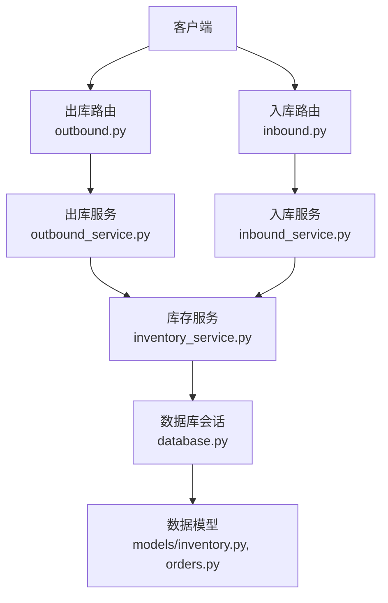
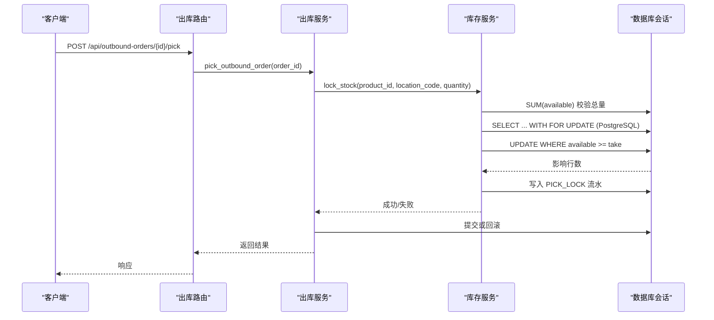
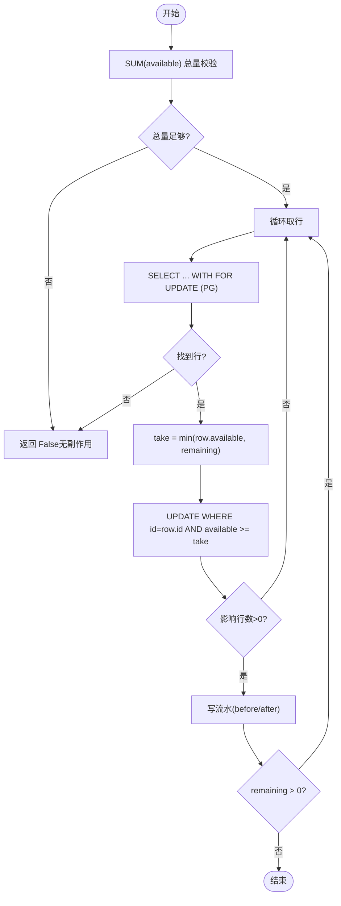
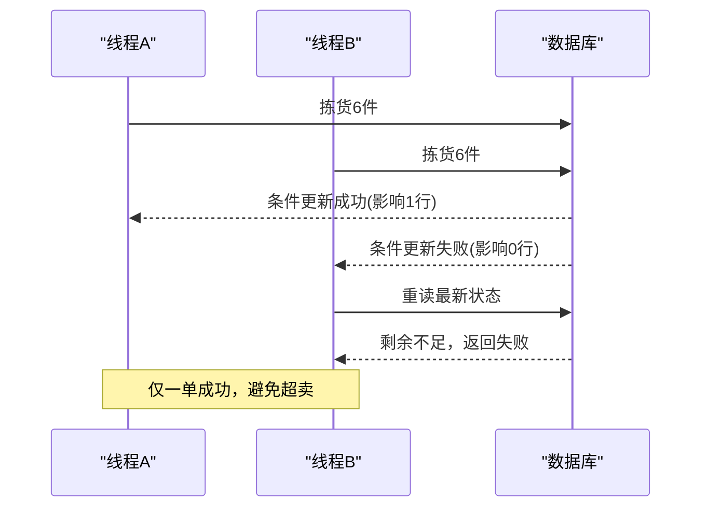
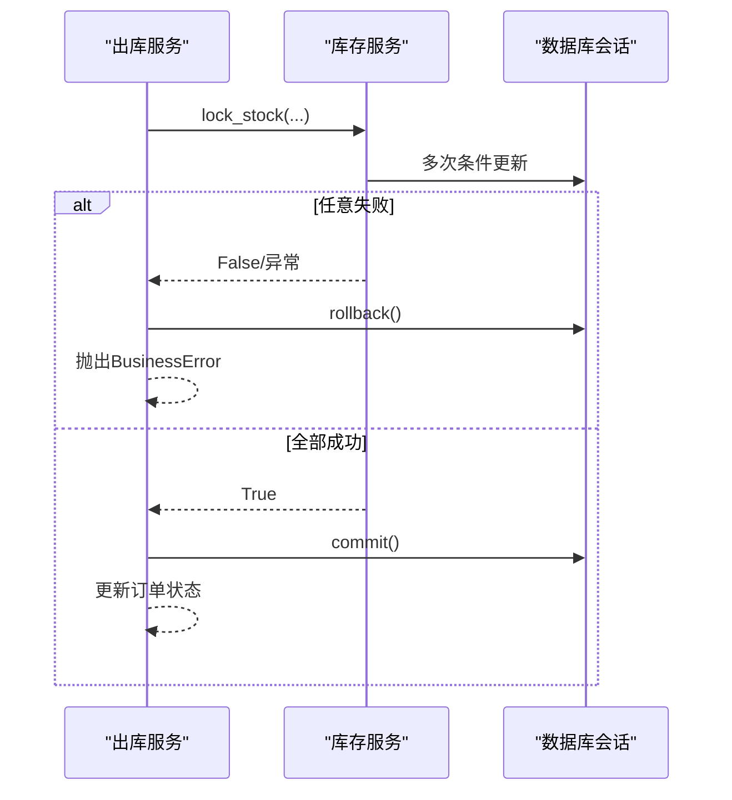
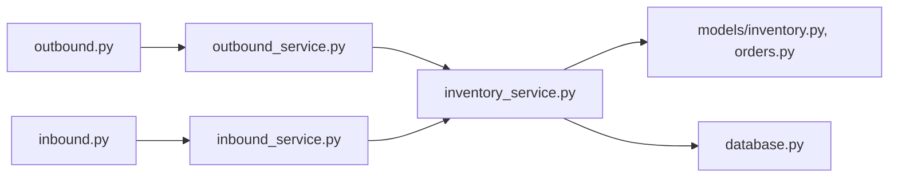

# 并发安全和数据一致性

<cite>
**本文引用的文件**
- [backend-python/app/database.py](file://backend-python/app/database.py)
- [backend-python/app/models/inventory.py](file://backend-python/app/models/inventory.py)
- [backend-python/app/services/inventory_service.py](file://backend-python/app/services/inventory_service.py)
- [backend-python/app/services/outbound_service.py](file://backend-python/app/services/outbound_service.py)
- [backend-python/app/services/inbound_service.py](file://backend-python/app/services/inbound_service.py)
- [backend-python/app/routers/outbound.py](file://backend-python/app/routers/outbound.py)
- [backend-python/app/routers/inbound.py](file://backend-python/app/routers/inbound.py)
- [backend-python/tests/test_outbound_service.py](file://backend-python/tests/test_outbound_service.py)
- [backend-python/tests/test_inventory_service.py](file://backend-python/tests/test_inventory_service.py)
</cite>

## 目录
1. [引言](#引言)
2. [项目结构](#项目结构)
3. [核心组件](#核心组件)
4. [架构总览](#架构总览)
5. [详细组件分析](#详细组件分析)
6. [依赖关系分析](#依赖关系分析)
7. [性能考虑](#性能考虑)
8. [故障排查指南](#故障排查指南)
9. [结论](#结论)
10. [附录](#附录)

## 引言
本文件聚焦WMS系统的并发安全与数据一致性，围绕库存并发控制、防超卖策略、事务与回滚机制、跨数据库行为差异（SQLite与PostgreSQL）以及性能优化建议展开。文档基于仓库中库存服务、出库/入库服务、模型与测试代码进行系统化梳理，帮助读者理解在并发场景下如何保证整单操作的原子性与最终一致性。

## 项目结构
后端采用FastAPI路由层调用业务服务，服务层封装库存操作与单据状态机流转；数据访问通过SQLAlchemy会话完成，默认使用SQLite，支持通过环境变量切换至MySQL/PostgreSQL。库存相关的数据模型包括批次、库存行与流水表，确保每次变动可追溯。

**图表来源**
- [backend-python/app/routers/outbound.py:13-42](file://backend-python/app/routers/outbound.py#L13-L42)
- [backend-python/app/routers/inbound.py:13-26](file://backend-python/app/routers/inbound.py#L13-L26)
- [backend-python/app/services/outbound_service.py:102-176](file://backend-python/app/services/outbound_service.py#L102-L176)
- [backend-python/app/services/inbound_service.py:92-129](file://backend-python/app/services/inbound_service.py#L92-L129)
- [backend-python/app/services/inventory_service.py:91-251](file://backend-python/app/services/inventory_service.py#L91-L251)
- [backend-python/app/database.py:1-38](file://backend-python/app/database.py#L1-L38)
- [backend-python/app/models/inventory.py:18-98](file://backend-python/app/models/inventory.py#L18-L98)

**章节来源**
- [backend-python/app/database.py:1-38](file://backend-python/app/database.py#L1-L38)
- [backend-python/app/models/inventory.py:18-98](file://backend-python/app/models/inventory.py#L18-L98)

## 核心组件
- 库存服务：提供增加库存、扣减可用库存、拣货锁定、发货扣减等核心能力，所有变更均写流水，支持跨批次FIFO扣减与条件更新重试。
- 出库服务：实现出库单状态机（PENDING→PICKED→REVIEWED→SHIPPED），在拣货与发货阶段分别调用库存服务进行锁定与扣减，并在失败时整体回滚。
- 入库服务：创建入库单不改变库存，收货上架时生成批次并累加可用库存，写流水，整流程在一个事务内。
- 数据模型：批次、库存行（可用量与锁定量分离）、库存流水；库存行具备唯一约束与常用索引，保障查询与并发安全。
- 数据库配置：默认SQLite，生产可通过DATABASE_URL切换至MySQL/PostgreSQL；会话由FastAPI依赖注入。

**章节来源**
- [backend-python/app/services/inventory_service.py:1-31](file://backend-python/app/services/inventory_service.py#L1-L31)
- [backend-python/app/services/outbound_service.py:1-20](file://backend-python/app/services/outbound_service.py#L1-L20)
- [backend-python/app/services/inbound_service.py:1-15](file://backend-python/app/services/inbound_service.py#L1-L15)
- [backend-python/app/models/inventory.py:33-98](file://backend-python/app/models/inventory.py#L33-L98)
- [backend-python/app/database.py:5-24](file://backend-python/app/database.py#L5-L24)

## 架构总览
库存并发控制的核心在于“读-锁-写”的原子性保障与“条件更新+失败重读”的重试策略。出库流程将库存从可用转为锁定，再在发货时扣减锁定库存；入库流程在收货时直接增加可用库存。所有关键路径都置于事务中，任一环节失败则整体回滚，保证整单原子性。

**图表来源**
- [backend-python/app/routers/outbound.py:21-26](file://backend-python/app/routers/outbound.py#L21-L26)
- [backend-python/app/services/outbound_service.py:102-133](file://backend-python/app/services/outbound_service.py#L102-L133)
- [backend-python/app/services/inventory_service.py:147-202](file://backend-python/app/services/inventory_service.py#L147-L202)
- [backend-python/app/database.py:31-38](file://backend-python/app/database.py#L31-L38)

## 详细组件分析

### 库存并发控制机制
- 行级SELECT ... FOR UPDATE：在PostgreSQL下对选中的库存行加排他锁，防止并发覆盖；SQLite忽略该提示，但通过后续条件UPDATE仍能保证一致性。
- 条件UPDATE：以“available >= take”作为更新条件，只有当当前行可用量足够时才生效，避免陈旧读导致的超卖。
- 失败重读重试：若条件更新影响行数为0，说明该行已被其他事务修改，循环重新读取最新状态继续扣减，直至满足需求或确认不足。
- 跨批次FIFO：按库存行ID升序选择，优先扣早期批次，符合先进先出策略。

**图表来源**
- [backend-python/app/services/inventory_service.py:91-144](file://backend-python/app/services/inventory_service.py#L91-L144)
- [backend-python/app/services/inventory_service.py:147-202](file://backend-python/app/services/inventory_service.py#L147-L202)

**章节来源**
- [backend-python/app/services/inventory_service.py:91-202](file://backend-python/app/services/inventory_service.py#L91-L202)

### 防超卖策略与测试覆盖
- 双保险：先做总量SUM校验，不足直接拒绝；逐行条件更新，即使SQLite无行锁也能避免覆盖已提交的扣减。
- 并发测试：通过多线程同时发起两笔各需6件的拣货请求，验证最多一单成功且账面库存守恒（available + locked 不变）。
- 边界用例：库存不足拒绝、未复核不可发货、多明细部分不足整单回滚等。

**图表来源**
- [backend-python/tests/test_outbound_service.py:170-216](file://backend-python/tests/test_outbound_service.py#L170-L216)

**章节来源**
- [backend-python/tests/test_outbound_service.py:170-216](file://backend-python/tests/test_outbound_service.py#L170-L216)
- [backend-python/tests/test_inventory_service.py:53-109](file://backend-python/tests/test_inventory_service.py#L53-L109)

### 事务处理与回滚机制
- 出库拣货：聚合明细后逐行调用lock_stock，任一失败抛出业务异常并触发db.rollback()，保证整单原子性。
- 出库发货：同理，逐行ship_stock失败则整体回滚。
- 入库收货：生成批次、累加库存、写流水，全部在同一事务中，任一步失败整体回滚。
- 单号冲突重试：创建订单时使用有限次重试应对唯一约束冲突。

**图表来源**
- [backend-python/app/services/outbound_service.py:113-133](file://backend-python/app/services/outbound_service.py#L113-L133)
- [backend-python/app/services/outbound_service.py:156-176](file://backend-python/app/services/outbound_service.py#L156-L176)
- [backend-python/app/services/inbound_service.py:92-129](file://backend-python/app/services/inbound_service.py#L92-L129)

**章节来源**
- [backend-python/app/services/outbound_service.py:102-176](file://backend-python/app/services/outbound_service.py#L102-L176)
- [backend-python/app/services/inbound_service.py:92-129](file://backend-python/app/services/inbound_service.py#L92-L129)

### SQLite与PostgreSQL行为差异
- PostgreSQL：
  - SELECT ... WITH FOR UPDATE 有效，对选中行加排他锁，串行化并发访问。
  - 条件UPDATE进一步保证幂等与一致性。
- SQLite：
  - WITH FOR UPDATE 被忽略，但条件UPDATE仍可避免覆盖已提交的变更。
  - 并发写可能触发OperationalError（写锁冲突），测试中捕获并视为失败分支。
- 建议：
  - 生产环境建议使用PostgreSQL以获得更强的行级锁语义与更好的并发性能。
  - 在SQLite环境下仍需依赖条件更新与重试逻辑保证正确性。

**章节来源**
- [backend-python/app/services/inventory_service.py:123-136](file://backend-python/app/services/inventory_service.py#L123-L136)
- [backend-python/app/services/inventory_service.py:178-194](file://backend-python/app/services/inventory_service.py#L178-L194)
- [backend-python/tests/test_outbound_service.py:184-197](file://backend-python/tests/test_outbound_service.py#L184-L197)
- [backend-python/app/database.py:5-24](file://backend-python/app/database.py#L5-L24)

### 数据一致性保证
- 可用量与锁定量分离：避免同一库存被重复扣减，拣货阶段只转移可用到锁定，发货阶段才真正扣减。
- 全量流水：每次库存变动记录before/after数量，便于对账与审计。
- 唯一约束与索引：库存行按(product_id, location_code, batch_id)唯一，常用查询列建立索引，减少扫描与竞争。
- 整单原子：服务层在失败时显式rollback，确保不会留下半成品状态。

**章节来源**
- [backend-python/app/models/inventory.py:33-98](file://backend-python/app/models/inventory.py#L33-L98)
- [backend-python/app/services/inventory_service.py:57-88](file://backend-python/app/services/inventory_service.py#L57-L88)
- [backend-python/tests/test_outbound_service.py:147-168](file://backend-python/tests/test_outbound_service.py#L147-L168)

## 依赖关系分析
- 路由层依赖服务层：FastAPI路由调用对应service方法，传递Session。
- 服务层依赖库存服务：出库/入库服务通过inventory_service统一入口进行库存变更。
- 库存服务依赖模型与会话：通过SQLAlchemy ORM/原生SQL执行查询与更新，写流水。
- 数据库配置集中管理：engine与sessionmaker在database.py定义，get_db为FastAPI依赖注入提供会话。

**图表来源**
- [backend-python/app/routers/outbound.py:13-42](file://backend-python/app/routers/outbound.py#L13-L42)
- [backend-python/app/routers/inbound.py:13-26](file://backend-python/app/routers/inbound.py#L13-L26)
- [backend-python/app/services/outbound_service.py:102-176](file://backend-python/app/services/outbound_service.py#L102-L176)
- [backend-python/app/services/inbound_service.py:92-129](file://backend-python/app/services/inbound_service.py#L92-L129)
- [backend-python/app/services/inventory_service.py:91-251](file://backend-python/app/services/inventory_service.py#L91-L251)
- [backend-python/app/database.py:31-38](file://backend-python/app/database.py#L31-L38)

**章节来源**
- [backend-python/app/routers/outbound.py:13-42](file://backend-python/app/routers/outbound.py#L13-L42)
- [backend-python/app/routers/inbound.py:13-26](file://backend-python/app/routers/inbound.py#L13-L26)
- [backend-python/app/services/outbound_service.py:102-176](file://backend-python/app/services/outbound_service.py#L102-L176)
- [backend-python/app/services/inbound_service.py:92-129](file://backend-python/app/services/inbound_service.py#L92-L129)
- [backend-python/app/services/inventory_service.py:91-251](file://backend-python/app/services/inventory_service.py#L91-L251)
- [backend-python/app/database.py:31-38](file://backend-python/app/database.py#L31-L38)

## 性能考虑
- 批量聚合：出库服务对同一商品+库位的明细进行聚合，减少重复的库存行操作。
- 索引优化：库存行与流水表针对常用过滤字段建立索引，降低扫描成本。
- N+1问题规避：查询中使用joinedload一次性加载关联对象，避免响应组装时的多次查询。
- 分页与限制：列表接口使用offset/limit控制返回规模，避免大结果集拖慢系统。
- 数据库选择：生产建议使用PostgreSQL以获得更好的并发与锁语义；SQLite适合开发测试。

[本节为通用性能建议，不直接分析具体文件]

## 故障排查指南
- 常见错误类型：
  - 业务异常：库存不足、状态不允许、商品/库位不存在等，携带HTTP状态码。
  - 数据库异常：SQLite写锁冲突（OperationalError），测试中捕获并视为失败分支。
- 排查步骤：
  - 检查库存流水是否完整，核对before/after数量是否一致。
  - 查看订单状态机是否符合预期，是否存在非法状态跳转。
  - 在高并发场景下关注条件更新的影响行数与重试次数。
  - 在生产环境切换至PostgreSQL，观察WITH FOR UPDATE的效果与锁等待情况。

**章节来源**
- [backend-python/app/common/errors.py:4-9](file://backend-python/app/common/errors.py#L4-L9)
- [backend-python/tests/test_outbound_service.py:184-197](file://backend-python/tests/test_outbound_service.py#L184-L197)
- [backend-python/tests/test_outbound_service.py:122-136](file://backend-python/tests/test_outbound_service.py#L122-L136)

## 结论
本WMS系统在库存并发控制上采用了“总量校验+行级锁（PG）+条件更新+失败重读”的组合策略，结合全量流水与整单事务回滚，有效避免了超卖与数据不一致问题。测试覆盖了关键并发场景与边界用例。建议在生产环境使用PostgreSQL以获得更可靠的行级锁语义与更好的并发性能；同时在应用层保持条件更新与重试逻辑，确保跨数据库的一致性。

[本节为总结性内容，不直接分析具体文件]

## 附录
- 关键流程参考：
  - 库存扣减与锁定：[deduct_stock:91-144](file://backend-python/app/services/inventory_service.py#L91-L144)、[lock_stock:147-202](file://backend-python/app/services/inventory_service.py#L147-L202)
  - 出库状态机：[pick/review/ship:102-176](file://backend-python/app/services/outbound_service.py#L102-L176)
  - 入库收货流程：[receive_inbound_order:92-129](file://backend-python/app/services/inbound_service.py#L92-L129)
  - 并发防超卖测试：[test_concurrent_pick_no_oversell:170-216](file://backend-python/tests/test_outbound_service.py#L170-L216)

[本节为导航性内容，不直接分析具体文件]