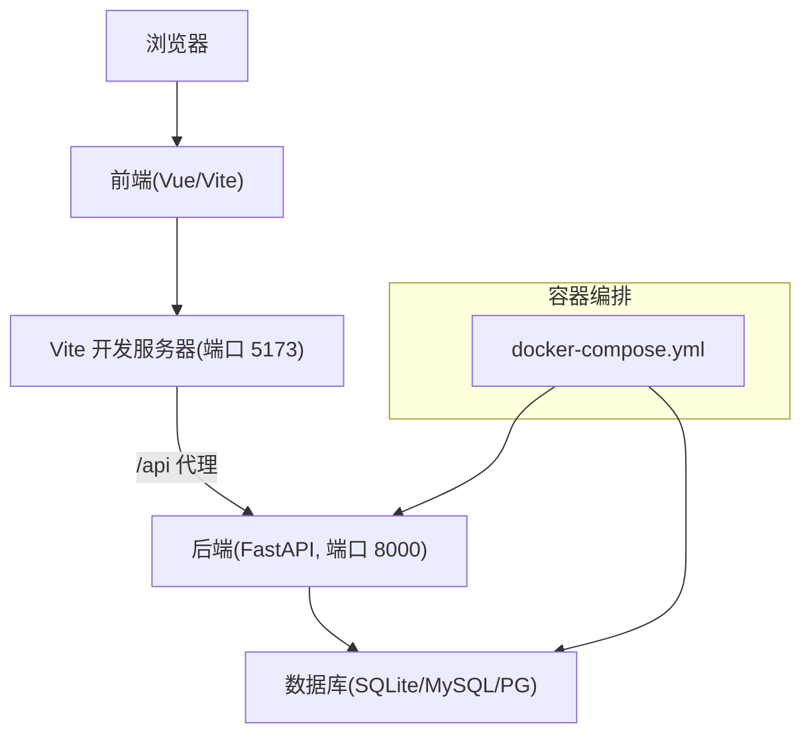
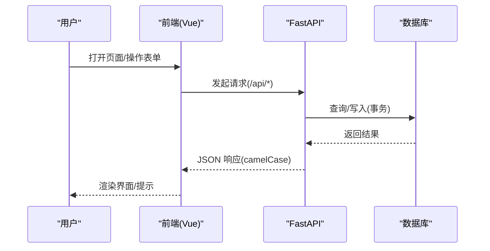
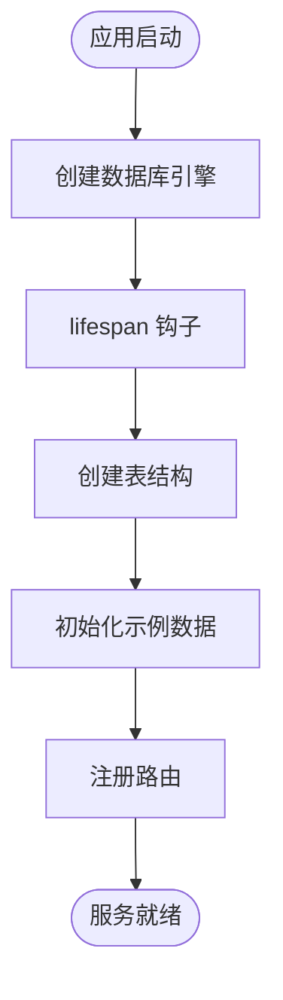
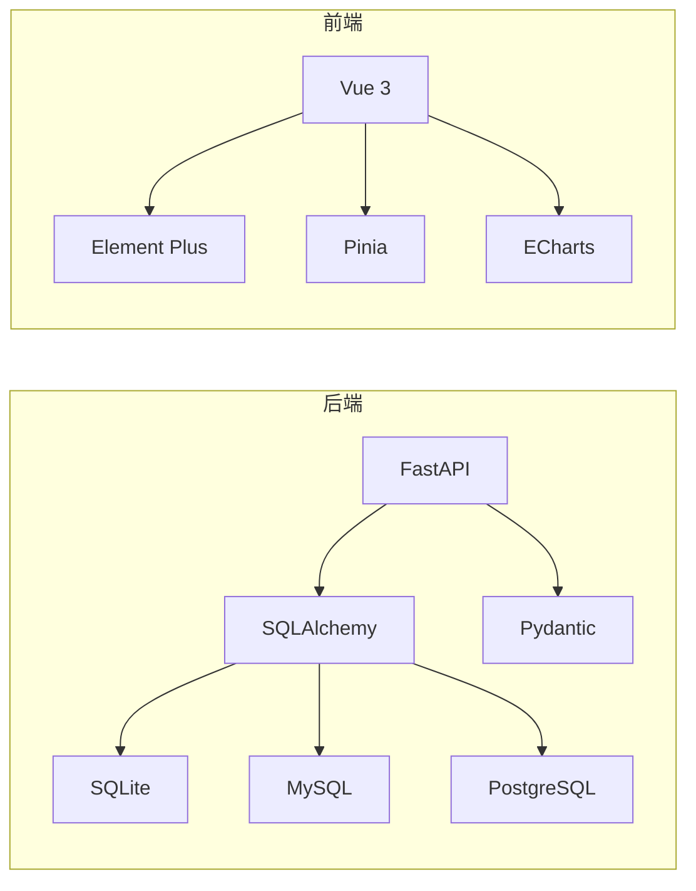

# 开发指南

<cite>
**本文引用的文件**
- [README.md](file://README.md)
- [NOTES.md](file://NOTES.md)
- [docker-compose.yml](file://docker-compose.yml)
- [backend-python/app/main.py](file://backend-python/app/main.py)
- [backend-python/app/database.py](file://backend-python/app/database.py)
- [backend-python/pyproject.toml](file://backend-python/pyproject.toml)
- [frontend-vue/package.json](file://frontend-vue/package.json)
- [frontend-vue/vite.config.ts](file://frontend-vue/vite.config.ts)
- [frontend-vue/src/main.ts](file://frontend-vue/src/main.ts)
- [frontend-vue/playwright.config.ts](file://frontend-vue/playwright.config.ts)
- [.github/workflows/ci.yml](file://.github/workflows/ci.yml)
- [docs/PRD.md](file://docs/PRD.md)
</cite>

## 目录
1. [简介](#简介)
2. [项目结构](#项目结构)
3. [核心组件](#核心组件)
4. [架构总览](#架构总览)
5. [详细组件分析](#详细组件分析)
6. [依赖分析](#依赖分析)
7. [性能考虑](#性能考虑)
8. [故障排查指南](#故障排查指南)
9. [结论](#结论)
10. [附录：快速上手与命令速查](#附录快速上手与命令速查)

## 简介
本指南面向新加入的开发者，提供 WMS（进销存 + 业财一体）系统的环境搭建、配置说明、开发规范、调试与排障方法、常用命令与工具链、性能优化建议、依赖与版本管理策略，以及 AI 辅助开发的提示词与最佳实践。目标是让新成员在最短时间完成本地环境搭建、理解整体架构、按规范高效开发与联调。

## 项目结构
仓库采用前后端分离与容器化编排：
- 后端：Python + FastAPI，使用 SQLAlchemy 2.0 与 Pydantic v2，默认 SQLite 零配置，支持切换 MySQL/PostgreSQL。
- 前端：Vue 3 + TypeScript + Element Plus + Pinia + Vite，内置代理到后端，支持 Mock 模式与 GitHub Pages 构建。
- 工程化：Docker Compose 一键启动全栈；GitHub Actions CI 覆盖后端测试、前端构建与单元测试、镜像构建校验；Playwright E2E 覆盖核心流程。

图表来源
- [docker-compose.yml:1-46](file://docker-compose.yml#L1-L46)
- [frontend-vue/vite.config.ts:19-27](file://frontend-vue/vite.config.ts#L19-L27)
- [backend-python/app/main.py:27-32](file://backend-python/app/main.py#L27-L32)

章节来源
- [README.md:66-115](file://README.md#L66-L115)
- [docker-compose.yml:1-46](file://docker-compose.yml#L1-L46)

## 核心组件
- 应用入口与生命周期
  - 后端 FastAPI 应用通过 lifespan 自动建表并初始化示例数据（仅库为空时），注册路由、CORS、全局异常处理与健康检查接口。
- 数据库连接
  - 通过环境变量 DATABASE_URL 无缝切换 SQLite/MySQL/PostgreSQL；未设置时使用项目内 SQLite 文件。
- 前端应用
  - Vue 3 应用初始化，注册 Element Plus、图标、Pinia、路由；Vite 开发服务器提供 /api 代理到后端。
- 测试与 E2E
  - 后端 pytest 用例；前端 vitest 单测；Playwright E2E 自动拉起前后端服务执行端到端用例。
- CI
  - GitHub Actions 在 push/PR 到 master 时运行后端测试、前端构建与单测、镜像构建校验。

章节来源
- [backend-python/app/main.py:16-85](file://backend-python/app/main.py#L16-L85)
- [backend-python/app/database.py:1-38](file://backend-python/app/database.py#L1-L38)
- [frontend-vue/src/main.ts:1-19](file://frontend-vue/src/main.ts#L1-L19)
- [frontend-vue/playwright.config.ts:1-48](file://frontend-vue/playwright.config.ts#L1-L48)
- [.github/workflows/ci.yml:1-67](file://.github/workflows/ci.yml#L1-L67)

## 架构总览
系统以“仓储模型 + 业务单据状态机 + 业财闭环”为核心，结合前后端契约与容器化部署，形成可快速迭代与稳定交付的工程体系。

图表来源
- [frontend-vue/vite.config.ts:19-27](file://frontend-vue/vite.config.ts#L19-L27)
- [backend-python/app/main.py:53-69](file://backend-python/app/main.py#L53-L69)
- [backend-python/app/database.py:11-24](file://backend-python/app/database.py#L11-L24)

## 详细组件分析

### 后端应用与生命周期
- 应用启动：创建引擎、Base 元数据，并在 lifespan 中创建表与初始化种子数据。
- 路由注册：统一挂载各业务模块路由（库存、出入库、波次、财务等）。
- 异常处理：全局捕获业务异常，返回统一 JSON 格式。
- 健康检查：提供轻量存活探针，便于前端预热与外部保活。

图表来源
- [backend-python/app/main.py:16-32](file://backend-python/app/main.py#L16-L32)
- [backend-python/app/main.py:53-69](file://backend-python/app/main.py#L53-L69)
- [backend-python/app/database.py:11-24](file://backend-python/app/database.py#L11-L24)

章节来源
- [backend-python/app/main.py:16-85](file://backend-python/app/main.py#L16-L85)

### 数据库连接与环境切换
- 默认 SQLite：本地开发无需额外安装数据库，零配置即可运行。
- 生产/容器：通过 DATABASE_URL 指向 MySQL/PostgreSQL，无需修改业务代码。
- 会话管理：提供 get_db 依赖注入，确保请求级会话生命周期。

章节来源
- [backend-python/app/database.py:1-38](file://backend-python/app/database.py#L1-L38)
- [docker-compose.yml:22-33](file://docker-compose.yml#L22-L33)

### 前端应用与开发服务器
- 应用初始化：注册 Element Plus、图标、Pinia、路由，挂载根实例。
- 开发代理：Vite 将 /api 请求转发至后端 8000 端口，实现同源开发体验。
- 构建与预览：支持 pages 模式构建与预览，适配 GitHub Pages 子路径。

章节来源
- [frontend-vue/src/main.ts:1-19](file://frontend-vue/src/main.ts#L1-L19)
- [frontend-vue/vite.config.ts:6-33](file://frontend-vue/vite.config.ts#L6-L33)

### 测试与端到端验证
- 后端：pytest 异步模式，覆盖入库、出库、库存、盘点、认证、契约等场景。
- 前端：vitest 单测，聚焦纯函数与组件逻辑；Playwright E2E 自动拉起前后端，覆盖核心正向流程。
- CI：push/PR 触发后端测试、前端构建与单测、镜像构建校验。

章节来源
- [backend-python/pyproject.toml:19-36](file://backend-python/pyproject.toml#L19-L36)
- [frontend-vue/playwright.config.ts:1-48](file://frontend-vue/playwright.config.ts#L1-L48)
- [.github/workflows/ci.yml:10-67](file://.github/workflows/ci.yml#L10-L67)

### 产品需求与边界（摘要）
- 定位：面向中小企业的「进销存 + 财务核算 + AI 助手」一体化开源系统，强调管理会计与内部核算。
- 范围：财务内核（科目、凭证、期间结账、凭证引擎、报表）、业务链补全（采购到付款、费用单）、AI 能力（ChatBI、票据识别入账）。
- 非目标：不做税务申报、多币种、微服务拆分、移动端 App 等。

章节来源
- [docs/PRD.md:13-69](file://docs/PRD.md#L13-L69)
- [docs/PRD.md:72-134](file://docs/PRD.md#L72-L134)

## 依赖分析
- 后端依赖
  - 框架与 ORM：FastAPI、SQLAlchemy、Pydantic。
  - 数据库驱动：aiosqlite、pymysql、psycopg2-binary。
  - 迁移与工具：Alembic、python-dotenv。
  - 开发依赖：pytest、httpx、pytest-asyncio。
- 前端依赖
  - 运行时：Vue、Element Plus、Pinia、ECharts、axios。
  - 构建与类型：Vite、TypeScript、vue-tsc。
  - 测试：vitest、@playwright/test。

图表来源
- [backend-python/pyproject.toml:7-24](file://backend-python/pyproject.toml#L7-L24)
- [frontend-vue/package.json:15-32](file://frontend-vue/package.json#L15-L32)

章节来源
- [backend-python/pyproject.toml:1-36](file://backend-python/pyproject.toml#L1-L36)
- [frontend-vue/package.json:1-34](file://frontend-vue/package.json#L1-L34)

## 性能考虑
- 列表与服务端分页：库存等列表接口采用服务端分页，避免全量渲染导致卡顿。
- 搜索防抖：前端输入防抖减少频繁请求，提升交互流畅度。
- N+1 查询优化：列表类接口使用 joinedload 一次性加载明细及其关联数据。
- 并发安全：出库拣货/发货采用行级锁（PostgreSQL）+ 条件 UPDATE + 先校验总量再操作的组合策略，防止超卖与脏写。
- 缓存与队列（规划）：热数据可引入 Redis 缓存，长任务可引入消息队列削峰。

章节来源
- [NOTES.md:142-153](file://NOTES.md#L142-L153)
- [NOTES.md:100-117](file://NOTES.md#L100-L117)

## 故障排查指南
- 常见问题与修复
  - camelCase 契约不一致：通过统一 Response schema 与基类解决前后端字段命名差异。
  - 订单号回绕：修正序号解析与排序逻辑，避免超过阈值后重复生成。
  - 最后一个管理员保护：更新/停用前检查是否存在其他启用管理员，防止误删。
  - 扣减路径并发问题：改为条件 UPDATE 并重试，与锁定/发货一致。
  - CORS 配置错误：无 cookie 场景禁用 allow_credentials。
  - 全局异常处理：集中处理 BusinessError，清理各路由重复 try/except。
- 调试技巧
  - 后端：使用 FastAPI 文档 /docs 查看接口；健康检查 /api/health 用于预热与保活。
  - 前端：Vite 代理 /api 到 8000；浏览器网络面板观察请求与响应。
  - E2E：Playwright 自动拉起前后端，失败时可查看 trace 与截图。
- 日志与可观测性
  - 建议在关键路径添加结构化日志与 request_id，便于追踪。
  - 生产环境可接入访问日志与指标采集。

章节来源
- [NOTES.md:293-315](file://NOTES.md#L293-L315)
- [backend-python/app/main.py:72-85](file://backend-python/app/main.py#L72-L85)
- [frontend-vue/playwright.config.ts:32-48](file://frontend-vue/playwright.config.ts#L32-L48)

## 结论
本项目以清晰的仓储模型、严谨的状态机与统一的契约设计为基础，配合容器化与 CI 流水线，实现了高可用、易维护、可扩展的中后台系统。新成员可通过 Docker Compose 一键启动，借助完善的测试与文档快速上手，并按规范持续迭代。

## 附录：快速上手与命令速查
- 一键启动（推荐）
  - docker compose up -d --build
  - 前端：http://localhost:8080
  - 后端文档：http://localhost:8000/docs
- 本地开发（前后端分离）
  - 后端：uv sync && uv run uvicorn app.main:app --port 8000
  - 前端：cd frontend-vue && npm install && npm run dev
- 测试
  - 后端：cd backend-python && uv run pytest
  - 前端：cd frontend-vue && npm test
  - E2E：cd frontend-vue && npm run test:e2e
- 构建与发布
  - 前端 Pages 构建：cd frontend-vue && npm run build:pages
  - CI：推送 master 或 PR 触发后端测试、前端构建与单测、镜像构建校验

章节来源
- [README.md:121-166](file://README.md#L121-L166)
- [README.md:216-240](file://README.md#L216-L240)
- [docker-compose.yml:1-46](file://docker-compose.yml#L1-L46)
- [.github/workflows/ci.yml:10-67](file://.github/workflows/ci.yml#L10-L67)