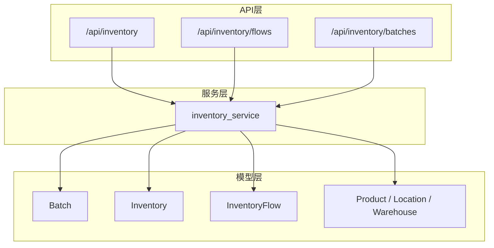
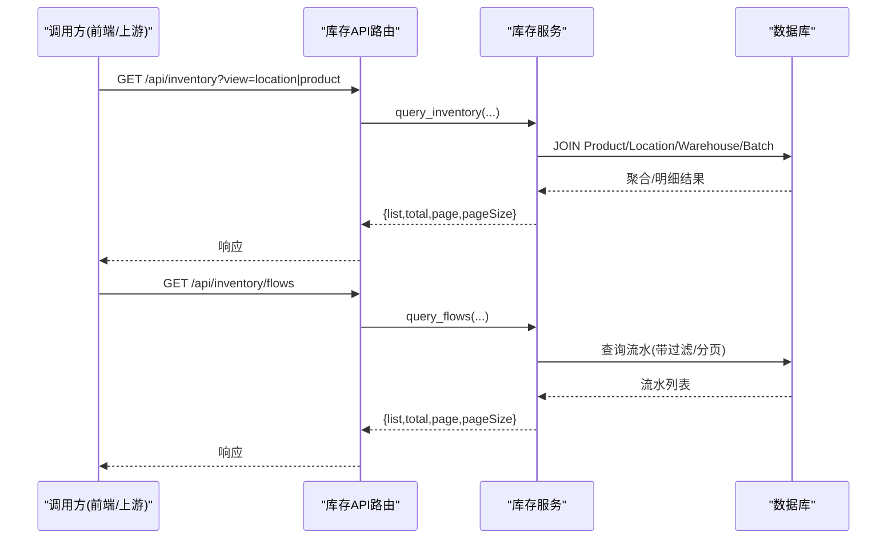
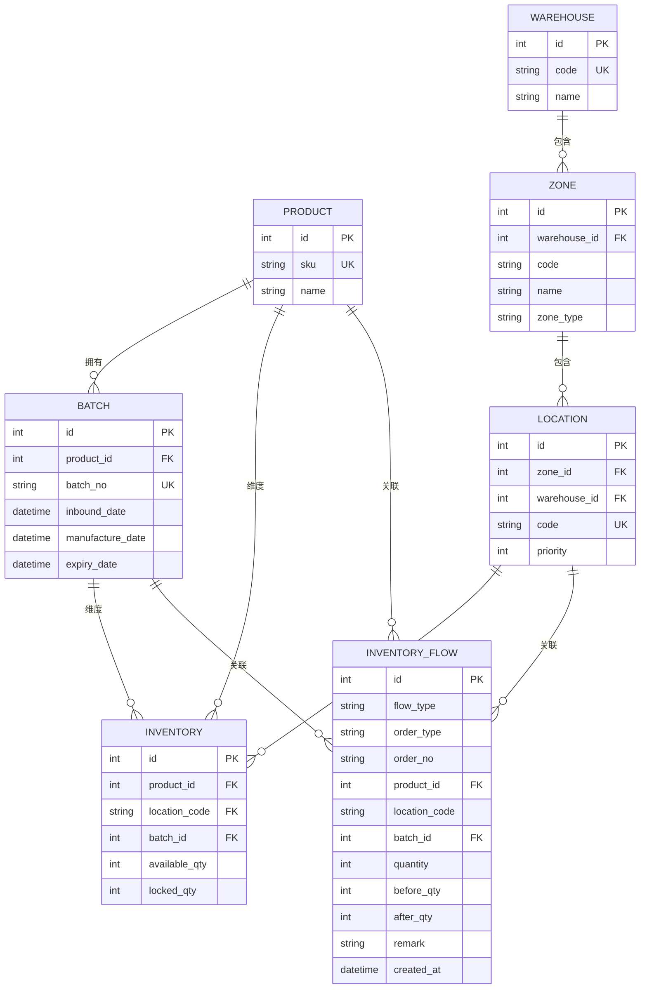
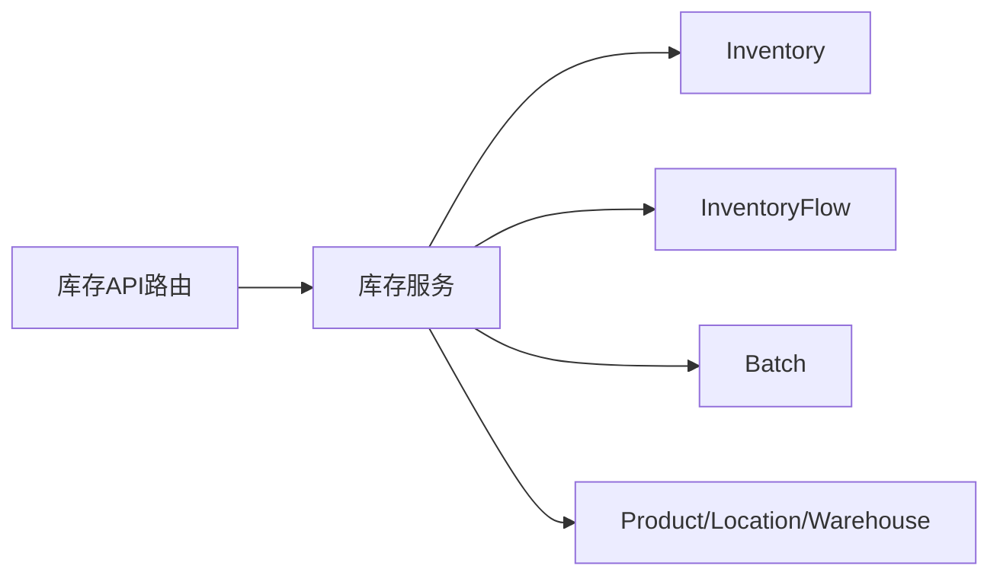

# 库存模型设计

<cite>
**本文引用的文件**
- [inventory.py](file://backend-python/app/models/inventory.py)
- [base.py](file://backend-python/app/models/base.py)
- [inventory_service.py](file://backend-python/app/services/inventory_service.py)
- [inventory.py](file://backend-python/app/routers/inventory.py)
- [PRD.md](file://docs/PRD.md)
</cite>

## 目录
1. [引言](#引言)
2. [项目结构](#项目结构)
3. [核心组件](#核心组件)
4. [架构总览](#架构总览)
5. [详细组件分析](#详细组件分析)
6. [依赖关系分析](#依赖关系分析)
7. [性能与索引优化](#性能与索引优化)
8. [故障排查指南](#故障排查指南)
9. [结论](#结论)
10. [附录：字段定义、业务规则与示例](#附录字段定义业务规则与示例)

## 引言
本文件面向WMS系统的库存域，聚焦三个核心实体：批次（Batch）、库存行（Inventory）与库存流水（InventoryFlow）。文档重点说明可用量（available_qty）与锁定量（locked_qty）分离的设计动机与典型业务场景；系统化梳理批次管理（入库日期、生产日期、有效期等）；明确库存行的唯一约束与索引策略；详述库存流水的flow_type类型与全量可追溯机制。文末提供实体关系图、字段定义、数据类型、业务规则及示例数据与使用场景，帮助读者快速理解并正确扩展库存模型。

## 项目结构
库存相关代码主要位于后端Python模块中：
- 数据模型定义：app/models/inventory.py（Batch、Inventory、InventoryFlow），以及基础主数据模型 app/models/base.py（Product、Location、Warehouse等）
- 服务层：app/services/inventory_service.py（库存增减、锁定、出库、查询、批次与流水查询）
- API路由：app/routers/inventory.py（库存查询、流水查询、批次查询接口）
- 需求背景：docs/PRD.md（仓储作业能力与业财一体化目标）

图表来源
- [inventory.py:18-98](file://backend-python/app/models/inventory.py#L18-L98)
- [base.py:14-95](file://backend-python/app/models/base.py#L14-L95)
- [inventory_service.py:1-437](file://backend-python/app/services/inventory_service.py#L1-L437)
- [inventory.py:12-62](file://backend-python/app/routers/inventory.py#L12-L62)

章节来源
- [inventory.py:18-98](file://backend-python/app/models/inventory.py#L18-L98)
- [base.py:14-95](file://backend-python/app/models/base.py#L14-L95)
- [inventory_service.py:1-437](file://backend-python/app/services/inventory_service.py#L1-L437)
- [inventory.py:12-62](file://backend-python/app/routers/inventory.py#L12-L62)

## 核心组件
- 批次（Batch）：一次入库收货生成一个批次，支持有效期管理（简化版），记录入库日期、生产日期、有效期等关键时间维度，用于效期管理与先进先出扣减。
- 库存行（Inventory）：以“商品+库位+批次”为维度维护库存，将可用量（available_qty）与锁定量（locked_qty）分离，避免超卖并支撑拣货暂存流程。
- 库存流水（InventoryFlow）：所有库存变动必须写流水，包含flow_type、order_type、order_no、product_id、location_code、batch_id、quantity、before_qty、after_qty等，实现全量可追溯。

章节来源
- [inventory.py:18-98](file://backend-python/app/models/inventory.py#L18-L98)
- [inventory_service.py:17-31](file://backend-python/app/services/inventory_service.py#L17-L31)

## 架构总览
库存模型采用“模型-服务-API”分层：
- 模型层：定义表结构与关联关系（产品、库区/库位、仓库、批次、库存行、库存流水）
- 服务层：统一入口处理库存加减、锁定、出库、移库、调整、盘点等业务逻辑，强制写流水，保证一致性
- API层：暴露库存查询、流水查询、批次查询接口，供前端或外部系统调用

图表来源
- [inventory.py:12-62](file://backend-python/app/routers/inventory.py#L12-L62)
- [inventory_service.py:256-401](file://backend-python/app/services/inventory_service.py#L256-L401)

## 详细组件分析

### 批次（Batch）
- 作用：标识一次入库收货，承载批次号、商品、入库日期、生产日期、有效期等，支撑效期管理与FIFO扣减
- 关键字段
  - batch_no：批次号（唯一）
  - product_id：关联商品
  - inbound_date：入库上架日期
  - manufacture_date：生产日期（可选）
  - expiry_date：有效期（可选）
- 索引与约束：batch_no唯一索引；product_id外键索引
- 业务规则
  - 每次入库收货创建批次
  - 支持按批次进行效期检查与优先扣减（结合服务层FIFO逻辑）

章节来源
- [inventory.py:18-31](file://backend-python/app/models/inventory.py#L18-L31)

### 库存行（Inventory）
- 作用：在“商品+库位+批次”维度上维护可用量与锁定量
- 关键字段
  - product_id、location_code、batch_id：维度三要素
  - available_qty：可用库存
  - locked_qty：锁定库存（拣货暂存）
  - updated_at：更新时间
- 唯一约束：(product_id, location_code, batch_id) 唯一，确保同商品同库位可按不同批次分行管理
- 索引设计：location_code、product_id建索引，加速常用查询
- 业务规则
  - 可用量与锁定量分离：可用量用于锁定/扣减，锁定量用于发货出库
  - 同一维度重复入库累加到同一行
  - 扣减类操作跨批次执行，遵循FIFO（按入库先后顺序）

章节来源
- [inventory.py:33-61](file://backend-python/app/models/inventory.py#L33-L61)
- [inventory_service.py:33-54](file://backend-python/app/services/inventory_service.py#L33-L54)

### 库存流水（InventoryFlow）
- 作用：记录每一次库存变动，支持按单号、商品、库位、流水类型检索，实现全量可追溯
- 关键字段
  - flow_type：流水类型（见下节）
  - order_type：单据类型（INBOUND/OUTBOUND/TRANSFER/ADJUSTMENT/RETURN）
  - order_no：单据号（用于关联业务单据）
  - product_id、location_code、batch_id：变动涉及的维度
  - quantity：变动量（可为负）
  - before_qty、after_qty：变动前后对应维度的数量（随flow_type变化）
  - remark：备注
  - created_at：发生时间
- 索引设计：order_no、product_id、created_at建索引，提升按单号/商品/时间的查询效率
- 业务规则
  - 所有库存变动必须写流水，不可绕过
  - 流水与库存变更在同一事务内提交，保证一致性与可回滚

章节来源
- [inventory.py:63-98](file://backend-python/app/models/inventory.py#L63-L98)
- [inventory_service.py:57-73](file://backend-python/app/services/inventory_service.py#L57-L73)

### 可用量与锁定量分离的设计理念与业务场景
- 设计理念
  - 可用量（available_qty）：可直接被锁定或扣减的库存
  - 锁定量（locked_qty）：已分配给订单但尚未发货的库存，防止超卖
  - 通过“可用→锁定→出库”的状态流转，保障并发安全与账实一致
- 典型场景
  - 入库：增加可用量，写INBOUND流水
  - 拣货锁定：从可用量转移到锁定量，写PICK_LOCK流水
  - 出库发货：扣减锁定量，写OUTBOUND流水
  - 移库：移出地减少可用量，移入地增加可用量，分别写MOVE_OUT/MOVE_IN流水
  - 调整：盘盈盘亏增加或减少可用量，写ADJUST_IN/ADJUST_OUT流水
  - 退货：退货收货增加可用量，写RETURN_IN流水

章节来源
- [inventory_service.py:17-31](file://backend-python/app/services/inventory_service.py#L17-L31)
- [inventory_service.py:75-251](file://backend-python/app/services/inventory_service.py#L75-L251)

### 批次管理功能（入库日期、生产日期、有效期）
- 入库日期（inbound_date）：记录批次实际入库上架时间，用于FIFO排序与报表统计
- 生产日期（manufacture_date）：可选，用于保质期计算与效期预警
- 有效期（expiry_date）：可选，用于过期拦截与近效期提示
- 与扣减策略联动：服务层按批次入库先后顺序扣减（FIFO），结合有效期可优先扣减即将过期批次

章节来源
- [inventory.py:18-31](file://backend-python/app/models/inventory.py#L18-L31)
- [inventory_service.py:91-144](file://backend-python/app/services/inventory_service.py#L91-L144)

### 库存流水的flow_type类型与全量可追溯机制
- flow_type类型
  - INBOUND：入库收货（增加可用量）
  - OUTBOUND：出库发货（扣减锁定量）
  - PICK_LOCK：拣货锁定（可用量减少，锁定量增加）
  - MOVE_OUT：移库出（减少可用量）
  - MOVE_IN：移库入（增加可用量）
  - ADJUST_IN：盘盈（增加可用量）
  - ADJUST_OUT：盘亏（减少可用量）
  - RETURN_IN：退货收货（增加可用量）
- 全量可追溯
  - 每笔库存变动均写入InventoryFlow，记录before_qty/after_qty，便于对账与审计
  - 通过order_no关联业务单据，支持按单号追踪完整链路
  - 索引order_no/product_id/created_at，提高查询性能

章节来源
- [inventory.py:63-98](file://backend-python/app/models/inventory.py#L63-L98)
- [inventory_service.py:17-31](file://backend-python/app/services/inventory_service.py#L17-L31)
- [inventory_service.py:348-401](file://backend-python/app/services/inventory_service.py#L348-L401)

### 库存行唯一约束与索引设计优化
- 唯一约束：(product_id, location_code, batch_id) 保证同一商品在同一库位的每个批次仅一行库存
- 索引优化
  - ix_inventory_location_code：加速按库位查询
  - ix_inventory_product_id：加速按商品汇总/过滤
  - inventory_flows表的order_no/product_id/created_at索引：加速流水查询与对账

章节来源
- [inventory.py:33-61](file://backend-python/app/models/inventory.py#L33-L61)
- [inventory.py:63-98](file://backend-python/app/models/inventory.py#L63-L98)

### 实体关系图（ERD）

图表来源
- [base.py:14-95](file://backend-python/app/models/base.py#L14-L95)
- [inventory.py:18-98](file://backend-python/app/models/inventory.py#L18-L98)

## 依赖关系分析
- 模型依赖
  - Inventory依赖Product、Location、Batch
  - InventoryFlow依赖Product、Location、Batch
- 服务依赖
  - inventory_service统一封装库存加减、锁定、出库、查询等操作，强制写流水
- API依赖
  - routers/inventory.py暴露查询接口，调用inventory_service

图表来源
- [inventory.py:12-62](file://backend-python/app/routers/inventory.py#L12-L62)
- [inventory_service.py:1-437](file://backend-python/app/services/inventory_service.py#L1-L437)
- [inventory.py:18-98](file://backend-python/app/models/inventory.py#L18-L98)
- [base.py:14-95](file://backend-python/app/models/base.py#L14-L95)

章节来源
- [inventory_service.py:1-437](file://backend-python/app/services/inventory_service.py#L1-L437)
- [inventory.py:12-62](file://backend-python/app/routers/inventory.py#L12-L62)

## 性能与索引优化
- 库存查询优化
  - 按库位/商品视图聚合时，JOIN Product/Location/Warehouse/Batch并使用分组聚合
  - 使用joinedload预加载关联对象，避免N+1查询
- 流水查询优化
  - 基于order_no/product_id/created_at索引进行过滤与排序
  - 分页查询限制返回条数，降低网络与渲染压力
- 并发安全
  - 扣减与锁定使用条件UPDATE（available >= take 才生效）+ with_for_update（PostgreSQL行锁），SQLite下通过重试规避陈旧读
  - 先SUM校验总量不足直接返回False，避免无效写入

章节来源
- [inventory_service.py:91-251](file://backend-python/app/services/inventory_service.py#L91-L251)
- [inventory_service.py:256-401](file://backend-python/app/services/inventory_service.py#L256-L401)

## 故障排查指南
- 常见问题定位
  - 库存不足：lock_stock/deduct_stock返回False，检查可用量总和与批次分布
  - 并发超卖：确认是否使用条件UPDATE与重试逻辑；在高并发环境建议使用PostgreSQL行锁
  - 流水缺失：确认所有库存变动路径均调用_add_flow；核对order_no与flow_type
  - 查询缓慢：检查索引是否存在；确认分页参数合理；避免无过滤的大表扫描
- 建议
  - 对关键操作添加业务日志与异常堆栈
  - 定期巡检流水与库存的一致性（before_qty/after_qty与库存行状态）

章节来源
- [inventory_service.py:91-251](file://backend-python/app/services/inventory_service.py#L91-L251)
- [inventory_service.py:348-401](file://backend-python/app/services/inventory_service.py#L348-L401)

## 结论
本库存模型通过“批次-库存行-库存流水”三层设计，实现了精细化批次管理与全量可追溯。可用量与锁定量分离有效支撑了拣货锁定与防超卖；严格的唯一约束与索引优化保障了查询与更新性能；统一的流水机制为对账、审计与问题定位提供了坚实基础。建议在后续扩展中继续强化效期管理、成本核算与报表下钻能力。

## 附录：字段定义、业务规则与示例

### 字段定义与数据类型
- Batch
  - id：自增主键
  - batch_no：批次号（字符串，唯一）
  - product_id：商品ID（外键）
  - inbound_date：入库日期（时间）
  - manufacture_date：生产日期（时间，可选）
  - expiry_date：有效期（时间，可选）
  - created_at：创建时间
- Inventory
  - id：自增主键
  - product_id：商品ID（外键）
  - location_code：库位编码（外键）
  - batch_id：批次ID（外键，可选）
  - available_qty：可用量（整数，默认0）
  - locked_qty：锁定量（整数，默认0）
  - updated_at：更新时间
- InventoryFlow
  - id：自增主键
  - flow_type：流水类型（字符串）
  - order_type：单据类型（字符串）
  - order_no：单据号（字符串）
  - product_id：商品ID（外键）
  - location_code：库位编码（可选）
  - batch_id：批次ID（外键，可选）
  - quantity：变动量（整数，可为负）
  - before_qty：变动前数量（整数，可选）
  - after_qty：变动后数量（整数，可选）
  - remark：备注（字符串，可选）
  - created_at：发生时间

章节来源
- [inventory.py:18-98](file://backend-python/app/models/inventory.py#L18-L98)

### 业务规则
- 入库：增加可用量，写INBOUND流水
- 拣货锁定：可用量减少，锁定量增加，写PICK_LOCK流水
- 出库发货：扣减锁定量，写OUTBOUND流水
- 移库：移出地减少可用量（MOVE_OUT），移入地增加可用量（MOVE_IN）
- 调整：盘盈增加可用量（ADJUST_IN），盘亏减少可用量（ADJUST_OUT）
- 退货：退货收货增加可用量（RETURN_IN）
- FIFO扣减：跨批次扣减时按入库先后顺序优先扣减早期批次
- 并发安全：条件UPDATE + 失败重读，避免超卖

章节来源
- [inventory_service.py:17-31](file://backend-python/app/services/inventory_service.py#L17-L31)
- [inventory_service.py:75-251](file://backend-python/app/services/inventory_service.py#L75-L251)

### 示例数据与使用场景
- 场景一：入库
  - 批次：创建批次B-001，inbound_date=2026-01-01
  - 库存行：LOC-01处新增可用量100
  - 流水：INBOUND，before_qty=0，after_qty=100
- 场景二：拣货锁定
  - 库存行：LOC-01可用量100 → 可用量70，锁定量30
  - 流水：PICK_LOCK，before_qty=100，after_qty=70
- 场景三：出库发货
  - 库存行：LOC-01锁定量30 → 锁定量0
  - 流水：OUTBOUND，before_qty=30，after_qty=0
- 场景四：移库
  - LOC-01可用量减少，LOC-02可用量增加
  - 流水：MOVE_OUT（LOC-01），MOVE_IN（LOC-02）
- 场景五：盘盈盘亏
  - 盘盈：ADJUST_IN增加可用量
  - 盘亏：ADJUST_OUT减少可用量

章节来源
- [inventory_service.py:75-251](file://backend-python/app/services/inventory_service.py#L75-L251)
- [test_outbound_service.py:78-168](file://backend-python/tests/test_outbound_service.py#L78-L168)
- [test_inventory_service.py:35-136](file://backend-python/tests/test_inventory_service.py#L35-L136)