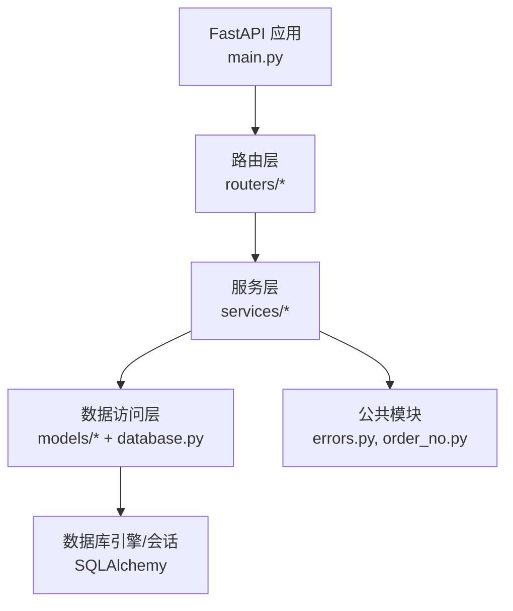
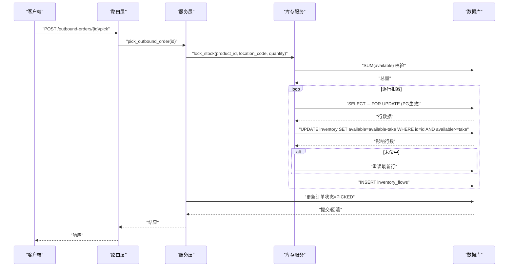
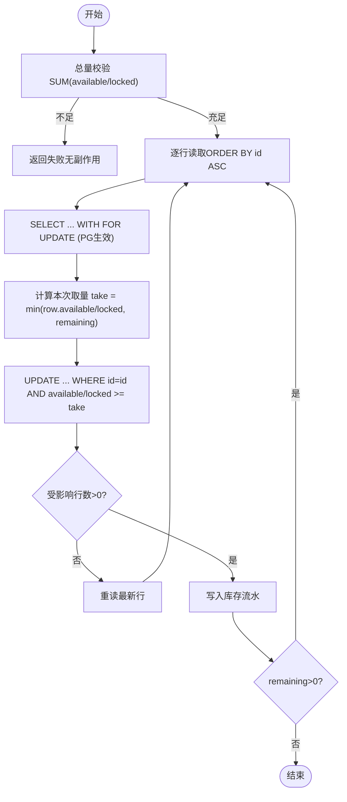
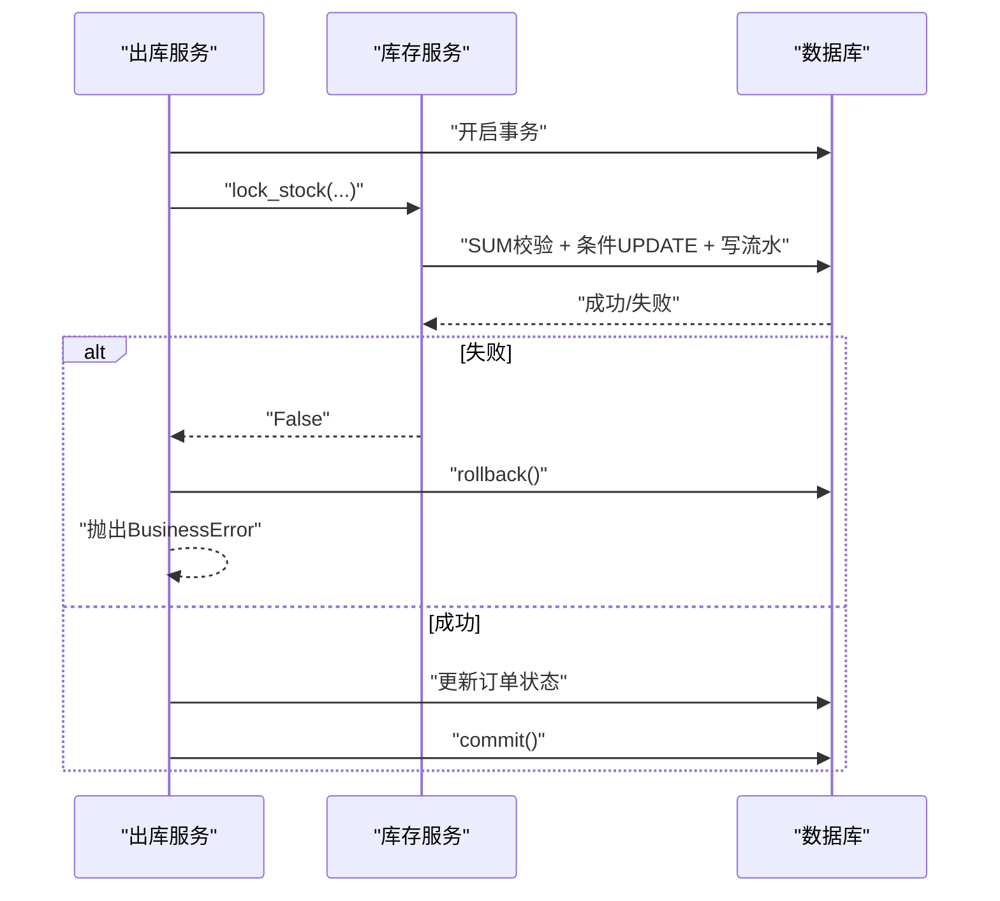
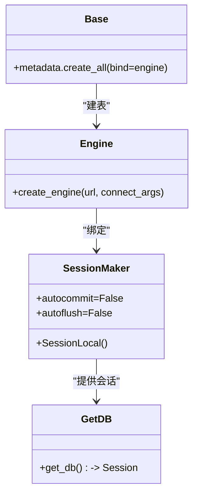
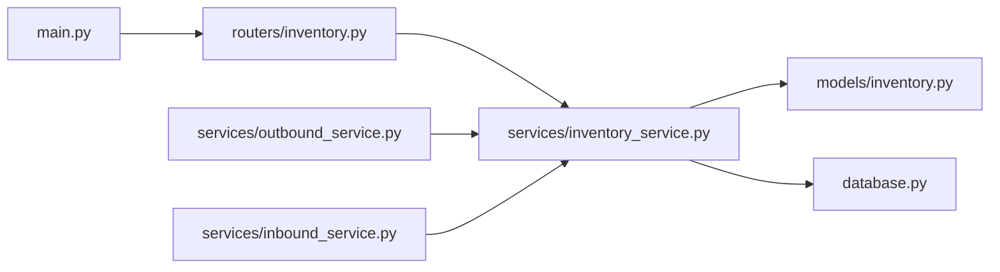

# 数据一致性设计

<cite>
**本文引用的文件**
- [database.py](file://backend-python/app/database.py)
- [inventory.py（模型）](file://backend-python/app/models/inventory.py)
- [orders.py（模型）](file://backend-python/app/models/orders.py)
- [inventory_service.py](file://backend-python/app/services/inventory_service.py)
- [inbound_service.py](file://backend-python/app/services/inbound_service.py)
- [outbound_service.py](file://backend-python/app/services/outbound_service.py)
- [inventory.py（路由）](file://backend-python/app/routers/inventory.py)
- [main.py](file://backend-python/app/main.py)
- [errors.py](file://backend-python/app/common/errors.py)
- [order_no.py](file://backend-python/app/common/order_no.py)
- [test_inventory_service.py](file://backend-python/tests/test_inventory_service.py)
- [pyproject.toml](file://backend-python/pyproject.toml)
</cite>

## 目录
1. [简介](#简介)
2. [项目结构](#项目结构)
3. [核心组件](#核心组件)
4. [架构总览](#架构总览)
5. [详细组件分析](#详细组件分析)
6. [依赖关系分析](#依赖关系分析)
7. [性能考虑](#性能考虑)
8. [故障排查指南](#故障排查指南)
9. [结论](#结论)
10. [附录](#附录)

## 简介
本技术文档聚焦WMS系统的数据一致性设计，围绕并发安全的数据锁机制、防超卖策略、事务与回滚、数据库连接池配置与管理、多数据库适配、数据迁移与版本管理、备份恢复与灾难恢复、以及数据完整性校验与异常处理等关键主题展开。目标是帮助读者理解库存并发控制的核心实现原理，并在生产环境中正确部署与运维。

## 项目结构
后端采用FastAPI + SQLAlchemy的模块化分层：
- 应用入口与生命周期：负责建表、初始化数据、全局异常处理、CORS、路由注册
- 数据访问层：数据库引擎与会话管理、ORM模型定义
- 服务层：库存、入库、出库、盘点、调整等业务逻辑，统一通过库存服务进行原子化操作
- 路由层：对外暴露REST接口，调用服务层完成业务编排
- 公共模块：错误类型、单号生成等通用能力
- 测试：覆盖库存核心流程与并发场景

图表来源
- [main.py:16-31](file://backend-python/app/main.py#L16-L31)
- [inventory.py（路由）:1-62](file://backend-python/app/routers/inventory.py#L1-L62)
- [inventory_service.py:1-10](file://backend-python/app/services/inventory_service.py#L1-L10)
- [database.py:1-38](file://backend-python/app/database.py#L1-L38)

章节来源
- [main.py:16-31](file://backend-python/app/main.py#L16-L31)
- [inventory.py（路由）:1-62](file://backend-python/app/routers/inventory.py#L1-L62)
- [database.py:1-38](file://backend-python/app/database.py#L1-L38)

## 核心组件
- 数据库连接与会话：基于环境变量动态选择SQLite或MySQL/PostgreSQL；提供FastAPI依赖注入的会话获取与自动关闭
- 库存域模型：批次、库存行（可用量/锁定量分离）、库存流水（全量可追溯）
- 库存服务：统一的库存变更入口，支持跨批次扣减、拣货锁定、发货扣减，并强制写流水
- 单据服务：入库/出库状态机驱动，结合库存服务保证整单原子性
- 异常与单号：统一业务异常、按日递增的单号生成与冲突重试

章节来源
- [database.py:5-24](file://backend-python/app/database.py#L5-L24)
- [inventory.py（模型）:18-98](file://backend-python/app/models/inventory.py#L18-L98)
- [inventory_service.py:1-10](file://backend-python/app/services/inventory_service.py#L1-L10)
- [inbound_service.py:1-10](file://backend-python/app/services/inbound_service.py#L1-L10)
- [outbound_service.py:1-10](file://backend-python/app/services/outbound_service.py#L1-L10)
- [errors.py:1-9](file://backend-python/app/common/errors.py#L1-L9)
- [order_no.py:1-38](file://backend-python/app/common/order_no.py#L1-L38)

## 架构总览
下图展示从请求到数据落库的一致性保障路径：路由接收请求→服务编排→库存服务原子更新+写流水→事务提交/回滚→响应返回。

图表来源
- [outbound_service.py:102-133](file://backend-python/app/services/outbound_service.py#L102-L133)
- [inventory_service.py:147-202](file://backend-python/app/services/inventory_service.py#L147-L202)
- [inventory.py（模型）:63-98](file://backend-python/app/models/inventory.py#L63-L98)

## 详细组件分析

### 并发安全的数据锁与防超卖
- 可用量与锁定量分离：库存行维度为(product_id, location_code, batch_id)，可用量用于可售，锁定量用于已拣货未发货
- 防超卖双保险：
  - 总量预检：在扣减前对SUM(available)或SUM(locked)做充足性检查，不足直接返回失败且无副作用
  - 条件更新：使用“WHERE available_qty >= take”的条件UPDATE，若受影响行数为0则视为被并发修改，重读最新状态继续循环
  - 行级锁：在PostgreSQL下使用with_for_update()加行锁；SQLite忽略该提示但不影响条件更新的正确性
- 跨批次扣减：按入库顺序（ID升序）优先扣早期批次，确保FIFO策略

图表来源
- [inventory_service.py:91-144](file://backend-python/app/services/inventory_service.py#L91-L144)
- [inventory_service.py:147-202](file://backend-python/app/services/inventory_service.py#L147-L202)
- [inventory_service.py:205-251](file://backend-python/app/services/inventory_service.py#L205-L251)

章节来源
- [inventory_service.py:91-144](file://backend-python/app/services/inventory_service.py#L91-L144)
- [inventory_service.py:147-202](file://backend-python/app/services/inventory_service.py#L147-L202)
- [inventory_service.py:205-251](file://backend-python/app/services/inventory_service.py#L205-L251)
- [inventory.py（模型）:33-61](file://backend-python/app/models/inventory.py#L33-L61)

### 事务处理与回滚机制
- 事务边界由上层单据服务控制：创建订单、拣货锁定、复核、发货等步骤在同一事务中执行
- 任一环节失败（如库存不足）抛出业务异常，触发db.rollback()，保证整单原子性，不留半成品
- 入库收货：生成批次、累加可用库存、写流水，全部在一个事务内完成

图表来源
- [outbound_service.py:102-133](file://backend-python/app/services/outbound_service.py#L102-L133)
- [inbound_service.py:92-129](file://backend-python/app/services/inbound_service.py#L92-L129)
- [inventory_service.py:147-202](file://backend-python/app/services/inventory_service.py#L147-L202)

章节来源
- [outbound_service.py:102-133](file://backend-python/app/services/outbound_service.py#L102-L133)
- [inbound_service.py:92-129](file://backend-python/app/services/inbound_service.py#L92-L129)

### 数据库连接池配置与管理
- 连接引擎：使用SQLAlchemy create_engine创建引擎，默认SQLite（本地开发零配置），可通过DATABASE_URL切换至MySQL/PostgreSQL
- 会话工厂：sessionmaker配置autocommit=False、autoflush=False，避免隐式提交与刷新
- FastAPI依赖注入：get_db提供请求级会话，finally中自动关闭，防止连接泄漏
- SQLite特殊参数：check_same_thread=False以支持多线程访问

图表来源
- [database.py:1-38](file://backend-python/app/database.py#L1-L38)
- [main.py:16-24](file://backend-python/app/main.py#L16-L24)

章节来源
- [database.py:5-24](file://backend-python/app/database.py#L5-L24)
- [main.py:16-24](file://backend-python/app/main.py#L16-L24)

### 多数据库支持（SQLite/MySQL/PostgreSQL）
- 运行时切换：通过环境变量DATABASE_URL指定连接串，例如mysql+pymysql://...或postgresql+psycopg2://...
- 驱动依赖：pyproject.toml声明pymysql、psycopg2-binary，满足MySQL/PostgreSQL驱动需求
- SQLite兼容：connect_args设置check_same_thread=False，便于多线程环境使用

章节来源
- [database.py:5-20](file://backend-python/app/database.py#L5-L20)
- [pyproject.toml:7-17](file://backend-python/pyproject.toml#L7-L17)

### 数据迁移与版本管理
- 依赖声明：项目包含alembic依赖，可用于DDL变更的版本化管理
- 建议实践：
  - 使用Alembic管理表结构变更（新增字段、索引、约束）
  - 将init_data中的示例数据初始化纳入迁移脚本或独立初始化任务
  - 在生产环境执行迁移前进行备份与灰度验证

章节来源
- [pyproject.toml:7-17](file://backend-python/pyproject.toml#L7-L17)

### 数据备份恢复与灾难恢复
- 备份策略：
  - SQLite：定期复制psi_fin.db文件；注意在低峰期或停止写入时进行一致快照
  - MySQL/PostgreSQL：使用原生工具（mysqldump/pg_dump）或云厂商备份方案，制定保留策略
- 恢复演练：
  - 定期演练恢复流程，验证备份有效性
  - 记录RTO/RPO目标，匹配业务容忍度
- 高可用：
  - 主从/集群部署，读写分离
  - 监控告警：慢查询、连接数、磁盘空间

[本节为通用运维建议，不直接引用具体代码文件]

### 数据完整性校验与质量保证
- 唯一约束与索引：
  - 库存行唯一约束(product_id, location_code, batch_id)
  - 常用查询列建立索引（location_code, product_id, created_at等）
- 流水审计：所有库存变动必须写InventoryFlow，before/after数量完整记录，支持溯源
- 单元测试覆盖：
  - 入库累加、跨批次FIFO扣减、不足返回False且无副作用
  - 锁定与发货流程、查询视图聚合、关键字过滤、分页

章节来源
- [inventory.py（模型）:33-98](file://backend-python/app/models/inventory.py#L33-L98)
- [test_inventory_service.py:31-171](file://backend-python/tests/test_inventory_service.py#L31-L171)

### 异常处理与业务错误
- 统一业务异常：BusinessError携带HTTP状态码，由全局异常处理器转为JSON响应
- 事务内异常：服务层捕获业务异常后执行db.rollback()，保持事务一致性
- 单号冲突重试：生成单号时可能遇到唯一约束冲突，捕获IntegrityError并重试

章节来源
- [errors.py:1-9](file://backend-python/app/common/errors.py#L1-L9)
- [main.py:35-41](file://backend-python/app/main.py#L35-L41)
- [order_no.py:1-38](file://backend-python/app/common/order_no.py#L1-L38)
- [outbound_service.py:60-86](file://backend-python/app/services/outbound_service.py#L60-L86)

## 依赖关系分析
库存服务依赖模型与数据库会话；单据服务依赖库存服务；路由依赖服务；应用入口负责生命周期与异常处理。

图表来源
- [main.py:53-69](file://backend-python/app/main.py#L53-L69)
- [inventory.py（路由）:1-62](file://backend-python/app/routers/inventory.py#L1-L62)
- [inventory_service.py:1-16](file://backend-python/app/services/inventory_service.py#L1-L16)
- [database.py:1-38](file://backend-python/app/database.py#L1-L38)
- [outbound_service.py:1-15](file://backend-python/app/services/outbound_service.py#L1-L15)
- [inbound_service.py:1-12](file://backend-python/app/services/inbound_service.py#L1-L12)

章节来源
- [main.py:53-69](file://backend-python/app/main.py#L53-L69)
- [inventory.py（路由）:1-62](file://backend-python/app/routers/inventory.py#L1-L62)
- [inventory_service.py:1-16](file://backend-python/app/services/inventory_service.py#L1-L16)
- [database.py:1-38](file://backend-python/app/database.py#L1-L38)
- [outbound_service.py:1-15](file://backend-python/app/services/outbound_service.py#L1-L15)
- [inbound_service.py:1-12](file://backend-python/app/services/inbound_service.py#L1-L12)

## 性能考虑
- 查询优化：
  - 使用joinedload减少N+1查询
  - 针对高频过滤列建立索引（location_code、product_id、created_at）
- 并发控制：
  - 条件UPDATE避免覆盖并发修改
  - PostgreSQL下WITH FOR UPDATE提升并发安全性
- 事务粒度：
  - 尽量缩小事务范围，减少锁持有时间
  - 批量操作分片提交，避免长事务
- 连接池：
  - 根据负载调整pool_size、max_overflow、pool_recycle
  - 监控连接使用率与慢查询

[本节为通用性能建议，不直接引用具体代码文件]

## 故障排查指南
- 库存不足：
  - 现象：拣货/发货返回失败，订单状态不变
  - 排查：检查SUM(available/locked)、条件UPDATE是否命中、是否存在并发竞争
- 单号冲突：
  - 现象：创建订单时报唯一约束冲突
  - 处理：捕获IntegrityError并重试，确认单号生成逻辑
- 事务回滚：
  - 现象：部分写入未生效
  - 排查：确认服务层是否在异常分支执行了db.rollback()
- 连接问题：
  - 现象：连接超时或耗尽
  - 排查：检查连接池配置、慢查询、数据库负载

章节来源
- [outbound_service.py:102-133](file://backend-python/app/services/outbound_service.py#L102-L133)
- [inventory_service.py:91-144](file://backend-python/app/services/inventory_service.py#L91-L144)
- [order_no.py:1-38](file://backend-python/app/common/order_no.py#L1-L38)

## 结论
本WMS系统在数据一致性方面通过“可用量/锁定量分离 + 条件更新 + 行级锁 + 全量流水”的组合策略，实现了高并发下的防超卖与可追溯。事务边界由服务层严格控制，配合统一异常处理与单号生成重试机制，确保关键业务的原子性与幂等性。数据库层面支持SQLite/MySQL/PostgreSQL无缝切换，并通过Alembic进行版本管理。结合备份恢复与性能调优策略，可在生产环境中稳定运行。

## 附录
- 关键流程图示：
  - 出库拣货与发货序列图（见“架构总览”）
  - 扣减算法流程图（见“并发安全的数据锁与防超卖”）
- 参考测试用例：
  - 库存核心流程与并发场景覆盖（见“数据完整性校验与质量保证”）