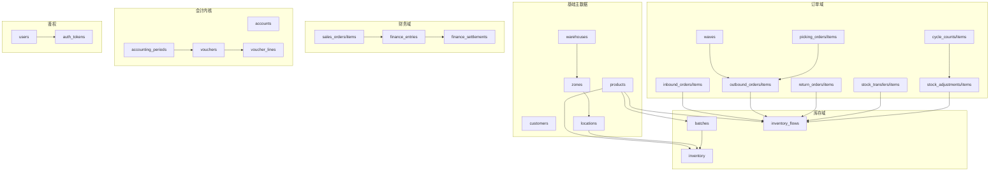
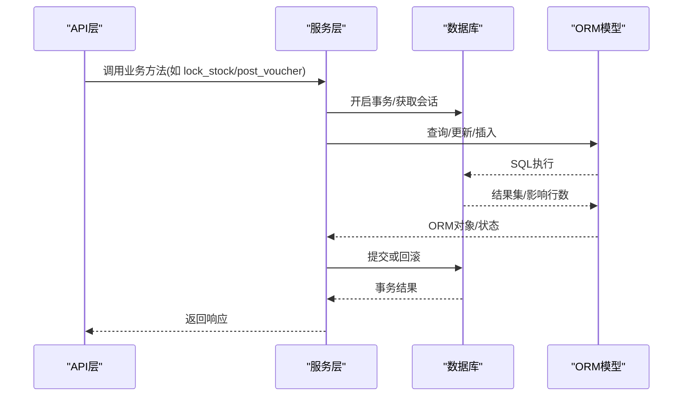
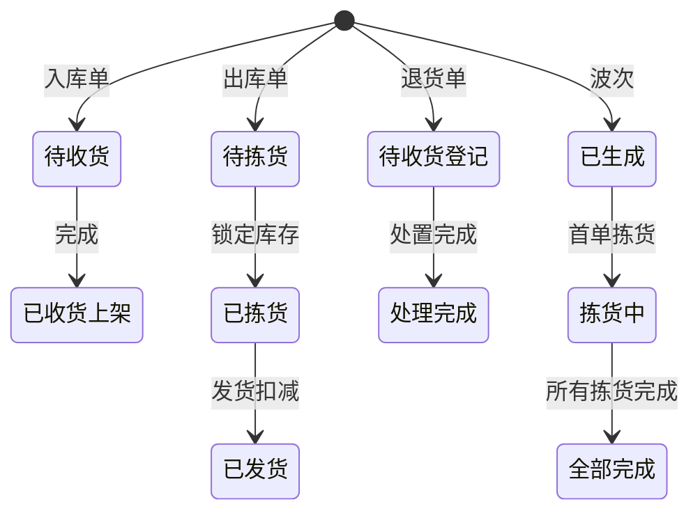
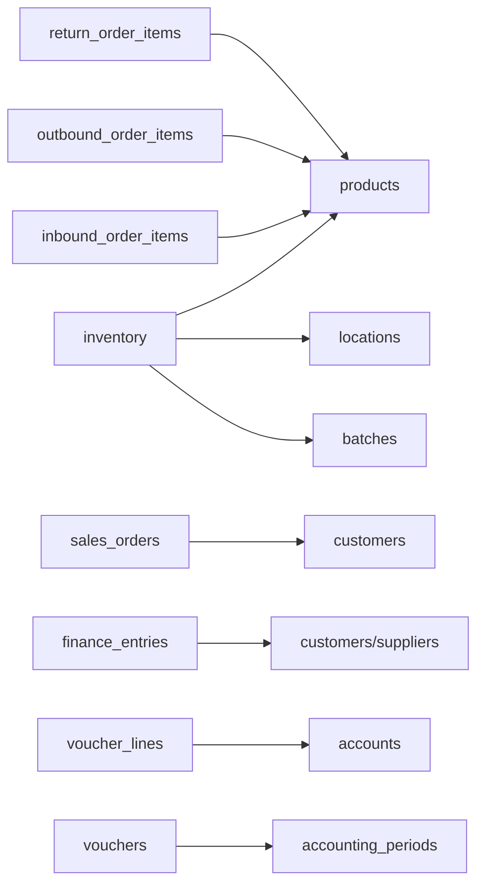

# 数据库设计

<cite>
**本文引用的文件**
- [backend-python/app/models/base.py](file://backend-python/app/models/base.py)
- [backend-python/app/models/inventory.py](file://backend-python/app/models/inventory.py)
- [backend-python/app/models/orders.py](file://backend-python/app/models/orders.py)
- [backend-python/app/models/finance.py](file://backend-python/app/models/finance.py)
- [backend-python/app/models/accounting.py](file://backend-python/app/models/accounting.py)
- [backend-python/app/models/auth.py](file://backend-python/app/models/auth.py)
- [backend-python/app/database.py](file://backend-python/app/database.py)
- [backend-python/app/services/inventory_service.py](file://backend-python/app/services/inventory_service.py)
- [backend-python/app/services/finance_service.py](file://backend-python/app/services/finance_service.py)
- [backend-python/app/services/accounting_service.py](file://backend-python/app/services/accounting_service.py)
- [backend-python/tests/test_inventory_service.py](file://backend-python/tests/test_inventory_service.py)
- [backend-python/tests/test_accounting_core.py](file://backend-python/tests/test_accounting_core.py)
- [NOTES.md](file://NOTES.md)
- [docs/PRD.md](file://docs/PRD.md)
</cite>

## 目录
1. [引言](#引言)
2. [项目结构](#项目结构)
3. [核心组件](#核心组件)
4. [架构总览](#架构总览)
5. [详细组件分析](#详细组件分析)
6. [依赖关系分析](#依赖关系分析)
7. [性能与并发安全](#性能与并发安全)
8. [数据生命周期、保留与归档](#数据生命周期保留与归档)
9. [迁移与版本管理](#迁移与版本管理)
10. [数据安全、隐私与访问控制](#数据安全隐私与访问控制)
11. [故障排查指南](#故障排查指南)
12. [结论](#结论)
13. [附录：Schema图与示例数据](#附录schema图与示例数据)

## 引言
本文件为WMS系统的数据库模型文档，覆盖实体关系、字段定义、主外键与索引约束、库存模型（可用量+锁定量）、订单状态机、财务流水与核销、会计凭证等核心业务规则。同时给出数据访问模式、缓存策略建议、性能考虑、数据生命周期与归档策略、迁移路径与版本管理、安全与访问控制，以及并发安全的数据锁机制和事务处理说明。

## 项目结构
后端采用SQLAlchemy声明式模型，按领域划分模块：基础主数据（商品、客户、仓库、库区、库位）、库存域（批次、库存行、库存流水）、订单域（入库/出库/退货/移库/调整/盘点/波次/拣货）、财务域（销售订单、财务流水、核销）、会计内核（科目表、期间、凭证及分录）、鉴权（用户、令牌）。数据库连接通过统一配置支持SQLite与MySQL/PostgreSQL切换。

图表来源
- [backend-python/app/models/base.py:14-95](file://backend-python/app/models/base.py#L14-L95)
- [backend-python/app/models/inventory.py:18-98](file://backend-python/app/models/inventory.py#L18-L98)
- [backend-python/app/models/orders.py:17-300](file://backend-python/app/models/orders.py#L17-L300)
- [backend-python/app/models/finance.py:26-117](file://backend-python/app/models/finance.py#L26-L117)
- [backend-python/app/models/accounting.py:63-159](file://backend-python/app/models/accounting.py#L63-L159)
- [backend-python/app/models/auth.py:19-40](file://backend-python/app/models/auth.py#L19-L40)

章节来源
- [backend-python/app/models/base.py:14-95](file://backend-python/app/models/base.py#L14-L95)
- [backend-python/app/models/inventory.py:18-98](file://backend-python/app/models/inventory.py#L18-L98)
- [backend-python/app/models/orders.py:17-300](file://backend-python/app/models/orders.py#L17-L300)
- [backend-python/app/models/finance.py:26-117](file://backend-python/app/models/finance.py#L26-L117)
- [backend-python/app/models/accounting.py:63-159](file://backend-python/app/models/accounting.py#L63-L159)
- [backend-python/app/models/auth.py:19-40](file://backend-python/app/models/auth.py#L19-L40)

## 核心组件
- 基础主数据：产品SKU、客户、仓库、库区、库位，支撑库存与订单的维度建模。
- 库存域：批次、库存行（available_qty + locked_qty）、库存流水（全量可追溯）。
- 订单域：入库单、出库单、退货单、移库单、库存调整单、盘点单、波次、拣货单。
- 财务域：销售订单、财务流水（应收/应付/收款/付款）、核销明细。
- 会计内核：科目表（树状COA）、会计期间、记账凭证（含红字冲销）、凭证分录。
- 鉴权：用户与登录令牌。

章节来源
- [backend-python/app/models/base.py:14-95](file://backend-python/app/models/base.py#L14-L95)
- [backend-python/app/models/inventory.py:18-98](file://backend-python/app/models/inventory.py#L18-L98)
- [backend-python/app/models/orders.py:17-300](file://backend-python/app/models/orders.py#L17-L300)
- [backend-python/app/models/finance.py:26-117](file://backend-python/app/models/finance.py#L26-L117)
- [backend-python/app/models/accounting.py:63-159](file://backend-python/app/models/accounting.py#L63-L159)
- [backend-python/app/models/auth.py:19-40](file://backend-python/app/models/auth.py#L19-L40)

## 架构总览
系统以服务层为核心编排数据访问与业务规则，模型仅负责持久化结构与关系。库存与财务操作均通过服务层封装，保证一致性、幂等与可审计性。数据库连接通过统一引擎与会话管理，生产环境建议使用PostgreSQL/MySQL以获得行级锁与更好的并发能力。

图表来源
- [backend-python/app/database.py:1-37](file://backend-python/app/database.py#L1-L37)
- [backend-python/app/services/inventory_service.py:1-200](file://backend-python/app/services/inventory_service.py#L1-L200)
- [backend-python/app/services/finance_service.py:1-200](file://backend-python/app/services/finance_service.py#L1-L200)
- [backend-python/app/services/accounting_service.py:132-262](file://backend-python/app/services/accounting_service.py#L132-L262)

## 详细组件分析

### 基础主数据模型
- 产品（products）：唯一SKU、FNSKU、箱规、尺寸重量、状态。
- 客户（customers）：唯一编码、分层、联系人信息。
- 仓库/库区/库位（warehouses/zones/locations）：层级归属、库位优先级、占用状态。

章节来源
- [backend-python/app/models/base.py:14-95](file://backend-python/app/models/base.py#L14-L95)

### 库存模型（available_qty + locked_qty）
- 批次（batches）：关联产品、入库日期、生产日期、有效期。
- 库存行（inventory）：唯一约束(product_id, location_code, batch_id)，维护可用量与锁定量；对location_code、product_id建索引加速查询。
- 库存流水（inventory_flows）：记录每次变动类型、前后数量、关联单据号，便于全量追溯。

关键业务规则
- 入库/移库入/盘盈：增加available_qty并写流水。
- 出库锁定（拣货）：从available扣减，locked增加，写PICK_LOCK流水。
- 发货出库：扣减locked，写OUTBOUND流水。
- 移库：出/入双向流水。
- 调整：盘盈/盘亏分别写ADJUST_IN/ADJUST_OUT。
- 退货收货：根据处置策略（RESELL/RELABEL/SCRAP）决定是否累加库存。

并发与一致性
- 使用“先总量校验 + 逐行条件UPDATE + with_for_update”双保险，防止并发超卖。
- SQLite下忽略行锁，但条件UPDATE仍保证原子性；PostgreSQL/MySQL启用行锁更安全。

章节来源
- [backend-python/app/models/inventory.py:18-98](file://backend-python/app/models/inventory.py#L18-L98)
- [backend-python/app/services/inventory_service.py:75-200](file://backend-python/app/services/inventory_service.py#L75-L200)
- [backend-python/tests/test_inventory_service.py:31-170](file://backend-python/tests/test_inventory_service.py#L31-L170)
- [NOTES.md:111-182](file://NOTES.md#L111-L182)

### 订单域与状态机
- 入库单（inbound_orders）：PENDING → COMPLETED。
- 出库单（outbound_orders）：PENDING → PICKED → SHIPPED（部分实现中可能包含REVIEWED）。
- 波次（waves）：CREATED → PICKING → COMPLETED，聚合多张出库单生成拣货任务。
- 拣货单（picking_orders）：CREATED → PICKED，驱动库存锁定与出库单状态推进。
- 退货单（return_orders）：PENDING → RECEIVED → DONE，按处置策略处理库存。
- 移库单（stock_transfers）：直接完成，双向流水。
- 库存调整单（stock_adjustments）：直接完成，盘盈/盘亏写入流水。
- 盘点单（cycle_counts）：PENDING → COMPLETED，创建时快照账面库存，完成后自动生成调整单并写流水。

图表来源
- [backend-python/app/models/orders.py:17-300](file://backend-python/app/models/orders.py#L17-L300)

章节来源
- [backend-python/app/models/orders.py:17-300](file://backend-python/app/models/orders.py#L17-L300)

### 财务流水与核销
- 销售订单（sales_orders）：DRAFT → CONFIRMED → SHIPPED → COMPLETED/CANCELLED，冗余客户名便于报表。
- 财务流水（finance_entries）：统一应收/应付/收款/付款，金额与已核销金额分离，状态由amount与settled_amount推导（OPEN/PARTIAL/SETTLED）。
- 核销明细（finance_settlements）：一笔收款/付款可多次核销到应收/应付，支持预收与部分核销。

关键规则
- 应收在发货动作内生成，到期日=发货日期+账期。
- 幂等兜底：同一来源单据+同一类型只允许一条（唯一约束），服务层预查+DB约束+异常兜底。
- 收款amount为到账金额，settled_amount为已核销金额，差额为未核销余额（预收）。

章节来源
- [backend-python/app/models/finance.py:26-117](file://backend-python/app/models/finance.py#L26-L117)
- [backend-python/app/services/finance_service.py:1-200](file://backend-python/app/services/finance_service.py#L1-L200)

### 会计内核（科目表、期间、凭证）
- 科目表（accounts）：树状结构，仅明细科目可挂分录；支持辅助核算维度（客户/供应商/仓库）。
- 会计期间（accounting_periods）：自然月，OPEN/CLOSED；关闭期间拒绝凭证写入。
- 凭证（vouchers）：DRAFT → POSTED → REVERSED；过账后不可改删，更正用红字冲销。
- 凭证分录（voucher_lines）：借/贷方向，金额可为负（红字），支持辅助核算维度留痕。

关键规则
- 创建草稿凭证时校验分录合法性（方向、科目是否明细、金额非零）。
- 过账时强制借贷平衡、至少两条分录、期间开放。
- 反结账需倒序进行，不得跳过更晚的已结账期间。

章节来源
- [backend-python/app/models/accounting.py:63-159](file://backend-python/app/models/accounting.py#L63-L159)
- [backend-python/app/services/accounting_service.py:132-262](file://backend-python/app/services/accounting_service.py#L132-L262)
- [backend-python/tests/test_accounting_core.py:33-170](file://backend-python/tests/test_accounting_core.py#L33-L170)

### 鉴权模型
- 用户（users）：用户名唯一、角色（admin/operator）、软禁用。
- 令牌（auth_tokens）：随机token、过期时间、关联用户。

章节来源
- [backend-python/app/models/auth.py:19-40](file://backend-python/app/models/auth.py#L19-L40)

## 依赖关系分析
- 模型间通过外键建立强关系：库存行依赖产品、库位、批次；订单明细依赖产品、批次；财务流水依赖客户/供应商；凭证分录依赖科目；期间与凭证关联。
- 服务层依赖模型，并通过数据库会话进行事务控制；库存与财务操作在服务层集中封装，避免跨模块直改表。

图表来源
- [backend-python/app/models/base.py:14-95](file://backend-python/app/models/base.py#L14-L95)
- [backend-python/app/models/inventory.py:18-98](file://backend-python/app/models/inventory.py#L18-L98)
- [backend-python/app/models/orders.py:17-300](file://backend-python/app/models/orders.py#L17-L300)
- [backend-python/app/models/finance.py:26-117](file://backend-python/app/models/finance.py#L26-L117)
- [backend-python/app/models/accounting.py:63-159](file://backend-python/app/models/accounting.py#L63-L159)

章节来源
- [backend-python/app/models/base.py:14-95](file://backend-python/app/models/base.py#L14-L95)
- [backend-python/app/models/inventory.py:18-98](file://backend-python/app/models/inventory.py#L18-L98)
- [backend-python/app/models/orders.py:17-300](file://backend-python/app/models/orders.py#L17-L300)
- [backend-python/app/models/finance.py:26-117](file://backend-python/app/models/finance.py#L26-L117)
- [backend-python/app/models/accounting.py:63-159](file://backend-python/app/models/accounting.py#L63-L159)

## 性能与并发安全
- 索引策略
  - inventory：对location_code、product_id建索引；唯一约束(product_id, location_code, batch_id)。
  - inventory_flows：对order_no、product_id、created_at建索引，便于按单号与商品追溯。
  - sales_orders：对status建索引，提升列表过滤性能。
  - finance_entries：对partner_name、entry_type建索引；唯一约束(source_order_no, entry_type)保障幂等。
  - vouchers：对period_code、status建复合索引，便于期间聚合与状态筛选。
  - voucher_lines：对account_id建索引，便于科目汇总。
- 并发安全
  - 库存锁定/扣减：先SUM总量校验，再逐行with_for_update+条件UPDATE，确保并发下不超卖；SQLite忽略行锁但条件UPDATE仍具原子性。
  - 财务幂等：服务层预查+DB唯一约束+IntegrityError兜底，避免重复生成应收。
  - 会计期间：关闭期间禁止写入，反结账倒序校验，防止越权修改。
- 事务处理
  - 所有库存与财务变更在事务中执行，失败回滚；服务层负责提交/回滚，调用方不得绕过服务层直接操作表。
- 查询优化
  - 使用joinedload加载关联对象减少N+1查询；分页查询结合索引提升性能。
- 缓存策略（建议）
  - 热点库存查询（如某SKU可用量）可在应用层引入短时缓存（如Redis），但必须以库存流水为准进行对账与修正。
  - 财务账龄计算为实时推导，不建议落库缓存，避免一致性问题。

章节来源
- [backend-python/app/models/inventory.py:33-98](file://backend-python/app/models/inventory.py#L33-L98)
- [backend-python/app/models/finance.py:71-117](file://backend-python/app/models/finance.py#L71-L117)
- [backend-python/app/models/accounting.py:108-159](file://backend-python/app/models/accounting.py#L108-L159)
- [backend-python/app/services/inventory_service.py:91-200](file://backend-python/app/services/inventory_service.py#L91-L200)
- [backend-python/app/services/finance_service.py:114-163](file://backend-python/app/services/finance_service.py#L114-L163)
- [backend-python/app/services/accounting_service.py:132-262](file://backend-python/app/services/accounting_service.py#L132-L262)

## 数据生命周期、保留与归档
- 数据生命周期
  - 主数据（产品、客户、仓库）：长期有效，状态可置INACTIVE。
  - 库存流水：永久保留，用于追溯与对账。
  - 订单与单据：长期保留，支持历史查询与审计。
  - 财务流水与凭证：长期保留，遵循会计档案要求。
- 保留策略（建议）
  - 流水与凭证：至少保留至法定期限（如5-10年），可按期间归档。
  - 订单与库存快照：保留至业务闭环后一定周期（如3年），之后可归档至冷存储。
- 归档规则（建议）
  - 按会计期间或年份归档历史数据，归档后仅读访问。
  - 归档前执行一致性校验（流水↔库存↔单据状态），输出差异报表。

[本节为通用指导，不直接分析具体文件]

## 迁移与版本管理
- 模型即Schema：当前使用SQLAlchemy声明式模型，默认SQLite，生产可切换MySQL/PostgreSQL。
- 迁移策略（建议）
  - 引入Alembic进行版本化迁移，CI中检测模型与迁移漂移。
  - 新增字段/表时同步更新迁移脚本，并在测试环境验证。
  - 对敏感字段（如密码哈希）变更需评估兼容性。
- 版本管理
  - 模型变更纳入代码评审与CI检查，确保覆盖率基线不降。
  - 发布前执行完整回归测试，包括并发与边界用例。

章节来源
- [backend-python/app/database.py:1-37](file://backend-python/app/database.py#L1-L37)
- [docs/PRD.md:132-133](file://docs/PRD.md#L132-L133)

## 数据安全、隐私与访问控制
- 鉴权模型
  - 用户角色（admin/operator），软禁用（INACTIVE）控制访问。
  - 令牌（auth_tokens）带过期时间，支持撤销。
- 数据隔离
  - 仓库/库区维度隔离：通过warehouse_id、zone_id、location_code限定数据范围。
  - 客户/供应商维度：财务流水按partner_type与partner_id隔离。
- 审计与留痕
  - 库存流水记录before/after数量与单据号，便于审计。
  - 凭证分录保留aux_name冗余字段，主数据改名不失真。
- 隐私要求
  - 客户联系方式（phone）等敏感字段应加密存储或脱敏展示。
  - 访问日志与操作日志应记录关键变更（如过账、归档）。

章节来源
- [backend-python/app/models/auth.py:19-40](file://backend-python/app/models/auth.py#L19-L40)
- [backend-python/app/models/finance.py:71-117](file://backend-python/app/models/finance.py#L71-L117)
- [backend-python/app/models/accounting.py:138-159](file://backend-python/app/models/accounting.py#L138-L159)

## 故障排查指南
- 库存不足
  - 现象：lock_stock/deduct_stock返回False，无副作用。
  - 排查：检查available_qty总量、批次可用性、并发竞争。
  - 参考：测试用例覆盖不足场景与并发不超卖。
- 财务幂等冲突
  - 现象：IntegrityError触发，提示单号冲突。
  - 排查：检查source_order_no与entry_type唯一约束，服务层重试逻辑。
- 凭证过账失败
  - 现象：借贷不平衡、单边挂账、期间关闭。
  - 排查：校验分录方向与金额、期间状态、最少两条分录。
- 盘点差异
  - 现象：实盘与账面不符，自动调整单生成。
  - 排查：确认盘点范围、快照时机、调整单流水。

章节来源
- [backend-python/tests/test_inventory_service.py:111-170](file://backend-python/tests/test_inventory_service.py#L111-L170)
- [backend-python/app/services/finance_service.py:114-163](file://backend-python/app/services/finance_service.py#L114-L163)
- [backend-python/app/services/accounting_service.py:220-262](file://backend-python/app/services/accounting_service.py#L220-L262)
- [backend-python/tests/test_accounting_core.py:145-170](file://backend-python/tests/test_accounting_core.py#L145-L170)

## 结论
本WMS数据库设计以“可用量+锁定量”的库存模型为核心，配合全量流水与严格的状态机，确保库存与财务的一致性。通过服务层封装与数据库约束，实现并发安全与幂等性。会计内核提供科目树、期间管控与凭证生命周期管理，满足合规与审计需求。建议在生产环境启用PostgreSQL/MySQL以获得更强的并发与一致性保障，并引入迁移工具与归档策略以提升可维护性与合规性。

[本节为总结，不直接分析具体文件]

## 附录：Schema图与示例数据

### ER图（实体关系）

```mermaid
erDiagram
PRODUCTS {
int id PK
string name
string sku UK
string fns_ku
int case_qty
float width
float height
float length
float weight
string status
datetime created_at
datetime updated_at
}
CUSTOMERS {
int id PK
string code UK
string name
string tier
string contact
string phone
string status
datetime created_at
datetime updated_at
}
WAREHOUSES {
int id PK
string code UK
string name
string status
datetime created_at
}
ZONES {
int id PK
int warehouse_id FK
string code
string name
string zone_type
datetime created_at
}
LOCATIONS {
int id PK
int zone_id FK
int warehouse_id FK
string code UK
int priority
string status
datetime created_at
}
BATCHES {
int id PK
string batch_no UK
int product_id FK
datetime inbound_date
datetime manufacture_date
datetime expiry_date
datetime created_at
}
INVENTORY {
int id PK
int product_id FK
string location_code
int batch_id FK
int available_qty
int locked_qty
datetime updated_at
}
INVENTORY_FLOWS {
int id PK
string flow_type
string order_type
string order_no
int product_id FK
string location_code
int batch_id FK
int quantity
int before_qty
int after_qty
string remark
datetime created_at
}
INBOUND_ORDERS {
int id PK
string order_no UK
string supplier_name
string status
string remark
datetime created_at
}
INBOUND_ORDER_ITEMS {
int id PK
int order_id FK
int product_id FK
int quantity
string location_code
int batch_id FK
}
OUTBOUND_ORDERS {
int id PK
string order_no UK
string customer_name
string status
int wave_id FK
string remark
datetime created_at
}
OUTBOUND_ORDER_ITEMS {
int id PK
int order_id FK
int product_id FK
int quantity
string location_code
}
WAVES {
int id PK
string wave_no UK
string status
string remark
datetime created_at
}
PICKING_ORDERS {
int id PK
string picking_no UK
int wave_id FK
int outbound_order_id FK
string status
datetime created_at
}
PICKING_ORDER_ITEMS {
int id PK
int picking_order_id FK
int product_id FK
int quantity
string location_code
}
RETURN_ORDERS {
int id PK
string order_no UK
int customer_id FK
string source
string status
string remark
datetime created_at
}
RETURN_ORDER_ITEMS {
int id PK
int order_id FK
int product_id FK
int quantity
string location_code
string disposition
int batch_id FK
}
STOCK_TRANSFERS {
int id PK
string order_no UK
string status
string remark
datetime created_at
}
STOCK_TRANSFER_ITEMS {
int id PK
int transfer_id FK
int product_id FK
int quantity
string from_location_code
string to_location_code
}
STOCK_ADJUSTMENTS {
int id PK
string order_no UK
string status
string remark
int count_id FK
datetime created_at
}
STOCK_ADJUSTMENT_ITEMS {
int id PK
int adjustment_id FK
int product_id FK
string location_code
int change_qty
}
CYCLE_COUNTS {
int id PK
string count_no UK
string scope_type
string scope_value
string status
string remark
datetime created_at
}
CYCLE_COUNT_ITEMS {
int id PK
int count_id FK
int product_id FK
string location_code
int system_qty
int counted_qty
}
SALES_ORDERS {
int id PK
string order_no UK
int customer_id FK
string customer_name
string status
int credit_days
float total_amount
string outbound_order_no
datetime shipped_at
string remark
datetime created_at
datetime updated_at
}
SALES_ORDER_ITEMS {
int id PK
int order_id FK
int product_id FK
string product_name
int quantity
float unit_price
float amount
}
FINANCE_ENTRIES {
int id PK
string entry_no UK
string entry_type
string partner_type
int partner_id
string partner_name
string source_order_no
float amount
float settled_amount
date occurred_date
date due_date
string status
string remark
datetime created_at
}
FINANCE_SETTLEMENTS {
int id PK
int receipt_entry_id FK
int target_entry_id FK
float amount
datetime created_at
}
ACCOUNTS {
int id PK
string code UK
string name
string category
string direction
int parent_id FK
int level
boolean is_leaf
string aux_dimensions
string status
datetime created_at
datetime updated_at
}
ACCOUNTING_PERIODS {
int id PK
string code UK
date start_date
date end_date
string status
datetime closed_at
datetime created_at
}
VOUCHERS {
int id PK
string voucher_no UK
date voucher_date
string period_code
string status
string source_type
string memo
string reverses_voucher_no
string reversed_voucher_no
string created_by
datetime created_at
datetime updated_at
}
VOUCHER_LINES {
int id PK
int voucher_id FK
int seq
int account_id FK
string direction
float amount
string aux_type
int aux_id
string aux_name
string memo
}
USERS {
int id PK
string username UK
string password_hash
string role
string status
datetime created_at
}
AUTH_TOKENS {
int id PK
string token UK
int user_id FK
datetime expires_at
datetime created_at
}
PRODUCTS ||--o{ BATCHES : "has"
PRODUCTS ||--o{ INVENTORY : "has"
PRODUCTS ||--o{ INVENTORY_FLOWS : "has"
PRODUCTS ||--o{ INBOUND_ORDER_ITEMS : "has"
PRODUCTS ||--o{ OUTBOUND_ORDER_ITEMS : "has"
PRODUCTS ||--o{ RETURN_ORDER_ITEMS : "has"
PRODUCTS ||--o{ STOCK_TRANSFER_ITEMS : "has"
PRODUCTS ||--o{ STOCK_ADJUSTMENT_ITEMS : "has"
PRODUCTS ||--o{ CYCLE_COUNT_ITEMS : "has"
PRODUCTS ||--o{ SALES_ORDER_ITEMS : "has"
CUSTOMERS ||--o{ RETURN_ORDERS : "has"
CUSTOMERS ||--o{ SALES_ORDERS : "has"
CUSTOMERS ||--o{ FINANCE_ENTRIES : "partner"
WAREHOUSES ||--o{ ZONES : "has"
ZONES ||--o{ LOCATIONS : "has"
BATCHES ||--o{ INVENTORY : "has"
BATCHES ||--o{ INVENTORY_FLOWS : "has"
BATCHES ||--o{ INBOUND_ORDER_ITEMS : "has"
BATCHES ||--o{ RETURN_ORDER_ITEMS : "has"
LOCATIONS ||--o{ INVENTORY : "has"
LOCATIONS ||--o{ INVENTORY_FLOWS : "has"
LOCATIONS ||--o{ INBOUND_ORDER_ITEMS : "has"
LOCATIONS ||--o{ OUTBOUND_ORDER_ITEMS : "has"
LOCATIONS ||--o{ RETURN_ORDER_ITEMS : "has"
LOCATIONS ||--o{ STOCK_ADJUSTMENT_ITEMS : "has"
LOCATIONS ||--o{ CYCLE_COUNT_ITEMS : "has"
INBOUND_ORDERS ||--o{ INBOUND_ORDER_ITEMS : "has"
OUTBOUND_ORDERS ||--o{ OUTBOUND_ORDER_ITEMS : "has"
OUTBOUND_ORDERS ||--o{ PICKING_ORDERS : "has"
WAVES ||--o{ OUTBOUND_ORDERS : "has"
WAVES ||--o{ PICKING_ORDERS : "has"
RETURN_ORDERS ||--o{ RETURN_ORDER_ITEMS : "has"
STOCK_TRANSFERS ||--o{ STOCK_TRANSFER_ITEMS : "has"
STOCK_ADJUSTMENTS ||--o{ STOCK_ADJUSTMENT_ITEMS : "has"
CYCLE_COUNTS ||--o{ CYCLE_COUNT_ITEMS : "has"
CYCLE_COUNTS ||--o{ STOCK_ADJUSTMENTS : "generates"
SALES_ORDERS ||--o{ SALES_ORDER_ITEMS : "has"
FINANCE_ENTRIES ||--o{ FINANCE_SETTLEMENTS : "receipt"
FINANCE_ENTRIES ||--o{ FINANCE_SETTLEMENTS : "target"
ACCOUNTS ||--o{ ACCOUNTS : "parent-child"
ACCOUNTS ||--o{ VOUCHER_LINES : "has"
ACCOUNTING_PERIODS ||--o{ VOUCHERS : "has"
VOUCHERS ||--o{ VOUCHER_LINES : "has"
USERS ||--o{ AUTH_TOKENS : "has"
```

图表来源
- [backend-python/app/models/base.py:14-95](file://backend-python/app/models/base.py#L14-L95)
- [backend-python/app/models/inventory.py:18-98](file://backend-python/app/models/inventory.py#L18-L98)
- [backend-python/app/models/orders.py:17-300](file://backend-python/app/models/orders.py#L17-L300)
- [backend-python/app/models/finance.py:26-117](file://backend-python/app/models/finance.py#L26-L117)
- [backend-python/app/models/accounting.py:63-159](file://backend-python/app/models/accounting.py#L63-L159)
- [backend-python/app/models/auth.py:19-40](file://backend-python/app/models/auth.py#L19-L40)

### 示例数据（示意）
- 产品：SKU=T-001，名称=测试商品，单位=个，箱规=1。
- 仓库：WH-01，库区GOODS，库位LOC-01（优先级高）。
- 批次：B-001，入库日期=2026-01-01，有效期=2027-01-01。
- 库存行：product_id=1，location_code=LOC-01，batch_id=1，available_qty=100，locked_qty=0。
- 入库单：IN-001，状态=PENDING→COMPLETED，明细=100件到LOC-01。
- 出库单：OUT-001，状态=PENDING→PICKED→SHIPPED，明细=30件从LOC-01。
- 财务流水：RECEIVABLE=300元，RECEIPT=300元，核销后状态=SETTLED。
- 凭证：JV-20260101-001，借=应收账款，贷=主营业务收入，过账后状态=POSTED。

[本节为示例示意，不直接分析具体文件]