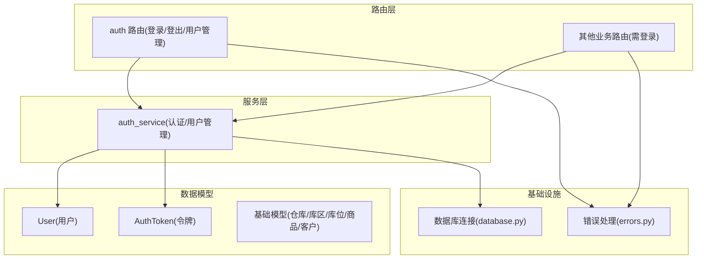
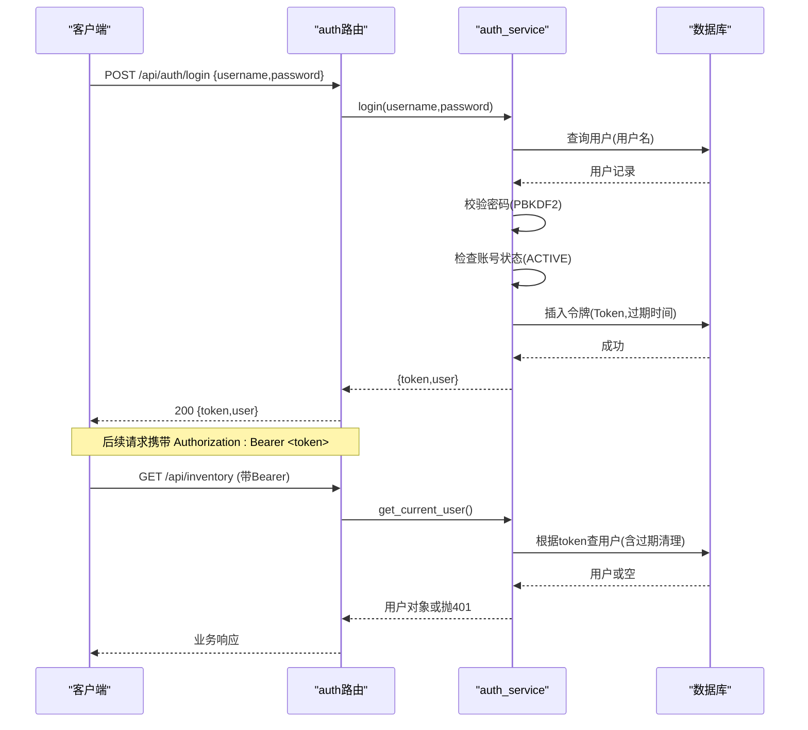
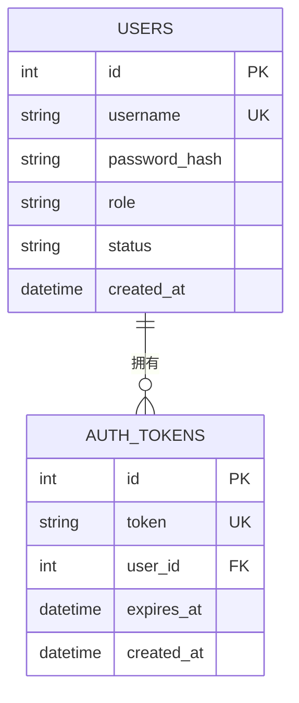
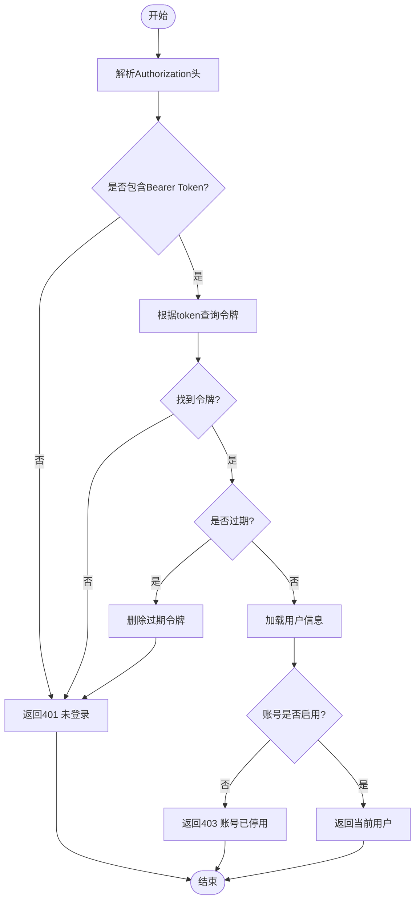
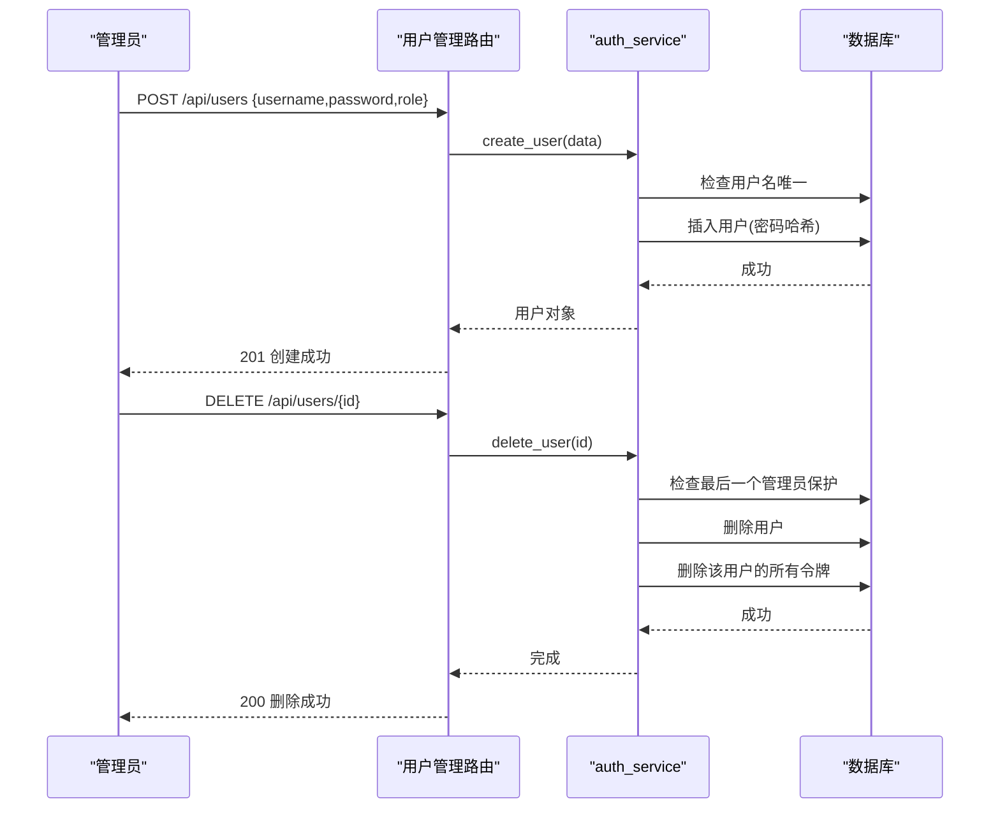
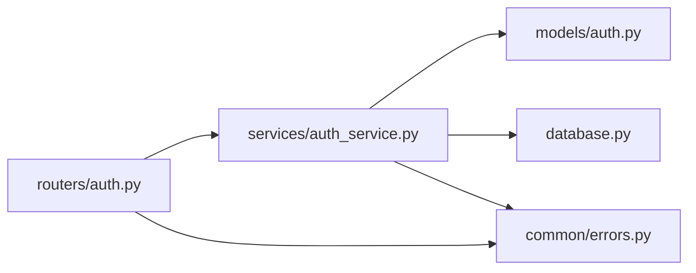

# 用户权限模型设计

<cite>
**本文引用的文件**
- [backend-python/app/models/auth.py](file://backend-python/app/models/auth.py)
- [backend-python/app/services/auth_service.py](file://backend-python/app/services/auth_service.py)
- [backend-python/app/routers/auth.py](file://backend-python/app/routers/auth.py)
- [backend-python/app/schemas/auth.py](file://backend-python/app/schemas/auth.py)
- [backend-python/app/database.py](file://backend-python/app/database.py)
- [backend-python/app/common/errors.py](file://backend-python/app/common/errors.py)
- [backend-python/app/models/base.py](file://backend-python/app/models/base.py)
- [backend-python/app/models/__init__.py](file://backend-python/app/models/__init__.py)
</cite>

## 目录
1. [简介](#简介)
2. [项目结构](#项目结构)
3. [核心组件](#核心组件)
4. [架构总览](#架构总览)
5. [详细组件分析](#详细组件分析)
6. [依赖关系分析](#依赖关系分析)
7. [性能与安全考量](#性能与安全考量)
8. [故障排查指南](#故障排查指南)
9. [结论](#结论)
10. [附录](#附录)

## 简介
本文件面向WMS系统的用户权限模型，聚焦RBAC（基于角色的访问控制）在系统中的数据模型与实现。当前仓库实现了“用户-角色”二元角色模型、基于数据库的Token会话管理、密码哈希存储、以及按角色进行接口级鉴权的最小权限控制。文档将说明：
- 用户表、角色字段、令牌表的三表关系与约束
- 登录认证流程、密码加密存储、会话生命周期管理
- 角色权限分配现状与扩展点（菜单/数据权限隔离）
- 安全审计能力现状与后续建议
- 注册、登录、权限验证等业务流程的数据库操作路径
- 权限继承与角色组合的演进方案

## 项目结构
围绕权限与认证的关键代码分布在以下模块：
- 数据模型：用户与令牌定义位于 models/auth.py；基础模型与业务模型位于 models/base.py 等
- 服务层：认证与用户管理逻辑位于 services/auth_service.py
- 路由层：认证API与用户管理API位于 routers/auth.py
- 请求/响应Schema：schemas/auth.py
- 数据库连接：database.py
- 错误处理：common/errors.py



图表来源
- [backend-python/app/models/auth.py:19-39](file://backend-python/app/models/auth.py#L19-L39)
- [backend-python/app/services/auth_service.py:1-176](file://backend-python/app/services/auth_service.py#L1-L176)
- [backend-python/app/routers/auth.py:1-68](file://backend-python/app/routers/auth.py#L1-L68)
- [backend-python/app/database.py:1-38](file://backend-python/app/database.py#L1-L38)
- [backend-python/app/common/errors.py:1-9](file://backend-python/app/common/errors.py#L1-L9)

章节来源
- [backend-python/app/models/auth.py:19-39](file://backend-python/app/models/auth.py#L19-L39)
- [backend-python/app/services/auth_service.py:1-176](file://backend-python/app/services/auth_service.py#L1-L176)
- [backend-python/app/routers/auth.py:1-68](file://backend-python/app/routers/auth.py#L1-L68)
- [backend-python/app/database.py:1-38](file://backend-python/app/database.py#L1-L38)
- [backend-python/app/common/errors.py:1-9](file://backend-python/app/common/errors.py#L1-L9)

## 核心组件
- 用户模型 User
  - 字段：id、username（唯一索引）、password_hash、role（admin/operator）、status（ACTIVE/INACTIVE）、created_at
  - 作用：系统用户主实体，承载角色与状态
- 令牌模型 AuthToken
  - 字段：id、token（唯一索引）、user_id（外键关联users.id）、expires_at、created_at
  - 作用：登录签发的可撤销、可过期的会话令牌
- 认证服务 auth_service
  - 密码哈希：PBKDF2-SHA256 + 随机盐，不落明文
  - 登录：校验用户名/密码、账号状态，签发并持久化 Token
  - 登出：删除指定 Token
  - 鉴权：从 Authorization 头解析 Bearer Token，校验存在性与有效期，返回当前用户
  - 管理员保护：require_admin 仅允许 admin 角色访问受保护接口
- 路由 auth
  - /api/auth/login：登录
  - /api/auth/logout：登出
  - /api/auth/me：获取当前用户信息
  - /api/users：用户CRUD（仅admin）
- Schema
  - UserCreate/UserUpdate/LoginRequest/LoginResponse：用于输入校验与输出序列化

章节来源
- [backend-python/app/models/auth.py:19-39](file://backend-python/app/models/auth.py#L19-L39)
- [backend-python/app/services/auth_service.py:25-43](file://backend-python/app/services/auth_service.py#L25-L43)
- [backend-python/app/services/auth_service.py:116-175](file://backend-python/app/services/auth_service.py#L116-L175)
- [backend-python/app/routers/auth.py:14-67](file://backend-python/app/routers/auth.py#L14-L67)
- [backend-python/app/schemas/auth.py:10-37](file://backend-python/app/schemas/auth.py#L10-L37)

## 架构总览
下图展示了从HTTP请求到数据库操作的完整调用链，涵盖登录、鉴权与用户管理。



图表来源
- [backend-python/app/routers/auth.py:14-32](file://backend-python/app/routers/auth.py#L14-L32)
- [backend-python/app/services/auth_service.py:116-168](file://backend-python/app/services/auth_service.py#L116-L168)
- [backend-python/app/models/auth.py:19-39](file://backend-python/app/models/auth.py#L19-L39)

## 详细组件分析

### 数据模型与三表关系
- 用户表 users
  - 主键：id
  - 唯一索引：username
  - 角色：role（admin/operator）
  - 状态：status（ACTIVE/INACTIVE）
  - 时间戳：created_at
- 令牌表 auth_tokens
  - 主键：id
  - 唯一索引：token
  - 外键：user_id -> users.id
  - 过期时间：expires_at
  - 创建时间：created_at
- 关系
  - 一个用户可拥有多个有效令牌（但通常同一时刻仅一个活跃）
  - 令牌归属明确，支持按用户清理（如删除用户时级联清理）



图表来源
- [backend-python/app/models/auth.py:19-39](file://backend-python/app/models/auth.py#L19-L39)

章节来源
- [backend-python/app/models/auth.py:19-39](file://backend-python/app/models/auth.py#L19-L39)

### 认证流程与密码安全
- 密码存储
  - 使用 PBKDF2-SHA256 + 随机盐，迭代次数固定为100k，避免明文存储
  - 验证时使用常量时间比较防止时序攻击
- 登录流程
  - 校验用户名与密码
  - 校验账号状态（非停用）
  - 生成随机Token并写入数据库，设置过期时间（7天）
- 鉴权流程
  - 从请求头解析 Bearer Token
  - 查找并校验Token有效性（存在且未过期），自动清理过期Token
  - 校验用户状态（非停用）
  - 通过则注入当前用户上下文



图表来源
- [backend-python/app/services/auth_service.py:152-168](file://backend-python/app/services/auth_service.py#L152-L168)
- [backend-python/app/services/auth_service.py:116-129](file://backend-python/app/services/auth_service.py#L116-L129)
- [backend-python/app/common/errors.py:4-8](file://backend-python/app/common/errors.py#L4-L8)

章节来源
- [backend-python/app/services/auth_service.py:25-43](file://backend-python/app/services/auth_service.py#L25-L43)
- [backend-python/app/services/auth_service.py:116-168](file://backend-python/app/services/auth_service.py#L116-L168)
- [backend-python/app/common/errors.py:4-8](file://backend-python/app/common/errors.py#L4-L8)

### 角色权限控制现状
- 角色粒度
  - 当前采用二元角色：admin（管理员）与 operator（操作员）
  - 管理员专属接口：用户管理（列表、创建、更新、删除）通过 require_admin 保护
- 接口级鉴权
  - 所有业务路由通过依赖注入 get_current_user 强制登录
  - 敏感操作通过 require_admin 限制为管理员
- 扩展点
  - 可在路由层增加更细粒度的权限检查（如资源ID白名单、操作类型枚举）
  - 可在服务层对数据进行租户/仓库维度过滤，实现数据权限隔离

```mermaid
classDiagram
class User {
+int id
+string username
+string role
+string status
+datetime created_at
}
class AuthToken {
+int id
+string token
+int user_id
+datetime expires_at
+datetime created_at
}
class AuthService {
+login(db,username,password) dict
+logout(db,token) void
+get_current_user(...) User
+require_admin(user) User
}
class AuthRouter {
+POST /api/auth/login
+POST /api/auth/logout
+GET /api/auth/me
+GET /api/users
+POST /api/users
+PUT /api/users/{id}
+DELETE /api/users/{id}
}
AuthRouter --> AuthService : "调用"
AuthService --> User : "读取/写入"
AuthService --> AuthToken : "读写"
```

图表来源
- [backend-python/app/models/auth.py:19-39](file://backend-python/app/models/auth.py#L19-L39)
- [backend-python/app/services/auth_service.py:116-175](file://backend-python/app/services/auth_service.py#L116-L175)
- [backend-python/app/routers/auth.py:14-67](file://backend-python/app/routers/auth.py#L14-L67)

章节来源
- [backend-python/app/routers/auth.py:35-67](file://backend-python/app/routers/auth.py#L35-L67)
- [backend-python/app/services/auth_service.py:171-175](file://backend-python/app/services/auth_service.py#L171-L175)

### 用户注册、登录、权限验证的数据库操作
- 用户注册（创建）
  - 校验用户名唯一性
  - 密码哈希后落库
  - 默认角色为 operator
- 用户登录
  - 查询用户并校验密码
  - 检查账号状态
  - 插入令牌记录（含过期时间）
- 权限验证
  - 每次请求解析Token并校验
  - 管理员接口额外校验角色是否为 admin
- 用户管理（仅admin）
  - 列表、更新、删除均要求管理员身份
  - 删除用户时清理其令牌



图表来源
- [backend-python/app/routers/auth.py:47-67](file://backend-python/app/routers/auth.py#L47-L67)
- [backend-python/app/services/auth_service.py:56-112](file://backend-python/app/services/auth_service.py#L56-L112)

章节来源
- [backend-python/app/services/auth_service.py:56-112](file://backend-python/app/services/auth_service.py#L56-L112)
- [backend-python/app/routers/auth.py:47-67](file://backend-python/app/routers/auth.py#L47-L67)

### 菜单权限控制与数据权限隔离
- 菜单权限控制
  - 当前未实现前端菜单动态渲染与后端菜单资源映射
  - 建议：在后端新增菜单资源表与角色-资源关联表，结合用户角色动态下发菜单清单
- 数据权限隔离
  - 当前未实现按仓库/库区/客户等维度的数据隔离
  - 建议：在服务层依据用户角色与所属组织/仓库进行查询过滤，或在ORM层封装统一的数据范围条件

[本节为概念性说明，不直接分析具体文件]

### 安全审计与日志
- 当前未实现登录日志、操作审计表
- 建议：
  - 登录日志：记录登录时间、IP、UA、结果、失败原因
  - 操作审计：记录关键写操作（增删改）的操作人、时间、目标资源、变更摘要
  - 可通过中间件或装饰器统一采集并落库

[本节为概念性说明，不直接分析具体文件]

## 依赖关系分析
- 模块耦合
  - 路由层依赖服务层进行业务逻辑与鉴权
  - 服务层依赖数据模型与数据库连接
  - 错误处理贯穿各层，统一抛出业务异常
- 外部依赖
  - FastAPI 依赖注入机制用于鉴权
  - SQLAlchemy ORM 用于数据访问
  - Python标准库 hashlib/secrets 用于密码哈希与令牌生成



图表来源
- [backend-python/app/routers/auth.py:1-68](file://backend-python/app/routers/auth.py#L1-L68)
- [backend-python/app/services/auth_service.py:1-176](file://backend-python/app/services/auth_service.py#L1-L176)
- [backend-python/app/models/auth.py:19-39](file://backend-python/app/models/auth.py#L19-L39)
- [backend-python/app/database.py:1-38](file://backend-python/app/database.py#L1-L38)
- [backend-python/app/common/errors.py:1-9](file://backend-python/app/common/errors.py#L1-L9)

章节来源
- [backend-python/app/routers/auth.py:1-68](file://backend-python/app/routers/auth.py#L1-L68)
- [backend-python/app/services/auth_service.py:1-176](file://backend-python/app/services/auth_service.py#L1-L176)

## 性能与安全考量
- 性能
  - 登录鉴权涉及一次用户查询与一次令牌查询，建议在高频场景考虑缓存热点用户或令牌（需谨慎处理失效策略）
  - 密码哈希迭代次数较高（100k），登录耗时可控但应避免并发峰值导致CPU压力过大
- 安全
  - 密码采用PBKDF2-SHA256+随机盐，符合安全最佳实践
  - Token可撤销、可过期，支持登出立即失效
  - 管理员保护：确保至少保留一个启用的管理员，防止误操作导致系统不可用
  - 建议：引入CSRF防护（若前后端同域）、速率限制、登录失败锁定、审计日志

[本节提供通用指导，不直接分析具体文件]

## 故障排查指南
- 常见错误
  - 401 未登录或登录已过期：检查Authorization头格式与Token有效性
  - 403 账号已停用/无权限：检查用户状态与角色
  - 409 用户名已存在/无法删除最后一个管理员：检查用户数据一致性
- 定位方法
  - 查看路由与服务层抛出的异常与消息
  - 检查数据库中的 users 与 auth_tokens 表记录
  - 确认环境变量 DATABASE_URL 配置正确

章节来源
- [backend-python/app/common/errors.py:4-8](file://backend-python/app/common/errors.py#L4-L8)
- [backend-python/app/services/auth_service.py:56-112](file://backend-python/app/services/auth_service.py#L56-L112)
- [backend-python/app/services/auth_service.py:116-168](file://backend-python/app/services/auth_service.py#L116-L168)

## 结论
当前WMS系统在权限方面实现了最小可用的RBAC基础能力：用户-角色二元模型、基于数据库的Token会话管理、密码安全存储、以及接口级鉴权与管理员保护。为满足企业级需求，建议逐步完善：
- 细粒度权限：引入资源/菜单/操作三元组，支持菜单权限控制
- 数据权限：按仓库/库区/客户等维度进行数据隔离
- 安全审计：记录登录与关键操作日志，满足合规与追溯需求
- 高级特性：支持权限继承、角色组合、多租户隔离

[本节为总结性内容，不直接分析具体文件]

## 附录
- 相关模型与业务模型参考
  - 基础模型（仓库/库区/库位/商品/客户）用于后续数据权限隔离的维度设计
  - 业务模型（库存/订单/财务/会计）可作为数据权限过滤的目标集合

章节来源
- [backend-python/app/models/base.py:14-95](file://backend-python/app/models/base.py#L14-L95)
- [backend-python/app/models/__init__.py:1-78](file://backend-python/app/models/__init__.py#L1-L78)