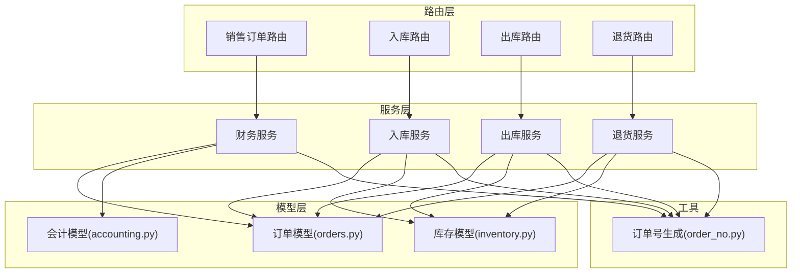
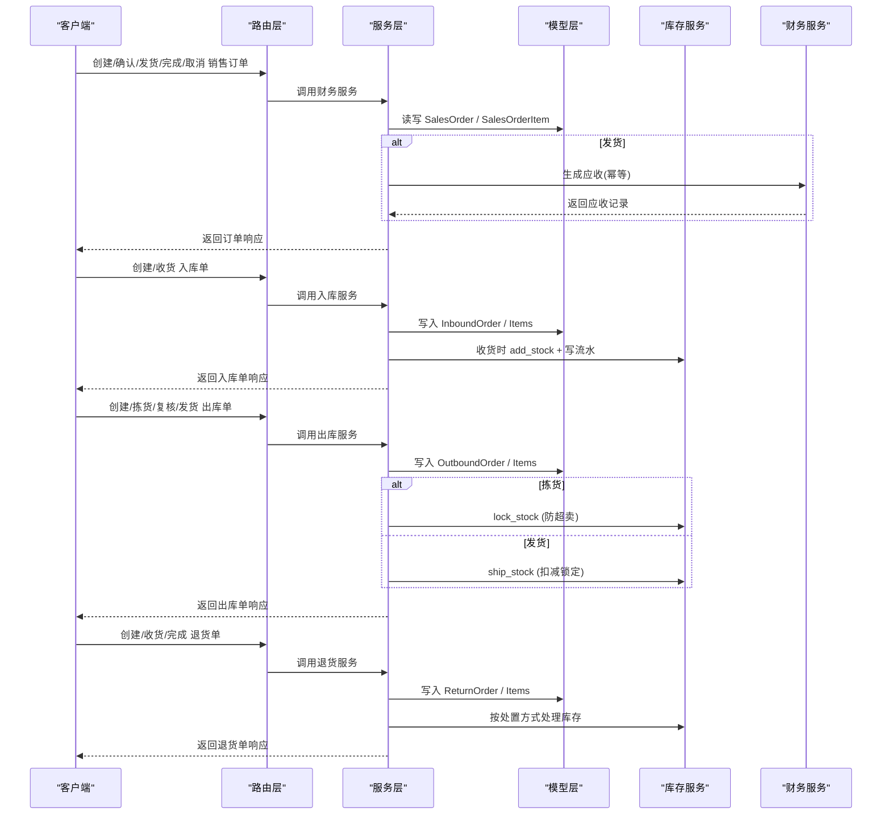
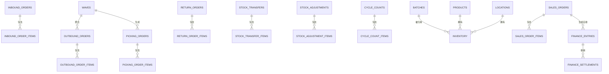
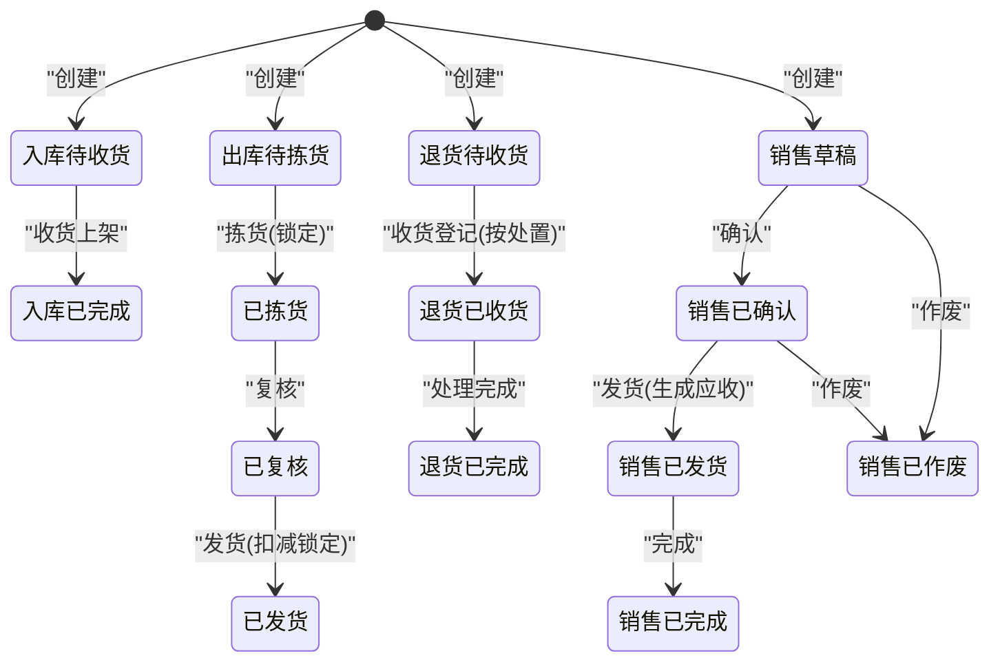
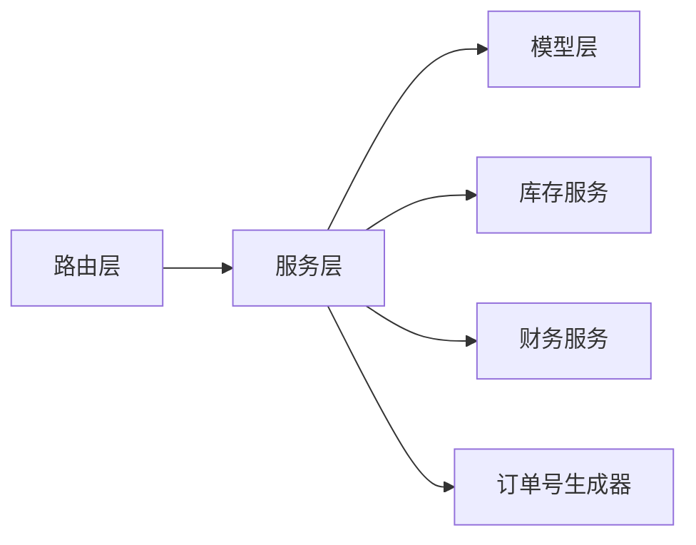

# 订单模型设计

<cite>
**本文引用的文件**
- [orders.py](file://backend-python/app/models/orders.py)
- [inventory.py](file://backend-python/app/models/inventory.py)
- [accounting.py](file://backend-python/app/models/accounting.py)
- [finance_service.py](file://backend-python/app/services/finance_service.py)
- [inbound_service.py](file://backend-python/app/services/inbound_service.py)
- [outbound_service.py](file://backend-python/app/services/outbound_service.py)
- [return_service.py](file://backend-python/app/services/return_service.py)
- [order_no.py](file://backend-python/app/common/order_no.py)
- [sales_orders.py](file://backend-python/app/routers/sales_orders.py)
- [inbound.py](file://backend-python/app/routers/inbound.py)
- [outbound.py](file://backend-python/app/routers/outbound.py)
- [returns.py](file://backend-python/app/routers/returns.py)
</cite>

## 目录
1. [简介](#简介)
2. [项目结构](#项目结构)
3. [核心组件](#核心组件)
4. [架构总览](#架构总览)
5. [详细组件分析](#详细组件分析)
6. [依赖关系分析](#依赖关系分析)
7. [性能考虑](#性能考虑)
8. [故障排查指南](#故障排查指南)
9. [结论](#结论)
10. [附录](#附录)

## 简介
本文件面向WMS系统的“订单模型”，覆盖销售订单、入库单、出库单、退货单等核心订单实体的数据模型与状态机，说明主表与明细表的关系、与库存和财务模块的关联、订单编号生成规则、字段定义与约束，并提供关键业务流程的数据库操作示例与查询优化建议。文档以代码实现为依据，确保与实际系统一致。

## 项目结构
后端采用分层架构：
- 路由层（routers）：暴露REST API，接收请求并调用服务层。
- 服务层（services）：封装业务逻辑与状态机流转，协调模型与库存/财务服务。
- 模型层（models）：定义ORM实体及表结构。
- 公共工具（common）：如订单号生成器。
- Schema（schemas）：用于请求/响应校验与序列化。

图表来源
- [sales_orders.py:1-81](file://backend-python/app/routers/sales_orders.py#L1-L81)
- [inbound.py:1-45](file://backend-python/app/routers/inbound.py#L1-L45)
- [outbound.py:1-61](file://backend-python/app/routers/outbound.py#L1-L61)
- [returns.py:1-48](file://backend-python/app/routers/returns.py#L1-L48)
- [finance_service.py:1-607](file://backend-python/app/services/finance_service.py#L1-L607)
- [inbound_service.py:1-150](file://backend-python/app/services/inbound_service.py#L1-L150)
- [outbound_service.py:1-196](file://backend-python/app/services/outbound_service.py#L1-L196)
- [return_service.py:1-178](file://backend-python/app/services/return_service.py#L1-L178)
- [orders.py:1-300](file://backend-python/app/models/orders.py#L1-L300)
- [inventory.py:1-98](file://backend-python/app/models/inventory.py#L1-L98)
- [accounting.py:1-159](file://backend-python/app/models/accounting.py#L1-L159)
- [order_no.py:1-38](file://backend-python/app/common/order_no.py#L1-L38)

章节来源
- [sales_orders.py:1-81](file://backend-python/app/routers/sales_orders.py#L1-L81)
- [inbound.py:1-45](file://backend-python/app/routers/inbound.py#L1-L45)
- [outbound.py:1-61](file://backend-python/app/routers/outbound.py#L1-L61)
- [returns.py:1-48](file://backend-python/app/routers/returns.py#L1-L48)

## 核心组件
- 订单域模型（orders.py）：包含入库单、出库单、波次、拣货单、退货单、移库单、库存调整、盘点单等实体及其明细。
- 库存域模型（inventory.py）：批次、库存行（可用量/锁定量）、库存流水。
- 会计域模型（accounting.py）：科目、凭证、分录、期间。
- 财务服务（finance_service.py）：销售订单生命周期、应收生成、收款核销、账龄与经营驾驶舱。
- 入库/出库/退货服务：各自的状态机与库存联动。
- 订单号生成器（order_no.py）：按日递增、前缀+日期+序号。

章节来源
- [orders.py:1-300](file://backend-python/app/models/orders.py#L1-L300)
- [inventory.py:1-98](file://backend-python/app/models/inventory.py#L1-L98)
- [accounting.py:1-159](file://backend-python/app/models/accounting.py#L1-L159)
- [finance_service.py:1-607](file://backend-python/app/services/finance_service.py#L1-L607)
- [inbound_service.py:1-150](file://backend-python/app/services/inbound_service.py#L1-L150)
- [outbound_service.py:1-196](file://backend-python/app/services/outbound_service.py#L1-L196)
- [return_service.py:1-178](file://backend-python/app/services/return_service.py#L1-L178)
- [order_no.py:1-38](file://backend-python/app/common/order_no.py#L1-L38)

## 架构总览
订单相关的关键交互如下：
- 销售订单：创建→确认→发货（生成应收）→完成/作废。
- 入库单：创建（PENDING）→收货上架（COMPLETED），收货时生成批次并累加库存。
- 出库单：创建（PENDING）→拣货（PICKED，锁定库存）→复核（REVIEWED）→发货（SHIPPED，扣减锁定库存）。
- 退货单：创建（PENDING）→收货登记（RECEIVED，按处置方式处理库存）→完成（DONE）。

图表来源
- [sales_orders.py:1-81](file://backend-python/app/routers/sales_orders.py#L1-L81)
- [finance_service.py:118-336](file://backend-python/app/services/finance_service.py#L118-L336)
- [inbound.py:13-26](file://backend-python/app/routers/inbound.py#L13-L26)
- [inbound_service.py:38-129](file://backend-python/app/services/inbound_service.py#L38-L129)
- [outbound.py:13-42](file://backend-python/app/routers/outbound.py#L13-L42)
- [outbound_service.py:42-176](file://backend-python/app/services/outbound_service.py#L42-L176)
- [returns.py:13-30](file://backend-python/app/routers/returns.py#L13-L30)
- [return_service.py:51-157](file://backend-python/app/services/return_service.py#L51-L157)

## 详细组件分析

### 数据模型与关系
- 入库单与明细：InboundOrder ↔ InboundOrderItem（一对多，级联删除）。
- 出库单与明细：OutboundOrder ↔ OutboundOrderItem（一对多，级联删除）。
- 波次与拣货：Wave → OutboundOrder；Wave → PickingOrder → PickingOrderItem。
- 退货单与明细：ReturnOrder ↔ ReturnOrderItem（一对多，级联删除）。
- 移库单与明细：StockTransfer ↔ StockTransferItem。
- 库存调整单与明细：StockAdjustment ↔ StockAdjustmentItem。
- 盘点单与明细：CycleCount ↔ CycleCountItem。
- 库存维度：Batch、Inventory（product_id, location_code, batch_id 唯一）、InventoryFlow（全量流水）。
- 财务：SalesOrder、FinanceEntry、FinanceSettlement、Voucher/VoucherLine（会计内核）。

图表来源
- [orders.py:17-300](file://backend-python/app/models/orders.py#L17-L300)
- [inventory.py:18-98](file://backend-python/app/models/inventory.py#L18-L98)
- [finance_service.py:118-336](file://backend-python/app/services/finance_service.py#L118-L336)

章节来源
- [orders.py:17-300](file://backend-python/app/models/orders.py#L17-L300)
- [inventory.py:18-98](file://backend-python/app/models/inventory.py#L18-L98)

### 订单状态机与转换规则
- 入库单：PENDING → COMPLETED（收货上架触发，生成批次并累加库存）。
- 出库单：PENDING → PICKED（拣货锁定库存）→ REVIEWED（复核）→ SHIPPED（扣减锁定库存）。
- 退货单：PENDING → RECEIVED（按处置方式处理库存）→ DONE（处理完成）。
- 销售订单：DRAFT → CONFIRMED → SHIPPED（生成应收）→ COMPLETED；或 DRAFT/CONFIRMED → CANCELLED。

图表来源
- [orders.py:17-185](file://backend-python/app/models/orders.py#L17-L185)
- [inbound_service.py:92-129](file://backend-python/app/services/inbound_service.py#L92-L129)
- [outbound_service.py:102-176](file://backend-python/app/services/outbound_service.py#L102-L176)
- [return_service.py:111-157](file://backend-python/app/services/return_service.py#L111-L157)
- [finance_service.py:235-290](file://backend-python/app/services/finance_service.py#L235-L290)

章节来源
- [inbound_service.py:92-129](file://backend-python/app/services/inbound_service.py#L92-L129)
- [outbound_service.py:102-176](file://backend-python/app/services/outbound_service.py#L102-L176)
- [return_service.py:111-157](file://backend-python/app/services/return_service.py#L111-L157)
- [finance_service.py:235-290](file://backend-python/app/services/finance_service.py#L235-L290)

### 订单主表与明细表关系设计
- 主表存储单据头信息（单号、客户/供应商、状态、备注、时间戳等）。
- 明细表通过外键关联主表ID，存储商品、数量、库位、批次等信息。
- 使用级联删除保证数据一致性。
- 列表查询使用joinedload预加载明细及关联对象，避免N+1查询。

章节来源
- [orders.py:17-185](file://backend-python/app/models/orders.py#L17-L185)
- [inbound_service.py:132-149](file://backend-python/app/services/inbound_service.py#L132-L149)
- [outbound_service.py:179-195](file://backend-python/app/services/outbound_service.py#L179-L195)
- [return_service.py:160-177](file://backend-python/app/services/return_service.py#L160-L177)

### 订单与库存、财务模块的关联
- 入库：收货时生成批次并调用库存服务增加可用库存，写INBOUND流水。
- 出库：拣货锁定可用库存（available→locked），发货扣减锁定库存，写OUTBOUND流水。
- 退货：根据处置方式（转正品/换标/报废）决定是否累加库存，写RETURN_IN流水。
- 销售订单：发货时在同一事务内生成应收（幂等），支持后续收款与核销。

章节来源
- [inbound_service.py:92-129](file://backend-python/app/services/inbound_service.py#L92-L129)
- [outbound_service.py:102-176](file://backend-python/app/services/outbound_service.py#L102-L176)
- [return_service.py:111-157](file://backend-python/app/services/return_service.py#L111-L157)
- [finance_service.py:246-336](file://backend-python/app/services/finance_service.py#L246-L336)

### 订单编号生成规则
- 格式：前缀-YYYYMMDD-序号（如 SO-20260101-001）。
- 每日独立序列，按字符串长度降序再字典序排序获取最大值后+1。
- 并发冲突由唯一约束捕获，服务层重试最多5次。

章节来源
- [order_no.py:1-38](file://backend-python/app/common/order_no.py#L1-L38)
- [inbound_service.py:56-82](file://backend-python/app/services/inbound_service.py#L56-L82)
- [outbound_service.py:60-86](file://backend-python/app/services/outbound_service.py#L60-L86)
- [return_service.py:73-101](file://backend-python/app/services/return_service.py#L73-L101)
- [finance_service.py:114-162](file://backend-python/app/services/finance_service.py#L114-L162)

### 字段定义与数据约束（摘要）
- 入库单：order_no（唯一）、supplier_name、status（PENDING/COMPLETED）、remark、created_at；明细含product_id、quantity、location_code、batch_id。
- 出库单：order_no（唯一）、customer_name、status（PENDING/PICKED/REVIEWED/SHIPPED）、wave_id、remark、created_at；明细含product_id、quantity、location_code。
- 退货单：order_no（唯一）、customer_id、source（FBA/SELLER/CARRIER）、status（PENDING/RECEIVED/DONE）、remark、created_at；明细含product_id、quantity、location_code、disposition（RESELL/RELABEL/SCRAP）、batch_id。
- 库存：Inventory唯一约束(product_id, location_code, batch_id)，available_qty、locked_qty；InventoryFlow记录flow_type、order_type、order_no、product_id、location_code、batch_id、quantity、before_qty、after_qty。
- 销售订单：order_no（唯一）、customer_id、customer_name、status（DRAFT/CONFIRMED/SHIPPED/COMPLETED/CANCELLED）、credit_days、total_amount、outbound_order_no、shipped_at、remark、created_at；明细含product_id、product_name、quantity、unit_price、amount。

章节来源
- [orders.py:17-300](file://backend-python/app/models/orders.py#L17-L300)
- [inventory.py:18-98](file://backend-python/app/models/inventory.py#L18-L98)
- [finance_service.py:64-87](file://backend-python/app/services/finance_service.py#L64-L87)

### 业务流程与数据库操作示例
- 创建销售订单（草稿）：校验客户与商品，计算总金额，生成SO单号，插入主表与明细。
  - 参考路径：[finance_service.create_sales_order:118-162](file://backend-python/app/services/finance_service.py#L118-L162)
- 确认销售订单：仅草稿可确认。
  - 参考路径：[finance_service.confirm_sales_order:235-243](file://backend-python/app/services/finance_service.py#L235-L243)
- 发货并生成应收：已确认→已发货，同一事务内生成应收（幂等）。
  - 参考路径：[finance_service.ship_sales_order:246-268](file://backend-python/app/services/finance_service.py#L246-L268)、[_generate_receivable:295-330](file://backend-python/app/services/finance_service.py#L295-L330)
- 完成/作废销售订单：已发货→已完成；草稿/已确认→已作废。
  - 参考路径：[finance_service.complete_sales_order:271-279](file://backend-python/app/services/finance_service.py#L271-L279)、[finance_service.cancel_sales_order:282-290](file://backend-python/app/services/finance_service.py#L282-L290)
- 创建入库单：校验商品与库位，生成IN单号，插入主表与明细。
  - 参考路径：[inbound_service.create_inbound_order:38-82](file://backend-python/app/services/inbound_service.py#L38-L82)
- 收货上架：PENDING→COMPLETED，生成批次并累加库存，写流水。
  - 参考路径：[inbound_service.receive_inbound_order:92-129](file://backend-python/app/services/inbound_service.py#L92-L129)
- 创建出库单：校验商品与库位，生成OUT单号，插入主表与明细。
  - 参考路径：[outbound_service.create_outbound_order:42-86](file://backend-python/app/services/outbound_service.py#L42-L86)
- 拣货：PENDING→PICKED，锁定库存（防超卖）。
  - 参考路径：[outbound_service.pick_outbound_order:102-133](file://backend-python/app/services/outbound_service.py#L102-L133)
- 复核：PICKED→REVIEWED。
  - 参考路径：[outbound_service.review_outbound_order:136-143](file://backend-python/app/services/outbound_service.py#L136-L143)
- 发货：REVIEWED→SHIPPED，扣减锁定库存。
  - 参考路径：[outbound_service.ship_outbound_order:146-176](file://backend-python/app/services/outbound_service.py#L146-L176)
- 创建退货单：校验客户/商品/库位，生成RT单号，插入主表与明细。
  - 参考路径：[return_service.create_return_order:51-101](file://backend-python/app/services/return_service.py#L51-L101)
- 收货登记：PENDING→RECEIVED，按处置方式处理库存。
  - 参考路径：[return_service.receive_return_order:111-146](file://backend-python/app/services/return_service.py#L111-L146)
- 处理完成：RECEIVED→DONE。
  - 参考路径：[return_service.finish_return_order:149-157](file://backend-python/app/services/return_service.py#L149-L157)

章节来源
- [finance_service.py:118-336](file://backend-python/app/services/finance_service.py#L118-L336)
- [inbound_service.py:38-129](file://backend-python/app/services/inbound_service.py#L38-L129)
- [outbound_service.py:42-176](file://backend-python/app/services/outbound_service.py#L42-L176)
- [return_service.py:51-157](file://backend-python/app/services/return_service.py#L51-L157)

### 查询优化与性能考虑
- 使用joinedload一次性加载主从关系，避免N+1查询。
- 为常用过滤列建立索引（如库存表的location_code、product_id；流水表的order_no、product_id、created_at）。
- 列表分页查询使用offset/limit，并按创建时间与ID倒序。
- 订单号生成在事务中捕获唯一约束冲突并重试，提升并发稳定性。
- 金额统一保留两位小数，避免浮点误差。

章节来源
- [inbound_service.py:132-149](file://backend-python/app/services/inbound_service.py#L132-L149)
- [outbound_service.py:179-195](file://backend-python/app/services/outbound_service.py#L179-L195)
- [inventory.py:40-48](file://backend-python/app/models/inventory.py#L40-L48)
- [inventory.py:77-81](file://backend-python/app/models/inventory.py#L77-L81)
- [order_no.py:25-37](file://backend-python/app/common/order_no.py#L25-L37)
- [finance_service.py:45-56](file://backend-python/app/services/finance_service.py#L45-L56)

## 依赖关系分析
- 路由层依赖服务层进行业务编排。
- 服务层依赖模型层进行数据持久化，并调用库存/财务服务完成跨域操作。
- 订单号生成器被各服务复用，保证单号规则一致性与并发安全。
- 库存流水贯穿所有库存变动场景，提供全量可追溯能力。

图表来源
- [sales_orders.py:1-81](file://backend-python/app/routers/sales_orders.py#L1-L81)
- [inbound.py:1-45](file://backend-python/app/routers/inbound.py#L1-L45)
- [outbound.py:1-61](file://backend-python/app/routers/outbound.py#L1-L61)
- [returns.py:1-48](file://backend-python/app/routers/returns.py#L1-L48)
- [order_no.py:1-38](file://backend-python/app/common/order_no.py#L1-L38)

章节来源
- [sales_orders.py:1-81](file://backend-python/app/routers/sales_orders.py#L1-L81)
- [inbound.py:1-45](file://backend-python/app/routers/inbound.py#L1-L45)
- [outbound.py:1-61](file://backend-python/app/routers/outbound.py#L1-L61)
- [returns.py:1-48](file://backend-python/app/routers/returns.py#L1-L48)

## 性能考虑
- 批量聚合：出库拣货/发货时对同一商品×库位的数量进行聚合，减少重复库存操作。
- 事务边界：关键流程（如收货、发货、生成应收）置于单一事务，失败整体回滚，避免半成品。
- 幂等设计：应收生成通过预查+唯一约束+异常兜底，防止并发重复。
- 索引策略：对高频查询字段建立索引，降低扫描成本。
- 响应构造：使用joinedload预加载，避免N+1。

章节来源
- [outbound_service.py:107-128](file://backend-python/app/services/outbound_service.py#L107-L128)
- [inbound_service.py:92-129](file://backend-python/app/services/inbound_service.py#L92-L129)
- [finance_service.py:295-330](file://backend-python/app/services/finance_service.py#L295-L330)
- [inventory.py:40-48](file://backend-python/app/models/inventory.py#L40-L48)
- [inventory.py:77-81](file://backend-python/app/models/inventory.py#L77-L81)

## 故障排查指南
- 单号冲突：捕获IntegrityError并重试，若仍失败则抛出业务错误。
- 状态非法：当前状态不允许某操作时抛出业务错误，提示期望状态。
- 库存不足：拣货/发货时检查可用/锁定库存，不足则回滚并报错。
- 数据不存在：查询主从记录未命中时返回404。
- 并发冲突：应收生成、单号生成等关键路径具备幂等与重试机制。

章节来源
- [inbound_service.py:56-82](file://backend-python/app/services/inbound_service.py#L56-L82)
- [outbound_service.py:60-86](file://backend-python/app/services/outbound_service.py#L60-L86)
- [return_service.py:73-101](file://backend-python/app/services/return_service.py#L73-L101)
- [finance_service.py:295-330](file://backend-python/app/services/finance_service.py#L295-L330)
- [outbound_service.py:96-100](file://backend-python/app/services/outbound_service.py#L96-L100)

## 结论
本订单模型以清晰的领域划分与严格的状态机控制为核心，结合库存流水与财务应收生成，实现了端到端的可追溯与一致性保障。通过合理的索引、聚合与幂等设计，系统在并发与性能方面具备良好表现。建议在扩展新订单类型时遵循现有模式：明确状态机、细化主从关系、完善流水记录与查询优化。

## 附录
- 常见API入口参考：
  - 销售订单：[sales_orders.py:13-81](file://backend-python/app/routers/sales_orders.py#L13-L81)
  - 入库单：[inbound.py:13-45](file://backend-python/app/routers/inbound.py#L13-L45)
  - 出库单：[outbound.py:13-61](file://backend-python/app/routers/outbound.py#L13-L61)
  - 退货单：[returns.py:13-48](file://backend-python/app/routers/returns.py#L13-L48)
- 关键服务方法参考：
  - 财务服务：[finance_service.py:118-336](file://backend-python/app/services/finance_service.py#L118-L336)
  - 入库服务：[inbound_service.py:38-129](file://backend-python/app/services/inbound_service.py#L38-L129)
  - 出库服务：[outbound_service.py:42-176](file://backend-python/app/services/outbound_service.py#L42-L176)
  - 退货服务：[return_service.py:51-157](file://backend-python/app/services/return_service.py#L51-L157)