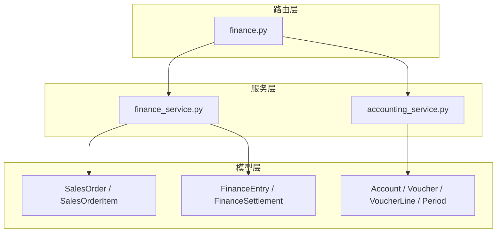
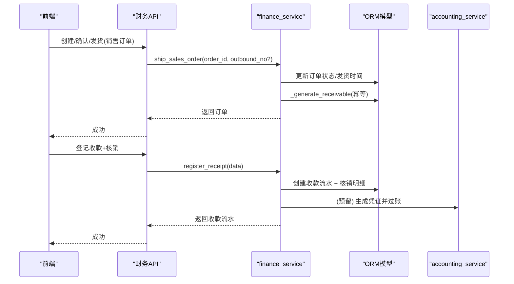
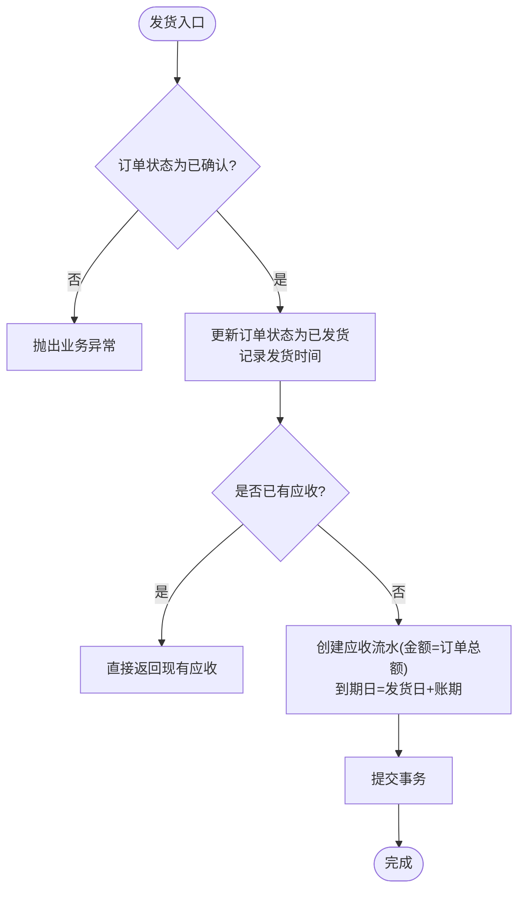
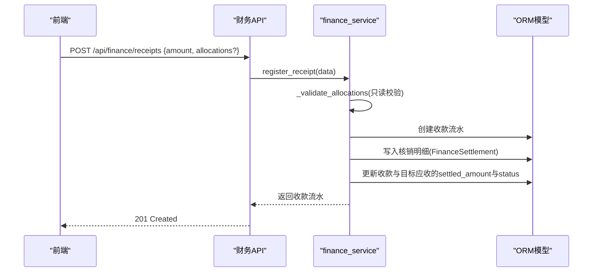
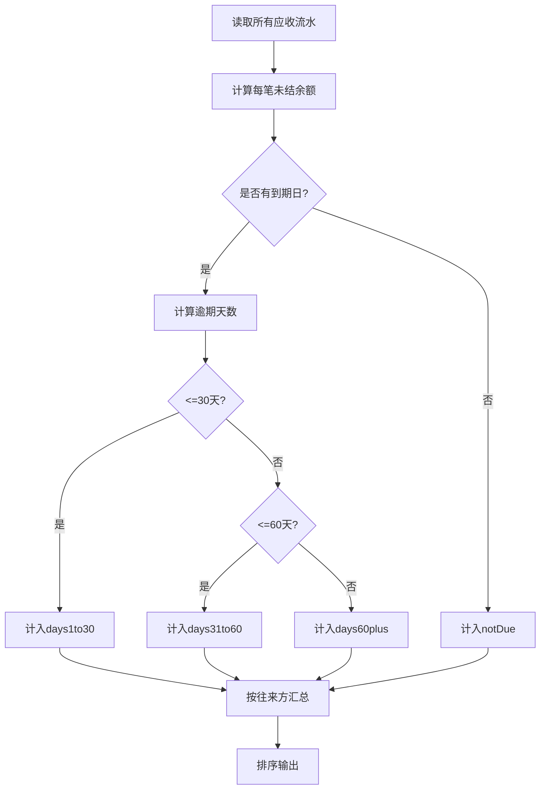
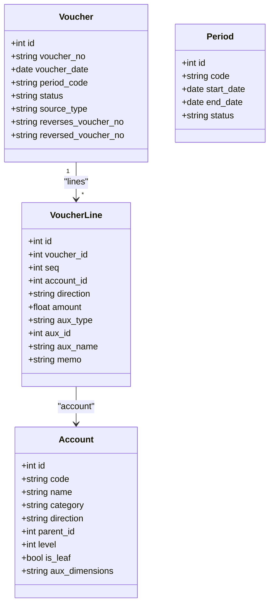
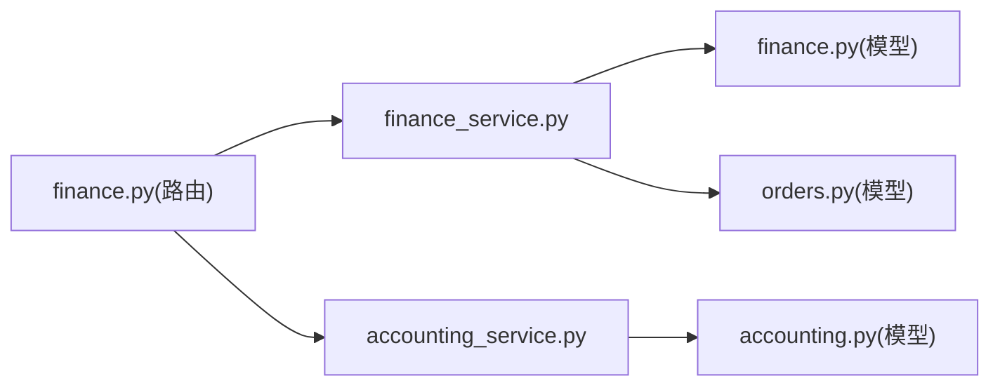

# 财务模型设计

<cite>
**本文引用的文件**
- [finance.py](file://backend-python/app/models/finance.py)
- [accounting.py](file://backend-python/app/models/accounting.py)
- [finance_service.py](file://backend-python/app/services/finance_service.py)
- [accounting_service.py](file://backend-python/app/services/accounting_service.py)
- [finance.py](file://backend-python/app/routers/finance.py)
- [orders.py](file://backend-python/app/models/orders.py)
- [PRD.md](file://docs/PRD.md)
</cite>

## 目录
1. [引言](#引言)
2. [项目结构](#项目结构)
3. [核心组件](#核心组件)
4. [架构总览](#架构总览)
5. [详细组件分析](#详细组件分析)
6. [依赖关系分析](#依赖关系分析)
7. [性能与一致性](#性能与一致性)
8. [故障排查指南](#故障排查指南)
9. [结论](#结论)
10. [附录：示例数据与业务场景](#附录示例数据与业务场景)

## 引言
本文件面向WMS系统的财务模型，聚焦业财一体的数据模型与流程：销售订单如何自动生成应收、出库/发货如何触发应收确认、收款如何核销应收并生成凭证；同时说明财务流水的记账规则、借贷平衡原则、账龄分析的数据结构与计算逻辑，以及凭证引擎、科目映射、财务报表与结账机制对数据库的支持。文档基于当前代码实现进行梳理，确保可追溯与可落地。

## 项目结构
后端采用分层架构：
- 模型层（models）：定义业务与财务实体（销售订单、财务流水、核销明细、会计科目、凭证、期间等）。
- 服务层（services）：封装业务与财务处理逻辑（订单状态流转、应收生成、收款核销、账龄统计、凭证生命周期管理、期间结账等）。
- 路由层（routers）：暴露REST API供前端调用。
- Schema（schemas）：请求/响应校验与序列化。

图表来源
- [finance.py:24-117](file://backend-python/app/models/finance.py#L24-L117)
- [accounting.py:63-159](file://backend-python/app/models/accounting.py#L63-L159)
- [finance_service.py:118-607](file://backend-python/app/services/finance_service.py#L118-L607)
- [accounting_service.py:168-327](file://backend-python/app/services/accounting_service.py#L168-L327)
- [finance.py:13-59](file://backend-python/app/routers/finance.py#L13-L59)

章节来源
- [finance.py:24-117](file://backend-python/app/models/finance.py#L24-L117)
- [accounting.py:63-159](file://backend-python/app/models/accounting.py#L63-L159)
- [finance_service.py:118-607](file://backend-python/app/services/finance_service.py#L118-L607)
- [accounting_service.py:168-327](file://backend-python/app/services/accounting_service.py#L168-L327)
- [finance.py:13-59](file://backend-python/app/routers/finance.py#L13-L59)

## 核心组件
- 销售订单与明细：承载客户、商品、数量、单价、金额、账期、发货时间等，作为应收生成的源头。
- 财务流水（FinanceEntry）：统一抽象应收/应付/收款/付款，记录发生额、已核销额、到期日、状态（OPEN/PARTIAL/SETTLED），通过唯一约束保证幂等。
- 核销明细（FinanceSettlement）：记录一笔收款/付款对某张应收/应付的部分或全部核销。
- 会计科目（Account）：树状COA，支持类别、余额方向、辅助核算维度，仅明细科目可挂分录。
- 凭证（Voucher/VoucherLine）：草稿→过账→冲销的状态机，强制借贷平衡，支持红字冲销与双向关联。
- 会计期间（Period）：自然月，支持开放/关闭控制，禁止在关闭期间写入凭证。

章节来源
- [finance.py:24-117](file://backend-python/app/models/finance.py#L24-L117)
- [accounting.py:63-159](file://backend-python/app/models/accounting.py#L63-L159)

## 架构总览
业财一体化关键路径：
- 销售订单创建与编辑（草稿态）→ 确认 → 发货（事务内生成应收，幂等）→ 收款登记与核销（支持部分核销与预收）→ 凭证引擎生成会计凭证（过账后不可改删，错误用红字冲销）→ 期末结账（期间锁定）。

图表来源
- [finance_service.py:246-336](file://backend-python/app/services/finance_service.py#L246-L336)
- [finance_service.py:411-439](file://backend-python/app/services/finance_service.py#L411-L439)
- [accounting_service.py:168-240](file://backend-python/app/services/accounting_service.py#L168-L240)

章节来源
- [finance_service.py:246-336](file://backend-python/app/services/finance_service.py#L246-L336)
- [finance_service.py:411-439](file://backend-python/app/services/finance_service.py#L411-L439)
- [accounting_service.py:168-240](file://backend-python/app/services/accounting_service.py#L168-L240)

## 详细组件分析

### 销售订单与应收生成
- 销售订单包含主表与明细，金额由明细累加，支持账期（影响应收到期日）。
- 发货动作在同一事务内生成应收：
  - 预查是否存在该订单的应收（幂等）。
  - 若不存在则创建FinanceEntry（RECEIVABLE），occurred_date=发货日期，due_date=发货日期+账期。
  - 使用DB唯一约束（source_order_no, entry_type）兜底并发重复。
- 订单状态机：DRAFT → CONFIRMED → SHIPPED → COMPLETED/CANCELLED。

图表来源
- [finance_service.py:246-336](file://backend-python/app/services/finance_service.py#L246-L336)
- [finance.py:24-67](file://backend-python/app/models/finance.py#L24-L67)

章节来源
- [finance_service.py:246-336](file://backend-python/app/services/finance_service.py#L246-L336)
- [finance.py:24-67](file://backend-python/app/models/finance.py#L24-L67)

### 收款登记与核销
- 收款登记：创建收款流水（RECEIPT），amount为到账金额，settled_amount初始为0。
- 核销分配：支持将一笔收款分配到多张应收/应付，单张应收可被多次部分核销。
- 校验策略：先只读校验（目标存在、类型正确、金额合法、不超未结余额、合计不超过可核销余额），通过后写入，避免脏写。
- 状态推导：根据settled_amount与amount的关系推导OPEN/PARTIAL/SETTLED。

图表来源
- [finance_service.py:341-439](file://backend-python/app/services/finance_service.py#L341-L439)
- [finance.py:71-117](file://backend-python/app/models/finance.py#L71-L117)
- [finance.py:39-52](file://backend-python/app/routers/finance.py#L39-L52)

章节来源
- [finance_service.py:341-439](file://backend-python/app/services/finance_service.py#L341-L439)
- [finance.py:71-117](file://backend-python/app/models/finance.py#L71-L117)
- [finance.py:39-52](file://backend-python/app/routers/finance.py#L39-L52)

### 账龄分析数据结构与计算逻辑
- 以到期日为基准分段：
  - notDue：未到期
  - days1to30：逾期1-30天
  - days31to60：逾期31-60天
  - days60plus：逾期60天以上
- 按往来方汇总：应收总额、已核销总额、未结余额、各账龄段分布。
- 实时计算，不落库；查询时按FinanceEntry聚合。

图表来源
- [finance_service.py:467-506](file://backend-python/app/services/finance_service.py#L467-L506)

章节来源
- [finance_service.py:467-506](file://backend-python/app/services/finance_service.py#L467-L506)

### 会计内核：科目、凭证、期间
- 科目表（Account）：树状结构，支持类别、余额方向、辅助核算维度；仅明细科目可挂分录。
- 凭证（Voucher/VoucherLine）：
  - 创建草稿：校验分录方向、科目有效性、金额非零。
  - 过账：强制至少两条分录且借贷平衡（EPS容差），期间必须开放。
  - 冲销：生成镜像负数分录的新凭证，直接过账，双向单号关联，原凭证标记为REVERSED。
- 期间（Period）：自然月，支持open/close；关闭期间拒绝写入凭证。

图表来源
- [accounting.py:63-159](file://backend-python/app/models/accounting.py#L63-L159)

章节来源
- [accounting_service.py:168-327](file://backend-python/app/services/accounting_service.py#L168-L327)
- [accounting.py:63-159](file://backend-python/app/models/accounting.py#L63-L159)

### 业财一体流程与凭证生成（预留扩展点）
- 当前实现中，发货生成应收、收款核销均已完成；凭证引擎（事件→分录→过账）在会计服务层具备能力（创建/过账/冲销/期间控制），可在后续接入业务事件（如发货、收款）自动产生凭证。
- PRD明确：凭证失败需与业务同一事务回滚，确保一致性与幂等。

章节来源
- [PRD.md:86-97](file://docs/PRD.md#L86-L97)
- [accounting_service.py:168-297](file://backend-python/app/services/accounting_service.py#L168-L297)

## 依赖关系分析
- 路由层依赖服务层，服务层依赖模型层；服务层内部通过SQLAlchemy Session进行事务操作。
- finance_service与accounting_service解耦：前者负责业务与财务流水，后者负责会计内核；未来可通过事件驱动将两者串联。
- 库存相关模型（orders.py）提供出入库、波次、拣货等基础，财务模块与之通过“发货”事件衔接。

图表来源
- [finance.py:13-59](file://backend-python/app/routers/finance.py#L13-L59)
- [finance_service.py:118-607](file://backend-python/app/services/finance_service.py#L118-L607)
- [accounting_service.py:168-327](file://backend-python/app/services/accounting_service.py#L168-L327)
- [orders.py:50-123](file://backend-python/app/models/orders.py#L50-L123)

章节来源
- [finance.py:13-59](file://backend-python/app/routers/finance.py#L13-L59)
- [finance_service.py:118-607](file://backend-python/app/services/finance_service.py#L118-L607)
- [accounting_service.py:168-327](file://backend-python/app/services/accounting_service.py#L168-L327)
- [orders.py:50-123](file://backend-python/app/models/orders.py#L50-L123)

## 性能与一致性
- 幂等性：
  - 应收生成通过DB唯一约束（source_order_no, entry_type）与服务层预查双重保障，防止并发重复入账。
- 事务一致性：
  - 发货与应收生成在同一事务；若应收生成失败，整单回滚，避免“已发货无应收”的不一致状态。
- 金额精度：
  - 服务层统一round(value, 2)，演示口径使用Float；PRD要求生产环境使用Decimal(Numeric(18,2))以保证精确比较。
- 期间控制：
  - 过账前检查期间是否开放，关闭期间拒绝写入，保障报表稳定性。
- 借贷平衡：
  - 过账时强制借方合计等于贷方合计（EPS容差），否则拒绝过账。

章节来源
- [finance_service.py:295-336](file://backend-python/app/services/finance_service.py#L295-L336)
- [accounting_service.py:220-240](file://backend-python/app/services/accounting_service.py#L220-L240)
- [PRD.md:126-143](file://docs/PRD.md#L126-L143)

## 故障排查指南
- 重复发货/重复应收：
  - 现象：提示“订单已发货”或“应收已存在”。
  - 原因：状态机限制或唯一约束冲突。
  - 处理：检查订单状态与FinanceEntry是否存在；必要时重试或清理异常数据。
- 核销失败：
  - 现象：提示“超过可核销余额”或“目标不存在”。
  - 原因：allocations校验失败或目标流水不存在/类型不符。
  - 处理：核对目标entry_id与未结余额，调整分配金额。
- 凭证过账失败：
  - 现象：提示“借贷不平衡”或“期间已关闭”。
  - 原因：分录不完整或期间锁定。
  - 处理：补齐分录、检查期间状态；如需更正，使用红字冲销。
- 删除应收失败：
  - 现象：提示“已存在核销记录，不允许删除”。
  - 原因：保护性校验阻止破坏性操作。
  - 处理：先撤销核销或走冲销流程。

章节来源
- [finance_service.py:246-268](file://backend-python/app/services/finance_service.py#L246-L268)
- [finance_service.py:341-364](file://backend-python/app/services/finance_service.py#L341-L364)
- [accounting_service.py:220-240](file://backend-python/app/services/accounting_service.py#L220-L240)
- [finance_service.py:593-607](file://backend-python/app/services/finance_service.py#L593-L607)

## 结论
本财务模型以“销售订单—应收—收款核销—凭证—期间”为主线，实现了业财一体的核心闭环：发货即生成应收，收款可灵活核销，凭证引擎提供严格的借贷平衡与期间控制。通过幂等设计与事务一致性保障，系统能够在高并发下稳定运行。后续可扩展凭证引擎的事件驱动，使业务单据自动转化为会计凭证，进一步打通利润表与资产负债表。

## 附录：示例数据与业务场景
- 示例数据建议：
  - 客户：若干客户，设置不同账期（如30天、60天）。
  - 商品：若干SKU，设定单价。
  - 销售订单：创建草稿→确认→发货（生成应收），模拟不同账期与到期日。
  - 收款登记：登记收款，部分核销到多张应收，剩余为预收。
  - 凭证：手工录入或引擎自动生成，过账后查看余额表与报表。
- 典型场景：
  - 场景A：发货即入账，利润表收入项增加；成本结转由库存成本口径支撑。
  - 场景B：收款核销，银行流入对应应收减少，账龄分布变化。
  - 场景C：月末结账，检查试算平衡与草稿，锁定期间，发现错误用红字冲销。

章节来源
- [PRD.md:39-47](file://docs/PRD.md#L39-L47)
- [finance_service.py:511-588](file://backend-python/app/services/finance_service.py#L511-L588)