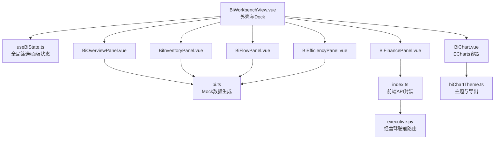
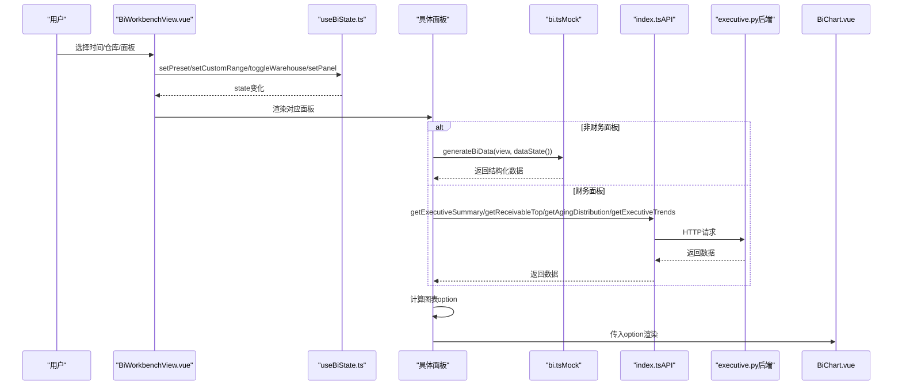
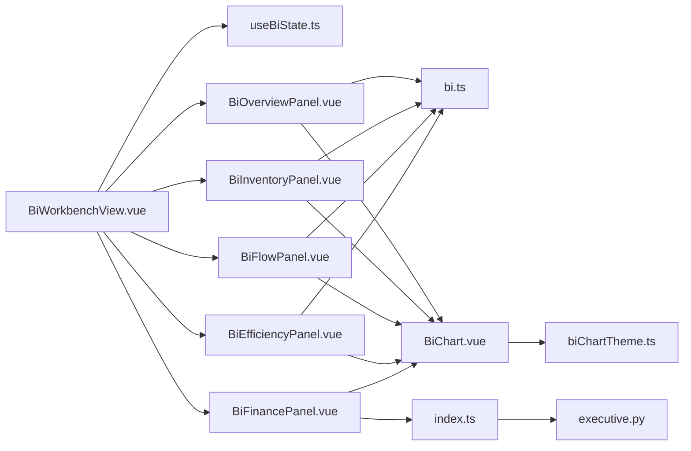

# BI工作台

<cite>
**本文引用的文件**
- [BiWorkbenchView.vue](file://frontend-vue/src/views/bi/BiWorkbenchView.vue)
- [useBiState.ts](file://frontend-vue/src/composables/useBiState.ts)
- [bi.ts（Mock数据层）](file://frontend-vue/src/api/mock/bi.ts)
- [BiOverviewPanel.vue](file://frontend-vue/src/views/bi/BiOverviewPanel.vue)
- [BiInventoryPanel.vue](file://frontend-vue/src/views/bi/BiInventoryPanel.vue)
- [BiFlowPanel.vue](file://frontend-vue/src/views/bi/BiFlowPanel.vue)
- [BiEfficiencyPanel.vue](file://frontend-vue/src/views/bi/BiEfficiencyPanel.vue)
- [BiFinancePanel.vue](file://frontend-vue/src/views/bi/BiFinancePanel.vue)
- [BiChart.vue](file://frontend-vue/src/components/BiChart.vue)
- [biChartTheme.ts](file://frontend-vue/src/views/bi/biChartTheme.ts)
- [BiModal.vue](file://frontend-vue/src/components/BiModal.vue)
- [index.ts（前端API封装）](file://frontend-vue/src/api/index.ts)
- [executive.py（经营驾驶舱路由）](file://backend-python/app/routers/executive.py)
- [dashboard.py（数据看板路由）](file://backend-python/app/routers/dashboard.py)
- [dashboard_service.py（首页统计服务）](file://backend-python/app/services/dashboard_service.py)
</cite>

## 目录
1. [简介](#简介)
2. [项目结构](#项目结构)
3. [核心组件](#核心组件)
4. [架构总览](#架构总览)
5. [详细组件分析](#详细组件分析)
6. [依赖关系分析](#依赖关系分析)
7. [性能与内存优化](#性能与内存优化)
8. [故障排查指南](#故障排查指南)
9. [结论](#结论)
10. [附录：指标定义与计算口径](#附录指标定义与计算口径)

## 简介
本文件为WMS系统BI工作台的综合技术文档，聚焦模块化面板架构、数据来源、计算逻辑、可视化呈现、面板间交互与联动、自定义维度与筛选、下钻分析、大数据渲染与内存管理，以及业务指标的统一定义与计算标准。整体采用“统一状态 + Mock/真实接口双轨数据源”的架构：概览、库存、出入库、效率四个面板使用本地可复现的Mock数据；经营财务面板对接后端真实接口，提供一致的Apple风格展示与导出能力。

## 项目结构
BI工作台由“外壳容器 + Dock面板切换 + 全局筛选状态 + 各面板视图 + 图表组件 + 主题工具 + 数据层（Mock/接口）”构成。外壳负责时间范围、仓库多选、面板切换与导出；各面板通过统一状态派生数据并渲染图表；图表组件封装ECharts生命周期与导出；主题工具统一样式与导出流程。

**图示来源**
- [BiWorkbenchView.vue:1-104](file://frontend-vue/src/views/bi/BiWorkbenchView.vue#L1-L104)
- [useBiState.ts:1-60](file://frontend-vue/src/composables/useBiState.ts#L1-L60)
- [bi.ts（Mock数据层）:1-405](file://frontend-vue/src/api/mock/bi.ts#L1-L405)
- [BiChart.vue:1-59](file://frontend-vue/src/components/BiChart.vue#L1-L59)
- [biChartTheme.ts:1-79](file://frontend-vue/src/views/bi/biChartTheme.ts#L1-L79)
- [index.ts（前端API封装）:678-719](file://frontend-vue/src/api/index.ts#L678-L719)
- [executive.py:1-44](file://backend-python/app/routers/executive.py#L1-L44)

**章节来源**
- [BiWorkbenchView.vue:1-104](file://frontend-vue/src/views/bi/BiWorkbenchView.vue#L1-L104)
- [useBiState.ts:1-60](file://frontend-vue/src/composables/useBiState.ts#L1-L60)

## 核心组件
- 外壳与Dock：提供时间预设、自定义区间、仓库多选、面板切换、图表导出。
- 全局状态：维护时间范围、仓库选择、当前激活面板；提供dataState快照供数据生成器使用。
- 面板视图：概览、库存、出入库、效率、财务五个面板，分别聚合KPI、趋势、分布、排行等可视化。
- 图表组件：统一初始化、更新、销毁、导出图片，暴露实例与事件。
- 主题工具：统一配色、坐标轴、提示框、导出PNG流程。
- 弹窗组件：通用下钻弹窗，支持键盘关闭与遮罩关闭。

**章节来源**
- [BiWorkbenchView.vue:1-104](file://frontend-vue/src/views/bi/BiWorkbenchView.vue#L1-L104)
- [useBiState.ts:1-60](file://frontend-vue/src/composables/useBiState.ts#L1-L60)
- [BiChart.vue:1-59](file://frontend-vue/src/components/BiChart.vue#L1-L59)
- [biChartTheme.ts:1-79](file://frontend-vue/src/views/bi/biChartTheme.ts#L1-L79)
- [BiModal.vue:1-37](file://frontend-vue/src/components/BiModal.vue#L1-L37)

## 架构总览
BI工作台采用“状态驱动 + 视图解耦”的架构。所有面板共享同一份筛选状态，数据生成器根据状态派生稳定可复现的数据；图表组件集中管理ECharts实例，避免重复样板代码；主题工具统一视觉与导出；财务面板通过前端API调用后端经营驾驶舱接口，失败时降级为空态，不影响其他Mock面板。

**图示来源**
- [BiWorkbenchView.vue:1-104](file://frontend-vue/src/views/bi/BiWorkbenchView.vue#L1-L104)
- [useBiState.ts:1-60](file://frontend-vue/src/composables/useBiState.ts#L1-L60)
- [bi.ts（Mock数据层）:390-405](file://frontend-vue/src/api/mock/bi.ts#L390-L405)
- [index.ts（前端API封装）:678-719](file://frontend-vue/src/api/index.ts#L678-L719)
- [executive.py:1-44](file://backend-python/app/routers/executive.py#L1-L44)

## 详细组件分析

### 外壳与Dock（BiWorkbenchView.vue）
- 功能：顶栏时间预设、自定义日期校验、仓库多选、导出当前面板图表；Dock切换面板；KeepAlive缓存面板。
- 交互：点击统计卡片跳转到“出入库分析”；导出调用主题工具遍历图表节点并下载PNG。
- 关键点：使用markRaw注册面板组件以避免不必要的响应式开销；通过useBiState统一管理状态。

**章节来源**
- [BiWorkbenchView.vue:1-104](file://frontend-vue/src/views/bi/BiWorkbenchView.vue#L1-L104)

### 全局状态（useBiState.ts）
- 字段：time（preset/start/end）、warehouses（含all语义）、activePanel。
- 方法：setPreset、setCustomRange、setPanel、toggleWarehouse、dataState（快照）。
- 设计：dataState去除activePanel，保证切换面板不改变数据seed；仓库多选包含“全部”互斥逻辑。

**章节来源**
- [useBiState.ts:1-60](file://frontend-vue/src/composables/useBiState.ts#L1-L60)

### 概览面板（BiOverviewPanel.vue）
- 数据源：generateBiData('overview', dataState())，零网络请求，基于seed稳定生成。
- 可视化：KPI卡、彩色统计卡、出入库趋势、单据状态分布、仓库库存分布、预警列表与下钻Modal、待办网格。
- 交互：点击统计卡片跳转至“出入库分析”；预警项点击打开下钻Modal展示SKU明细与近7天出入库迷你图。
- 计算逻辑：趋势按时间范围生成；订单状态分布汇总；仓库可用/锁定堆叠条形图；预警阈值对比与剩余天数估算。

**章节来源**
- [BiOverviewPanel.vue:1-172](file://frontend-vue/src/views/bi/BiOverviewPanel.vue#L1-L172)
- [bi.ts（Mock数据层）:172-263](file://frontend-vue/src/api/mock/bi.ts#L172-L263)

### 库存分析面板（BiInventoryPanel.vue）
- 数据源：generateBiData('inventory', dataState())。
- 可视化：高库存SKU TOP10、低库存SKU TOP10、库龄分布饼图、批次状态堆叠条形图、ABC分类帕累托（金额+累计占比）。
- 计算逻辑：TOP10排序；库龄分段统计；批次状态按仓库堆叠；ABC分类按金额累计占比划分A/B/C段。

**章节来源**
- [BiInventoryPanel.vue:1-110](file://frontend-vue/src/views/bi/BiInventoryPanel.vue#L1-L110)
- [bi.ts（Mock数据层）:265-312](file://frontend-vue/src/api/mock/bi.ts#L265-L312)

### 出入库分析面板（BiFlowPanel.vue）
- 数据源：generateBiData('flow', dataState())。
- 可视化：30天出入库趋势（数量/金额切换）、净增减仪表盘、退货原因分布、供应商入库TOP10（金额+准时率）、客户出库TOP10（金额+退货率）、退货率趋势。
- 计算逻辑：30天趋势聚合；净额=入库合计-出库合计；退货率阈值告警；供应商/客户排行与比率着色。

**章节来源**
- [BiFlowPanel.vue:1-123](file://frontend-vue/src/views/bi/BiFlowPanel.vue#L1-L123)
- [bi.ts（Mock数据层）:314-337](file://frontend-vue/src/api/mock/bi.ts#L314-L337)

### 作业效率面板（BiEfficiencyPanel.vue）
- 数据源：generateBiData('efficiency', dataState())。
- 可视化：人均日拣货柱状图（均值线）、波次状态环形图、各环节耗时箱线图（P10-P90）、实时任务流水表（Tab过滤）。
- 交互：员工柱点击下钻显示个人近7日拣货明细；任务Tab过滤进行中/已完成/异常。
- 计算逻辑：员工日均=7日总量/7；波次完成率=已完成/总数；耗时分位数统计；任务进度与状态映射颜色。

**章节来源**
- [BiEfficiencyPanel.vue:1-169](file://frontend-vue/src/views/bi/BiEfficiencyPanel.vue#L1-L169)
- [bi.ts（Mock数据层）:339-388](file://frontend-vue/src/api/mock/bi.ts#L339-L388)

### 经营财务面板（BiFinancePanel.vue）
- 数据源：真实接口 /api/executive/*（总结、应收TOP、账龄分布、趋势），失败时静默降级为空态。
- 可视化：应收总额/已回款/未回款/逾期KPI、账龄分布饼图、应收余额TOP客户横条图、订单/回款趋势折线图、经营概览描述网格。
- 计算逻辑：金额格式化（万/亿）；账龄分段统计；趋势按天数聚合；失败捕获后仅该面板受限。

**章节来源**
- [BiFinancePanel.vue:1-145](file://frontend-vue/src/views/bi/BiFinancePanel.vue#L1-L145)
- [index.ts（前端API封装）:678-719](file://frontend-vue/src/api/index.ts#L678-L719)
- [executive.py:1-44](file://backend-python/app/routers/executive.py#L1-L44)

### 图表组件与主题（BiChart.vue、biChartTheme.ts）
- BiChart.vue：封装ECharts初始化、监听resize、销毁、导出图片、暴露实例；统一emit chart-click事件。
- biChartTheme.ts：统一配色、字体、提示框、坐标轴样式；导出面板内所有图表为PNG；提供stamp文件名时间戳。

**章节来源**
- [BiChart.vue:1-59](file://frontend-vue/src/components/BiChart.vue#L1-L59)
- [biChartTheme.ts:1-79](file://frontend-vue/src/views/bi/biChartTheme.ts#L1-L79)

### 下钻弹窗（BiModal.vue）
- 功能：Teleport到body，复用局部主题；支持遮罩、右上角X、ESC关闭；v-model:visible与@close双模式。
- 使用场景：概览预警下钻、效率员工明细下钻。

**章节来源**
- [BiModal.vue:1-37](file://frontend-vue/src/components/BiModal.vue#L1-L37)

## 依赖关系分析
- 外壳依赖useBiState管理状态与各面板组件；面板依赖bi.ts或index.ts获取数据；图表组件依赖biChartTheme统一样式；财务面板依赖后端路由。
- 模块耦合：面板与数据源松耦合（通过generateBiData或API函数）；图表组件与主题解耦（通过option注入）；状态与视图通过响应式绑定。

**图示来源**
- [BiWorkbenchView.vue:1-104](file://frontend-vue/src/views/bi/BiWorkbenchView.vue#L1-L104)
- [useBiState.ts:1-60](file://frontend-vue/src/composables/useBiState.ts#L1-L60)
- [bi.ts（Mock数据层）:390-405](file://frontend-vue/src/api/mock/bi.ts#L390-L405)
- [index.ts（前端API封装）:678-719](file://frontend-vue/src/api/index.ts#L678-L719)
- [executive.py:1-44](file://backend-python/app/routers/executive.py#L1-L44)
- [BiChart.vue:1-59](file://frontend-vue/src/components/BiChart.vue#L1-L59)
- [biChartTheme.ts:1-79](file://frontend-vue/src/views/bi/biChartTheme.ts#L1-L79)

**章节来源**
- [BiWorkbenchView.vue:1-104](file://frontend-vue/src/views/bi/BiWorkbenchView.vue#L1-L104)
- [bi.ts（Mock数据层）:390-405](file://frontend-vue/src/api/mock/bi.ts#L390-L405)
- [index.ts（前端API封装）:678-719](file://frontend-vue/src/api/index.ts#L678-L719)

## 性能与内存优化
- 图表实例管理：BiChart.vue在onBeforeUnmount中dispose实例并断开ResizeObserver，避免内存泄漏。
- 大数据量渲染：
  - 使用computed派生option，减少重复计算；ECharts启用areaStyle与smooth降低绘制复杂度。
  - 对长序列使用dataZoom（如出入库趋势）提升交互体验。
  - 批量导出时逐图获取dataURL并下载，避免一次性构建大对象。
- 内存管理建议：
  - KeepAlive缓存面板但避免过度嵌套；必要时按需懒加载面板。
  - 对大量表格数据分页或虚拟滚动（当前任务流水为静态Mock，可扩展）。
  - 避免在option中创建闭包引用大对象；保持数据扁平化。
- 性能特征：
  - Mock数据生成纯函数，无网络IO，首屏快；财务面板首次加载受后端冷启动影响，已做超时与降级处理。

[本节为通用指导，不直接分析具体文件]

## 故障排查指南
- 财务面板数据不可用：检查后端executive路由是否可达；前端捕获异常后显示警告信息，不影响其他面板。
- 图表不更新：确认option是否为响应式computed；BiChart.vue监听option深变化并setOption。
- 导出图片为空：确保图表已初始化且DOM存在；exportPanelCharts遍历.bi-chart节点并获取实例。
- 状态不同步：检查useBiState的dataState快照是否正确传递；切换面板不应影响数据seed。

**章节来源**
- [BiFinancePanel.vue:73-87](file://frontend-vue/src/views/bi/BiFinancePanel.vue#L73-L87)
- [BiChart.vue:27-49](file://frontend-vue/src/components/BiChart.vue#L27-L49)
- [biChartTheme.ts:52-62](file://frontend-vue/src/views/bi/biChartTheme.ts#L52-L62)
- [useBiState.ts:48-49](file://frontend-vue/src/composables/useBiState.ts#L48-L49)

## 结论
BI工作台以统一状态驱动多面板，Mock与真实接口双轨数据源兼顾演示与生产；图表组件与主题工具实现一致体验与导出能力；面板间通过状态与导航实现联动；下钻弹窗增强细节探索；性能与内存管理通过实例生命周期与渲染策略保障。后续可逐步将Mock替换为聚合接口，扩展更多维度与指标。

[本节为总结性内容，不直接分析具体文件]

## 附录：指标定义与计算口径
- 库存周转率：月度库存周转次数（Mock中按随机范围生成，用于趋势与KPI展示）。
- 库容使用率：可用库存容量占仓库总容量的百分比（结合仓库数量因子）。
- 今日订单量：当日订单数（Mock随机区间）。
- 作业效率：入库/出库完成量与计划量对比（进度条展示）。
- 出入库趋势：按时间范围聚合入库/出库数量或金额（数量/金额切换）。
- 净增减：入库合计减去出库合计。
- 退货率：退货单数/出库单数比例（超过阈值告警）。
- ABC分类：按金额累计占比划分A（≤70%）、B（≤90%）、C（>90%）。
- 波次完成率：已完成波次/总波次。
- 各环节耗时：P10/P25/P50/P75/P90分位数（分钟）。
- 经营财务指标：应收总额、已回款、未回款、逾期金额、订单数与订单金额、账龄分布、趋势（订单/回款金额）。

[本节为概念性说明，不直接分析具体文件]