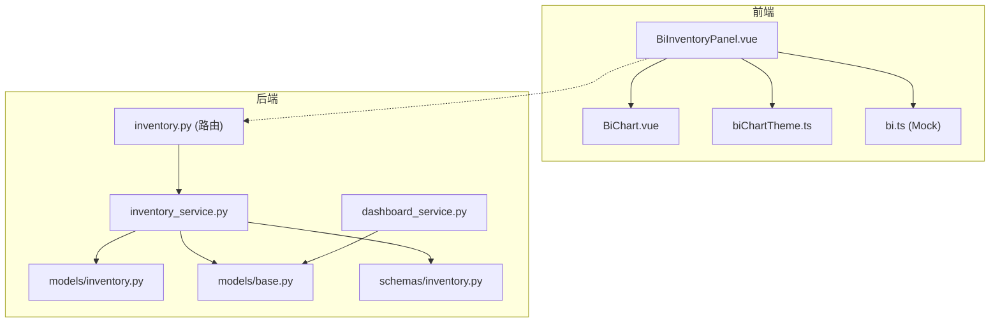
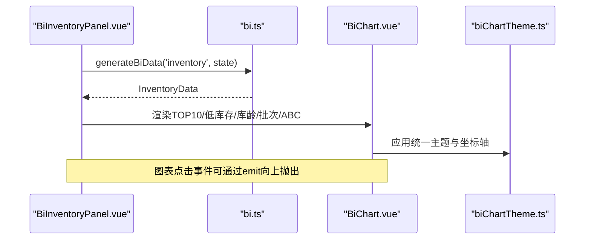
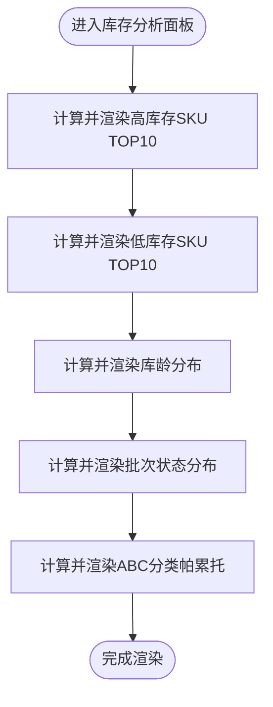
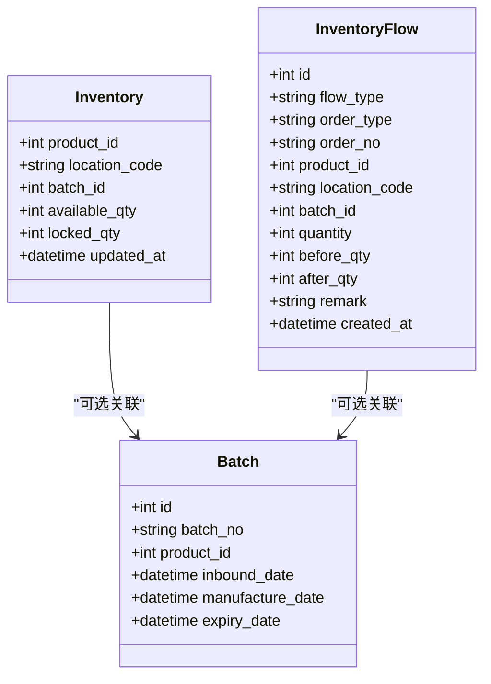
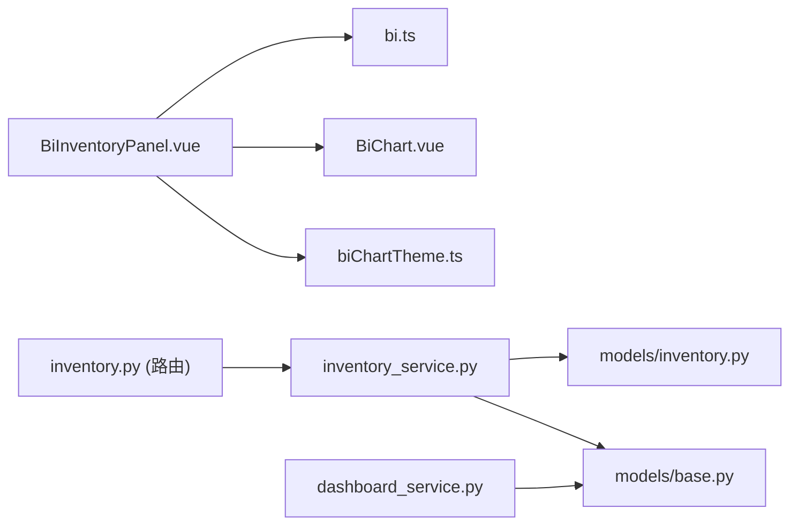

# 库存分析面板

<cite>
**本文引用的文件**
- [BiInventoryPanel.vue](file://frontend-vue/src/views/bi/BiInventoryPanel.vue)
- [bi.ts](file://frontend-vue/src/api/mock/bi.ts)
- [BiChart.vue](file://frontend-vue/src/components/BiChart.vue)
- [biChartTheme.ts](file://frontend-vue/src/views/bi/biChartTheme.ts)
- [inventory.py](file://backend-python/app/routers/inventory.py)
- [inventory_service.py](file://backend-python/app/services/inventory_service.py)
- [inventory.py](file://backend-python/app/models/inventory.py)
- [inventory.py](file://backend-python/app/schemas/inventory.py)
- [dashboard_service.py](file://backend-python/app/services/dashboard_service.py)
- [base.py](file://backend-python/app/models/base.py)
</cite>

## 目录
1. [简介](#简介)
2. [项目结构](#项目结构)
3. [核心组件](#核心组件)
4. [架构总览](#架构总览)
5. [详细组件分析](#详细组件分析)
6. [依赖关系分析](#依赖关系分析)
7. [性能考量](#性能考量)
8. [故障排查指南](#故障排查指南)
9. [结论](#结论)
10. [附录：自定义查询接口使用指南](#附录自定义查询接口使用指南)

## 简介
本文件为BI工作台的“库存分析面板”提供综合文档，覆盖以下目标：
- 库存周转率、库龄分析、安全库存预警等指标的统计与展示说明
- 库存分布视图的实现（按商品类别、仓库位置、批次等多维度）
- 库存异常检测算法与预警机制
- 库存趋势预测的数据模型与计算方法
- 库存优化建议的生成逻辑与展示方式
- 库存数据分析的自定义查询接口使用指南

当前前端库存分析面板采用可复现的Mock数据驱动，后端提供库存明细、流水、批次等真实查询能力，便于后续替换为真实聚合接口。

## 项目结构
- 前端
  - 库存分析面板：BiInventoryPanel.vue
  - 图表容器：BiChart.vue
  - 主题与工具：biChartTheme.ts
  - Mock数据层：bi.ts（含库存分析数据生成器）
- 后端
  - 路由：inventory.py（库存查询、流水、批次）
  - 服务：inventory_service.py（库存读写、查询、分页）
  - 模型：inventory.py（Batch、Inventory、InventoryFlow）、base.py（Product、Warehouse、Location等）
  - Schema：inventory.py（响应结构定义）
  - 看板汇总：dashboard_service.py（首页统计，包含低库存计数）

图示来源
- [BiInventoryPanel.vue:1-110](file://frontend-vue/src/views/bi/BiInventoryPanel.vue#L1-L110)
- [bi.ts:265-312](file://frontend-vue/src/api/mock/bi.ts#L265-L312)
- [inventory.py:12-61](file://backend-python/app/routers/inventory.py#L12-L61)
- [inventory_service.py:256-437](file://backend-python/app/services/inventory_service.py#L256-L437)
- [inventory.py:18-98](file://backend-python/app/models/inventory.py#L18-L98)
- [base.py:14-95](file://backend-python/app/models/base.py#L14-L95)
- [dashboard_service.py:18-49](file://backend-python/app/services/dashboard_service.py#L18-L49)

章节来源
- [BiInventoryPanel.vue:1-110](file://frontend-vue/src/views/bi/BiInventoryPanel.vue#L1-L110)
- [bi.ts:265-312](file://frontend-vue/src/api/mock/bi.ts#L265-L312)
- [inventory.py:12-61](file://backend-python/app/routers/inventory.py#L12-L61)
- [inventory_service.py:256-437](file://backend-python/app/services/inventory_service.py#L256-L437)
- [inventory.py:18-98](file://backend-python/app/models/inventory.py#L18-L98)
- [base.py:14-95](file://backend-python/app/models/base.py#L14-L95)
- [dashboard_service.py:18-49](file://backend-python/app/services/dashboard_service.py#L18-L49)

## 核心组件
- 库存分析面板（前端）
  - 高库存SKU TOP10、低库存SKU TOP10
  - 库龄分布（饼图）
  - 批次状态分布（堆叠柱状图，按仓库）
  - ABC分类帕累托（金额+累计占比）
- 图表容器（前端）
  - 统一ECharts初始化、更新、自适应、导出能力
- 主题与轴配置（前端）
  - 统一配色、字体、网格、坐标轴样式
- 库存数据服务（后端）
  - 库存查询（产品/库位双视图）、库存流水查询、批次列表
- 数据模型（后端）
  - 批次、库存行（可用量/锁定量分离）、库存流水
  - 商品、仓库、库区、库位基础模型
- 看板汇总（后端）
  - 库存总量、低库存商品数等首页指标

章节来源
- [BiInventoryPanel.vue:16-91](file://frontend-vue/src/views/bi/BiInventoryPanel.vue#L16-L91)
- [BiChart.vue:1-59](file://frontend-vue/src/components/BiChart.vue#L1-L59)
- [biChartTheme.ts:16-79](file://frontend-vue/src/views/bi/biChartTheme.ts#L16-L79)
- [inventory_service.py:256-437](file://backend-python/app/services/inventory_service.py#L256-L437)
- [inventory.py:18-98](file://backend-python/app/models/inventory.py#L18-L98)
- [base.py:14-95](file://backend-python/app/models/base.py#L14-L95)
- [dashboard_service.py:18-49](file://backend-python/app/services/dashboard_service.py#L18-L49)

## 架构总览
库存分析面板由前端可视化与后端数据服务组成。当前库存分析面板通过Mock数据生成器提供稳定可复现的图表数据；后端提供真实的库存明细、流水、批次查询接口，可用于替换或扩展为真实聚合API。

图示来源
- [BiInventoryPanel.vue:13-91](file://frontend-vue/src/views/bi/BiInventoryPanel.vue#L13-L91)
- [bi.ts:265-312](file://frontend-vue/src/api/mock/bi.ts#L265-L312)
- [BiChart.vue:23-49](file://frontend-vue/src/components/BiChart.vue#L23-L49)
- [biChartTheme.ts:16-79](file://frontend-vue/src/views/bi/biChartTheme.ts#L16-L79)

## 详细组件分析

### 库存分析面板（前端）
- 高库存SKU TOP10：水平条形图，按数量降序
- 低库存SKU TOP10：水平条形图，用于补货提示
- 库龄分布：环形饼图，按区间统计SKU数量与金额占比
- 批次状态分布：堆叠柱状图，按仓库展示正常/临期/过期/冻结
- ABC分类帕累托：柱状图（金额）+折线（累计占比），A/B/C阈值标记

图示来源
- [BiInventoryPanel.vue:16-91](file://frontend-vue/src/views/bi/BiInventoryPanel.vue#L16-L91)
- [bi.ts:265-312](file://frontend-vue/src/api/mock/bi.ts#L265-L312)

章节来源
- [BiInventoryPanel.vue:16-91](file://frontend-vue/src/views/bi/BiInventoryPanel.vue#L16-L91)
- [bi.ts:265-312](file://frontend-vue/src/api/mock/bi.ts#L265-L312)

### 图表容器与主题
- BiChart.vue：封装ECharts实例生命周期管理，支持resize监听、点击事件透传、导出图片
- biChartTheme.ts：统一配色、字体、网格、坐标轴样式，并提供下载与导出工具函数

章节来源
- [BiChart.vue:1-59](file://frontend-vue/src/components/BiChart.vue#L1-L59)
- [biChartTheme.ts:16-79](file://frontend-vue/src/views/bi/biChartTheme.ts#L16-L79)

### 库存数据服务（后端）
- 库存查询
  - view=product：按商品+仓库汇总可用/锁定
  - view=location：按商品+库位+批次明细
  - 支持关键词搜索、仓库过滤、批次过滤、分页
- 库存流水查询
  - 支持订单号、商品ID、库位、流水类型过滤，分页
- 批次列表
  - 支持关键字模糊匹配（批次号/商品名/SKU），分页

图示来源
- [inventory.py:18-98](file://backend-python/app/models/inventory.py#L18-L98)

章节来源
- [inventory.py:12-61](file://backend-python/app/routers/inventory.py#L12-L61)
- [inventory_service.py:256-437](file://backend-python/app/services/inventory_service.py#L256-L437)
- [inventory.py:18-98](file://backend-python/app/models/inventory.py#L18-L98)
- [inventory.py:7-60](file://backend-python/app/schemas/inventory.py#L7-L60)

### 看板汇总（后端）
- 提供库存总量、低库存商品数等首页统计
- 低库存判定：可用+锁定合计小于阈值的商品数

章节来源
- [dashboard_service.py:18-49](file://backend-python/app/services/dashboard_service.py#L18-L49)

## 依赖关系分析
- 前端依赖
  - BiInventoryPanel.vue 依赖 bi.ts 生成库存分析数据
  - 图表渲染依赖 BiChart.vue 与 biChartTheme.ts
- 后端依赖
  - inventory_service.py 依赖 models/inventory.py 与 models/base.py
  - 路由 inventory.py 调用 inventory_service.py
  - dashboard_service.py 依赖 models/base.py 进行汇总统计

图示来源
- [BiInventoryPanel.vue:1-110](file://frontend-vue/src/views/bi/BiInventoryPanel.vue#L1-L110)
- [bi.ts:265-312](file://frontend-vue/src/api/mock/bi.ts#L265-L312)
- [inventory.py:12-61](file://backend-python/app/routers/inventory.py#L12-L61)
- [inventory_service.py:256-437](file://backend-python/app/services/inventory_service.py#L256-L437)
- [inventory.py:18-98](file://backend-python/app/models/inventory.py#L18-L98)
- [base.py:14-95](file://backend-python/app/models/base.py#L14-L95)
- [dashboard_service.py:18-49](file://backend-python/app/services/dashboard_service.py#L18-L49)

章节来源
- [BiInventoryPanel.vue:1-110](file://frontend-vue/src/views/bi/BiInventoryPanel.vue#L1-L110)
- [bi.ts:265-312](file://frontend-vue/src/api/mock/bi.ts#L265-L312)
- [inventory.py:12-61](file://backend-python/app/routers/inventory.py#L12-L61)
- [inventory_service.py:256-437](file://backend-python/app/services/inventory_service.py#L256-L437)
- [inventory.py:18-98](file://backend-python/app/models/inventory.py#L18-L98)
- [base.py:14-95](file://backend-python/app/models/base.py#L14-L95)
- [dashboard_service.py:18-49](file://backend-python/app/services/dashboard_service.py#L18-L49)

## 性能考量
- 前端
  - 图表容器统一生命周期管理，避免重复初始化与内存泄漏
  - 主题与坐标轴复用减少重复配置开销
- 后端
  - 库存查询使用JOIN与聚合函数，减少N+1查询
  - 流水查询使用joinedload预加载关联实体，降低数据库往返
  - 分页限制page_size上限，防止大数据集导致性能问题

[本节为通用性能建议，不直接分析具体代码]

## 故障排查指南
- 前端图表不显示
  - 检查BiChart.vue是否正确初始化与监听resize
  - 确认biChartTheme.ts主题配置是否生效
- 后端查询返回空或错误
  - 核对inventory_service.py中的过滤条件与分页参数
  - 检查数据库连接与会话事务是否正常
- 低库存计数不准确
  - 核对dashboard_service.py中低库存判定阈值与聚合逻辑

章节来源
- [BiChart.vue:23-49](file://frontend-vue/src/components/BiChart.vue#L23-L49)
- [biChartTheme.ts:16-79](file://frontend-vue/src/views/bi/biChartTheme.ts#L16-L79)
- [inventory_service.py:256-437](file://backend-python/app/services/inventory_service.py#L256-L437)
- [dashboard_service.py:18-49](file://backend-python/app/services/dashboard_service.py#L18-L49)

## 结论
库存分析面板通过前端可视化与后端数据服务协同，实现了高/低库存、库龄分布、批次状态、ABC分类等关键指标的展示。当前采用Mock数据确保演示稳定性，同时后端已具备真实库存查询能力，便于后续替换为真实聚合接口以支撑生产环境。

[本节为总结性内容，不直接分析具体代码]

## 附录：自定义查询接口使用指南
- 库存查询
  - 路径：GET /api/inventory
  - 参数：view（product|location）、keyword、warehouseId、batchNo、page、pageSize
  - 用途：按商品或库位维度查询库存明细与汇总
- 库存流水
  - 路径：GET /api/inventory/flows
  - 参数：orderNo、productId、locationCode、flowType、page、pageSize
  - 用途：全量追溯库存变动
- 批次列表
  - 路径：GET /api/inventory/batches
  - 参数：keyword、page、pageSize
  - 用途：批次管理与有效期追踪

章节来源
- [inventory.py:12-61](file://backend-python/app/routers/inventory.py#L12-L61)
- [inventory_service.py:256-437](file://backend-python/app/services/inventory_service.py#L256-L437)