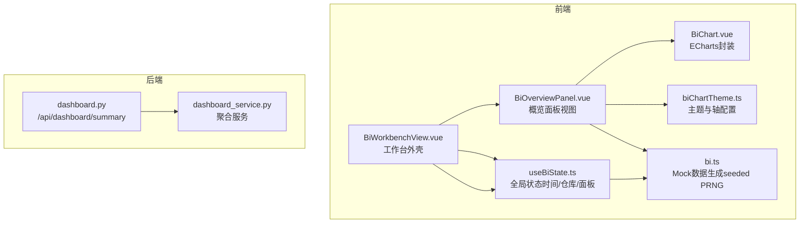
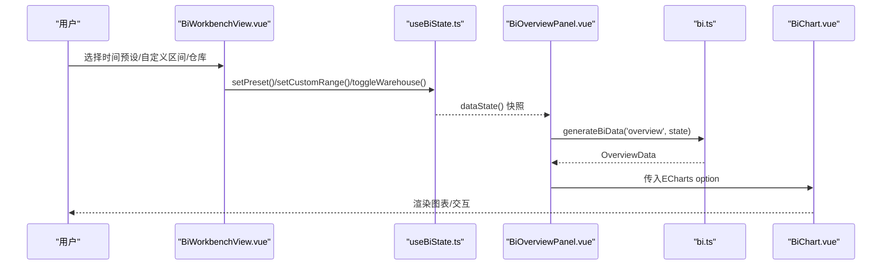
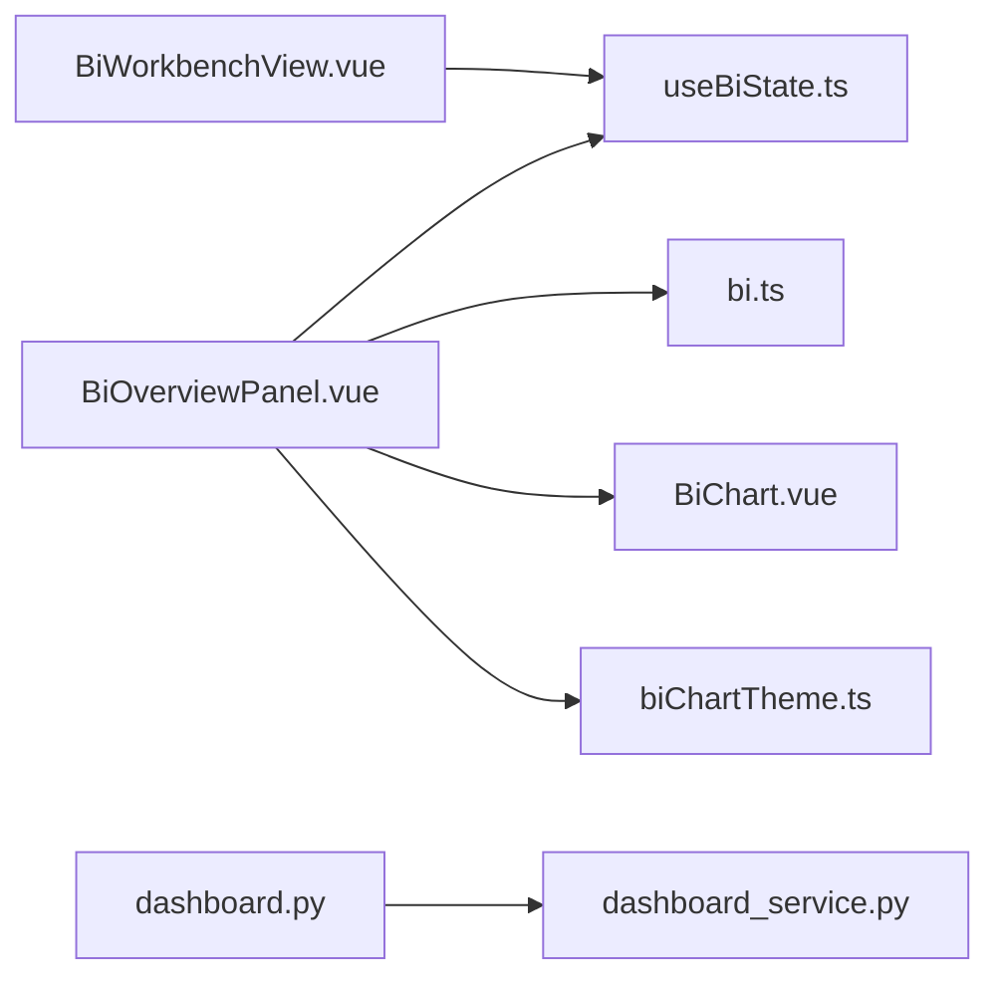

# 概览面板

<cite>
**本文引用的文件**
- [BiOverviewPanel.vue](file://frontend-vue/src/views/bi/BiOverviewPanel.vue)
- [useBiState.ts](file://frontend-vue/src/composables/useBiState.ts)
- [bi.ts（Mock数据层）](file://frontend-vue/src/api/mock/bi.ts)
- [BiWorkbenchView.vue](file://frontend-vue/src/views/bi/BiWorkbenchView.vue)
- [BiChart.vue](file://frontend-vue/src/components/BiChart.vue)
- [biChartTheme.ts](file://frontend-vue/src/views/bi/biChartTheme.ts)
- [dashboard.py](file://backend-python/app/routers/dashboard.py)
- [dashboard_service.py](file://backend-python/app/services/dashboard_service.py)
</cite>

## 目录
1. [简介](#简介)
2. [项目结构](#项目结构)
3. [核心组件](#核心组件)
4. [架构总览](#架构总览)
5. [详细组件分析](#详细组件分析)
6. [依赖关系分析](#依赖关系分析)
7. [性能考虑](#性能考虑)
8. [故障排查指南](#故障排查指南)
9. [结论](#结论)
10. [附录](#附录)

## 简介
本章节面向BI工作台的“概览面板”，聚焦以下目标：
- 说明关键业务指标（销售额、订单量、库存总量等）的可视化呈现方式。
- 描述数据聚合逻辑与计算方式，包括时间维度筛选、仓库维度过滤对数据的影响。
- 文档化图表类型选择与数据绑定机制。
- 解释与全局状态管理的集成方式（时间预设、仓库筛选联动）。
- 提供自定义指标扩展的方法与最佳实践。

## 项目结构
概览面板由前端Vue视图、统一图表容器、全局状态管理以及Mock数据层共同构成；后端提供独立的首页统计接口用于真实场景的数据聚合。

图示来源
- [BiWorkbenchView.vue:1-104](file://frontend-vue/src/views/bi/BiWorkbenchView.vue#L1-L104)
- [useBiState.ts:1-60](file://frontend-vue/src/composables/useBiState.ts#L1-L60)
- [BiOverviewPanel.vue:1-172](file://frontend-vue/src/views/bi/BiOverviewPanel.vue#L1-L172)
- [BiChart.vue:1-59](file://frontend-vue/src/components/BiChart.vue#L1-L59)
- [biChartTheme.ts:1-79](file://frontend-vue/src/views/bi/biChartTheme.ts#L1-L79)
- [bi.ts:1-405](file://frontend-vue/src/api/mock/bi.ts#L1-L405)
- [dashboard.py:1-15](file://backend-python/app/routers/dashboard.py#L1-L15)
- [dashboard_service.py:1-50](file://backend-python/app/services/dashboard_service.py#L1-L50)

章节来源
- [BiWorkbenchView.vue:1-104](file://frontend-vue/src/views/bi/BiWorkbenchView.vue#L1-L104)
- [useBiState.ts:1-60](file://frontend-vue/src/composables/useBiState.ts#L1-L60)
- [bi.ts:1-405](file://frontend-vue/src/api/mock/bi.ts#L1-L405)

## 核心组件
- 概览面板视图：负责KPI卡片、统计卡、趋势图、单据状态饼图、仓库库存分布图、预警列表与待办事项展示。
- 全局状态管理：维护时间预设/自定义范围、仓库多选、当前面板切换；为各面板提供稳定数据派生快照。
- Mock数据层：基于种子随机数生成器，根据视图类型、时间预设、起止日期、仓库集合生成可复现数据。
- 图表容器与主题：统一ECharts初始化、监听resize、导出图片；统一配色、坐标轴样式与提示框风格。
- 后端首页统计：提供今日出入库单、待处理单、库存总量、低库存商品数、活跃商品/客户数等聚合结果。

章节来源
- [BiOverviewPanel.vue:1-172](file://frontend-vue/src/views/bi/BiOverviewPanel.vue#L1-L172)
- [useBiState.ts:1-60](file://frontend-vue/src/composables/useBiState.ts#L1-L60)
- [bi.ts:1-405](file://frontend-vue/src/api/mock/bi.ts#L1-L405)
- [BiChart.vue:1-59](file://frontend-vue/src/components/BiChart.vue#L1-L59)
- [biChartTheme.ts:1-79](file://frontend-vue/src/views/bi/biChartTheme.ts#L1-L79)
- [dashboard.py:1-15](file://backend-python/app/routers/dashboard.py#L1-L15)
- [dashboard_service.py:1-50](file://backend-python/app/services/dashboard_service.py#L1-L50)

## 架构总览
概览面板采用“状态驱动 + 纯函数数据生成”的前端架构：
- 用户通过工作台顶栏设置时间预设或自定义区间，并选择仓库。
- 全局状态变化后，概览面板通过computed调用Mock数据生成函数，得到稳定的数据对象。
- 数据对象被绑定到KPI卡片、统计卡、各类图表与预警列表中。
- 后端提供独立汇总接口，可用于替换或补充前端Mock数据。

图示来源
- [BiWorkbenchView.vue:18-84](file://frontend-vue/src/views/bi/BiWorkbenchView.vue#L18-L84)
- [useBiState.ts:22-58](file://frontend-vue/src/composables/useBiState.ts#L22-L58)
- [BiOverviewPanel.vue:14-16](file://frontend-vue/src/views/bi/BiOverviewPanel.vue#L14-L16)
- [bi.ts:107-128](file://frontend-vue/src/api/mock/bi.ts#L107-L128)
- [BiChart.vue:23-49](file://frontend-vue/src/components/BiChart.vue#L23-L49)

## 详细组件分析

### 概览面板视图（BiOverviewPanel.vue）
- KPI卡片：展示库存周转率、库容使用率、今日订单量、作业效率（完成量/计划量），支持进度条与趋势徽章。
- 彩色统计卡：展示今日入库单、今日出库单、库存总量、低库存商品数量，点击可跳转至对应分析面板。
- 趋势图：柱状图展示近N天的入库/出库量，X轴为日期标签，Y轴为数值。
- 单据状态分布：环形饼图展示待处理、进行中、已完成、已取消的占比与总数。
- 仓库库存分布：横向堆叠柱状图，按仓库展示可用与锁定库存。
- 预警与待办：预警项支持点击下钻查看SKU明细与近7天出入库迷你图；待办网格展示任务类型、时间与描述。
- 下钻Modal：显示SKU、仓库、当前库存与阈值，以及近7天出入库迷你图和仓库分布表。

图表类型与数据绑定
- 趋势图：bar系列，数据来自OverviewData.trend.inbound/outbound，标签来自labels。
- 单据状态：pie系列，数据来自orderStatus映射，中心显示总数。
- 仓库库存：stacked bar，数据来自whInventory的available/locked。
- 预警迷你图：通过简单高度比例模拟sparkline。

章节来源
- [BiOverviewPanel.vue:17-68](file://frontend-vue/src/views/bi/BiOverviewPanel.vue#L17-L68)
- [BiOverviewPanel.vue:71-165](file://frontend-vue/src/views/bi/BiOverviewPanel.vue#L71-L165)

### 全局状态管理（useBiState.ts）
- 时间预设：today/7d/30d/custom，custom模式支持start/end校验与写入。
- 仓库多选：支持“全部仓库”语义；选中具体仓库会移除“all”，反之亦然。
- 面板切换：activePanel控制当前显示的面板。
- 数据快照：dataState()返回time与warehouses的稳定副本，避免面板切换影响数据seed。

章节来源
- [useBiState.ts:18-58](file://frontend-vue/src/composables/useBiState.ts#L18-L58)

### Mock数据层（bi.ts）
- 种子随机数：getSeed(view, state)将view、preset、start/end、排序后的仓库集合哈希为seed，保证相同条件下数据稳定。
- 时间范围：dateRangeOf(state)根据preset或自定义区间计算天数。
- 仓库因子：activeWarehouses(state)根据是否包含“all”决定参与计算的仓库集合，影响总量与分布。
- Overview数据生成：
  - KPI：库存周转率、库容使用率、今日订单量、作业效率（入库/出库完成量与计划量）。
  - 统计卡：今日入库单、今日出库单、库存总量、低库存商品数。
  - 趋势：近N天入库/出库量序列。
  - 单据状态：待处理、进行中、已完成、已取消的数量与颜色。
  - 仓库库存：每个仓库的可用与锁定库存，并按总量降序排列。
  - 预警：低库存/临期SKU，含当前值、阈值、剩余天数、价格等。
  - 待办：多种任务类型，结合仓库、供应商/客户信息生成描述。

章节来源
- [bi.ts:72-128](file://frontend-vue/src/api/mock/bi.ts#L72-L128)
- [bi.ts:172-263](file://frontend-vue/src/api/mock/bi.ts#L172-L263)

### 图表容器与主题（BiChart.vue / biChartTheme.ts）
- BiChart.vue：封装ECharts实例生命周期（init/setOption/resize/dispose）、点击事件透传、导出DataURL能力。
- biChartTheme.ts：统一配色、字体、提示框、网格、坐标轴样式；提供axisCategory/axisValue便捷配置；支持导出面板内所有图表为PNG。

章节来源
- [BiChart.vue:1-59](file://frontend-vue/src/components/BiChart.vue#L1-L59)
- [biChartTheme.ts:1-79](file://frontend-vue/src/views/bi/biChartTheme.ts#L1-L79)

### 后端首页统计（dashboard.py / dashboard_service.py）
- API路由：/api/dashboard/summary，需认证。
- 聚合逻辑：
  - 今日入库/出库单数量：按created_at >= 今日零点计数。
  - 待处理单：InboundOrder状态为PENDING；OutboundOrder状态为PENDING/PICKED。
  - 库存总量：sum(Inventory.available_qty + Inventory.locked_qty)。
  - 低库存商品数：分组求和库存小于10的商品数量。
  - 活跃商品/客户数：status == ACTIVE计数。

章节来源
- [dashboard.py:1-15](file://backend-python/app/routers/dashboard.py#L1-L15)
- [dashboard_service.py:18-49](file://backend-python/app/services/dashboard_service.py#L18-L49)

## 依赖关系分析
- 视图依赖：BiOverviewPanel依赖useBiState获取状态、依赖bi.ts生成数据、依赖BiChart渲染图表、依赖biChartTheme统一样式。
- 状态依赖：useBiState被BiWorkbenchView与所有面板共享，确保时间/仓库筛选在全局一致。
- 数据依赖：bi.ts内部依赖WH_LIST、SKU_POOL等常量，以及seed算法保证可复现性。
- 后端依赖：dashboard_service依赖ORM模型（Product/Customer/Inventory/InboundOrder/OutboundOrder）进行聚合查询。

图示来源
- [BiOverviewPanel.vue:1-16](file://frontend-vue/src/views/bi/BiOverviewPanel.vue#L1-L16)
- [useBiState.ts:1-60](file://frontend-vue/src/composables/useBiState.ts#L1-L60)
- [bi.ts:1-405](file://frontend-vue/src/api/mock/bi.ts#L1-L405)
- [BiChart.vue:1-59](file://frontend-vue/src/components/BiChart.vue#L1-L59)
- [biChartTheme.ts:1-79](file://frontend-vue/src/views/bi/biChartTheme.ts#L1-L79)
- [dashboard.py:1-15](file://backend-python/app/routers/dashboard.py#L1-L15)
- [dashboard_service.py:1-50](file://backend-python/app/services/dashboard_service.py#L1-L50)

## 性能考虑
- 计算复杂度：
  - 趋势图：O(N)，N为时间范围天数。
  - 仓库库存分布：O(W)，W为活跃仓库数。
  - 预警与待办：固定规模循环，常数级开销。
- 内存与渲染：
  - BiChart在卸载时释放实例与观察者，避免内存泄漏。
  - ResizeObserver仅作用于图表容器，减少重排开销。
- 数据稳定性：
  - 通过seeded PRNG保证相同筛选条件下的数据不横跳，提升用户体验。
- 建议优化：
  - 大数据集分页或虚拟滚动（如待办列表过长）。
  - 图表懒加载与按需初始化（当前已实现）。
  - 后端聚合加索引（如created_at、status字段）以提升查询性能。

[本节为通用性能讨论，无需特定文件引用]

## 故障排查指南
- 图表未渲染：
  - 检查BiChart是否在DOM挂载后初始化，确认el.value存在且已nextTick。
  - 确认option格式正确，特别是series与xAxis/yAxis配置。
- 数据不更新：
  - 确认useBiState的setPreset/setCustomRange/toggleWarehouse已触发。
  - 检查generateBiData的state快照是否正确传递。
- 仓库筛选无效：
  - 确认activeWarehouses(state)返回的仓库集合是否符合预期。
  - 检查“全部仓库”与具体仓库互斥逻辑。
- 后端接口异常：
  - 检查认证依赖是否通过。
  - 核对数据库连接与模型字段是否存在。

章节来源
- [BiChart.vue:27-49](file://frontend-vue/src/components/BiChart.vue#L27-L49)
- [useBiState.ts:28-58](file://frontend-vue/src/composables/useBiState.ts#L28-L58)
- [bi.ts:107-128](file://frontend-vue/src/api/mock/bi.ts#L107-L128)
- [dashboard.py:1-15](file://backend-python/app/routers/dashboard.py#L1-L15)

## 结论
概览面板通过全局状态驱动与纯函数数据生成，实现了时间/仓库筛选下的稳定可视化呈现。图表类型选择贴合业务需求：柱状图展示趋势、饼图展示分布、堆叠柱状图展示仓库库存结构。后端提供独立汇总接口，便于后续替换为真实数据源。整体架构清晰、可扩展性强，适合持续迭代与定制。

[本节为总结性内容，无需特定文件引用]

## 附录

### 关键KPI与计算方式
- 库存周转率：由Mock数据生成，反映月度周转次数。
- 库容使用率：容量百分比，结合仓库因子计算实际库存量。
- 今日订单量：当日生成的订单数量。
- 作业效率：入库/出库完成量与计划量的对比。
- 库存总量：后端聚合sum(available_qty + locked_qty)。
- 低库存商品数：后端聚合库存小于10的商品数量。

章节来源
- [bi.ts:172-263](file://frontend-vue/src/api/mock/bi.ts#L172-L263)
- [dashboard_service.py:27-49](file://backend-python/app/services/dashboard_service.py#L27-L49)

### 时间维度筛选与仓库维度过滤的影响
- 时间维度：
  - preset=today：仅统计当天。
  - preset=7d/30d：统计近7/30天。
  - custom：根据start/end计算天数，影响趋势长度与总量。
- 仓库维度：
  - all：参与计算的仓库为全部仓库，影响总量与分布。
  - 具体仓库：仅选中仓库参与计算，影响局部指标。

章节来源
- [bi.ts:107-128](file://frontend-vue/src/api/mock/bi.ts#L107-L128)
- [useBiState.ts:40-49](file://frontend-vue/src/composables/useBiState.ts#L40-L49)

### 图表类型选择与数据绑定机制
- 趋势图：bar系列，绑定labels与inbound/outbound数组。
- 单据状态：pie系列，绑定name/value/color，中心显示总数。
- 仓库库存：stacked bar，绑定available/locked数组。
- 预警迷你图：通过高度比例模拟sparkline，绑定近7天出入库数据。

章节来源
- [BiOverviewPanel.vue:17-68](file://frontend-vue/src/views/bi/BiOverviewPanel.vue#L17-L68)
- [biChartTheme.ts:64-79](file://frontend-vue/src/views/bi/biChartTheme.ts#L64-L79)

### 与全局状态管理的集成方式
- 时间预设：setPreset更新preset，custom模式清空start/end。
- 自定义区间：setCustomRange写入start/end并验证顺序。
- 仓库筛选：toggleWarehouse实现“all”与具体仓库互斥。
- 面板切换：setPanel切换activePanel，不影响数据seed。

章节来源
- [useBiState.ts:28-58](file://frontend-vue/src/composables/useBiState.ts#L28-L58)
- [BiWorkbenchView.vue:18-84](file://frontend-vue/src/views/bi/BiWorkbenchView.vue#L18-L84)

### 自定义指标扩展方法与最佳实践
- 扩展步骤：
  - 在bi.ts中新增指标计算逻辑，保持seeded PRNG一致性。
  - 在BiOverviewPanel.vue中添加对应的KPI卡片或图表。
  - 如需后端支持，在dashboard_service.py中增加聚合字段并在API返回。
- 最佳实践：
  - 保持指标命名与单位规范，便于前端格式化。
  - 为新指标添加单元测试，覆盖边界条件（空数据、负值、超大值）。
  - 图表配置复用biChartTheme中的axisCategory/axisValue，确保视觉一致。

章节来源
- [bi.ts:172-263](file://frontend-vue/src/api/mock/bi.ts#L172-L263)
- [BiOverviewPanel.vue:71-165](file://frontend-vue/src/views/bi/BiOverviewPanel.vue#L71-L165)
- [dashboard_service.py:18-49](file://backend-python/app/services/dashboard_service.py#L18-L49)