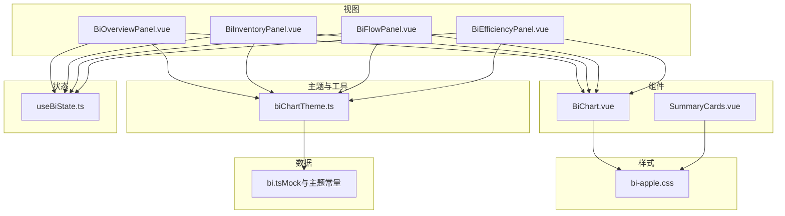
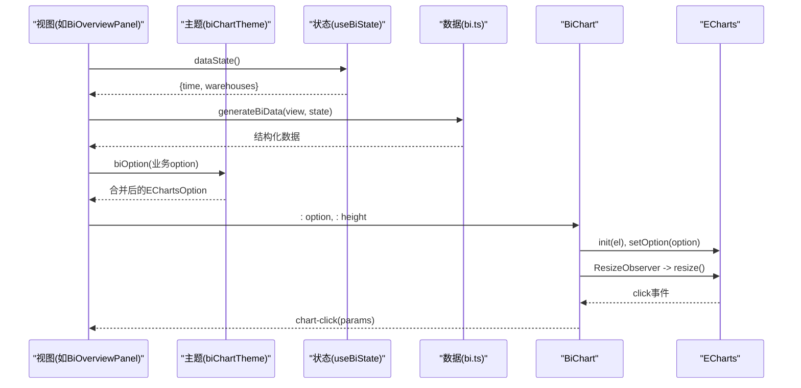
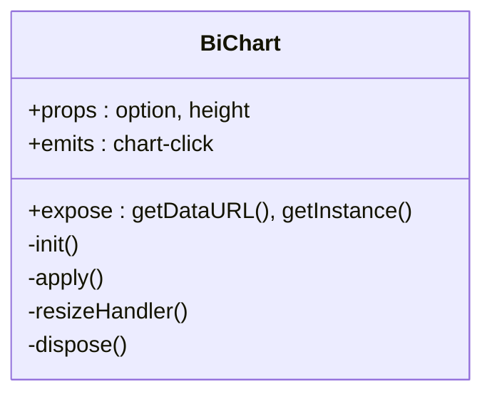
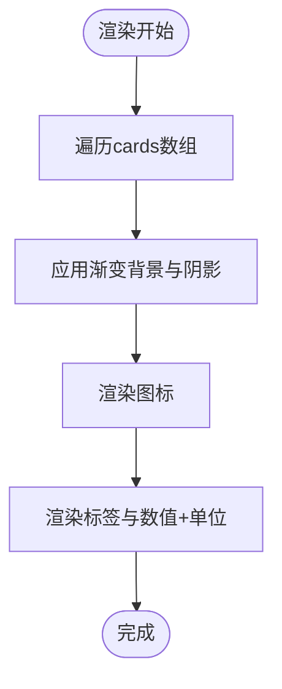
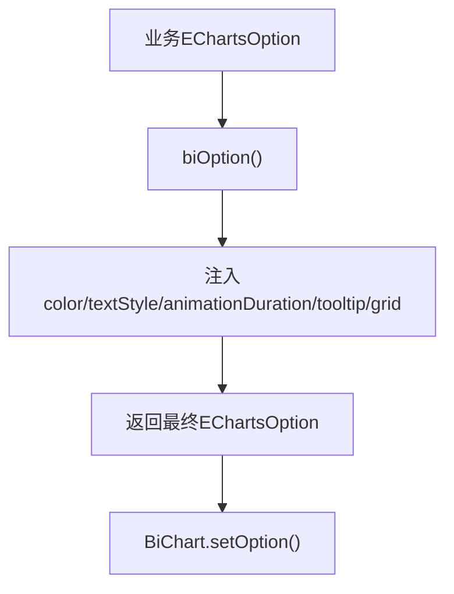
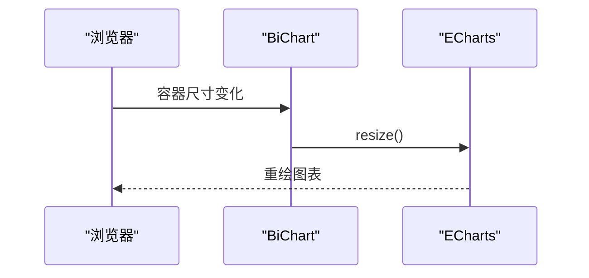
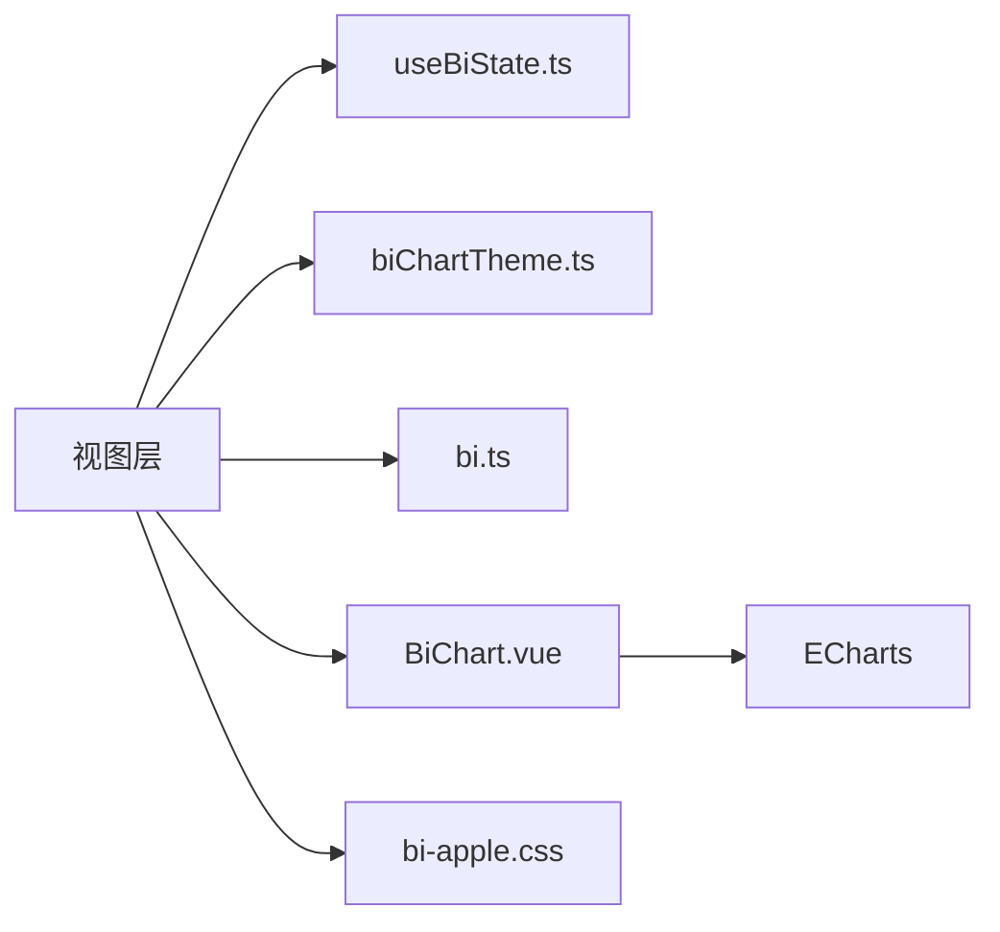

# 图表组件库

<cite>
**本文引用的文件**
- [BiChart.vue](file://frontend-vue/src/components/BiChart.vue)
- [SummaryCards.vue](file://frontend-vue/src/components/SummaryCards.vue)
- [biChartTheme.ts](file://frontend-vue/src/views/bi/biChartTheme.ts)
- [useBiState.ts](file://frontend-vue/src/composables/useBiState.ts)
- [BiOverviewPanel.vue](file://frontend-vue/src/views/bi/BiOverviewPanel.vue)
- [BiInventoryPanel.vue](file://frontend-vue/src/views/bi/BiInventoryPanel.vue)
- [BiFlowPanel.vue](file://frontend-vue/src/views/bi/BiFlowPanel.vue)
- [BiEfficiencyPanel.vue](file://frontend-vue/src/views/bi/BiEfficiencyPanel.vue)
- [bi-apple.css](file://frontend-vue/src/styles/bi-apple.css)
- [bi.ts（Mock数据与主题常量）](file://frontend-vue/src/api/mock/bi.ts)
</cite>

## 目录
1. [简介](#简介)
2. [项目结构](#项目结构)
3. [核心组件](#核心组件)
4. [架构总览](#架构总览)
5. [详细组件分析](#详细组件分析)
6. [依赖关系分析](#依赖关系分析)
7. [性能与响应式优化](#性能与响应式优化)
8. [故障排查与降级方案](#故障排查与降级方案)
9. [结论](#结论)
10. [附录：API与配置速查](#附录api与配置速查)

## 简介
本技术文档面向WMS系统的图表组件库，聚焦以下目标：
- BiChart通用图表组件的API接口、配置选项与使用模式
- SummaryCards统计卡片的属性、事件与插槽配置
- 图表主题系统与样式定制方法
- 图表类型选择、数据格式转换与动画效果配置
- 响应式图表实现方案与性能优化技巧
- 渲染错误处理与降级策略
- 组件的可复用性与扩展性设计

## 项目结构
前端采用Vue 3 + ECharts构建BI看板。核心文件组织如下：
- 组件层：BiChart（统一ECharts容器）、SummaryCards（统计卡片）
- 主题与工具：biChartTheme（统一主题、坐标轴、导出工具）
- 状态管理：useBiState（全局筛选与面板状态）
- 视图层：各BI面板（概览、库存、出入库、效率、财务）通过BiChart组合展示
- 样式：bi-apple.css（Apple风格局部主题，限定在.bi-scope下）

图表来源
- [BiChart.vue:1-59](file://frontend-vue/src/components/BiChart.vue#L1-L59)
- [biChartTheme.ts:1-79](file://frontend-vue/src/views/bi/biChartTheme.ts#L1-L79)
- [useBiState.ts:1-60](file://frontend-vue/src/composables/useBiState.ts#L1-L60)
- [BiOverviewPanel.vue:1-172](file://frontend-vue/src/views/bi/BiOverviewPanel.vue#L1-L172)
- [BiInventoryPanel.vue:1-110](file://frontend-vue/src/views/bi/BiInventoryPanel.vue#L1-L110)
- [BiFlowPanel.vue:1-123](file://frontend-vue/src/views/bi/BiFlowPanel.vue#L1-L123)
- [BiEfficiencyPanel.vue:1-169](file://frontend-vue/src/views/bi/BiEfficiencyPanel.vue#L1-L169)
- [bi-apple.css:1-249](file://frontend-vue/src/styles/bi-apple.css#L1-L249)
- [bi.ts:1-405](file://frontend-vue/src/api/mock/bi.ts#L1-L405)

章节来源
- [BiChart.vue:1-59](file://frontend-vue/src/components/BiChart.vue#L1-L59)
- [biChartTheme.ts:1-79](file://frontend-vue/src/views/bi/biChartTheme.ts#L1-L79)
- [useBiState.ts:1-60](file://frontend-vue/src/composables/useBiState.ts#L1-L60)
- [bi-apple.css:1-249](file://frontend-vue/src/styles/bi-apple.css#L1-L249)
- [bi.ts:1-405](file://frontend-vue/src/api/mock/bi.ts#L1-L405)

## 核心组件
- BiChart：统一封装ECharts实例生命周期（初始化、更新、自适应、销毁），暴露导出图片与获取实例能力，透传点击事件。
- SummaryCards：多维度汇总KPI卡片，支持渐变配色、图标、数值格式化与单位显示，提供网格布局与悬停动效。

章节来源
- [BiChart.vue:1-59](file://frontend-vue/src/components/BiChart.vue#L1-L59)
- [SummaryCards.vue:1-135](file://frontend-vue/src/components/SummaryCards.vue#L1-L135)

## 架构总览
整体采用“视图层生成EChartsOption -> 主题工具统一注入基础样式 -> BiChart统一渲染”的分层架构。状态由useBiState集中管理，Mock数据按视图维度生成，保证相同筛选条件下的数据稳定性。

图表来源
- [BiOverviewPanel.vue:17-29](file://frontend-vue/src/views/bi/BiOverviewPanel.vue#L17-L29)
- [biChartTheme.ts:16-34](file://frontend-vue/src/views/bi/biChartTheme.ts#L16-L34)
- [useBiState.ts:22-49](file://frontend-vue/src/composables/useBiState.ts#L22-L49)
- [bi.ts:390-402](file://frontend-vue/src/api/mock/bi.ts#L390-L402)
- [BiChart.vue:23-49](file://frontend-vue/src/components/BiChart.vue#L23-L49)

## 详细组件分析

### BiChart通用图表组件
职责
- 统一管理ECharts实例的生命周期：挂载时初始化、监听option变化更新、窗口尺寸变化自适应、卸载时释放资源
- 对外暴露能力：导出图片DataURL、获取底层实例
- 事件透传：将ECharts click事件以chart-click形式向上抛出

API
- Props
  - option: EChartsOption（必填）
  - height?: string（可选，默认320px）
- Emits
  - chart-click: 参数为ECharts点击事件对象（name、dataIndex、seriesName、value等）
- Exposed Methods
  - getDataURL(backgroundColor?): Promise<string>
  - getInstance(): ECharts | null

使用模式
- 在视图中通过computed生成EChartsOption，并传入BiChart
- 通过@chart-click捕获交互事件，驱动下钻或联动

图表来源
- [BiChart.vue:10-49](file://frontend-vue/src/components/BiChart.vue#L10-L49)

章节来源
- [BiChart.vue:1-59](file://frontend-vue/src/components/BiChart.vue#L1-L59)

### SummaryCards统计卡片组件
属性
- cards: SummaryCard[]，每项包含：
  - label: string（标题）
  - value: number | string（数值）
  - unit?: string（单位）
  - icon: Component（图标组件）
  - gradient: { background: string; shadow: string }（背景渐变与阴影）

事件与插槽
- 无自定义事件
- 插槽：无（内容完全由cards驱动）

行为
- 数值本地化格式化（中文千分位）
- 网格布局：桌面4列，移动端2列
- 悬停微动效与装饰圆角

图表来源
- [SummaryCards.vue:8-34](file://frontend-vue/src/components/SummaryCards.vue#L8-L34)
- [SummaryCards.vue:36-50](file://frontend-vue/src/components/SummaryCards.vue#L36-L50)
- [SummaryCards.vue:53-135](file://frontend-vue/src/components/SummaryCards.vue#L53-L135)

章节来源
- [SummaryCards.vue:1-135](file://frontend-vue/src/components/SummaryCards.vue#L1-L135)

### 图表主题系统与样式定制
- 主题色板：BI_PALETTE从Mock模块导入，确保全系统一致
- 字体与文本：统一字体栈与灰度色系
- 工具函数：
  - biOption(opt): 注入颜色、字体、动画时长、tooltip、grid等基础样式，并合并用户传入的opt
  - axisCategory(data, extra): 类目轴样式模板
  - axisValue(extra): 数值轴样式模板
  - exportPanelCharts(root, panelName): 批量导出面板内所有图表为PNG
  - downloadDataUrl / stamp: 下载与时间戳工具

图表来源
- [biChartTheme.ts:8-34](file://frontend-vue/src/views/bi/biChartTheme.ts#L8-L34)
- [biChartTheme.ts:36-79](file://frontend-vue/src/views/bi/biChartTheme.ts#L36-L79)
- [bi.ts:12-20](file://frontend-vue/src/api/mock/bi.ts#L12-L20)

章节来源
- [biChartTheme.ts:1-79](file://frontend-vue/src/views/bi/biChartTheme.ts#L1-L79)
- [bi.ts:12-20](file://frontend-vue/src/api/mock/bi.ts#L12-L20)

### 图表类型选择与数据格式转换
- 柱状图：用于趋势对比、分布展示（入库/出库、SKU TOP10、批次状态）
- 折线图：用于连续趋势（30天出入库趋势、退货率趋势）
- 饼图/环形图：用于占比（订单状态、库龄分布、退货原因、波次状态）
- 箱线图：用于耗时分布（P10-P90）
- 数据转换：
  - Mock数据按视图维度生成，键名与字段稳定，便于直接映射到ECharts series
  - 金额/数量格式化：统一使用本地化或自定义格式化函数
  - 百分比/比率：在tooltip或yAxis formatter中统一处理

章节来源
- [BiOverviewPanel.vue:17-59](file://frontend-vue/src/views/bi/BiOverviewPanel.vue#L17-L59)
- [BiInventoryPanel.vue:16-91](file://frontend-vue/src/views/bi/BiInventoryPanel.vue#L16-L91)
- [BiFlowPanel.vue:19-54](file://frontend-vue/src/views/bi/BiFlowPanel.vue#L19-L54)
- [BiEfficiencyPanel.vue:20-90](file://frontend-vue/src/views/bi/BiEfficiencyPanel.vue#L20-L90)
- [bi.ts:172-402](file://frontend-vue/src/api/mock/bi.ts#L172-L402)

### 动画效果配置
- 全局动画时长：通过biOption注入animationDuration
- 区域填充：折线图areaStyle设置透明度
- 过渡与交互：hover高亮、emphasis标签显示

章节来源
- [biChartTheme.ts:16-34](file://frontend-vue/src/views/bi/biChartTheme.ts#L16-L34)
- [BiFlowPanel.vue:19-35](file://frontend-vue/src/views/bi/BiFlowPanel.vue#L19-L35)
- [BiEfficiencyPanel.vue:58-71](file://frontend-vue/src/views/bi/BiEfficiencyPanel.vue#L58-L71)

### 响应式图表的实现方案
- 容器宽度：BiChart容器width: 100%，高度可通过height prop控制
- 自适应：ResizeObserver监听容器尺寸变化，调用chart.resize()
- 网格布局：CSS Grid根据屏幕宽度自动调整列数
- 主题样式：bi-apple.css限定在.bi-scope下，避免污染全局

图表来源
- [BiChart.vue:27-35](file://frontend-vue/src/components/BiChart.vue#L27-L35)
- [bi-apple.css:136-145](file://frontend-vue/src/styles/bi-apple.css#L136-L145)

章节来源
- [BiChart.vue:27-35](file://frontend-vue/src/components/BiChart.vue#L27-L35)
- [bi-apple.css:136-145](file://frontend-vue/src/styles/bi-apple.css#L136-L145)

## 依赖关系分析
- BiChart依赖ECharts库，并通过ResizeObserver进行自适应
- 视图层依赖useBiState获取筛选状态，依赖biChartTheme生成统一样式的EChartsOption
- 数据层bi.ts提供Mock数据与主题常量，保证跨面板一致性
- 样式层bi-apple.css提供Apple风格UI，限定作用域避免冲突

图表来源
- [useBiState.ts:1-60](file://frontend-vue/src/composables/useBiState.ts#L1-L60)
- [biChartTheme.ts:1-79](file://frontend-vue/src/views/bi/biChartTheme.ts#L1-L79)
- [bi.ts:1-405](file://frontend-vue/src/api/mock/bi.ts#L1-L405)
- [BiChart.vue:1-59](file://frontend-vue/src/components/BiChart.vue#L1-L59)
- [bi-apple.css:1-249](file://frontend-vue/src/styles/bi-apple.css#L1-L249)

章节来源
- [useBiState.ts:1-60](file://frontend-vue/src/composables/useBiState.ts#L1-L60)
- [biChartTheme.ts:1-79](file://frontend-vue/src/views/bi/biChartTheme.ts#L1-L79)
- [bi.ts:1-405](file://frontend-vue/src/api/mock/bi.ts#L1-L405)
- [BiChart.vue:1-59](file://frontend-vue/src/components/BiChart.vue#L1-L59)
- [bi-apple.css:1-249](file://frontend-vue/src/styles/bi-apple.css#L1-L249)

## 性能与响应式优化
- 实例复用：BiChart在onMounted中初始化一次，后续仅setOption，减少创建开销
- 深度监听：watch option深监听，确保复杂对象变更也能触发更新
- 自适应：ResizeObserver替代window resize，粒度更细、性能更好
- 动画控制：统一animationDuration，避免过度动画导致卡顿
- 数据量控制：Mock数据按视图维度限制规模，避免大数据集渲染压力
- 样式隔离：CSS限定在.bi-scope，避免全局样式重排

章节来源
- [BiChart.vue:23-43](file://frontend-vue/src/components/BiChart.vue#L23-L43)
- [biChartTheme.ts:16-34](file://frontend-vue/src/views/bi/biChartTheme.ts#L16-L34)
- [bi-apple.css:1-33](file://frontend-vue/src/styles/bi-apple.css#L1-L33)

## 故障排查与降级方案
- 图表未渲染：检查容器是否存在且可见；确认nextTick后初始化
- 尺寸异常：确认父容器有明确高度；ResizeObserver是否生效
- 导出失败：getDataURL需等待实例就绪；空实例时返回空字符串
- 数据为空：视图层应提供空态占位或提示；图表option可为空对象
- 网络请求失败：财务面板对真实接口失败做静默降级，不影响其他Mock面板

章节来源
- [BiChart.vue:27-49](file://frontend-vue/src/components/BiChart.vue#L27-L49)
- [BiFlowPanel.vue:1-123](file://frontend-vue/src/views/bi/BiFlowPanel.vue#L1-L123)
- [BiEfficiencyPanel.vue:1-169](file://frontend-vue/src/views/bi/BiEfficiencyPanel.vue#L1-L169)

## 结论
本图表组件库通过BiChart统一ECharts生命周期管理，结合biChartTheme提供一致的视觉语言，配合useBiState实现跨面板的状态共享，形成高内聚、低耦合的可视化体系。SummaryCards提供可复用的统计卡片，满足快速搭建KPI区的需求。整体具备良好的可复用性与扩展性，适合在WMS系统中持续演进。

## 附录：API与配置速查
- BiChart
  - Props: option (EChartsOption), height? (string)
  - Events: chart-click (params)
  - Methods: getDataURL(backgroundColor?), getInstance()
- SummaryCards
  - Props: cards (SummaryCard[])
  - 插槽: 无
  - 行为: 数值本地化、网格布局、悬停动效
- 主题工具
  - biOption(opt): 注入基础样式并合并用户option
  - axisCategory(data, extra): 类目轴模板
  - axisValue(extra): 数值轴模板
  - exportPanelCharts(root, panelName): 批量导出PNG
- 状态管理
  - useBiState(): 提供时间范围、仓库多选、当前面板切换与数据快照

章节来源
- [BiChart.vue:10-49](file://frontend-vue/src/components/BiChart.vue#L10-L49)
- [SummaryCards.vue:8-34](file://frontend-vue/src/components/SummaryCards.vue#L8-L34)
- [biChartTheme.ts:16-79](file://frontend-vue/src/views/bi/biChartTheme.ts#L16-L79)
- [useBiState.ts:22-59](file://frontend-vue/src/composables/useBiState.ts#L22-L59)