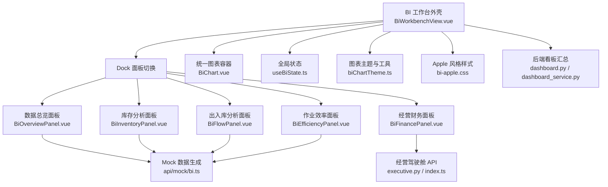
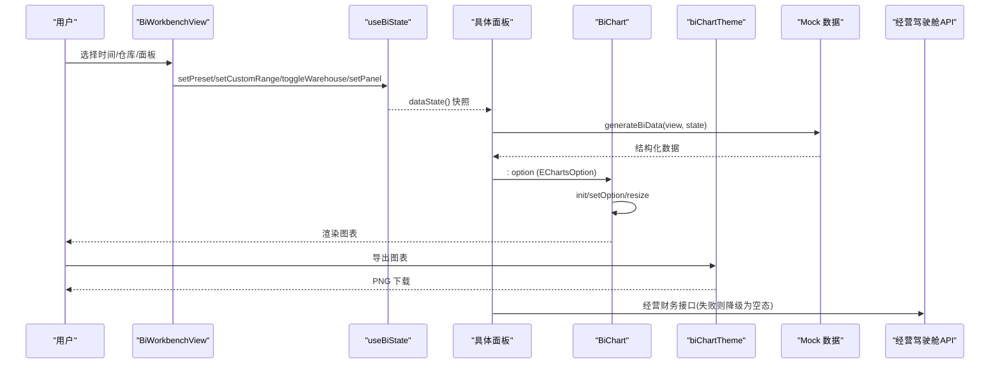
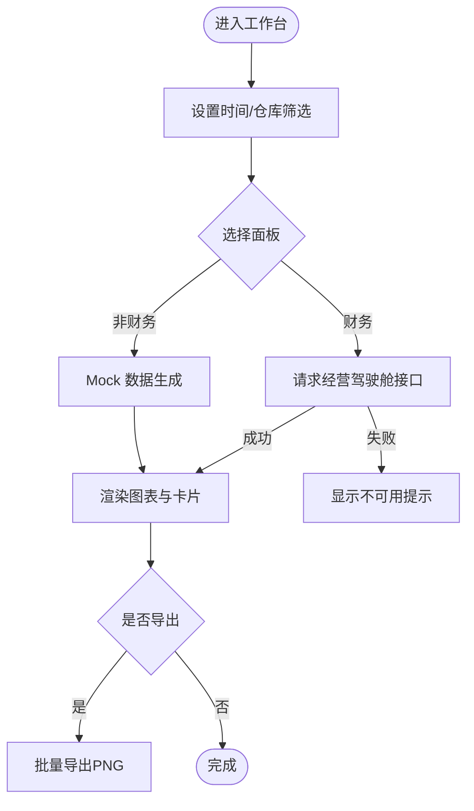
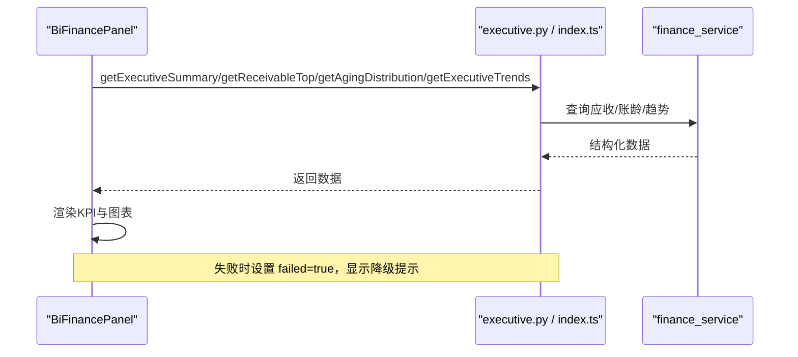
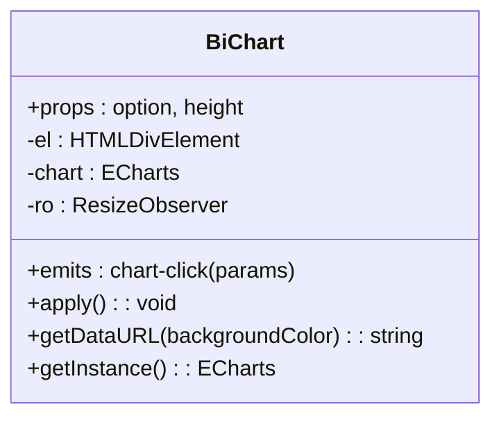
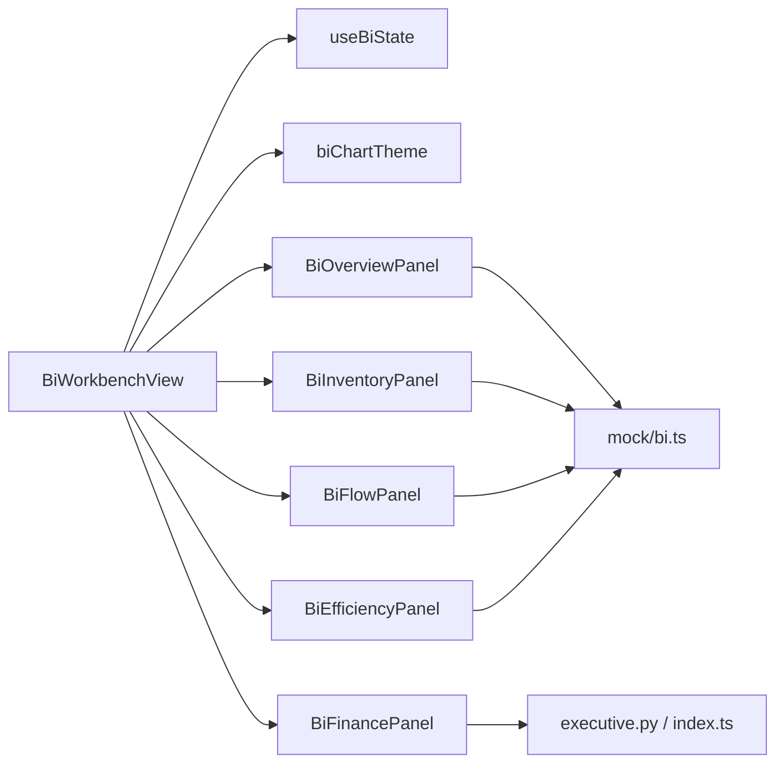

# 数据看板和BI分析

<cite>
**本文引用的文件**
- [BiWorkbenchView.vue](file://frontend-vue/src/views/bi/BiWorkbenchView.vue)
- [useBiState.ts](file://frontend-vue/src/composables/useBiState.ts)
- [BiChart.vue](file://frontend-vue/src/components/BiChart.vue)
- [biChartTheme.ts](file://frontend-vue/src/views/bi/biChartTheme.ts)
- [bi-apple.css](file://frontend-vue/src/styles/bi-apple.css)
- [BiOverviewPanel.vue](file://frontend-vue/src/views/bi/BiOverviewPanel.vue)
- [BiInventoryPanel.vue](file://frontend-vue/src/views/bi/BiInventoryPanel.vue)
- [BiFlowPanel.vue](file://frontend-vue/src/views/bi/BiFlowPanel.vue)
- [BiEfficiencyPanel.vue](file://frontend-vue/src/views/bi/BiEfficiencyPanel.vue)
- [BiFinancePanel.vue](file://frontend-vue/src/views/bi/BiFinancePanel.vue)
- [bi.ts（Mock 数据）](file://frontend-vue/src/api/mock/bi.ts)
- [dashboard.py（后端看板路由）](file://backend-python/app/routers/dashboard.py)
- [dashboard_service.py（后端看板服务）](file://backend-python/app/services/dashboard_service.py)
- [executive.py（经营驾驶舱路由）](file://backend-python/app/routers/executive.py)
- [index.ts（前端 API 聚合）](file://frontend-vue/src/api/index.ts)
</cite>

## 目录
1. [简介](#简介)
2. [项目结构](#项目结构)
3. [核心组件](#核心组件)
4. [架构总览](#架构总览)
5. [详细组件分析](#详细组件分析)
6. [依赖关系分析](#依赖关系分析)
7. [性能与实时性](#性能与实时性)
8. [可访问性与响应式](#可访问性与响应式)
9. [主题与样式定制](#主题与样式定制)
10. [数据口径与准确性保障](#数据口径与准确性保障)
11. [故障排查指南](#故障排查指南)
12. [结论](#结论)

## 简介
本文件面向 WMS 系统的数据看板与 BI 分析能力，聚焦“经营驾驶舱”和“BI 工作台”的功能实现。文档覆盖：
- ECharts 图表组件的统一封装、属性、事件与导出能力
- 各面板的统计数据聚合逻辑与可视化呈现
- 全局筛选状态管理与跨面板共享
- 真实接口与 Mock 数据的混合策略与降级
- 响应式设计、可访问性、动画与过渡效果
- 主题与样式定制、跨浏览器兼容与性能优化建议
- 数据口径一致性与准确性保障机制

## 项目结构
BI 工作台由“外壳 + Dock 面板切换 + 统一图表容器 + 主题/样式 + Mock/真实数据层”构成。整体采用 Vue 3 Composition API，使用组合式状态管理集中维护时间范围、仓库筛选与当前面板；图表通过统一容器 BiChart 收敛生命周期与实例管理；样式以 .bi-scope 限定作用域避免污染主站。

图示来源
- [BiWorkbenchView.vue:1-104](file://frontend-vue/src/views/bi/BiWorkbenchView.vue#L1-L104)
- [useBiState.ts:1-60](file://frontend-vue/src/composables/useBiState.ts#L1-L60)
- [BiChart.vue:1-59](file://frontend-vue/src/components/BiChart.vue#L1-L59)
- [biChartTheme.ts:1-79](file://frontend-vue/src/views/bi/biChartTheme.ts#L1-L79)
- [bi-apple.css:1-249](file://frontend-vue/src/styles/bi-apple.css#L1-L249)
- [bi.ts（Mock 数据）:1-405](file://frontend-vue/src/api/mock/bi.ts#L1-L405)
- [executive.py:1-44](file://backend-python/app/routers/executive.py#L1-L44)
- [dashboard.py:1-15](file://backend-python/app/routers/dashboard.py#L1-L15)
- [dashboard_service.py:1-50](file://backend-python/app/services/dashboard_service.py#L1-L50)
- [index.ts:92-107](file://frontend-vue/src/api/index.ts#L92-L107)

章节来源
- [BiWorkbenchView.vue:1-104](file://frontend-vue/src/views/bi/BiWorkbenchView.vue#L1-L104)
- [useBiState.ts:1-60](file://frontend-vue/src/composables/useBiState.ts#L1-L60)

## 核心组件
- 统一图表容器 BiChart
  - 职责：初始化 ECharts、监听 resize、订阅 click 事件、暴露 getDataURL 与 getInstance
  - 关键行为：onMounted 初始化并 setOption；watch option 深度更新；beforeUnmount 释放实例与观察者
  - 对外暴露：getDataURL(backgroundColor)、getInstance()
  - 事件：chart-click（透传 ECharts click params）
- 全局状态 useBiState
  - 职责：维护 time(preset/start/end)、warehouses、activePanel
  - 方法：setPreset、setCustomRange、setPanel、toggleWarehouse、dataState（稳定快照）
  - 设计要点：切换面板不改变数据 seed；仓库多选含 'all' 语义
- 图表主题 biChartTheme
  - 职责：统一 Apple 观感（配色、字体、tooltip、grid）、坐标轴样式、导出 PNG 工具
  - 导出：exportPanelCharts(root, panelName) 批量导出面板内所有图表为 PNG
- Apple 风格样式 bi-apple.css
  - 职责：限定在 .bi-scope 下的布局、卡片、KPI、预警、表格、模态等样式
  - 特性：毛玻璃顶栏、圆角卡片、渐变统计卡、响应式网格、淡入动画

章节来源
- [BiChart.vue:1-59](file://frontend-vue/src/components/BiChart.vue#L1-L59)
- [useBiState.ts:1-60](file://frontend-vue/src/composables/useBiState.ts#L1-L60)
- [biChartTheme.ts:1-79](file://frontend-vue/src/views/bi/biChartTheme.ts#L1-L79)
- [bi-apple.css:1-249](file://frontend-vue/src/styles/bi-apple.css#L1-L249)

## 架构总览
BI 工作台采用“外壳 + 面板 + 状态 + 图表容器 + 数据源”的分层架构。外壳负责筛选与导航；面板负责业务视图与图表配置；状态模块提供跨面板共享上下文；图表容器统一生命周期；数据源分为 Mock（零网络、可复现）与真实接口（经营财务）。

图示来源
- [BiWorkbenchView.vue:1-104](file://frontend-vue/src/views/bi/BiWorkbenchView.vue#L1-L104)
- [useBiState.ts:1-60](file://frontend-vue/src/composables/useBiState.ts#L1-L60)
- [BiChart.vue:1-59](file://frontend-vue/src/components/BiChart.vue#L1-L59)
- [biChartTheme.ts:1-79](file://frontend-vue/src/views/bi/biChartTheme.ts#L1-L79)
- [bi.ts（Mock 数据）:1-405](file://frontend-vue/src/api/mock/bi.ts#L1-L405)
- [executive.py:1-44](file://backend-python/app/routers/executive.py#L1-L44)

## 详细组件分析

### 经营驾驶舱（BI 工作台外壳）
- 功能
  - 顶部筛选：时间预设（今天/近7天/近30天/自定义）、仓库多选、导出按钮
  - Dock 面板切换：数据总览/库存分析/出入库分析/作业效率/经营财务
  - KeepAlive 缓存面板，提升切换体验
- 交互
  - 自定义日期校验：开始不能晚于结束，错误提示
  - 导出：调用 exportPanelCharts 将当前面板所有图表导出 PNG
- 数据
  - 除“经营财务”外均为 Mock；经营财务走真实接口，失败时显示警告并降级

图示来源
- [BiWorkbenchView.vue:1-104](file://frontend-vue/src/views/bi/BiWorkbenchView.vue#L1-L104)
- [biChartTheme.ts:52-62](file://frontend-vue/src/views/bi/biChartTheme.ts#L52-L62)

章节来源
- [BiWorkbenchView.vue:1-104](file://frontend-vue/src/views/bi/BiWorkbenchView.vue#L1-L104)

### 数据总览面板（Overview）
- 数据源：generateBiData('overview', state)
- 图表
  - 出入库趋势：柱状图（入库/出库），类目轴与数值轴统一样式
  - 单据状态分布：环形饼图，中心展示总量
  - 仓库库存分布：堆叠水平柱状图（可用/锁定）
- 交互
  - 预警下钻：点击打开 Modal，展示 SKU 明细与近 7 天迷你趋势及仓库分布表
- 指标
  - KPI 卡：库存周转率、库容使用率、今日订单量、作业效率（完成/计划）
  - 彩色统计卡：今日入库单/出库单/库存总量/低库存商品

章节来源
- [BiOverviewPanel.vue:1-172](file://frontend-vue/src/views/bi/BiOverviewPanel.vue#L1-L172)
- [bi.ts（Mock 数据）:173-263](file://frontend-vue/src/api/mock/bi.ts#L173-L263)

### 库存分析面板（Inventory）
- 数据源：generateBiData('inventory', state)
- 图表
  - 高库存 SKU TOP10：水平柱状图
  - 低库存 SKU TOP10：水平柱状图（需补货）
  - 库龄分布：环形饼图（按区间）
  - 批次状态分布：堆叠柱状图（正常/临期/已过期/冻结）
  - ABC 分类帕累托：柱状+折线双轴，A/B/C 阈值线
- 指标
  - 按仓库维度统计批次状态，支持对比

章节来源
- [BiInventoryPanel.vue:1-110](file://frontend-vue/src/views/bi/BiInventoryPanel.vue#L1-L110)
- [bi.ts（Mock 数据）:266-312](file://frontend-vue/src/api/mock/bi.ts#L266-L312)

### 出入库分析面板（Flow）
- 数据源：generateBiData('flow', state)
- 图表
  - 30 天出入库趋势：折线面积图，支持数量/金额切换与缩放
  - 退货原因分布：环形饼图
  - 退货率趋势：折线图（百分比格式化）
- 指标
  - 入库合计/出库合计/净增减仪表盘
  - 供应商 TOP10（金额/准时率）与客户 TOP10（金额/退货率）
  - 超警戒线提示（平均退货率 > 5%）

章节来源
- [BiFlowPanel.vue:1-123](file://frontend-vue/src/views/bi/BiFlowPanel.vue#L1-L123)
- [bi.ts（Mock 数据）:315-337](file://frontend-vue/src/api/mock/bi.ts#L315-L337)

### 作业效率面板（Efficiency）
- 数据源：generateBiData('efficiency', state)
- 图表
  - 员工日均拣货量：柱状图，点击柱形下钻至个人 7 日明细
  - 波次状态分布：环形饼图，中心显示完成率
  - 各环节耗时分布：箱线图（P10/P25/P50/P75/P90）
- 列表
  - 实时任务流水：Tab 过滤（全部/进行中/已完成/异常），进度条与状态标签
- 指标
  - 人均日拣货、波次总数、波次完成率、今日任务数

章节来源
- [BiEfficiencyPanel.vue:1-169](file://frontend-vue/src/views/bi/BiEfficiencyPanel.vue#L1-L169)
- [bi.ts（Mock 数据）:340-388](file://frontend-vue/src/api/mock/bi.ts#L340-L388)

### 经营财务面板（Finance）
- 数据源：真实接口 /api/executive/*（与财务页同口径）
- 图表
  - 账龄分布：环形饼图（未到期/逾期1-30/31-60/60+）
  - 应收余额 TOP 客户：水平柱状图
  - 订单/回款趋势：折线面积图（近 30 天）
- 指标
  - 应收总额、已回款、未回款、逾期金额
  - 经营概览：销售订单数、订单总金额、应收/回款/逾期
- 降级
  - 接口失败时显示警告，不影响其他 Mock 面板

图示来源
- [BiFinancePanel.vue:73-87](file://frontend-vue/src/views/bi/BiFinancePanel.vue#L73-L87)
- [executive.py:12-44](file://backend-python/app/routers/executive.py#L12-L44)
- [index.ts:678-719](file://frontend-vue/src/api/index.ts#L678-L719)

章节来源
- [BiFinancePanel.vue:1-145](file://frontend-vue/src/views/bi/BiFinancePanel.vue#L1-L145)
- [executive.py:1-44](file://backend-python/app/routers/executive.py#L1-L44)
- [index.ts:678-719](file://frontend-vue/src/api/index.ts#L678-L719)

### 统一图表容器（BiChart）类图

图示来源
- [BiChart.vue:1-59](file://frontend-vue/src/components/BiChart.vue#L1-L59)

章节来源
- [BiChart.vue:1-59](file://frontend-vue/src/components/BiChart.vue#L1-L59)

## 依赖关系分析
- 组件耦合
  - BiWorkbenchView 依赖 useBiState 管理全局筛选与面板；依赖 biChartTheme 导出图表；依赖各面板组件
  - 各面板依赖 BiChart 与 biChartTheme；数据来自 mock/bi.ts 或 executive API
- 外部依赖
  - ECharts：图表渲染与导出
  - FastAPI：后端看板与经营驾驶舱接口
- 潜在循环
  - 无直接循环依赖；面板仅消费状态与数据，不反向修改外壳

图示来源
- [BiWorkbenchView.vue:1-104](file://frontend-vue/src/views/bi/BiWorkbenchView.vue#L1-L104)
- [bi.ts（Mock 数据）:1-405](file://frontend-vue/src/api/mock/bi.ts#L1-L405)
- [executive.py:1-44](file://backend-python/app/routers/executive.py#L1-L44)
- [index.ts:678-719](file://frontend-vue/src/api/index.ts#L678-L719)

章节来源
- [BiWorkbenchView.vue:1-104](file://frontend-vue/src/views/bi/BiWorkbenchView.vue#L1-L104)
- [bi.ts（Mock 数据）:1-405](file://frontend-vue/src/api/mock/bi.ts#L1-L405)

## 性能与实时性
- 图表性能
  - BiChart 使用 ResizeObserver 监听容器尺寸变化，避免频繁重绘
  - watch option 深度更新，确保数据变更即时反映
  - 卸载时 dispose 实例与 observer，防止内存泄漏
- 数据刷新
  - 大部分面板基于 Mock 数据，切换筛选即重新计算，无网络开销
  - 经营财务面板在 onMounted 并发请求多个接口，失败静默降级
- 导出性能
  - exportPanelCharts 逐图获取 dataURL 并触发下载，pixelRatio=2 保证清晰度
- 建议
  - 大数据量场景考虑分页加载与虚拟滚动
  - 对高频更新指标可采用节流/防抖与增量更新策略
  - 合理设置 animationDuration 与 series 的 showSymbol 减少渲染压力

章节来源
- [BiChart.vue:27-49](file://frontend-vue/src/components/BiChart.vue#L27-L49)
- [biChartTheme.ts:52-62](file://frontend-vue/src/views/bi/biChartTheme.ts#L52-L62)
- [BiFinancePanel.vue:73-87](file://frontend-vue/src/views/bi/BiFinancePanel.vue#L73-L87)

## 可访问性与响应式
- 可访问性
  - 图表 tooltip 提供可读文本；按钮具备明确语义与焦点状态
  - 颜色对比度遵循 Apple 主题规范，重要信息辅以文字说明
- 响应式
  - 网格布局 cols-2/3/4 在小屏自动退化为单列
  - Dock 支持横向滚动，适配窄屏
  - 图表高度可通过 props 控制，容器宽度自适应
- 建议
  - 为关键交互添加 aria-label 与键盘导航支持
  - 对复杂图表提供“简化视图”开关，降低认知负荷

章节来源
- [bi-apple.css:137-145](file://frontend-vue/src/styles/bi-apple.css#L137-L145)
- [bi-apple.css:104-117](file://frontend-vue/src/styles/bi-apple.css#L104-L117)
- [BiChart.vue:52-54](file://frontend-vue/src/components/BiChart.vue#L52-L54)

## 主题与样式定制
- 主题变量
  - 通过 CSS 变量定义背景、卡片、文本、品牌色、圆角、阴影、模糊等
  - 图表配色与字体通过 biChartTheme 统一注入 ECharts option
- 定制方式
  - 调整 .bi-scope 变量即可全局换肤
  - 通过 biOption 扩展 grid、legend、tooltip 等局部样式
- 兼容性
  - 使用 backdrop-filter 实现毛玻璃效果，注意旧版浏览器降级
  - 字体栈包含系统字体与中文字体，确保多平台一致性

章节来源
- [bi-apple.css:6-33](file://frontend-vue/src/styles/bi-apple.css#L6-L33)
- [biChartTheme.ts:15-34](file://frontend-vue/src/views/bi/biChartTheme.ts#L15-L34)

## 数据口径与准确性保障
- 口径一致性
  - 经营财务面板与财务页共用同一组接口，确保指标口径一致
  - 看板汇总接口 dashboard_summary 提供基础统计（今日入库/出库、待处理、库存总量、低库存、活跃商品/客户）
- 准确性保障
  - 后端使用 SQL 聚合函数与条件过滤，保证统计准确
  - Mock 数据基于 seeded PRNG，相同筛选产生稳定结果，便于演示与回归测试
- 建议
  - 为关键指标增加数据质量校验（如空值、负值、越界）
  - 对历史数据建立版本化口径说明，便于审计与回溯

章节来源
- [dashboard_service.py:18-49](file://backend-python/app/services/dashboard_service.py#L18-L49)
- [dashboard.py:12-14](file://backend-python/app/routers/dashboard.py#L12-L14)
- [bi.ts（Mock 数据）:78-110](file://frontend-vue/src/api/mock/bi.ts#L78-L110)

## 故障排查指南
- 图表不显示
  - 检查 BiChart 容器是否存在且可见；确认 option 是否正确传入
  - 查看控制台是否有 ECharts 初始化错误
- 导出失败
  - 确认 exportPanelCharts 根节点引用正确；浏览器是否允许下载
- 经营财务数据不可用
  - 检查后端服务是否启动；接口路径与鉴权是否正常
  - 失败时页面会显示警告，可忽略并继续浏览其他面板
- 筛选无效
  - 确认 useBiState 的 dataState 快照是否正确传递到 generateBiData
  - 自定义日期校验是否通过

章节来源
- [BiChart.vue:27-49](file://frontend-vue/src/components/BiChart.vue#L27-L49)
- [biChartTheme.ts:52-62](file://frontend-vue/src/views/bi/biChartTheme.ts#L52-L62)
- [BiFinancePanel.vue:73-87](file://frontend-vue/src/views/bi/BiFinancePanel.vue#L73-L87)
- [useBiState.ts:28-58](file://frontend-vue/src/composables/useBiState.ts#L28-L58)

## 结论
本方案通过统一图表容器、全局状态与 Apple 风格主题，构建了可扩展、易维护的 WMS 数据看板与 BI 工作台。大部分面板使用可复现的 Mock 数据，经营财务面板对接真实接口并具备降级能力。通过响应式布局、动画与导出功能，提升了用户体验与可操作性。后续可在大数据量场景引入虚拟化与增量更新，进一步增强性能与稳定性。