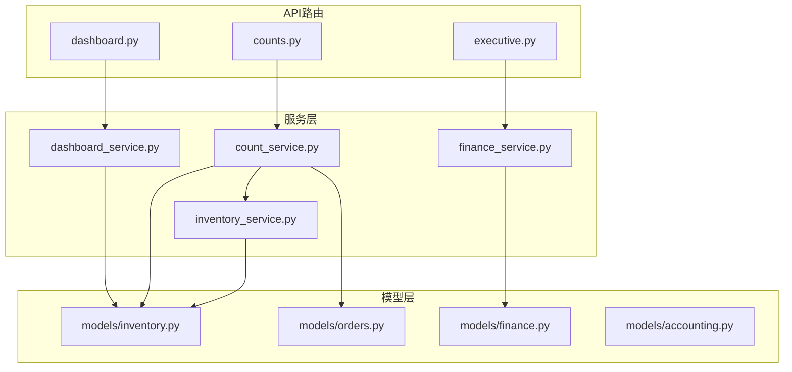
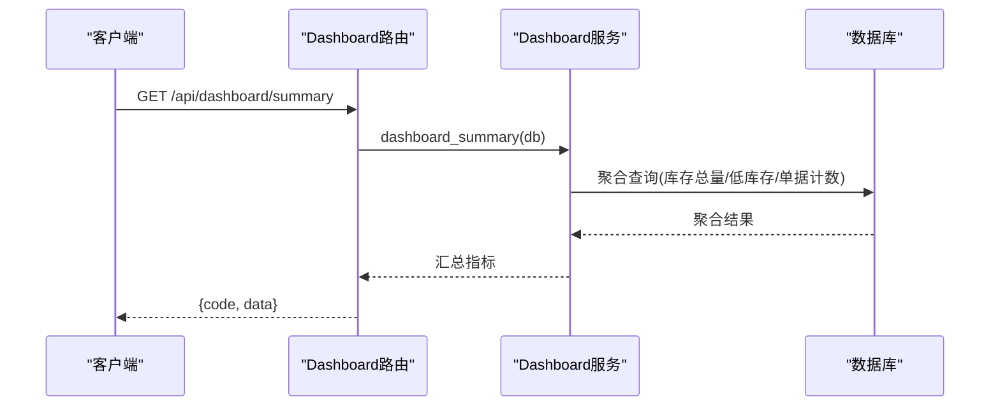
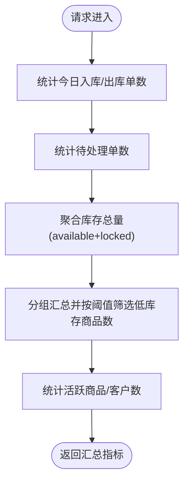
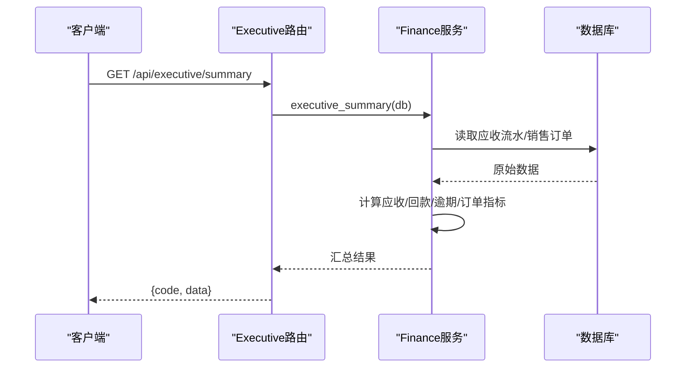
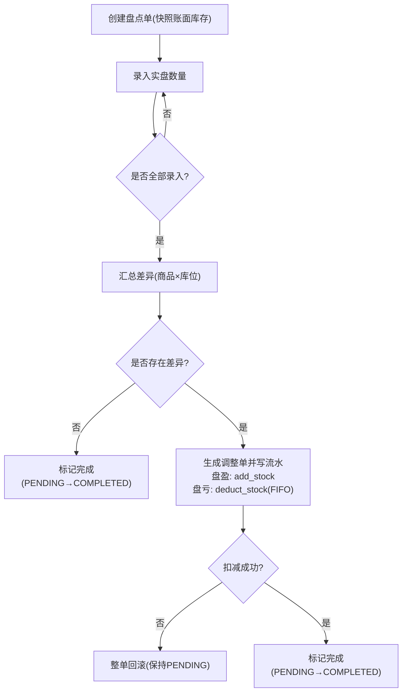
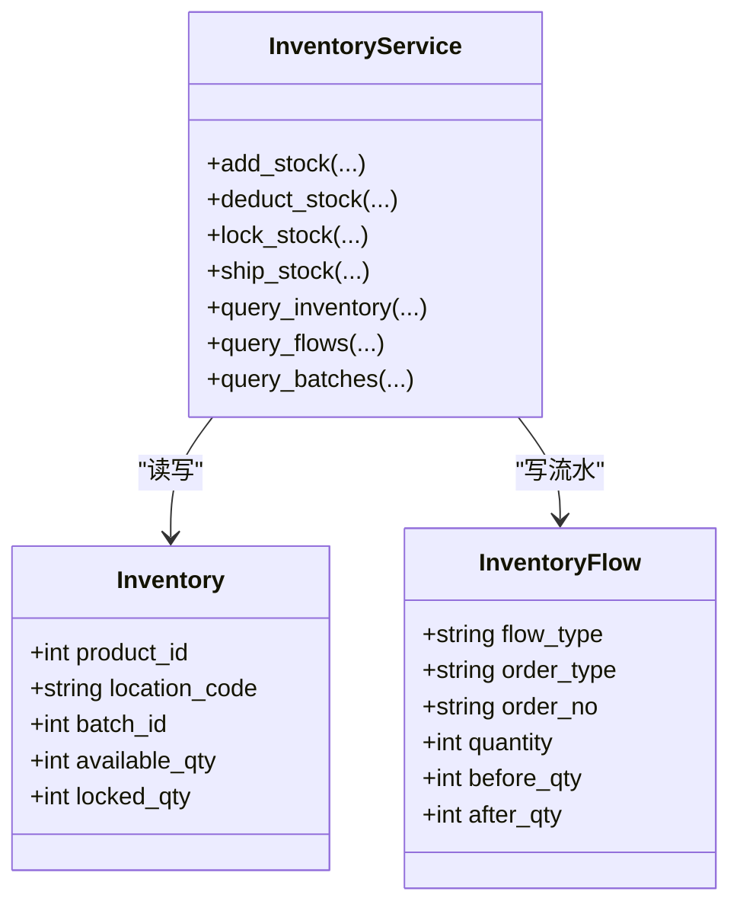
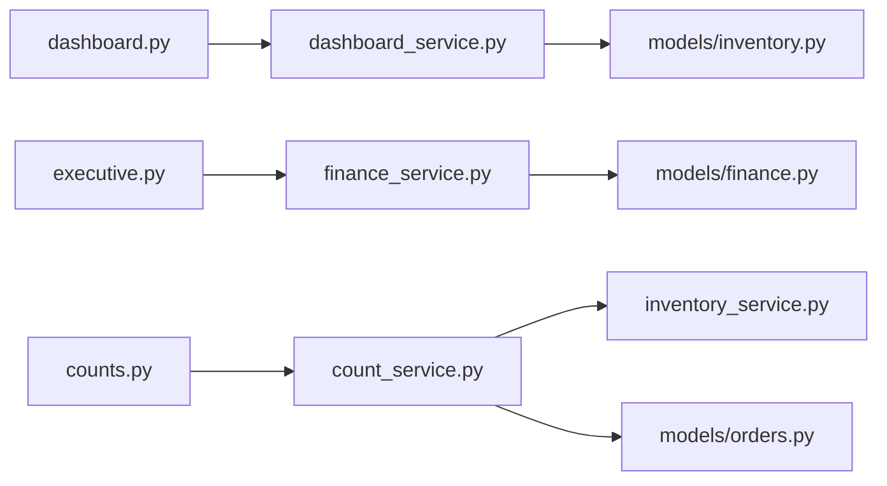

# 数据统计与聚合

<cite>
**本文引用的文件**
- [backend-python/app/routers/dashboard.py](file://backend-python/app/routers/dashboard.py)
- [backend-python/app/services/dashboard_service.py](file://backend-python/app/services/dashboard_service.py)
- [backend-python/app/routers/executive.py](file://backend-python/app/routers/executive.py)
- [backend-python/app/services/finance_service.py](file://backend-python/app/services/finance_service.py)
- [backend-python/app/routers/counts.py](file://backend-python/app/routers/counts.py)
- [backend-python/app/services/count_service.py](file://backend-python/app/services/count_service.py)
- [backend-python/app/models/inventory.py](file://backend-python/app/models/inventory.py)
- [backend-python/app/models/orders.py](file://backend-python/app/models/orders.py)
- [backend-python/app/models/finance.py](file://backend-python/app/models/finance.py)
- [backend-python/app/models/accounting.py](file://backend-python/app/models/accounting.py)
- [backend-python/app/services/inventory_service.py](file://backend-python/app/services/inventory_service.py)
</cite>

## 目录
1. [简介](#简介)
2. [项目结构](#项目结构)
3. [核心组件](#核心组件)
4. [架构总览](#架构总览)
5. [详细组件分析](#详细组件分析)
6. [依赖关系分析](#依赖关系分析)
7. [性能考虑](#性能考虑)
8. [故障排查指南](#故障排查指南)
9. [结论](#结论)
10. [附录](#附录)

## 简介
本技术文档聚焦WMS系统的数据统计与聚合服务，覆盖后端API的数据聚合逻辑、查询优化策略、统计口径统一性与数据准确性验证、缓存与实时更新策略、复杂查询的性能优化与索引设计、数据一致性与事务处理机制，以及大数据量场景下的性能瓶颈解决方案。文档面向产品、研发与运维人员，帮助快速理解并高效使用统计能力。

## 项目结构
统计与聚合相关代码主要分布在以下模块：
- API路由层：提供对外接口（看板、经营驾驶舱、盘点）
- 服务层：实现业务聚合计算、指标汇总、一致性校验
- 模型层：定义库存、订单、财务等核心实体及索引
- 库存服务：统一的库存变动入口与流水记录

图表来源
- [backend-python/app/routers/dashboard.py:1-15](file://backend-python/app/routers/dashboard.py#L1-L15)
- [backend-python/app/routers/executive.py:1-44](file://backend-python/app/routers/executive.py#L1-L44)
- [backend-python/app/routers/counts.py:1-52](file://backend-python/app/routers/counts.py#L1-L52)
- [backend-python/app/services/dashboard_service.py:1-50](file://backend-python/app/services/dashboard_service.py#L1-L50)
- [backend-python/app/services/finance_service.py:1-607](file://backend-python/app/services/finance_service.py#L1-L607)
- [backend-python/app/services/count_service.py:1-298](file://backend-python/app/services/count_service.py#L1-L298)
- [backend-python/app/services/inventory_service.py:1-437](file://backend-python/app/services/inventory_service.py#L1-L437)
- [backend-python/app/models/inventory.py:1-98](file://backend-python/app/models/inventory.py#L1-L98)
- [backend-python/app/models/orders.py:1-300](file://backend-python/app/models/orders.py#L1-L300)
- [backend-python/app/models/finance.py:1-117](file://backend-python/app/models/finance.py#L1-L117)
- [backend-python/app/models/accounting.py:1-159](file://backend-python/app/models/accounting.py#L1-L159)

章节来源
- [backend-python/app/routers/dashboard.py:1-15](file://backend-python/app/routers/dashboard.py#L1-L15)
- [backend-python/app/routers/executive.py:1-44](file://backend-python/app/routers/executive.py#L1-L44)
- [backend-python/app/routers/counts.py:1-52](file://backend-python/app/routers/counts.py#L1-L52)

## 核心组件
- 数据看板聚合服务：提供首页关键指标（今日入库/出库单数、待处理单数、库存总量、低库存预警商品数、活跃商品/客户数）。
- 经营驾驶舱服务：提供应收总额、已回款、未回款、逾期金额、订单数与金额、应收TOP客户、账龄分布、趋势图数据。
- 盘点服务：创建盘点单（按库位/库区/商品/全部范围快照账面库存）、录入实盘数量、完成盘点并自动生成调整单与库存流水，输出准确率指标。
- 库存服务：统一库存变动入口，支持增加、扣减、锁定、发货、移库、调整等，强制写流水，保证可追溯与并发安全。

章节来源
- [backend-python/app/services/dashboard_service.py:18-49](file://backend-python/app/services/dashboard_service.py#L18-L49)
- [backend-python/app/services/finance_service.py:511-588](file://backend-python/app/services/finance_service.py#L511-L588)
- [backend-python/app/services/count_service.py:82-298](file://backend-python/app/services/count_service.py#L82-L298)
- [backend-python/app/services/inventory_service.py:75-251](file://backend-python/app/services/inventory_service.py#L75-L251)

## 架构总览
统计与聚合的调用链遵循“路由 → 服务 → 模型”的分层结构，所有统计指标均通过SQL聚合函数与服务端计算得出，确保口径一致与可审计。

图表来源
- [backend-python/app/routers/dashboard.py:12-14](file://backend-python/app/routers/dashboard.py#L12-L14)
- [backend-python/app/services/dashboard_service.py:18-49](file://backend-python/app/services/dashboard_service.py#L18-L49)

## 详细组件分析

### 数据看板聚合（Dashboard）
- 指标定义与数据来源
  - 今日入库/出库单数：基于单据表按created_at过滤当日计数
  - 待处理单数：按状态过滤计数
  - 库存总量：对库存行可用+锁定求和
  - 低库存商品数：分组后按库存总量阈值筛选计数
  - 活跃商品/客户数：按状态过滤计数
- 查询优化
  - 使用聚合函数减少数据传输与内存计算
  - 利用索引加速状态与时间过滤
- 统计口径
  - “库存总量”为可用+锁定合计，避免重复或遗漏
  - “低库存”以单品维度汇总后的总量作为阈值判断依据

图表来源
- [backend-python/app/services/dashboard_service.py:18-49](file://backend-python/app/services/dashboard_service.py#L18-L49)

章节来源
- [backend-python/app/services/dashboard_service.py:18-49](file://backend-python/app/services/dashboard_service.py#L18-L49)

### 经营驾驶舱（Finance Executive）
- 指标定义与数据来源
  - 应收总额、已回款、未回款、逾期金额：基于财务流水按类型与到期日计算
  - 订单数与金额：排除作废订单的累计
  - 应收TOP客户：按往来方余额降序取Top N
  - 账龄分布：以到期日为基准分段统计
  - 趋势：按天聚合订单金额与回款金额
- 统计口径与准确性
  - 金额统一保留两位小数，避免浮点误差
  - 账龄以到期日为准，不落库，实时计算
  - 幂等生成应收：预查 + 唯一约束 + IntegrityError兜底
- 查询优化
  - 批量读取后在内存中分桶聚合，减少多次往返
  - 使用索引加速按日期、类型、往来方的过滤

图表来源
- [backend-python/app/routers/executive.py:12-43](file://backend-python/app/routers/executive.py#L12-L43)
- [backend-python/app/services/finance_service.py:511-588](file://backend-python/app/services/finance_service.py#L511-L588)

章节来源
- [backend-python/app/services/finance_service.py:295-336](file://backend-python/app/services/finance_service.py#L295-L336)
- [backend-python/app/services/finance_service.py:444-506](file://backend-python/app/services/finance_service.py#L444-L506)
- [backend-python/app/services/finance_service.py:511-588](file://backend-python/app/services/finance_service.py#L511-L588)

### 盘点与库存准确率闭环（Cycle Count）
- 流程说明
  - 创建盘点单：按范围（库位/库区/商品/全部）快照账面库存生成明细（PENDING）
  - 录入实盘数量：可多次提交覆盖
  - 完成盘点：差异行自动汇总生成调整单，盘盈走增加流水，盘亏走扣减流水；若库存不足则整单回滚
- 指标计算
  - 库存准确率：账实相符的行数/总行数
  - 库位准确率：账实相符的库位数/总库位数
  - 差异总量：各行差异绝对值之和
- 数据一致性
  - 同一商品库位差异合并后一次性调整，避免重复
  - 事务内完成调整与状态变更，失败回滚保持PENDING

图表来源
- [backend-python/app/services/count_service.py:82-114](file://backend-python/app/services/count_service.py#L82-L114)
- [backend-python/app/services/count_service.py:131-145](file://backend-python/app/services/count_service.py#L131-L145)
- [backend-python/app/services/count_service.py:207-279](file://backend-python/app/services/count_service.py#L207-L279)
- [backend-python/app/services/inventory_service.py:75-144](file://backend-python/app/services/inventory_service.py#L75-L144)

章节来源
- [backend-python/app/routers/counts.py:13-51](file://backend-python/app/routers/counts.py#L13-L51)
- [backend-python/app/services/count_service.py:27-79](file://backend-python/app/services/count_service.py#L27-L79)
- [backend-python/app/services/count_service.py:148-204](file://backend-python/app/services/count_service.py#L148-L204)
- [backend-python/app/services/count_service.py:282-298](file://backend-python/app/services/count_service.py#L282-L298)

### 库存服务（Inventory Service）
- 统一入口原则
  - 所有库存变动必须通过服务层方法（add_stock、deduct_stock、lock_stock、ship_stock），强制写流水
- 并发与一致性
  - SUM预检 + 条件UPDATE + with_for_update（PostgreSQL行锁）防止超卖
  - 扣减跨批次FIFO，先扣早期批次
- 查询优化
  - 视图化聚合（product/location）减少N+1
  - joinedload预加载关联对象，避免响应组装时逐行查库

图表来源
- [backend-python/app/services/inventory_service.py:75-251](file://backend-python/app/services/inventory_service.py#L75-L251)
- [backend-python/app/services/inventory_service.py:256-437](file://backend-python/app/services/inventory_service.py#L256-L437)
- [backend-python/app/models/inventory.py:33-98](file://backend-python/app/models/inventory.py#L33-L98)

章节来源
- [backend-python/app/services/inventory_service.py:75-251](file://backend-python/app/services/inventory_service.py#L75-L251)
- [backend-python/app/services/inventory_service.py:256-437](file://backend-python/app/services/inventory_service.py#L256-L437)
- [backend-python/app/models/inventory.py:33-98](file://backend-python/app/models/inventory.py#L33-L98)

## 依赖关系分析
- 路由到服务的单向依赖：路由仅负责参数校验与响应封装，聚合逻辑在服务层
- 服务到模型的强耦合：服务直接操作ORM模型，使用聚合函数与joinedload优化查询
- 库存服务与盘点服务的协作：盘点完成时调用库存服务进行增减与扣减，保证一致性与可追溯

图表来源
- [backend-python/app/routers/dashboard.py:1-15](file://backend-python/app/routers/dashboard.py#L1-L15)
- [backend-python/app/routers/executive.py:1-44](file://backend-python/app/routers/executive.py#L1-L44)
- [backend-python/app/routers/counts.py:1-52](file://backend-python/app/routers/counts.py#L1-L52)
- [backend-python/app/services/dashboard_service.py:1-50](file://backend-python/app/services/dashboard_service.py#L1-L50)
- [backend-python/app/services/finance_service.py:1-607](file://backend-python/app/services/finance_service.py#L1-L607)
- [backend-python/app/services/count_service.py:1-298](file://backend-python/app/services/count_service.py#L1-L298)
- [backend-python/app/services/inventory_service.py:1-437](file://backend-python/app/services/inventory_service.py#L1-L437)
- [backend-python/app/models/inventory.py:1-98](file://backend-python/app/models/inventory.py#L1-L98)
- [backend-python/app/models/orders.py:1-300](file://backend-python/app/models/orders.py#L1-L300)
- [backend-python/app/models/finance.py:1-117](file://backend-python/app/models/finance.py#L1-L117)

## 性能考虑
- 聚合查询优化
  - 使用SUM/COUNT/GROUP BY在数据库侧完成聚合，减少应用层计算与网络传输
  - 针对高频过滤列建立索引（如库存location_code、product_id；财务entry_type、partner_name；订单status、created_at）
- 分页与限制
  - 列表接口统一采用offset/limit分页，避免全量拉取
- 预加载与N+1规避
  - 使用joinedload一次性加载关联对象，避免响应组装时的逐行查询
- 并发安全
  - 扣减/锁定使用条件UPDATE与with_for_update，防止并发覆盖导致超卖
- 大数据量建议
  - 对历史数据进行归档或物化视图（如趋势、账龄）
  - 对热点指标引入缓存层（见下节）

[本节为通用性能指导，不直接分析具体文件]

## 故障排查指南
- 盘点完成失败
  - 现象：盘亏扣减失败，整单回滚，盘点单保持PENDING
  - 排查：检查对应库位可用库存是否充足；查看库存流水是否写入；确认事务是否回滚
  - 参考路径
    - [backend-python/app/services/count_service.py:207-279](file://backend-python/app/services/count_service.py#L207-L279)
    - [backend-python/app/services/inventory_service.py:91-144](file://backend-python/app/services/inventory_service.py#L91-L144)
- 应收生成冲突
  - 现象：并发下重复生成应收
  - 排查：检查唯一约束与IntegrityError处理；确认预查逻辑是否命中
  - 参考路径
    - [backend-python/app/services/finance_service.py:295-336](file://backend-python/app/services/finance_service.py#L295-L336)
- 库存查询慢
  - 现象：库存列表/聚合查询耗时高
  - 排查：确认是否使用了joinedload；检查过滤条件是否命中索引；评估是否需要物化视图
  - 参考路径
    - [backend-python/app/services/inventory_service.py:256-345](file://backend-python/app/services/inventory_service.py#L256-L345)
    - [backend-python/app/models/inventory.py:45-48](file://backend-python/app/models/inventory.py#L45-L48)

章节来源
- [backend-python/app/services/count_service.py:207-279](file://backend-python/app/services/count_service.py#L207-L279)
- [backend-python/app/services/inventory_service.py:91-144](file://backend-python/app/services/inventory_service.py#L91-L144)
- [backend-python/app/services/finance_service.py:295-336](file://backend-python/app/services/finance_service.py#L295-L336)
- [backend-python/app/services/inventory_service.py:256-345](file://backend-python/app/services/inventory_service.py#L256-L345)
- [backend-python/app/models/inventory.py:45-48](file://backend-python/app/models/inventory.py#L45-L48)

## 结论
本系统的统计与聚合服务通过分层架构与严格的库存/财务模型设计，实现了口径统一、数据可追溯与并发安全。看板与驾驶舱指标均以数据库聚合为主，辅以必要的服务端计算，确保准确性与性能。盘点闭环将差异自动转化为调整单与流水，保障库存一致性。未来可在热点指标上引入缓存与物化视图进一步提升性能，同时持续完善索引与查询计划监控。

[本节为总结性内容，不直接分析具体文件]

## 附录

### 缓存机制与实时数据更新策略
- 现状
  - 当前统计服务未内置缓存层，所有指标均为实时计算
- 建议方案
  - 热点指标（如看板摘要、经营驾驶舱摘要）引入Redis缓存，设置合理TTL与失效策略（如单据状态变更时主动失效）
  - 对趋势与账龄等重计算场景，可采用定时任务生成物化结果，降低实时压力
- 实时性保障
  - 通过事件驱动或写扩散方式，在关键业务动作（入库、出库、发货、收款核销、盘点完成）后更新缓存或物化表
  - 结合数据库触发器或消息队列，确保最终一致性

[本节为概念性指导，不直接分析具体文件]

### 复杂查询的性能优化与索引设计
- 关键索引
  - 库存：location_code、product_id（已定义）
  - 财务：entry_type、partner_name（已定义）
  - 订单：status、created_at（建议在orders.py中补充）
  - 凭证：period_code、status（已在accounting.py中定义）
- 查询模式
  - 聚合优先：尽量使用GROUP BY与聚合函数在数据库侧完成
  - 预加载：joinedload避免N+1
  - 分页：统一offset/limit，避免大结果集
- 监控与调优
  - 启用慢查询日志，定期分析执行计划
  - 对热点查询建立物化视图或汇总表

章节来源
- [backend-python/app/models/inventory.py:45-48](file://backend-python/app/models/inventory.py#L45-L48)
- [backend-python/app/models/finance.py:80-86](file://backend-python/app/models/finance.py#L80-L86)
- [backend-python/app/models/accounting.py:115-117](file://backend-python/app/models/accounting.py#L115-L117)

### 数据一致性保证与事务处理机制
- 事务边界
  - 盘点完成：在同一事务内完成差异汇总、调整单创建、库存流水写入与状态变更，失败回滚
  - 发货生成应收：在同一事务内更新订单状态与生成应收，失败回滚
- 幂等与防重
  - 应收生成通过预查 + 唯一约束 + IntegrityError兜底，确保并发安全
- 流水可追溯
  - 所有库存变动强制写流水，包含before/after数量与备注，便于审计与问题定位

章节来源
- [backend-python/app/services/count_service.py:207-279](file://backend-python/app/services/count_service.py#L207-L279)
- [backend-python/app/services/finance_service.py:246-268](file://backend-python/app/services/finance_service.py#L246-L268)
- [backend-python/app/services/inventory_service.py:57-88](file://backend-python/app/services/inventory_service.py#L57-L88)

### 统计口径的统一性与数据准确性验证
- 统一口径
  - 库存总量 = available + locked，避免重复或遗漏
  - 账龄以到期日为基准，不落库，实时计算
  - 金额统一保留两位小数，避免浮点误差
- 准确性验证
  - 盘点准确率与库位准确率用于衡量库存可信度
  - 财务应收/回款/逾期指标可通过流水与核销明细交叉核对
  - 趋势数据可通过按天聚合与手工抽样比对验证

章节来源
- [backend-python/app/services/dashboard_service.py:18-49](file://backend-python/app/services/dashboard_service.py#L18-L49)
- [backend-python/app/services/finance_service.py:467-506](file://backend-python/app/services/finance_service.py#L467-L506)
- [backend-python/app/services/count_service.py:148-178](file://backend-python/app/services/count_service.py#L148-L178)