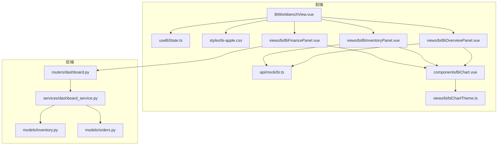
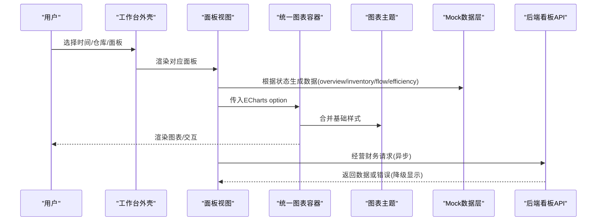
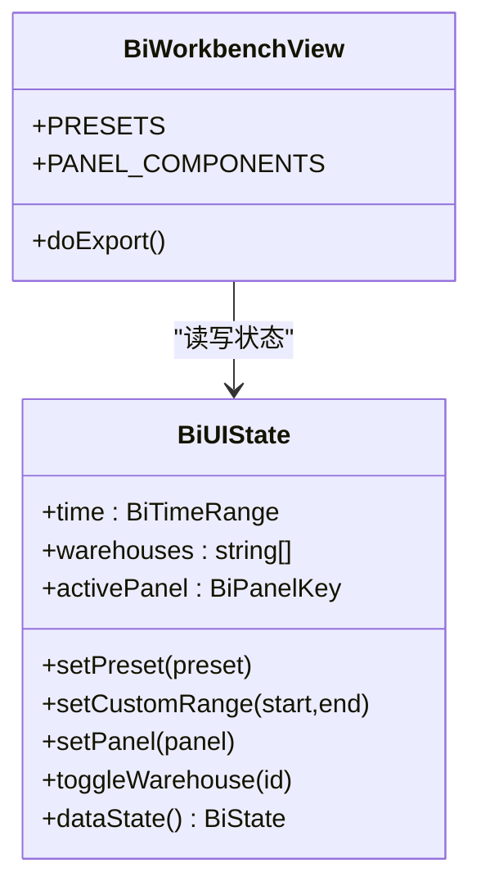
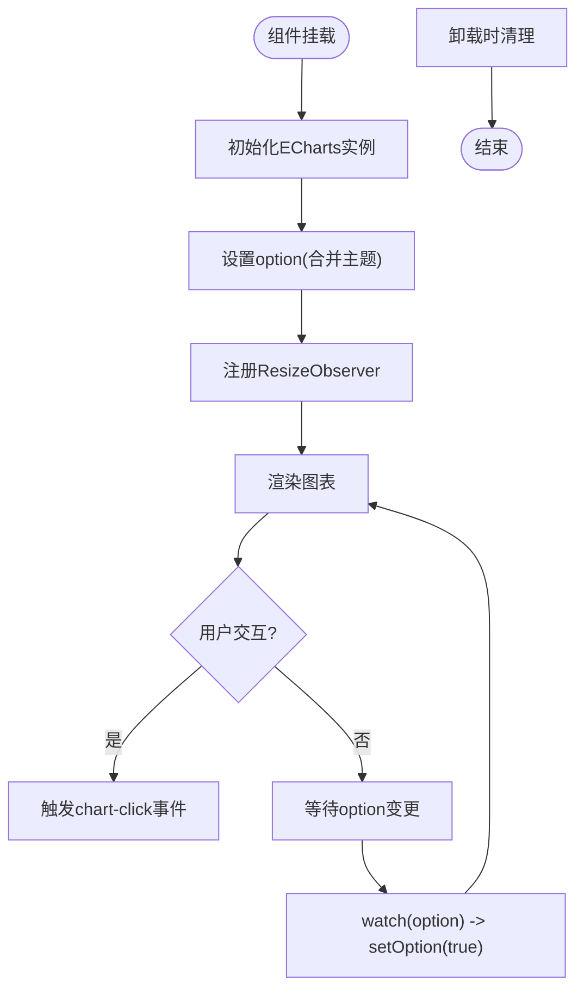
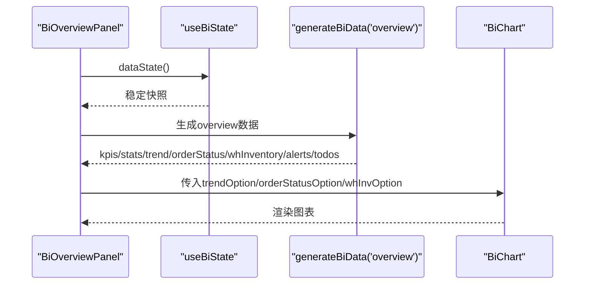
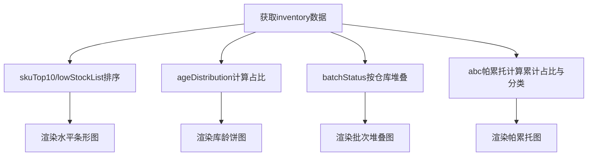
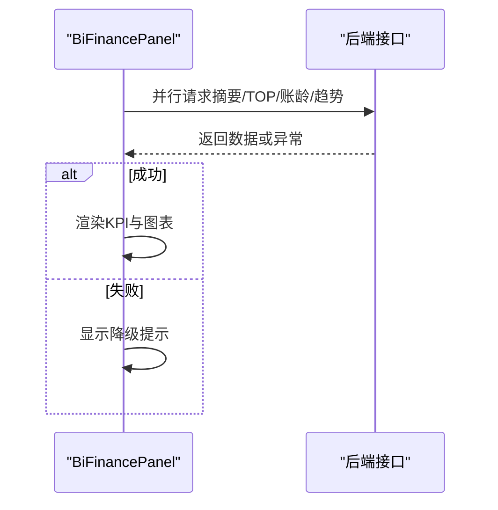
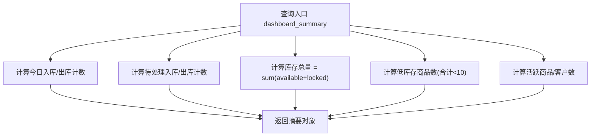
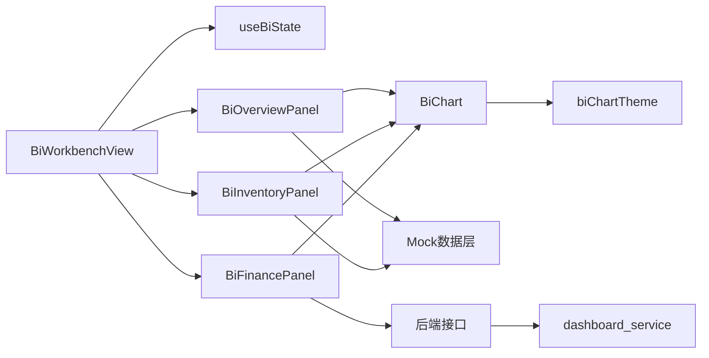

# 经营驾驶舱

<cite>
**本文引用的文件**
- [BiWorkbenchView.vue](file://frontend-vue/src/views/bi/BiWorkbenchView.vue)
- [useBiState.ts](file://frontend-vue/src/composables/useBiState.ts)
- [bi.ts（Mock数据层）](file://frontend-vue/src/api/mock/bi.ts)
- [BiOverviewPanel.vue](file://frontend-vue/src/views/bi/BiOverviewPanel.vue)
- [BiInventoryPanel.vue](file://frontend-vue/src/views/bi/BiInventoryPanel.vue)
- [BiFinancePanel.vue](file://frontend-vue/src/views/bi/BiFinancePanel.vue)
- [BiChart.vue](file://frontend-vue/src/components/BiChart.vue)
- [biChartTheme.ts](file://frontend-vue/src/views/bi/biChartTheme.ts)
- [bi-apple.css](file://frontend-vue/src/styles/bi-apple.css)
- [dashboard.py（后端看板路由）](file://backend-python/app/routers/dashboard.py)
- [dashboard_service.py（后端看板服务）](file://backend-python/app/services/dashboard_service.py)
- [inventory.py（库存模型）](file://backend-python/app/models/inventory.py)
- [orders.py（单据模型）](file://backend-python/app/models/orders.py)
- [PRD.md](file://docs/PRD.md)
</cite>

## 目录
1. [简介](#简介)
2. [项目结构](#项目结构)
3. [核心组件](#核心组件)
4. [架构总览](#架构总览)
5. [详细组件分析](#详细组件分析)
6. [依赖关系分析](#依赖关系分析)
7. [性能与实时性](#性能与实时性)
8. [故障排查指南](#故障排查指南)
9. [结论](#结论)
10. [附录](#附录)

## 简介
本文件面向WMS系统“经营驾驶舱”的首页数据看板，覆盖KPI指标卡、趋势图表、库存分布等可视化能力；说明统计数据聚合逻辑、前端Mock与真实接口集成方式、ECharts配置与样式、响应式设计与性能优化策略、跨浏览器兼容性与可访问性要点，并重点阐述数据口径的一致性与准确性保障机制。

## 项目结构
经营驾驶舱由前端BI工作台与后端看板服务组成：
- 前端：以Vue单页应用承载，包含统一图表容器、主题样式、各面板视图、全局状态与Mock数据层。
- 后端：提供首页统计汇总API，基于数据库模型进行聚合计算。

**图示来源**
- [BiWorkbenchView.vue:1-104](file://frontend-vue/src/views/bi/BiWorkbenchView.vue#L1-L104)
- [useBiState.ts:1-60](file://frontend-vue/src/composables/useBiState.ts#L1-L60)
- [bi.ts（Mock数据层）:1-405](file://frontend-vue/src/api/mock/bi.ts#L1-L405)
- [BiChart.vue:1-59](file://frontend-vue/src/components/BiChart.vue#L1-L59)
- [biChartTheme.ts:1-79](file://frontend-vue/src/views/bi/biChartTheme.ts#L1-L79)
- [dashboard.py:1-15](file://backend-python/app/routers/dashboard.py#L1-L15)
- [dashboard_service.py:1-50](file://backend-python/app/services/dashboard_service.py#L1-L50)
- [inventory.py:1-98](file://backend-python/app/models/inventory.py#L1-L98)
- [orders.py:1-300](file://backend-python/app/models/orders.py#L1-L300)

**章节来源**
- [BiWorkbenchView.vue:1-104](file://frontend-vue/src/views/bi/BiWorkbenchView.vue#L1-L104)
- [dashboard.py:1-15](file://backend-python/app/routers/dashboard.py#L1-L15)

## 核心组件
- 工作台外壳：负责时间范围筛选、仓库多选、Dock面板切换、图表导出。
- 全局状态：维护时间预设/自定义区间、仓库选择、当前激活面板，并提供稳定快照供数据生成使用。
- 统一图表容器：封装ECharts初始化、更新、自适应、销毁与导出能力。
- 主题与样式：统一的Apple风格配色、圆角、阴影、网格与排版，限定在作用域内避免污染主站。
- 面板视图：
  - 数据总览：KPI卡、彩色统计卡、出入库趋势、单据状态分布、仓库库存分布、预警列表与待办事项。
  - 库存分析：高/低库存TOP10、库龄分布、批次状态堆叠图、ABC帕累托图。
  - 经营财务：应收账龄、应收余额TOP客户、订单/回款趋势，以及经营概览卡片。
- 后端看板服务：提供首页统计摘要（今日入库/出库、待处理、库存总量、低库存商品数、活跃商品/客户数）。

**章节来源**
- [useBiState.ts:1-60](file://frontend-vue/src/composables/useBiState.ts#L1-L60)
- [BiChart.vue:1-59](file://frontend-vue/src/components/BiChart.vue#L1-L59)
- [biChartTheme.ts:1-79](file://frontend-vue/src/views/bi/biChartTheme.ts#L1-L79)
- [bi-apple.css:1-249](file://frontend-vue/src/styles/bi-apple.css#L1-L249)
- [BiOverviewPanel.vue:1-172](file://frontend-vue/src/views/bi/BiOverviewPanel.vue#L1-L172)
- [BiInventoryPanel.vue:1-110](file://frontend-vue/src/views/bi/BiInventoryPanel.vue#L1-L110)
- [BiFinancePanel.vue:1-145](file://frontend-vue/src/views/bi/BiFinancePanel.vue#L1-L145)
- [dashboard_service.py:1-50](file://backend-python/app/services/dashboard_service.py#L1-L50)

## 架构总览
驾驶舱采用“前端多面板 + 统一图表容器 + 主题样式 + Mock/真实接口双模式”的架构。大部分面板通过本地Mock数据生成器按筛选条件派生稳定数据；经营财务面板直接调用后端接口，失败时降级为空态，不影响其他面板。

**图示来源**
- [BiWorkbenchView.vue:1-104](file://frontend-vue/src/views/bi/BiWorkbenchView.vue#L1-L104)
- [BiChart.vue:1-59](file://frontend-vue/src/components/BiChart.vue#L1-L59)
- [biChartTheme.ts:1-79](file://frontend-vue/src/views/bi/biChartTheme.ts#L1-L79)
- [bi.ts（Mock数据层）:1-405](file://frontend-vue/src/api/mock/bi.ts#L1-L405)
- [dashboard.py:1-15](file://backend-python/app/routers/dashboard.py#L1-L15)

## 详细组件分析

### 工作台外壳与全局状态
- 顶栏：标题、时间预设（今天/近7天/近30天/自定义）、仓库多选（含“全部仓库”语义）、导出按钮。
- Dock：五面板切换（数据总览/库存分析/出入库分析/作业效率/经营财务）。
- 状态管理：集中维护时间范围与仓库集合，提供dataState快照用于数据生成，确保切换面板不改变数据种子。

**图示来源**
- [useBiState.ts:1-60](file://frontend-vue/src/composables/useBiState.ts#L1-L60)
- [BiWorkbenchView.vue:1-104](file://frontend-vue/src/views/bi/BiWorkbenchView.vue#L1-L104)

**章节来源**
- [BiWorkbenchView.vue:1-104](file://frontend-vue/src/views/bi/BiWorkbenchView.vue#L1-L104)
- [useBiState.ts:1-60](file://frontend-vue/src/composables/useBiState.ts#L1-L60)

### 统一图表容器与主题
- 容器职责：init/setOption/resize/dispose，暴露getDataURL与getInstance；监听ResizeObserver自动适配尺寸；事件转发chart-click。
- 主题职责：统一配色、字体、tooltip、grid、坐标轴样式；提供axisCategory/axisValue工具；支持一键导出面板所有图表为PNG。

**图示来源**
- [BiChart.vue:1-59](file://frontend-vue/src/components/BiChart.vue#L1-L59)
- [biChartTheme.ts:1-79](file://frontend-vue/src/views/bi/biChartTheme.ts#L1-L79)

**章节来源**
- [BiChart.vue:1-59](file://frontend-vue/src/components/BiChart.vue#L1-L59)
- [biChartTheme.ts:1-79](file://frontend-vue/src/views/bi/biChartTheme.ts#L1-L79)

### 数据总览面板（Overview）
- KPI指标卡：库存周转率、库容使用率、今日订单量、作业效率（完成量/计划量），支持进度条与趋势徽章。
- 彩色统计卡：今日入库单、今日出库单、库存总量、低库存商品，点击可跳转至相关分析面板。
- 趋势与分布：出入库趋势柱状图、单据状态环形图、仓库库存堆叠图。
- 预警与待办：库存预警列表（低库存/临期），点击下钻查看SKU明细与近7天迷你趋势；待办事项网格。

**图示来源**
- [BiOverviewPanel.vue:1-172](file://frontend-vue/src/views/bi/BiOverviewPanel.vue#L1-L172)
- [bi.ts（Mock数据层）:172-263](file://frontend-vue/src/api/mock/bi.ts#L172-L263)
- [useBiState.ts:1-60](file://frontend-vue/src/composables/useBiState.ts#L1-L60)

**章节来源**
- [BiOverviewPanel.vue:1-172](file://frontend-vue/src/views/bi/BiOverviewPanel.vue#L1-L172)
- [bi.ts（Mock数据层）:172-263](file://frontend-vue/src/api/mock/bi.ts#L172-L263)

### 库存分析面板（Inventory）
- TOP10高库存与低库存水平条形图。
- 库龄分布饼图（<30天、30-90天、90-180天、180-365天、>365天）。
- 批次状态堆叠图（正常/临期/已过期/冻结）。
- ABC分类帕累托图（金额+累计占比，A/B阈值线）。

**图示来源**
- [BiInventoryPanel.vue:1-110](file://frontend-vue/src/views/bi/BiInventoryPanel.vue#L1-L110)
- [bi.ts（Mock数据层）:265-312](file://frontend-vue/src/api/mock/bi.ts#L265-L312)

**章节来源**
- [BiInventoryPanel.vue:1-110](file://frontend-vue/src/views/bi/BiInventoryPanel.vue#L1-L110)
- [bi.ts（Mock数据层）:265-312](file://frontend-vue/src/api/mock/bi.ts#L265-L312)

### 经营财务面板（Finance）
- 数据来源：真实后端接口（与财务页同口径），包括摘要、应收TOP、账龄分布、趋势。
- 展示：KPI卡片（应收总额/已回款/未回款/逾期金额）、账龄饼图、应收余额TOP横条图、订单/回款趋势折线图。
- 降级：接口失败时显示提示，不影响其他Mock面板。

**图示来源**
- [BiFinancePanel.vue:1-145](file://frontend-vue/src/views/bi/BiFinancePanel.vue#L1-L145)

**章节来源**
- [BiFinancePanel.vue:1-145](file://frontend-vue/src/views/bi/BiFinancePanel.vue#L1-L145)

### 后端看板服务与数据口径
- 接口：GET /api/dashboard/summary，需鉴权。
- 聚合逻辑：
  - 今日入库/出库单数量：按created_at >= 今日零点计数。
  - 待处理入库/出库单：按状态过滤计数。
  - 库存总量：sum(available_qty + locked_qty)。
  - 低库存商品数：分组求和 < 10的商品数。
  - 活跃商品/客户数：status == ACTIVE计数。
- 数据口径一致性：
  - 库存可用与锁定分离，合计作为总量口径。
  - 单据状态机明确（如出库PENDING/PICKED/SHIPPED），看板仅对关键状态计数，保证与业务一致。

**图示来源**
- [dashboard_service.py:1-50](file://backend-python/app/services/dashboard_service.py#L1-L50)
- [inventory.py:33-61](file://backend-python/app/models/inventory.py#L33-L61)
- [orders.py:17-67](file://backend-python/app/models/orders.py#L17-L67)

**章节来源**
- [dashboard_service.py:1-50](file://backend-python/app/services/dashboard_service.py#L1-L50)
- [inventory.py:1-98](file://backend-python/app/models/inventory.py#L1-L98)
- [orders.py:1-300](file://backend-python/app/models/orders.py#L1-L300)

## 依赖关系分析
- 前端模块耦合：
  - 工作台外壳依赖全局状态与各面板组件；面板组件依赖统一图表容器与主题；Mock数据层被多个面板复用。
  - 样式限定在.bi-scope作用域，避免与Element主站冲突。
- 前后端集成：
  - 经营财务面板通过API调用后端接口；其他面板通过Mock数据层实现零网络、可复现演示。
- 外部依赖：
  - ECharts用于图表渲染；ResizeObserver用于自适应；可选下载图片功能。

**图示来源**
- [BiWorkbenchView.vue:1-104](file://frontend-vue/src/views/bi/BiWorkbenchView.vue#L1-L104)
- [BiChart.vue:1-59](file://frontend-vue/src/components/BiChart.vue#L1-L59)
- [bi.ts（Mock数据层）:1-405](file://frontend-vue/src/api/mock/bi.ts#L1-L405)
- [dashboard.py:1-15](file://backend-python/app/routers/dashboard.py#L1-L15)

**章节来源**
- [BiWorkbenchView.vue:1-104](file://frontend-vue/src/views/bi/BiWorkbenchView.vue#L1-L104)
- [dashboard.py:1-15](file://backend-python/app/routers/dashboard.py#L1-L15)

## 性能与实时性
- 图表性能：
  - 统一容器集中管理实例生命周期，避免重复创建与内存泄漏；watch(option)增量更新；ResizeObserver按需resize。
  - 主题合并减少重复配置；动画时长控制在合理范围。
- 数据生成性能：
  - Mock数据层使用seeded PRNG，相同筛选条件产生稳定数据，避免随机抖动；按仓库集合与时间范围派生数据，计算复杂度与维度线性相关。
- 实时性：
  - 前端无轮询；数据随筛选变化即时派生；经营财务面板在mounted时发起一次并行请求，失败降级。
- 建议优化：
  - 大数据量图表启用数据采样或分页加载；复杂计算可考虑Web Worker；图表按需懒加载（KeepAlive已启用）。

[本节为通用指导，不直接分析具体文件]

## 故障排查指南
- 图表不显示或尺寸异常：
  - 检查容器是否具备高度；确认ResizeObserver是否正常触发；确保option非空且类型正确。
- 图表导出失败：
  - 确认图表实例存在；getDataURL需要像素比与背景色参数；浏览器安全策略可能限制下载。
- 经营财务面板报错：
  - 检查后端接口连通性与鉴权；捕获异常后显示降级提示；确认接口返回结构与前端期望一致。
- 数据不一致：
  - 核对筛选条件（时间/仓库）是否正确传递到数据生成函数；确认后端聚合口径与前端展示一致。

**章节来源**
- [BiChart.vue:1-59](file://frontend-vue/src/components/BiChart.vue#L1-L59)
- [biChartTheme.ts:52-62](file://frontend-vue/src/views/bi/biChartTheme.ts#L52-L62)
- [BiFinancePanel.vue:73-87](file://frontend-vue/src/views/bi/BiFinancePanel.vue#L73-L87)

## 结论
经营驾驶舱通过统一图表容器与主题样式，结合Mock与真实接口双模式，实现了可复现、可扩展的数据可视化能力。后端看板服务提供一致的统计口径，前端通过稳定的状态管理与组件化设计，保证了良好的用户体验与可维护性。后续可在数据量增长时引入采样与懒加载，进一步提升性能与稳定性。

[本节为总结性内容，不直接分析具体文件]

## 附录

### ECharts配置与自定义样式
- 统一选项：biOption合并颜色、字体、tooltip、grid等基础样式；axisCategory/axisValue提供坐标轴快捷配置。
- 图表类型：柱状图（趋势/排名）、饼图（分布）、堆叠图（批次状态）、折线图（趋势）、帕累托图（ABC分类）。
- 导出：exportPanelCharts遍历面板内图表节点，逐张导出PNG，文件名带时间戳。

**章节来源**
- [biChartTheme.ts:1-79](file://frontend-vue/src/views/bi/biChartTheme.ts#L1-L79)
- [BiChart.vue:1-59](file://frontend-vue/src/components/BiChart.vue#L1-L59)

### 响应式设计与样式隔离
- 样式限定：所有规则以.bi-scope前缀限定，避免污染主站；使用CSS变量统一主题。
- 栅格布局：cols-2/3/4在不同屏幕宽度下自动调整列数；卡片悬停提升视觉层次。
- 移动端友好：Dock与筛选器支持横向滚动；图表容器自适应宽度。

**章节来源**
- [bi-apple.css:1-249](file://frontend-vue/src/styles/bi-apple.css#L1-L249)

### Mock数据使用方法与接口集成指南
- Mock数据：
  - 通过generateBiData(view, state)按视图与状态生成数据；seed由view+时间预设+起止日期+仓库集合哈希得到，保证稳定可复现。
  - WH_LIST定义仓库枚举；BI_THEME提供统一配色。
- 接口集成：
  - 经营财务面板调用后端接口（摘要、TOP、账龄、趋势），失败时降级显示提示；其他面板继续使用Mock，互不影响。
  - 后端看板接口：GET /api/dashboard/summary，返回今日入库/出库、待处理、库存总量、低库存商品数、活跃商品/客户数。

**章节来源**
- [bi.ts（Mock数据层）:1-405](file://frontend-vue/src/api/mock/bi.ts#L1-L405)
- [BiFinancePanel.vue:1-145](file://frontend-vue/src/views/bi/BiFinancePanel.vue#L1-L145)
- [dashboard.py:1-15](file://backend-python/app/routers/dashboard.py#L1-L15)

### 跨浏览器兼容性与可访问性
- 兼容性：
  - 使用现代浏览器特性（ResizeObserver、backdrop-filter），在旧浏览器中提供降级体验（如禁用毛玻璃效果）。
  - 图表导出依赖浏览器下载API，必要时提示用户手动保存。
- 可访问性：
  - 按钮与输入框具备语义化标签；颜色对比度满足可读性；键盘操作可导航；图表tooltip提供清晰信息。

[本节为通用指导，不直接分析具体文件]

### 数据口径一致性与准确性保障
- 库存口径：
  - 可用量与锁定量分离，总量=可用+锁定；低库存判定基于合计数量<10。
- 单据口径：
  - 入库单状态PENDING→COMPLETED；出库单状态PENDING→PICKED→SHIPPED；看板计数严格基于状态机定义。
- 一致性原则：
  - 后端服务层聚合逻辑与前端展示保持一致；财务域金额精确到两位小数，禁止浮点误差。
- 测试与验证：
  - 需求文档强调凭证与报表不变量测试；驾驶舱统计应与业务状态机与库存流水一致。

**章节来源**
- [inventory.py:33-61](file://backend-python/app/models/inventory.py#L33-L61)
- [orders.py:17-67](file://backend-python/app/models/orders.py#L17-L67)
- [PRD.md:122-144](file://docs/PRD.md#L122-L144)