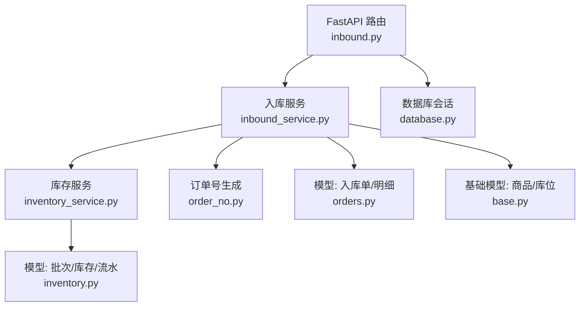
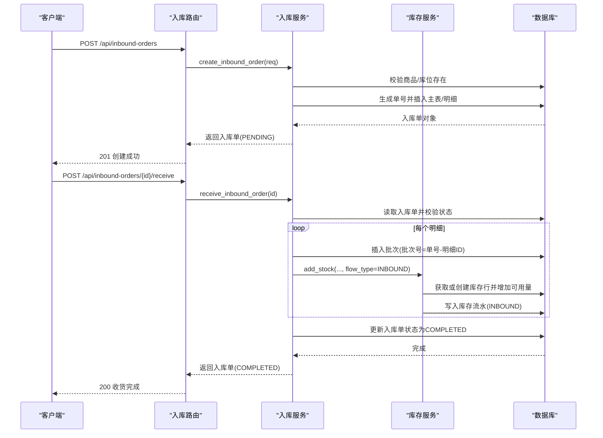
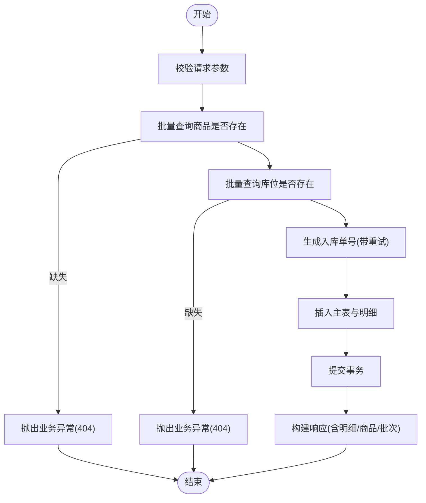
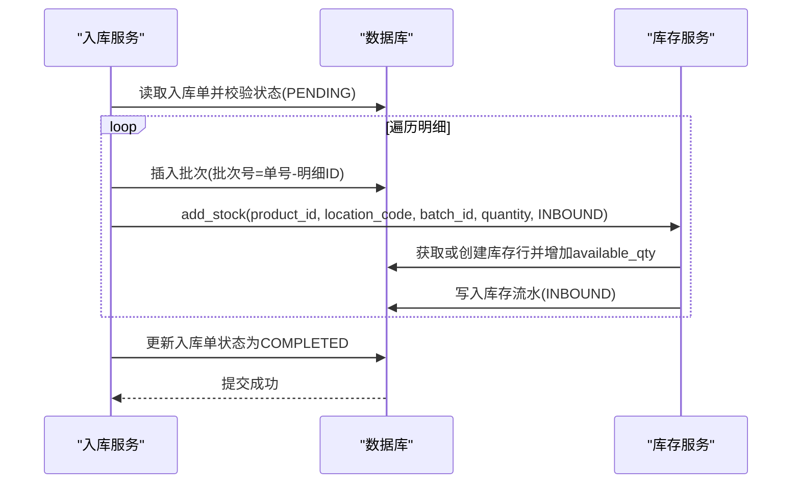
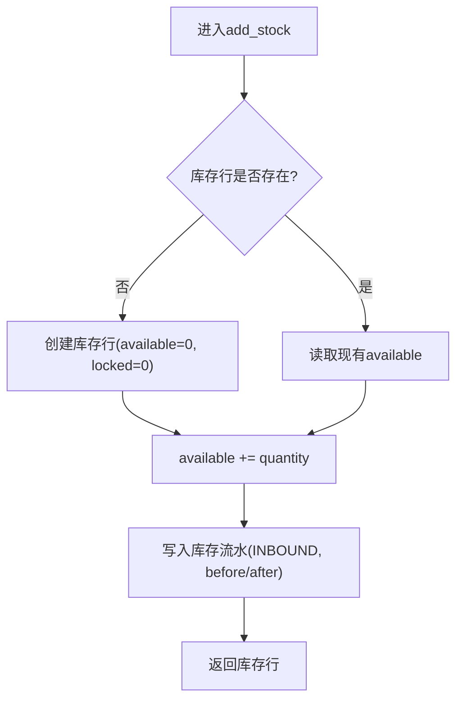
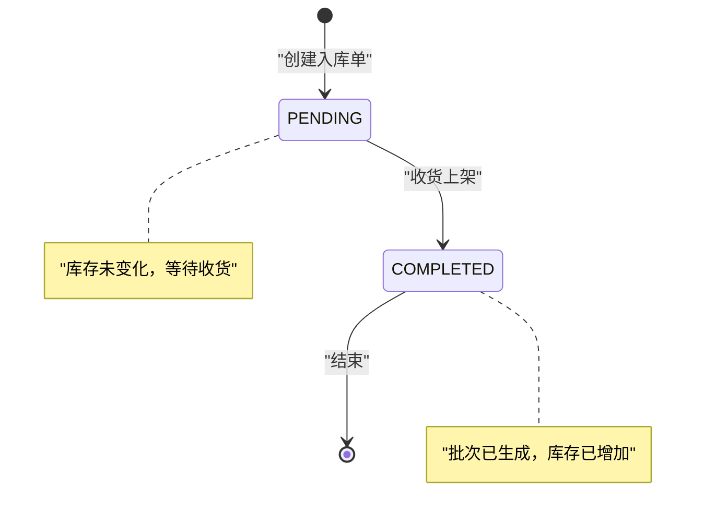
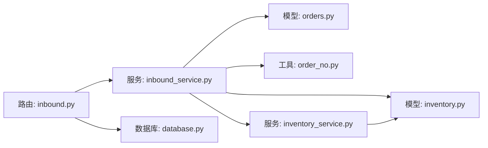

# 入库管理模块

<cite>
**本文引用的文件**
- [backend-python/app/routers/inbound.py](file://backend-python/app/routers/inbound.py)
- [backend-python/app/services/inbound_service.py](file://backend-python/app/services/inbound_service.py)
- [backend-python/app/models/orders.py](file://backend-python/app/models/orders.py)
- [backend-python/app/models/inventory.py](file://backend-python/app/models/inventory.py)
- [backend-python/app/schemas/orders.py](file://backend-python/app/schemas/orders.py)
- [backend-python/app/services/inventory_service.py](file://backend-python/app/services/inventory_service.py)
- [backend-python/app/common/order_no.py](file://backend-python/app/common/order_no.py)
- [backend-python/app/models/base.py](file://backend-python/app/models/base.py)
- [backend-python/app/database.py](file://backend-python/app/database.py)
- [backend-python/tests/test_inbound_service.py](file://backend-python/tests/test_inbound_service.py)
- [backend-python/app/common/errors.py](file://backend-python/app/common/errors.py)
- [backend-python/app/models/finance.py](file://backend-python/app/models/finance.py)
- [backend-python/app/services/accounting_service.py](file://backend-python/app/services/accounting_service.py)
- [backend-python/app/routers/finance.py](file://backend-python/app/routers/finance.py)
</cite>

## 目录
1. [简介](#简介)
2. [项目结构](#项目结构)
3. [核心组件](#核心组件)
4. [架构总览](#架构总览)
5. [详细组件分析](#详细组件分析)
6. [依赖关系分析](#依赖关系分析)
7. [性能考虑](#性能考虑)
8. [故障排查指南](#故障排查指南)
9. [结论](#结论)
10. [附录](#附录)

## 简介
本模块面向WMS系统的“入库管理”，覆盖从入库单创建、收货确认、批次生成到上架与库存增加的全流程。系统采用“创建不生效、收货才生效”的设计：创建入库单仅记录计划，不改变库存；执行收货后，按明细生成批次、累加可用库存并写入库存流水，同时将入库单状态由待收货变更为已完成。该设计确保业务可追溯、数据一致且便于对账与审计。

## 项目结构
后端采用FastAPI路由层 + 服务层 + ORM模型的分层架构：
- 路由层：定义HTTP接口，负责参数校验与调用服务层
- 服务层：实现入库业务流程、状态机、批次与库存操作
- 模型层：定义入库单、明细、批次、库存行、库存流水等实体
- 通用工具：单据号生成、错误类型、数据库会话管理

图示来源
- [backend-python/app/routers/inbound.py:13-44](file://backend-python/app/routers/inbound.py#L13-L44)
- [backend-python/app/services/inbound_service.py:38-129](file://backend-python/app/services/inbound_service.py#L38-L129)
- [backend-python/app/services/inventory_service.py:75-88](file://backend-python/app/services/inventory_service.py#L75-L88)
- [backend-python/app/common/order_no.py:11-37](file://backend-python/app/common/order_no.py#L11-L37)
- [backend-python/app/models/orders.py:17-48](file://backend-python/app/models/orders.py#L17-L48)
- [backend-python/app/models/inventory.py:18-98](file://backend-python/app/models/inventory.py#L18-L98)
- [backend-python/app/models/base.py:14-95](file://backend-python/app/models/base.py#L14-L95)
- [backend-python/app/database.py:22-37](file://backend-python/app/database.py#L22-L37)

章节来源
- [backend-python/app/routers/inbound.py:1-45](file://backend-python/app/routers/inbound.py#L1-L45)
- [backend-python/app/services/inbound_service.py:1-150](file://backend-python/app/services/inbound_service.py#L1-L150)
- [backend-python/app/models/orders.py:17-48](file://backend-python/app/models/orders.py#L17-L48)
- [backend-python/app/models/inventory.py:18-98](file://backend-python/app/models/inventory.py#L18-L98)
- [backend-python/app/common/order_no.py:1-38](file://backend-python/app/common/order_no.py#L1-L38)
- [backend-python/app/models/base.py:14-95](file://backend-python/app/models/base.py#L14-L95)
- [backend-python/app/database.py:1-38](file://backend-python/app/database.py#L1-L38)

## 核心组件
- 入库单与明细：主表与明细表，支持目标库位与批次回填
- 批次：一次入库收货生成一个批次，支持有效期字段（简化版）
- 库存行：按(商品, 库位, 批次)维度维护可用量与锁定量
- 库存流水：所有库存变动必须写流水，支持按单号、商品、库位、流水类型查询
- 单据号生成：按日递增的序列号，冲突时重试
- 错误处理：统一业务异常携带HTTP状态码

章节来源
- [backend-python/app/models/orders.py:17-48](file://backend-python/app/models/orders.py#L17-L48)
- [backend-python/app/models/inventory.py:18-98](file://backend-python/app/models/inventory.py#L18-L98)
- [backend-python/app/common/order_no.py:11-37](file://backend-python/app/common/order_no.py#L11-L37)
- [backend-python/app/common/errors.py:4-9](file://backend-python/app/common/errors.py#L4-L9)

## 架构总览
入库管理的关键交互如下：
- 创建入库单：校验商品与库位存在性，生成唯一单号，落库主表与明细，状态为PENDING，不改变库存
- 收货上架：校验状态机允许转换，逐明细生成批次，调用库存服务增加可用库存并写流水，更新入库单状态为COMPLETED
- 查询与分页：使用joinedload避免N+1查询，返回包含商品与批次信息的响应

图示来源
- [backend-python/app/routers/inbound.py:13-26](file://backend-python/app/routers/inbound.py#L13-L26)
- [backend-python/app/services/inbound_service.py:38-129](file://backend-python/app/services/inbound_service.py#L38-L129)
- [backend-python/app/services/inventory_service.py:75-88](file://backend-python/app/services/inventory_service.py#L75-L88)

## 详细组件分析

### 入库单创建流程
- 输入校验：通过Pydantic Schema校验供应商名称、明细项数量、商品ID、数量、目标库位编码等
- 存在性校验：批量查询商品与库位，缺失则抛出业务异常
- 单号生成：按日递增生成“IN-YYYYMMDD-XXX”，遇到唯一约束冲突时重试最多5次
- 事务边界：插入主表与明细在同一事务中提交，失败回滚
- 响应构建：返回包含明细、商品名、批次号（收货前为空）的结构化数据

图示来源
- [backend-python/app/schemas/orders.py:11-21](file://backend-python/app/schemas/orders.py#L11-L21)
- [backend-python/app/services/inbound_service.py:38-82](file://backend-python/app/services/inbound_service.py#L38-L82)
- [backend-python/app/common/order_no.py:11-37](file://backend-python/app/common/order_no.py#L11-L37)

章节来源
- [backend-python/app/schemas/orders.py:11-21](file://backend-python/app/schemas/orders.py#L11-L21)
- [backend-python/app/services/inbound_service.py:38-82](file://backend-python/app/services/inbound_service.py#L38-L82)
- [backend-python/app/common/order_no.py:11-37](file://backend-python/app/common/order_no.py#L11-L37)

### 收货确认与批次生成
- 状态机校验：仅允许从PENDING转换为COMPLETED，重复收货将抛出业务异常
- 批次策略：每个明细行生成一个批次，批次号为“单号-明细ID”，支持后续有效期与追溯
- 库存增加：调用库存服务增加对应(商品, 库位, 批次)的可用量，并写入INBOUND流水
- 事务一致性：批次创建、库存增加、状态更新在同一事务内，任一失败整体回滚

图示来源
- [backend-python/app/services/inbound_service.py:92-129](file://backend-python/app/services/inbound_service.py#L92-L129)
- [backend-python/app/services/inventory_service.py:75-88](file://backend-python/app/services/inventory_service.py#L75-L88)

章节来源
- [backend-python/app/services/inbound_service.py:92-129](file://backend-python/app/services/inbound_service.py#L92-L129)
- [backend-python/app/services/inventory_service.py:75-88](file://backend-python/app/services/inventory_service.py#L75-L88)

### 库存增加逻辑与并发控制
- 库存行维度：(product_id, location_code, batch_id)，可用量与锁定量分离
- 增加库存：若不存在库存行则创建，随后增加可用量并写流水
- 并发安全：扣减与锁定类操作使用条件UPDATE与with_for_update，防止并发超卖；SQLite下忽略行锁但保留条件更新以保障幂等
- 跨批次扣减：出库/锁定支持先扣早期批次，保证先进先出语义

图示来源
- [backend-python/app/services/inventory_service.py:33-54](file://backend-python/app/services/inventory_service.py#L33-L54)
- [backend-python/app/services/inventory_service.py:75-88](file://backend-python/app/services/inventory_service.py#L75-L88)

章节来源
- [backend-python/app/models/inventory.py:33-61](file://backend-python/app/models/inventory.py#L33-L61)
- [backend-python/app/services/inventory_service.py:33-88](file://backend-python/app/services/inventory_service.py#L33-L88)

### 入库状态机流转
- 初始状态：PENDING（待收货）
- 终态：COMPLETED（已收货上架）
- 约束：仅允许PENDING→COMPLETED；重复操作抛错；非PENDING状态拒绝收货

图示来源
- [backend-python/app/models/orders.py:17-31](file://backend-python/app/models/orders.py#L17-L31)
- [backend-python/app/services/inbound_service.py:13-15](file://backend-python/app/services/inbound_service.py#L13-L15)
- [backend-python/app/services/inbound_service.py:92-129](file://backend-python/app/services/inbound_service.py#L92-L129)

章节来源
- [backend-python/app/models/orders.py:17-31](file://backend-python/app/models/orders.py#L17-L31)
- [backend-python/app/services/inbound_service.py:13-15](file://backend-python/app/services/inbound_service.py#L13-L15)
- [backend-python/app/services/inbound_service.py:92-129](file://backend-python/app/services/inbound_service.py#L92-L129)

### 数据验证规则
- 入参校验：供应商名称长度限制、明细项至少一项、商品ID与数量为正数、库位编码长度限制
- 存在性校验：商品与库位必须存在，否则返回404
- 调整数量：不允许为0（适用于其他场景如盘盈盘亏）
- 状态机校验：仅允许PENDING→COMPLETED，重复收货抛错

章节来源
- [backend-python/app/schemas/orders.py:11-21](file://backend-python/app/schemas/orders.py#L11-L21)
- [backend-python/app/services/inbound_service.py:38-82](file://backend-python/app/services/inbound_service.py#L38-L82)
- [backend-python/app/services/inbound_service.py:92-102](file://backend-python/app/services/inbound_service.py#L92-L102)

### 异常处理机制
- 业务异常：BusinessError携带消息与HTTP状态码，用于商品/库位不存在、重复收货、期间关闭等场景
- 全局处理：由框架全局异常处理器统一转为响应
- 事务回滚：IntegrityError捕获后回滚并重试单号生成，最终失败抛错

章节来源
- [backend-python/app/common/errors.py:4-9](file://backend-python/app/common/errors.py#L4-L9)
- [backend-python/app/services/inbound_service.py:56-82](file://backend-python/app/services/inbound_service.py#L56-L82)
- [backend-python/app/services/inbound_service.py:92-102](file://backend-python/app/services/inbound_service.py#L92-L102)

### 事务处理与并发控制
- 事务边界：创建入库单与收货上架均在同一数据库事务中提交，失败整体回滚
- 并发安全：扣减与锁定类操作使用条件UPDATE与with_for_update，避免并发超卖；SQLite忽略行锁但保留条件更新
- 单号冲突：唯一约束冲突时捕获并重试，最多5次

章节来源
- [backend-python/app/services/inbound_service.py:56-82](file://backend-python/app/services/inbound_service.py#L56-L82)
- [backend-python/app/services/inbound_service.py:92-129](file://backend-python/app/services/inbound_service.py#L92-L129)
- [backend-python/app/services/inventory_service.py:91-144](file://backend-python/app/services/inventory_service.py#L91-L144)
- [backend-python/app/services/inventory_service.py:147-202](file://backend-python/app/services/inventory_service.py#L147-L202)

### 与库存模块的集成
- 批次：每次收货为每个明细生成批次，支持有效期与追溯
- 库存行：按(商品, 库位, 批次)维度维护可用量与锁定量
- 库存流水：所有库存变动必须写流水，支持按单号、商品、库位、流水类型查询

章节来源
- [backend-python/app/models/inventory.py:18-98](file://backend-python/app/models/inventory.py#L18-L98)
- [backend-python/app/services/inventory_service.py:75-88](file://backend-python/app/services/inventory_service.py#L75-L88)
- [backend-python/app/services/inventory_service.py:348-401](file://backend-python/app/services/inventory_service.py#L348-L401)

### 与财务模块的集成关系
- 当前入库流程不直接产生财务分录；财务模块提供应收/应付、收款登记与核销能力
- 未来扩展点：可在收货完成后根据供应商与商品价值生成应付流水或会计凭证（需结合价格与科目配置）
- 会计内核：凭证过账需借贷平衡、期间开放，支持红字冲销与期间管理

章节来源
- [backend-python/app/models/finance.py:26-117](file://backend-python/app/models/finance.py#L26-L117)
- [backend-python/app/services/accounting_service.py:168-240](file://backend-python/app/services/accounting_service.py#L168-L240)
- [backend-python/app/routers/finance.py:13-59](file://backend-python/app/routers/finance.py#L13-L59)

## 依赖关系分析
- 路由层依赖服务层：inbound路由调用inbound_service
- 服务层依赖模型与工具：入库服务依赖orders/inventory模型、order_no生成器、inventory_service
- 库存服务依赖inventory模型：批次、库存行、库存流水
- 数据库会话：通过database.get_db注入Session

图示来源
- [backend-python/app/routers/inbound.py:13-44](file://backend-python/app/routers/inbound.py#L13-L44)
- [backend-python/app/services/inbound_service.py:38-129](file://backend-python/app/services/inbound_service.py#L38-L129)
- [backend-python/app/services/inventory_service.py:75-88](file://backend-python/app/services/inventory_service.py#L75-L88)
- [backend-python/app/common/order_no.py:11-37](file://backend-python/app/common/order_no.py#L11-L37)
- [backend-python/app/models/orders.py:17-48](file://backend-python/app/models/orders.py#L17-L48)
- [backend-python/app/models/inventory.py:18-98](file://backend-python/app/models/inventory.py#L18-L98)
- [backend-python/app/database.py:22-37](file://backend-python/app/database.py#L22-L37)

章节来源
- [backend-python/app/routers/inbound.py:13-44](file://backend-python/app/routers/inbound.py#L13-L44)
- [backend-python/app/services/inbound_service.py:38-129](file://backend-python/app/services/inbound_service.py#L38-L129)
- [backend-python/app/services/inventory_service.py:75-88](file://backend-python/app/services/inventory_service.py#L75-L88)
- [backend-python/app/common/order_no.py:11-37](file://backend-python/app/common/order_no.py#L11-L37)
- [backend-python/app/models/orders.py:17-48](file://backend-python/app/models/orders.py#L17-L48)
- [backend-python/app/models/inventory.py:18-98](file://backend-python/app/models/inventory.py#L18-L98)
- [backend-python/app/database.py:22-37](file://backend-python/app/database.py#L22-L37)

## 性能考虑
- N+1查询优化：列表查询使用joinedload一次性加载明细及其关联的商品与批次
- 索引设计：库存与流水表针对常用过滤列建立索引，提升查询效率
- 并发安全：扣减与锁定类操作使用条件UPDATE与with_for_update，避免并发超卖
- 分页查询：列表接口支持分页，减少单次响应体积

章节来源
- [backend-python/app/services/inbound_service.py:132-150](file://backend-python/app/services/inbound_service.py#L132-L150)
- [backend-python/app/models/inventory.py:40-48](file://backend-python/app/models/inventory.py#L40-L48)
- [backend-python/app/models/inventory.py:77-81](file://backend-python/app/models/inventory.py#L77-L81)
- [backend-python/app/services/inventory_service.py:91-144](file://backend-python/app/services/inventory_service.py#L91-L144)
- [backend-python/app/services/inventory_service.py:147-202](file://backend-python/app/services/inventory_service.py#L147-L202)

## 故障排查指南
- 重复收货：检查入库单状态是否为PENDING，重复操作会抛出业务异常
- 商品/库位不存在：创建入库单前需确保商品与库位已存在，否则返回404
- 单号冲突：唯一约束冲突时自动重试，最多5次；若仍失败需检查数据库唯一约束与并发情况
- 库存不足：出库/锁定类操作在库存不足时返回False，不会写入流水；入库增加库存不受此影响
- 期间关闭：会计凭证过账需在开放期间进行，关闭期间禁止写入

章节来源
- [backend-python/app/services/inbound_service.py:92-102](file://backend-python/app/services/inbound_service.py#L92-L102)
- [backend-python/app/services/inbound_service.py:38-82](file://backend-python/app/services/inbound_service.py#L38-L82)
- [backend-python/app/services/inventory_service.py:91-144](file://backend-python/app/services/inventory_service.py#L91-L144)
- [backend-python/app/services/accounting_service.py:119-123](file://backend-python/app/services/accounting_service.py#L119-L123)

## 结论
入库管理模块通过“创建不生效、收货才生效”的设计，实现了清晰的业务状态机、严格的批次管理与完整的库存流水追溯。系统在并发安全、事务一致性与性能优化方面均有充分考虑，并与库存、财务模块形成良好解耦与扩展点。建议在生产环境使用PostgreSQL以获得更好的行锁支持与并发处理能力。

## 附录
- 单元测试示例路径：[test_inbound_service.py](file://backend-python/tests/test_inbound_service.py)
- 关键流程参考：
  - 创建入库单：[create_inbound_order:38-82](file://backend-python/app/services/inbound_service.py#L38-L82)
  - 收货上架：[receive_inbound_order:92-129](file://backend-python/app/services/inbound_service.py#L92-L129)
  - 库存增加：[add_stock:75-88](file://backend-python/app/services/inventory_service.py#L75-L88)
  - 单据号生成：[generate_order_no:11-37](file://backend-python/app/common/order_no.py#L11-L37)