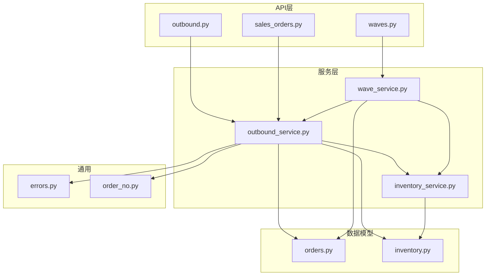
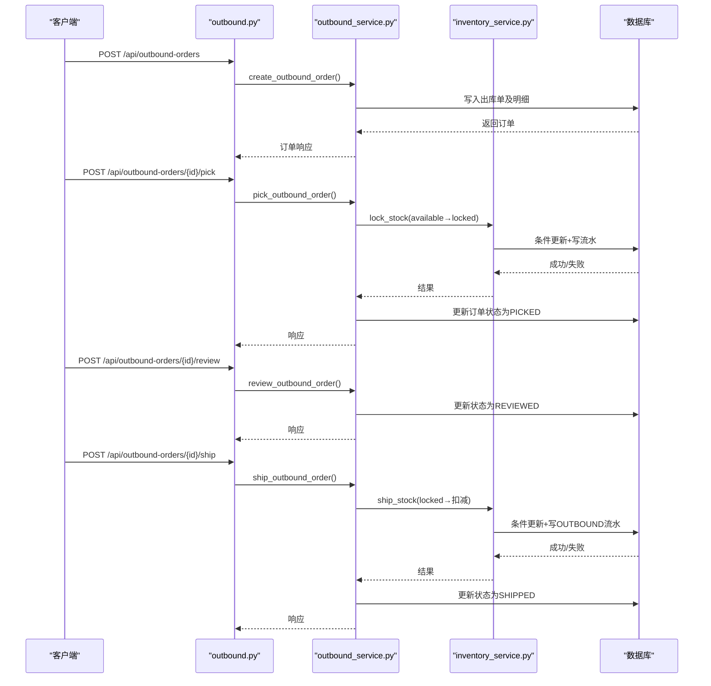
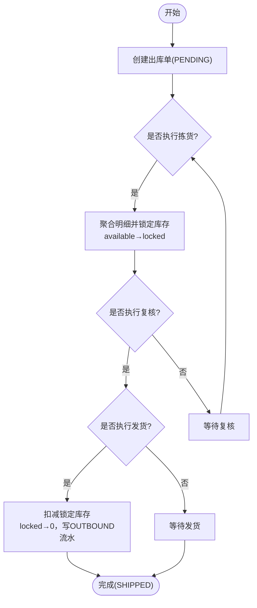
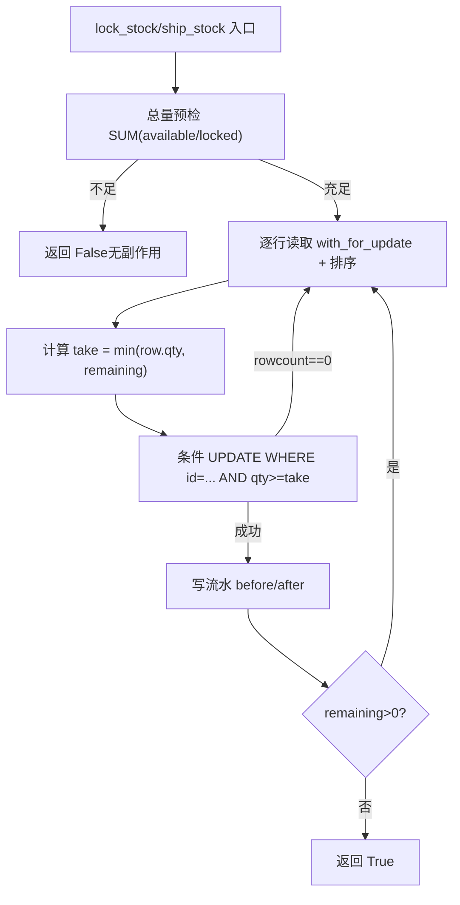
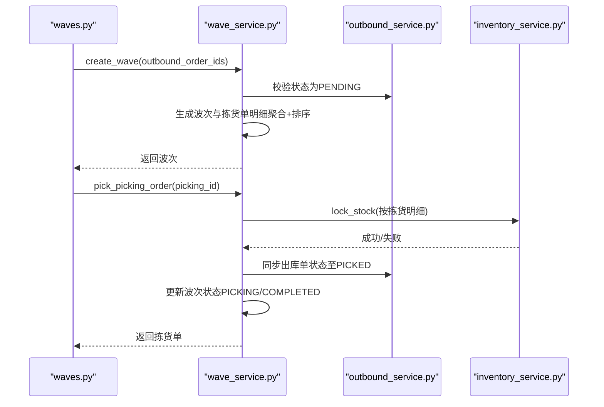
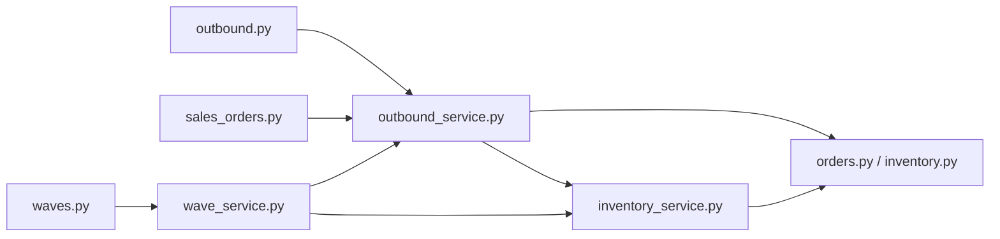
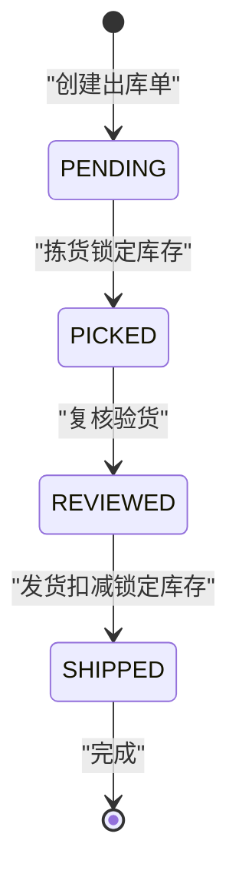

# 出库管理模块

<cite>
**本文引用的文件**
- [outbound.py](file://backend-python/app/routers/outbound.py)
- [outbound_service.py](file://backend-python/app/services/outbound_service.py)
- [inventory_service.py](file://backend-python/app/services/inventory_service.py)
- [orders.py](file://backend-python/app/models/orders.py)
- [inventory.py](file://backend-python/app/models/inventory.py)
- [orders_schemas.py](file://backend-python/app/schemas/orders.py)
- [waves.py](file://backend-python/app/routers/waves.py)
- [wave_service.py](file://backend-python/app/services/wave_service.py)
- [sales_orders.py](file://backend-python/app/routers/sales_orders.py)
- [errors.py](file://backend-python/app/common/errors.py)
- [order_no.py](file://backend-python/app/common/order_no.py)
- [test_outbound_service.py](file://backend-python/tests/test_outbound_service.py)
</cite>

## 目录
1. [简介](#简介)
2. [项目结构](#项目结构)
3. [核心组件](#核心组件)
4. [架构总览](#架构总览)
5. [详细组件分析](#详细组件分析)
6. [依赖关系分析](#依赖关系分析)
7. [性能与并发特性](#性能与并发特性)
8. [故障排查指南](#故障排查指南)
9. [结论](#结论)
10. [附录：业务流程与状态机](#附录业务流程与状态机)

## 简介
本模块实现WMS系统的出库管理，覆盖出库单创建、拣货锁定、复核验货、发货扣减全流程。系统采用严格的状态机控制（PENDING → PICKED → REVIEWED → SHIPPED），通过库存服务实现跨批次FIFO扣减、可用量与锁定量分离、并发防超卖与全量流水可追溯。同时提供波次拣货聚合能力，并与销售订单模块集成，形成从“销售确认→生成出库→波次拣货→复核发货”的闭环流程。

## 项目结构
后端采用分层设计：
- API层（routers）：定义REST接口，负责参数校验与调用服务层
- 服务层（services）：封装业务逻辑，协调模型与库存服务
- 数据模型（models）：定义数据库表结构与关联关系
- Schema（schemas）：请求/响应数据模型
- 通用工具（common）：错误类型、单号生成等

图表来源
- [outbound.py:1-61](file://backend-python/app/routers/outbound.py#L1-L61)
- [wave_service.py:1-238](file://backend-python/app/services/wave_service.py#L1-L238)
- [inventory_service.py:1-437](file://backend-python/app/services/inventory_service.py#L1-L437)
- [orders.py:50-138](file://backend-python/app/models/orders.py#L50-L138)
- [inventory.py:33-98](file://backend-python/app/models/inventory.py#L33-L98)

章节来源
- [outbound.py:1-61](file://backend-python/app/routers/outbound.py#L1-L61)
- [orders.py:50-138](file://backend-python/app/models/orders.py#L50-L138)
- [inventory.py:33-98](file://backend-python/app/models/inventory.py#L33-L98)

## 核心组件
- 出库单服务：实现出库单生命周期管理与状态流转，协调库存锁定与扣减
- 库存服务：提供统一的库存操作入口，支持FIFO跨批次扣减、并发安全、流水记录
- 波次服务：聚合多张待拣货出库单，生成拣货任务并驱动库存锁定与出库单状态推进
- 销售订单路由：与出库流程衔接，发货时回填出库单号，形成财务应收

章节来源
- [outbound_service.py:1-196](file://backend-python/app/services/outbound_service.py#L1-L196)
- [inventory_service.py:1-437](file://backend-python/app/services/inventory_service.py#L1-L437)
- [wave_service.py:1-238](file://backend-python/app/services/wave_service.py#L1-L238)
- [sales_orders.py:1-81](file://backend-python/app/routers/sales_orders.py#L1-L81)

## 架构总览
出库主流程由API路由触发，服务层执行业务规则，最终通过库存服务完成库存变更与流水记录。波次拣货作为可选聚合路径，统一驱动多个出库单的拣货锁定。

图表来源
- [outbound.py:13-42](file://backend-python/app/routers/outbound.py#L13-L42)
- [outbound_service.py:42-176](file://backend-python/app/services/outbound_service.py#L42-L176)
- [inventory_service.py:147-251](file://backend-python/app/services/inventory_service.py#L147-L251)

## 详细组件分析

### 出库单服务（状态机与事务）
- 创建出库单：生成唯一单号，写入主表与明细，初始状态PENDING，不改变库存
- 拣货锁定：校验状态为PENDING，聚合明细按(商品,库位)合并，调用库存服务lock_stock将可用量转为锁定量；任一明细不足则整体回滚
- 复核验货：校验状态为PICKED，更新为REVIEWED，作为发货前置环节
- 发货扣减：校验状态为REVIEWED，聚合明细后调用库存服务ship_stock扣减锁定量，写入OUTBOUND流水，更新为SHIPPED
- 列表查询：使用joinedload一次性加载明细与商品，避免N+1查询

图表来源
- [outbound_service.py:42-176](file://backend-python/app/services/outbound_service.py#L42-L176)

章节来源
- [outbound_service.py:42-176](file://backend-python/app/services/outbound_service.py#L42-L176)
- [orders.py:50-81](file://backend-python/app/models/orders.py#L50-L81)

### 库存服务（FIFO与并发安全）
- FIFO策略：扣减类操作按入库行先后顺序（ID升序）逐行扣减，先扣早期批次，保证先进先出
- 并发防超卖：
  - 总量预检：SUM(available或locked)校验是否足够，不足直接返回False且无副作用
  - 条件更新：使用WHERE available >= take或locked >= take的条件UPDATE，防止陈旧读覆盖并发修改
  - 重试机制：若rowcount为0表示被并发修改，重读最新状态继续处理
  - 行级锁：在PostgreSQL下with_for_update加行锁；SQLite忽略但条件更新仍有效
- 流水记录：每次库存变动均写InventoryFlow，记录flow_type、before_qty、after_qty，确保账实可追溯

图表来源
- [inventory_service.py:147-251](file://backend-python/app/services/inventory_service.py#L147-L251)

章节来源
- [inventory_service.py:91-251](file://backend-python/app/services/inventory_service.py#L91-L251)
- [inventory.py:33-98](file://backend-python/app/models/inventory.py#L33-L98)

### 波次拣货服务（聚合与驱动）
- 创建波次：选择多张PENDING状态的出库单，为每张生成一张拣货单，明细按(商品,库位)聚合并按库位优先级降序排列，模拟最优拣货路径
- 执行拣货：逐项调用库存服务lock_stock锁定库存，成功后将对应出库单状态从PENDING推进到PICKED，拣货单状态CREATED→PICKED
- 波次状态推进：首单开始拣货→PICKING；全部拣货完成→COMPLETED

图表来源
- [wave_service.py:62-197](file://backend-python/app/services/wave_service.py#L62-L197)
- [waves.py:13-48](file://backend-python/app/routers/waves.py#L13-L48)

章节来源
- [wave_service.py:62-197](file://backend-python/app/services/wave_service.py#L62-L197)
- [orders.py:83-138](file://backend-python/app/models/orders.py#L83-L138)

### 与销售订单模块集成
- 销售订单发货：调用财务服务ship_sales_order，可传入outbound_order_no以关联出库单号，自动生成应收
- 出库单与波次：出库单可归属波次，便于批量拣货与路径优化
- 数据一致性：出库完成后，销售订单状态推进，财务应收生成，形成业务闭环

章节来源
- [sales_orders.py:59-66](file://backend-python/app/routers/sales_orders.py#L59-L66)
- [orders.py:50-67](file://backend-python/app/models/orders.py#L50-L67)

## 依赖关系分析
- 耦合性：
  - 出库服务依赖库存服务进行原子化库存操作，解耦了状态机与库存细节
  - 波次服务依赖出库服务进行状态同步，体现“拣货驱动出库”的设计
- 内聚性：
  - 库存服务集中所有库存变更逻辑，保证FIFO、并发、流水的一致性
  - 出库服务专注状态机与事务边界，职责清晰
- 外部依赖：
  - 数据库：SQLAlchemy ORM，支持PostgreSQL/SQLite
  - 并发：利用SQL条件更新与事务隔离避免超卖

图表来源
- [outbound.py:1-61](file://backend-python/app/routers/outbound.py#L1-L61)
- [wave_service.py:1-238](file://backend-python/app/services/wave_service.py#L1-L238)
- [outbound_service.py:1-196](file://backend-python/app/services/outbound_service.py#L1-L196)
- [inventory_service.py:1-437](file://backend-python/app/services/inventory_service.py#L1-L437)

章节来源
- [outbound_service.py:1-196](file://backend-python/app/services/outbound_service.py#L1-L196)
- [inventory_service.py:1-437](file://backend-python/app/services/inventory_service.py#L1-L437)

## 性能与并发特性
- 查询优化：使用joinedload一次性加载关联数据，避免N+1问题
- 索引设计：库存表对location_code、product_id建索引；流水表对order_no、product_id、created_at建索引
- 并发安全：
  - 总量预检+条件更新双重保险，防止超卖
  - PostgreSQL下with_for_update加行锁；SQLite下条件更新仍有效
  - 单号冲突重试：生成单号时捕获IntegrityError并重试
- 事务边界：每个API调用在一个数据库事务中完成，失败时整体回滚，不留半成品

章节来源
- [inventory_service.py:256-345](file://backend-python/app/services/inventory_service.py#L256-L345)
- [inventory.py:33-98](file://backend-python/app/models/inventory.py#L33-L98)
- [order_no.py:1-38](file://backend-python/app/common/order_no.py#L1-L38)

## 故障排查指南
- 常见异常：
  - 库存不足：pick或ship时抛出BusinessError(409)，检查可用/锁定库存与明细数量
  - 状态非法：非预期状态操作抛出BusinessError，检查当前订单状态与期望状态
  - 单号冲突：生成单号时IntegrityError，自动重试最多5次
- 排查步骤：
  - 查看库存流水：通过query_flows过滤order_no或flow_type，核对before/after值
  - 检查库存行：确认available与locked之和等于期初库存（守恒）
  - 验证状态机：确认PICKED未复核不可直接SHIP，REVIEWED才可SHIP
- 测试用例参考：
  - 并发防超卖：两单各拣6件，10件库存仅一单成功，账面不为负
  - 部分失败回滚：多明细中一条不足，整单回滚，已锁定明细也撤销

章节来源
- [errors.py:1-9](file://backend-python/app/common/errors.py#L1-L9)
- [test_outbound_service.py:170-216](file://backend-python/tests/test_outbound_service.py#L170-L216)
- [inventory_service.py:348-401](file://backend-python/app/services/inventory_service.py#L348-L401)

## 结论
本模块通过严格的状态机、FIFO跨批次扣减、并发安全的库存操作与全量流水记录，实现了高可靠性的出库管理。波次拣货提升了拣货效率，与销售订单集成形成完整业务闭环。建议在生产环境使用PostgreSQL以获得更好的行锁与事务隔离保障，并结合监控告警关注库存流水异常与并发冲突。

## 附录：业务流程与状态机

### 出库单状态机

图表来源
- [outbound_service.py:16-19](file://backend-python/app/services/outbound_service.py#L16-L19)
- [orders.py:50-67](file://backend-python/app/models/orders.py#L50-L67)

### 库存流水类型
- INBOUND：入库收货（+available）
- OUTBOUND：出库发货（-locked）
- PICK_LOCK：拣货锁定（-available +locked）
- MOVE_OUT/MOVE_IN：移库出/入
- ADJUST_IN/ADJUST_OUT：调整盘盈/盘亏
- RETURN_IN：退货收货

章节来源
- [inventory.py:63-98](file://backend-python/app/models/inventory.py#L63-L98)
- [inventory_service.py:17-30](file://backend-python/app/services/inventory_service.py#L17-L30)