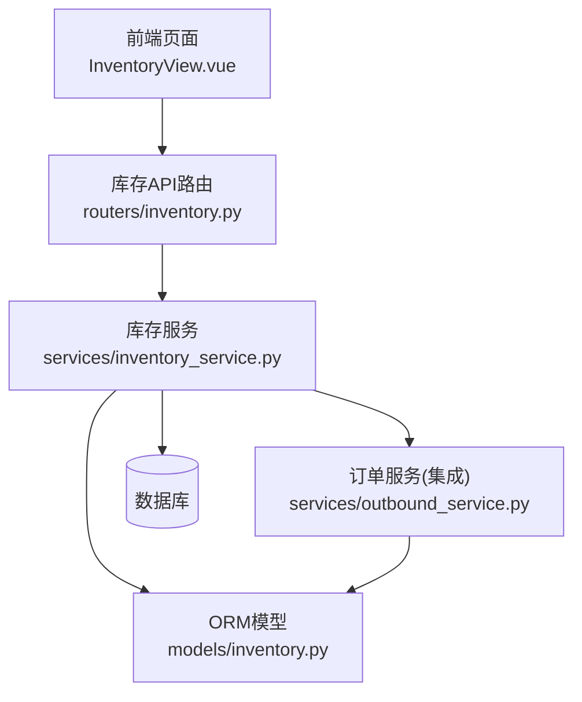
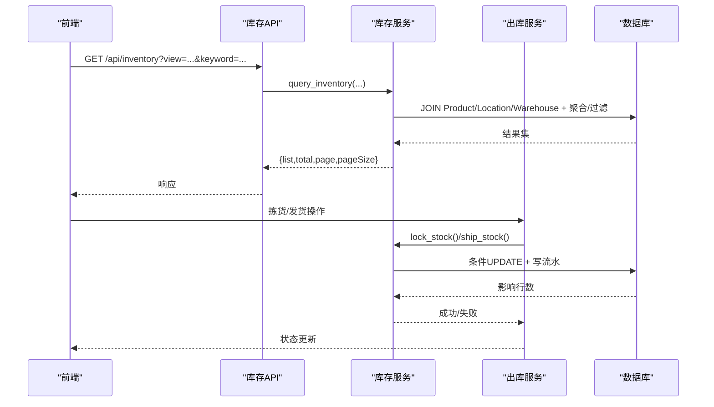
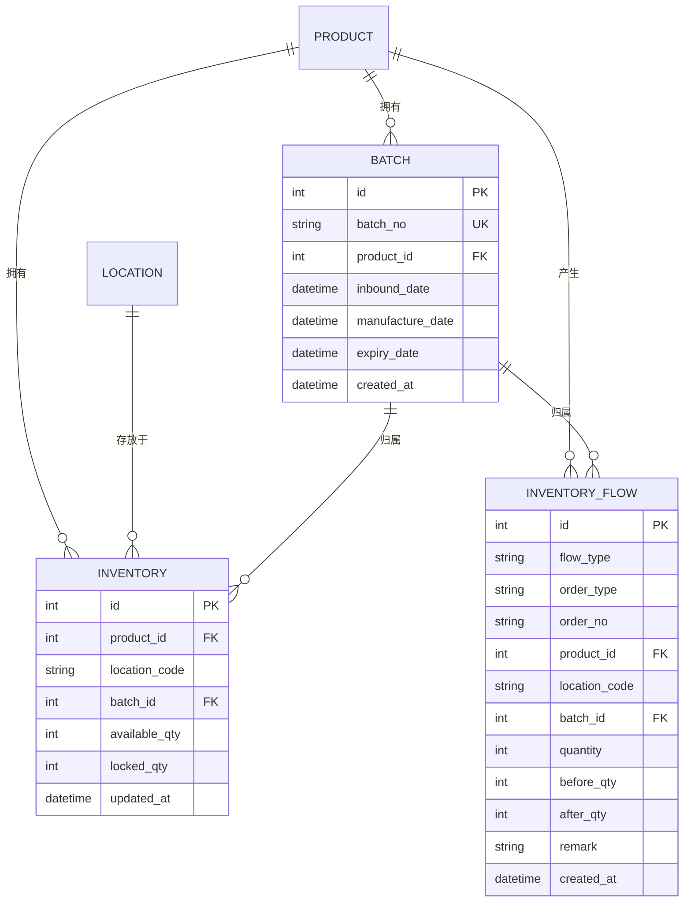
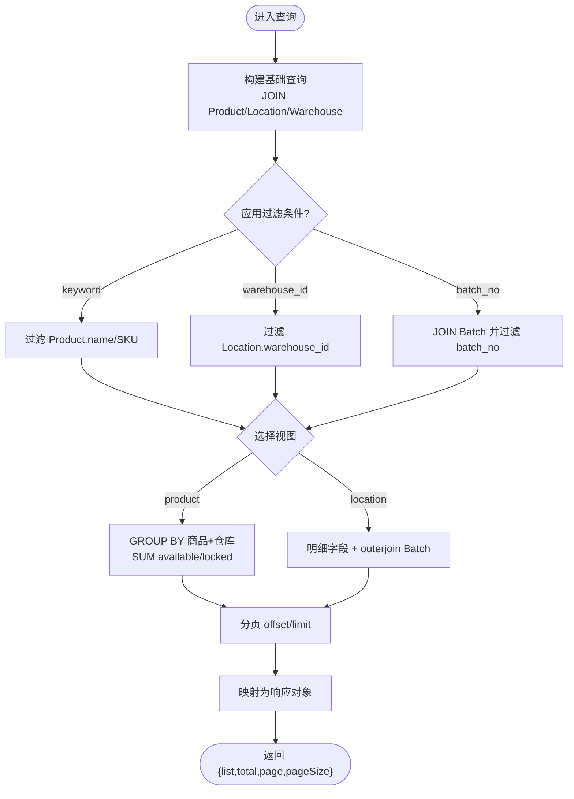
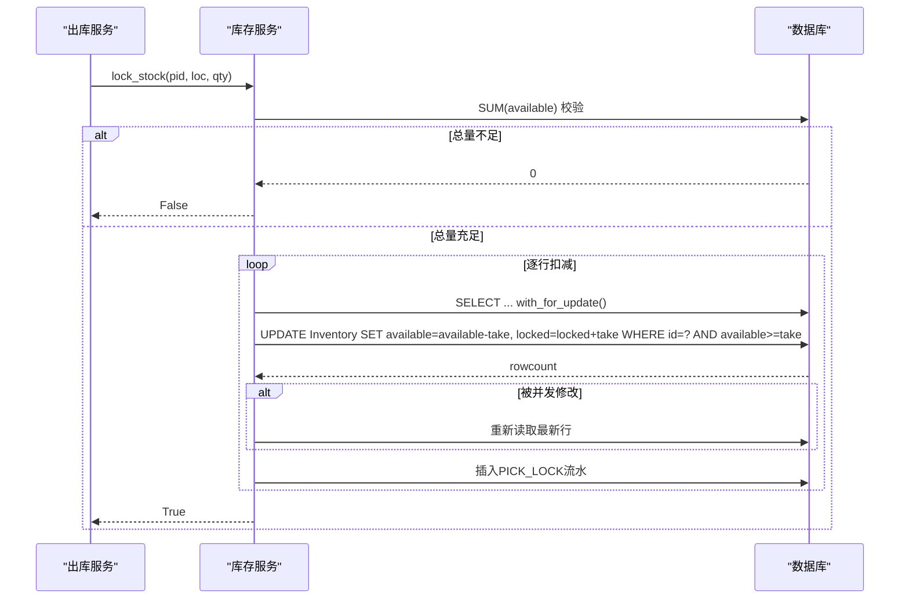
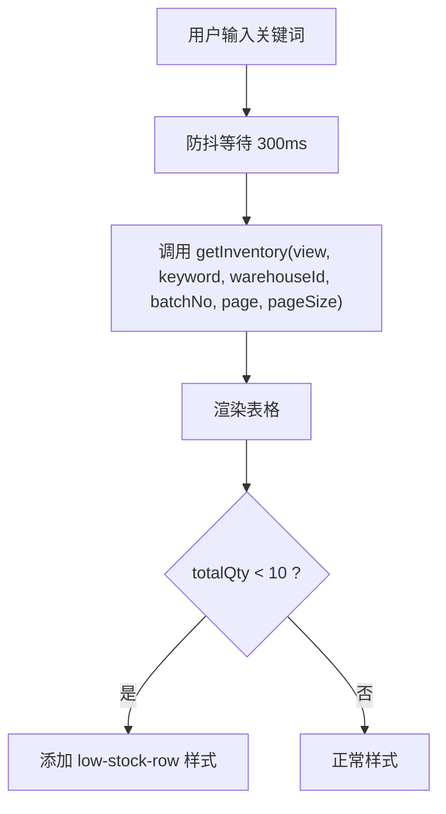
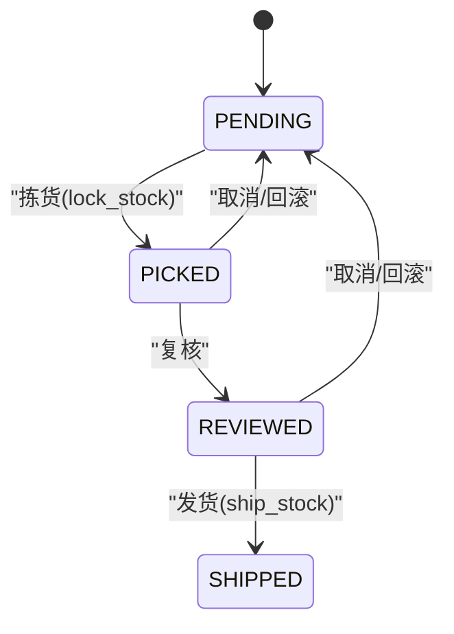
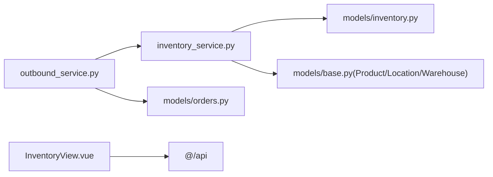

# 库存管理模块

<cite>
**本文引用的文件**
- [backend-python/app/models/inventory.py](file://backend-python/app/models/inventory.py)
- [backend-python/app/schemas/inventory.py](file://backend-python/app/schemas/inventory.py)
- [backend-python/app/services/inventory_service.py](file://backend-python/app/services/inventory_service.py)
- [backend-python/app/routers/inventory.py](file://backend-python/app/routers/inventory.py)
- [backend-python/app/services/outbound_service.py](file://backend-python/app/services/outbound_service.py)
- [backend-python/app/models/orders.py](file://backend-python/app/models/orders.py)
- [frontend-vue/src/views/InventoryView.vue](file://frontend-vue/src/views/InventoryView.vue)
- [frontend-vue/src/utils/inventory.ts](file://frontend-vue/src/utils/inventory.ts)
- [frontend-vue/src/utils/inventory.test.ts](file://frontend-vue/src/utils/inventory.test.ts)
- [backend-python/tests/test_inventory_service.py](file://backend-python/tests/test_inventory_service.py)
- [backend-python/app/common/errors.py](file://backend-python/app/common/errors.py)
</cite>

## 目录
1. [简介](#简介)
2. [项目结构](#项目结构)
3. [核心组件](#核心组件)
4. [架构总览](#架构总览)
5. [详细组件分析](#详细组件分析)
6. [依赖关系分析](#依赖关系分析)
7. [性能考量](#性能考量)
8. [故障排查指南](#故障排查指南)
9. [结论](#结论)
10. [附录](#附录)

## 简介
本模块为WMS系统的库存管理核心，围绕“可用量与锁定量分离”的库存模型，提供批次管理、库存查询（按商品汇总/按库位明细）、低库存预警、多维度过滤搜索、并发安全控制与防超卖策略。所有库存变动通过统一服务入口并强制写流水，确保全量可追溯；出库流程采用“拣货锁定→复核→发货扣减”的状态机，保证数据一致性与业务闭环。

## 项目结构
后端采用分层设计：
- 模型层：定义批次、库存行、库存流水等数据模型及索引约束
- 服务层：封装库存加减、锁定、发货、查询等核心逻辑
- 路由层：暴露库存查询、流水、批次等API
- 前端：库存视图页支持按商品汇总/按库位明细切换、多维过滤、低库存高亮

**图表来源**
- [backend-python/app/routers/inventory.py:12-61](file://backend-python/app/routers/inventory.py#L12-L61)
- [backend-python/app/services/inventory_service.py:256-437](file://backend-python/app/services/inventory_service.py#L256-L437)
- [backend-python/app/models/inventory.py:18-98](file://backend-python/app/models/inventory.py#L18-L98)
- [backend-python/app/services/outbound_service.py:102-176](file://backend-python/app/services/outbound_service.py#L102-L176)
- [frontend-vue/src/views/InventoryView.vue:36-93](file://frontend-vue/src/views/InventoryView.vue#L36-L93)

**章节来源**
- [backend-python/app/models/inventory.py:18-98](file://backend-python/app/models/inventory.py#L18-L98)
- [backend-python/app/services/inventory_service.py:1-10](file://backend-python/app/services/inventory_service.py#L1-L10)
- [backend-python/app/routers/inventory.py:1-61](file://backend-python/app/routers/inventory.py#L1-L61)
- [frontend-vue/src/views/InventoryView.vue:1-162](file://frontend-vue/src/views/InventoryView.vue#L1-L162)

## 核心组件
- 数据模型
  - 批次（Batch）：记录入库批次、生产日期、有效期等
  - 库存行（Inventory）：以(product_id, location_code, batch_id)为维度，维护available_qty与locked_qty
  - 库存流水（InventoryFlow）：记录每次库存变动的类型、单号、数量、前后值，用于审计与对账
- 服务接口
  - 增加库存（add_stock）
  - 扣减库存（deduct_stock）：跨批次FIFO扣减，并发安全
  - 拣货锁定（lock_stock）：可用转锁定，防超卖双保险
  - 发货出库（ship_stock）：扣减锁定库存
  - 查询库存（query_inventory）：product/location两种视图，支持关键词、仓库、批次过滤与分页
  - 查询流水（query_flows）：按单号/商品/库位/流水类型过滤
  - 查询批次（query_batches）：支持关键词模糊匹配
- 前端能力
  - 视图切换：按商品汇总/按库位明细
  - 多维过滤：商品名称/SKU模糊搜索、仓库下拉、批次号
  - 低库存预警：总量低于阈值高亮整行
  - 防抖搜索：输入停止300ms后发起请求

**章节来源**
- [backend-python/app/models/inventory.py:18-98](file://backend-python/app/models/inventory.py#L18-L98)
- [backend-python/app/services/inventory_service.py:75-251](file://backend-python/app/services/inventory_service.py#L75-L251)
- [backend-python/app/services/inventory_service.py:256-437](file://backend-python/app/services/inventory_service.py#L256-L437)
- [frontend-vue/src/views/InventoryView.vue:25-93](file://frontend-vue/src/views/InventoryView.vue#L25-L93)
- [frontend-vue/src/utils/inventory.ts:9-55](file://frontend-vue/src/utils/inventory.ts#L9-L55)

## 架构总览
库存模块遵循“统一入口+强制流水”的设计原则，所有变更必须通过服务层写入，并在事务中提交，保证一致性。出库流程与库存服务紧密集成，形成状态机驱动的业务闭环。

**图表来源**
- [backend-python/app/routers/inventory.py:12-61](file://backend-python/app/routers/inventory.py#L12-L61)
- [backend-python/app/services/inventory_service.py:256-437](file://backend-python/app/services/inventory_service.py#L256-L437)
- [backend-python/app/services/outbound_service.py:102-176](file://backend-python/app/services/outbound_service.py#L102-L176)

## 详细组件分析

### 数据模型与Schema
- 批次（Batch）：唯一批次号、关联商品、入库日期、可选生产/有效期
- 库存行（Inventory）：唯一约束(product_id, location_code, batch_id)，常用过滤列建索引
- 库存流水（InventoryFlow）：flow_type枚举覆盖入库、出库、拣货锁定/解锁、移库、调整等；order_no/order_type/product_id/location_code/batch_id/quantity/before_qty/after_qty/remark
- Schema响应对象：InventoryRowResponse（按库位明细）、InventoryProductViewResponse（按产品汇总）、InventoryFlowResponse（流水）

**图表来源**
- [backend-python/app/models/inventory.py:18-98](file://backend-python/app/models/inventory.py#L18-L98)
- [backend-python/app/schemas/inventory.py:7-60](file://backend-python/app/schemas/inventory.py#L7-L60)

**章节来源**
- [backend-python/app/models/inventory.py:18-98](file://backend-python/app/models/inventory.py#L18-L98)
- [backend-python/app/schemas/inventory.py:7-60](file://backend-python/app/schemas/inventory.py#L7-L60)

### 库存查询与视图切换
- 视图模式
  - product：按(商品,仓库)聚合available/locked，返回汇总行
  - location：按(商品,库位,批次)明细，含location_code与batch_no
- 过滤能力
  - keyword：商品名称/SKU模糊匹配
  - warehouse_id：仓库筛选
  - batch_no：批次号模糊匹配（仅location视图有效）
- 分页：支持page/pageSize，返回total/list

**图表来源**
- [backend-python/app/services/inventory_service.py:256-345](file://backend-python/app/services/inventory_service.py#L256-L345)
- [backend-python/app/routers/inventory.py:12-31](file://backend-python/app/routers/inventory.py#L12-L31)

**章节来源**
- [backend-python/app/services/inventory_service.py:256-345](file://backend-python/app/services/inventory_service.py#L256-L345)
- [backend-python/app/routers/inventory.py:12-31](file://backend-python/app/routers/inventory.py#L12-L31)

### 批次管理与流水追踪
- 批次创建与查询：支持按关键字（批次号或商品名/SKU）检索，返回批次详情
- 流水记录：所有库存变动均写InventoryFlow，包含before/after快照，便于对账与回溯
- 流水查询：支持按order_no、product_id、location_code、flow_type过滤，joinedload避免N+1

**章节来源**
- [backend-python/app/services/inventory_service.py:404-437](file://backend-python/app/services/inventory_service.py#L404-L437)
- [backend-python/app/services/inventory_service.py:348-401](file://backend-python/app/services/inventory_service.py#L348-L401)

### 可用量与锁定量分离机制
- 可用量（available_qty）：可被后续出库占用的库存
- 锁定量（locked_qty）：已拣货暂存但尚未发货的库存
- 转换流程：
  - 拣货锁定：available减少，locked增加，写PICK_LOCK流水
  - 发货出库：locked减少，写OUTBOUND流水
- 并发安全：
  - SUM预校验总量不足直接返回False，无副作用
  - 逐行条件UPDATE（available >= take / locked >= take），失败重读重试
  - PostgreSQL下with_for_update加行锁；SQLite忽略但仍具备条件更新保护

**图表来源**
- [backend-python/app/services/inventory_service.py:147-202](file://backend-python/app/services/inventory_service.py#L147-L202)
- [backend-python/app/services/outbound_service.py:102-133](file://backend-python/app/services/outbound_service.py#L102-L133)

**章节来源**
- [backend-python/app/services/inventory_service.py:147-202](file://backend-python/app/services/inventory_service.py#L147-L202)
- [backend-python/app/services/outbound_service.py:102-133](file://backend-python/app/services/outbound_service.py#L102-L133)

### 低库存预警与前端交互
- 阈值常量：LOW_STOCK_THRESHOLD = 10
- 判定函数：isLowStock(totalQty < threshold)
- 表格高亮：lowStockRowClass返回'low-stock-row'类名，配合CSS背景色高亮
- 防抖搜索：输入停止300ms后触发查询，降低后端压力

**图表来源**
- [frontend-vue/src/utils/inventory.ts:9-55](file://frontend-vue/src/utils/inventory.ts#L9-L55)
- [frontend-vue/src/views/InventoryView.vue:66-93](file://frontend-vue/src/views/InventoryView.vue#L66-L93)
- [frontend-vue/src/views/InventoryView.vue:117-151](file://frontend-vue/src/views/InventoryView.vue#L117-L151)

**章节来源**
- [frontend-vue/src/utils/inventory.ts:9-55](file://frontend-vue/src/utils/inventory.ts#L9-L55)
- [frontend-vue/src/views/InventoryView.vue:66-93](file://frontend-vue/src/views/InventoryView.vue#L66-L93)
- [frontend-vue/src/views/InventoryView.vue:117-151](file://frontend-vue/src/views/InventoryView.vue#L117-L151)

### 出库流程与状态机
- 状态机：PENDING → PICKED → REVIEWED → SHIPPED
- 关键步骤
  - 创建出库单：不改变库存
  - 拣货：聚合明细，调用lock_stock，库存不足抛BusinessError并回滚
  - 复核：二次核对
  - 发货：调用ship_stock扣减locked，写OUTBOUND流水
- 异常处理：BusinessError携带HTTP状态码，由全局处理器统一转换

**图表来源**
- [backend-python/app/services/outbound_service.py:16-19](file://backend-python/app/services/outbound_service.py#L16-L19)
- [backend-python/app/services/outbound_service.py:102-176](file://backend-python/app/services/outbound_service.py#L102-L176)
- [backend-python/app/common/errors.py:4-9](file://backend-python/app/common/errors.py#L4-L9)

**章节来源**
- [backend-python/app/services/outbound_service.py:16-19](file://backend-python/app/services/outbound_service.py#L16-L19)
- [backend-python/app/services/outbound_service.py:102-176](file://backend-python/app/services/outbound_service.py#L102-L176)
- [backend-python/app/common/errors.py:4-9](file://backend-python/app/common/errors.py#L4-L9)

### 并发安全与防超卖策略
- 双重保障
  - 总量预校验：SUM(available)/SUM(locked)不足直接返回False，避免无效写入
  - 条件更新：WHERE available >= take / locked >= take，防止陈旧读覆盖
- 行级锁：PostgreSQL下with_for_update加锁；SQLite忽略但仍具备条件更新保护
- 事务边界：调用方负责事务提交，中间写入随上层回滚撤销

**章节来源**
- [backend-python/app/services/inventory_service.py:91-144](file://backend-python/app/services/inventory_service.py#L91-L144)
- [backend-python/app/services/inventory_service.py:147-202](file://backend-python/app/services/inventory_service.py#L147-L202)
- [backend-python/app/services/inventory_service.py:205-251](file://backend-python/app/services/inventory_service.py#L205-L251)

### 与其他模块的集成关系
- 与出库模块：outbound_service在拣货/发货阶段调用inventory_service，保证状态机与库存一致
- 与订单模型：orders.py定义OutboundOrder/PickingOrder/Wave等实体，支撑波次与拣货任务
- 与前端：InventoryView通过API获取库存数据，实现视图切换与过滤

**章节来源**
- [backend-python/app/services/outbound_service.py:102-176](file://backend-python/app/services/outbound_service.py#L102-L176)
- [backend-python/app/models/orders.py:50-138](file://backend-python/app/models/orders.py#L50-L138)
- [frontend-vue/src/views/InventoryView.vue:36-93](file://frontend-vue/src/views/InventoryView.vue#L36-L93)

## 依赖关系分析
- 服务层依赖
  - inventory_service依赖models（Batch/Inventory/InventoryFlow/Product/Location/Warehouse）
  - outbound_service依赖inventory_service与orders模型
- 前端依赖
  - InventoryView依赖@/api提供的getInventory等方法
  - utils/inventory提供纯函数用于低库存判定与筛选

**图表来源**
- [backend-python/app/services/inventory_service.py:11-15](file://backend-python/app/services/inventory_service.py#L11-L15)
- [backend-python/app/services/outbound_service.py:9-14](file://backend-python/app/services/outbound_service.py#L9-L14)
- [frontend-vue/src/views/InventoryView.vue:12-14](file://frontend-vue/src/views/InventoryView.vue#L12-L14)

**章节来源**
- [backend-python/app/services/inventory_service.py:11-15](file://backend-python/app/services/inventory_service.py#L11-L15)
- [backend-python/app/services/outbound_service.py:9-14](file://backend-python/app/services/outbound_service.py#L9-L14)
- [frontend-vue/src/views/InventoryView.vue:12-14](file://frontend-vue/src/views/InventoryView.vue#L12-L14)

## 性能考量
- 查询优化
  - 使用JOIN与聚合减少N+1查询
  - 针对常用过滤列建立索引（location_code、product_id、created_at等）
- 并发优化
  - 条件UPDATE避免重复竞争
  - PostgreSQL下with_for_update提升一致性
- 前端优化
  - 防抖搜索减少请求频率
  - 分页加载大数据集

[本节为通用指导，无需具体文件引用]

## 故障排查指南
- 常见问题
  - 库存不足：lock_stock/deduct_stock返回False，检查SUM校验与逐行条件更新
  - 并发冲突：rowcount为0时重读最新行，确认是否被其他事务修改
  - 流水缺失：确认所有库存变动路径均调用_add_flow
- 异常处理
  - BusinessError携带status，由全局处理器统一转为HTTP响应
  - 出库流程中库存不足抛出BusinessError并回滚事务

**章节来源**
- [backend-python/app/services/inventory_service.py:91-144](file://backend-python/app/services/inventory_service.py#L91-L144)
- [backend-python/app/services/outbound_service.py:120-128](file://backend-python/app/services/outbound_service.py#L120-L128)
- [backend-python/app/common/errors.py:4-9](file://backend-python/app/common/errors.py#L4-L9)

## 结论
本库存管理模块通过“可用量与锁定量分离”、“统一入口+强制流水”、“条件更新+行锁”等机制，实现了高并发下的库存一致性与防超卖；结合多维度查询与低库存预警，满足仓储运营的实际需求。与出库模块的状态机协作，确保了从拣货到发货的全链路可追溯与可靠。

[本节为总结性内容，无需具体文件引用]

## 附录
- 单元测试要点
  - add_stock：新建/累加、写流水
  - deduct_stock：跨批次FIFO、不足返回False且无副作用
  - lock_stock/ship_stock：可用转锁定、锁定扣减、流水类型完整
  - 查询：product/location视图、过滤与分页
  - 前端工具：isLowStock、totalOf、filterByKeyword、filterByWarehouse、lowStockRowClass

**章节来源**
- [backend-python/tests/test_inventory_service.py:31-171](file://backend-python/tests/test_inventory_service.py#L31-L171)
- [frontend-vue/src/utils/inventory.test.ts:29-115](file://frontend-vue/src/utils/inventory.test.ts#L29-L115)