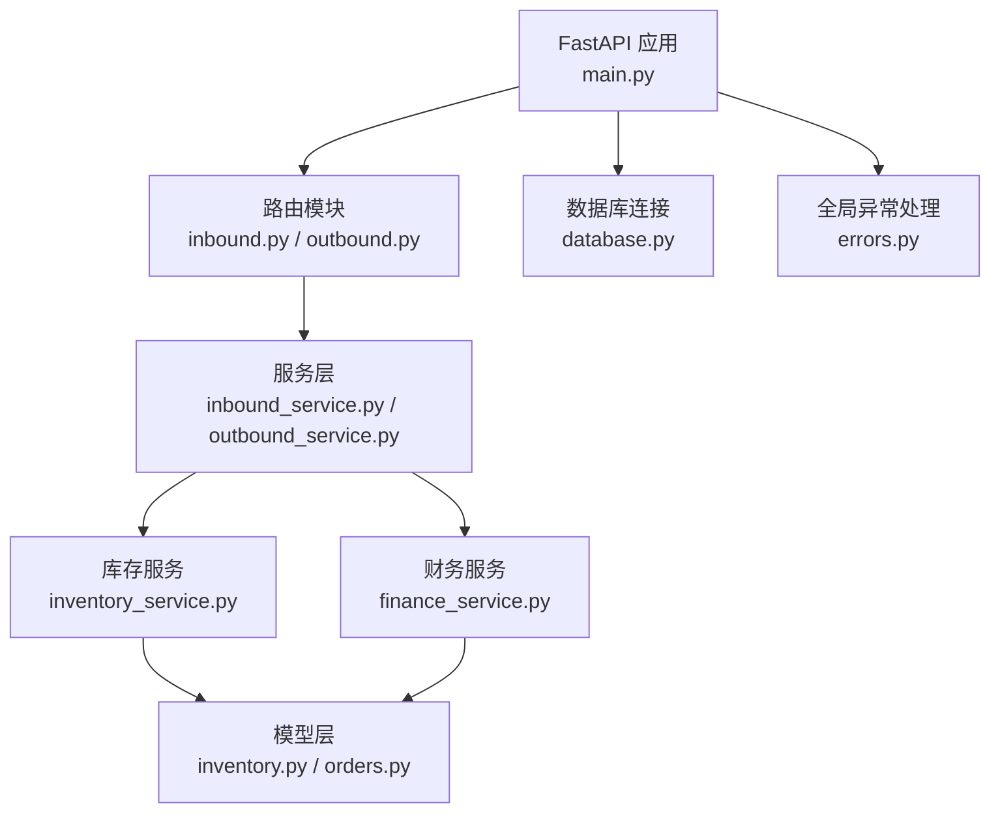
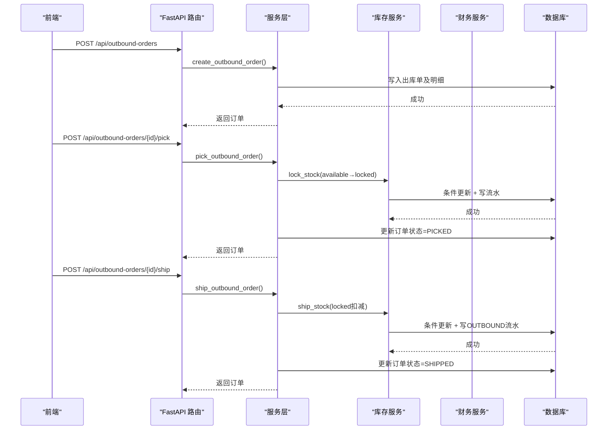
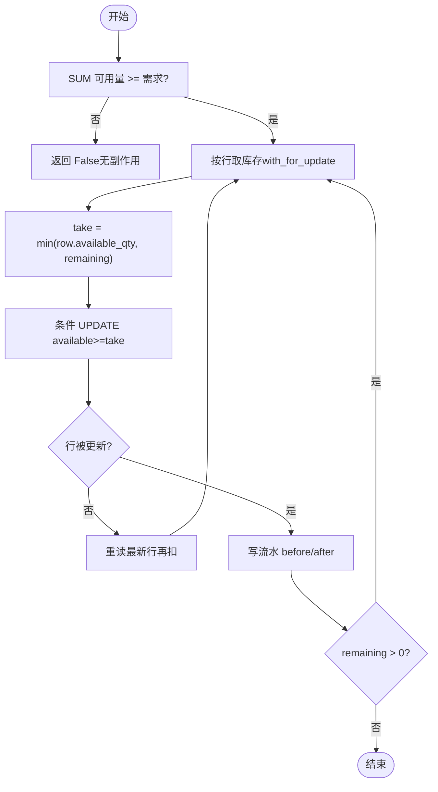
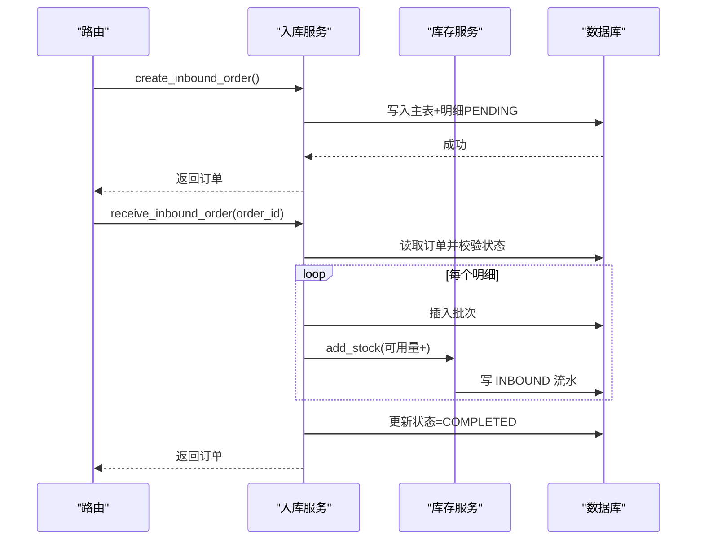
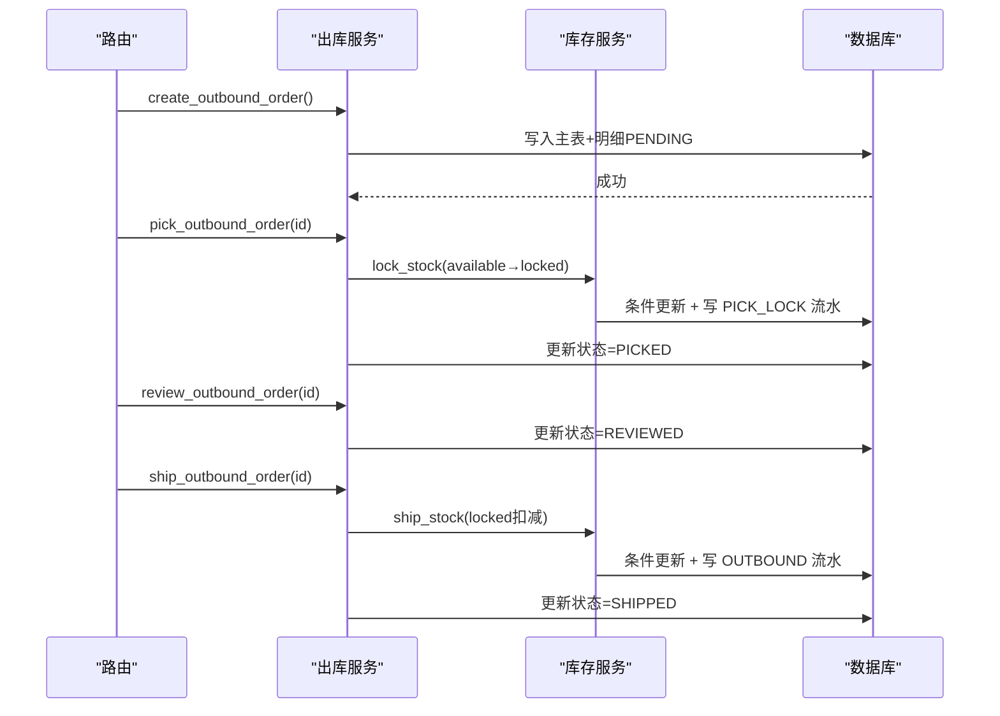
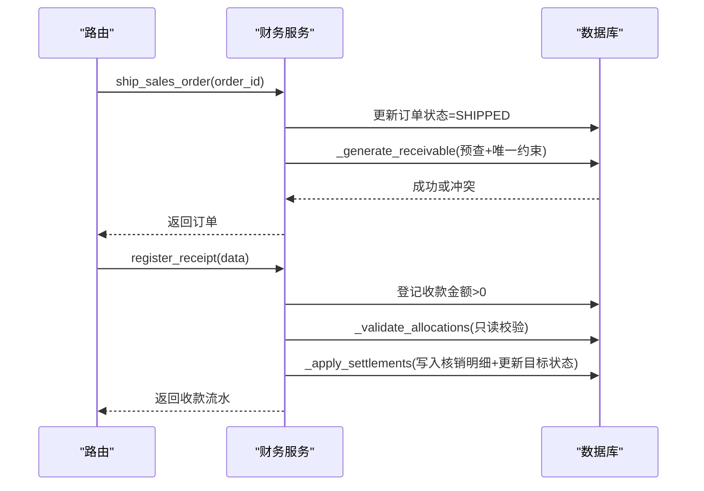
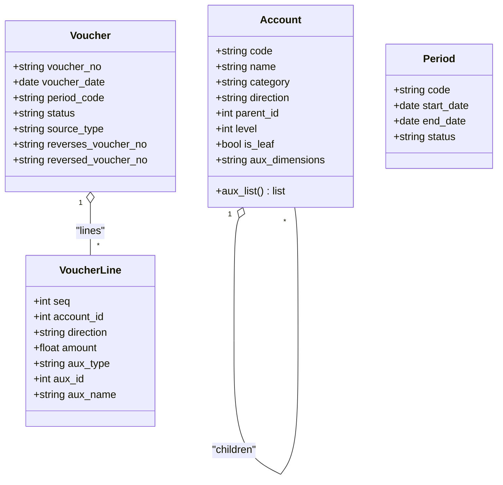
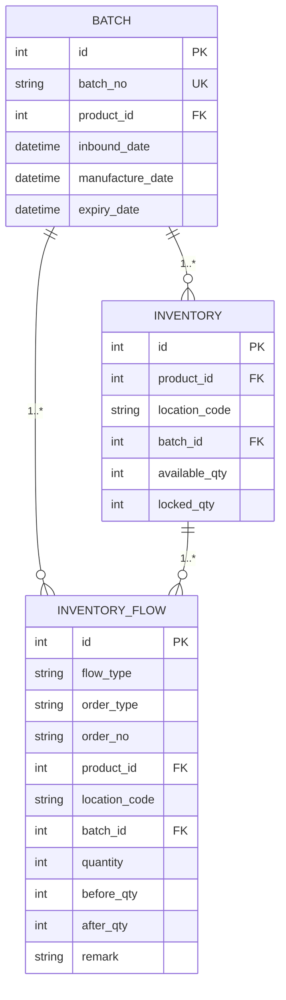
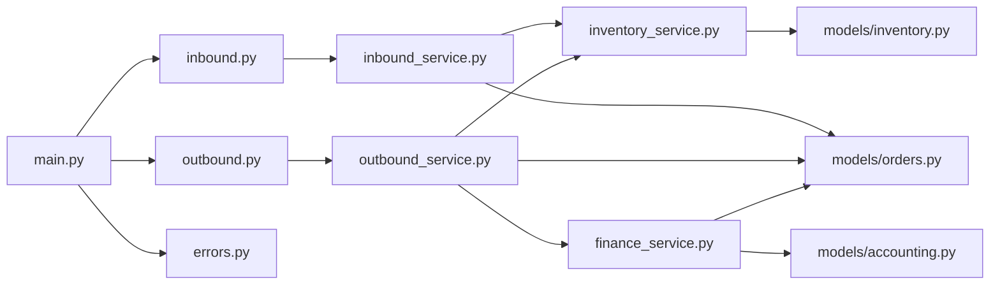

# 核心功能模块

<cite>
**本文引用的文件**
- [backend-python/app/main.py](file://backend-python/app/main.py)
- [backend-python/app/database.py](file://backend-python/app/database.py)
- [backend-python/app/models/inventory.py](file://backend-python/app/models/inventory.py)
- [backend-python/app/models/orders.py](file://backend-python/app/models/orders.py)
- [backend-python/app/models/accounting.py](file://backend-python/app/models/accounting.py)
- [backend-python/app/services/inventory_service.py](file://backend-python/app/services/inventory_service.py)
- [backend-python/app/services/inbound_service.py](file://backend-python/app/services/inbound_service.py)
- [backend-python/app/services/outbound_service.py](file://backend-python/app/services/outbound_service.py)
- [backend-python/app/services/finance_service.py](file://backend-python/app/services/finance_service.py)
- [backend-python/app/routers/inbound.py](file://backend-python/app/routers/inbound.py)
- [backend-python/app/routers/outbound.py](file://backend-python/app/routers/outbound.py)
- [backend-python/app/common/errors.py](file://backend-python/app/common/errors.py)
- [README.md](file://README.md)
- [docs/PRD.md](file://docs/PRD.md)
</cite>

## 目录
1. [简介](#简介)
2. [项目结构](#项目结构)
3. [核心组件](#核心组件)
4. [架构总览](#架构总览)
5. [详细组件分析](#详细组件分析)
6. [依赖关系分析](#依赖关系分析)
7. [性能与一致性](#性能与一致性)
8. [故障排查指南](#故障排查指南)
9. [结论](#结论)
10. [附录：接口与数据模型速查](#附录接口与数据模型速查)

## 简介
本系统为“进销存 + 业财一体”的中后台，后端采用 FastAPI + SQLAlchemy，前端 Vue 3。库存底座对标领星跨境仓储系统，支持批次、可用量/锁定量分离、全量流水；业务层新增销售订单与财务应收，打通“销售订单 → 发货生成应收 → 收款核销 → 账龄/驾驶舱”的收入侧闭环。文档聚焦核心业务模块的实现细节、调用关系、接口与业务模型，重点说明状态机流转、数据一致性与用户体验设计。

**章节来源**
- [README.md:1-115](file://README.md#L1-L115)
- [docs/PRD.md:13-47](file://docs/PRD.md#L13-L47)

## 项目结构
后端采用分层组织：
- 路由层（routers）：HTTP 接口定义，鉴权依赖，参数校验（Pydantic schemas），调用服务层
- 服务层（services）：业务编排、状态机、事务边界、并发控制、幂等性
- 模型层（models）：SQLAlchemy ORM 实体，表结构与关系
- 基础设施（database、common）：数据库连接、会话管理、全局异常处理

**图表来源**
- [backend-python/app/main.py:16-69](file://backend-python/app/main.py#L16-L69)
- [backend-python/app/routers/inbound.py:1-45](file://backend-python/app/routers/inbound.py#L1-L45)
- [backend-python/app/routers/outbound.py:1-61](file://backend-python/app/routers/outbound.py#L1-L61)
- [backend-python/app/services/inbound_service.py:1-150](file://backend-python/app/services/inbound_service.py#L1-L150)
- [backend-python/app/services/outbound_service.py:1-196](file://backend-python/app/services/outbound_service.py#L1-L196)
- [backend-python/app/services/inventory_service.py:1-437](file://backend-python/app/services/inventory_service.py#L1-L437)
- [backend-python/app/services/finance_service.py:1-607](file://backend-python/app/services/finance_service.py#L1-L607)
- [backend-python/app/models/inventory.py:1-98](file://backend-python/app/models/inventory.py#L1-L98)
- [backend-python/app/models/orders.py:1-300](file://backend-python/app/models/orders.py#L1-L300)
- [backend-python/app/database.py:1-38](file://backend-python/app/database.py#L1-L38)
- [backend-python/app/common/errors.py:1-9](file://backend-python/app/common/errors.py#L1-L9)

**章节来源**
- [backend-python/app/main.py:16-69](file://backend-python/app/main.py#L16-L69)
- [backend-python/app/database.py:1-38](file://backend-python/app/database.py#L1-L38)

## 核心组件
- 库存服务：统一入口，所有库存变动必须写流水；支持跨批次扣减、可用量/锁定量分离、防超卖
- 入库服务：创建入库单（PENDING）→ 收货上架（COMPLETED），生成批次并累加库存
- 出库服务：创建出库单（PENDING）→ 拣货锁定（PICKED）→ 复核（REVIEWED）→ 发货扣减（SHIPPED）
- 财务服务：销售订单生命周期、发货自动生成应收、收款核销（部分核销/预收）、账龄与经营驾驶舱
- 会计内核：科目表、凭证、期间结账（预留扩展）

**章节来源**
- [backend-python/app/services/inventory_service.py:1-437](file://backend-python/app/services/inventory_service.py#L1-L437)
- [backend-python/app/services/inbound_service.py:1-150](file://backend-python/app/services/inbound_service.py#L1-L150)
- [backend-python/app/services/outbound_service.py:1-196](file://backend-python/app/services/outbound_service.py#L1-L196)
- [backend-python/app/services/finance_service.py:1-607](file://backend-python/app/services/finance_service.py#L1-L607)
- [backend-python/app/models/accounting.py:1-159](file://backend-python/app/models/accounting.py#L1-L159)

## 架构总览
系统通过 FastAPI 暴露 REST API，路由层负责鉴权与参数校验，服务层实现业务逻辑与事务控制，模型层映射数据库表结构。库存与财务在关键路径上共享同一数据库事务，确保业务与财务的一致性。

**图表来源**
- [backend-python/app/routers/outbound.py:13-42](file://backend-python/app/routers/outbound.py#L13-L42)
- [backend-python/app/services/outbound_service.py:102-176](file://backend-python/app/services/outbound_service.py#L102-L176)
- [backend-python/app/services/inventory_service.py:147-251](file://backend-python/app/services/inventory_service.py#L147-L251)

**章节来源**
- [backend-python/app/routers/outbound.py:13-42](file://backend-python/app/routers/outbound.py#L13-L42)
- [backend-python/app/services/outbound_service.py:102-176](file://backend-python/app/services/outbound_service.py#L102-L176)
- [backend-python/app/services/inventory_service.py:147-251](file://backend-python/app/services/inventory_service.py#L147-L251)

## 详细组件分析

### 库存服务（inventory_service）
- 设计原则：所有库存变动必须通过统一入口，强制写流水；维度为 (product, location, batch)，可用量与锁定量分离；扣减支持跨批次（先扣早期批次）；lock/ship 为逐行原子操作防止并发超卖
- 关键方法：
  - add_stock：增加可用量（入库/移库入/盘盈）
  - deduct_stock：扣减可用量（跨批次，不足返回 False）
  - lock_stock：拣货锁定（available→locked，防超卖双保险）
  - ship_stock：发货扣减（locked→0，写 OUTBOUND 流水）
  - query_inventory/query_flows/query_batches：查询库存、流水、批次（分页、过滤、joinedload 避免 N+1）

**图表来源**
- [backend-python/app/services/inventory_service.py:91-144](file://backend-python/app/services/inventory_service.py#L91-L144)
- [backend-python/app/services/inventory_service.py:147-202](file://backend-python/app/services/inventory_service.py#L147-L202)
- [backend-python/app/services/inventory_service.py:205-251](file://backend-python/app/services/inventory_service.py#L205-L251)

**章节来源**
- [backend-python/app/services/inventory_service.py:1-437](file://backend-python/app/services/inventory_service.py#L1-L437)

### 入库服务（inbound_service）
- 状态机：PENDING → COMPLETED
- 流程：创建入库单不改变库存；收货时生成批次（每行一个批次号），累加对应库位可用量，写 INBOUND 流水；整单事务内完成，失败回滚

**图表来源**
- [backend-python/app/routers/inbound.py:13-26](file://backend-python/app/routers/inbound.py#L13-L26)
- [backend-python/app/services/inbound_service.py:38-129](file://backend-python/app/services/inbound_service.py#L38-L129)
- [backend-python/app/services/inventory_service.py:75-88](file://backend-python/app/services/inventory_service.py#L75-L88)

**章节来源**
- [backend-python/app/routers/inbound.py:13-26](file://backend-python/app/routers/inbound.py#L13-L26)
- [backend-python/app/services/inbound_service.py:38-129](file://backend-python/app/services/inbound_service.py#L38-L129)

### 出库服务（outbound_service）
- 状态机：PENDING → PICKED → REVIEWED → SHIPPED
- 流程：创建出库单不改变库存；拣货将可用量转为锁定量（防超卖）；复核为发货前置；发货扣减锁定量并写 OUTBOUND 流水；任一环节失败整体回滚

**图表来源**
- [backend-python/app/routers/outbound.py:13-42](file://backend-python/app/routers/outbound.py#L13-L42)
- [backend-python/app/services/outbound_service.py:42-176](file://backend-python/app/services/outbound_service.py#L42-L176)
- [backend-python/app/services/inventory_service.py:147-251](file://backend-python/app/services/inventory_service.py#L147-L251)

**章节来源**
- [backend-python/app/routers/outbound.py:13-42](file://backend-python/app/routers/outbound.py#L13-L42)
- [backend-python/app/services/outbound_service.py:42-176](file://backend-python/app/services/outbound_service.py#L42-L176)

### 财务服务（finance_service）
- 销售订单：草稿 → 已确认 → 已发货 → 已完成/已作废；金额=Σ(数量×单价)
- 发货即入账：在同一事务内生成应收（幂等：预查 + 唯一约束 + IntegrityError 兜底），到期日=发货日+账期
- 收款核销：支持部分核销与多笔核销；收款可大于已核销金额，差额为未核销余额（预收）
- 账龄与驾驶舱：以到期日为基准分段（未到期/逾期1-30/31-60/60+），提供总额、已回款、未回款、逾期、TOP欠款、趋势

**图表来源**
- [backend-python/app/services/finance_service.py:246-268](file://backend-python/app/services/finance_service.py#L246-L268)
- [backend-python/app/services/finance_service.py:295-336](file://backend-python/app/services/finance_service.py#L295-L336)
- [backend-python/app/services/finance_service.py:411-439](file://backend-python/app/services/finance_service.py#L411-L439)

**章节来源**
- [backend-python/app/services/finance_service.py:118-268](file://backend-python/app/services/finance_service.py#L118-L268)
- [backend-python/app/services/finance_service.py:295-439](file://backend-python/app/services/finance_service.py#L295-L439)

### 会计内核（accounting）
- 科目表（Account）：树状结构，仅明细科目可挂分录，支持辅助核算维度
- 凭证（Voucher）：状态机 DRAFT → POSTED → REVERSED，过账后不可改删，更正走红字冲销
- 期间（Period）：自然月，OPEN/CLOSED，关闭期间拒绝凭证写入
- 凭证分录（VoucherLine）：借/贷方向，金额允许为负（红字），可挂辅助核算维度

**图表来源**
- [backend-python/app/models/accounting.py:63-159](file://backend-python/app/models/accounting.py#L63-L159)

**章节来源**
- [backend-python/app/models/accounting.py:1-159](file://backend-python/app/models/accounting.py#L1-L159)

### 业务模型（orders & inventory）
- 入库单/出库单/波次/拣货单/退货单/移库单/调整单/盘点单：均定义状态机与明细关系
- 库存：批次（Batch）、库存行（Inventory，可用量/锁定量分离）、库存流水（InventoryFlow，全量可追溯）

**图表来源**
- [backend-python/app/models/inventory.py:18-98](file://backend-python/app/models/inventory.py#L18-L98)
- [backend-python/app/models/orders.py:17-300](file://backend-python/app/models/orders.py#L17-L300)

**章节来源**
- [backend-python/app/models/inventory.py:1-98](file://backend-python/app/models/inventory.py#L1-L98)
- [backend-python/app/models/orders.py:1-300](file://backend-python/app/models/orders.py#L1-L300)

## 依赖关系分析
- 路由层依赖服务层进行业务编排，服务层依赖模型层进行数据持久化
- 库存服务是核心枢纽，入库/出库/调拨/盘点均通过其统一入口保证一致性与可追溯
- 财务服务与库存服务在发货路径上共享事务，确保业务与财务同步
- 全局异常处理器将 BusinessError 转换为统一 JSON 响应

**图表来源**
- [backend-python/app/routers/inbound.py:1-45](file://backend-python/app/routers/inbound.py#L1-L45)
- [backend-python/app/routers/outbound.py:1-61](file://backend-python/app/routers/outbound.py#L1-L61)
- [backend-python/app/services/inbound_service.py:1-150](file://backend-python/app/services/inbound_service.py#L1-L150)
- [backend-python/app/services/outbound_service.py:1-196](file://backend-python/app/services/outbound_service.py#L1-L196)
- [backend-python/app/services/inventory_service.py:1-437](file://backend-python/app/services/inventory_service.py#L1-L437)
- [backend-python/app/services/finance_service.py:1-607](file://backend-python/app/services/finance_service.py#L1-L607)
- [backend-python/app/models/inventory.py:1-98](file://backend-python/app/models/inventory.py#L1-L98)
- [backend-python/app/models/orders.py:1-300](file://backend-python/app/models/orders.py#L1-L300)
- [backend-python/app/models/accounting.py:1-159](file://backend-python/app/models/accounting.py#L1-L159)
- [backend-python/app/common/errors.py:1-9](file://backend-python/app/common/errors.py#L1-L9)

**章节来源**
- [backend-python/app/main.py:53-69](file://backend-python/app/main.py#L53-L69)
- [backend-python/app/common/errors.py:1-9](file://backend-python/app/common/errors.py#L1-L9)

## 性能与一致性
- 并发安全（防超卖）：
  - 行级 SELECT ... FOR UPDATE（PostgreSQL 生效，SQLite 忽略）
  - 条件 UPDATE（WHERE available_qty >= take）+ 失败重读重试
  - 先 SUM 校验总量，不足直接返回 False 无副作用
  - 整单事务：任一明细失败 → 整单 rollback，不留半成品
- 查询优化：
  - joinedload 一次加载关联对象，避免 N+1
  - 常用过滤列建索引（如 location_code、product_id、created_at）
- 幂等性：
  - 应收生成三层保护：服务层预查 + DB 唯一约束 + IntegrityError 兜底
- 数据一致性：
  - 业务确认与凭证生成原子（同事务整单回滚）
  - 事件幂等；锁账拒写；关键操作留痕

**章节来源**
- [README.md:58-63](file://README.md#L58-L63)
- [backend-python/app/services/inventory_service.py:91-251](file://backend-python/app/services/inventory_service.py#L91-L251)
- [backend-python/app/services/finance_service.py:295-336](file://backend-python/app/services/finance_service.py#L295-L336)

## 故障排查指南
- 常见错误：
  - 商品/库位不存在：创建订单时报 404
  - 库存不足：拣货/发货时报 409，提示具体商品与库位
  - 重复操作：重复收货/重复发货抛出业务异常
  - 单号冲突：重试 5 次仍失败则报 409
- 排查步骤：
  - 检查订单状态是否符合当前操作要求
  - 查看库存流水（inventory_flows）定位变动前/后数量
  - 核对批次信息（batches）与库位（locations）是否存在
  - 使用健康探针 /api/health 验证后端可用性
- 全局异常处理：
  - BusinessError 携带 HTTP 状态码，由 main.py 中的异常处理器统一转为 JSON 响应

**章节来源**
- [backend-python/app/services/inbound_service.py:38-129](file://backend-python/app/services/inbound_service.py#L38-L129)
- [backend-python/app/services/outbound_service.py:42-176](file://backend-python/app/services/outbound_service.py#L42-L176)
- [backend-python/app/common/errors.py:1-9](file://backend-python/app/common/errors.py#L1-L9)
- [backend-python/app/main.py:35-41](file://backend-python/app/main.py#L35-L41)
- [backend-python/app/main.py:77-84](file://backend-python/app/main.py#L77-L84)

## 结论
本系统通过清晰的分层架构与严格的状态机设计，实现了库存与财务的业财一体化。库存服务作为核心枢纽，确保所有变动可追溯且并发安全；财务服务在发货路径上生成应收并支持核销与账龄分析。整体设计兼顾了初学者易理解与高级开发者所需的技术深度，适合中小企业的私有化部署与快速迭代。

[无需来源，因为本节为总结性内容]

## 附录：接口与数据模型速查

### 入库单接口
- POST /api/inbound-orders：创建入库单（PENDING，库存未变化）
- POST /api/inbound-orders/{order_id}/receive：收货上架（PENDING → COMPLETED，累加库存 + 生成批次 + 写流水）
- GET /api/inbound-orders：列表（支持状态过滤、分页）
- GET /api/inbound-orders/{order_id}：详情

**章节来源**
- [backend-python/app/routers/inbound.py:13-45](file://backend-python/app/routers/inbound.py#L13-L45)

### 出库单接口
- POST /api/outbound-orders：创建出库单（PENDING，库存未变化）
- POST /api/outbound-orders/{order_id}/pick：拣货（PENDING → PICKED，锁定库存）
- POST /api/outbound-orders/{order_id}/review：复核（PICKED → REVIEWED）
- POST /api/outbound-orders/{order_id}/ship：发货（REVIEWED → SHIPPED，扣减锁定库存）
- GET /api/outbound-orders：列表（支持状态过滤、分页）
- GET /api/outbound-orders/{order_id}：详情

**章节来源**
- [backend-python/app/routers/outbound.py:13-61](file://backend-python/app/routers/outbound.py#L13-L61)

### 数据模型要点
- 库存：批次（batches）、库存行（inventory，可用量/锁定量分离）、库存流水（inventory_flows，全量可追溯）
- 单据：入库单/出库单/波次/拣货单/退货单/移库单/调整单/盘点单，均定义状态机与明细关系
- 财务：销售订单、应收/应付流水、收款/付款流水、核销记录；会计内核（科目表、凭证、期间）

**章节来源**
- [backend-python/app/models/inventory.py:18-98](file://backend-python/app/models/inventory.py#L18-L98)
- [backend-python/app/models/orders.py:17-300](file://backend-python/app/models/orders.py#L17-L300)
- [backend-python/app/models/accounting.py:63-159](file://backend-python/app/models/accounting.py#L63-L159)