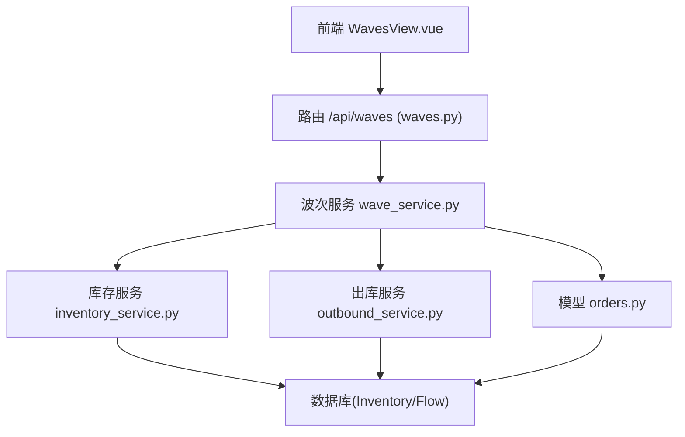
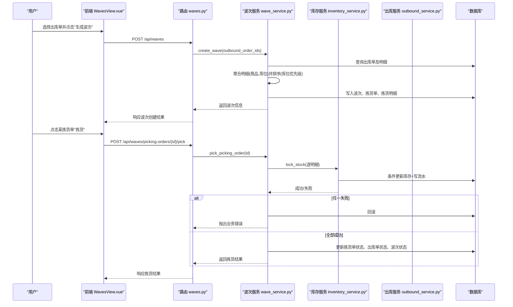
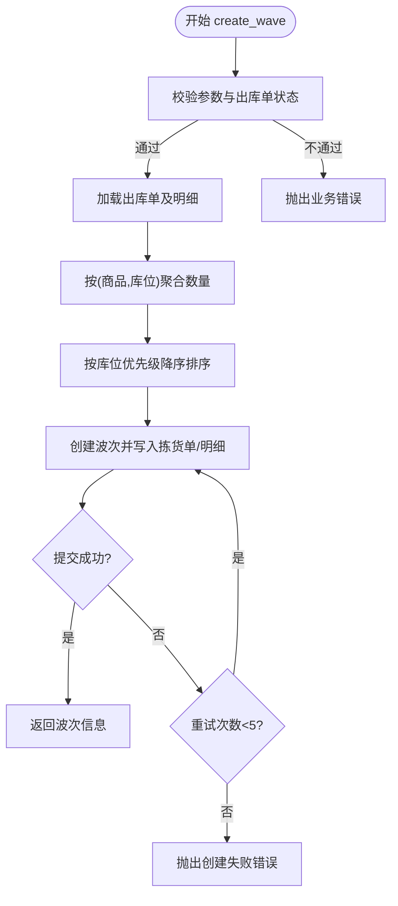
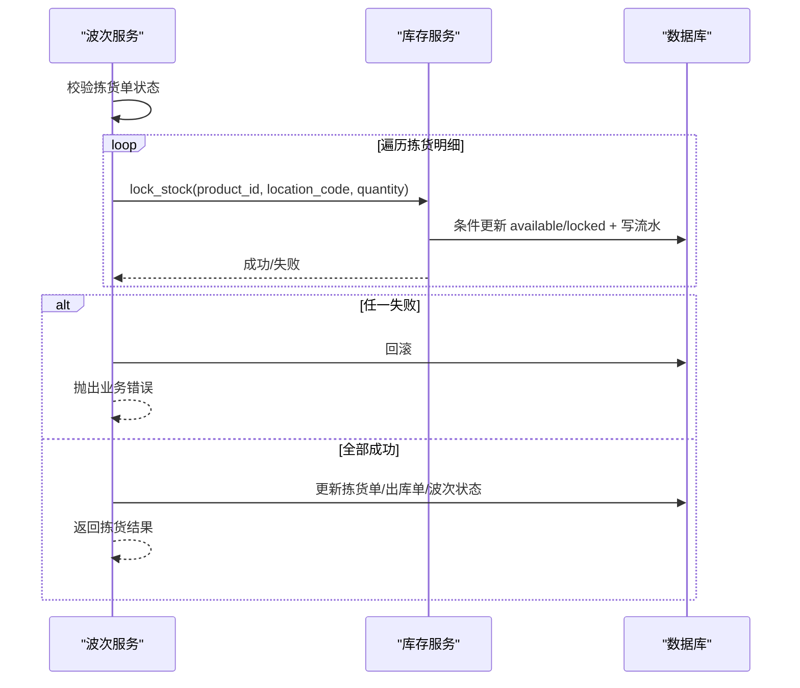
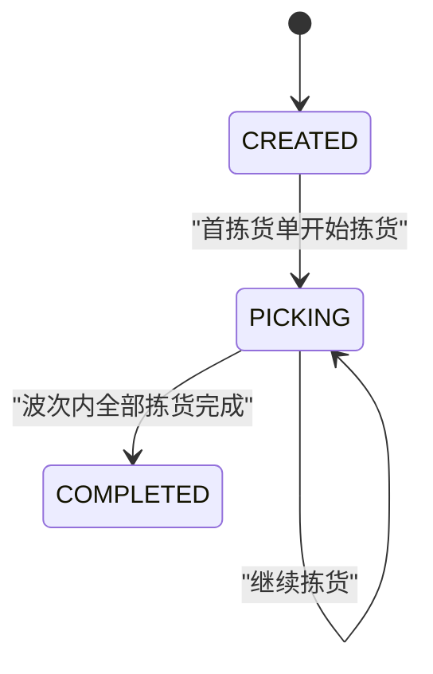
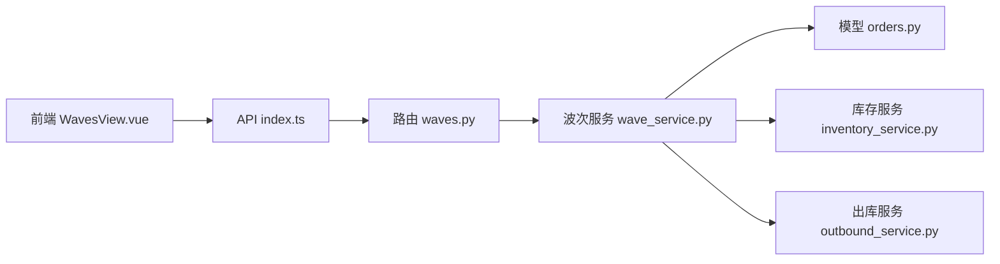

# 波次拣货模块

<cite>
**本文引用的文件**
- [waves.py](file://backend-python/app/routers/waves.py)
- [wave_service.py](file://backend-python/app/services/wave_service.py)
- [orders.py](file://backend-python/app/models/orders.py)
- [inventory_service.py](file://backend-python/app/services/inventory_service.py)
- [outbound_service.py](file://backend-python/app/services/outbound_service.py)
- [WavesView.vue](file://frontend-vue/src/views/WavesView.vue)
- [index.ts](file://frontend-vue/src/api/index.ts)
- [test_wave_service.py](file://backend-python/tests/test_wave_service.py)
</cite>

## 目录
1. [简介](#简介)
2. [项目结构](#项目结构)
3. [核心组件](#核心组件)
4. [架构总览](#架构总览)
5. [详细组件分析](#详细组件分析)
6. [依赖关系分析](#依赖关系分析)
7. [性能与并发控制](#性能与并发控制)
8. [故障排查指南](#故障排查指南)
9. [结论](#结论)
10. [附录：API与数据模型速查](#附录api与数据模型速查)

## 简介
本模块实现WMS系统的“波次拣货”能力，围绕以下目标展开：
- 波次创建：将多张待拣货的出库单聚合为一张波次，逐单生成拣货单，并按库位优先级排序以优化拣货路径。
- 拣货任务分配与执行：对拣货单逐项锁定库存（防超卖），驱动出库单状态推进，并在波次内全部完成时自动结束波次。
- 策略与算法：基于库位优先级的拣货路径优化、按(商品,库位)聚合明细、状态机驱动的波次/拣货单流转。
- 集成点：与出库模块、库存模块紧密协作；前端提供可视化操作界面。
- 并发与一致性：通过条件更新、行锁、事务回滚保证并发安全与数据一致性。

## 项目结构
后端采用FastAPI路由层 + 服务层 + 领域模型的三层架构；前端使用Vue页面调用统一API。关键文件职责如下：
- 路由层：暴露波次相关REST接口（创建波次、查询波次/拣货单、执行拣货）。
- 服务层：封装波次创建、拣货执行、列表查询等核心业务逻辑。
- 模型层：定义波次、拣货单、出库单及其明细的数据结构与关系。
- 库存服务：提供统一的库存锁定、扣减、流水记录能力。
- 出库服务：提供出库单生命周期管理（拣货、复核、发货）。
- 前端：提供波次创建、拣货操作的交互界面与类型定义。

图表来源
- [waves.py:1-55](file://backend-python/app/routers/waves.py#L1-L55)
- [wave_service.py:1-238](file://backend-python/app/services/wave_service.py#L1-L238)
- [inventory_service.py:1-437](file://backend-python/app/services/inventory_service.py#L1-L437)
- [outbound_service.py:1-196](file://backend-python/app/services/outbound_service.py#L1-L196)
- [orders.py:1-300](file://backend-python/app/models/orders.py#L1-L300)

章节来源
- [waves.py:1-55](file://backend-python/app/routers/waves.py#L1-L55)
- [wave_service.py:1-238](file://backend-python/app/services/wave_service.py#L1-L238)
- [orders.py:1-300](file://backend-python/app/models/orders.py#L1-L300)
- [inventory_service.py:1-437](file://backend-python/app/services/inventory_service.py#L1-L437)
- [outbound_service.py:1-196](file://backend-python/app/services/outbound_service.py#L1-L196)
- [WavesView.vue:1-205](file://frontend-vue/src/views/WavesView.vue#L1-L205)
- [index.ts:346-386](file://frontend-vue/src/api/index.ts#L346-L386)

## 核心组件
- 波次路由：提供创建波次、分页查询波次、查询拣货单、执行拣货、获取波次详情等接口。
- 波次服务：实现波次创建（聚合出库单、生成拣货单、按库位优先级排序）、拣货执行（锁定库存、状态推进）、列表查询。
- 库存服务：提供库存锁定、扣减、查询及流水记录，确保并发安全与可追溯。
- 出库服务：管理出库单状态机（PENDING→PICKED→REVIEWED→SHIPPED），并复用库存服务进行库存变更。
- 模型：定义Wave、PickingOrder、OutboundOrder及其明细的关系与字段。
- 前端：提供波次创建弹窗、拣货按钮、状态展示与分页。

章节来源
- [waves.py:1-55](file://backend-python/app/routers/waves.py#L1-L55)
- [wave_service.py:1-238](file://backend-python/app/services/wave_service.py#L1-L238)
- [inventory_service.py:147-202](file://backend-python/app/services/inventory_service.py#L147-L202)
- [outbound_service.py:102-133](file://backend-python/app/services/outbound_service.py#L102-L133)
- [orders.py:50-138](file://backend-python/app/models/orders.py#L50-L138)
- [WavesView.vue:21-96](file://frontend-vue/src/views/WavesView.vue#L21-L96)
- [index.ts:346-386](file://frontend-vue/src/api/index.ts#L346-L386)

## 架构总览
波次拣货的核心流程包括：
- 波次创建：选择若干PENDING状态的出库单 → 生成波次 → 为每个出库单生成拣货单 → 明细按(商品,库位)聚合 → 按库位优先级降序排列。
- 拣货执行：对拣货单的每个明细调用库存锁定 → 若任一明细不足则整单回滚 → 成功则标记拣货单为已拣货，并推进出库单至PICKED → 当波次内所有拣货单均完成时，波次状态置为COMPLETED。
- 状态机：
  - 波次：CREATED → PICKING（首单开始拣货） → COMPLETED（全部完成）
  - 拣货单：CREATED → PICKED
  - 出库单：PENDING → PICKED（由拣货动作驱动）

图表来源
- [waves.py:13-48](file://backend-python/app/routers/waves.py#L13-L48)
- [wave_service.py:62-131](file://backend-python/app/services/wave_service.py#L62-L131)
- [wave_service.py:153-197](file://backend-python/app/services/wave_service.py#L153-L197)
- [inventory_service.py:147-202](file://backend-python/app/services/inventory_service.py#L147-L202)

## 详细组件分析

### 波次创建与路径优化
- 输入校验：必须至少选择一个出库单；仅允许PENDING且未归属波次的出库单加入。
- 聚合与排序：同一(商品,库位)的明细合并数量；按库位优先级降序生成拣货项，模拟最优拣货路径。
- 并发保护：单号冲突重试机制（最多5次），异常时回滚。
- 输出：返回波次信息及关联的拣货单列表。

图表来源
- [wave_service.py:62-131](file://backend-python/app/services/wave_service.py#L62-L131)

章节来源
- [wave_service.py:62-131](file://backend-python/app/services/wave_service.py#L62-L131)
- [orders.py:83-138](file://backend-python/app/models/orders.py#L83-L138)

### 拣货执行与状态推进
- 前置检查：仅允许CREATED状态的拣货单执行拣货。
- 库存锁定：逐明细调用库存锁定，任一失败则整体回滚。
- 状态推进：
  - 拣货单：CREATED → PICKED
  - 出库单：PENDING → PICKED（若仍为PENDING）
  - 波次：首单拣货后变为PICKING；全部拣货完成后变为COMPLETED
- 并发安全：使用条件更新与行锁，避免并发覆盖导致超卖。

图表来源
- [wave_service.py:153-197](file://backend-python/app/services/wave_service.py#L153-L197)
- [inventory_service.py:147-202](file://backend-python/app/services/inventory_service.py#L147-L202)

章节来源
- [wave_service.py:153-197](file://backend-python/app/services/wave_service.py#L153-L197)
- [inventory_service.py:147-202](file://backend-python/app/services/inventory_service.py#L147-L202)

### 波次与拣货单状态机
- 波次：CREATED → PICKING → COMPLETED
- 拣货单：CREATED → PICKED
- 出库单：PENDING → PICKED（由拣货动作驱动）

图表来源
- [wave_service.py:22-27](file://backend-python/app/services/wave_service.py#L22-L27)
- [wave_service.py:187-193](file://backend-python/app/services/wave_service.py#L187-L193)

章节来源
- [wave_service.py:22-27](file://backend-python/app/services/wave_service.py#L22-L27)
- [wave_service.py:187-193](file://backend-python/app/services/wave_service.py#L187-L193)

### 前端交互与API对接
- 波次创建：前端弹出对话框，列出PENDING出库单供勾选，提交后显示波次号与拣货单数量。
- 拣货操作：在波次展开视图中，对CREATED状态的拣货单提供“拣货”按钮，成功后刷新列表。
- 类型定义：前端API模块定义了波次、拣货单、出库单等类型，便于类型安全调用。

章节来源
- [WavesView.vue:21-96](file://frontend-vue/src/views/WavesView.vue#L21-L96)
- [index.ts:346-386](file://frontend-vue/src/api/index.ts#L346-L386)

## 依赖关系分析
- 路由层依赖服务层：路由仅做参数接收与响应包装，核心逻辑在服务层。
- 服务层依赖模型与外部服务：波次服务依赖库存服务与出库服务，以及订单域模型。
- 库存服务独立性强：提供统一的库存锁定、扣减、查询与流水记录，被多个业务模块复用。
- 前端依赖API模块：通过类型安全的API函数调用后端接口。

图表来源
- [waves.py:1-55](file://backend-python/app/routers/waves.py#L1-L55)
- [wave_service.py:1-238](file://backend-python/app/services/wave_service.py#L1-L238)
- [inventory_service.py:1-437](file://backend-python/app/services/inventory_service.py#L1-L437)
- [outbound_service.py:1-196](file://backend-python/app/services/outbound_service.py#L1-L196)
- [orders.py:1-300](file://backend-python/app/models/orders.py#L1-L300)
- [WavesView.vue:1-205](file://frontend-vue/src/views/WavesView.vue#L1-L205)
- [index.ts:346-386](file://frontend-vue/src/api/index.ts#L346-L386)

章节来源
- [waves.py:1-55](file://backend-python/app/routers/waves.py#L1-L55)
- [wave_service.py:1-238](file://backend-python/app/services/wave_service.py#L1-L238)
- [inventory_service.py:1-437](file://backend-python/app/services/inventory_service.py#L1-L437)
- [outbound_service.py:1-196](file://backend-python/app/services/outbound_service.py#L1-L196)
- [orders.py:1-300](file://backend-python/app/models/orders.py#L1-L300)
- [WavesView.vue:1-205](file://frontend-vue/src/views/WavesView.vue#L1-L205)
- [index.ts:346-386](file://frontend-vue/src/api/index.ts#L346-L386)

## 性能与并发控制
- 聚合与排序：按(商品,库位)聚合减少重复操作；按库位优先级排序优化拣货路径，降低行走距离。
- 并发安全：
  - 条件更新：使用“available >= take”的条件更新，防止陈旧读覆盖他人已提交的扣减。
  - 行锁：在生产数据库(PostgreSQL)下使用FOR UPDATE加行锁；SQLite忽略但条件更新仍有效。
  - 事务回滚：任一明细失败则整体回滚，不留半成品。
- 重试机制：单号冲突时最多重试5次，提升创建成功率。
- N+1优化：查询时使用joinedload一次性加载关联数据，避免多次往返数据库。

章节来源
- [wave_service.py:83-131](file://backend-python/app/services/wave_service.py#L83-L131)
- [wave_service.py:200-216](file://backend-python/app/services/wave_service.py#L200-L216)
- [inventory_service.py:147-202](file://backend-python/app/services/inventory_service.py#L147-L202)
- [inventory_service.py:256-345](file://backend-python/app/services/inventory_service.py#L256-L345)

## 故障排查指南
- 出库单不可加入波次：检查出库单状态是否为PENDING且未归属波次。
- 库存不足：检查对应商品在指定库位的可用库存；确认是否已被其他作业锁定。
- 重复拣货：拣货单状态非CREATED时不允许再次拣货。
- 单号冲突：创建波次或出库单时若发生唯一键冲突，系统会重试；若持续失败需检查并发量与索引。
- 状态推进异常：确认波次内所有拣货单是否均已拣货；检查是否有遗漏或异常中断。

章节来源
- [wave_service.py:62-82](file://backend-python/app/services/wave_service.py#L62-L82)
- [wave_service.py:153-197](file://backend-python/app/services/wave_service.py#L153-L197)
- [test_wave_service.py:76-135](file://backend-python/tests/test_wave_service.py#L76-L135)

## 结论
本模块通过清晰的层次划分与严谨的状态机设计，实现了高效的波次拣货能力。核心亮点包括：
- 智能波次策略：按库位优先级排序优化拣货路径。
- 强一致性与并发安全：条件更新、行锁、事务回滚保障数据正确性。
- 良好的扩展性：服务层解耦，易于新增策略或接入更多业务场景。
建议后续可考虑：
- 引入更复杂的波次策略（如按客户、线路、时效等维度聚合）。
- 增加拣货效率统计指标（如拣货时长、路径长度、完成率等）。
- 支持异步化与消息队列以提升高并发下的吞吐能力。

## 附录：API与数据模型速查
- 波次API：
  - 创建波次：POST /api/waves
  - 查询波次：GET /api/waves
  - 查询拣货单：GET /api/waves/picking-orders
  - 执行拣货：POST /api/waves/picking-orders/{picking_id}/pick
  - 获取波次详情：GET /api/waves/{wave_id}
- 数据模型：
  - Wave：波次主表，包含波次号、状态、备注、创建时间。
  - PickingOrder：拣货单，关联波次与出库单，包含拣货单号、状态、创建时间。
  - PickingOrderItem：拣货单明细，包含商品ID、数量、库位编码。
  - OutboundOrder：出库单，包含出库单号、客户名、状态、波次ID、备注、创建时间。
  - OutboundOrderItem：出库单明细，包含商品ID、数量、库位编码。

章节来源
- [waves.py:13-54](file://backend-python/app/routers/waves.py#L13-L54)
- [orders.py:50-138](file://backend-python/app/models/orders.py#L50-L138)