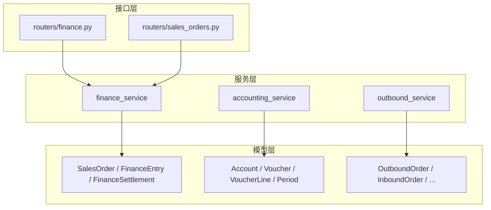
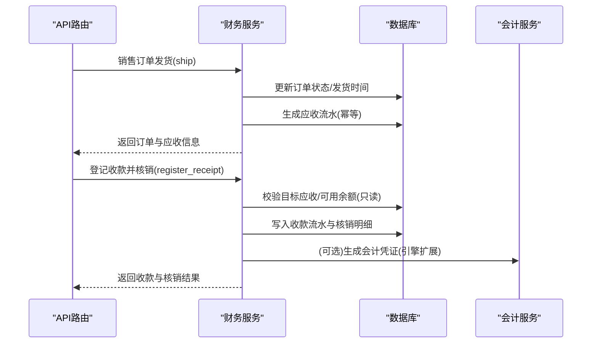
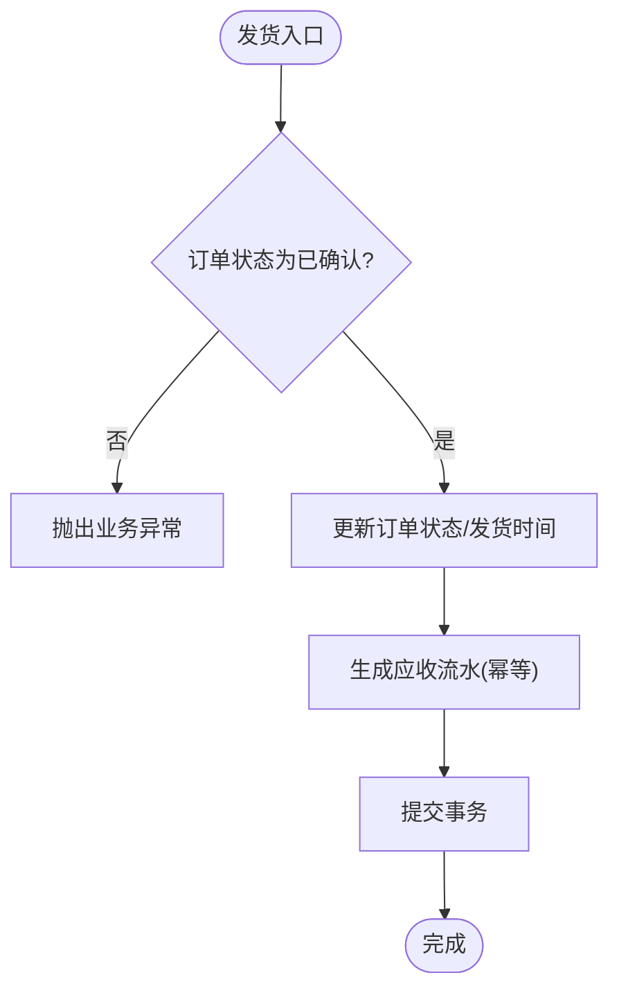
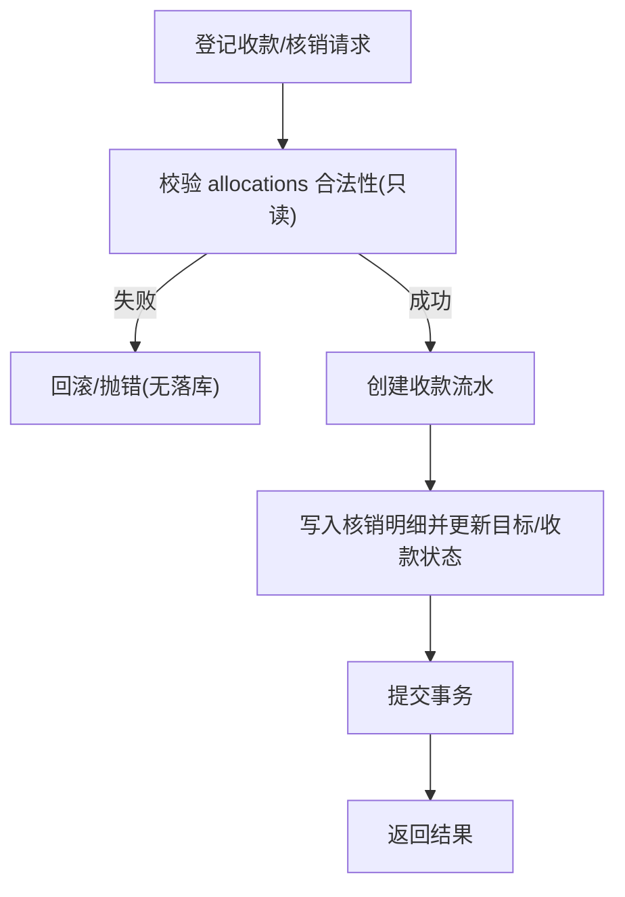
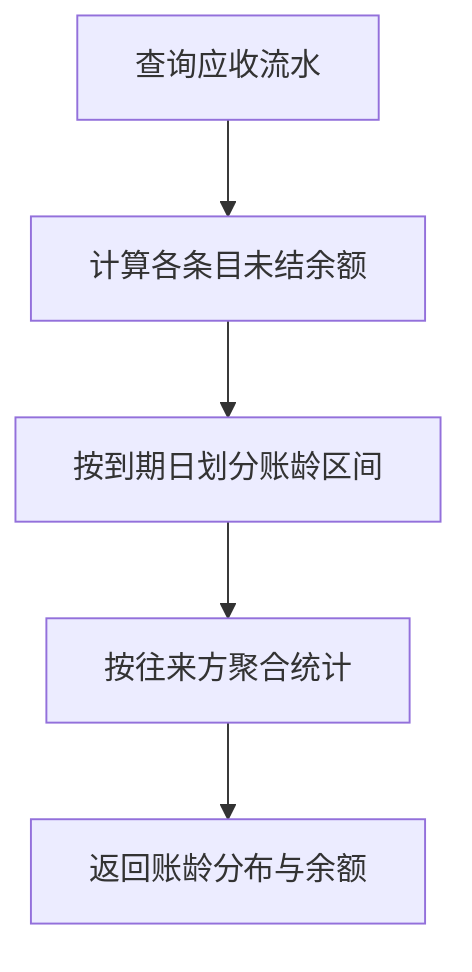
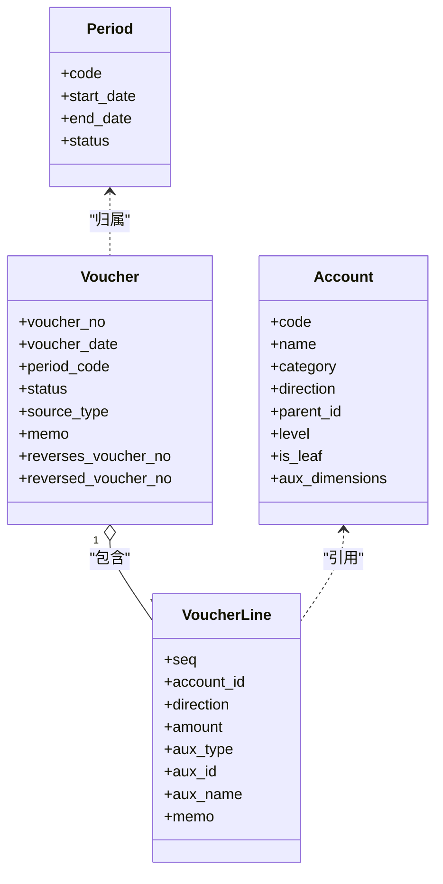
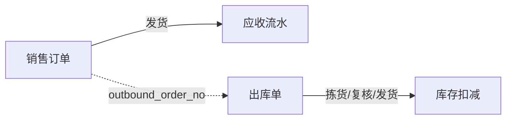

# 财务管理模块

<cite>
**本文引用的文件**
- [finance.py](file://backend-python/app/models/finance.py)
- [accounting.py](file://backend-python/app/models/accounting.py)
- [finance_service.py](file://backend-python/app/services/finance_service.py)
- [accounting_service.py](file://backend-python/app/services/accounting_service.py)
- [finance.py](file://backend-python/app/routers/finance.py)
- [sales_orders.py](file://backend-python/app/routers/sales_orders.py)
- [orders.py](file://backend-python/app/models/orders.py)
- [outbound_service.py](file://backend-python/app/services/outbound_service.py)
- [finance.py](file://backend-python/app/schemas/finance.py)
- [test_finance_service.py](file://backend-python/tests/test_finance_service.py)
- [PRD.md](file://docs/PRD.md)
</cite>

## 目录
1. [简介](#简介)
2. [项目结构](#项目结构)
3. [核心组件](#核心组件)
4. [架构总览](#架构总览)
5. [详细组件分析](#详细组件分析)
6. [依赖关系分析](#依赖关系分析)
7. [性能考量](#性能考量)
8. [故障排查指南](#故障排查指南)
9. [结论](#结论)
10. [附录](#附录)

## 简介
本模块为WMS系统的“业财一体”财务能力，覆盖应收应付管理、收款核销、账龄分析、会计凭证与期间管理等。其设计要点：
- 业务单据（销售订单）在发货时生成应收流水；金额统一保留两位小数，状态由已核销金额推导。
- 收款登记支持部分核销与预收余额复用；核销前进行只读校验，失败不写库。
- 账龄以到期日为基准实时分段，不落库。
- 会计内核提供科目树、凭证生命周期（草稿→过账→冲销）、期间开放/关闭控制，以及红字冲销机制。
- 通过API暴露财务查询、收款登记、核销等能力，并与销售订单、出库流程形成闭环。

## 项目结构
后端采用分层组织：
- models：领域模型（财务流水、核销明细、销售订单、会计科目、凭证、期间等）
- services：业务服务（财务服务、会计服务、出入库服务等）
- routers：FastAPI路由（对外接口）
- schemas：请求/响应数据模型
- tests：单元测试与集成测试

图表来源
- [finance.py:24-117](file://backend-python/app/models/finance.py#L24-L117)
- [accounting.py:63-159](file://backend-python/app/models/accounting.py#L63-L159)
- [orders.py:50-96](file://backend-python/app/models/orders.py#L50-L96)
- [finance_service.py:1-607](file://backend-python/app/services/finance_service.py#L1-L607)
- [accounting_service.py:1-327](file://backend-python/app/services/accounting_service.py#L1-L327)
- [outbound_service.py:1-196](file://backend-python/app/services/outbound_service.py#L1-L196)
- [finance.py:1-60](file://backend-python/app/routers/finance.py#L1-L60)
- [sales_orders.py:1-81](file://backend-python/app/routers/sales_orders.py#L1-L81)

章节来源
- [finance.py:24-117](file://backend-python/app/models/finance.py#L24-L117)
- [accounting.py:63-159](file://backend-python/app/models/accounting.py#L63-L159)
- [orders.py:50-96](file://backend-python/app/models/orders.py#L50-L96)
- [finance_service.py:1-607](file://backend-python/app/services/finance_service.py#L1-L607)
- [accounting_service.py:1-327](file://backend-python/app/services/accounting_service.py#L1-L327)
- [outbound_service.py:1-196](file://backend-python/app/services/outbound_service.py#L1-L196)
- [finance.py:1-60](file://backend-python/app/routers/finance.py#L1-L60)
- [sales_orders.py:1-81](file://backend-python/app/routers/sales_orders.py#L1-L81)

## 核心组件
- 销售订单与明细：记录客户、商品、数量、单价、金额、账期、发货时间等。
- 财务流水（FinanceEntry）：统一承载应收、应付、收款、付款四类流水；通过amount与settled_amount计算未结余额与状态（OPEN/PARTIAL/SETTLED）。
- 核销明细（FinanceSettlement）：记录一笔收款/付款对某张应收/应付的核销金额，支持多次部分核销。
- 会计科目表（Account）：树状COA，仅明细科目可挂分录，支持辅助核算维度。
- 记账凭证（Voucher/VoucherLine）：状态机DRAFT→POSTED→REVERSED；过账强制借贷平衡且至少两条分录；支持红字冲销并双向关联单号。
- 会计期间（Period）：自然月，OPEN/CLOSED；关闭期间拒绝写入。

章节来源
- [finance.py:24-117](file://backend-python/app/models/finance.py#L24-L117)
- [accounting.py:63-159](file://backend-python/app/models/accounting.py#L63-L159)

## 架构总览
从业务到财务的数据流如下：
- 销售订单确认→发货→在同一事务内生成应收流水（幂等），并计算到期日=发货日期+账期。
- 收款登记→可选核销到一张或多张应收/应付；核销前进行只读校验，成功后更新目标与收款流水的已核销金额及状态。
- 账龄分析→按到期日计算逾期天数并归入不同区间。
- 会计凭证→通过会计服务创建草稿凭证，过账时校验期间开放与借贷平衡；错误更正使用红字冲销。

图表来源
- [sales_orders.py:59-66](file://backend-python/app/routers/sales_orders.py#L59-L66)
- [finance_service.py:246-336](file://backend-python/app/services/finance_service.py#L246-L336)
- [finance_service.py:411-439](file://backend-python/app/services/finance_service.py#L411-L439)
- [accounting_service.py:168-240](file://backend-python/app/services/accounting_service.py#L168-L240)

## 详细组件分析

### 应收应付管理与发货生成应收
- 销售订单状态机：DRAFT→CONFIRMED→SHIPPED→COMPLETED/CANCELLED。
- 发货动作中，将订单状态置为已发货，并在同一事务内生成应收流水；若应收已存在则幂等返回。
- 到期日=发货日期+账期；未发货不生成应收。

图表来源
- [finance_service.py:246-336](file://backend-python/app/services/finance_service.py#L246-L336)

章节来源
- [finance_service.py:246-336](file://backend-python/app/services/finance_service.py#L246-L336)
- [sales_orders.py:59-66](file://backend-python/app/routers/sales_orders.py#L59-L66)

### 收款登记与核销算法
- 收款登记：金额必须大于0；支持同时核销多张应收/应付，或先登记后分批核销。
- 核销校验（只读）：目标存在、类型正确、金额为正、不超过单张未结余额、合计不超过可核销余额。
- 应用核销：写入核销明细，累加目标与收款流水的已核销金额，并重新计算状态。
- 预收余额复用：收款金额可大于核销金额，差额作为未核销余额继续用于后续核销。

图表来源
- [finance_service.py:341-439](file://backend-python/app/services/finance_service.py#L341-L439)

章节来源
- [finance_service.py:341-439](file://backend-python/app/services/finance_service.py#L341-L439)
- [finance.py:39-52](file://backend-python/app/routers/finance.py#L39-L52)

### 账龄分析与驾驶舱报表
- 账龄分段：以到期日为基准，分为未到期、逾期1-30天、31-60天、60天以上。
- 按往来方汇总应收总额、已核销总额、未结余额及各账龄段分布。
- 经营驾驶舱：汇总应收总额、已回款、未结、逾期、订单数与订单金额；并提供近N日订单与回款趋势。

图表来源
- [finance_service.py:444-552](file://backend-python/app/services/finance_service.py#L444-L552)

章节来源
- [finance_service.py:444-552](file://backend-python/app/services/finance_service.py#L444-L552)

### 会计凭证与期间管理
- 科目树：维护层级、类别、余额方向、是否明细、辅助核算维度；新增子科目自动将父科目标记为非明细。
- 凭证生命周期：草稿→过账→已冲销；过账要求至少两条分录且借贷平衡；已过账禁止修改删除，更正走红字冲销。
- 期间管理：按自然月；关闭期间禁止写入；反结账需倒序执行。
- 试算与余额：按科目汇总已生效凭证的借/贷发生额，支持按期间过滤。

图表来源
- [accounting.py:63-159](file://backend-python/app/models/accounting.py#L63-L159)

章节来源
- [accounting_service.py:30-94](file://backend-python/app/services/accounting_service.py#L30-L94)
- [accounting_service.py:99-163](file://backend-python/app/services/accounting_service.py#L99-L163)
- [accounting_service.py:168-297](file://backend-python/app/services/accounting_service.py#L168-L297)
- [accounting_service.py:302-327](file://backend-python/app/services/accounting_service.py#L302-L327)

### 与销售订单、出入库模块的集成
- 销售订单发货触发应收生成；出库流程独立负责库存锁定与扣减，二者通过订单号/出库单号建立业务关联（预留字段可用于未来强耦合）。
- 当前实现中，发货与出库解耦：销售订单发货生成应收，出库单发货扣减库存；可通过outbound_order_no字段串联。

图表来源
- [finance.py:24-45](file://backend-python/app/models/finance.py#L24-L45)
- [orders.py:50-96](file://backend-python/app/models/orders.py#L50-L96)
- [outbound_service.py:102-176](file://backend-python/app/services/outbound_service.py#L102-L176)

章节来源
- [finance.py:24-45](file://backend-python/app/models/finance.py#L24-L45)
- [orders.py:50-96](file://backend-python/app/models/orders.py#L50-L96)
- [outbound_service.py:102-176](file://backend-python/app/services/outbound_service.py#L102-L176)

## 依赖关系分析
- finance_service 依赖 models.finance 中的 SalesOrder、FinanceEntry、FinanceSettlement，并通过唯一约束保证幂等。
- accounting_service 依赖 models.accounting 中的 Account、Voucher、VoucherLine、Period，并维护期间与凭证状态机。
- routers 层仅做参数绑定与调用服务层，保持薄接口。
- outbound_service 与 finance_service 通过业务语义协作（发货→应收；出库→库存），目前通过订单号/出库单号弱关联。

```mermaid
graph TB
R1["routers/finance.py"] --> S1["finance_service.py"]
R2["routers/sales_orders.py"] --> S1
S1 --> M1["models/finance.py"]
S2["accounting_service.py"] --> M2["models/accounting.py"]
S3["outbound_service.py"] --> M3["models/orders.py"]
```

图表来源
- [finance.py:1-60](file://backend-python/app/routers/finance.py#L1-L60)
- [sales_orders.py:1-81](file://backend-python/app/routers/sales_orders.py#L1-L81)
- [finance_service.py:1-607](file://backend-python/app/services/finance_service.py#L1-L607)
- [accounting_service.py:1-327](file://backend-python/app/services/accounting_service.py#L1-L327)
- [outbound_service.py:1-196](file://backend-python/app/services/outbound_service.py#L1-L196)
- [finance.py:24-117](file://backend-python/app/models/finance.py#L24-L117)
- [accounting.py:63-159](file://backend-python/app/models/accounting.py#L63-L159)
- [orders.py:50-96](file://backend-python/app/models/orders.py#L50-L96)

章节来源
- [finance.py:1-60](file://backend-python/app/routers/finance.py#L1-L60)
- [sales_orders.py:1-81](file://backend-python/app/routers/sales_orders.py#L1-L81)
- [finance_service.py:1-607](file://backend-python/app/services/finance_service.py#L1-L607)
- [accounting_service.py:1-327](file://backend-python/app/services/accounting_service.py#L1-L327)
- [outbound_service.py:1-196](file://backend-python/app/services/outbound_service.py#L1-L196)

## 性能考量
- 并发安全：通过数据库唯一约束（如 source_order_no + entry_type）与服务层预查双重保障幂等，避免重复生成应收。
- 批量聚合：出库拣货/发货时对同一商品与库位进行聚合，减少重复锁库存操作。
- 查询优化：列表查询使用 joinedload 预加载关联对象，避免 N+1 问题。
- 账龄计算：基于内存分组与简单算术，复杂度与应收流水条数线性相关，适合中等规模数据。

[本节为通用指导，无需特定文件引用]

## 故障排查指南
- 重复发货：服务层检查订单状态，已发货再次发货会抛出业务异常。
- 超额核销：核销前校验总金额与单张未结余额，失败整单回滚，不会落库任何中间数据。
- 非明细科目记账：创建凭证时拒绝非明细科目，提示选择下级明细。
- 期间关闭：关闭期间禁止写入凭证，反结账需按期间倒序执行。
- 删除受限：已有核销记录的应收流水不允许删除。

章节来源
- [finance_service.py:246-336](file://backend-python/app/services/finance_service.py#L246-L336)
- [finance_service.py:341-439](file://backend-python/app/services/finance_service.py#L341-L439)
- [accounting_service.py:82-94](file://backend-python/app/services/accounting_service.py#L82-L94)
- [accounting_service.py:119-163](file://backend-python/app/services/accounting_service.py#L119-L163)
- [finance_service.py:593-607](file://backend-python/app/services/finance_service.py#L593-L607)

## 结论
本模块实现了WMS系统的关键财务能力：以销售订单发货为触发点生成应收，支持灵活的收款与核销策略，提供账龄分析与驾驶舱指标；会计内核提供严谨的科目、凭证与期间管理，确保账务合规与可追溯。通过幂等设计与严格校验，保障了数据一致性与事务完整性。后续可按PRD引入凭证引擎与财务报表，进一步打通业财闭环。

[本节为总结性内容，无需特定文件引用]

## 附录

### 关键业务流程与数据一致性示例
- 销售订单创建→确认→发货→生成应收→收款登记→部分核销→剩余预收余额复用→最终结清。
- 会计凭证创建→过账（借贷平衡校验）→如需更正→红字冲销（双向单号关联）。

章节来源
- [test_finance_service.py:44-125](file://backend-python/tests/test_finance_service.py#L44-L125)
- [test_finance_service.py:129-192](file://backend-python/tests/test_finance_service.py#L129-L192)
- [test_accounting_core.py:145-170](file://backend-python/tests/test_accounting_core.py#L145-L170)

### 与PRD的对应关系
- 科目表、凭证管理、期间管理已在服务层实现；凭证引擎、成本核算、财务报表、期末结转等在规划中。

章节来源
- [PRD.md:86-97](file://docs/PRD.md#L86-L97)