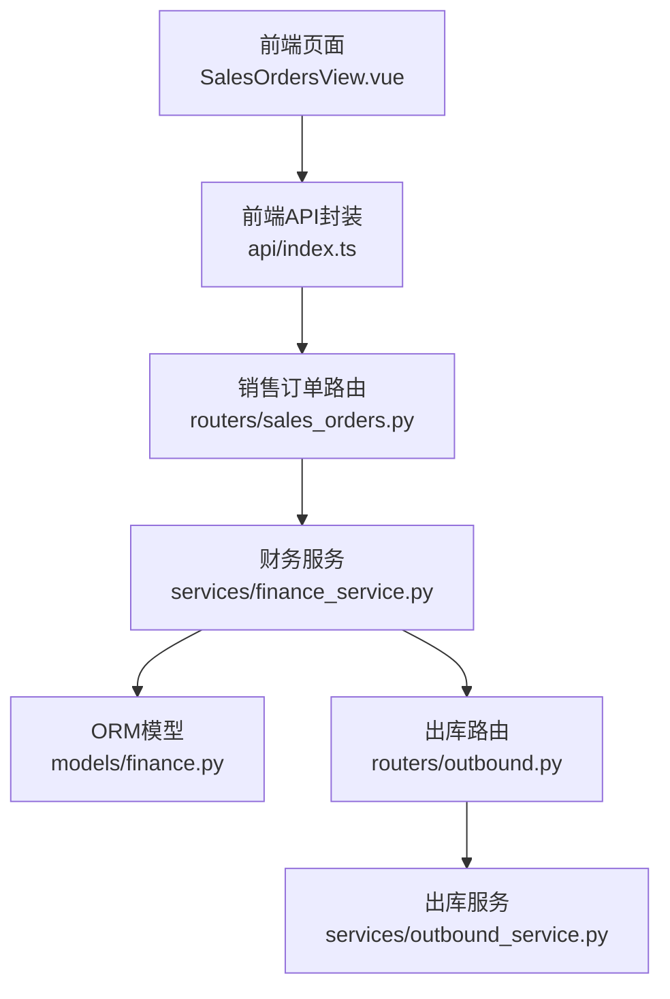
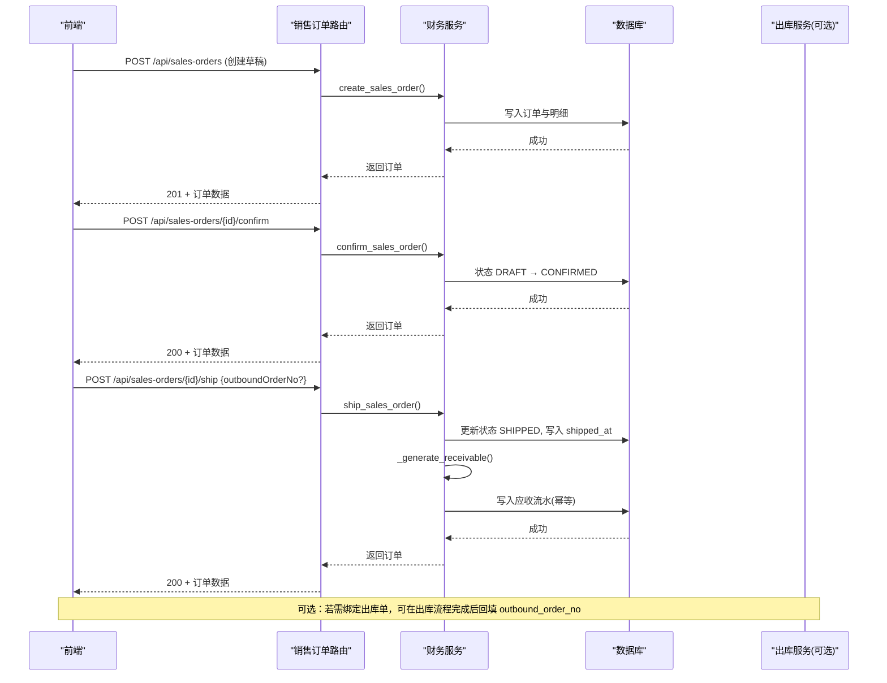
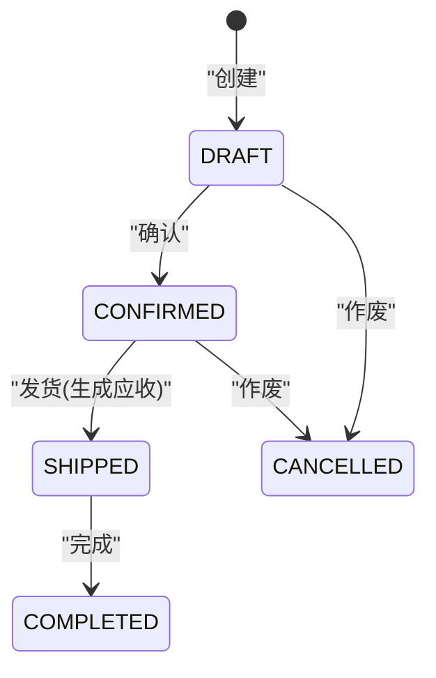
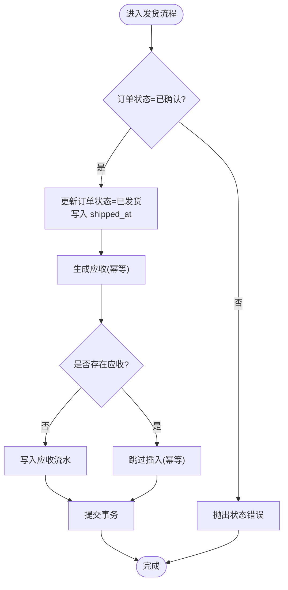
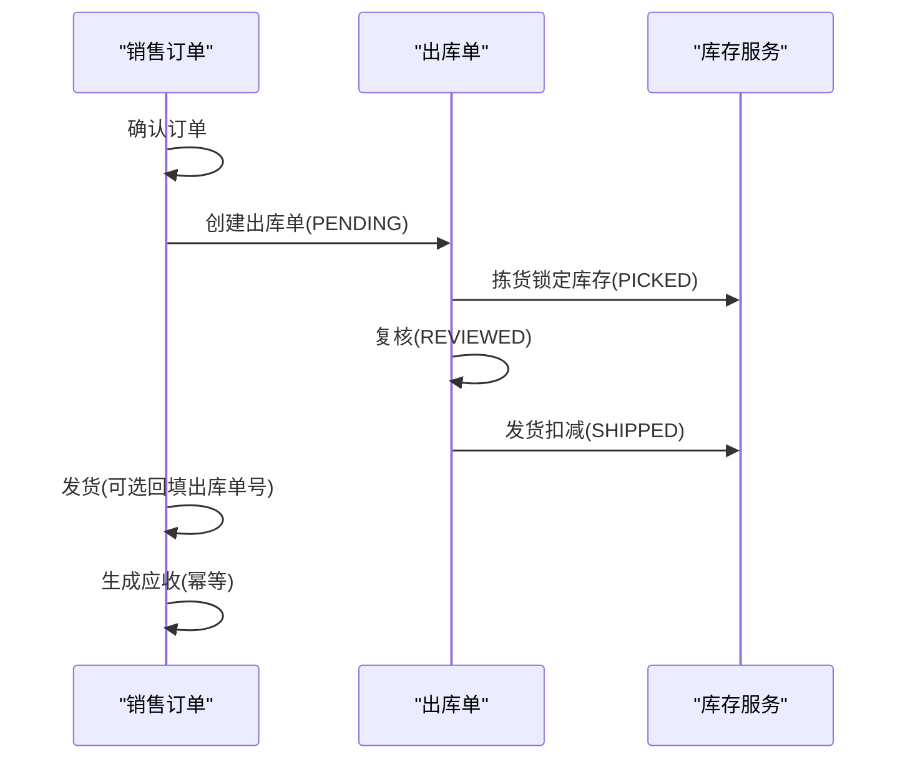
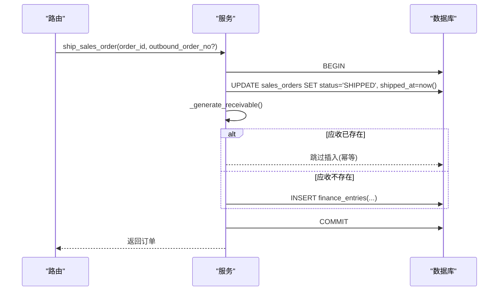
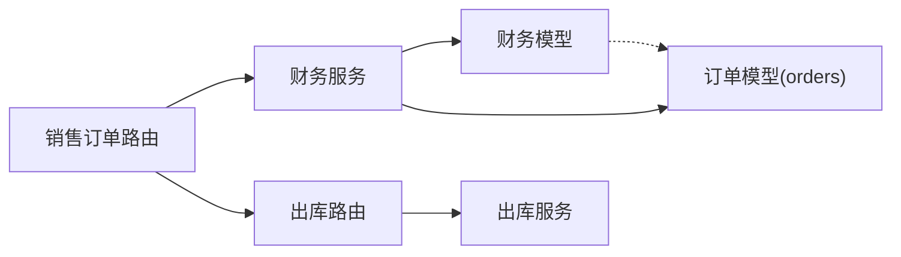

# 销售订单模块

<cite>
**本文引用的文件**
- [backend-python/app/routers/sales_orders.py](file://backend-python/app/routers/sales_orders.py)
- [backend-python/app/services/finance_service.py](file://backend-python/app/services/finance_service.py)
- [backend-python/app/models/finance.py](file://backend-python/app/models/finance.py)
- [backend-python/app/schemas/finance.py](file://backend-python/app/schemas/finance.py)
- [backend-python/app/models/__init__.py](file://backend-python/app/models/__init__.py)
- [backend-python/app/routers/outbound.py](file://backend-python/app/routers/outbound.py)
- [backend-python/app/services/outbound_service.py](file://backend-python/app/services/outbound_service.py)
- [frontend-vue/src/views/SalesOrdersView.vue](file://frontend-vue/src/views/SalesOrdersView.vue)
- [frontend-vue/src/api/index.ts](file://frontend-vue/src/api/index.ts)
</cite>

## 目录
1. [简介](#简介)
2. [项目结构](#项目结构)
3. [核心组件](#核心组件)
4. [架构总览](#架构总览)
5. [详细组件分析](#详细组件分析)
6. [依赖关系分析](#依赖关系分析)
7. [性能考虑](#性能考虑)
8. [故障排查指南](#故障排查指南)
9. [结论](#结论)
10. [附录](#附录)

## 简介
本模块围绕WMS系统的销售订单全生命周期展开，覆盖订单创建、确认、发货（自动生成应收）、完成与作废等状态流转；并与出库单、财务流水及核销能力集成。文档重点说明：
- 订单状态机设计与约束
- 自动应收生成机制与幂等性保障
- 与出库模块的关联方式
- 数据验证规则与业务约束
- 事务处理与异常回滚策略
- 常见问题定位与解决建议

## 项目结构
后端采用分层设计：路由层暴露REST接口，服务层实现业务逻辑与状态机，模型层定义持久化结构与约束，Schema层负责请求/响应校验。前端通过API调用驱动订单操作。

**图表来源**
- [backend-python/app/routers/sales_orders.py:1-81](file://backend-python/app/routers/sales_orders.py#L1-L81)
- [backend-python/app/services/finance_service.py:1-607](file://backend-python/app/services/finance_service.py#L1-L607)
- [backend-python/app/models/finance.py:1-117](file://backend-python/app/models/finance.py#L1-L117)
- [backend-python/app/routers/outbound.py:1-61](file://backend-python/app/routers/outbound.py#L1-L61)
- [backend-python/app/services/outbound_service.py:1-196](file://backend-python/app/services/outbound_service.py#L1-L196)
- [frontend-vue/src/views/SalesOrdersView.vue:1-145](file://frontend-vue/src/views/SalesOrdersView.vue#L1-L145)
- [frontend-vue/src/api/index.ts:602-617](file://frontend-vue/src/api/index.ts#L602-L617)

**章节来源**
- [backend-python/app/routers/sales_orders.py:1-81](file://backend-python/app/routers/sales_orders.py#L1-L81)
- [backend-python/app/services/finance_service.py:1-607](file://backend-python/app/services/finance_service.py#L1-L607)
- [backend-python/app/models/finance.py:1-117](file://backend-python/app/models/finance.py#L1-L117)
- [backend-python/app/routers/outbound.py:1-61](file://backend-python/app/routers/outbound.py#L1-L61)
- [backend-python/app/services/outbound_service.py:1-196](file://backend-python/app/services/outbound_service.py#L1-L196)
- [frontend-vue/src/views/SalesOrdersView.vue:1-145](file://frontend-vue/src/views/SalesOrdersView.vue#L1-L145)
- [frontend-vue/src/api/index.ts:602-617](file://frontend-vue/src/api/index.ts#L602-L617)

## 核心组件
- 路由层：提供销售订单的CRUD与状态变更接口（创建、编辑、确认、发货、完成、作废），并统一返回格式。
- 服务层：实现订单状态机、金额汇总、应收生成、核销与账龄统计等核心业务。
- 模型层：定义销售订单、明细、财务流水与核销表结构，包含唯一约束与索引以支撑幂等与查询性能。
- Schema层：对请求参数进行严格校验（如数量、单价、必填项）。
- 出库集成：发货时可关联出库单号；出库流程独立但可通过订单字段建立关联。

**章节来源**
- [backend-python/app/routers/sales_orders.py:13-81](file://backend-python/app/routers/sales_orders.py#L13-L81)
- [backend-python/app/services/finance_service.py:118-290](file://backend-python/app/services/finance_service.py#L118-L290)
- [backend-python/app/models/finance.py:26-117](file://backend-python/app/models/finance.py#L26-L117)
- [backend-python/app/schemas/finance.py:11-57](file://backend-python/app/schemas/finance.py#L11-L57)
- [backend-python/app/routers/outbound.py:13-61](file://backend-python/app/routers/outbound.py#L13-L61)
- [backend-python/app/services/outbound_service.py:42-176](file://backend-python/app/services/outbound_service.py#L42-L176)

## 架构总览
销售订单模块遵循“路由→服务→模型”的分层架构，并通过Schema进行输入校验。发货动作在服务层内同时完成订单状态更新与应收生成，保证事务一致性。出库模块独立管理库存锁定与扣减，销售订单可记录其出库单号用于追溯。

**图表来源**
- [backend-python/app/routers/sales_orders.py:13-66](file://backend-python/app/routers/sales_orders.py#L13-L66)
- [backend-python/app/services/finance_service.py:118-268](file://backend-python/app/services/finance_service.py#L118-L268)
- [backend-python/app/models/finance.py:26-117](file://backend-python/app/models/finance.py#L26-L117)
- [backend-python/app/routers/outbound.py:13-61](file://backend-python/app/routers/outbound.py#L13-L61)
- [backend-python/app/services/outbound_service.py:42-176](file://backend-python/app/services/outbound_service.py#L42-L176)

## 详细组件分析

### 订单状态机与约束
- 状态集合：DRAFT（草稿）→ CONFIRMED（已确认）→ SHIPPED（已发货）→ COMPLETED（已完成）或 CANCELLED（已作废）。
- 约束规则：
  - 仅草稿可编辑；确认后不可再改明细。
  - 未确认不能发货；未发货不能完成。
  - 已发货后不可作废。
- 这些约束在服务层通过状态检查实现，并在测试中覆盖。

**图表来源**
- [backend-python/app/services/finance_service.py:235-290](file://backend-python/app/services/finance_service.py#L235-L290)
- [backend-python/tests/test_finance_service.py:77-90](file://backend-python/tests/test_finance_service.py#L77-L90)

**章节来源**
- [backend-python/app/services/finance_service.py:235-290](file://backend-python/app/services/finance_service.py#L235-L290)
- [backend-python/tests/test_finance_service.py:77-90](file://backend-python/tests/test_finance_service.py#L77-L90)

### 自动应收生成与幂等性
- 触发时机：订单发货时在同一事务内生成应收。
- 到期日计算：发生日期为发货日期，到期日 = 发货日期 + 账期（天）。
- 幂等保障：
  - 服务层预查同一来源单据+类型是否已有应收。
  - 数据库层对(source_order_no, entry_type)建唯一约束。
  - 并发冲突时抛出业务错误，由调用方重试或回滚。
- 失败回滚：应收生成失败则整单发货回滚，避免“已发货无应收”的不一致态。

**图表来源**
- [backend-python/app/services/finance_service.py:246-336](file://backend-python/app/services/finance_service.py#L246-L336)
- [backend-python/app/models/finance.py:71-100](file://backend-python/app/models/finance.py#L71-L100)

**章节来源**
- [backend-python/app/services/finance_service.py:246-336](file://backend-python/app/services/finance_service.py#L246-L336)
- [backend-python/app/models/finance.py:71-100](file://backend-python/app/models/finance.py#L71-L100)

### 与出库模块的关联
- 销售订单在发货时可携带出库单号（可选），用于后续追溯。
- 出库流程独立：PENDING → PICKED（锁定库存）→ REVIEWED → SHIPPED（扣减库存）。
- 典型场景：先创建出库单并完成拣货/复核/发货，再回到销售订单执行发货并回填出库单号。

**图表来源**
- [backend-python/app/routers/outbound.py:13-61](file://backend-python/app/routers/outbound.py#L13-L61)
- [backend-python/app/services/outbound_service.py:42-176](file://backend-python/app/services/outbound_service.py#L42-L176)
- [backend-python/app/routers/sales_orders.py:59-66](file://backend-python/app/routers/sales_orders.py#L59-L66)
- [backend-python/app/services/finance_service.py:246-268](file://backend-python/app/services/finance_service.py#L246-L268)

**章节来源**
- [backend-python/app/routers/outbound.py:13-61](file://backend-python/app/routers/outbound.py#L13-L61)
- [backend-python/app/services/outbound_service.py:42-176](file://backend-python/app/services/outbound_service.py#L42-L176)
- [backend-python/app/routers/sales_orders.py:59-66](file://backend-python/app/routers/sales_orders.py#L59-L66)
- [backend-python/app/services/finance_service.py:246-268](file://backend-python/app/services/finance_service.py#L246-L268)

### 数据验证规则与业务约束
- 创建订单：
  - 必须存在客户；至少一条明细；商品ID有效；数量>0；单价≥0。
  - 总金额按明细汇总（数量×单价），保留两位小数。
- 编辑订单：
  - 仅草稿状态允许编辑；传入items时整体替换并重算金额。
- 发货：
  - 仅已确认状态允许发货；重复发货会拒绝。
- 完成/作废：
  - 仅已发货可完成；仅草稿/已确认可作废。
- 应收生成：
  - 同一来源单据+类型只能有一条应收；并发冲突返回业务错误。

**章节来源**
- [backend-python/app/schemas/finance.py:11-57](file://backend-python/app/schemas/finance.py#L11-L57)
- [backend-python/app/services/finance_service.py:118-290](file://backend-python/app/services/finance_service.py#L118-L290)
- [backend-python/app/models/finance.py:71-100](file://backend-python/app/models/finance.py#L71-L100)

### 事务处理与状态变更示例
- 创建订单：在事务中写入主表与明细，成功后提交。
- 确认订单：仅状态变更，简单事务。
- 发货订单：在同一事务内更新订单状态并生成应收；任一失败整体回滚。
- 完成/作废：状态变更事务。

**图表来源**
- [backend-python/app/services/finance_service.py:246-336](file://backend-python/app/services/finance_service.py#L246-L336)

**章节来源**
- [backend-python/app/services/finance_service.py:246-336](file://backend-python/app/services/finance_service.py#L246-L336)

### 前端交互与操作流程
- 前端页面提供订单列表、筛选、分页与操作按钮（确认、发货、完成、作废）。
- 操作前弹出确认提示；成功后刷新列表。
- 发货时可选择是否关联出库单号。

**章节来源**
- [frontend-vue/src/views/SalesOrdersView.vue:1-145](file://frontend-vue/src/views/SalesOrdersView.vue#L1-L145)
- [frontend-vue/src/api/index.ts:602-617](file://frontend-vue/src/api/index.ts#L602-L617)

## 依赖关系分析
- 路由依赖服务：销售订单路由调用财务服务完成业务逻辑。
- 服务依赖模型：财务服务读写销售订单、财务流水与核销表。
- 出库集成：销售订单发货可关联出库单号；出库流程独立管理库存。
- 模型导出：模型包集中导出各实体供服务层使用。

**图表来源**
- [backend-python/app/routers/sales_orders.py:1-81](file://backend-python/app/routers/sales_orders.py#L1-L81)
- [backend-python/app/services/finance_service.py:1-607](file://backend-python/app/services/finance_service.py#L1-L607)
- [backend-python/app/models/finance.py:1-117](file://backend-python/app/models/finance.py#L1-L117)
- [backend-python/app/models/orders.py:1-300](file://backend-python/app/models/orders.py#L1-L300)
- [backend-python/app/routers/outbound.py:1-61](file://backend-python/app/routers/outbound.py#L1-L61)
- [backend-python/app/services/outbound_service.py:1-196](file://backend-python/app/services/outbound_service.py#L1-L196)
- [backend-python/app/models/__init__.py:1-78](file://backend-python/app/models/__init__.py#L1-L78)

**章节来源**
- [backend-python/app/models/__init__.py:1-78](file://backend-python/app/models/__init__.py#L1-L78)
- [backend-python/app/models/finance.py:1-117](file://backend-python/app/models/finance.py#L1-L117)
- [backend-python/app/models/orders.py:1-300](file://backend-python/app/models/orders.py#L1-L300)

## 性能考虑
- 列表查询优化：使用joinedload一次性加载明细与关联对象，避免N+1查询。
- 幂等与并发：通过数据库唯一约束与服务层预查双重保障，减少重复写入与竞争条件。
- 金额精度：统一保留两位小数，避免浮点误差累积。
- 索引设计：对常用查询字段（如状态、往来方名称、类型）建立索引以提升检索效率。

[本节为通用性能建议，不直接分析具体文件]

## 故障排查指南
- 常见错误与原因：
  - 当前状态不允许此操作：状态机校验失败（如未确认即发货）。
  - 库存不足：出库拣货时可用库存不足，导致锁定失败。
  - 单号冲突：并发创建订单/应收时唯一约束冲突，需重试。
  - 应收已存在：重复发货或并发生成应收，幂等保护生效。
- 定位步骤：
  - 查看订单当前状态与期望状态是否匹配。
  - 检查出库单是否已完成拣货/复核/发货。
  - 核对财务流水是否已存在对应应收。
  - 检查数据库唯一约束与索引是否正确。
- 恢复建议：
  - 对于并发冲突，适当重试并加退避。
  - 对于状态不一致，回滚事务并修正上游流程（如先完成出库再发货）。

**章节来源**
- [backend-python/app/services/finance_service.py:246-336](file://backend-python/app/services/finance_service.py#L246-L336)
- [backend-python/app/services/outbound_service.py:102-176](file://backend-python/app/services/outbound_service.py#L102-L176)
- [backend-python/app/models/finance.py:71-100](file://backend-python/app/models/finance.py#L71-L100)

## 结论
销售订单模块通过清晰的状态机、严格的验证与幂等设计，实现了从下单到发货再到应收生成的闭环。与出库模块解耦但可关联，便于库存与财务数据的准确追踪。建议在业务实践中：
- 严格遵循状态机约束，避免非法状态跳转。
- 发货前确保出库流程完整，必要时回填出库单号。
- 关注并发场景下的幂等与重试策略。
- 利用列表查询优化与索引提升系统性能。

[本节为总结性内容，不直接分析具体文件]

## 附录
- 关键接口路径参考：
  - 创建订单：POST /api/sales-orders
  - 编辑订单：PUT /api/sales-orders/{order_id}
  - 确认订单：POST /api/sales-orders/{order_id}/confirm
  - 发货订单：POST /api/sales-orders/{order_id}/ship
  - 完成订单：POST /api/sales-orders/{order_id}/complete
  - 作废订单：POST /api/sales-orders/{order_id}/cancel
- 相关模型与Schema：
  - 销售订单与明细：models/finance.py
  - 财务流水与核销：models/finance.py
  - 请求/响应Schema：schemas/finance.py

**章节来源**
- [backend-python/app/routers/sales_orders.py:13-81](file://backend-python/app/routers/sales_orders.py#L13-L81)
- [backend-python/app/models/finance.py:26-117](file://backend-python/app/models/finance.py#L26-L117)
- [backend-python/app/schemas/finance.py:11-57](file://backend-python/app/schemas/finance.py#L11-L57)