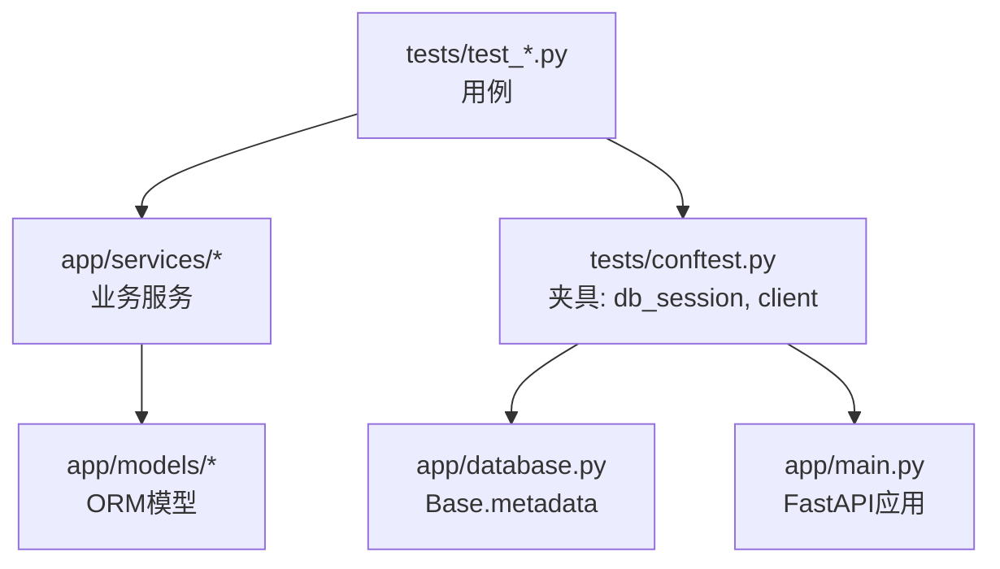
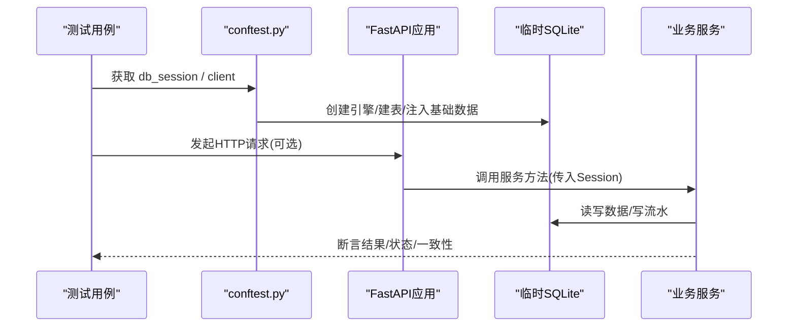
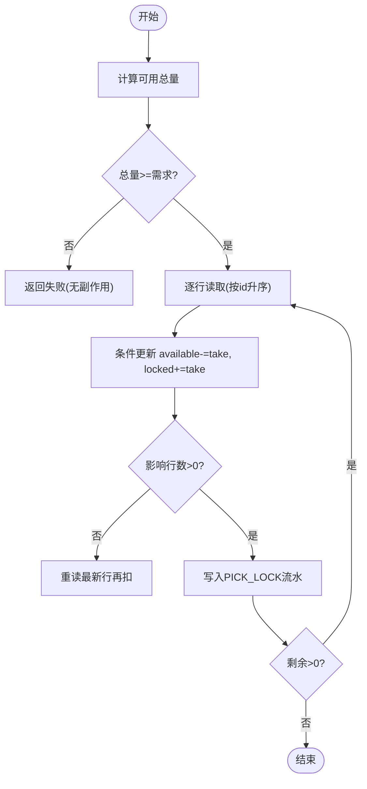
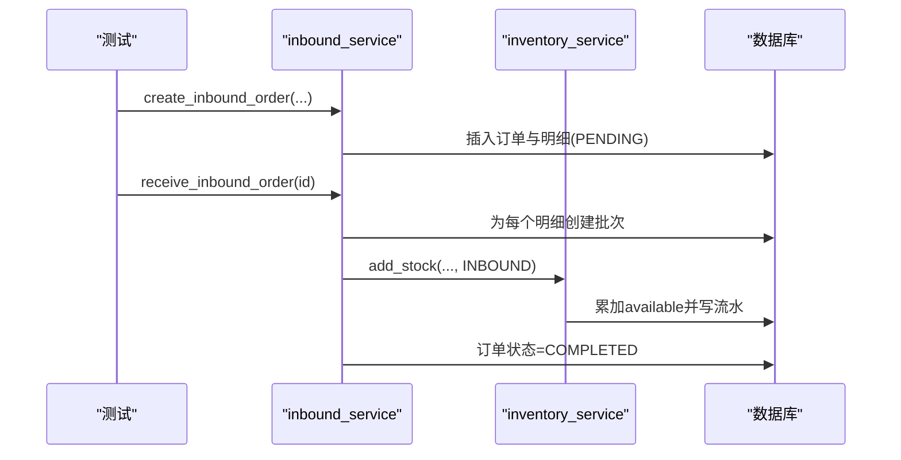
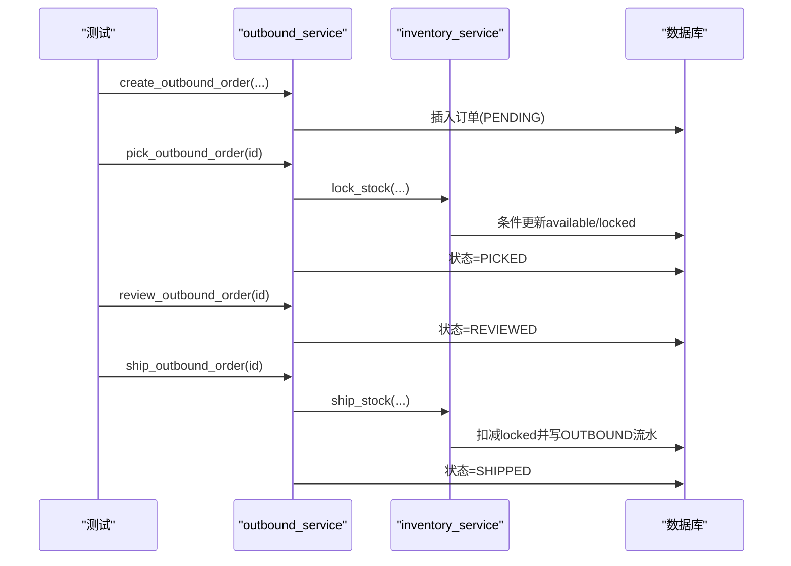
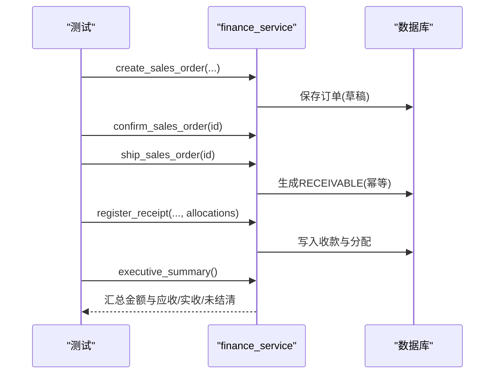
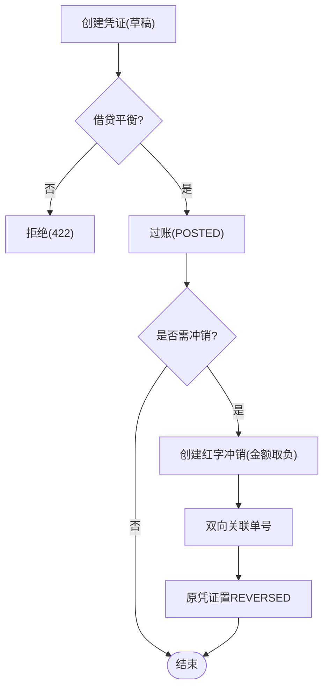
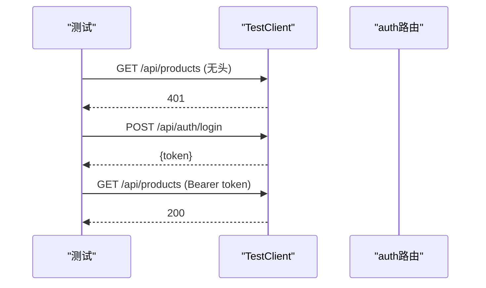
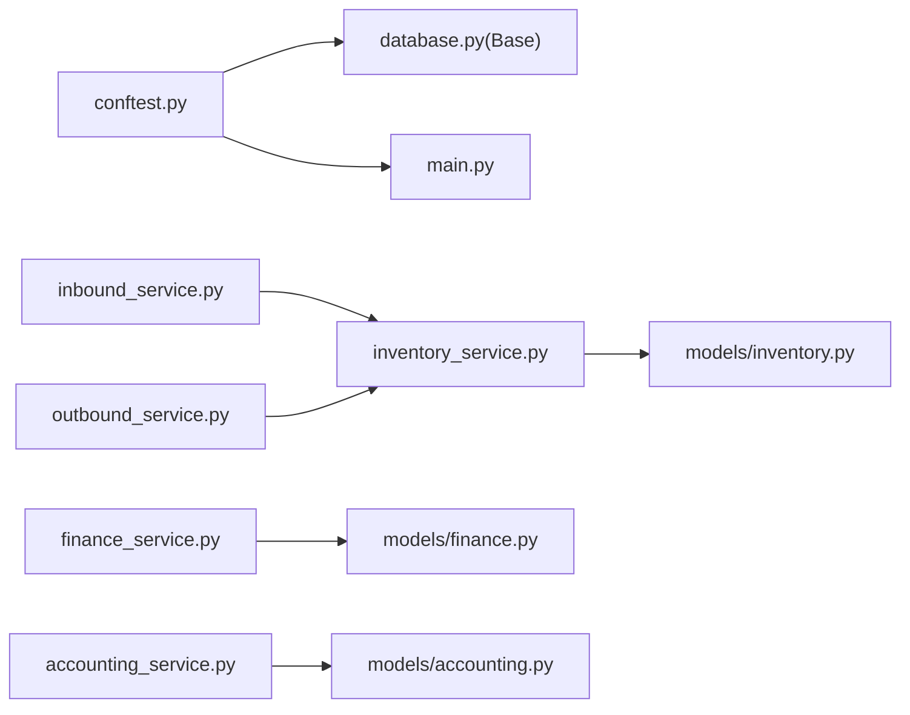

# 单元测试

<cite>
**本文引用的文件**
- [backend-python/tests/conftest.py](file://backend-python/tests/conftest.py)
- [backend-python/pyproject.toml](file://backend-python/pyproject.toml)
- [backend-python/requirements.txt](file://backend-python/requirements.txt)
- [backend-python/app/database.py](file://backend-python/app/database.py)
- [backend-python/app/main.py](file://backend-python/app/main.py)
- [backend-python/app/services/inventory_service.py](file://backend-python/app/services/inventory_service.py)
- [backend-python/app/services/inbound_service.py](file://backend-python/app/services/inbound_service.py)
- [backend-python/app/services/outbound_service.py](file://backend-python/app/services/outbound_service.py)
- [backend-python/app/services/finance_service.py](file://backend-python/app/services/finance_service.py)
- [backend-python/app/services/accounting_service.py](file://backend-python/app/services/accounting_service.py)
- [backend-python/app/models/base.py](file://backend-python/app/models/base.py)
- [backend-python/app/models/inventory.py](file://backend-python/app/models/inventory.py)
- [backend-python/app/models/orders.py](file://backend-python/app/models/orders.py)
- [backend-python/app/models/accounting.py](file://backend-python/app/models/accounting.py)
- [backend-python/tests/test_inventory_service.py](file://backend-python/tests/test_inventory_service.py)
- [backend-python/tests/test_inbound_service.py](file://backend-python/tests/test_inbound_service.py)
- [backend-python/tests/test_outbound_service.py](file://backend-python/tests/test_outbound_service.py)
- [backend-python/tests/test_finance_service.py](file://backend-python/tests/test_finance_service.py)
- [backend-python/tests/test_accounting_core.py](file://backend-python/tests/test_accounting_core.py)
- [backend-python/tests/test_api_auth.py](file://backend-python/tests/test_api_auth.py)
</cite>

## 目录
1. [简介](#简介)
2. [项目结构](#项目结构)
3. [核心组件](#核心组件)
4. [架构总览](#架构总览)
5. [详细组件分析](#详细组件分析)
6. [依赖关系分析](#依赖关系分析)
7. [性能考量](#性能考量)
8. [故障排查指南](#故障排查指南)
9. [结论](#结论)
10. [附录](#附录)

## 简介
本文件面向WMS系统后端，系统化说明基于pytest的单元测试实践与策略。重点覆盖：
- pytest配置、测试夹具与依赖注入（conftest.py）
- 服务层测试设计：库存、入库、出库、财务、会计内核
- 数据库测试最佳实践：临时库、事务隔离、数据准备
- Mock与Stub使用指南：模拟外部依赖与API调用
- 覆盖率与代码质量检查建议

## 项目结构
后端测试位于 backend-python/tests，采用pytest组织；测试夹具在 conftest.py 中提供独立SQLite数据库会话与FastAPI TestClient，确保测试互不干扰且无需真实数据库。

图表来源
- [backend-python/tests/conftest.py:21-89](file://backend-python/tests/conftest.py#L21-L89)
- [backend-python/app/database.py:1-50](file://backend-python/app/database.py#L1-L50)
- [backend-python/app/main.py:1-50](file://backend-python/app/main.py#L1-L50)

章节来源
- [backend-python/tests/conftest.py:21-89](file://backend-python/tests/conftest.py#L21-L89)
- [backend-python/pyproject.toml:34-36](file://backend-python/pyproject.toml#L34-L36)

## 核心组件
- 测试夹具
  - db_session：创建临时SQLite引擎，建表并注入基础主数据（商品、仓库、库区、库位等），返回可复用的Session供服务层测试使用。
  - client：为FastAPI应用注入独立的get_db实现，预置管理员账号，返回TestClient用于API级集成测试。
- 异步模式
  - pyproject.toml 启用 pytest asyncio_mode=auto，便于后续引入异步用例。
- 依赖项
  - requirements.txt 与 pyproject.toml 声明了FastAPI、SQLAlchemy、Pydantic、Alembic等运行时依赖；dev依赖包含pytest、httpx、pytest-asyncio。

章节来源
- [backend-python/tests/conftest.py:21-89](file://backend-python/tests/conftest.py#L21-L89)
- [backend-python/pyproject.toml:1-36](file://backend-python/pyproject.toml#L1-L36)
- [backend-python/requirements.txt:1-13](file://backend-python/requirements.txt#L1-L13)

## 架构总览
测试通过夹具将“应用 + 临时数据库”组合起来，服务层以纯函数形式接收Session，避免隐式全局状态，便于单测验证。

图表来源
- [backend-python/tests/conftest.py:21-89](file://backend-python/tests/conftest.py#L21-L89)
- [backend-python/app/services/inventory_service.py:75-200](file://backend-python/app/services/inventory_service.py#L75-L200)

## 详细组件分析

### 库存服务测试（inventory_service）
- 目标
  - 验证 add_stock/deduct_stock/lock_stock/ship_stock 的行为与边界条件
  - 验证按(product, location, batch)维度的聚合与查询视图
  - 验证流水完整性与可追溯性
- 关键策略
  - 同维度累加：重复入库在同一行累加，每次写流水
  - 跨批次扣减：FIFO顺序先扣早期批次
  - 并发防超卖：SUM校验+条件UPDATE重试，保证无副作用回滚
  - 查询视图：product视图按商品汇总；location视图含批次信息
- 典型流程（拣货锁定）

图表来源
- [backend-python/app/services/inventory_service.py:147-200](file://backend-python/app/services/inventory_service.py#L147-L200)
- [backend-python/tests/test_inventory_service.py:85-108](file://backend-python/tests/test_inventory_service.py#L85-L108)

章节来源
- [backend-python/tests/test_inventory_service.py:31-171](file://backend-python/tests/test_inventory_service.py#L31-L171)
- [backend-python/app/services/inventory_service.py:75-200](file://backend-python/app/services/inventory_service.py#L75-L200)

### 入库服务测试（inbound_service）
- 目标
  - 创建入库单仅落单，不改变库存、不生成批次
  - 收货上架时生成批次、累加库存、写INBOUND流水，状态置COMPLETED
  - 重复收货拒绝、无效商品/库位拒绝、单号自增
- 关键断言
  - 订单号格式、状态机转换
  - 批次号规则（单号-明细id）
  - 库存与流水一致性
- 序列图（收货上架）

图表来源
- [backend-python/app/services/inbound_service.py:38-129](file://backend-python/app/services/inbound_service.py#L38-L129)
- [backend-python/tests/test_inbound_service.py:26-96](file://backend-python/tests/test_inbound_service.py#L26-L96)

章节来源
- [backend-python/tests/test_inbound_service.py:26-96](file://backend-python/tests/test_inbound_service.py#L26-L96)
- [backend-python/app/services/inbound_service.py:38-129](file://backend-python/app/services/inbound_service.py#L38-L129)

### 出库服务测试（outbound_service）
- 目标
  - 创建出库单不改变库存
  - 拣货：available→locked，不足整单回滚
  - 复核：PICKED→REVIEWED
  - 发货：扣减locked，写OUTBOUND流水
  - 并发防超卖：多线程并发pick，至多一单成功，账面守恒
- 并发防超卖要点
  - SUM总量校验 + 条件UPDATE重试
  - SQLite下无行锁，但条件更新仍能保证原子性
- 序列图（拣货-复核-发货）

图表来源
- [backend-python/app/services/outbound_service.py:42-176](file://backend-python/app/services/outbound_service.py#L42-L176)
- [backend-python/tests/test_outbound_service.py:42-168](file://backend-python/tests/test_outbound_service.py#L42-L168)
- [backend-python/tests/test_outbound_service.py:170-216](file://backend-python/tests/test_outbound_service.py#L170-L216)

章节来源
- [backend-python/tests/test_outbound_service.py:42-216](file://backend-python/tests/test_outbound_service.py#L42-L216)
- [backend-python/app/services/outbound_service.py:42-176](file://backend-python/app/services/outbound_service.py#L42-L176)

### 财务服务测试（finance_service）
- 目标
  - 销售订单金额计算、状态机约束（未确认不可发货、已发货不可作废等）
  - 发货幂等生成应收，带到期日
  - 部分核销与结清、预收余额复用、超额拦截
  - 账龄分段统计与驾驶舱口径一致
- 关键断言
  - 发货才生成应收，重复发货报错且不新增
  - 核销后状态与未结清金额正确
  - 驾驶舱汇总与底层FinanceEntry一致
- 序列图（发货→应收→收款核销）

图表来源
- [backend-python/tests/test_finance_service.py:44-240](file://backend-python/tests/test_finance_service.py#L44-L240)
- [backend-python/app/services/finance_service.py:1-200](file://backend-python/app/services/finance_service.py#L1-L200)

章节来源
- [backend-python/tests/test_finance_service.py:44-240](file://backend-python/tests/test_finance_service.py#L44-L240)
- [backend-python/app/services/finance_service.py:1-200](file://backend-python/app/services/finance_service.py#L1-L200)

### 会计内核测试（accounting_service）
- 目标
  - 科目树构建：子科目编码前缀、父科目自动非明细、类别/方向一致性
  - 非明细科目拒绝记账、停用科目拒绝
  - 凭证状态机：借贷平衡、单边挂账拦截、过账后不可改删、红字冲销双向关联
  - 期间锁定：closed期间拒写、结账前草稿检查、反结账倒序约束
- 关键断言
  - 过账后删除/重复过账返回冲突
  - 红字冲销金额取负、原凭证状态变更
  - closed期间创建/过账拒绝
- 流程图（凭证过账与冲销）

图表来源
- [backend-python/tests/test_accounting_core.py:145-207](file://backend-python/tests/test_accounting_core.py#L145-L207)
- [backend-python/app/services/accounting_service.py:1-200](file://backend-python/app/services/accounting_service.py#L1-L200)

章节来源
- [backend-python/tests/test_accounting_core.py:67-251](file://backend-python/tests/test_accounting_core.py#L67-L251)
- [backend-python/app/services/accounting_service.py:1-200](file://backend-python/app/services/accounting_service.py#L1-L200)

### API鉴权测试（test_api_auth）
- 目标
  - 未登录访问业务接口返回401
  - 携带有效token访问返回200
  - 非管理员角色访问用户管理返回403
- 夹具
  - 使用client夹具提供的TestClient与独立临时库，预置admin账号
- 序列图（鉴权流程）

图表来源
- [backend-python/tests/test_api_auth.py:22-63](file://backend-python/tests/test_api_auth.py#L22-L63)
- [backend-python/tests/conftest.py:55-89](file://backend-python/tests/conftest.py#L55-L89)

章节来源
- [backend-python/tests/test_api_auth.py:22-63](file://backend-python/tests/test_api_auth.py#L22-L63)
- [backend-python/tests/conftest.py:55-89](file://backend-python/tests/conftest.py#L55-L89)

## 依赖关系分析
- 测试夹具依赖
  - FastAPI TestClient、SQLAlchemy Engine/Session、app.database.Base、app.main.app
- 服务层依赖
  - inventory_service 被 inbound_service、outbound_service 复用
  - finance_service 与 accounting_service 分别负责业财与会计内核
- 模型依赖
  - Base 定义所有表的元数据，测试夹具统一建表
  - 各服务通过 models 中的实体进行读写

图表来源
- [backend-python/tests/conftest.py:21-89](file://backend-python/tests/conftest.py#L21-L89)
- [backend-python/app/services/inventory_service.py:1-30](file://backend-python/app/services/inventory_service.py#L1-L30)
- [backend-python/app/services/inbound_service.py:1-15](file://backend-python/app/services/inbound_service.py#L1-L15)
- [backend-python/app/services/outbound_service.py:1-20](file://backend-python/app/services/outbound_service.py#L1-L20)
- [backend-python/app/services/finance_service.py:1-20](file://backend-python/app/services/finance_service.py#L1-L20)
- [backend-python/app/services/accounting_service.py:1-20](file://backend-python/app/services/accounting_service.py#L1-L20)

章节来源
- [backend-python/tests/conftest.py:21-89](file://backend-python/tests/conftest.py#L21-L89)
- [backend-python/app/services/inventory_service.py:1-30](file://backend-python/app/services/inventory_service.py#L1-L30)
- [backend-python/app/services/inbound_service.py:1-15](file://backend-python/app/services/inbound_service.py#L1-L15)
- [backend-python/app/services/outbound_service.py:1-20](file://backend-python/app/services/outbound_service.py#L1-L20)
- [backend-python/app/services/finance_service.py:1-20](file://backend-python/app/services/finance_service.py#L1-L20)
- [backend-python/app/services/accounting_service.py:1-20](file://backend-python/app/services/accounting_service.py#L1-L20)

## 性能考量
- 批量操作与聚合
  - 出库/入库服务对同一(商品,库位)明细进行聚合，减少重复锁行与流水写入
- 并发安全
  - 库存扣减/锁定采用“总量校验 + 条件UPDATE重试”，在SQLite下也能避免覆盖提交
- 查询优化
  - 列表查询使用joinedload避免N+1问题
- 建议
  - 对热点路径增加慢查询日志与指标埋点
  - 针对高并发场景，生产库建议使用PostgreSQL并配合FOR UPDATE行锁

[本节为通用指导，不直接分析具体文件]

## 故障排查指南
- 常见错误类型
  - BusinessError：业务校验失败（如库存不足、状态不允许、重复操作），断言status与message
  - IntegrityError：唯一约束冲突（如单号冲突），夹具与服务层应能回滚并抛出BusinessError
  - OperationalError：SQLite写锁冲突，并发测试中作为兜底捕获
- 定位步骤
  - 检查夹具是否提供了正确的Session与基础数据
  - 核对服务层事务边界与commit/rollback时机
  - 查看InventoryFlow/FinanceEntry等流水表前后值是否一致
- 参考位置
  - 业务错误抛出与处理：各服务层方法
  - 并发异常捕获：出库并发测试

章节来源
- [backend-python/tests/test_outbound_service.py:170-216](file://backend-python/tests/test_outbound_service.py#L170-L216)
- [backend-python/app/services/inbound_service.py:56-82](file://backend-python/app/services/inbound_service.py#L56-L82)
- [backend-python/app/services/outbound_service.py:60-86](file://backend-python/app/services/outbound_service.py#L60-L86)

## 结论
本项目通过conftest夹具实现了测试与开发数据库完全隔离，服务层以显式Session参数化，便于精准断言与并发验证。库存、入库、出库、财务与会计内核均具备完善的单测覆盖，覆盖了状态机、幂等、并发防超卖、账务一致性等关键不变量。建议在CI中持续运行并逐步提升覆盖率基线。

[本节为总结，不直接分析具体文件]

## 附录

### 数据库测试最佳实践
- 使用临时SQLite数据库，测试结束后清理文件
- 每个测试用例使用独立Session，避免共享状态
- 基础数据集中初始化（商品、仓库、库区、库位、用户等）
- 事务隔离：服务层在事务内完成多步操作，失败整体回滚
- 数据断言：不仅断言最终状态，还要断言中间流水与一致性

章节来源
- [backend-python/tests/conftest.py:21-89](file://backend-python/tests/conftest.py#L21-L89)
- [backend-python/app/services/inbound_service.py:92-129](file://backend-python/app/services/inbound_service.py#L92-L129)
- [backend-python/app/services/outbound_service.py:102-176](file://backend-python/app/services/outbound_service.py#L102-L176)

### Mock与Stub使用指南
- 何时Mock
  - 外部API调用、第三方服务、耗时IO、随机/时间相关逻辑
- 如何Mock
  - 使用unittest.mock.patch或pytest-mock替换模块/类/函数
  - 对服务层依赖的外部HTTP客户端进行stub，固定响应
- 注意事项
  - 尽量Mock最小边界，保留核心业务逻辑真实执行
  - 对并发与事务敏感的路径优先用真实数据库夹具验证

[本节为通用指导，不直接分析具体文件]

### 覆盖率与代码质量
- 覆盖率
  - 建议启用pytest-cov，设置最低覆盖率阈值并在CI中阻断
  - 对关键不变量（借贷平衡、试算恒等、幂等、锁账拒写）必须覆盖
- 代码质量
  - 建议引入ruff/flake8做静态检查，black做格式化
  - CI流水线中集成lint与测试门禁

章节来源
- [backend-python/pyproject.toml:19-24](file://backend-python/pyproject.toml#L19-L24)
- [docs/PRD.md:159-164](file://docs/PRD.md#L159-L164)