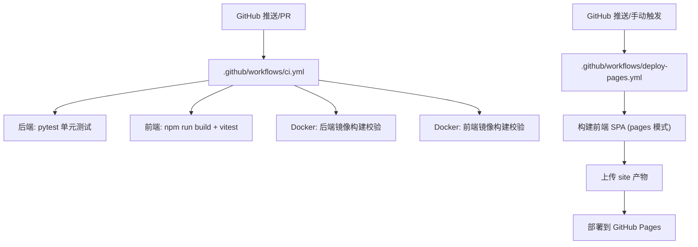
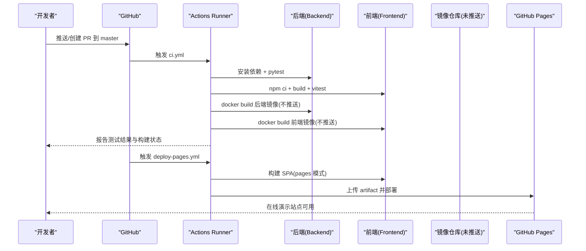
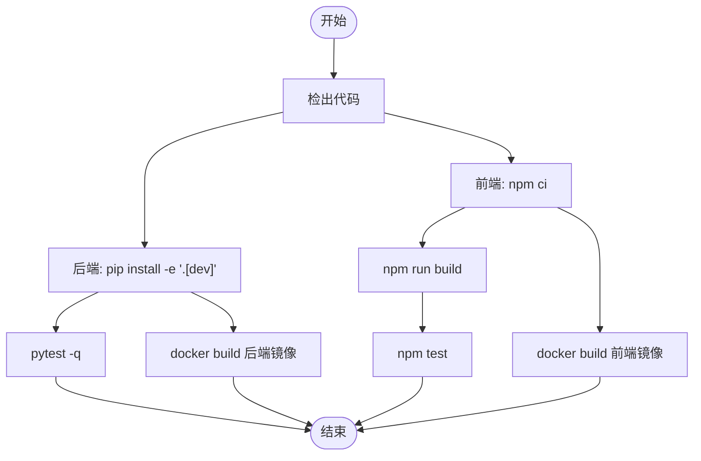
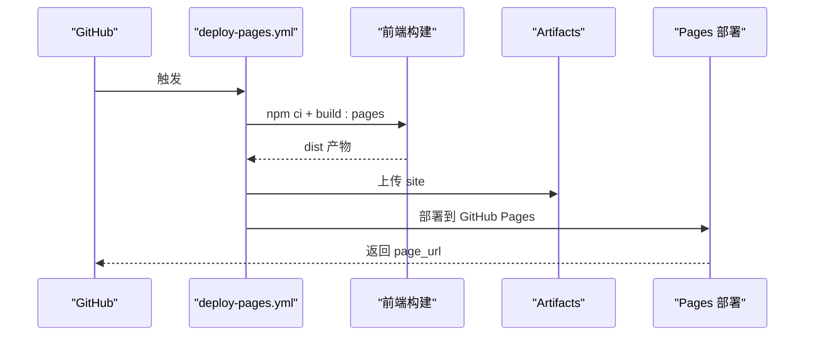
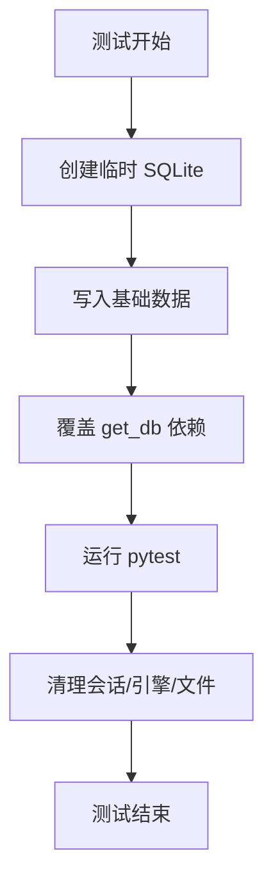
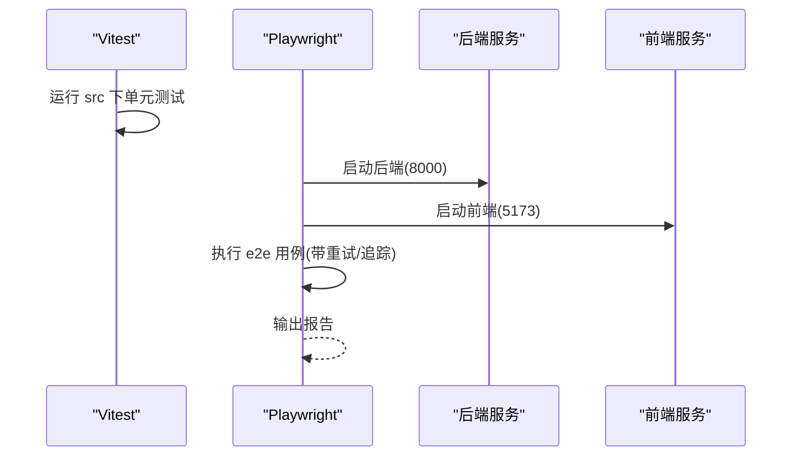
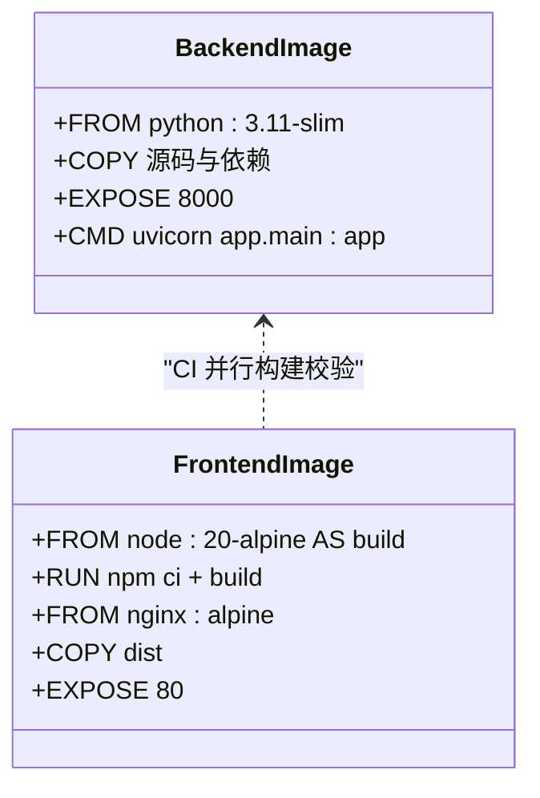
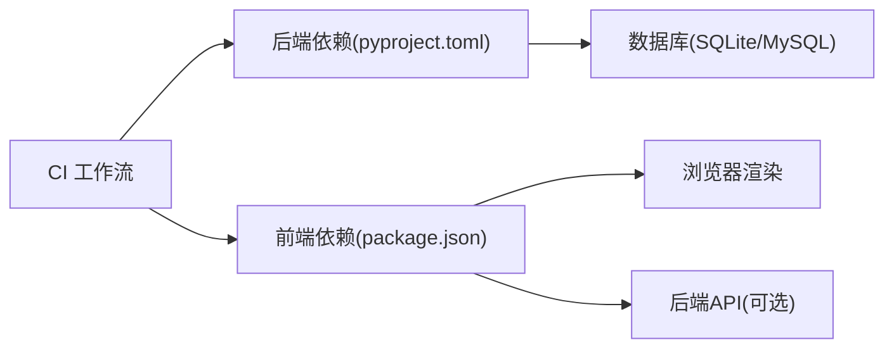

# 持续集成

<cite>
**本文引用的文件**
- [ci.yml](file://.github/workflows/ci.yml)
- [deploy-pages.yml](file://.github/workflows/deploy-pages.yml)
- [pyproject.toml](file://backend-python/pyproject.toml)
- [Dockerfile（后端）](file://backend-python/Dockerfile)
- [Dockerfile（前端）](file://frontend-vue/Dockerfile)
- [playwright.config.ts](file://frontend-vue/playwright.config.ts)
- [vite.config.ts](file://frontend-vue/vite.config.ts)
- [package.json（前端）](file://frontend-vue/package.json)
- [docker-compose.yml](file://docker-compose.yml)
- [README.md](file://README.md)
</cite>

## 目录
1. [简介](#简介)
2. [项目结构](#项目结构)
3. [核心组件](#核心组件)
4. [架构总览](#架构总览)
5. [详细组件分析](#详细组件分析)
6. [依赖关系分析](#依赖关系分析)
7. [性能与优化](#性能与优化)
8. [故障排查指南](#故障排查指南)
9. [结论](#结论)
10. [附录](#附录)

## 简介
本仓库为“进销存·业财一体中后台”系统，包含 FastAPI 后端与 Vue 3 前端。持续集成通过 GitHub Actions 实现：在 push/PR 到 master 时并行执行后端单元测试、前端构建与单元测试、以及前后端 Docker 镜像构建校验；另提供将纯前端 SPA 发布至 GitHub Pages 的部署流水线。本文档系统化说明 CI 配置、测试策略、多环境发布流程、质量检查、缓存与并行优化、失败通知与监控、回滚与版本管理策略。

## 项目结构
- 工作流定义位于 .github/workflows：
  - ci.yml：触发于 push/PR 到 master，包含后端 pytest、前端 build+vitest、Docker 镜像构建校验。
  - deploy-pages.yml：触发于 push 到 master 或手动触发，构建前端 SPA 并发布到 GitHub Pages。
- 后端使用 pyproject.toml 声明依赖与可选 dev 依赖，pytest 自动模式启用。
- 前端使用 vite.config.ts 配置 base、代理与 vitest 排除 e2e；Playwright 负责 E2E。
- Docker 镜像分别用于后端运行与前端静态托管。
- docker-compose.yml 提供本地一键全栈启动（MySQL + 后端 + 前端）。

**图表来源**
- [ci.yml:1-67](file://.github/workflows/ci.yml#L1-L67)
- [deploy-pages.yml:1-61](file://.github/workflows/deploy-pages.yml#L1-L61)

**章节来源**
- [ci.yml:1-67](file://.github/workflows/ci.yml#L1-L67)
- [deploy-pages.yml:1-61](file://.github/workflows/deploy-pages.yml#L1-L61)
- [README.md:233-240](file://README.md#L233-L240)

## 核心组件
- CI 流水线（ci.yml）
  - 后端测试：安装 Python 3.11，安装开发依赖，运行 pytest（不连接真实数据库）。
  - 前端构建与测试：Node 18，npm ci，类型检查与构建，vitest 单元测试。
  - Docker 构建校验：分别构建前后端镜像（不推送）。
- 页面部署流水线（deploy-pages.yml）
  - Node 20，构建前端 SPA（pages 模式），拷贝到 site/app，配置并上传 artifact，部署到 GitHub Pages。
- 测试基础设施
  - 后端：pytest 夹具使用临时 SQLite 数据库隔离测试数据。
  - 前端：vitest 仅收集 src 下单元测，e2e 由 Playwright 单独运行。
- 容器化
  - 后端：基于 python:3.11-slim，安装依赖后以 uvicorn 启动。
  - 前端：双阶段构建，nginx 托管 dist。

**章节来源**
- [ci.yml:10-67](file://.github/workflows/ci.yml#L10-L67)
- [deploy-pages.yml:19-61](file://.github/workflows/deploy-pages.yml#L19-L61)
- [pyproject.toml:19-36](file://backend-python/pyproject.toml#L19-L36)
- [Dockerfile（后端）:1-27](file://backend-python/Dockerfile#L1-L27)
- [Dockerfile（前端）:1-25](file://frontend-vue/Dockerfile#L1-L25)
- [playwright.config.ts:1-49](file://frontend-vue/playwright.config.ts#L1-L49)

## 架构总览
CI 与部署的整体交互如下：

**图表来源**
- [ci.yml:1-67](file://.github/workflows/ci.yml#L1-L67)
- [deploy-pages.yml:1-61](file://.github/workflows/deploy-pages.yml#L1-L61)

## 详细组件分析

### CI 流水线（ci.yml）
- 触发条件：push/PR 到 master。
- 任务并行：
  - backend-test：Python 3.11，安装 dev 依赖，运行 pytest。
  - frontend-build：Node 18，npm ci，构建与 vitest 单测。
  - docker-build：分别构建前后端镜像，不推送。
- 缓存：前端步骤启用 npm 缓存，加速依赖安装。
- 工作目录：各任务通过 defaults.working-directory 指定子模块路径。

**图表来源**
- [ci.yml:10-67](file://.github/workflows/ci.yml#L10-L67)

**章节来源**
- [ci.yml:1-67](file://.github/workflows/ci.yml#L1-L67)

### 页面部署流水线（deploy-pages.yml）
- 触发条件：push 到 master 或 workflow_dispatch。
- 权限：最小权限 contents/read, pages/write, id-token/write。
- 并发控制：group=pages，取消进行中任务。
- 步骤：
  - Setup Node 20，缓存 npm。
  - 构建前端 SPA（pages 模式）。
  - 将 dist 复制到 site/app。
  - configure-pages + upload-artifact + deploy-pages。

**图表来源**
- [deploy-pages.yml:1-61](file://.github/workflows/deploy-pages.yml#L1-L61)

**章节来源**
- [deploy-pages.yml:1-61](file://.github/workflows/deploy-pages.yml#L1-L61)

### 后端测试与数据隔离
- pytest 夹具 conftest.py 使用临时 SQLite 数据库，避免影响开发库。
- 注入基础数据（商品、仓库、库区、库位等），并提供 TestClient 进行 API 层测试。
- 通过 dependency_overrides 替换 get_db，确保测试与生产数据库完全隔离。

**图表来源**
- [conftest.py:21-90](file://backend-python/tests/conftest.py#L21-L90)

**章节来源**
- [pyproject.toml:19-36](file://backend-python/pyproject.toml#L19-L36)
- [conftest.py:1-90](file://backend-python/tests/conftest.py#L1-L90)

### 前端测试与 E2E
- 单元测试：vitest 仅收集 src 下的测试，排除 e2e。
- E2E：Playwright 自动拉起后端与前端服务，支持重试与追踪。
- 脚本：test、test:e2e、build:pages 等命令在 package.json 中定义。

**图表来源**
- [vite.config.ts:28-33](file://frontend-vue/vite.config.ts#L28-L33)
- [playwright.config.ts:1-49](file://frontend-vue/playwright.config.ts#L1-L49)
- [package.json:6-14](file://frontend-vue/package.json#L6-L14)

**章节来源**
- [vite.config.ts:1-33](file://frontend-vue/vite.config.ts#L1-L33)
- [playwright.config.ts:1-49](file://frontend-vue/playwright.config.ts#L1-L49)
- [package.json:1-34](file://frontend-vue/package.json#L1-L34)

### 容器化与镜像构建
- 后端镜像：python:3.11-slim，安装依赖后以 uvicorn 启动，暴露 8000。
- 前端镜像：node 构建 dist，nginx 托管静态资源，暴露 80。
- CI 中仅构建不推送，用于验证可构建性。

**图表来源**
- [Dockerfile（后端）:1-27](file://backend-python/Dockerfile#L1-L27)
- [Dockerfile（前端）:1-25](file://frontend-vue/Dockerfile#L1-L25)

**章节来源**
- [Dockerfile（后端）:1-27](file://backend-python/Dockerfile#L1-L27)
- [Dockerfile（前端）:1-25](file://frontend-vue/Dockerfile#L1-L25)
- [ci.yml:49-67](file://.github/workflows/ci.yml#L49-L67)

## 依赖关系分析
- CI 对环境的依赖：
  - 后端：Python 3.11，依赖 pyproject.toml 中的 dependencies 与 optional dev。
  - 前端：Node 18/20，依赖 package.json 与 lock 文件。
- 测试依赖：
  - 后端：pytest、httpx、pytest-asyncio。
  - 前端：vitest、@playwright/test。
- 运行时依赖：
  - 后端：FastAPI、SQLAlchemy、Pydantic、数据库驱动等。
  - 前端：Vue、Element Plus、Pinia、ECharts 等。

**图表来源**
- [pyproject.toml:1-36](file://backend-python/pyproject.toml#L1-L36)
- [package.json:1-34](file://frontend-vue/package.json#L1-L34)
- [docker-compose.yml:1-46](file://docker-compose.yml#L1-L46)

**章节来源**
- [pyproject.toml:1-36](file://backend-python/pyproject.toml#L1-L36)
- [package.json:1-34](file://frontend-vue/package.json#L1-L34)
- [docker-compose.yml:1-46](file://docker-compose.yml#L1-L46)

## 性能与优化
- 并行执行：
  - CI 中三个 job 并行运行，缩短整体耗时。
- 缓存策略：
  - 前端使用 actions/setup-node 的 npm 缓存，减少依赖下载时间。
  - 后端可通过 actions/cache 缓存 pip 包（当前未显式配置，可按需添加）。
- 构建优化：
  - 前端使用 npm ci 锁定依赖版本，保证可重复构建。
  - Docker 构建使用多阶段（前端）减小镜像体积。
- 测试效率：
  - 后端使用内存型 SQLite，避免外部数据库开销。
  - Playwright 在 CI 环境下设置 retries=1，提升稳定性。

**章节来源**
- [ci.yml:19-47](file://.github/workflows/ci.yml#L19-L47)
- [playwright.config.ts:10-16](file://frontend-vue/playwright.config.ts#L10-L16)
- [Dockerfile（前端）:1-25](file://frontend-vue/Dockerfile#L1-L25)

## 故障排查指南
- 后端测试失败：
  - 检查 pytest 输出与夹具是否成功创建临时数据库。
  - 确认依赖安装完整（dev 依赖）。
- 前端构建失败：
  - 检查 Node 版本与 npm ci 是否成功。
  - 查看 vite 构建错误与类型检查信息。
- E2E 失败：
  - 检查 Playwright webServer 是否成功拉起后端与前端。
  - 查看 trace 与日志定位问题。
- 镜像构建失败：
  - 检查 Dockerfile 中的网络与源配置。
  - 确认上下文路径正确。

**章节来源**
- [conftest.py:21-90](file://backend-python/tests/conftest.py#L21-L90)
- [playwright.config.ts:32-49](file://frontend-vue/playwright.config.ts#L32-L49)
- [Dockerfile（后端）:9-21](file://backend-python/Dockerfile#L9-L21)
- [Dockerfile（前端）:9-17](file://frontend-vue/Dockerfile#L9-L17)

## 结论
本项目的 CI 流水线覆盖了后端单元测试、前端构建与单元测试、以及镜像构建校验，并通过独立的部署流水线将前端 SPA 发布到 GitHub Pages。测试采用隔离数据库与自动化服务拉起策略，保障稳定与可重复。建议后续扩展：
- 增加静态分析与代码质量检查（如 ruff/black/mypy、eslint/prettier）。
- 引入 SonarQube 或类似平台进行质量门禁。
- 增加失败通知（邮件、Slack、企业微信等）与告警。
- 完善回滚机制与版本管理（语义化版本、标签、制品归档）。

## 附录

### 多环境部署与发布流程
- 演示站点（GitHub Pages）：
  - 触发：push 到 master 或手动触发。
  - 构建：pages 模式，base 由环境变量注入。
  - 发布：上传 site 产物并部署。
- 真后端演示（Vercel Serverless + Neon PostgreSQL）：
  - 前端与后端分别部署，前端通过环境变量切换 Mock/真后端。
- 本地全栈：
  - docker-compose 一键启动 MySQL、后端、前端。

**章节来源**
- [deploy-pages.yml:1-61](file://.github/workflows/deploy-pages.yml#L1-L61)
- [README.md:12-33](file://README.md#L12-L33)
- [docker-compose.yml:1-46](file://docker-compose.yml#L1-L46)

### 代码质量检查与静态分析（建议）
- 后端：
  - 格式化工具：black/isort。
  - 类型检查：mypy。
  - 安全扫描：bandit。
- 前端：
  - 格式化工具：prettier/eslint。
  - 类型检查：vue-tsc（已在构建中执行）。
- 建议在 CI 中新增对应 job，作为质量门禁。

[本节为通用建议，不直接引用具体文件]

### 失败通知与监控告警（建议）
- 通知渠道：
  - 邮件、Slack、钉钉、企业微信等。
- 监控指标：
  - 构建时长、失败率、回归趋势。
- 告警规则：
  - 连续失败、关键任务失败立即告警。

[本节为通用建议，不直接引用具体文件]

### 回滚机制与版本管理策略（建议）
- 版本管理：
  - 使用语义化版本（MAJOR.MINOR.PATCH），通过 Git Tag 标记版本。
- 制品归档：
  - 将构建产物（镜像、SPA 包）上传到制品库，便于回滚。
- 回滚策略：
  - 快速回滚到上一个稳定版本（镜像或静态包）。
  - 数据库变更需具备向下兼容或迁移回滚方案。

[本节为通用建议，不直接引用具体文件]