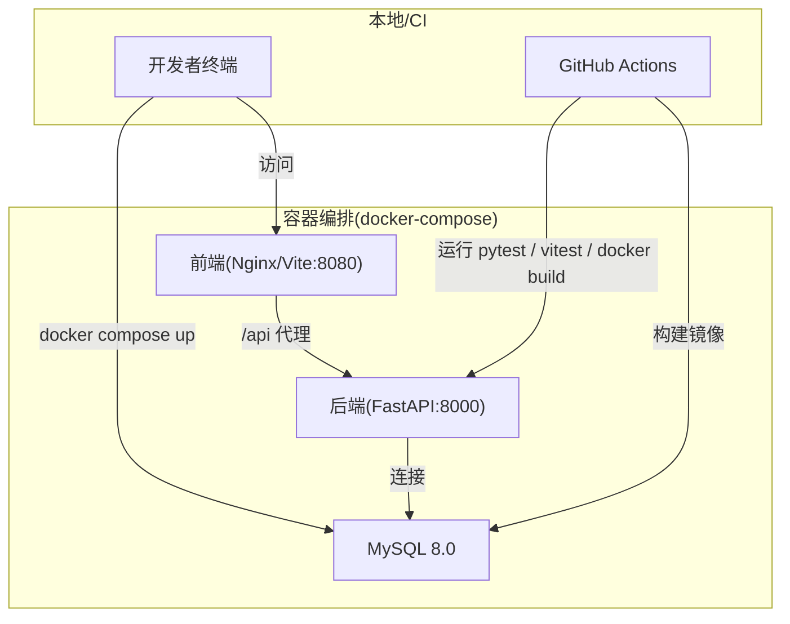
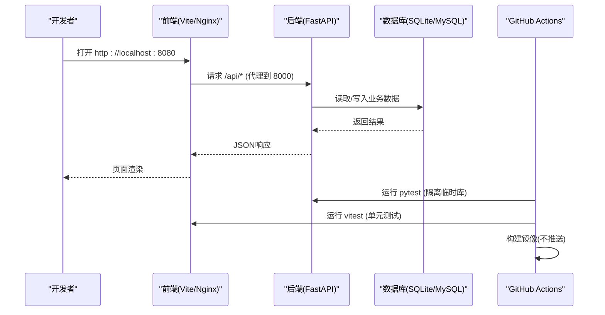
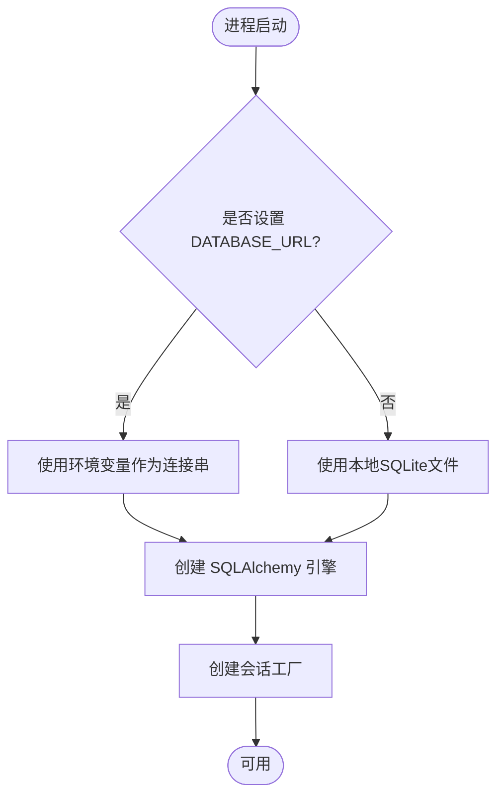
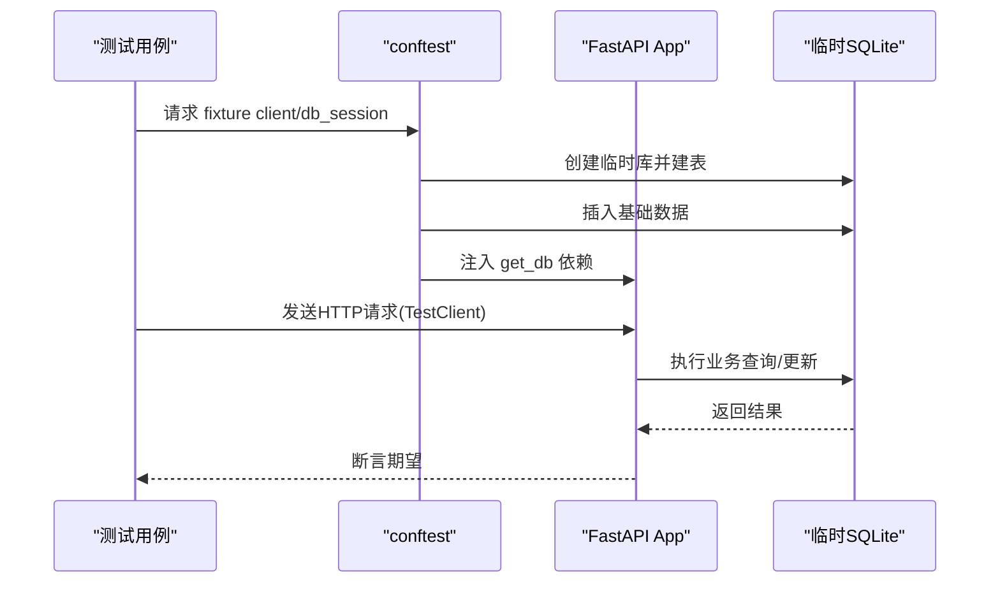
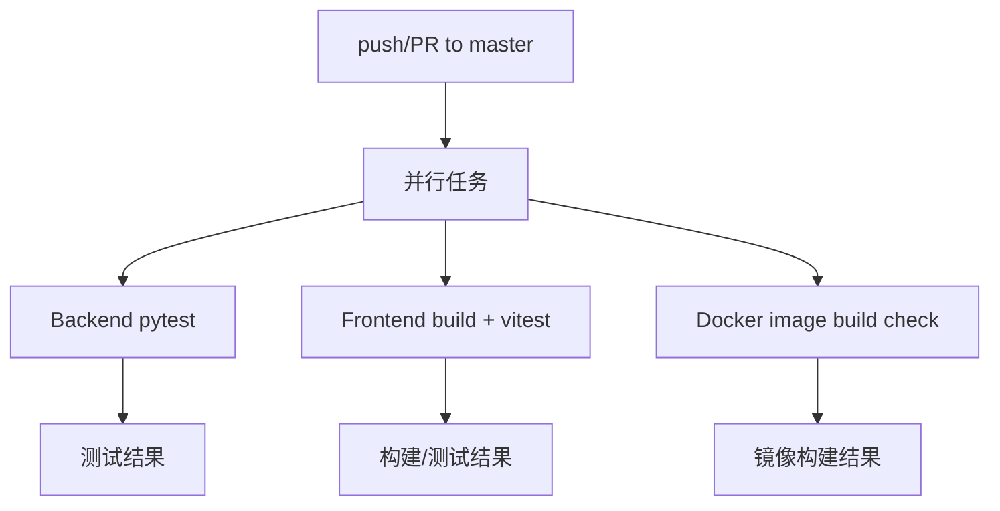
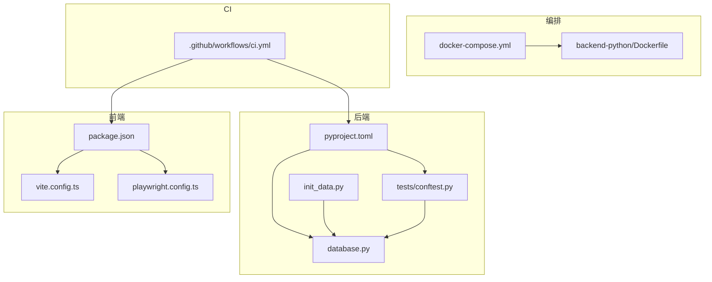

# 测试环境配置

<cite>
**本文引用的文件**
- [docker-compose.yml](file://docker-compose.yml)
- [backend-python/Dockerfile](file://backend-python/Dockerfile)
- [backend-python/pyproject.toml](file://backend-python/pyproject.toml)
- [backend-python/app/database.py](file://backend-python/app/database.py)
- [backend-python/init_data.py](file://backend-python/init_data.py)
- [backend-python/tests/conftest.py](file://backend-python/tests/conftest.py)
- [frontend-vue/package.json](file://frontend-vue/package.json)
- [frontend-vue/vite.config.ts](file://frontend-vue/vite.config.ts)
- [frontend-vue/playwright.config.ts](file://frontend-vue/playwright.config.ts)
- [.github/workflows/ci.yml](file://.github/workflows/ci.yml)
- [README.md](file://README.md)
</cite>

## 目录
1. [简介](#简介)
2. [项目结构](#项目结构)
3. [核心组件](#核心组件)
4. [架构总览](#架构总览)
5. [详细组件分析](#详细组件分析)
6. [依赖关系分析](#依赖关系分析)
7. [性能与负载测试](#性能与负载测试)
8. [故障排查指南](#故障排查指南)
9. [结论](#结论)
10. [附录](#附录)

## 简介
本文件面向WMS系统的测试环境配置，覆盖开发、测试、生产环境的差异与配置管理；文档化基于Docker的容器化测试环境搭建（数据库、缓存、消息队列等依赖服务）；说明测试数据库设置与数据种子准备；提供环境变量与敏感信息管理最佳实践；集成测试覆盖率工具与报告生成；给出性能/负载测试环境与CI/CD流水线中的测试执行与环境准备方法。

## 项目结构
仓库采用前后端分离与容器编排：
- 后端：Python + FastAPI，使用SQLAlchemy，默认SQLite，支持通过环境变量切换MySQL/PostgreSQL
- 前端：Vue 3 + Vite，内置单元测试（Vitest）与E2E（Playwright），开发时代理到后端
- 容器编排：docker-compose 一键启动 MySQL、后端、前端
- CI：GitHub Actions 执行后端pytest、前端构建与vitest、镜像构建校验



图表来源
- [docker-compose.yml:1-46](file://docker-compose.yml#L1-L46)
- [backend-python/Dockerfile:1-27](file://backend-python/Dockerfile#L1-L27)
- [frontend-vue/vite.config.ts:19-27](file://frontend-vue/vite.config.ts#L19-L27)
- [.github/workflows/ci.yml:10-67](file://.github/workflows/ci.yml#L10-L67)

章节来源
- [README.md:66-115](file://README.md#L66-L115)
- [docker-compose.yml:1-46](file://docker-compose.yml#L1-L46)

## 核心组件
- 数据库层：SQLAlchemy 引擎与会话，支持 SQLite（开发零配置）与 MySQL/PostgreSQL（通过 DATABASE_URL）
- 应用层：FastAPI 路由与服务，生命周期内自动建表与种子数据
- 测试层：pytest（后端）、Vitest（前端）、Playwright（E2E）
- 容器层：Dockerfile 与 docker-compose 编排
- CI层：GitHub Actions 多任务并行执行

章节来源
- [backend-python/app/database.py:1-38](file://backend-python/app/database.py#L1-L38)
- [backend-python/Dockerfile:23-27](file://backend-python/Dockerfile#L23-L27)
- [backend-python/pyproject.toml:19-36](file://backend-python/pyproject.toml#L19-L36)
- [frontend-vue/package.json:6-14](file://frontend-vue/package.json#L6-L14)
- [frontend-vue/playwright.config.ts:1-49](file://frontend-vue/playwright.config.ts#L1-L49)
- [.github/workflows/ci.yml:10-67](file://.github/workflows/ci.yml#L10-L67)

## 架构总览
下图展示测试环境的数据流与控制流：前端请求经Vite代理到后端，后端通过SQLAlchemy访问数据库；测试用例通过TestClient或HTTP客户端调用API；CI中各任务独立运行并产出结果。



图表来源
- [frontend-vue/vite.config.ts:19-27](file://frontend-vue/vite.config.ts#L19-L27)
- [backend-python/app/database.py:11-22](file://backend-python/app/database.py#L11-L22)
- [backend-python/tests/conftest.py:21-90](file://backend-python/tests/conftest.py#L21-L90)
- [.github/workflows/ci.yml:10-67](file://.github/workflows/ci.yml#L10-L67)

## 详细组件分析

### 数据库与连接策略
- 开发默认使用SQLite，路径位于后端目录，无需外部依赖
- 通过环境变量 DATABASE_URL 可无缝切换到 MySQL/PostgreSQL
- Docker Compose 中通过服务名 mysql 暴露数据库，后端以 mysql+pymysql 连接



图表来源
- [backend-python/app/database.py:11-24](file://backend-python/app/database.py#L11-L24)
- [docker-compose.yml:22-33](file://docker-compose.yml#L22-L33)

章节来源
- [backend-python/app/database.py:1-38](file://backend-python/app/database.py#L1-L38)
- [docker-compose.yml:5-20](file://docker-compose.yml#L5-L20)

### 测试数据库与数据种子
- 单元测试使用独立的临时SQLite数据库，避免污染开发库
- conftest 中创建基础数据（商品、客户、仓库、库区、库位），并提供 TestClient 注入依赖隔离
- 初始化脚本 init_data.py 在应用启动时（或手动执行）预置示例数据与管理员账号、会计科目集



图表来源
- [backend-python/tests/conftest.py:21-90](file://backend-python/tests/conftest.py#L21-L90)
- [backend-python/init_data.py:12-84](file://backend-python/init_data.py#L12-L84)
- [backend-python/init_data.py:87-101](file://backend-python/init_data.py#L87-L101)
- [backend-python/init_data.py:127-150](file://backend-python/init_data.py#L127-L150)

章节来源
- [backend-python/tests/conftest.py:1-90](file://backend-python/tests/conftest.py#L1-L90)
- [backend-python/init_data.py:1-157](file://backend-python/init_data.py#L1-L157)

### 环境变量与敏感信息管理
- 数据库凭据与名称通过环境变量注入（MYSQL_ROOT_PASSWORD、MYSQL_DATABASE、MYSQL_USER、MYSQL_PASSWORD、DATABASE_URL）
- 建议将 .env 加入 .gitignore，使用 secrets 管理（如 GitHub Secrets）注入到 CI 和部署环境
- 前端通过 VITE_ 前缀的环境变量控制行为（如 base、mock开关等）

章节来源
- [docker-compose.yml:8-12](file://docker-compose.yml#L8-L12)
- [docker-compose.yml:25-28](file://docker-compose.yml#L25-L28)
- [frontend-vue/vite.config.ts:6-12](file://frontend-vue/vite.config.ts#L6-L12)
- [README.md:123-148](file://README.md#L123-L148)

### 容器化测试环境搭建
- 使用 docker-compose 一键启动 MySQL、后端、前端
- 后端镜像基于 python:3.11-slim，安装依赖后启动 uvicorn
- 前端镜像基于 Nginx/Vite，端口映射 8080:80，后端 8000:8000

```mermaid
graph LR
DC["docker-compose.yml"] --> M["mysql:8.0"]
DC --> B["backend-python(Dockerfile)"]
DC --> F["frontend-vue(Dockerfile)"]
B --> |端口| "8000"
F --> |端口| "8080"
B --> |连接| M
```

图表来源
- [docker-compose.yml:1-46](file://docker-compose.yml#L1-L46)
- [backend-python/Dockerfile:1-27](file://backend-python/Dockerfile#L1-L27)

章节来源
- [docker-compose.yml:1-46](file://docker-compose.yml#L1-L46)
- [backend-python/Dockerfile:1-27](file://backend-python/Dockerfile#L1-L27)

### 前端测试与E2E
- 单元测试：Vitest，排除 e2e 与 node_modules
- E2E：Playwright，自动拉起后端与前端（webServer），复用已有服务避免冲突
- 浏览器使用系统Chrome，禁用GPU/shader缓存以提升CI稳定性

章节来源
- [frontend-vue/package.json:6-14](file://frontend-vue/package.json#L6-L14)
- [frontend-vue/vite.config.ts:28-31](file://frontend-vue/vite.config.ts#L28-L31)
- [frontend-vue/playwright.config.ts:1-49](file://frontend-vue/playwright.config.ts#L1-L49)

### CI/CD流水线中的测试执行与环境准备
- 后端：安装依赖后运行 pytest（使用临时SQLite，不连真实数据库）
- 前端：npm ci 安装依赖，构建+类型检查，运行 vitest
- 镜像构建：分别构建前后端镜像（不推送），验证构建流程



图表来源
- [.github/workflows/ci.yml:10-67](file://.github/workflows/ci.yml#L10-L67)

章节来源
- [.github/workflows/ci.yml:1-67](file://.github/workflows/ci.yml#L1-L67)

## 依赖关系分析
- 后端依赖：FastAPI、SQLAlchemy、Pydantic、Alembic、数据库驱动（pymysql/psycopg2）
- 前端依赖：Vue生态、Element Plus、ECharts、Pinia、Vite、TypeScript
- 测试依赖：pytest、httpx、pytest-asyncio、vitest、@playwright/test
- 容器依赖：MySQL 8.0（可选其他RDS/托管数据库）



图表来源
- [backend-python/pyproject.toml:1-36](file://backend-python/pyproject.toml#L1-L36)
- [backend-python/app/database.py:1-38](file://backend-python/app/database.py#L1-L38)
- [backend-python/init_data.py:1-157](file://backend-python/init_data.py#L1-L157)
- [backend-python/tests/conftest.py:1-90](file://backend-python/tests/conftest.py#L1-L90)
- [frontend-vue/package.json:1-34](file://frontend-vue/package.json#L1-L34)
- [frontend-vue/vite.config.ts:1-34](file://frontend-vue/vite.config.ts#L1-L34)
- [frontend-vue/playwright.config.ts:1-49](file://frontend-vue/playwright.config.ts#L1-L49)
- [docker-compose.yml:1-46](file://docker-compose.yml#L1-L46)
- [backend-python/Dockerfile:1-27](file://backend-python/Dockerfile#L1-L27)
- [.github/workflows/ci.yml:1-67](file://.github/workflows/ci.yml#L1-L67)

章节来源
- [backend-python/pyproject.toml:1-36](file://backend-python/pyproject.toml#L1-L36)
- [frontend-vue/package.json:1-34](file://frontend-vue/package.json#L1-L34)
- [docker-compose.yml:1-46](file://docker-compose.yml#L1-L46)
- [.github/workflows/ci.yml:1-67](file://.github/workflows/ci.yml#L1-L67)

## 性能与负载测试
- 单测与集成测试已具备隔离数据库与并发安全设计（行级锁、条件更新、重试），适合扩展性能测试
- 建议在测试环境引入压测工具（如 k6、wrk、locust）对关键接口进行负载测试
- 压测目标：入库/出库/波次拣货等高并发场景，关注吞吐、延迟、错误率
- 指标采集：结合数据库慢查询日志、应用监控（APM）定位瓶颈
- 资源限制：在容器环境中为后端/数据库设置CPU/内存上限，模拟生产约束

[本节为通用指导，不直接分析具体文件]

## 故障排查指南
- 数据库连接失败
  - 检查 DATABASE_URL 是否正确，MySQL 服务是否健康
  - 确认 docker-compose 中 mysql 服务状态与端口映射
- 测试用例失败
  - 确认 conftest 中临时库是否成功创建与清理
  - 检查依赖注入是否生效（get_db 覆盖）
- 前端代理问题
  - 确认 Vite 代理目标端口与后端一致
  - 检查 CORS/跨域与路径前缀
- CI 构建失败
  - 检查 Python/Node 版本与缓存
  - 确认依赖源可达（国内镜像）

章节来源
- [backend-python/tests/conftest.py:21-90](file://backend-python/tests/conftest.py#L21-L90)
- [frontend-vue/vite.config.ts:19-27](file://frontend-vue/vite.config.ts#L19-L27)
- [docker-compose.yml:5-20](file://docker-compose.yml#L5-L20)
- [backend-python/Dockerfile:10-21](file://backend-python/Dockerfile#L10-L21)

## 结论
本项目提供了完善的测试环境与自动化能力：容器化一键启动、隔离的测试数据库、完整的单元/E2E测试、以及CI流水线保障质量。通过环境变量与密钥管理实现环境差异化管理，便于从开发到生产的平滑演进。建议在生产环境引入缓存与消息队列等中间件，并通过压测与监控持续优化性能与稳定性。

[本节为总结性内容，不直接分析具体文件]

## 附录

### 环境差异与配置管理要点
- 开发：默认SQLite，零配置；可通过 DATABASE_URL 切换至MySQL
- 测试：容器化MySQL + 后端 + 前端；测试使用临时SQLite
- 生产：建议使用托管数据库与缓存/消息队列；通过环境变量与密钥管理服务注入敏感信息

章节来源
- [backend-python/app/database.py:5-10](file://backend-python/app/database.py#L5-L10)
- [docker-compose.yml:22-33](file://docker-compose.yml#L22-L33)
- [README.md:123-148](file://README.md#L123-L148)

### 测试覆盖率工具集成与报告生成
- 后端：可在 pytest 命令中加入覆盖率插件（例如 coverage），输出HTML/JSON报告
- 前端：可在 vitest 中启用覆盖率收集，生成覆盖率报告
- CI：可将覆盖率报告上传至制品库或发布到页面，便于追踪趋势

[本节为通用指导，不直接分析具体文件]

### 缓存与消息队列集成建议
- 缓存：Redis 可作为热点数据缓存（库存快照、会话、限流）
- 消息队列：RabbitMQ/Kafka 用于异步解耦（如发货通知、财务入账）
- 编排：在 docker-compose 中添加相应服务，并在后端通过环境变量接入

[本节为通用指导，不直接分析具体文件]