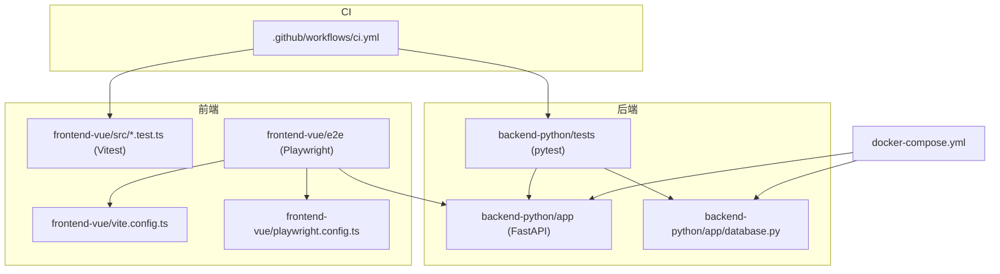
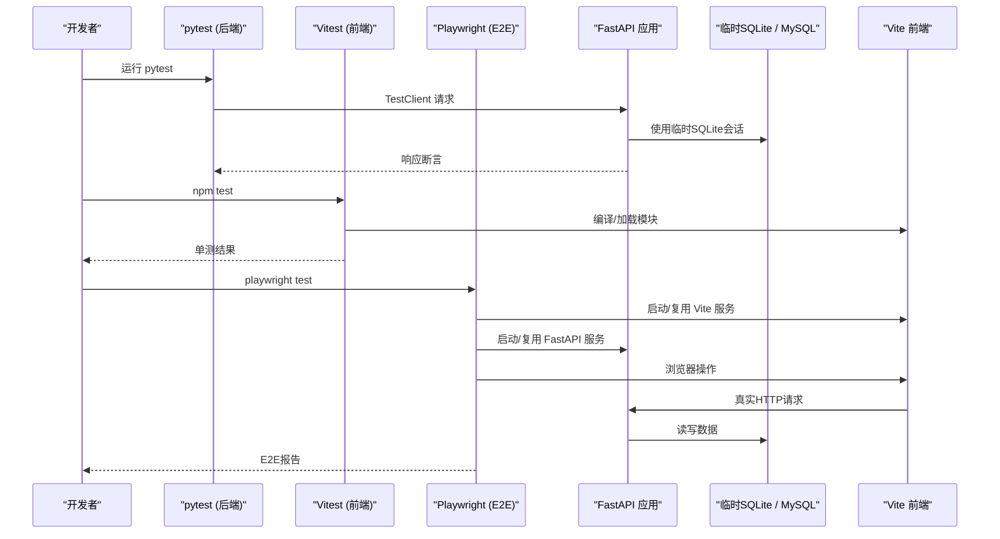
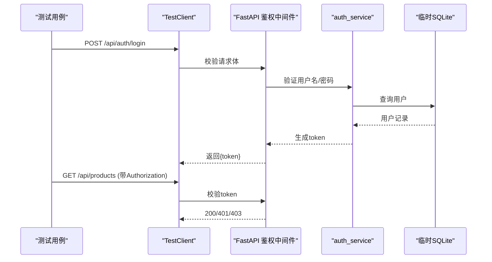
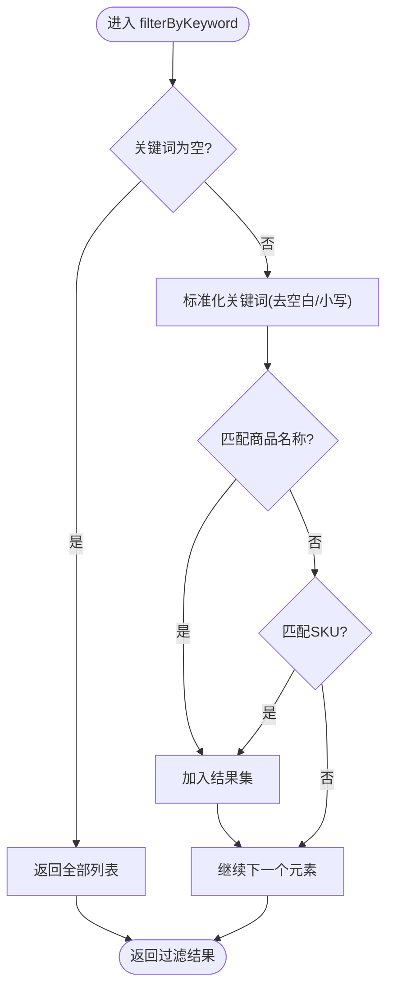
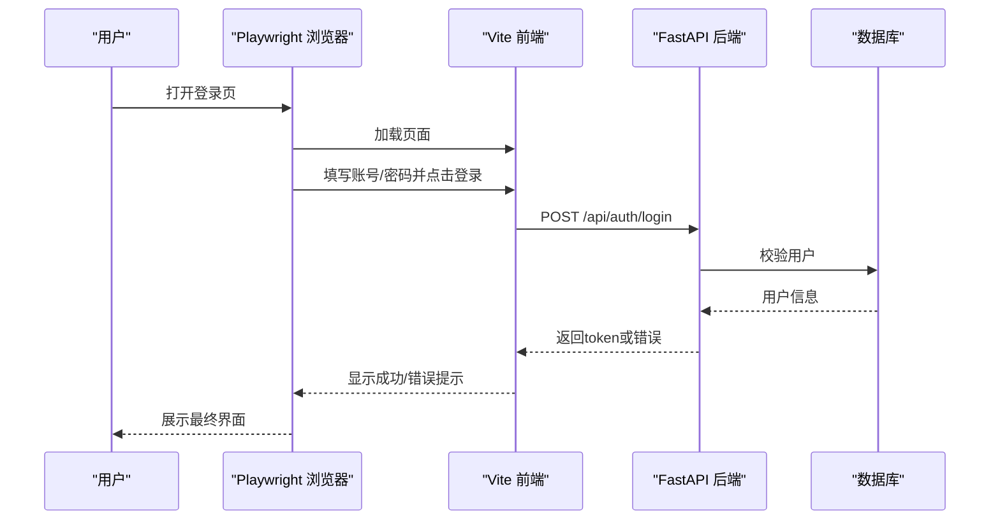
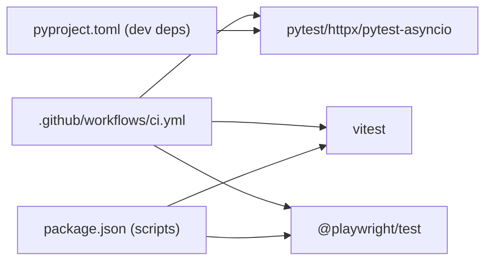

# 测试策略

<cite>
**本文引用的文件**
- [backend-python/tests/conftest.py](file://backend-python/tests/conftest.py)
- [backend-python/tests/test_api_auth.py](file://backend-python/tests/test_api_auth.py)
- [backend-python/app/database.py](file://backend-python/app/database.py)
- [backend-python/pyproject.toml](file://backend-python/pyproject.toml)
- [frontend-vue/vite.config.ts](file://frontend-vue/vite.config.ts)
- [frontend-vue/playwright.config.ts](file://frontend-vue/playwright.config.ts)
- [frontend-vue/package.json](file://frontend-vue/package.json)
- [frontend-vue/src/utils/inventory.test.ts](file://frontend-vue/src/utils/inventory.test.ts)
- [frontend-vue/e2e/login-loading.spec.ts](file://frontend-vue/e2e/login-loading.spec.ts)
- [.github/workflows/ci.yml](file://.github/workflows/ci.yml)
- [docker-compose.yml](file://docker-compose.yml)
</cite>

## 目录
1. [简介](#简介)
2. [项目结构](#项目结构)
3. [核心组件](#核心组件)
4. [架构总览](#架构总览)
5. [详细组件分析](#详细组件分析)
6. [依赖关系分析](#依赖关系分析)
7. [性能考虑](#性能考虑)
8. [故障排查指南](#故障排查指南)
9. [结论](#结论)
10. [附录](#附录)

## 简介
本测试策略面向WMS系统（前后端分离），覆盖单元测试、集成测试与端到端测试，明确各层测试的边界、执行方式与数据准备。后端基于FastAPI + SQLAlchemy，使用pytest运行；前端基于Vue + Vite，使用Vitest进行单元/组件级测试，使用Playwright进行E2E测试。文档同时说明覆盖率要求、持续集成流程、并发与数据库测试注意事项，以及性能与负载测试策略。

## 项目结构
- 后端测试位于 backend-python/tests，使用 pytest，通过临时SQLite隔离数据库，避免影响开发库。
- 前端测试分为两类：
  - 单元测试：位于 frontend-vue/src 下的 *.test.ts，由 Vitest 收集并执行。
  - E2E测试：位于 frontend-vue/e2e，由 Playwright 驱动浏览器，自动拉起前后端服务或复用本地服务。
- CI流水线在 .github/workflows/ci.yml 中定义，分别执行后端pytest、前端构建+vitest、镜像构建校验。
- 本地一键启动使用 docker-compose.yml，包含MySQL、后端、前端服务。

图表来源
- [.github/workflows/ci.yml:1-67](file://.github/workflows/ci.yml#L1-L67)
- [backend-python/tests/conftest.py:1-90](file://backend-python/tests/conftest.py#L1-L90)
- [frontend-vue/vite.config.ts:1-34](file://frontend-vue/vite.config.ts#L1-L34)
- [frontend-vue/playwright.config.ts:1-49](file://frontend-vue/playwright.config.ts#L1-L49)
- [docker-compose.yml:1-46](file://docker-compose.yml#L1-L46)

章节来源
- [backend-python/tests/conftest.py:1-90](file://backend-python/tests/conftest.py#L1-L90)
- [frontend-vue/vite.config.ts:1-34](file://frontend-vue/vite.config.ts#L1-L34)
- [frontend-vue/playwright.config.ts:1-49](file://frontend-vue/playwright.config.ts#L1-L49)
- [.github/workflows/ci.yml:1-67](file://.github/workflows/ci.yml#L1-L67)
- [docker-compose.yml:1-46](file://docker-compose.yml#L1-L46)

## 核心组件
- 后端测试夹具与数据准备：conftest.py 提供 db_session 与 client 两个关键fixture，使用独立临时SQLite，注入基础主数据（商品、仓库、库区、库位等），并通过 dependency_overrides 将 FastAPI 的 get_db 指向临时会话，确保API测试不触碰真实数据库。
- 前端单元测试：Vitest 配置在 vite.config.ts 中，排除 e2e 目录，仅收集 src 下测试；示例用例覆盖库存筛选逻辑。
- 前端E2E：Playwright 配置在 playwright.config.ts，自动拉起后端与前端服务（或复用本地进程），使用 Chrome channel 并在CI禁用GPU/shader缓存以提升稳定性。
- CI：分别运行后端pytest、前端构建与vitest，并校验Docker镜像可构建。

章节来源
- [backend-python/tests/conftest.py:1-90](file://backend-python/tests/conftest.py#L1-L90)
- [frontend-vue/vite.config.ts:1-34](file://frontend-vue/vite.config.ts#L1-L34)
- [frontend-vue/playwright.config.ts:1-49](file://frontend-vue/playwright.config.ts#L1-L49)
- [.github/workflows/ci.yml:1-67](file://.github/workflows/ci.yml#L1-L67)

## 架构总览
下图展示测试在不同环境中的调用链路与数据流：

图表来源
- [backend-python/tests/conftest.py:21-90](file://backend-python/tests/conftest.py#L21-L90)
- [frontend-vue/playwright.config.ts:8-48](file://frontend-vue/playwright.config.ts#L8-L48)
- [frontend-vue/vite.config.ts:19-31](file://frontend-vue/vite.config.ts#L19-L31)
- [backend-python/app/database.py:1-38](file://backend-python/app/database.py#L1-L38)

## 详细组件分析

### 后端单元测试（pytest）
- 目标：验证业务路由鉴权、权限控制、异常分支等，不依赖外部数据库。
- 数据准备：
  - conftest.py 创建临时SQLite，建表并插入基础数据（商品、客户、仓库、库区、库位）。
  - client fixture 通过 dependency_overrides 替换 get_db，保证所有API请求走临时库。
- 典型用例：
  - 未登录访问业务接口返回401。
  - 携带无效token返回401。
  - 登录后正常访问受保护接口返回200。
  - 非管理员角色访问用户管理接口返回403。
- 并发与事务：
  - SQLite 通过 check_same_thread=False 支持多线程；若后续引入异步测试，需结合 pytest-asyncio 与事件循环隔离。
  - 每个测试应使用独立fixture/session，避免共享状态。
- 覆盖率建议：
  - 核心路由与鉴权逻辑建议达到较高覆盖率（如≥80%），重点覆盖鉴权失败、权限不足、参数校验失败等分支。

章节来源
- [backend-python/tests/conftest.py:21-90](file://backend-python/tests/conftest.py#L21-L90)
- [backend-python/tests/test_api_auth.py:1-63](file://backend-python/tests/test_api_auth.py#L1-L63)
- [backend-python/app/database.py:1-38](file://backend-python/app/database.py#L1-L38)
- [backend-python/pyproject.toml:19-36](file://backend-python/pyproject.toml#L19-L36)

#### 鉴权测试序列图

图表来源
- [backend-python/tests/test_api_auth.py:16-63](file://backend-python/tests/test_api_auth.py#L16-L63)
- [backend-python/tests/conftest.py:55-90](file://backend-python/tests/conftest.py#L55-L90)

### 前端单元测试（Vitest）
- 目标：验证纯函数与工具逻辑（如库存筛选、阈值判断、类名计算等）。
- 配置要点：
  - vite.config.ts 中 test.exclude 排除 e2e 与 node_modules/dist，确保只收集 src 下的测试。
  - 使用 describe/it/expect 组织用例，便于按功能域分组。
- 最佳实践：
  - 为每个工具函数编写边界用例（空输入、默认值、阈值边界）。
  - 使用工厂函数构造测试数据，减少重复。
  - 对网络相关逻辑使用 mock 或拦截器，避免真实请求。

章节来源
- [frontend-vue/vite.config.ts:28-31](file://frontend-vue/vite.config.ts#L28-L31)
- [frontend-vue/src/utils/inventory.test.ts:1-116](file://frontend-vue/src/utils/inventory.test.ts#L1-L116)
- [frontend-vue/package.json:6-14](file://frontend-vue/package.json#L6-L14)

#### 库存筛选逻辑流程图

图表来源
- [frontend-vue/src/utils/inventory.test.ts:60-87](file://frontend-vue/src/utils/inventory.test.ts#L60-L87)

### 端到端测试（Playwright）
- 目标：验证关键用户流程（如登录、唤醒进度、错误提示、重试）在真实浏览器环境下的行为。
- 配置要点：
  - playwright.config.ts 设置 testDir 为 e2e，启用 trace on-first-retry，超时与重试策略区分CI与本地。
  - webServer 自动拉起后端（uvicorn）和前端（vite dev），支持 reuseExistingServer 避免端口冲突。
  - 使用系统Chrome通道，并在CI禁用GPU与shader缓存提升稳定性。
- 测试设计：
  - 通过 page.route 打桩 /api/*，模拟冷启动延迟、凭据错误、服务不可达等场景。
  - 断言UI状态（状态灯、进度条、提示文案）、交互（按钮禁用/启用）、错误恢复（重试后成功）。
- 维护建议：
  - 将常见URL常量集中管理，便于统一修改。
  - 对复杂交互封装步骤函数，提高可读性与复用性。
  - 在CI开启trace以便失败时定位问题。

章节来源
- [frontend-vue/playwright.config.ts:1-49](file://frontend-vue/playwright.config.ts#L1-L49)
- [frontend-vue/e2e/login-loading.spec.ts:1-116](file://frontend-vue/e2e/login-loading.spec.ts#L1-L116)

#### 登录E2E时序图

图表来源
- [frontend-vue/e2e/login-loading.spec.ts:26-105](file://frontend-vue/e2e/login-loading.spec.ts#L26-L105)
- [frontend-vue/playwright.config.ts:32-48](file://frontend-vue/playwright.config.ts#L32-L48)

### 测试环境与数据准备
- 后端：
  - 使用临时SQLite，避免污染开发库；基础数据包括商品、客户、仓库、库区、库位等。
  - 通过 dependency_overrides 将 FastAPI 的 get_db 指向临时会话，确保API测试完全隔离。
- 前端：
  - Vitest 仅收集 src 下的测试，排除 e2e。
  - 可通过环境变量注入 base 路径，适配不同部署模式。
- 全栈环境：
  - docker-compose.yml 提供MySQL、后端、前端的一键启动，便于本地联调与E2E。
  - CI中通过 webServer 自动拉起前后端，或在本地复用已有服务。

章节来源
- [backend-python/tests/conftest.py:21-90](file://backend-python/tests/conftest.py#L21-L90)
- [backend-python/app/database.py:1-38](file://backend-python/app/database.py#L1-L38)
- [frontend-vue/vite.config.ts:6-31](file://frontend-vue/vite.config.ts#L6-L31)
- [frontend-vue/playwright.config.ts:32-48](file://frontend-vue/playwright.config.ts#L32-L48)
- [docker-compose.yml:1-46](file://docker-compose.yml#L1-L46)

## 依赖关系分析
- 后端测试依赖：
  - pytest、httpx、pytest-asyncio（可选）作为开发依赖。
  - 通过 pyproject.toml 的 optional-dependencies 安装。
- 前端测试依赖：
  - vitest 用于单元测试，@playwright/test 用于E2E。
  - package.json scripts 提供 test、test:watch、test:e2e 命令。
- CI依赖：
  - 后端：Python 3.11，安装 .[dev] 后运行 pytest。
  - 前端：Node 18，npm ci 安装依赖，执行 build 与 test。

图表来源
- [backend-python/pyproject.toml:19-36](file://backend-python/pyproject.toml#L19-L36)
- [frontend-vue/package.json:6-32](file://frontend-vue/package.json#L6-L32)
- [.github/workflows/ci.yml:10-47](file://.github/workflows/ci.yml#L10-L47)

章节来源
- [backend-python/pyproject.toml:19-36](file://backend-python/pyproject.toml#L19-L36)
- [frontend-vue/package.json:6-32](file://frontend-vue/package.json#L6-L32)
- [.github/workflows/ci.yml:10-47](file://.github/workflows/ci.yml#L10-L47)

## 性能考虑
- 后端：
  - 使用临时SQLite进行单元测试，IO开销低，适合快速反馈。
  - 若引入异步测试，注意事件循环与线程安全，必要时使用隔离的测试客户端。
- 前端：
  - Vitest 单测不涉及浏览器，执行速度快；E2E使用真实浏览器，建议在CI中限制并行度与重试次数。
  - 通过 page.route 打桩减少外部依赖波动，提高稳定性。
- 负载与性能测试：
  - 建议使用专业工具（如 k6、Locust）对关键API进行压测，关注QPS、RT、错误率。
  - 针对登录、库存查询等高并发接口设计基准场景，评估扩容策略。

## 故障排查指南
- 后端测试失败：
  - 检查 conftest.py 中临时库是否成功创建与清理。
  - 确认 dependency_overrides 是否正确覆盖 get_db。
  - 查看鉴权流程是否按预期返回401/403/200。
- 前端单测失败：
  - 确认 vite.config.ts 的 test.exclude 未误排除目标测试。
  - 检查测试数据构造是否与实现一致。
- E2E失败：
  - 检查 playwright.config.ts 的 webServer 是否能正确拉起前后端。
  - 在CI中启用 trace 并查看失败截图/视频。
  - 通过 page.route 逐步缩小问题范围（健康检查、登录接口等）。

章节来源
- [backend-python/tests/conftest.py:21-90](file://backend-python/tests/conftest.py#L21-L90)
- [frontend-vue/playwright.config.ts:8-48](file://frontend-vue/playwright.config.ts#L8-L48)
- [frontend-vue/e2e/login-loading.spec.ts:32-105](file://frontend-vue/e2e/login-loading.spec.ts#L32-L105)

## 结论
本测试策略以“隔离、稳定、可维护”为核心原则：后端使用临时SQLite与依赖注入实现完全隔离；前端通过Vitest与Playwright分层保障质量；CI流水线自动化执行关键测试并校验构建产物。建议逐步完善覆盖率指标、引入性能与负载测试，并持续优化E2E用例的可读性与稳定性。

## 附录
- 覆盖率要求：
  - 建议后端核心路由与鉴权逻辑覆盖率≥80%，前端工具函数覆盖率≥90%。
  - 可在CI中集成覆盖率统计（如 pytest-cov、vitest coverage），并设置阈值门禁。
- 持续集成流程：
  - push/PR到master触发：后端pytest、前端build+vitest、Docker镜像构建校验。
  - 可根据需要扩展E2E任务（例如在专用环境运行）。
- 并发与数据库测试特殊处理：
  - 后端：每个测试使用独立fixture/session，避免共享状态；SQLite需关闭线程检查或使用连接池。
  - 前端E2E：合理设置 retries 与 timeout，避免偶发失败导致阻塞；使用trace定位问题。
- 性能与负载测试策略：
  - 使用k6/Locust对关键接口进行压测，关注RT、吞吐、错误率。
  - 针对登录、库存查询等热点接口建立基准场景，定期回归。