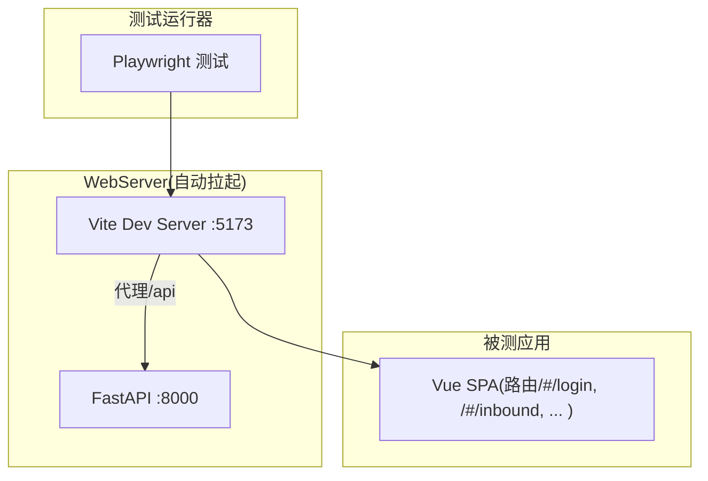
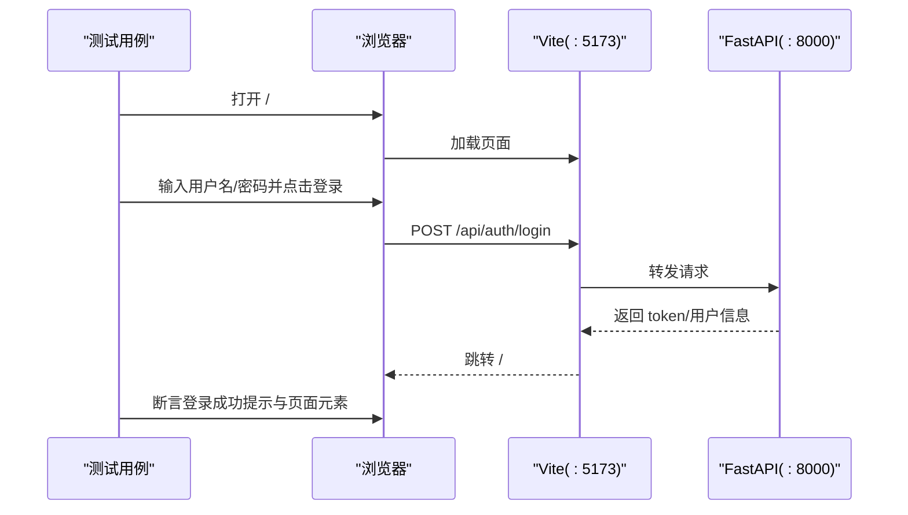
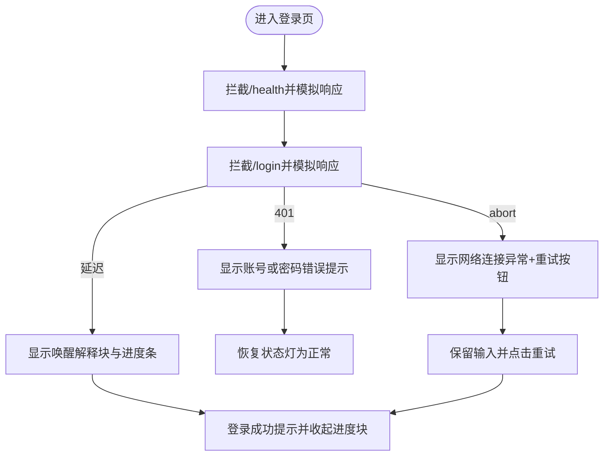
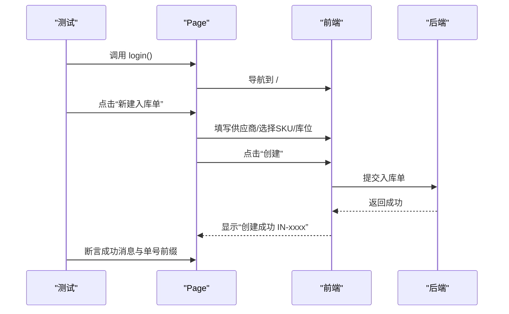
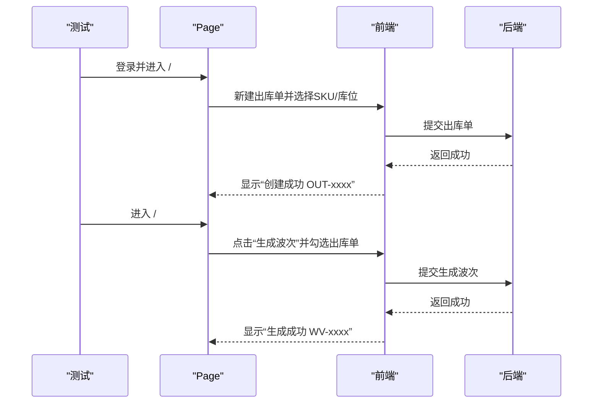
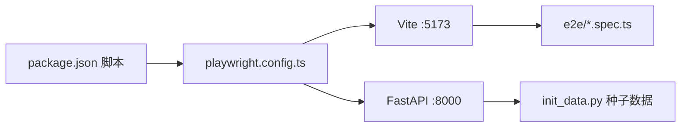

# 端到端测试

<cite>
**本文引用的文件**
- [frontend-vue/playwright.config.ts](file://frontend-vue/playwright.config.ts)
- [frontend-vue/e2e/helpers.ts](file://frontend-vue/e2e/helpers.ts)
- [frontend-vue/e2e/login-loading.spec.ts](file://frontend-vue/e2e/login-loading.spec.ts)
- [frontend-vue/e2e/inbound.spec.ts](file://frontend-vue/e2e/inbound.spec.ts)
- [frontend-vue/e2e/returns.spec.ts](file://frontend-vue/e2e/returns.spec.ts)
- [frontend-vue/e2e/wave.spec.ts](file://frontend-vue/e2e/wave.spec.ts)
- [frontend-vue/e2e/bi.spec.ts](file://frontend-vue/e2e/bi.spec.ts)
- [frontend-vue/package.json](file://frontend-vue/package.json)
- [backend-python/init_data.py](file://backend-python/init_data.py)
- [README.md](file://README.md)
- [.github/workflows/ci.yml](file://.github/workflows/ci.yml)
</cite>

## 目录
1. [简介](#简介)
2. [项目结构](#项目结构)
3. [核心组件](#核心组件)
4. [架构总览](#架构总览)
5. [详细组件分析](#详细组件分析)
6. [依赖关系分析](#依赖关系分析)
7. [性能与并行优化](#性能与并行优化)
8. [故障排查指南](#故障排查指南)
9. [结论](#结论)
10. [附录](#附录)

## 简介
本文件面向 WMS 系统前端，提供基于 Playwright 的端到端（E2E）测试文档。内容覆盖：
- 测试框架配置与使用：浏览器自动化、页面交互、用户流程模拟
- 关键业务场景用例：登录流程、入库操作、退货处理、波次拣货、BI 看板
- 测试数据准备与管理策略：测试账户与种子数据初始化
- 测试环境配置与并行执行优化
- 截图与视频录制、错误调试与测试报告生成
- 跨浏览器兼容性与移动端测试支持说明

## 项目结构
前端 E2E 测试位于 frontend-vue/e2e，统一由 Playwright 驱动；后端 FastAPI 服务在测试时自动拉起；Playwright 通过 webServer 同时启动前后端，并在本地端口提供服务。

图表来源
- [frontend-vue/playwright.config.ts:8-47](file://frontend-vue/playwright.config.ts#L8-L47)
- [frontend-vue/package.json:6-14](file://frontend-vue/package.json#L6-L14)

章节来源
- [frontend-vue/playwright.config.ts:1-49](file://frontend-vue/playwright.config.ts#L1-L49)
- [frontend-vue/package.json:1-34](file://frontend-vue/package.json#L1-L34)
- [README.md:121-158](file://README.md#L121-L158)

## 核心组件
- 测试入口与脚本：npm run test:e2e 触发 Playwright 执行
- 全局配置：playwright.config.ts 定义测试目录、超时、重试、Reporter、BaseURL、设备、webServer 等
- 登录辅助：helpers.ts 提供 login(page) 封装，统一先登录再进入业务页
- 业务用例：
  - 登录加载体验回归：login-loading.spec.ts
  - 入库正向流程：inbound.spec.ts
  - 退货正向流程：returns.spec.ts
  - 波次拣货（含前置出库单）：wave.spec.ts
  - BI 工作台面板切换、筛选联动、Modal 关闭方式、样式隔离：bi.spec.ts

章节来源
- [frontend-vue/package.json:6-14](file://frontend-vue/package.json#L6-L14)
- [frontend-vue/playwright.config.ts:8-47](file://frontend-vue/playwright.config.ts#L8-L47)
- [frontend-vue/e2e/helpers.ts:1-14](file://frontend-vue/e2e/helpers.ts#L1-L14)
- [frontend-vue/e2e/login-loading.spec.ts:1-116](file://frontend-vue/e2e/login-loading.spec.ts#L1-L116)
- [frontend-vue/e2e/inbound.spec.ts:1-38](file://frontend-vue/e2e/inbound.spec.ts#L1-L38)
- [frontend-vue/e2e/returns.spec.ts:1-38](file://frontend-vue/e2e/returns.spec.ts#L1-L38)
- [frontend-vue/e2e/wave.spec.ts:1-52](file://frontend-vue/e2e/wave.spec.ts#L1-L52)
- [frontend-vue/e2e/bi.spec.ts:1-110](file://frontend-vue/e2e/bi.spec.ts#L1-L110)

## 架构总览
下图展示一次典型 E2E 用例的执行路径：测试驱动浏览器访问前端，前端通过 Vite 开发服务器请求后端 API，后端返回业务数据或鉴权结果，前端渲染并反馈成功提示，测试断言 UI 状态。

图表来源
- [frontend-vue/playwright.config.ts:32-47](file://frontend-vue/playwright.config.ts#L32-L47)
- [frontend-vue/e2e/helpers.ts:7-13](file://frontend-vue/e2e/helpers.ts#L7-L13)
- [frontend-vue/e2e/login-loading.spec.ts:26-36](file://frontend-vue/e2e/login-loading.spec.ts#L26-L36)

## 详细组件分析

### 登录流程与加载体验回归
- 目标：验证登录页在冷启动、网络异常、凭据错误等场景下的用户体验与健壮性
- 关键点：
  - 使用 page.route 拦截 /api/health 与 /api/auth/login，模拟延迟、成功、失败、不可达等响应
  - 断言顶部状态灯文案、进度条、按钮禁用态、错误提示块与重试入口
  - 修改输入后旧错误提示应自动消失
- 参考实现路径：[login-loading.spec.ts:1-116](file://frontend-vue/e2e/login-loading.spec.ts#L1-L116)

图表来源
- [frontend-vue/e2e/login-loading.spec.ts:32-115](file://frontend-vue/e2e/login-loading.spec.ts#L32-L115)

章节来源
- [frontend-vue/e2e/login-loading.spec.ts:1-116](file://frontend-vue/e2e/login-loading.spec.ts#L1-L116)

### 入库正向流程
- 目标：创建入库单，选择供应商、商品、库位并提交，断言成功提示与单号前缀
- 关键点：
  - 先调用 helpers.login 完成登录
  - 等待“新建入库单”按钮可见后点击
  - 通过 Element Plus 下拉选择 SKU-001 与库位 A-01-01
  - 提交后断言 .el-message--success 包含“创建成功”和“IN-”
- 参考实现路径：[inbound.spec.ts:1-38](file://frontend-vue/e2e/inbound.spec.ts#L1-L38)

图表来源
- [frontend-vue/e2e/inbound.spec.ts:10-37](file://frontend-vue/e2e/inbound.spec.ts#L10-L37)
- [frontend-vue/e2e/helpers.ts:7-13](file://frontend-vue/e2e/helpers.ts#L7-L13)

章节来源
- [frontend-vue/e2e/inbound.spec.ts:1-38](file://frontend-vue/e2e/inbound.spec.ts#L1-L38)

### 退货正向流程
- 目标：创建退货单，选择客户、商品、库位并提交，断言成功提示与单号前缀
- 关键点：
  - 默认退货来源为 FBA，保持默认即可
  - 选择客户“领星科技”、商品“SKU-001”、库位“A-01-01”
  - 提交后断言成功消息包含“RT-”
- 参考实现路径：[returns.spec.ts:1-38](file://frontend-vue/e2e/returns.spec.ts#L1-L38)

章节来源
- [frontend-vue/e2e/returns.spec.ts:1-38](file://frontend-vue/e2e/returns.spec.ts#L1-L38)

### 波次拣货（含前置出库单）
- 目标：先创建一张待拣出库单，再生成波次并勾选该出库单，断言生成成功与单号前缀
- 关键点：
  - 步骤一：进入 /#/outbound，新建出库单，选择商品与库位，提交并断言“OUT-”
  - 步骤二：进入 /#/waves，点击“生成波次”，勾选列表首项，提交并断言“WV-”
- 参考实现路径：[wave.spec.ts:1-52](file://frontend-vue/e2e/wave.spec.ts#L1-L52)

图表来源
- [frontend-vue/e2e/wave.spec.ts:10-51](file://frontend-vue/e2e/wave.spec.ts#L10-L51)

章节来源
- [frontend-vue/e2e/wave.spec.ts:1-52](file://frontend-vue/e2e/wave.spec.ts#L1-L52)

### BI 看板（五面板切换、筛选联动、Modal 关闭、样式隔离）
- 目标：验证 BI 工作台各面板图表渲染、筛选联动、经营财务真实数据、Modal 三种关闭方式、路由重定向与样式隔离
- 关键点：
  - 收集 console error 与 pageerror，用例末尾断言为空
  - 依次切换五个面板，每个面板至少渲染两张图表
  - 切换时间与仓库筛选，图表数量保持不变
  - Modal 支持 ×、ESC、遮罩关闭，且点卡片内部不关闭
  - 旧 /executive 重定向至 /bi，主站其他页面无 .bi-scope 残留
- 参考实现路径：[bi.spec.ts:1-110](file://frontend-vue/e2e/bi.spec.ts#L1-L110)

章节来源
- [frontend-vue/e2e/bi.spec.ts:1-110](file://frontend-vue/e2e/bi.spec.ts#L1-L110)

## 依赖关系分析
- 测试脚本依赖：package.json 中 scripts.test:e2e 指向 playwright test
- 运行期依赖：
  - webServer 自动拉起后端 FastAPI(:8000) 与前端 Vite(:5173)
  - 前端通过 /api 代理到后端
- 数据依赖：
  - init_data.py 在启动时预置示例数据（商品、客户、仓库、库区、库位）
  - 默认管理员 admin/admin123 由 init_admin 创建

图表来源
- [frontend-vue/package.json:6-14](file://frontend-vue/package.json#L6-L14)
- [frontend-vue/playwright.config.ts:32-47](file://frontend-vue/playwright.config.ts#L32-L47)
- [backend-python/init_data.py:12-100](file://backend-python/init_data.py#L12-L100)

章节来源
- [frontend-vue/package.json:1-34](file://frontend-vue/package.json#L1-L34)
- [frontend-vue/playwright.config.ts:1-49](file://frontend-vue/playwright.config.ts#L1-L49)
- [backend-python/init_data.py:1-157](file://backend-python/init_data.py#L1-L157)

## 性能与并行优化
- 并行执行：
  - 当前配置 fullyParallel: false，适合稳定回归；如需加速可改为 true 并结合 --workers 控制并发
- 重试机制：
  - CI 环境下 retries: 1，本地 0，避免不稳定用例影响质量
- 超时设置：
  - 全局 timeout: 30_000ms；部分断言使用自定义 timeout（如 10_000ms）
- 浏览器启动参数：
  - 禁用沙箱/GPU/Shader Cache，提升 CI 稳定性
- 服务复用：
  - reuseExistingServer: !process.env.CI，本地复用已启动服务，减少启动开销
- 建议：
  - 将耗时较重的 BI 用例单独分组，配合 --grep 选择性执行
  - 结合 --reporter html/json 输出报告，便于定位慢用例

章节来源
- [frontend-vue/playwright.config.ts:8-31](file://frontend-vue/playwright.config.ts#L8-L31)
- [frontend-vue/e2e/bi.spec.ts:22-53](file://frontend-vue/e2e/bi.spec.ts#L22-L53)

## 故障排查指南
- 登录失败或服务不可达：
  - 检查 webServer 是否成功拉起后端与前端（端口 8000/5173）
  - 使用 page.route 模拟健康检查与登录接口，快速定位是网络还是业务问题
  - 参考：[login-loading.spec.ts:32-115](file://frontend-vue/e2e/login-loading.spec.ts#L32-L115)
- 元素未找到或交互失败：
  - 确认 Element Plus 组件类名与选择器（如 .el-select__wrapper、.el-select-dropdown__item）
  - 增加等待条件（toBeVisible、toHaveText），避免竞态
- 控制台报错：
  - 在 BI 用例中已内置 console/pageerror 收集，可在失败时查看具体错误
  - 参考：[bi.spec.ts:14-20](file://frontend-vue/e2e/bi.spec.ts#L14-L20)
- 数据不一致：
  - 确认 init_data.py 已执行，确保 SKU、库位、客户等种子数据存在
  - 参考：[init_data.py:12-100](file://backend-python/init_data.py#L12-L100)

章节来源
- [frontend-vue/e2e/login-loading.spec.ts:32-115](file://frontend-vue/e2e/login-loading.spec.ts#L32-L115)
- [frontend-vue/e2e/bi.spec.ts:14-20](file://frontend-vue/e2e/bi.spec.ts#L14-L20)
- [backend-python/init_data.py:12-100](file://backend-python/init_data.py#L12-L100)

## 结论
本项目采用 Playwright 对 WMS 前端进行端到端测试，覆盖了登录体验回归、入库、退货、波次拣货与 BI 看板等核心业务场景。通过 webServer 自动拉起前后端、统一的登录辅助函数与稳定的选择器策略，保证了用例的可维护性与可重复性。建议在后续迭代中逐步开启并行执行、完善截图/视频录制与报告归档，以进一步提升回归效率与问题定位能力。

## 附录

### 运行与配置
- 安装依赖与运行：
  - 进入 frontend-vue 目录，执行 npm install
  - 运行 E2E：npm run test:e2e
- 环境变量与 CI：
  - CI 下启用重试与不同 Reporter
  - GitHub Actions 仅构建与单元测试，E2E 可在本地或专用 Runner 执行
- 参考：
  - [package.json:6-14](file://frontend-vue/package.json#L6-L14)
  - [playwright.config.ts:8-47](file://frontend-vue/playwright.config.ts#L8-L47)
  - [ci.yml:29-47](file://.github/workflows/ci.yml#L29-L47)

章节来源
- [frontend-vue/package.json:6-14](file://frontend-vue/package.json#L6-L14)
- [frontend-vue/playwright.config.ts:8-47](file://frontend-vue/playwright.config.ts#L8-L47)
- [.github/workflows/ci.yml:29-47](file://.github/workflows/ci.yml#L29-L47)

### 测试数据管理
- 默认管理员：admin / admin123（由 init_admin 创建）
- 种子数据：商品、客户、仓库、库区、库位（由 init_data 初始化）
- 注意：E2E 用例依赖这些种子数据，若数据库被清空需重新初始化
- 参考：
  - [init_data.py:12-100](file://backend-python/init_data.py#L12-L100)
  - [README.md:243-253](file://README.md#L243-L253)

章节来源
- [backend-python/init_data.py:12-100](file://backend-python/init_data.py#L12-L100)
- [README.md:243-253](file://README.md#L243-L253)

### 截图与视频录制、错误调试与报告
- 截图/视频：
  - 可通过 Playwright 配置开启 screenshot/video 捕获，便于失败回放
- Trace：
  - 配置 trace: on-first-retry，在重试时生成追踪文件，辅助定位
- 报告：
  - 当前 reporter 为 list；可添加 html/json 报告用于归档与分析
- 参考：
  - [playwright.config.ts:14-17](file://frontend-vue/playwright.config.ts#L14-L17)

章节来源
- [frontend-vue/playwright.config.ts:14-17](file://frontend-vue/playwright.config.ts#L14-L17)

### 跨浏览器与移动端测试
- 当前 projects 仅配置 chromium（Desktop Chrome），并使用 channel: chrome 复用系统 Chrome
- 如需多浏览器：
  - 在 projects 中添加 firefox/webkit 配置
- 移动端：
  - 可使用 devices['iPhone 13'] 等移动设备配置进行响应式验证
- 参考：
  - [playwright.config.ts:18-31](file://frontend-vue/playwright.config.ts#L18-L31)

章节来源
- [frontend-vue/playwright.config.ts:18-31](file://frontend-vue/playwright.config.ts#L18-L31)