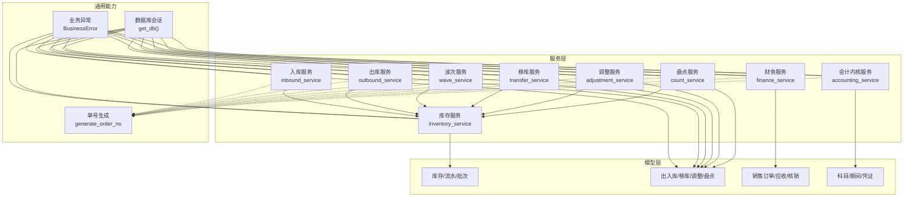
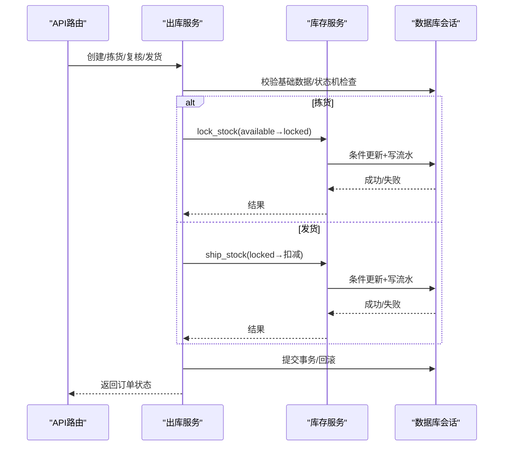
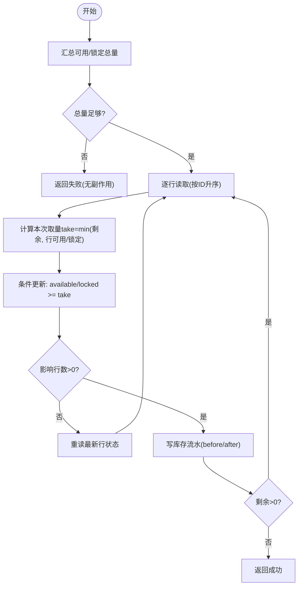
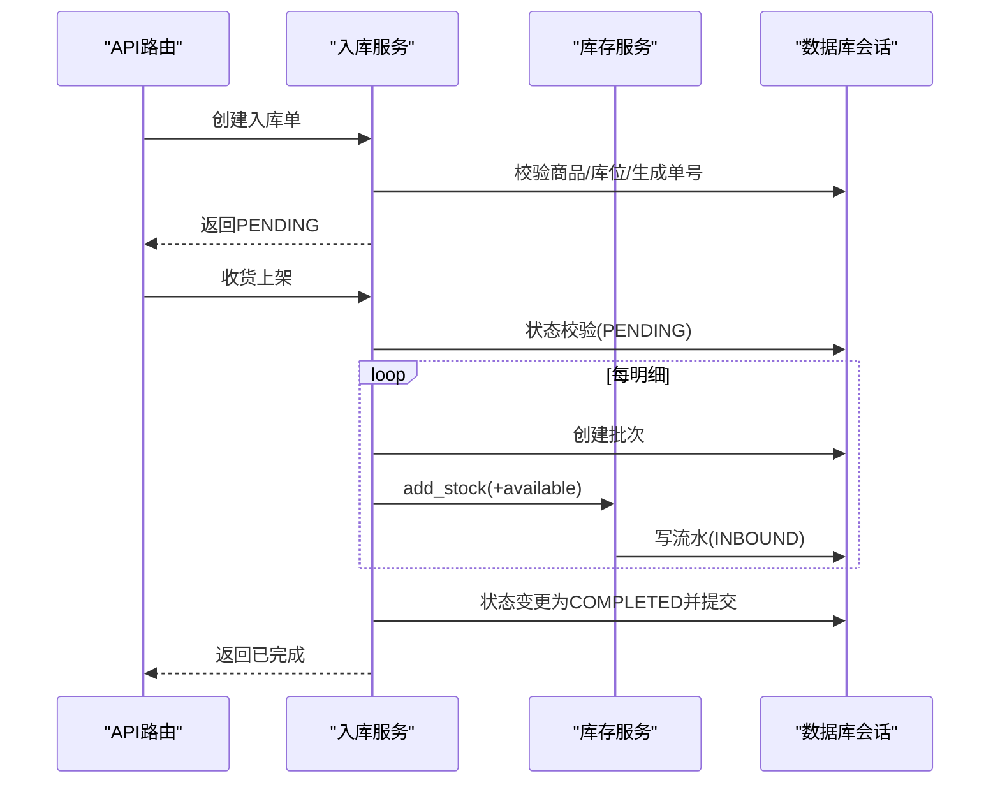
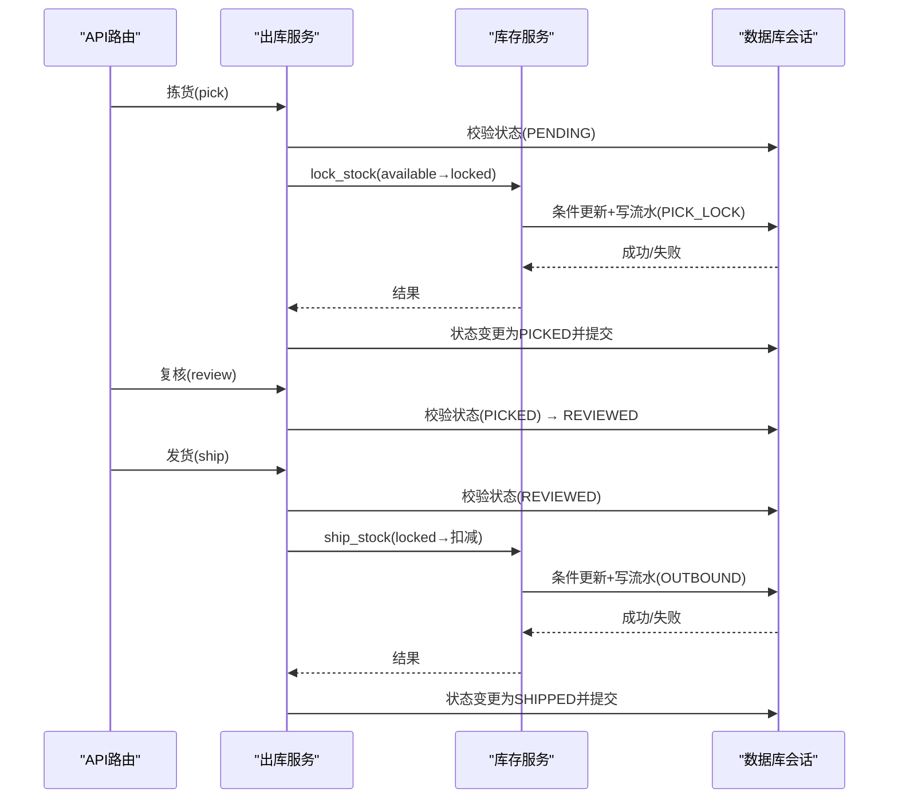
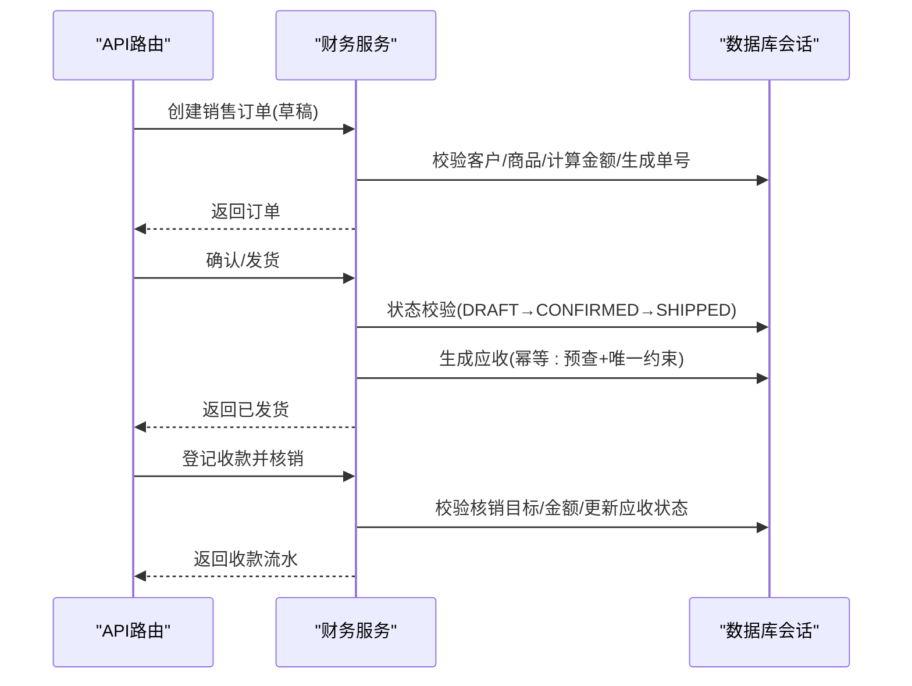
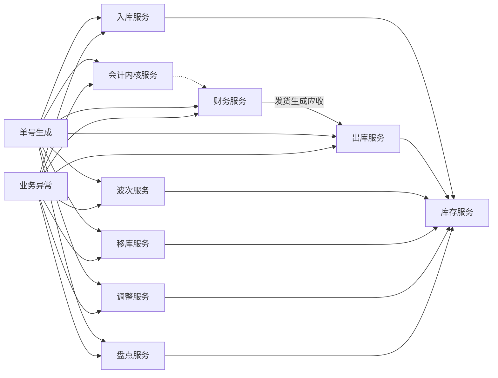

# 业务逻辑层设计

<cite>
**本文引用的文件**
- [inventory_service.py](file://backend-python/app/services/inventory_service.py)
- [outbound_service.py](file://backend-python/app/services/outbound_service.py)
- [inbound_service.py](file://backend-python/app/services/inbound_service.py)
- [finance_service.py](file://backend-python/app/services/finance_service.py)
- [accounting_service.py](file://backend-python/app/services/accounting_service.py)
- [adjustment_service.py](file://backend-python/app/services/adjustment_service.py)
- [count_service.py](file://backend-python/app/services/count_service.py)
- [transfer_service.py](file://backend-python/app/services/transfer_service.py)
- [wave_service.py](file://backend-python/app/services/wave_service.py)
- [order_no.py](file://backend-python/app/common/order_no.py)
- [errors.py](file://backend-python/app/common/errors.py)
- [database.py](file://backend-python/app/database.py)
- [models/__init__.py](file://backend-python/app/models/__init__.py)
- [schemas/__init__.py](file://backend-python/app/schemas/__init__.py)
</cite>

## 目录
1. [引言](#引言)
2. [项目结构](#项目结构)
3. [核心组件](#核心组件)
4. [架构总览](#架构总览)
5. [详细组件分析](#详细组件分析)
6. [依赖关系分析](#依赖关系分析)
7. [性能考量](#性能考量)
8. [故障排查指南](#故障排查指南)
9. [结论](#结论)
10. [附录](#附录)

## 引言
本设计文档聚焦WMS系统后端Python部分的“业务逻辑层（服务层）”，围绕库存管理、订单处理、财务核算三大核心领域，阐述服务职责划分、方法设计原则、事务与并发控制策略、业务规则验证、异常处理机制与日志记录策略，并给出跨服务协作的解耦设计与关键流程的代码级图示。目标是让读者在不深入代码细节的情况下，也能理解各服务的边界、数据流与一致性保障方式。

## 项目结构
- 服务层位于 backend-python/app/services，按领域拆分：库存、入库、出库、波次拣货、移库、调整、盘点、财务、会计内核等。
- 模型层位于 app/models，涵盖基础主数据、库存域、单据域、业财域、会计内核。
- Schema 层位于 app/schemas，统一使用 camelCase 与前端对齐。
- 通用能力位于 app/common，包含业务异常、单号生成等。
- 数据库连接与会话在 app/database 中提供，支持 SQLite 与 MySQL/PostgreSQL 切换。



**图表来源**
- [inventory_service.py:1-437](file://backend-python/app/services/inventory_service.py#L1-L437)
- [inbound_service.py:1-150](file://backend-python/app/services/inbound_service.py#L1-L150)
- [outbound_service.py:1-196](file://backend-python/app/services/outbound_service.py#L1-L196)
- [wave_service.py:1-238](file://backend-python/app/services/wave_service.py#L1-L238)
- [transfer_service.py:1-127](file://backend-python/app/services/transfer_service.py#L1-L127)
- [adjustment_service.py:1-123](file://backend-python/app/services/adjustment_service.py#L1-L123)
- [count_service.py:1-298](file://backend-python/app/services/count_service.py#L1-L298)
- [finance_service.py:1-607](file://backend-python/app/services/finance_service.py#L1-L607)
- [accounting_service.py:1-327](file://backend-python/app/services/accounting_service.py#L1-L327)
- [order_no.py:1-38](file://backend-python/app/common/order_no.py#L1-L38)
- [errors.py:1-9](file://backend-python/app/common/errors.py#L1-L9)
- [database.py:1-38](file://backend-python/app/database.py#L1-L38)

**章节来源**
- [models/__init__.py:1-78](file://backend-python/app/models/__init__.py#L1-L78)
- [schemas/__init__.py:1-68](file://backend-python/app/schemas/__init__.py#L1-L68)
- [database.py:1-38](file://backend-python/app/database.py#L1-L38)

## 核心组件
- 库存服务：所有库存变动的唯一入口，强制写流水；支持可用量与锁定量分离、跨批次扣减、并发安全（条件更新 + 重读重试）。
- 入库服务：创建入库单不改变库存；收货上架时生成批次、增加可用库存并写流水。
- 出库服务：状态机 PENDING→PICKED→REVIEWED→SHIPPED；拣货锁定、复核、发货扣减锁定库存。
- 波次服务：聚合多张待拣出库单生成波次与拣货单，按库位优先级排序；执行拣货驱动库存锁定与出库单状态推进。
- 移库服务：源库位扣减可用、目标库位增加可用，双向写流水。
- 调整服务：盘盈盘亏，正数加可用、负数扣可用（不足报错回滚）。
- 盘点服务：创建盘点单快照账面库存；完成盘点自动生成调整单并写流水，计算准确率指标。
- 财务服务：销售订单生命周期；发货生成应收（幂等）；收款登记与核销（部分核销、预收余额）；账龄与经营驾驶舱。
- 会计内核服务：科目树维护、期间管理、凭证草稿/过账/红字冲销、试算平衡。

**章节来源**
- [inventory_service.py:1-437](file://backend-python/app/services/inventory_service.py#L1-L437)
- [inbound_service.py:1-150](file://backend-python/app/services/inbound_service.py#L1-L150)
- [outbound_service.py:1-196](file://backend-python/app/services/outbound_service.py#L1-L196)
- [wave_service.py:1-238](file://backend-python/app/services/wave_service.py#L1-L238)
- [transfer_service.py:1-127](file://backend-python/app/services/transfer_service.py#L1-L127)
- [adjustment_service.py:1-123](file://backend-python/app/services/adjustment_service.py#L1-L123)
- [count_service.py:1-298](file://backend-python/app/services/count_service.py#L1-L298)
- [finance_service.py:1-607](file://backend-python/app/services/finance_service.py#L1-L607)
- [accounting_service.py:1-327](file://backend-python/app/services/accounting_service.py#L1-L327)

## 架构总览
服务层以“库存服务”为原子操作中心，其他业务服务通过调用库存服务实现库存变动，保证全量可追溯与一致性。订单类服务（入库、出库、移库、调整、盘点）负责状态机与业务编排；财务服务负责业财一体（发货即应收、收款核销、账龄）；会计内核服务提供科目、期间、凭证能力。



**图表来源**
- [outbound_service.py:102-176](file://backend-python/app/services/outbound_service.py#L102-L176)
- [inventory_service.py:147-251](file://backend-python/app/services/inventory_service.py#L147-L251)
- [database.py:31-38](file://backend-python/app/database.py#L31-L38)

## 详细组件分析

### 库存服务（Inventory Service）
- 职责：统一的库存读写入口，强制写 InventoryFlow 流水；支持 add/deduct/lock/ship 四类原子操作；查询库存、流水、批次。
- 并发与一致性：
  - 总量预检 + 逐行条件更新（available >= take / locked >= take），失败重读重试，避免并发覆盖。
  - 使用 with_for_update（PostgreSQL下生效）增强行级锁保护。
- 数据结构：
  - 库存行维度 (product_id, location_code, batch_id)，分离 available 与 locked。
  - 流水记录 flow_type、order_type、order_no、before/after 数量，确保可审计。
- 复杂度：
  - 扣减/锁定/发货为 O(k) 遍历库存行（k为涉及的行数），每次更新为O(1)。
  - 查询使用 joinedload 避免 N+1。



**图表来源**
- [inventory_service.py:91-144](file://backend-python/app/services/inventory_service.py#L91-L144)
- [inventory_service.py:147-202](file://backend-python/app/services/inventory_service.py#L147-L202)
- [inventory_service.py:205-251](file://backend-python/app/services/inventory_service.py#L205-L251)

**章节来源**
- [inventory_service.py:1-437](file://backend-python/app/services/inventory_service.py#L1-L437)

### 入库服务（Inbound Service）
- 职责：创建入库单（不改变库存）；收货上架时生成批次、增加可用库存并写流水。
- 事务策略：收货过程在一个事务内，任一步失败全部回滚。
- 业务规则：每个明细行生成一个批次（批次号=单号-明细id），支持有效期/追溯。



**图表来源**
- [inbound_service.py:38-129](file://backend-python/app/services/inbound_service.py#L38-L129)
- [inventory_service.py:75-88](file://backend-python/app/services/inventory_service.py#L75-L88)

**章节来源**
- [inbound_service.py:1-150](file://backend-python/app/services/inbound_service.py#L1-L150)

### 出库服务（Outbound Service）
- 职责：出库单状态机 PENDING→PICKED→REVIEWED→SHIPPED；拣货锁定、复核、发货扣减锁定库存。
- 并发与一致性：聚合明细后调用库存服务 lock/ship，任一环节失败整体回滚。
- 业务规则：拣货将 available 转为 locked；发货扣减 locked；库存不足抛出业务异常。



**图表来源**
- [outbound_service.py:102-176](file://backend-python/app/services/outbound_service.py#L102-L176)
- [inventory_service.py:147-251](file://backend-python/app/services/inventory_service.py#L147-L251)

**章节来源**
- [outbound_service.py:1-196](file://backend-python/app/services/outbound_service.py#L1-L196)

### 波次服务（Wave Service）
- 职责：聚合多张待拣出库单生成波次与拣货单；按库位优先级排序；执行拣货驱动库存锁定与出库单状态推进；波次自动完成。
- 业务规则：仅允许 PENDING 且未加入波次的出库单；拣货完成后波次进入 PICKING，全部完成则 COMPLETED。

```mermaid
sequenceDiagram
participant API as "API路由"
participant WAVE as "波次服务"
participant OUT as "出库服务"
participant INV as "库存服务"
participant DB as "数据库会话"
API->>WAVE : 创建波次(选择多个OUT订单)
WAVE->>DB : 校验订单状态/是否已在波次
WAVE->>DB : 生成波次与拣货单(聚合明细按库位优先级排序)
API->>WAVE : 拣货(执行拣货单)
WAVE->>INV : lock_stock(available→locked)
INV->>DB : 条件更新+写流水
WAVE->>DB : 拣货单→PICKED; 出库单→PICKED
WAVE->>DB : 波次首单→PICKING; 全部完成→COMPLETED
```

**图表来源**
- [wave_service.py:62-197](file://backend-python/app/services/wave_service.py#L62-L197)
- [inventory_service.py:147-202](file://backend-python/app/services/inventory_service.py#L147-L202)

**章节来源**
- [wave_service.py:1-238](file://backend-python/app/services/wave_service.py#L1-L238)

### 移库服务（Transfer Service）
- 职责：源库位扣减可用（MOVE_OUT），目标库位增加可用（MOVE_IN），双向写流水。
- 事务策略：单事务内完成，任一步失败回滚。

**章节来源**
- [transfer_service.py:1-127](file://backend-python/app/services/transfer_service.py#L1-L127)

### 调整服务（Adjustment Service）
- 职责：盘盈（+available）、盘亏（-available），不足时报错回滚。
- 业务规则：调整数量不能为0；盘亏走 deduct_stock 跨批次先扣早期批次。

**章节来源**
- [adjustment_service.py:1-123](file://backend-python/app/services/adjustment_service.py#L1-L123)

### 盘点服务（Count Service）
- 职责：创建盘点单（快照账面库存）→录入实盘数量→完成盘点；差异行自动生成调整单并写流水；计算准确率指标。
- 业务规则：完成前需全部录入实盘数量；盘亏不足整单回滚。

**章节来源**
- [count_service.py:1-298](file://backend-python/app/services/count_service.py#L1-L298)

### 财务服务（Finance Service）
- 职责：销售订单生命周期；发货生成应收（幂等）；收款登记与核销（部分核销、预收余额）；账龄与经营驾驶舱。
- 幂等策略：服务层预查 + DB唯一约束 + IntegrityError兜底。
- 账龄：以到期日为基准实时分段，不落库。



**图表来源**
- [finance_service.py:118-268](file://backend-python/app/services/finance_service.py#L118-L268)
- [finance_service.py:295-439](file://backend-python/app/services/finance_service.py#L295-L439)

**章节来源**
- [finance_service.py:1-607](file://backend-python/app/services/finance_service.py#L1-L607)

### 会计内核服务（Accounting Service）
- 职责：科目树维护、期间管理、凭证草稿/过账/红字冲销、试算平衡。
- 业务规则：仅明细科目可挂分录；已过账凭证禁改删；期间关闭后拒写凭证；反结账倒序。

**章节来源**
- [accounting_service.py:1-327](file://backend-python/app/services/accounting_service.py#L1-L327)

## 依赖关系分析
- 服务间耦合：
  - 订单类服务（入库、出库、移库、调整、盘点、波次）均依赖库存服务进行库存原子操作，形成“编排-原子”分层，降低耦合。
  - 财务服务与库存服务解耦：发货触发应收生成，但库存扣减由出库服务完成，财务只关注金额与核销。
  - 会计内核服务独立于业务单据，提供通用记账能力。
- 外部依赖：
  - 数据库会话通过 get_db 注入，支持 SQLite/MySQL/PostgreSQL。
  - 单号生成器 generate_order_no 在各服务中复用，保证全局唯一与日递增。
  - 业务异常 BusinessError 统一携带HTTP状态码，便于上层统一处理。



**图表来源**
- [inbound_service.py:1-150](file://backend-python/app/services/inbound_service.py#L1-L150)
- [outbound_service.py:1-196](file://backend-python/app/services/outbound_service.py#L1-L196)
- [wave_service.py:1-238](file://backend-python/app/services/wave_service.py#L1-L238)
- [transfer_service.py:1-127](file://backend-python/app/services/transfer_service.py#L1-L127)
- [adjustment_service.py:1-123](file://backend-python/app/services/adjustment_service.py#L1-L123)
- [count_service.py:1-298](file://backend-python/app/services/count_service.py#L1-L298)
- [finance_service.py:1-607](file://backend-python/app/services/finance_service.py#L1-L607)
- [accounting_service.py:1-327](file://backend-python/app/services/accounting_service.py#L1-L327)
- [order_no.py:1-38](file://backend-python/app/common/order_no.py#L1-L38)
- [errors.py:1-9](file://backend-python/app/common/errors.py#L1-L9)

**章节来源**
- [order_no.py:1-38](file://backend-python/app/common/order_no.py#L1-L38)
- [errors.py:1-9](file://backend-python/app/common/errors.py#L1-L9)
- [database.py:1-38](file://backend-python/app/database.py#L1-L38)

## 性能考量
- 批量聚合：出库/波次对同一(商品,库位)明细进行聚合，减少重复库存操作。
- 查询优化：广泛使用 joinedload 一次加载关联对象，避免 N+1。
- 并发安全：条件更新 + 重读重试，SQLite下虽无行锁但仍能避免覆盖；PostgreSQL下 with_for_update 增强一致性。
- 分页与过滤：列表接口支持分页与多维度过滤，降低响应体积。
- 流水记录：所有库存变动写 InventoryFlow，便于审计与问题定位，但需注意写入开销。

[本节为通用指导，无需特定文件引用]

## 故障排查指南
- 常见错误类型：
  - 库存不足：抛出 BusinessError 并附带商品与库位信息，调用方可捕获并提示用户。
  - 单号冲突：generate_order_no 可能因并发产生冲突，服务层捕获 IntegrityError 并重试（最多5次）。
  - 状态不允许：状态机检查失败抛出业务异常，需检查当前状态与期望状态。
  - 期间关闭：会计内核服务在期间关闭后拒绝凭证写入，需先反结账。
- 排查建议：
  - 查看 InventoryFlow 流水，定位具体变动来源与前后数量。
  - 核对订单状态机流转是否符合预期。
  - 检查数据库唯一约束与索引，确保单号与关联关系正确。
  - 使用分页与过滤缩小问题范围。

**章节来源**
- [errors.py:1-9](file://backend-python/app/common/errors.py#L1-L9)
- [outbound_service.py:96-100](file://backend-python/app/services/outbound_service.py#L96-L100)
- [inbound_service.py:77-82](file://backend-python/app/services/inbound_service.py#L77-L82)
- [wave_service.py:126-131](file://backend-python/app/services/wave_service.py#L126-L131)
- [accounting_service.py:119-123](file://backend-python/app/services/accounting_service.py#L119-L123)

## 结论
本业务逻辑层以“库存服务”为核心原子能力，通过清晰的状态机与事务边界，实现了库存、订单、财务、会计四大领域的解耦与一致性保障。服务间依赖明确、异常处理统一、流水可追溯，具备良好的扩展性与可维护性。未来可在高并发场景引入更细粒度的行锁与缓存策略，进一步提升吞吐与稳定性。

[本节为总结性内容，无需特定文件引用]

## 附录
- 术语说明：
  - 可用量(available)：可直接用于出库的库存。
  - 锁定量(locked)：已拣货但未发货的库存。
  - 流水(flow)：记录每次库存变动的不可变日志。
  - 账龄：以到期日为基准的逾期分段统计。
- 参考路径：
  - 库存扣减示例：[deduct_stock:91-144](file://backend-python/app/services/inventory_service.py#L91-L144)
  - 订单状态流转示例：[pick/review/ship:102-176](file://backend-python/app/services/outbound_service.py#L102-L176)
  - 财务核销示例：[register_receipt/allocate_receipt:411-439](file://backend-python/app/services/finance_service.py#L411-L439)

[本节为补充说明，无需特定文件引用]